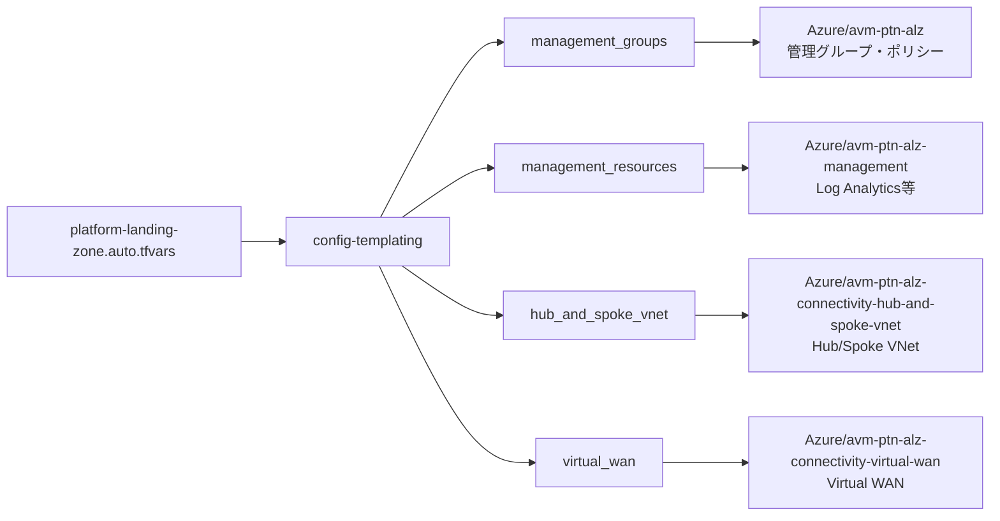

# Azure Landing Zones はじめました

## これは何？

Azureで会社のインフラを作るとき、適当に作ったらグチャグチャになりますよね。  
「あれ、このFirewall誰が作ったっけ？」「このサブスクリプションって本番用だっけ？」みたいな。

そこで登場するのがAzure Landing Zones。  
Microsoftが「こう作っておけば後悔しないよ」って教えてくれるベストプラクティスです。

このリポジトリは、そのLanding ZonesをTerraformで実装したものです。  
日本リージョン（東日本・西日本）で動くように調整済みです。

## どんな感じになるの？

実行すると、こんな環境ができあがります：

```
あなたのAzure環境
├── 管理グループ（会社組織みたいなもの）
│   ├── プラットフォーム（基盤チームが管理）
│   │   ├── 接続用（ネットワークとか）
│   │   ├── 管理用（ログとか監視とか）
│   │   └── ID管理用（将来の拡張用）
│   ├── ランディングゾーン（アプリチームが使う）
│   │   ├── 本番環境
│   │   └── 開発環境
│   └── サンドボックス（実験用）
│
├── ネットワーク
│   ├── 東日本のハブ（中央拠点）
│   │   ├── Azure Firewall（通信の番人）
│   │   ├── Bastion（安全なSSH/RDP接続）
│   │   ├── VPN Gateway（オンプレとつなぐ）
│   │   └── Private DNS（内部名前解決）
│   └── 西日本のハブ（災害対策）
│       └── （東日本と同じ構成）
│
├── 監視・管理
│   ├── Log Analytics（ログ全部ここに集約）
│   └── Automation Account（自動化タスク）
│
└── セキュリティポリシー（たくさんある）
    └── 例：「Public IPは勝手に作るな」とか

## ファイル構成を理解する

最初見たときは「ファイル多すぎ！」ってなると思いますが、役割分担があるので一個ずつ見ていきましょう

### メインの設定ファイル

**platform-landing-zone.auto.tfvars**  
ここだけ編集すればOK。全ての設定がこのファイルに集約されてます。

```hcl
# 東日本と西日本を使いたい？ ここに書く
starter_locations = ["japaneast", "japanwest"]

# Firewallは東日本だけでいい？ ここで切り替え
primary_firewall_enabled = true
secondary_firewall_enabled = false
```

変数名が長いですが、よく見ると規則性があります：
- `primary_xxx` → 東日本のリソース
- `secondary_xxx` → 西日本のリソース
- `xxx_enabled` → これを作るか作らないか

### モジュールたち

**modules/config-templating/**  
設定ファイルの中の`$${starter_location_01}`みたいなやつを実際の値に置き換えてくれる便利屋。

**modules/management_groups/**  
管理グループとポリシーをガッツリ作る。200個くらいポリシーができます。

**modules/management_resources/**  
Log AnalyticsとAutomation Accountを作る。全サブスクリプションのログがここに集まる仕組み。

### メインの処理ファイル

**main.connectivity.hub.and.spoke.virtual.network.tf**  
ハブ・スポーク型ネットワークを作る。名前が長いのは勘弁してください。

**main.connectivity.virtual.wan.tf**  
Virtual WANを作る。大規模なネットワーク構成が必要なときはこっち。

**main.management.tf**  
管理グループ関連の処理。

**main.resource.groups.tf**  
リソースグループを作る。地味だけど大事。

## 動かしてみる

### 事前準備

1. Azureサブスクリプションが3つ必要です
   - Management用（管理リソース置く）
   - Connectivity用（ネットワーク置く）
   - 残り1つ（将来の拡張用）

2. GitHub Secretsに以下を設定：
   - `AZURE_CLIENT_ID`
   - `AZURE_TENANT_ID`
   - `AZURE_SUBSCRIPTION_ID`
   - サブスクリプションIDも別途設定

3. terraform.tfvars.jsonに秘密の情報を書く：
   ```json
   {
     "subscription_ids": {
       "management": "あなたのサブスクリプションID",
       "connectivity": "あなたのサブスクリプションID"
     }
   }
   ```

### 実行方法

GitHub Actionsで動きます。手元でTerraform叩く必要なし。

1. GitHubの「Actions」タブを開く
2. 「02 Azure Landing Zones Continuous Delivery」を選ぶ
3. 「Run workflow」をクリック
4. `terraform_action`は`apply`のまま
5. 「Run workflow」をクリック

あとは待つだけ。コーヒーでも飲んでてください。15分くらいかかります。

### 削除したいとき

同じ手順で`terraform_action`を`destroy`に変えるだけ。  
作ったもの全部消えます。ポリシーも管理グループも全部。

## ハマりポイントと解決策

### 東日本・西日本でBastion作れない！

Availability Zonesがサポートされてなかった、日本リージョンは。  
なので`platform-landing-zone.auto.tfvars`でこう書く：

```hcl
bastion = {
  zones = []  # ← これ大事
  bastion_public_ip = {
    zones = []  # ← これも大事
  }
}
```

### Policyがエラーになる

Azureのポリシー作成って、200個以上を一気に作るので、たまにタイミングの問題でコケます。  
もう一回実行すれば直ります。terraformは冪等性があるので失敗してももう一回やればいけること多いです。

### どのモジュールがどれを使ってるかわからん

依存関係の図を作りました：



## カスタマイズしたいとき

### 東日本だけで動かしたい

```hcl
starter_locations = ["japaneast"]  # 1個だけにする

# セカンダリを全部falseにする
secondary_firewall_enabled = false
secondary_bastion_enabled = false
secondary_virtual_network_gateway_express_route_enabled = false
secondary_virtual_network_gateway_vpn_enabled = false
```

### Firewallいらない

```hcl
primary_firewall_enabled = false
secondary_firewall_enabled = false
```

ただし、この場合はルートテーブルとかも調整が必要です。（デフォルトルートがfwなので）

### ポリシーを追加したい

`lib/`フォルダの中のYAMLファイルを編集します。

```yaml
# lib/archetype_definitions/corp_custom.alz_archetype_override.yaml
archetypes:
  corp:
    policy_assignments:
      - my-custom-policy  # ← ここに追加
```

## 内部の仕組み

### テンプレート置換

`$${starter_location_01}`って書いたら`japaneast`になる仕組み。

1. `platform-landing-zone.auto.tfvars`を読む
2. `modules/config-templating`で`$${xxx}`を探す
3. 実際の値に置き換える
4. 各モジュールに渡す

これのおかげで、同じ設定を複数リージョンでコピペせずに済んでます。

### ポリシーの適用順序

```
1. Policy Definitions を作る（ルールの定義）
   ↓
2. Policy Set Definitions を作る（ルールのセット）
   ↓
3. Policy Assignments を作る（実際に適用）
```

この順序を守らないとエラーになります。Terraformが自動でやってくれるけど。

### GitHub Actions ワークフロー

`.github/workflows/cd.yaml`が本体です。  
でも実際の処理は`alz-mgmt-templates`リポジトリの`cd-template.yaml`に書いてあります。

なんでこんな構成？  
→ 複数のリポジトリで同じワークフローを使い回すため。

## トラブルシューティング

### エラーログの見方

GitHub Actionsでエラーが出たら：

```bash
gh run list --limit 3
gh run view <RUN_ID> --log-failed
```

失敗したステップのログだけ見れます。

### よくあるエラー

**「PublicIPAddressCannotBeDeleted」**  
→ Bastionが使ってるPublic IPを削除しようとしてる。先にBastionを消さないとダメ。
　Bastionが可用性ゾーンに対応してないから、設定変更したときになりました。

**「PolicySetDefinitionNotFound」**  
→ Azureの同期タイミングの問題。もう一回実行すればOK。

**「BastionRegionAzNotSupported」**  
→ 日本リージョンはAvailability Zones非対応。`zones = []`を設定してね。

## このリポジトリを作り直す手順

もし一から同じ環境を作りたかったら：

1. このリポジトリをクローン
2. `terraform.tfvars.json`にサブスクリプションID書く
3. `platform-landing-zone.auto.tfvars`を自分用にカスタマイズ
4. GitHub Secretsを設定
5. GitHub Actionsを実行

以上。意外と簡単にできる(?)

## 参考リンク

- [Azure Landing Zones 公式ドキュメント](https://learn.microsoft.com/azure/cloud-adoption-framework/ready/landing-zone/)
- [Azure Verified Modules](https://azure.github.io/Azure-Verified-Modules/)
- [Terraform Registry - ALZ Module](https://registry.terraform.io/modules/Azure/avm-ptn-alz/azurerm/latest)

## 最後に

このリポジトリ、最初は「何これ？」ってなると思います。  
でも一度理解すれば、Azureのエンタープライズ環境を一瞬で作れるようになります。

困ったらissue立ててください。  
日本語でおK。

---

作成日: 2026年1月  
最終更新: 2026年1月16日
