# Azure Landing Zones Accelerator - Terraform モジュール 完全ガイド

## 📚 このリポジトリについて

このリポジトリは、Azure Landing Zones (ALZ) Accelerator を Terraform で実装するための**プラットフォーム着陸ゾーン(Platform Landing Zone)** です。企業のAzure環境を複数地域にわたって、セキュアかつスケーラブルに構築するためのコンプリート・ソリューションです。

**このリポジトリを理解すれば、以下ができるようになります：**
- 複数地域にまたがるハブ・アンド・スポーク型ネットワークアーキテクチャを構築
- Virtual WANを使用した大規模なネットワーク接続を実装
- 階層的な管理グループと Azure Policy による統一されたガバナンス体制を構築
- ログ分析とオートメーションを含む中央管理リソースをデプロイ
- DDoS保護とプライベートDNSゾーンを統合

---

## 🎯 全体アーキテクチャ図

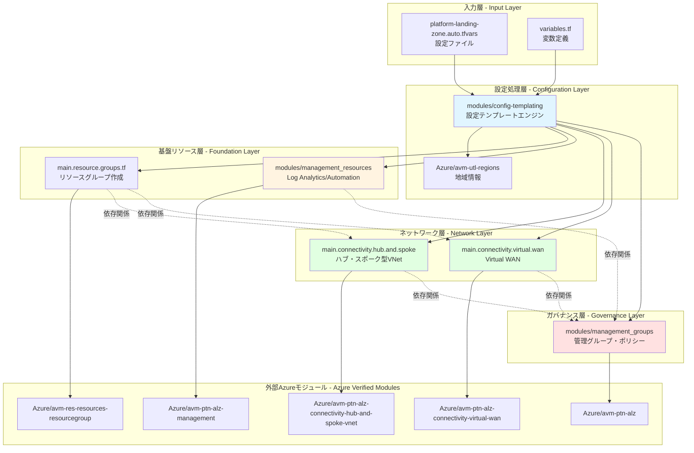

---

## 🔄 データフロー図

このリポジトリがどのように設定を処理し、Azureリソースにデプロイするかを示します。

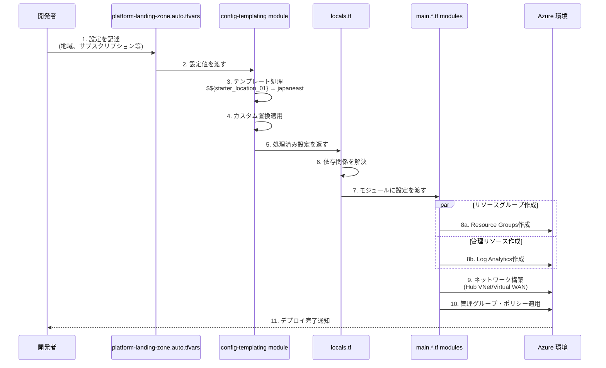

---

## 🏗️ リポジトリ構造の詳細

```
alz-mgmt/
├── 📄 terraform.tf                                    # Terraformプロバイダー設定
│   ├── Provider: alz (v0.20.0)                        # Azure Landing Zones専用
│   ├── Provider: azurerm (v4.0)                       # Azure標準リソース管理
│   ├── Provider: azapi (v2.0)                         # Azure Management API
│   └── Backend: azurerm                               # State管理 (Azure Storage)
│
├── 📄 variables.tf                                    # グローバル変数定義
│   ├── starter_locations: デプロイ地域
│   ├── subscription_ids: サブスクリプションマッピング
│   ├── connectivity_type: ネットワークアーキテクチャ選択
│   └── 各種設定オブジェクト
│
├── 📄 locals.tf                                       # ローカル値とロジック
│   ├── 条件分岐 (connectivity_type判定)
│   ├── モジュール間依存関係の定義
│   └── 設定のマージ処理
│
├── 📄 platform-landing-zone.auto.tfvars               # 設定値 (自動ロード)
│   ├── 地域設定
│   ├── カスタム置換トークン
│   ├── ネットワーク構成
│   └── 管理グループ設定
│
├── 📂 modules/                                        # ローカルモジュール
│   │
│   ├── 📂 config-templating/                          # 🔑 設定テンプレートエンジン
│   │   ├── data.tf
│   │   │   └── module "regions"                       # → Azure/avm-utl-regions
│   │   ├── locals.config.tf                           # テンプレート処理ロジック
│   │   │   ├── 組み込み置換トークン生成
│   │   │   ├── カスタム置換の適用
│   │   │   └── JSON→HCL変換
│   │   ├── variables.tf                               # 入力変数
│   │   └── outputs.tf                                 # 処理済み設定の出力
│   │
│   ├── 📂 management_groups/                          # 🏛️ 管理グループとポリシー
│   │   ├── main.tf
│   │   │   └── module "management_groups"             # → Azure/avm-ptn-alz
│   │   │       ├── 管理グループ階層の作成
│   │   │       ├── Azure Policy定義
│   │   │       ├── Policy割り当て
│   │   │       └── RBACロール割り当て
│   │   ├── variables.tf
│   │   └── locals.tf
│   │
│   └── 📂 management_resources/                       # 📊 管理リソース
│       ├── main.tf
│       │   └── module "management_resources"          # → Azure/avm-ptn-alz-management
│       │       ├── Log Analytics Workspace
│       │       ├── Automation Account
│       │       ├── Data Collection Rules
│       │       └── Sentinel (オプション)
│       ├── variables.tf
│       └── outputs.tf
│
├── 📄 main.config.tf                                  # 設定処理の呼び出し
│   └── module "config"                                # → ./modules/config-templating
│
├── 📄 main.resource.groups.tf                         # リソースグループ管理
│   └── module "resource_groups" (for_each)            # → Azure/avm-res-resources-resourcegroup
│       └── Connectivity用RG作成
│
├── 📄 main.connectivity.hub.and.spoke.virtual.network.tf  # ハブ・スポーク型
│   └── module "hub_and_spoke_vnet"                    # → Azure/avm-ptn-alz-connectivity-hub-and-spoke-vnet
│       ├── Hub VNet作成
│       ├── Spoke VNet作成
│       ├── VNet Peering
│       ├── Azure Firewall
│       ├── VPN Gateway
│       ├── ExpressRoute Gateway
│       └── Private DNS Zones
│
├── 📄 main.connectivity.virtual.wan.tf                # Virtual WAN型
│   └── module "virtual_wan"                           # → Azure/avm-ptn-alz-connectivity-virtual-wan
│       ├── Virtual WAN作成
│       ├── Virtual Hub作成
│       ├── VPN Gateway
│       ├── ExpressRoute Gateway
│       └── Routing設定
│
├── 📄 main.management.tf                              # 管理モジュール呼び出し
│   ├── module "management_resources"                  # → ./modules/management_resources
│   └── module "management_groups"                     # → ./modules/management_groups
│
├── 📄 outputs.tf                                      # 出力値定義
│
└── 📂 lib/                                            # ALZライブラリカスタマイズ
    ├── alz_library_metadata.json                      # メタデータ
    │   └── 依存: platform/alz@2025.09.3
    │
    └── 📂 archetype_definitions/                      # ポリシーアーキタイプ
        ├── root_custom.alz_archetype_override.yaml
        ├── platform_custom.alz_archetype_override.yaml
        ├── management_custom.alz_archetype_override.yaml
        ├── connectivity_custom.alz_archetype_override.yaml
        ├── identity_custom.alz_archetype_override.yaml
        ├── landing_zones_custom.alz_archetype_override.yaml
        ├── corp_custom.alz_archetype_override.yaml
        ├── online_custom.alz_archetype_override.yaml
        ├── sandbox_custom.alz_archetype_override.yaml
        ├── security_custom.alz_archetype_override.yaml
        └── decommissioned_custom.alz_archetype_override.yaml
```

---

## 🏗️ リポジトリ構造の概要

```
alz-mgmt/
├── main.config.tf                                  # 設定テンプレート処理の主要モジュール
├── main.management.tf                              # 管理リソース（Log Analytics等）
├── main.resource.groups.tf                         # リソースグループ管理
├── main.connectivity.hub.and.spoke.virtual.network.tf  # ハブ・スポーク型ネットワーク
├── main.connectivity.virtual.wan.tf                # Virtual WAN接続
├── terraform.tf                                    # Terraformプロバイダー設定
├── variables.tf                                    # メイン変数定義
├── locals.tf                                       # ローカル値とロジック
├── platform-landing-zone.auto.tfvars               # デフォルト設定と組み込み置換
├── outputs.tf                                      # 出力値
│
├── lib/                                            # ALZライブラリのカスタマイズ
│   ├── alz_library_metadata.json                   # ライブラリメタデータ
│   └── archetype_definitions/                      # ポリシーアーキタイプのカスタマイズ
│       ├── connectivity_custom.alz_archetype_override.yaml
│       ├── management_custom.alz_archetype_override.yaml
│       ├── identity_custom.alz_archetype_override.yaml
│       └── ...（その他の機能別カスタマイズ）
│
└── modules/                                        # 再利用可能なモジュール
    ├── config-templating/                          # 設定テンプレートエンジン
    │   ├── variables.tf                            # 入力パラメータ
    │   ├── locals.tf                               # ローカル処理
    │   └── outputs.tf                              # テンプレート処理結果
    ├── management_groups/                          # 管理グループとポリシー配置
    │   ├── main.tf
    │   ├── variables.tf
    │   └── locals.tf
    └── management_resources/                       # Log Analytics等の管理リソース
        ├── main.tf
        └── variables.tf
```

---

## 🔑 主要なコンセプト

### 1. **設定テンプレートエンジン** (config-templating モジュール)

**役割**: YAML/JSONベースの設定を Terraform の変数に変換する

#### モジュール構造図

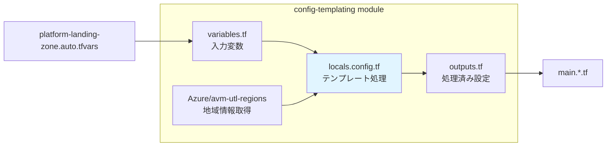

#### テンプレート処理フロー

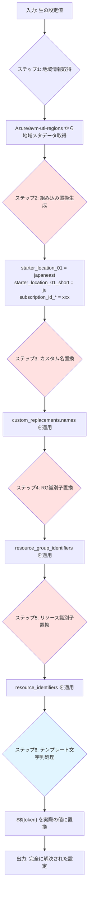

#### 参照モジュール詳細

**Azure/avm-utl-regions (v0.9.2)**
- **目的**: Azureの全地域情報を提供
- **提供データ**:
  - `geo_code`: 地域の短縮コード (例: "je" for Japan East)
  - `short_name`: 短縮名
  - `display_name`: 表示名
  - `paired_region`: ペアリージョン情報

**処理ロジック (locals.config.tf の核心)**:

```hcl
# 1. 地域短縮コードの自動生成
starter_locations_short = {
  for i, location in var.starter_locations :
  "starter_location_${format("%02d", i + 1)}_short" => coalesce(
    var.starter_locations_short["..."],  # ユーザー指定優先
    module.regions.regions_by_name[location].geo_code,  # 公式geo_code
    module.regions.regions_by_name[location].short_name, # short_name
    location  # フォールバック
  )
}

# 2. 組み込み置換トークン
built_in_replacements = {
  starter_location_01 = "japaneast"
  starter_location_01_short = "je"
  subscription_id_connectivity = "xxx-xxx-xxx"
  # ...
}

# 3. カスタム置換の段階的適用
custom_names_json = jsonencode(var.custom_replacements.names)
custom_names_json_templated = templatestring(custom_names_json, built_in_replacements)
custom_names = jsondecode(custom_names_json_templated)

# 4. 最終的な置換マップ
final_replacements = merge(
  built_in_replacements,
  custom_names,
  custom_resource_group_identifiers,
  custom_resource_identifiers
)

# 5. すべての入力にテンプレート適用
outputs = { 
  for key, value in var.inputs : 
  key => jsondecode(templatestring(jsonencode(value), final_replacements)) 
}
```

**実際の動作例**:

```yaml
# 入力 (platform-landing-zone.auto.tfvars)
hub_virtual_networks = [
  {
    name = "hub-$${starter_location_01}"
    location = "$${starter_location_01}"
    resource_group_name = "rg-connectivity-$${starter_location_01_short}"
  }
]

# ↓ テンプレート処理後

# 出力 (module.config.outputs.hub_virtual_networks)
hub_virtual_networks = [
  {
    name = "hub-japaneast"
    location = "japaneast"
    resource_group_name = "rg-connectivity-je"
  }
]
```

---

### 2. **管理グループ階層とポリシー** (management_groups モジュール)

**役割**: Azureの統一的ガバナンス体制を構築

#### 管理グループ階層図

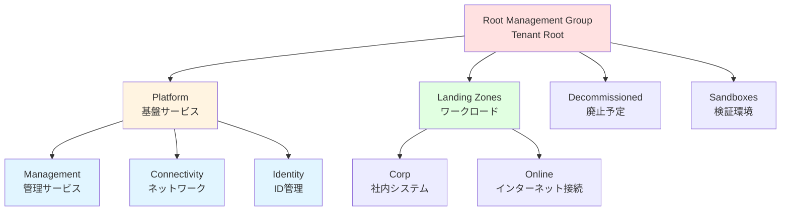

#### ポリシー適用の流れ

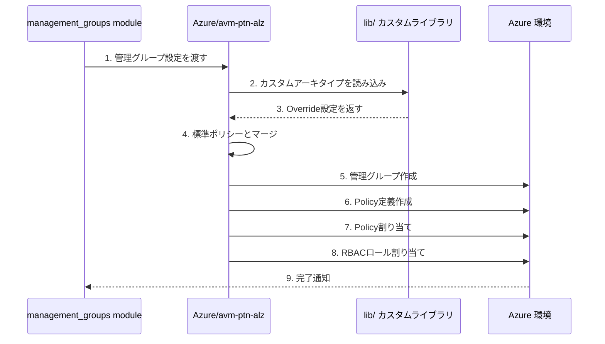

#### 参照モジュール詳細

**Azure/avm-ptn-alz (v0.14.1)**
- **目的**: Azure Landing Zones の管理グループとポリシーフレームワーク
- **機能**:
  - 階層的な管理グループ作成
  - 200以上のAzure Policy定義
  - Policy Set (Initiative) の管理
  - カスタムロール定義
  - RBAC割り当ての自動化
  - サブスクリプション配置
  - 自動リトライ機能

**主要な設定項目**:

```hcl
module "management_groups" {
  source = "Azure/avm-ptn-alz/azurerm"
  
  # アーキテクチャ名 (lib/で定義されたカスタム構造)
  architecture_name = "alz_custom"
  
  # 親管理グループ (通常はTenant Root)
  parent_resource_id = var.root_parent_management_group_id
  
  # ポリシーのデフォルト値
  policy_default_values = {
    log_analytics_workspace_id = module.management_resources.log_analytics_workspace_id
    automation_account_id = module.management_resources.automation_account_id
  }
  
  # 依存関係 (ポリシー適用を最後に実行)
  dependencies = {
    policy_assignments = [
      module.management_resources,
      module.hub_and_spoke_vnet
    ]
  }
}
```

**lib/ カスタマイズの仕組み**:

```yaml
# lib/archetype_definitions/management_custom.alz_archetype_override.yaml

# 標準ALZのManagementアーキタイプを上書き
alz_archetype_override:
  name: management
  
  # 追加するポリシー割り当て
  policy_assignments:
    - name: custom_require_tags
      policy_definition_name: require_tags_on_resources
      parameters:
        tagNames: ["Environment", "CostCenter"]
        effect: "Deny"
  
  # 除外するポリシー (標準から削除)
  policy_assignments_to_remove:
    - deny_public_ip
  
  # カスタムロール定義
  role_definitions:
    - name: custom_network_reader
      permissions:
        - "Microsoft.Network/*/read"
```

---

### 3. **リソースグループ管理** (main.resource.groups.tf)

#### 動的リソースグループ作成フロー

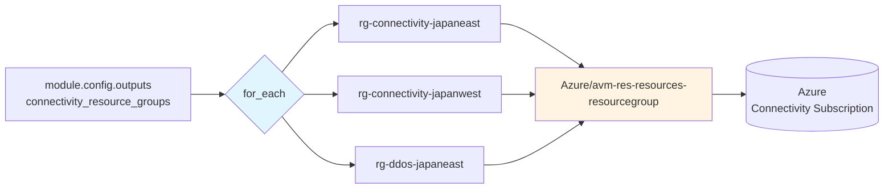

#### 参照モジュール詳細

**Azure/avm-res-resources-resourcegroup (v0.2.1)**
- **目的**: Azure リソースグループの標準化された作成
- **機能**:
  - リソースグループ作成
  - タグ管理
  - ロック設定
  - RBAC割り当て
  - テレメトリ収集

**実装コード**:

```hcl
module "resource_groups" {
  source = "Azure/avm-res-resources-resourcegroup/azurerm"
  version = "0.2.1"
  
  # 動的に複数のRGを作成
  for_each = { 
    for key, value in module.config.outputs.connectivity_resource_groups : 
    key => value 
    if try(value.settings.enabled, true)  # 有効なRGのみ
  }
  
  name = each.value.name
  location = each.value.location
  tags = each.value.tags ?? module.config.outputs.tags
  
  # Connectivityサブスクリプションにデプロイ
  providers = {
    azurerm = azurerm.connectivity
  }
}
```

**設定例 (platform-landing-zone.auto.tfvars)**:

```yaml
connectivity_resource_groups = {
  primary = {
    name = "rg-connectivity-$${starter_location_01_short}"
    location = "$${starter_location_01}"
    tags = {
      Environment = "Production"
      ManagedBy = "Terraform"
    }
  }
  secondary = {
    name = "rg-connectivity-$${starter_location_02_short}"
    location = "$${starter_location_02}"
  }
}
```

---

### 4. **ネットワーク接続アーキテクチャ**

#### A. ハブ・アンド・スポーク型 (Hub and Spoke)

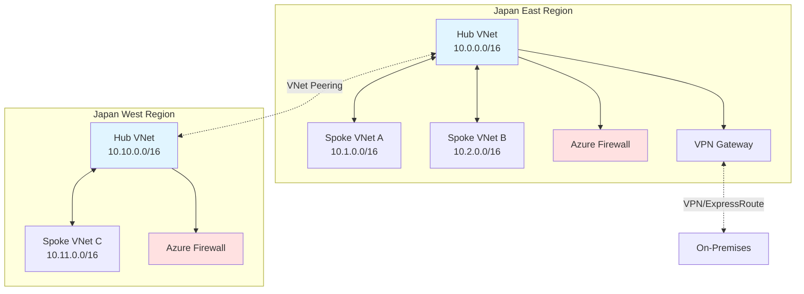

#### 参照モジュール詳細

**Azure/avm-ptn-alz-connectivity-hub-and-spoke-vnet (v0.16.8)**
- **目的**: マルチリージョンのHub-Spokeネットワークを構築
- **デプロイされるリソース**:
  - Hub VNet (各リージョン)
  - Spoke VNet (複数)
  - VNet Peering (Hub-Spoke間、Hub-Hub間)
  - Azure Firewall (各Hub)
  - Azure Firewall Policy
  - VPN Gateway
  - ExpressRoute Gateway
  - Azure Bastion
  - DDoS Protection Plan
  - Private DNS Zones (60以上のゾーン)
  - Route Tables
  - Network Security Groups

**設定例**:

```hcl
hub_virtual_networks = [
  {
    name = "hub-japaneast"
    location = "japaneast"
    resource_group_name = "rg-connectivity-je"
    address_space = ["10.0.0.0/16"]
    
    # サブネット設定
    subnets = {
      AzureFirewallSubnet = {
        address_prefixes = ["10.0.1.0/24"]
      }
      GatewaySubnet = {
        address_prefixes = ["10.0.2.0/24"]
      }
    }
    
    # Azure Firewall
    firewall = {
      enabled = true
      sku_name = "AZFW_VNet"
      sku_tier = "Standard"
    }
    
    # VPN Gateway
    virtual_network_gateways = {
      vpn = {
        enabled = true
        sku = "VpnGw2"
      }
    }
  }
]
```

---

#### B. Virtual WAN型

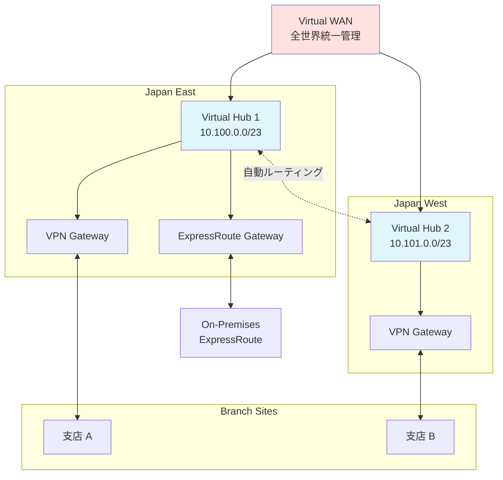

#### 参照モジュール詳細

**Azure/avm-ptn-alz-connectivity-virtual-wan (v0.13.5)**
- **目的**: スケーラブルなVirtual WANアーキテクチャを構築
- **デプロイされるリソース**:
  - Virtual WAN
  - Virtual Hub (複数リージョン)
  - VPN Gateway (各Hub)
  - ExpressRoute Gateway (各Hub)
  - Azure Firewall (Hub統合型)
  - Routing Intent/Policies
  - VNet Connections
  - DDoS Protection Plan
  - Private DNS Zones

**特徴**:
- Hub間の自動メッシュルーティング
- グローバルトランジット接続
- 簡素化された管理
- スケーラビリティ

---

### 5. **管理リソース** (management_resources モジュール)

#### デプロイされるリソース図

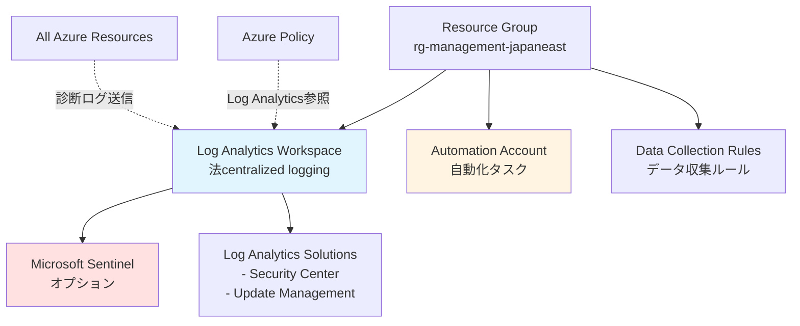

#### 参照モジュール詳細

**Azure/avm-ptn-alz-management (v0.9.0)**
- **目的**: 中央管理リソースの統合デプロイ
- **主要機能**:
  - **Log Analytics Workspace**:
    - すべてのサブスクリプションからのログ集約
    - 保持期間設定 (30-730日)
    - クォータ管理
    - CMK暗号化サポート
  - **Automation Account**:
    - Runbook実行
    - Update Management
    - Change Tracking
  - **Data Collection Rules**:
    - VM監視設定
    - パフォーマンスカウンター収集
    - イベントログ収集
  - **Microsoft Sentinel** (オプション):
    - SIEM/SOAR機能
    - 脅威検出

**設定例**:

```hcl
management_resource_settings = {
  location = "japaneast"
  
  # Log Analytics設定
  log_analytics_workspace_name = "law-management-japaneast"
  log_analytics_workspace_retention_in_days = 90
  log_analytics_workspace_sku = "PerGB2018"
  log_analytics_workspace_daily_quota_gb = 10
  
  # Sentinel有効化
  sentinel_onboarding = {
    enabled = true
  }
  
  # ソリューション
  log_analytics_solution_plans = [
    {
      product   = "OMSGallery/Security"
      publisher = "Microsoft"
    },
    {
      product   = "OMSGallery/Updates"
      publisher = "Microsoft"
    }
  ]
}
```

---

---

## 📋 使用している全Azure Verified Modules (AVM) 一覧

このリポジトリで参照しているすべての外部モジュールの詳細です。

### 1. **Azure/avm-utl-regions** (v0.9.2)
- **タイプ**: Utility Module
- **Registry**: https://registry.terraform.io/modules/Azure/avm-utl-regions/azurerm
- **目的**: Azure全地域の情報提供
- **使用箇所**: `modules/config-templating/data.tf`
- **提供データ**: geo_code, short_name, display_name, paired_region

### 2. **Azure/avm-ptn-alz** (v0.14.1)
- **タイプ**: Pattern Module
- **Registry**: https://registry.terraform.io/modules/Azure/avm-ptn-alz/azurerm
- **目的**: Azure Landing Zones管理グループ構造とポリシーフレームワーク
- **使用箇所**: `modules/management_groups/main.tf`
- **主要機能**:
  - 管理グループ階層作成
  - 200+ Azure Policy定義
  - Policy Set (Initiative) 管理
  - カスタムロール定義
  - RBAC自動割り当て
  - サブスクリプション配置
  - 自動リトライ機能

### 3. **Azure/avm-ptn-alz-management** (v0.9.0)
- **タイプ**: Pattern Module
- **Registry**: https://registry.terraform.io/modules/Azure/avm-ptn-alz-management/azurerm
- **目的**: ALZ Management リソース統合デプロイ
- **使用箇所**: `modules/management_resources/main.tf`
- **デプロイリソース**:
  - Log Analytics Workspace
  - Automation Account
  - Data Collection Rules
  - Log Analytics Solutions
  - Microsoft Sentinel (オプション)
  - User Assigned Managed Identities

### 4. **Azure/avm-res-resources-resourcegroup** (v0.2.1)
- **タイプ**: Resource Module
- **Registry**: https://registry.terraform.io/modules/Azure/avm-res-resources-resourcegroup/azurerm
- **目的**: Azure Resource Group標準化作成
- **使用箇所**: `main.resource.groups.tf`
- **機能**:
  - リソースグループ作成
  - タグ管理
  - ロック設定
  - RBAC割り当て

### 5. **Azure/avm-ptn-alz-connectivity-hub-and-spoke-vnet** (v0.16.8)
- **タイプ**: Pattern Module
- **Registry**: https://registry.terraform.io/modules/Azure/avm-ptn-alz-connectivity-hub-and-spoke-vnet/azurerm
- **目的**: マルチリージョンHub-Spokeネットワーク
- **使用箇所**: `main.connectivity.hub.and.spoke.virtual.network.tf`
- **デプロイリソース**:
  - Hub VNet (マルチリージョン)
  - Spoke VNet
  - VNet Peering (Hub-Spoke, Hub-Hub)
  - Azure Firewall + Policy
  - VPN Gateway
  - ExpressRoute Gateway
  - Azure Bastion
  - DDoS Protection Plan
  - Private DNS Zones (60+)
  - Route Tables
  - Network Security Groups

### 6. **Azure/avm-ptn-alz-connectivity-virtual-wan** (v0.13.5)
- **タイプ**: Pattern Module
- **Registry**: https://registry.terraform.io/modules/Azure/avm-ptn-alz-connectivity-virtual-wan/azurerm
- **目的**: グローバルVirtual WANアーキテクチャ
- **使用箇所**: `main.connectivity.virtual.wan.tf`
- **デプロイリソース**:
  - Virtual WAN
  - Virtual Hub (マルチリージョン)
  - VPN Gateway (Hub統合)
  - ExpressRoute Gateway (Hub統合)
  - Azure Firewall (Hub統合)
  - Routing Intent/Policies
  - VNet Connections
  - DDoS Protection Plan
  - Private DNS Zones

---

## 🔗 モジュール依存関係マップ

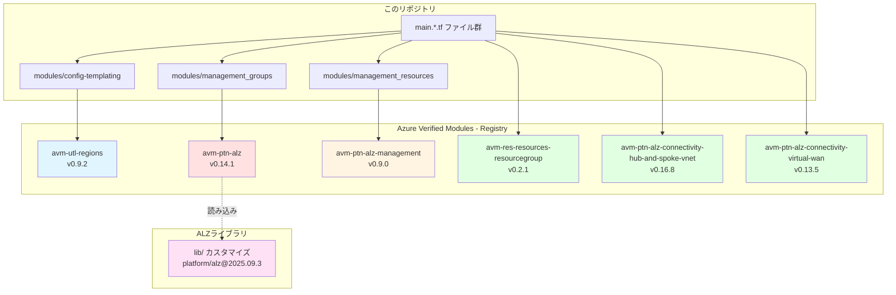

---

## 📋 ファイル別詳細解説

### **terraform.tf** - Terraform とプロバイダー設定

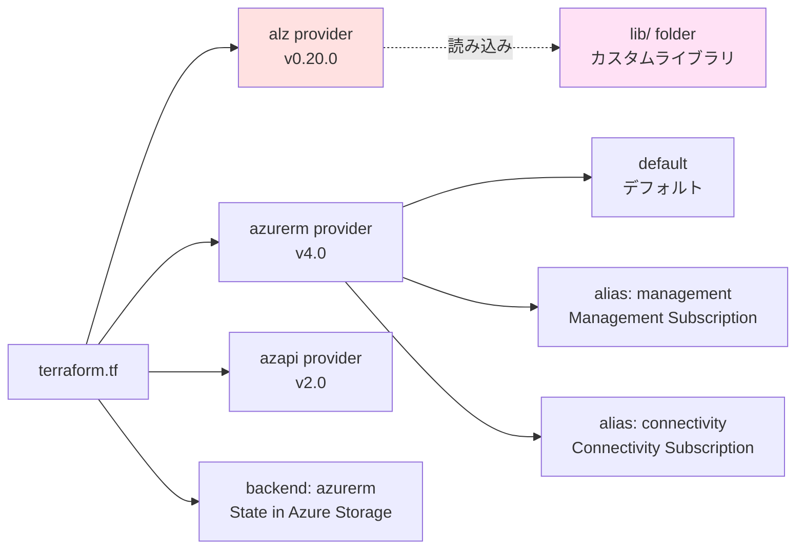

**コード解説**:

```hcl
terraform {
  required_version = "~> 1.12"
  
  required_providers {
    # ALZ専用プロバイダー (管理グループ・ポリシー管理)
    alz = {
      source  = "Azure/alz"
      version = "0.20.0"
    }
    
    # Azure標準プロバイダー
    azurerm = {
      source  = "hashicorp/azurerm"
      version = "~> 4.0"
    }
    
    # Azure Management API プロバイダー
    azapi = {
      source  = "Azure/azapi"
      version = "~> 2.0"
    }
  }
  
  # State ファイルをAzure Storageで管理
  backend "azurerm" {}
}

# ALZプロバイダー設定
provider "alz" {
  library_overwrite_enabled = true  # カスタムライブラリで標準を上書き
  library_references = [
    {
      custom_url = "${path.root}/lib"  # lib/フォルダーを参照
    }
  ]
}

# デフォルトプロバイダー
provider "azurerm" {
  resource_provider_registrations = "none"  # 自動登録無効
  features {}
}

# Management サブスクリプション専用
provider "azurerm" {
  alias = "management"
  subscription_id = var.subscription_ids["management"]
  features {}
}

# Connectivity サブスクリプション専用
provider "azurerm" {
  alias = "connectivity"
  subscription_id = var.subscription_ids["connectivity"]
  features {}
}
```

**重要ポイント**:
- `library_overwrite_enabled = true`: 企業独自のポリシーで標準ALZを上書き可能
- プロバイダーエイリアス: 異なるサブスクリプションに同時デプロイ
- `backend "azurerm"`: 実行時に `-backend-config` で設定を渡す

---

### **variables.tf** - グローバル変数定義

**主要変数の詳細**:

```hcl
# 1. デプロイ地域
variable "starter_locations" {
  type = list(string)
  description = "デプロイするAzure地域のリスト"
  
  # 検証: 最低1つの地域が必要
  validation {
    condition = length(var.starter_locations) > 0
    error_message = "最低1つの地域を指定してください"
  }
}

# 2. サブスクリプションID
variable "subscription_ids" {
  type = map(string)
  description = "機能別サブスクリプションIDマップ"
  
  # 例: {
  #   connectivity = "xxx-xxx-xxx"
  #   management = "yyy-yyy-yyy"
  #   identity = "zzz-zzz-zzz"
  # }
  
  validation {
    condition = alltrue([
      for key in keys(var.subscription_ids) : 
      contains(["management", "connectivity", "identity", "security"], key)
    ])
    error_message = "有効なキー: management, connectivity, identity, security"
  }
}

# 3. 接続タイプ選択
variable "connectivity_type" {
  type = string
  description = "ネットワークアーキテクチャ選択"
  
  validation {
    condition = contains([
      "hub_and_spoke_vnet",  # ハブ・スポーク型
      "virtual_wan",         # Virtual WAN型
      "none"                 # ネットワーク無効
    ], var.connectivity_type)
    error_message = "有効な値: hub_and_spoke_vnet, virtual_wan, none"
  }
}

# 4. ハブVNet設定 (Hub-Spoke使用時)
variable "hub_virtual_networks" {
  type = list(object({
    name                = string
    location            = string
    resource_group_name = string
    address_space       = list(string)
    
    subnets = optional(map(object({
      address_prefixes = list(string)
    })))
    
    firewall = optional(object({
      enabled  = bool
      sku_name = string
      sku_tier = string
    }))
    
    # ... その他の設定
  }))
  description = "ハブVNetの詳細設定"
  default = []
}

# 5. 管理グループ設定
variable "management_group_settings" {
  type = object({
    architecture_name = optional(string, "alz_custom")
    parent_resource_id = string
    location = string
    
    policy_default_values = optional(any)
    policy_assignments_to_modify = optional(any)
    
    # ... その他の設定
  })
  description = "管理グループとポリシーの設定"
}

# 6. 管理リソース設定
variable "management_resource_settings" {
  type = object({
    location = string
    log_analytics_workspace_name = optional(string)
    log_analytics_workspace_retention_in_days = optional(number, 30)
    
    sentinel_onboarding = optional(object({
      enabled = bool
    }))
    
    # ... その他の設定
  })
  description = "Log Analytics等の管理リソース設定"
}
```

---

### **locals.tf** - ローカル値と条件ロジック

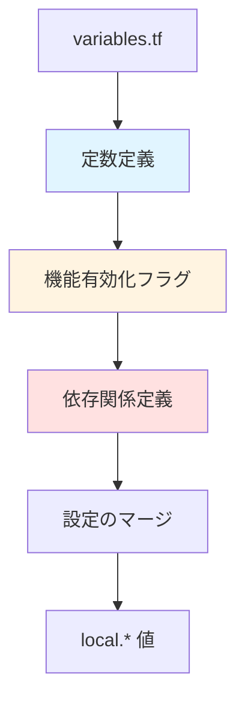

**コード解説**:

```hcl
# 1. 定数定義
locals {
  const = {
    connectivity = {
      virtual_wan        = "virtual_wan"
      hub_and_spoke_vnet = "hub_and_spoke_vnet"
      none               = "none"
    }
  }
}

# 2. 機能有効化フラグ (条件分岐)
locals {
  # 接続機能が有効か
  connectivity_enabled = var.connectivity_type != local.const.connectivity.none
  
  # Virtual WAN型が選択されているか
  connectivity_virtual_wan_enabled = (
    var.connectivity_type == local.const.connectivity.virtual_wan
  )
  
  # Hub-Spoke型が選択されているか
  connectivity_hub_and_spoke_vnet_enabled = (
    var.connectivity_type == local.const.connectivity.hub_and_spoke_vnet
  )
}

# 3. リソースグループへの暗黙的依存関係
locals {
  resource_groups = {
    resource_groups = module.resource_groups
  }
  
  # Hub-Spoke設定にRG情報をマージ
  hub_and_spoke_networks_settings = merge(
    module.config.outputs.hub_and_spoke_networks_settings,
    local.resource_groups
  )
  
  # Hub VNet設定にRG情報をマージ
  hub_virtual_networks = merge(
    { vnets = module.config.outputs.hub_virtual_networks },
    local.resource_groups
  ).vnets
  
  # Virtual WAN設定にRG情報をマージ
  virtual_wan_settings = merge(
    module.config.outputs.virtual_wan_settings,
    local.resource_groups
  )
  
  virtual_hubs = merge(
    { vhubs = module.config.outputs.virtual_hubs },
    local.resource_groups
  ).vhubs
}

# 4. ポリシー依存関係 (重要!)
locals {
  management_group_dependencies = {
    # ポリシー割り当ては以下のモジュール完了後に実行
    policy_assignments = [
      module.management_resources,  # Log Analytics等が先
      module.hub_and_spoke_vnet,    # ネットワークが先
      module.virtual_wan            # ネットワークが先
    ]
    
    # RBACロール割り当ても同様
    policy_role_assignments = [
      module.management_resources,
      module.hub_and_spoke_vnet,
      module.virtual_wan
    ]
  }
}

# 5. 最終設定のマージ
locals {
  # 管理グループ設定 + 依存関係
  management_group_settings = merge(
    module.config.outputs.management_group_settings,
    {
      dependencies = local.management_group_dependencies
    }
  )
  
  # 管理リソース設定 + タグ
  management_resource_settings = merge(
    module.config.outputs.management_resource_settings,
    {
      tags = coalesce(
        module.config.outputs.management_resource_settings.tags,
        module.config.outputs.tags
      )
    }
  )
}
```

**なぜ依存関係が重要か**:

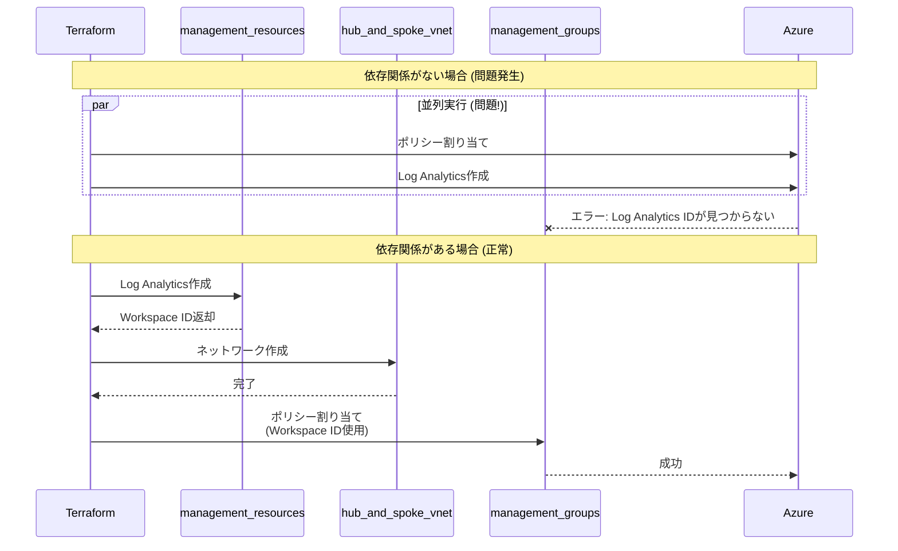

---

### **main.*.tf ファイル群** - モジュール呼び出し

#### **main.config.tf**

```hcl
module "config" {
  source = "./modules/config-templating"
  
  # 入力: 生の変数
  starter_locations = var.starter_locations
  starter_locations_short = var.starter_locations_short
  
  subscription_id_connectivity = var.subscription_ids["connectivity"]
  subscription_id_management = var.subscription_ids["management"]
  subscription_id_identity = var.subscription_ids["identity"]
  
  custom_replacements = var.custom_replacements
  
  # すべての設定を渡す
  inputs = {
    connectivity_resource_groups = var.connectivity_resource_groups
    hub_virtual_networks = var.hub_virtual_networks
    virtual_wan_settings = var.virtual_wan_settings
    management_group_settings = var.management_group_settings
    # ...
  }
}

# 出力: module.config.outputs.* で使用可能
# - module.config.outputs.hub_virtual_networks (テンプレート処理済み)
# - module.config.outputs.custom_replacements
```

#### **main.resource.groups.tf**

```hcl
module "resource_groups" {
  source = "Azure/avm-res-resources-resourcegroup/azurerm"
  version = "0.2.1"
  
  # 動的に複数RG作成
  for_each = { 
    for key, value in module.config.outputs.connectivity_resource_groups : 
    key => value 
    if try(value.settings.enabled, true)
  }
  
  name = each.value.name
  location = each.value.location
  tags = try(each.value.tags, module.config.outputs.tags)
  
  # Connectivityサブスクリプションに作成
  providers = {
    azurerm = azurerm.connectivity
  }
}
```

#### **main.connectivity.hub.and.spoke.virtual.network.tf**

```hcl
module "hub_and_spoke_vnet" {
  source = "Azure/avm-ptn-alz-connectivity-hub-and-spoke-vnet/azurerm"
  version = "0.16.8"
  
  # Hub-Spoke型が選択されている場合のみ作成
  count = local.connectivity_hub_and_spoke_vnet_enabled ? 1 : 0
  
  hub_and_spoke_networks_settings = local.hub_and_spoke_networks_settings
  hub_virtual_networks = local.hub_virtual_networks  # RG依存関係含む
  
  tags = coalesce(
    module.config.outputs.connectivity_tags,
    module.config.outputs.tags
  )
  
  providers = {
    azurerm = azurerm.connectivity
    azapi = azapi.connectivity
  }
}
```

#### **main.management.tf**

```hcl
# 管理リソース (Log Analytics等)
module "management_resources" {
  source = "./modules/management_resources"
  
  count = var.management_resources_enabled ? 1 : 0
  
  management_resource_settings = local.management_resource_settings
  
  providers = {
    azurerm = azurerm.management
  }
}

# 管理グループとポリシー
module "management_groups" {
  source = "./modules/management_groups"
  
  count = var.management_groups_enabled ? 1 : 0
  
  management_group_settings = local.management_group_settings
  # ↑ 依存関係が含まれている!
}
```

---

### **platform-landing-zone.auto.tfvars** - 設定の中心

このファイルが**設定の中心**で、すべてのリソース構成をここで定義します。

#### 組み込み置換トークンの使い方

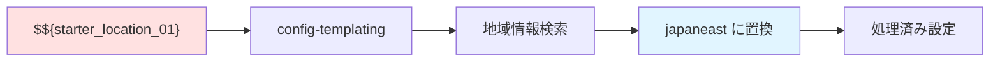

**利用可能な組み込みトークン一覧**:

| トークン | 説明 | 例 |
|---------|------|-----|
| `$${starter_location_01}` | 1番目の地域 | japaneast |
| `$${starter_location_02}` | 2番目の地域 | japanwest |
| `$${starter_location_01_short}` | 1番目の地域短縮 | je |
| `$${starter_location_02_short}` | 2番目の地域短縮 | jw |
| `$${subscription_id_connectivity}` | Connectivityサブスク | xxx-xxx-xxx |
| `$${subscription_id_management}` | Managementサブスク | yyy-yyy-yyy |
| `$${subscription_id_identity}` | Identityサブスク | zzz-zzz-zzz |
| `$${root_parent_management_group_id}` | ルート管理グループ | Tenant Root Group ID |

**設定例の完全版**:

```hcl
# ========================================
# 1. 地域設定
# ========================================
starter_locations = ["japaneast", "japanwest"]

# 地域短縮コードのカスタマイズ (オプション)
starter_locations_short = {
  starter_location_01_short = "je"  # デフォルトから変更する場合
  starter_location_02_short = "jw"
}

# ========================================
# 2. カスタム置換
# ========================================
custom_replacements = {
  # 名前のカスタマイズ
  names = {
    company_name = "contoso"
    environment = "prod"
    project_code = "alz"
  }
  
  # リソースグループ識別子
  resource_group_identifiers = {
    rg_connectivity_primary = "rg-$${company_name}-conn-$${starter_location_01_short}"
    # → "rg-contoso-conn-je"
  }
  
  # リソース識別子
  resource_identifiers = {
    law_management = "law-$${company_name}-mgmt-$${starter_location_01}"
    # → "law-contoso-mgmt-japaneast"
  }
}

# ========================================
# 3. 管理グループ設定
# ========================================
management_group_settings = {
  # ALZアーキテクチャ名 (lib/で定義)
  architecture_name = "alz_custom"
  
  # 親管理グループID (通常はTenant Root)
  parent_resource_id = "$${root_parent_management_group_id}"
  
  # デフォルトロケーション
  location = "$${starter_location_01}"
  
  # デフォルト管理グループ名
  default_management_group_name = "Contoso"
  
  # ポリシーのデフォルト値
  policy_default_values = {
    # Log Analytics Workspace ID (後から設定される)
    log_analytics_workspace_id = ""
    
    # 許可される地域
    allowed_locations = [
      "$${starter_location_01}",
      "$${starter_location_02}"
    ]
  }
  
  # ポリシー割り当ての調整
  policy_assignments_to_modify = {
    # 特定のポリシーを無効化
    deny_ip_forwarding = {
      enforcement_mode = "DoNotEnforce"
    }
  }
}

# ========================================
# 4. 管理リソース設定
# ========================================
management_resource_settings = {
  location = "$${starter_location_01}"
  
  # Log Analytics Workspace
  log_analytics_workspace_name = "law-$${company_name}-mgmt-$${starter_location_01}"
  log_analytics_workspace_retention_in_days = 90
  log_analytics_workspace_sku = "PerGB2018"
  log_analytics_workspace_daily_quota_gb = 10
  
  # Automation Account
  automation_account_enabled = true
  
  # Microsoft Sentinel
  sentinel_onboarding = {
    enabled = true
  }
  
  # Log Analytics Solutions
  log_analytics_solution_plans = [
    {
      product = "OMSGallery/Security"
      publisher = "Microsoft"
    },
    {
      product = "OMSGallery/Updates"
      publisher = "Microsoft"
    },
    {
      product = "OMSGallery/ChangeTracking"
      publisher = "Microsoft"
    }
  ]
  
  # タグ
  tags = {
    Environment = "$${environment}"
    ManagedBy = "Terraform"
    CostCenter = "IT-Infrastructure"
  }
}

# ========================================
# 5. リソースグループ設定
# ========================================
connectivity_resource_groups = {
  # 1次地域のRG
  primary = {
    name = "rg-connectivity-$${starter_location_01_short}"
    location = "$${starter_location_01}"
    tags = {
      Purpose = "Connectivity-Primary"
    }
  }
  
  # 2次地域のRG
  secondary = {
    name = "rg-connectivity-$${starter_location_02_short}"
    location = "$${starter_location_02}"
    tags = {
      Purpose = "Connectivity-Secondary"
    }
  }
  
  # DDoS用RG
  ddos = {
    name = "rg-ddos-$${starter_location_01_short}"
    location = "$${starter_location_01}"
    settings = {
      enabled = true
    }
  }
}

# ========================================
# 6. Hub-Spoke VNet 設定
# ========================================
hub_virtual_networks = [
  # 1次地域のHub
  {
    name = "hub-$${starter_location_01}"
    location = "$${starter_location_01}"
    resource_group_name = "rg-connectivity-$${starter_location_01_short}"
    address_space = ["10.0.0.0/16"]
    
    # サブネット
    subnets = {
      AzureFirewallSubnet = {
        address_prefixes = ["10.0.1.0/24"]
      }
      GatewaySubnet = {
        address_prefixes = ["10.0.2.0/27"]
      }
      AzureBastionSubnet = {
        address_prefixes = ["10.0.3.0/27"]
      }
    }
    
    # Azure Firewall
    firewall = {
      enabled = true
      sku_name = "AZFW_VNet"
      sku_tier = "Standard"
      zones = ["1", "2", "3"]  # ゾーン冗長
      
      # ファイアウォールポリシー
      firewall_policy = {
        sku = "Standard"
        threat_intelligence_mode = "Alert"
      }
    }
    
    # VPN Gateway
    virtual_network_gateways = {
      vpn = {
        enabled = true
        name = "vpngw-$${starter_location_01}"
        sku = "VpnGw2AZ"
        type = "Vpn"
        vpn_type = "RouteBased"
        active_active = true
        enable_bgp = true
      }
      
      # ExpressRoute Gateway
      expressroute = {
        enabled = true
        name = "ergw-$${starter_location_01}"
        sku = "ErGw1AZ"
        type = "ExpressRoute"
      }
    }
    
    # Azure Bastion
    bastion = {
      enabled = true
      name = "bastion-$${starter_location_01}"
      sku = "Standard"
    }
  },
  
  # 2次地域のHub
  {
    name = "hub-$${starter_location_02}"
    location = "$${starter_location_02}"
    resource_group_name = "rg-connectivity-$${starter_location_02_short}"
    address_space = ["10.10.0.0/16"]
    
    # ... 同様の設定
  }
]

# Hub-Spokeグローバル設定
hub_and_spoke_networks_settings = {
  # DDoS保護
  ddos_protection_plan = {
    enabled = true
    name = "ddos-plan-$${starter_location_01}"
    resource_group_name = "rg-ddos-$${starter_location_01_short}"
  }
  
  # Private DNS Zones (自動作成される60+ゾーン)
  private_dns_zones = {
    enabled = true
    resource_group_name = "rg-connectivity-$${starter_location_01_short}"
  }
  
  # Hub間のVNet Peering
  enable_hub_network_mesh_peering = true
}

# ========================================
# 7. Virtual WAN 設定 (代替案)
# ========================================
virtual_wan_settings = {
  name = "vwan-$${company_name}"
  resource_group_name = "rg-connectivity-$${starter_location_01_short}"
  location = "$${starter_location_01}"
  
  type = "Standard"  # または "Basic"
  
  # DDoS保護
  ddos_protection_plan = {
    enabled = true
    name = "ddos-plan-vwan"
  }
}

virtual_hubs = [
  # 1次地域のVirtual Hub
  {
    name = "vhub-$${starter_location_01}"
    location = "$${starter_location_01}"
    resource_group_name = "rg-connectivity-$${starter_location_01_short}"
    address_prefix = "10.100.0.0/23"
    
    # VPN Gateway
    vpn_gateway = {
      enabled = true
      name = "vpngw-vhub-$${starter_location_01}"
      scale_unit = 2
    }
    
    # ExpressRoute Gateway
    expressroute_gateway = {
      enabled = true
      name = "ergw-vhub-$${starter_location_01}"
      scale_unit = 1
    }
    
    # Azure Firewall
    firewall = {
      enabled = true
      sku_tier = "Standard"
    }
    
    # ルーティングインテント
    routing_intent = {
      enabled = true
      internet_traffic_enabled = true
      private_traffic_enabled = true
    }
  },
  
  # 2次地域のVirtual Hub
  {
    name = "vhub-$${starter_location_02}"
    location = "$${starter_location_02}"
    # ... 同様の設定
  }
]

# ========================================
# 8. グローバルタグ
# ========================================
tags = {
  Environment = "$${environment}"
  ManagedBy = "Terraform"
  Project = "$${project_code}"
  CompanyName = "$${company_name}"
}

connectivity_tags = {
  Purpose = "Connectivity"
  Tier = "Platform"
}
```

---

### **lib/ フォルダ** - ALZ ライブラリのカスタマイズ

Azure Landing Zones には**標準のポリシーと管理グループアーキテクチャ**がプリセットされています。  
`lib/` フォルダでそれをカスタマイズできます。

#### lib/ フォルダー構造

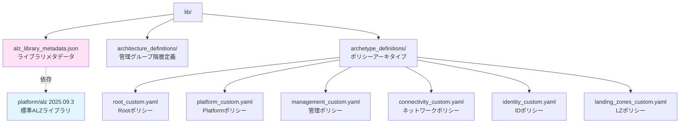

#### **alz_library_metadata.json**

```json
{
  "$schema": "https://raw.githubusercontent.com/Azure/Azure-Landing-Zones-Library/main/schemas/library_metadata.json",
  "name": "local",
  "display_name": "ALZ Accelerator - Azure Verified Modules for ALZ Platform Landing Zone",
  "description": "このライブラリはALZ Acceleratorのポリシー、アーキタイプ、管理グループを上書きできます",
  
  // 依存する標準ALZライブラリ
  "dependencies": [
    {
      "path": "platform/alz",
      "ref": "2025.09.3"  // バージョン指定
    }
  ]
}
```

#### **archetype_definitions/*.yaml** - ポリシーのカスタマイズ

**例: management_custom.alz_archetype_override.yaml**

```yaml
# Management管理グループのポリシーをカスタマイズ
name: management

# このアーキタイプの基本情報
display_name: "Management (Custom)"
description: "カスタマイズされたManagement管理グループのポリシー"

# 標準ALZから継承
base_archetype: management

# ========================================
# 追加するポリシー割り当て
# ========================================
policy_assignments:
  # カスタムポリシー: タグ必須
  - policy_assignment_name: require_tags_on_resources
    display_name: "リソースに必須タグを要求"
    policy_definition_name: "/providers/Microsoft.Authorization/policyDefinitions/require-tags"
    
    parameters:
      tagNames:
        value: ["Environment", "CostCenter", "Owner"]
      effect:
        value: "Deny"
    
    enforcement_mode: "Default"
    
    # 除外するリソース
    not_scopes:
      - "/subscriptions/$${subscription_id_management}/resourceGroups/rg-temp"
  
  # カスタムポリシー: VM暗号化監査
  - policy_assignment_name: audit_vm_encryption
    display_name: "VM暗号化を監査"
    policy_definition_name: "/providers/Microsoft.Authorization/policyDefinitions/audit-vm-disk-encryption"
    
    parameters:
      effect:
        value: "AuditIfNotExists"

# ========================================
# 標準から削除するポリシー
# ========================================
policy_assignments_to_remove:
  # 標準のパブリックIP拒否を削除 (柔軟性のため)
  - deny_public_ip_on_nic
  
  # 標準のリージョン制限を削除 (独自で定義)
  - allowed_locations

# ========================================
# カスタムポリシー定義
# ========================================
policy_definitions:
  - policy_definition_name: custom_network_watcher_required
    display_name: "Network Watcherが有効であることを確認"
    policy_type: "Custom"
    mode: "All"
    
    policy_rule:
      if:
        allOf:
          - field: "type"
            equals: "Microsoft.Network/networkWatchers"
          - field: "location"
            equals: "[parameters('location')]"
      then:
        effect: "audit"
    
    parameters:
      location:
        type: "String"
        metadata:
          displayName: "Location"
          description: "Network Watcherの場所"

# ========================================
# カスタムロール定義
# ========================================
role_definitions:
  - role_definition_name: custom_network_reader
    display_name: "カスタムネットワーク読み取り"
    description: "ネットワークリソースの読み取り専用アクセス"
    
    permissions:
      - actions:
          - "Microsoft.Network/*/read"
          - "Microsoft.Resources/subscriptions/resourceGroups/read"
        not_actions: []
        data_actions: []
        not_data_actions: []
    
    assignable_scopes:
      - "$${root_parent_management_group_id}"

# ========================================
# RBAC割り当て
# ========================================
role_assignments:
  # セキュリティグループにReader権限
  - role_definition_name: "Reader"
    principal_id: "aaaaaaaa-bbbb-cccc-dddd-eeeeeeeeeeee"  # AADグループID
    scope: "/providers/Microsoft.Management/managementGroups/management"
  
  # カスタムロールの割り当て
  - role_definition_name: "custom_network_reader"
    principal_id: "ffffffff-gggg-hhhh-iiii-jjjjjjjjjjjj"
    scope: "/providers/Microsoft.Management/managementGroups/connectivity"
```

**他のアーキタイプファイル**:

| ファイル | 対象管理グループ | 主な用途 |
|---------|----------------|---------|
| `root_custom.yaml` | Root | テナント全体のポリシー |
| `platform_custom.yaml` | Platform | 基盤サービス共通ポリシー |
| `connectivity_custom.yaml` | Connectivity | ネットワークポリシー |
| `identity_custom.yaml` | Identity | ID管理ポリシー |
| `landing_zones_custom.yaml` | Landing Zones | ワークロード共通ポリシー |
| `corp_custom.yaml` | Corp | 社内システム用ポリシー |
| `online_custom.yaml` | Online | インターネット接続用ポリシー |
| `sandbox_custom.yaml` | Sandboxes | 検証環境用ポリシー |
| `security_custom.yaml` | Security | セキュリティ専用ポリシー |
| `decommissioned_custom.yaml` | Decommissioned | 廃止予定リソース |

#### ポリシーカスタマイズの実際の流れ

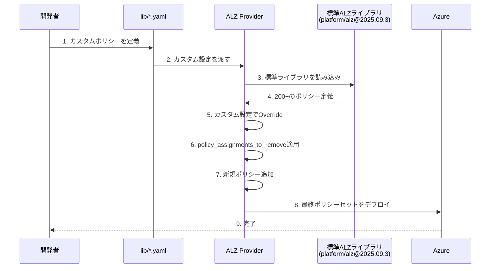

#### architecture_definitions/ - 管理グループ階層のカスタマイズ

**alz_custom.alz_architecture_definition.yaml**

```yaml
# カスタムの管理グループ階層を定義
name: alz_custom
display_name: "Contoso Azure Landing Zones"

# 管理グループの階層構造
management_groups:
  # Rootレベル
  - id: root
    display_name: "Contoso"
    parent_id: null  # Tenant Root Groupの下
    archetype_name: root
    
    children:
      # Platform配下
      - id: platform
        display_name: "Platform"
        archetype_name: platform
        
        children:
          - id: management
            display_name: "Management"
            archetype_name: management
          
          - id: connectivity
            display_name: "Connectivity"
            archetype_name: connectivity
          
          - id: identity
            display_name: "Identity"
            archetype_name: identity
      
      # Landing Zones配下
      - id: landing_zones
        display_name: "Landing Zones"
        archetype_name: landing_zones
        
        children:
          - id: corp
            display_name: "Corp"
            archetype_name: corp
          
          - id: online
            display_name: "Online"
            archetype_name: online
          
          # カスタム: SAP専用
          - id: sap
            display_name: "SAP Workloads"
            archetype_name: corp  # corpポリシーを継承
            
            # SAP専用の追加設定
            policy_assignments:
              - policy_assignment_name: sap_hana_backup_required
                display_name: "SAP HANAバックアップ必須"
      
      # Sandboxes
      - id: sandboxes
        display_name: "Sandboxes"
        archetype_name: sandbox
      
      # Decommissioned
      - id: decommissioned
        display_name: "Decommissioned"
        archetype_name: decommissioned

# サブスクリプション配置
subscription_placement:
  connectivity:
    - "$${subscription_id_connectivity}"
  
  management:
    - "$${subscription_id_management}"
  
  identity:
    - "$${subscription_id_identity}"
```

---

## 🚀 自分でこのリポジトリを再構築するステップバイステップ

### 全体の構築フロー

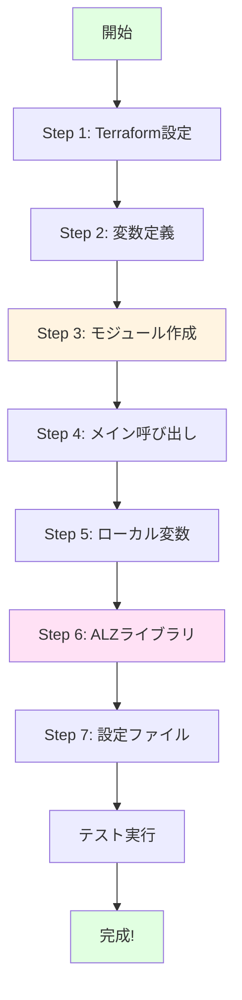

---

### **ステップ1: Terraform 初期化ファイルを作成**

```hcl
# terraform.tf を作成
terraform {
  required_version = "~> 1.12"
  
  required_providers {
    alz = {
      source  = "Azure/alz"
      version = "0.20.0"
    }
    azurerm = {
      source  = "hashicorp/azurerm"
      version = "~> 4.0"
    }
    azapi = {
      source  = "Azure/azapi"
      version = "~> 2.0"
    }
  }
  
  backend "azurerm" {}
}

# ALZプロバイダー (lib/フォルダー参照)
provider "alz" {
  library_overwrite_enabled = true
  library_references = [
    {
      custom_url = "${path.root}/lib"
    }
  ]
}

# デフォルトプロバイダー
provider "azurerm" {
  resource_provider_registrations = "none"
  features {}
}

# Management専用
provider "azurerm" {
  alias           = "management"
  subscription_id = var.subscription_ids["management"]
  features {}
}

# Connectivity専用
provider "azurerm" {
  alias           = "connectivity"
  subscription_id = var.subscription_ids["connectivity"]
  features {}
}

provider "azapi" {
  alias                      = "connectivity"
  subscription_id            = var.subscription_ids["connectivity"]
  skip_provider_registration = true
}
```

**ポイント**:
- 3つのAzureサブスクリプションに同時アクセス可能
- ALZ プロバイダーが lib/ のカスタムライブラリを読み込む

---

### **ステップ2: 変数と設定ファイルを定義**

```hcl
# variables.tf
variable "starter_locations" {
  type        = list(string)
  description = "デプロイするAzure地域"
  
  validation {
    condition     = length(var.starter_locations) > 0
    error_message = "最低1つの地域を指定してください"
  }
}

variable "subscription_ids" {
  type        = map(string)
  description = "機能別サブスクリプションID"
  
  validation {
    condition = alltrue([
      for key in keys(var.subscription_ids) :
      contains(["management", "connectivity", "identity"], key)
    ])
    error_message = "有効なキー: management, connectivity, identity"
  }
}

variable "connectivity_type" {
  type        = string
  description = "ネットワークタイプ選択"
  default     = "hub_and_spoke_vnet"
  
  validation {
    condition = contains([
      "hub_and_spoke_vnet",
      "virtual_wan",
      "none"
    ], var.connectivity_type)
    error_message = "有効な値: hub_and_spoke_vnet, virtual_wan, none"
  }
}

# その他の変数 (hub_virtual_networks, management_resource_settings等)
```

```hcl
# terraform.tfvars (実行時に使用)
subscription_ids = {
  management   = "xxxxxxxx-xxxx-xxxx-xxxx-xxxxxxxxxxxx"
  connectivity = "yyyyyyyy-yyyy-yyyy-yyyy-yyyyyyyyyyyy"
  identity     = "zzzzzzzz-zzzz-zzzz-zzzz-zzzzzzzzzzzz"
}

starter_locations  = ["japaneast", "japanwest"]
connectivity_type  = "hub_and_spoke_vnet"
```

---

### **ステップ3: モジュール構造を構築**

#### 3-1. config-templating モジュール

```
modules/config-templating/
├── data.tf          # 地域情報取得
├── locals.config.tf # テンプレート処理ロジック
├── variables.tf     # 入力変数
├── outputs.tf       # 処理済み設定
└── terraform.tf     # プロバイダー設定
```

**data.tf**:
```hcl
module "regions" {
  source  = "Azure/avm-utl-regions/azurerm"
  version = "0.9.2"
  
  use_cached_data  = false
  enable_telemetry = var.enable_telemetry
}

data "azurerm_client_config" "current" {}
```

**locals.config.tf** (核心ロジック):
```hcl
locals {
  # 地域マッピング
  starter_locations = {
    for i, location in var.starter_locations :
    "starter_location_${format("%02d", i + 1)}" => location
  }
  
  # 短縮コード生成
  starter_locations_short = {
    for i, location in var.starter_locations :
    "starter_location_${format("%02d", i + 1)}_short" => coalesce(
      try(var.starter_locations_short["starter_location_${format("%02d", i + 1)}_short"], null),
      try(module.regions.regions_by_name[location].geo_code, null),
      try(module.regions.regions_by_name[location].short_name, null),
      location
    )
  }
  
  # 組み込み置換
  built_in_replacements = merge(
    local.starter_locations,
    local.starter_locations_short,
    {
      subscription_id_connectivity = var.subscription_id_connectivity
      subscription_id_management   = var.subscription_id_management
      subscription_id_identity     = var.subscription_id_identity
    }
  )
  
  # カスタム置換の適用
  custom_names_json = jsonencode(var.custom_replacements.names)
  custom_names_json_templated = templatestring(
    local.custom_names_json,
    local.built_in_replacements
  )
  custom_names = jsondecode(local.custom_names_json_templated)
  
  # 最終置換マップ
  final_replacements = merge(
    local.built_in_replacements,
    local.custom_names
  )
  
  # すべての入力にテンプレート適用
  outputs = {
    for key, value in var.inputs :
    key => jsondecode(
      templatestring(
        jsonencode(value),
        local.final_replacements
      )
    )
  }
}
```

**outputs.tf**:
```hcl
output "outputs" {
  value = local.outputs
}

output "custom_replacements" {
  value = local.final_replacements
}
```

#### 3-2. management_groups モジュール

```
modules/management_groups/
├── main.tf        # AVMモジュール呼び出し
├── variables.tf   # 入力変数
└── locals.tf      # ローカル処理
```

**main.tf**:
```hcl
module "management_groups" {
  source  = "Azure/avm-ptn-alz/azurerm"
  version = "0.14.1"
  
  architecture_name   = var.management_group_settings.architecture_name
  parent_resource_id  = var.management_group_settings.parent_resource_id
  location            = var.management_group_settings.location
  
  policy_default_values        = local.policy_default_values
  policy_assignments_to_modify = local.policy_assignments_to_modify
  
  dependencies = var.management_group_settings.dependencies
  
  enable_telemetry = var.enable_telemetry
}
```

#### 3-3. management_resources モジュール

```
modules/management_resources/
├── main.tf        # AVMモジュール呼び出し
├── variables.tf   # 入力変数
└── outputs.tf     # リソースID等の出力
```

**main.tf**:
```hcl
module "management_resources" {
  source  = "Azure/avm-ptn-alz-management/azurerm"
  version = "0.9.0"
  
  location                     = var.management_resource_settings.location
  resource_group_name          = coalesce(
    var.management_resource_settings.resource_group_name,
    "rg-management-${var.management_resource_settings.location}"
  )
  log_analytics_workspace_name = coalesce(
    var.management_resource_settings.log_analytics_workspace_name,
    "law-management-${var.management_resource_settings.location}"
  )
  
  log_analytics_workspace_retention_in_days = var.management_resource_settings.log_analytics_workspace_retention_in_days
  
  sentinel_onboarding = var.management_resource_settings.sentinel_onboarding
  
  enable_telemetry = var.enable_telemetry
}
```

**outputs.tf**:
```hcl
output "log_analytics_workspace_id" {
  value = module.management_resources.log_analytics_workspace_id
}

output "automation_account_id" {
  value = module.management_resources.automation_account_id
}
```

---

### **ステップ4: メインモジュール呼び出しを実装**

#### main.config.tf
```hcl
module "config" {
  source = "./modules/config-templating"
  
  starter_locations       = var.starter_locations
  starter_locations_short = var.starter_locations_short
  
  subscription_id_connectivity = var.subscription_ids["connectivity"]
  subscription_id_management   = var.subscription_ids["management"]
  subscription_id_identity     = var.subscription_ids["identity"]
  subscription_id_security     = try(var.subscription_ids["security"], "")
  
  custom_replacements = var.custom_replacements
  
  inputs = {
    connectivity_resource_groups    = var.connectivity_resource_groups
    hub_virtual_networks            = var.hub_virtual_networks
    hub_and_spoke_networks_settings = var.hub_and_spoke_networks_settings
    virtual_wan_settings            = var.virtual_wan_settings
    virtual_hubs                    = var.virtual_hubs
    management_resource_settings    = var.management_resource_settings
    management_group_settings       = var.management_group_settings
    tags                            = var.tags
    connectivity_tags               = var.connectivity_tags
  }
  
  enable_telemetry = var.enable_telemetry
}
```

#### main.resource.groups.tf
```hcl
module "resource_groups" {
  source  = "Azure/avm-res-resources-resourcegroup/azurerm"
  version = "0.2.1"
  
  for_each = {
    for key, value in module.config.outputs.connectivity_resource_groups :
    key => value
    if try(value.settings.enabled, true)
  }
  
  name             = each.value.name
  location         = each.value.location
  enable_telemetry = var.enable_telemetry
  tags             = try(each.value.tags, module.config.outputs.tags)
  
  providers = {
    azurerm = azurerm.connectivity
  }
}
```

#### main.connectivity.hub.and.spoke.virtual.network.tf
```hcl
module "hub_and_spoke_vnet" {
  source  = "Azure/avm-ptn-alz-connectivity-hub-and-spoke-vnet/azurerm"
  version = "0.16.8"
  
  count = local.connectivity_hub_and_spoke_vnet_enabled ? 1 : 0
  
  hub_and_spoke_networks_settings = local.hub_and_spoke_networks_settings
  hub_virtual_networks            = local.hub_virtual_networks
  
  enable_telemetry = var.enable_telemetry
  tags             = coalesce(
    module.config.outputs.connectivity_tags,
    module.config.outputs.tags
  )
  
  providers = {
    azurerm = azurerm.connectivity
    azapi   = azapi.connectivity
  }
}
```

#### main.management.tf
```hcl
module "management_resources" {
  source = "./modules/management_resources"
  
  count = var.management_resources_enabled ? 1 : 0
  
  enable_telemetry             = var.enable_telemetry
  management_resource_settings = local.management_resource_settings
  
  providers = {
    azurerm = azurerm.management
  }
}

module "management_groups" {
  source = "./modules/management_groups"
  
  count = var.management_groups_enabled ? 1 : 0
  
  enable_telemetry          = var.enable_telemetry
  management_group_settings = local.management_group_settings
}
```

---

### **ステップ5: ローカル変数で依存関係を定義**

```hcl
# locals.tf

# 定数定義
locals {
  const = {
    connectivity = {
      virtual_wan        = "virtual_wan"
      hub_and_spoke_vnet = "hub_and_spoke_vnet"
      none               = "none"
    }
  }
}

# 機能有効化フラグ
locals {
  connectivity_enabled                    = var.connectivity_type != local.const.connectivity.none
  connectivity_virtual_wan_enabled        = var.connectivity_type == local.const.connectivity.virtual_wan
  connectivity_hub_and_spoke_vnet_enabled = var.connectivity_type == local.const.connectivity.hub_and_spoke_vnet
}

# リソースグループへの依存関係
locals {
  resource_groups = {
    resource_groups = module.resource_groups
  }
  
  hub_and_spoke_networks_settings = merge(
    module.config.outputs.hub_and_spoke_networks_settings,
    local.resource_groups
  )
  
  hub_virtual_networks = merge(
    { vnets = module.config.outputs.hub_virtual_networks },
    local.resource_groups
  ).vnets
}

# ポリシー依存関係 (重要!)
locals {
  management_group_dependencies = {
    policy_assignments = [
      module.management_resources,
      module.hub_and_spoke_vnet,
      module.virtual_wan
    ]
    policy_role_assignments = [
      module.management_resources,
      module.hub_and_spoke_vnet,
      module.virtual_wan
    ]
  }
}

# 最終設定
locals {
  management_group_settings = merge(
    module.config.outputs.management_group_settings,
    {
      dependencies = local.management_group_dependencies
    }
  )
  
  management_resource_settings = merge(
    module.config.outputs.management_resource_settings,
    {
      tags = coalesce(
        module.config.outputs.management_resource_settings.tags,
        module.config.outputs.tags
      )
    }
  )
}
```

---

### **ステップ6: ALZ ライブラリをカスタマイズ**

```
lib/
├── alz_library_metadata.json
├── archetype_definitions/
│   ├── root_custom.alz_archetype_override.yaml
│   ├── management_custom.alz_archetype_override.yaml
│   ├── connectivity_custom.alz_archetype_override.yaml
│   └── ...
└── architecture_definitions/
    └── alz_custom.alz_architecture_definition.yaml
```

**alz_library_metadata.json**:
```json
{
  "$schema": "https://raw.githubusercontent.com/Azure/Azure-Landing-Zones-Library/main/schemas/library_metadata.json",
  "name": "local",
  "display_name": "Custom ALZ Library",
  "dependencies": [
    {
      "path": "platform/alz",
      "ref": "2025.09.3"
    }
  ]
}
```

**management_custom.alz_archetype_override.yaml**:
```yaml
name: management
display_name: "Management (Custom)"
base_archetype: management

policy_assignments:
  - policy_assignment_name: require_tags
    display_name: "必須タグポリシー"
    policy_definition_name: "/providers/Microsoft.Authorization/policyDefinitions/require-tags"
    parameters:
      tagNames:
        value: ["Environment", "Owner"]
      effect:
        value: "Deny"

policy_assignments_to_remove:
  - deny_public_ip_on_nic
```

---

### **ステップ7: 設定ファイル作成**

**platform-landing-zone.auto.tfvars** (前述の完全版を参照)

---

### **ステップ8: 初期化と実行**

```bash
# 1. ディレクトリ確認
pwd  # alz-mgmt/

# 2. Azure認証
az login
az account set --subscription "xxxxxxxx-xxxx-xxxx-xxxx-xxxxxxxxxxxx"

# 3. Terraform初期化
terraform init \
  -backend-config="resource_group_name=rg-tf-state" \
  -backend-config="storage_account_name=stterraformstate" \
  -backend-config="container_name=tfstate" \
  -backend-config="key=alz-mgmt.tfstate"

# 4. プラン確認
terraform plan -var-file=platform-landing-zone.auto.tfvars -out=tfplan

# 5. 適用
terraform apply tfplan

# 6. 出力確認
terraform output
```

---

## 🔗 複雑な依存関係の解説

### モジュール実行順序の詳細

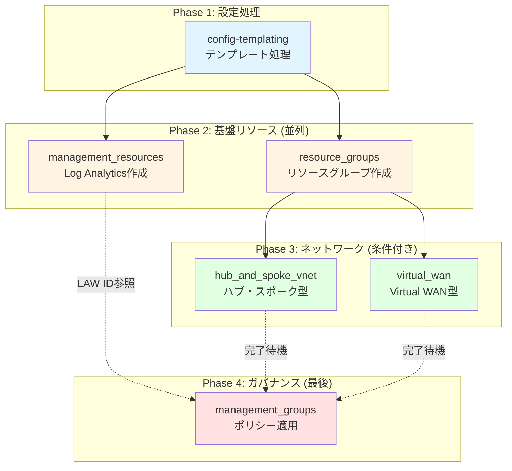

### 依存関係が重要な理由

**問題が起こるケース (依存関係なし)**:

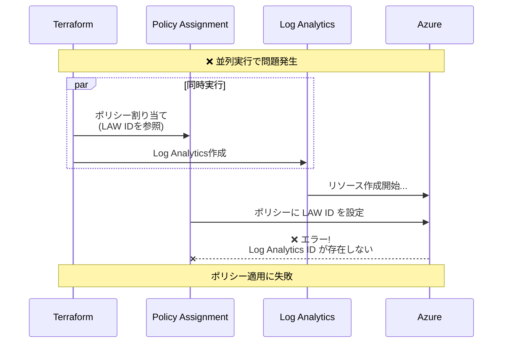

**正しいケース (依存関係あり)**:

```mermaid
sequenceDiagram
    participant TF as Terraform
    participant LAW as Log Analytics
    participant NETWORK as Network Resources
    participant POLICY as Policy Assignment
    participant AZURE as Azure
    
    Note over TF,AZURE: ✅ 依存関係で正しい順序
    
    TF->>LAW: 1. Log Analytics作成
    LAW->>AZURE: リソースデプロイ
    AZURE-->>LAW: Workspace ID返却
    LAW-->>TF: 完了
    
    TF->>NETWORK: 2. ネットワーク構築
    NETWORK->>AZURE: VNet等をデプロイ
    AZURE-->>NETWORK: 完了
    NETWORK-->>TF: 完了
    
    TF->>POLICY: 3. ポリシー割り当て<br/>(LAW IDを使用)
    POLICY->>AZURE: ポリシー設定
    AZURE-->>POLICY: ✅ 成功
    
    Note over TF,AZURE: すべて正常完了
```

### locals.tf での依存関係制御の実装

```hcl
# locals.tf

# Step 1: モジュール完了を待機するリスト
locals {
  management_group_dependencies = {
    # ポリシー割り当ては以下が完了するまで待機
    policy_assignments = [
      module.management_resources,  # Log Analytics完了を待つ
      module.hub_and_spoke_vnet,    # ネットワーク完了を待つ
      module.virtual_wan            # ネットワーク完了を待つ
    ]
  }
}

# Step 2: 依存関係を設定に注入
locals {
  management_group_settings = merge(
    module.config.outputs.management_group_settings,
    {
      dependencies = local.management_group_dependencies  # ← これが重要!
    }
  )
}

# Step 3: management_groups モジュールに渡す
module "management_groups" {
  source = "./modules/management_groups"
  
  management_group_settings = local.management_group_settings
  # ↑ この中に依存関係が含まれている
}
```

### リソースグループへの暗黙的依存

```hcl
# ネットワークモジュールはRGの作成完了を待つ必要がある

locals {
  # Step 1: RG参照を設定に追加
  resource_groups = {
    resource_groups = module.resource_groups  # ← RGモジュール全体を参照
  }
  
  # Step 2: ネットワーク設定にマージ
  hub_virtual_networks = merge(
    { vnets = module.config.outputs.hub_virtual_networks },
    local.resource_groups  # ← RGへの依存関係を注入
  ).vnets
}

# これにより、Terraformは以下の順序を保証:
# 1. module.resource_groups が先に実行
# 2. local.hub_virtual_networks が評価
# 3. module.hub_and_spoke_vnet が実行
```

---

## 🔍 学習のポイント

このリポジトリを理解する上で抑えておくべき核心概念：

### 1. **テンプレート処理の仕組み**

```mermaid
graph LR
    RAW["$${starter_location_01}"] --> ENCODE[jsonencode]
    ENCODE --> TEMPLATE[templatestring]
    TEMPLATE --> DECODE[jsondecode]
    DECODE --> RESULT[japaneast]
    
    REPLACE[final_replacements<br/>マップ] -.参照.-> TEMPLATE
    
    style TEMPLATE fill:#e1f5ff
```

| ステップ | 処理 | 例 |
|---------|------|-----|
| 1. エンコード | HCL → JSON文字列 | `{"location": "$${starter_location_01}"}` → JSON |
| 2. テンプレート | トークン置換 | `$${...}` → 実際の値 |
| 3. デコード | JSON → HCL | JSON → `{"location": "japaneast"}` |

### 2. **モジュール参照チェーン**

```hcl
# main.config.tf
module "config" { ... }

# locals.tf
local.hub_virtual_networks = module.config.outputs.hub_virtual_networks

# main.connectivity.hub.and.spoke.virtual.network.tf
module "hub_and_spoke_vnet" {
  hub_virtual_networks = local.hub_virtual_networks
}
```

**データフロー**: `config outputs` → `locals` → `hub_and_spoke_vnet inputs`

### 3. **条件付きリソース作成**

```hcl
# count による ON/OFF
module "hub_and_spoke_vnet" {
  count = local.connectivity_hub_and_spoke_vnet_enabled ? 1 : 0
  # ↑ true なら 1個作成、false なら 0個 = 作成しない
}

# for_each による動的作成
module "resource_groups" {
  for_each = module.config.outputs.connectivity_resource_groups
  # ↑ マップの要素数だけ作成
}
```

### 4. **Providerエイリアス (マルチサブスクリプション)**

```mermaid
graph TD
    TF[Terraform実行] --> DEFAULT[provider azurerm<br/>デフォルト]
    TF --> MGMT[provider azurerm<br/>alias: management]
    TF --> CONN[provider azurerm<br/>alias: connectivity]
    
    DEFAULT --> SUB_DEF[Default Subscription]
    MGMT --> SUB_MGMT[Management Subscription]
    CONN --> SUB_CONN[Connectivity Subscription]
    
    SUB_MGMT --> LAW[Log Analytics]
    SUB_CONN --> VNET[Virtual Networks]
    
    style MGMT fill:#fff4e1
    style CONN fill:#e1ffe1
```

```hcl
# 異なるサブスクリプションに同時デプロイ
module "management_resources" {
  providers = {
    azurerm = azurerm.management  # Management サブスク
  }
}

module "hub_and_spoke_vnet" {
  providers = {
    azurerm = azurerm.connectivity  # Connectivity サブスク
    azapi   = azapi.connectivity
  }
}
```

### 5. **ALZ ライブラリの継承とオーバーライド**

```mermaid
graph TD
    STD["標準ALZライブラリ<br/>platform/alz 2025.09.3"] --> BASE[base_archetype: management]
    CUSTOM[lib/management_custom.yaml] --> OVERRIDE[Override定義]
    
    BASE --> MERGE[マージ処理]
    OVERRIDE --> MERGE
    
    MERGE --> FINAL[最終ポリシーセット]
    
    FINAL --> ADD[+ 追加ポリシー]
    FINAL --> REMOVE[- 削除ポリシー]
    FINAL --> MODIFY[~ 変更ポリシー]
    
    style STD fill:#e1f5ff
    style CUSTOM fill:#ffe1f5
    style MERGE fill:#fff4e1
```

**YAML構造**:
```yaml
name: management
base_archetype: management  # 標準ALZを継承

policy_assignments:          # 追加
  - new_policy_1
  - new_policy_2

policy_assignments_to_remove:  # 削除
  - standard_policy_to_remove

# 結果: 標準 + 追加 - 削除
```

### 6. **Terraform State管理**

```mermaid
graph LR
    TF[Terraform] --> STATE[State File<br/>tfstate]
    STATE --> AZURE[Azure Storage]
    
    STATE -.記録.-> RES1[Resource 1]
    STATE -.記録.-> RES2[Resource 2]
    STATE -.記録.-> RES3[...]
    
    TF -.比較.-> STATE
    TF -.変更適用.-> AZURE_ENV[Azure Environment]
    
    style STATE fill:#ffe1e1
```

**backend設定**:
```hcl
backend "azurerm" {}  # 実行時に設定を渡す
```

**初期化コマンド**:
```bash
terraform init \
  -backend-config="resource_group_name=rg-tf-state" \
  -backend-config="storage_account_name=stterraformstate" \
  -backend-config="container_name=tfstate" \
  -backend-config="key=alz-mgmt.tfstate"
```

---

## 🛠️ トラブルシューティング

### よくあるエラーと解決方法

#### 1. **依存関係エラー**

**エラー**:
```
Error: Cannot find Log Analytics Workspace ID
Policy assignment failed: The specified resource does not exist
```

**原因**: `management_groups` が `management_resources` の完了前に実行された

**解決**:
```hcl
# locals.tf で依存関係を追加
locals {
  management_group_dependencies = {
    policy_assignments = [
      module.management_resources  # ← 必ず追加
    ]
  }
}
```

---

#### 2. **テンプレートトークン未置換**

**エラー**:
```
Error: Invalid resource name
Resource name contains "$${starter_location_01}"
```

**原因**: トークンが置換されていない

**チェック**:
```bash
# config モジュールの出力を確認
terraform console
> module.config.outputs.hub_virtual_networks

# 正常な場合: "japaneast" と表示
# 異常な場合: "$${starter_location_01}" のまま
```

**解決**:
1. `platform-landing-zone.auto.tfvars` に `starter_locations` が定義されているか確認
2. `module.config` に正しく渡されているか確認

---

#### 3. **プロバイダー認証エラー**

**エラー**:
```
Error: Error building account: Error acquiring access token
```

**解決**:
```bash
# 1. Azureログイン確認
az account show

# 2. 正しいサブスクリプション選択
az account set --subscription "xxxxxxxx-xxxx-xxxx-xxxx-xxxxxxxxxxxx"

# 3. サービスプリンシパルの場合
export ARM_CLIENT_ID="..."
export ARM_CLIENT_SECRET="..."
export ARM_SUBSCRIPTION_ID="..."
export ARM_TENANT_ID="..."

# 4. Terraform再初期化
terraform init -reconfigure
```

---

#### 4. **for_each エラー**

**エラー**:
```
Error: Invalid for_each argument
The "for_each" value depends on resource attributes that cannot be determined until apply
```

**原因**: `for_each` が未確定の値を参照している

**解決**:
```hcl
# 問題のあるコード
for_each = module.some_module.outputs  # ← 未確定

# 修正後
for_each = {
  for key, value in module.some_module.outputs :
  key => value
  if try(value.enabled, true)  # 条件を明示
}
```

---

#### 5. **State ロックエラー**

**エラー**:
```
Error: Error acquiring the state lock
Lock Info:
  ID: xxxxx-xxxxx-xxxxx
```

**原因**: 前回の実行が異常終了し、ロックが残っている

**解決**:
```bash
# ロック解除 (注意: 他の実行がないことを確認!)
terraform force-unlock xxxxx-xxxxx-xxxxx

# または Azure Storage で直接確認
az storage blob list \
  --account-name stterraformstate \
  --container-name tfstate \
  --query "[?name=='alz-mgmt.tfstate'].{Name:name, Lease:properties.lease.status}"
```

---

## 📊 パフォーマンス最適化

### 大規模環境でのベストプラクティス

#### 1. **並列実行の制御**

```bash
# デフォルトは10並列、増やすことで高速化
terraform apply -parallelism=20
```

#### 2. **部分適用 (Targeted Apply)**

```bash
# 特定モジュールのみ適用
terraform apply -target=module.resource_groups

# 複数ターゲット
terraform apply \
  -target=module.resource_groups \
  -target=module.hub_and_spoke_vnet
```

#### 3. **State分割 (Workspaces)**

```bash
# 環境ごとに State を分離
terraform workspace new prod
terraform workspace new dev

terraform workspace select prod
terraform apply
```

#### 4. **リトライ設定**

```hcl
# variables.tf
variable "management_group_settings" {
  type = object({
    retries = optional(object({
      policy_assignments = optional(object({
        max_interval_seconds = optional(number, 30)
        multiplier           = optional(number, 2)
      }))
    }))
  })
}

# platform-landing-zone.auto.tfvars
management_group_settings = {
  retries = {
    policy_assignments = {
      max_interval_seconds = 60
      multiplier = 2
    }
  }
}
```

---

## 📖 実行コマンド

### **実行前の準備**

```bash
# 1. Azure にログイン
az login
az account set --subscription <subscription-id>

# 2. Terraform 初期化
terraform init -backend-config="key=alz-mgmt.tfstate" \
               -backend-config="resource_group_name=rg-tf-state" \
               -backend-config="storage_account_name=stfstate"

# 3. 計画を確認
terraform plan -var-file=platform-landing-zone.auto.tfvars
```

### **実行**

```bash
# 本番適用
terraform apply -var-file=platform-landing-zone.auto.tfvars

# 特定モジュールのみ適用
terraform apply -target=module.management_groups -var-file=platform-landing-zone.auto.tfvars
```

---

## 🔍 学習のポイント

このリポジトリを理解する上で抑えておくべき概念：

| 概念 | 説明 |
|-----|------|
| **テンプレートトークン** | `$${starter_location_01}` → 実際の値に自動置換 |
| **モジュール参照** | `module.config.outputs.*` で他モジュールの出力を参照 |
| **ローカル値** | `locals {}` で条件判定や依存関係を定義 |
| **Provider エイリアス** | `azurerm.connectivity` など異なるサブスクリプションに向けてリソース作成 |
| **for_each** | `for_each = module.config.outputs.*` で動的リソース作成 |
| **count** | `count = var.feature_enabled ? 1 : 0` で機能ON/OFF制御 |

---

## 🎯 このリポジトリが解決する課題

✅ **複数地域のネットワーク構築の複雑さ** → テンプレート化で簡素化  
✅ **ポリシー管理の一元化** → ALZ アーキタイプで標準化  
✅ **サブスクリプション間のリソース配置** → Provider エイリアスで自動化  
✅ **設定の再利用性** → YAML/JSON ベースで拡張可能  
✅ **大規模環境のスケーリング** → モジュール設計で対応

---

## 📞 参考リンク

- [Azure Landing Zones GitHub](https://github.com/Azure/Enterprise-Scale)
- [Azure Verified Modules](https://github.com/Azure/Azure-Verified-Modules)
- [Terraform ALZ プロバイダー](https://registry.terraform.io/providers/Azure/alz/latest)

---

**作成日**: 2026年1月16日  
**対象読者**: Terraform と Azure の基本的な知識を持つエンジニア
