# 02. IaCのランディングゾーン環境を作ってみよう - 準備とBootstrap環境のセットアップ

## やってみよう

この章から実際にあなたの環境でterraformのランディングゾーンを作っていきましょう！

こういうのはやってみて初めて理解できます！

公式の手順（https://azure.github.io/Azure-Landing-Zones/bootstrap/）があるのですが、英語でわかりにくいので、できるだけわかりやすいようにかみ砕いて手順を説明していきます！

※Windows PCからの操作を想定しています。

---

## Part 1: 前提条件の準備

### 必要なツール

まず、必要なツールをインストールします。これらのツールは必須です！

=== "PowerShell 7.4+"

    PowerShell7をインストールします。
    
    ```powershell title="PowerShellでインストール"
    winget install Microsoft.PowerShell
    ```

    PowerShellを開きなおしてください。そして以下を実行
    
    ```powershell title="Powershell7を起動"
    pwsh
    ```


=== "Azure CLI 2.55+"

    Azure CLIをインストールします。
    
    https://aka.ms/installazurecliwindows
    からインストーラーをダウンロードしてそのままインストールしてください。
    

=== "Git"

    Gitをインストールします。
    
    ```powershell title="Git for WindowsをPowerShellでインストール"
    winget install Git.Git
    ```

---


!!! tip "PowerShellを開きなおして、すべてインストールできたか確認しましょう"
    ```powershell
    # Azure CLI 2.55+
    az version
    
    # Git
    git --version
    
    # PowerShell 7.4+ 起動して確認
    pwsh
    ```

### Azureの準備

まず、Azureのアカウントを作成します。

すでにアカウントをお持ちの方でクリーンな環境があるならばそちらを使ってもいいです。

以下のURLから作成してください。（従量課金を選んでください）

https://azure.microsoft.com/ja-jp/pricing/purchase-options/azure-account

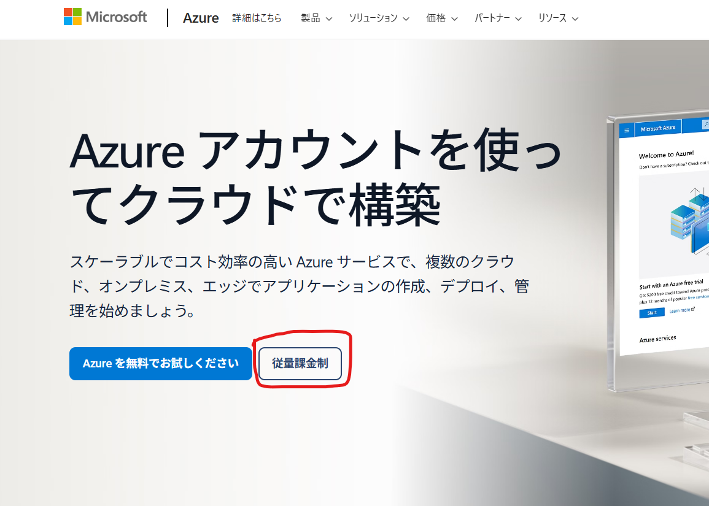

次に、4つのSubscriptionを準備します。

=== "必要なSubscription"

    Landing Zonesには4つのSubscriptionが必要です：
    
    1. **Management**: 管理リソース（Log Analytics等）
    2. **Connectivity**: ネットワークリソース（Hub VNet等）
    3. **Identity**: ID管理リソース（AD等）
    4. **Security**: セキュリティリソース（Sentinel等）

=== "Subscriptionの作成"

    
    Azureポータルから作成：
    
    1. Azureポータルにログイン
    2. "Subscriptions" を検索
    3. "+ Add" をクリック
    4. Subscription名を入力（例：ALZ-Management）
    5. Billing accountを選択
    6. "Create" をクリック

    ※個人契約の場合、1日に1個しかサブスクリプションを作れないかもしれません。その場合、4日間かかります(-_-;)

=== "Subscription IDの確認"

    作成したSubscriptionのIDをメモします：
    
    ```bash title="Subscription一覧を表示"
    az account list --output table
    ```
    
    ```text title="出力例"
    Name             SubscriptionId                        TenantId
    ---------------  ------------------------------------  ------------------------------------
    ALZ-Management   11111111-1111-1111-1111-111111111111  aaaaaaaa-aaaa-aaaa-aaaa-aaaaaaaaaaaa
    ALZ-Connectivity 22222222-2222-2222-2222-222222222222  aaaaaaaa-aaaa-aaaa-aaaa-aaaaaaaaaaaa
    ALZ-Identity     33333333-3333-3333-3333-333333333333  aaaaaaaa-aaaa-aaaa-aaaa-aaaaaaaaaaaa
    ALZ-Security     44444444-4444-4444-4444-444444444444  aaaaaaaa-aaaa-aaaa-aaaa-aaaaaaaaaaaa
    ```
    
    これらのIDを控えておきます。

!!! warning "命名規則"
    Subscription名は組織の命名規則に従ってください。この教科書では「ALZ-」プレフィックスを使用します。

---


### GitHubの設定をしていきましょう

まず、GitHubアカウントが必要なので以下のURLから作りましょう。

https://github.com/

さらに、このハンズオンをするには、GitHubの組織アカウントが必要になります。

無料で作れるので安心してください。

以下のURLに接続してください。

https://github.com/organizations/plan

フリーを選択して作成していきましょう。

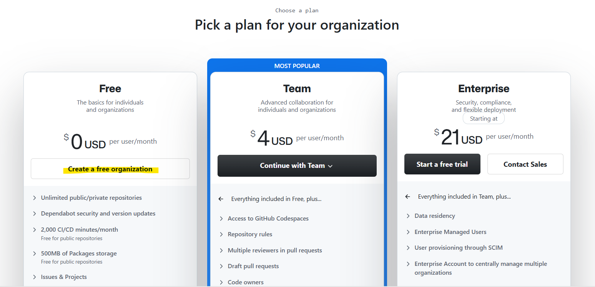

作成出来たらこんな画面になります

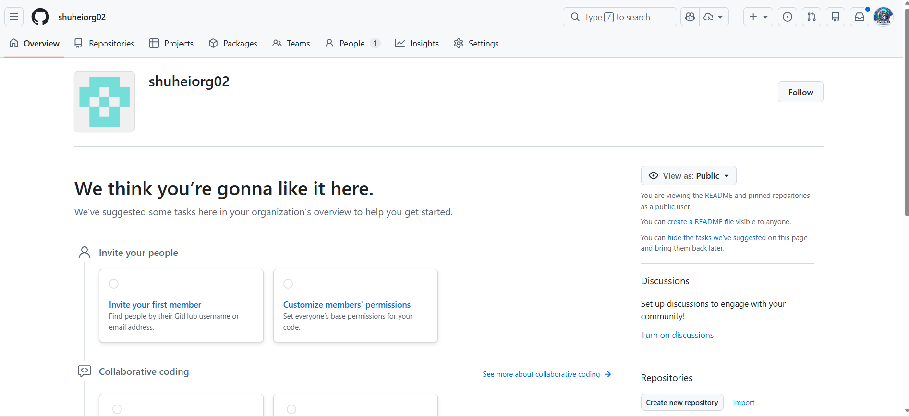

次にgithubのアクセストークン（このリポジトリにランディングゾーンを作るため）を発行していきます。

右上のユーザーアイコンをクリックして「Settings」をクリック

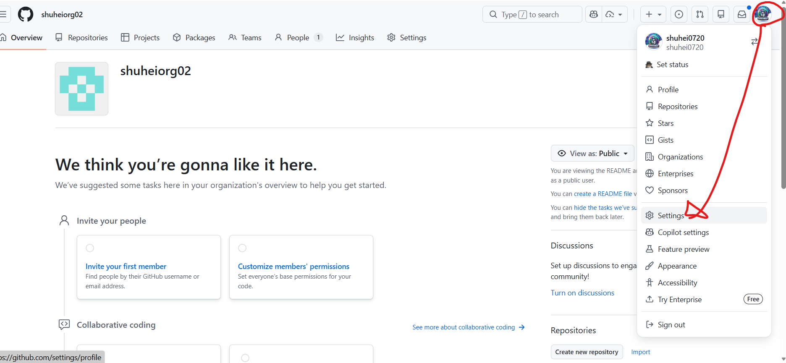

設定画面で一番下までスクロールして「Developer Settings」

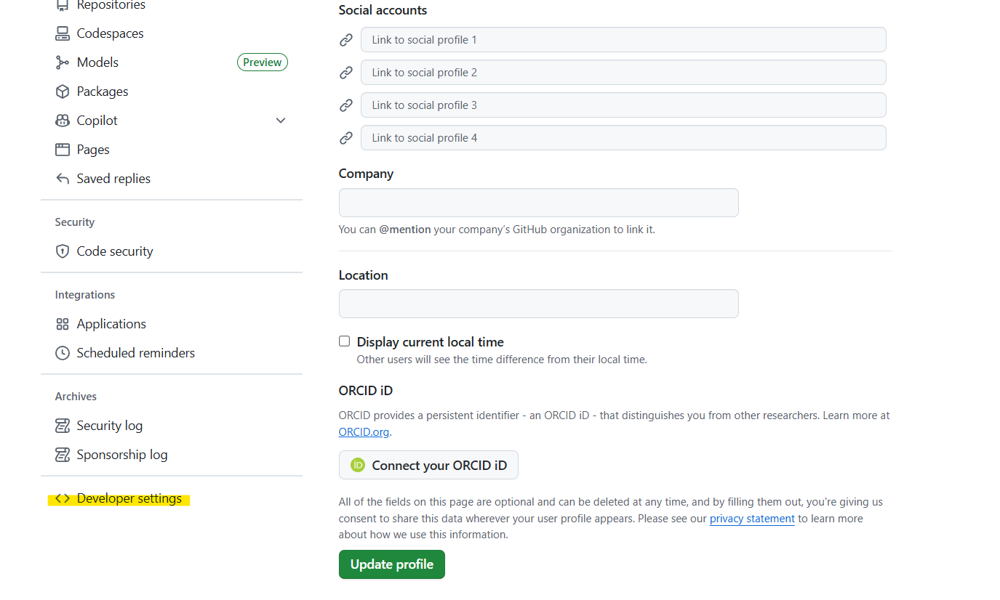

「Generate new token」をクリック

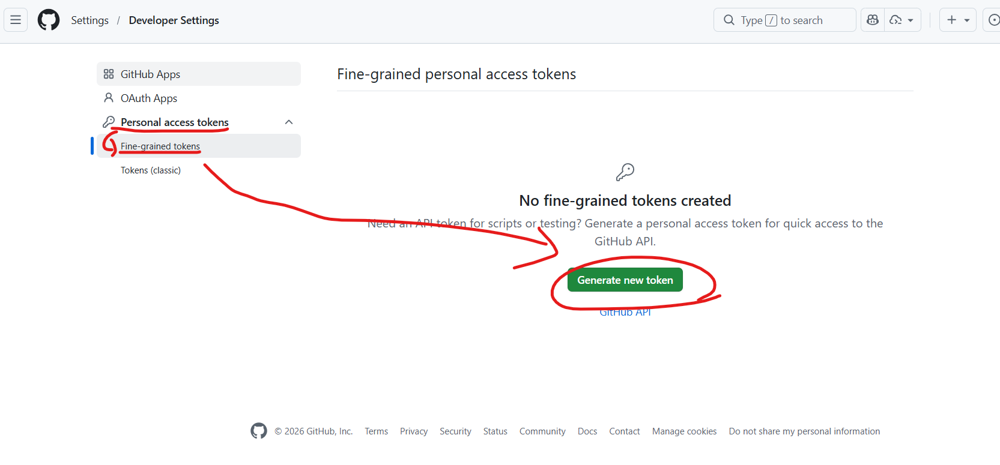

以下のように設定

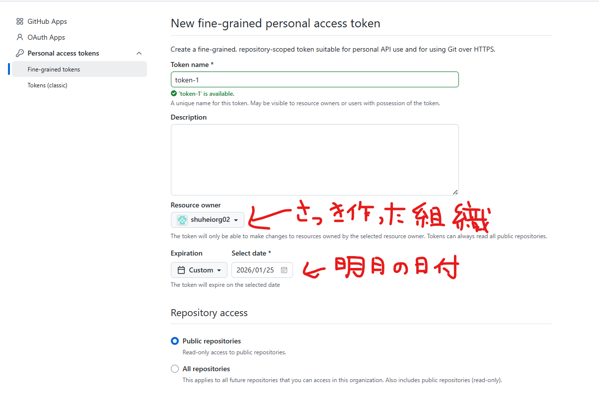

下にスクロールして、「all repository」を選択

→以下のRepositoriesに対するpermissionを追加して、全部Read and writeにする

- Actions
- Administration
- Contents
- Environment
- Secrets
- Variables
- Workflows

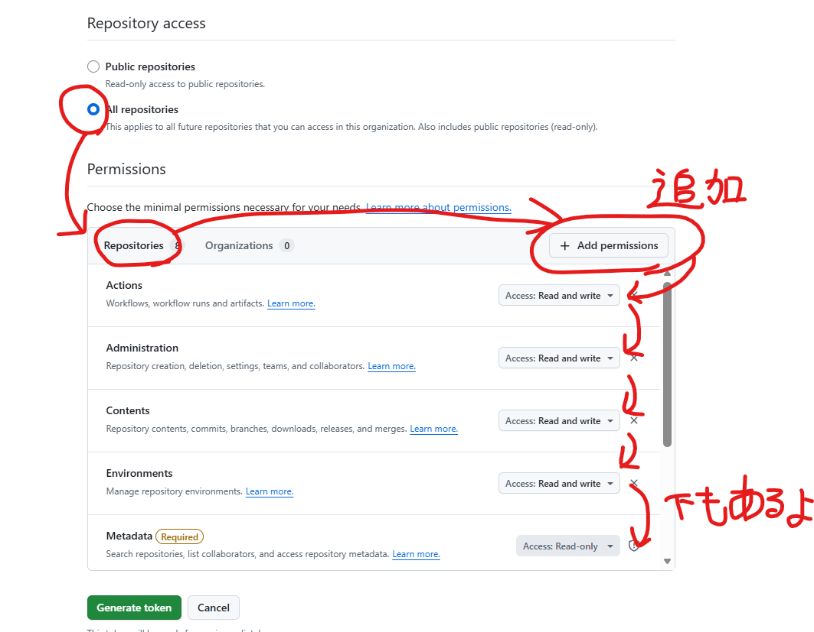

つぎに、「Orgnizations」を選択して、以下の権限を追加しましょう。

これも「Read and write」にします。

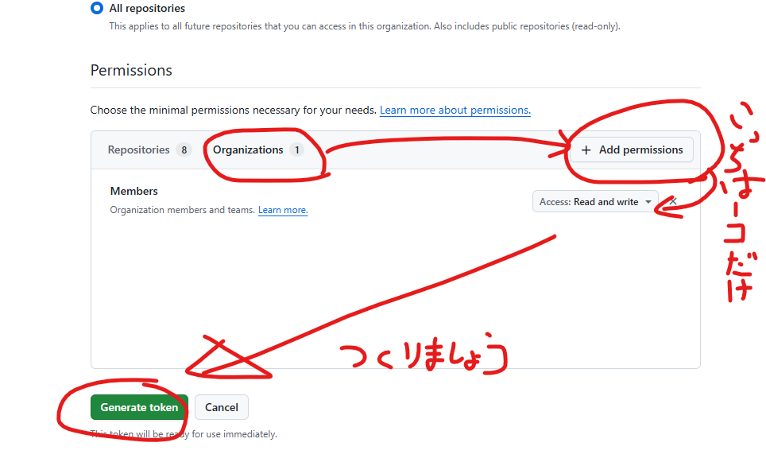

確認画面が出てくるので、下の画像と同じか確認して作りましょう！

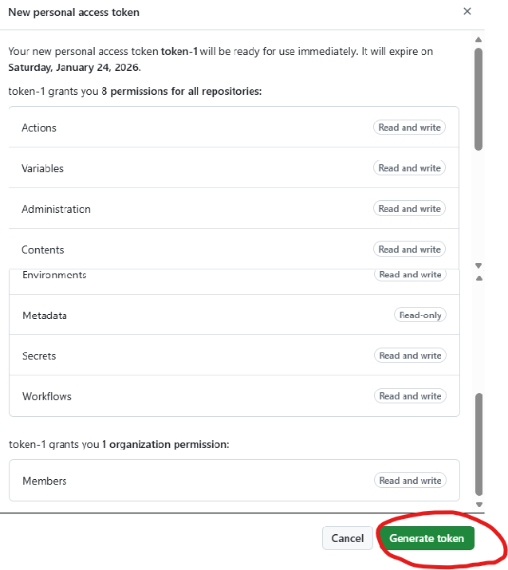

トークンが表示されるので、忘れないようにコピーしてください。後で使います。

※画面を閉じると二度と表示されないので忘れると作り直してください。

---


## Part 2: Bootstrap環境のセットアップ

### ALZ PowerShell Moduleのインストール

Bootstrapを実行するPowerShellモジュールをインストールします。

```powershell title="pwsh7を起動"
pwsh
```

```powershell title="ALZ Moduleのインストール"
# PowerShell 7.4+ で実行
Install-PSResource -Name ALZ -Repository PSGallery -TrustRepository
```

**確認**:

```powershell
Get-InstalledPSResource -Name ALZ
```

```text title="出力例"
Name Version Prerelease Repository
---- ------- ---------- ----------
ALZ  6.0.5              PSGallery
```

!!! tip "アップデート方法"
    ```powershell
    # 既にインストール済みの場合
    Update-PSResource -Name ALZ
    ```

---

### 対話モードでやっていきましょう

最初にaz loginでazureにログインしておきます。

※Tenant Root Groupに所有者権限を持っているアカウントでログインしてください。

```
az login
```

対話形式でBootstrap設定を行います。

```powershell title="ALZ Bootstrapの起動"
# PowerShell 7.4+ で実行
Deploy-Accelerator
```

**起動すると質問が始まります**：

ここから質問が始まるので答えていきます。まず、4回連続そのままEnterでいいです。

```
Enter the target folder path for the accelerator files (default: ~/accelerator):
Target folder path:　←そのままenterでOK
```

```
Select the Infrastructure as Code (IaC) type:
  [1] terraform (Default)
  [2] bicep
Enter selection (1-2, default: 1): ←そのままenterでOK
```

```
Select the Version Control System:
  [1] github (Default)
  [2] azure-devops
  [3] local
Enter selection (1-3, default: 1): ←そのままenterでOK
```

```
Select the Terraform scenario (see https://aka.ms/alz/acc/scenarios):
  [1] 1 - Full Multi-Region - Hub and Spoke VNet (Default)
  [2] 2 - Full Multi-Region - Virtual WAN
  [3] 3 - Full Multi-Region NVA - Hub and Spoke VNet
  [4] 4 - Full Multi-Region NVA - Virtual WAN
  [5] 5 - Management Only
  [6] 6 - Full Single-Region - Hub and Spoke VNet
  [7] 7 - Full Single-Region - Virtual WAN
  [8] 8 - Full Single-Region NVA - Hub and Spoke VNet
  [9] 9 - Full Single-Region NVA - Virtual WAN
Enter selection (1-9, default: 1): ←そのままenterでOK
```

以下のような質問になります。Y を入力してエンター

```
Would you like to configure the input values interactively now? (Y/n):Y
```
リージョンが聞かれますので、japaneastの 27　を入力

```
Select region (1-61, 0 for manual entry, or press Enter for default):27
```

次に以下のように聞かれるので、そのままエンターを教えてください。

```
[root_parent_management_group_id]
  The ID of the parent management group under which the ALZ management group hierarchy will be created. See Decision 6 in the planning phase.
  Help: https://azure.github.io/Azure-Landing-Zones/accelerator/0_planning/#decision-6---choose-a-parent-management-group
  Required: Yes
  Current value:
  Available management groups:
    [1] Tenant Root Group (9c3ef3df-9ca7-4dbe-885f-0887fe89e7a8)
    [0] Enter manually
    Press Enter to leave empty (uses Tenant Root Group) ←そのままenterでOK
```
そしたらmanagement用のサブスクリプションを選べと言われるので、どれかのサブスクリプションを選びます。

```
[subscription_ids]
  The subscription IDs for the platform landing zone subscriptions
  Help: https://aka.ms/alz/acc/phase0

  [management]
    The subscription ID for the Management subscription where logging, monitoring, and automation resources will be deployed
    Required: Yes
    Format: GUID (xxxxxxxx-xxxx-xxxx-xxxx-xxxxxxxxxxxx)
    Current value: <management-subscription-id> (placeholder - requires input)
    Available subscriptions:
      [1] subscription-hub 
      [2] subscription-spoke-a 
      [3] subscription-spoke-b 
      [4] subscription-spoke-e 
      [0] Enter manually
    Select subscription (1-4, 0 for manual entry, or press Enter for default):1 ←数字を入力
```

これを4回繰り返すので、それぞれ違うサブスクリプションを選びましょう。

すると、次にブートストラップ用のサブスクリプションを選べと言われるので、一番最初に選んだサブスクリプションの番号を入力しましょう。

```
[bootstrap_subscription_id]
  The subscription ID where bootstrap resources will be created. See Decision 8 in the planning phase.
  Help: https://azure.github.io/Azure-Landing-Zones/accelerator/0_planning/#decision-8---choose-the-bootstrap-subscription
  Required: Yes
  Format: GUID (xxxxxxxx-xxxx-xxxx-xxxx-xxxxxxxxxxxx)
  Current value:
  Available subscriptions:
    [1] subscription-hub (cbabd475-c37a-46b7-94c9-618f0fd9da01)
    [2] subscription-spoke-a (23f1ec72-2c33-47f8-ab80-599f216cb56c)
    [3] subscription-spoke-b (2f0010a8-8077-437a-901c-aababe33a20c)
    [4] subscription-spoke-e (ccc19b5e-07dc-45c5-9117-d1386759ee58)
    [0] Enter manually
  Select subscription (1-4, 0 for manual entry, or press Enter for default): 1 ←一番最初に選んだのと同じ
```

次にサービス名を聞かれますが、そのままエンターでOK。

```
[service_name]
  A short name identifier for the service, used in resource naming (e.g., 'alz'). See Decision 9 in the planning phase.
  Help: https://azure.github.io/Azure-Landing-Zones/accelerator/0_planning/#decision-9---choose-the-bootstrap-resource-naming
  Required: Yes
  Current value: alz
  Enter value (default: alz): ←そのままenterでOK
```

  次もエンターでOK
```
  [environment_name]
  The environment name used in resource naming (e.g., 'mgmt', 'prod'). See Decision 9 in the planning phase.
  Help: https://azure.github.io/Azure-Landing-Zones/accelerator/0_planning/#decision-9---choose-the-bootstrap-resource-naming
  Required: Yes
  Current value: mgmt
  Enter value (default: mgmt): ←そのままenterでOK
```

  次もエンターでOK

```
  [postfix_number]
  A numeric postfix for resource naming to ensure uniqueness. See Decision 9 in the planning phase.
  Help: https://azure.github.io/Azure-Landing-Zones/accelerator/0_planning/#decision-9---choose-the-bootstrap-resource-naming
  Required: Yes
  Format: Integer number
  Current value: 1
  Enter value (default: 1): ←そのままenterでOK
```

  次に、githubセルフホステッドランナーを使うかどうか聞かれますが、今回いらないので「false」でエンター

```
  [use_self_hosted_runners]
  Whether to deploy self-hosted GitHub Actions runners in Azure instead of using GitHub-hosted runners. See Decision 10 in the planning phase.
  Help: https://azure.github.io/Azure-Landing-Zones/accelerator/0_planning/#decision-10---choose-the-bootstrap-networking
  Required: Yes
  Format: true or false
  Current value: true
  Enter value (default: true):false ←falseを入力
```

  次はそのままエンター

```
  [use_private_networking]
  Whether to use private networking for the bootstrap resources. When enabled, resources will use private endpoints and be isolated from the public internet. See Decision 10 in the planning phase.
  Help: https://azure.github.io/Azure-Landing-Zones/accelerator/0_planning/#decision-10---choose-the-bootstrap-networking
  Required: Yes
  Format: true or false
  Current value: true
  Enter value (default: true): ←そのままenterでOK
```

  次はgithubのトークンを求められるので、さっきメモっておいたトークンを貼りましょう。
　※忘れた人はもう一回発行してください。

```
[github_personal_access_token]
  A GitHub Personal Access Token (PAT) with repo and workflow scopes for creating and managing the repository. Can also be supplied via environment variable TF_VAR_github_personal_access_token.
  Help: https://azure.github.io/Azure-Landing-Zones/accelerator/1_prerequisites/github/
  Required: Yes
  Current value: <to***-1>
  Enter value: ←トークンを貼り付け

```

次はそのままエンター

```
[github_runners_personal_access_token]
  A GitHub Personal Access Token (PAT) for registering self-hosted runners. Can also be supplied via environment variable TF_VAR_github_runners_personal_access_token.
  Help: https://azure.github.io/Azure-Landing-Zones/accelerator/1_prerequisites/github/
  Current value: <to***-2>
  Enter value: ←そのままenterでOK
```

次にgithubの組織の名前を聞かれるので、自分で作ったgithub組織の名前を入力してください。

```
[github_organization_name]
  The name of your GitHub organization or username where the repository will be created
  Help: https://azure.github.io/Azure-Landing-Zones/accelerator/1_prerequisites/github/
  Required: Yes
  Current value: <github-organization> (placeholder - requires input)
  Enter value: ←github組織の名前

```

次は、最初に作成した自分のgithubのユーザー名またはメールアドレスを入力してください。

```
[apply_approvers]
  List of GitHub usernames or email addresses who can approve Terraform apply operations in the GitHub Actions workflow
  Help: https://azure.github.io/Azure-Landing-Zones/accelerator/1_prerequisites/github/
  Format: Comma-separated list of values
  Current value: <email-address> (contains placeholders - requires input)
  Enter values (comma-separated):　←githubユーザー名を入力

```

次のようになるのでYを押しましょう。すると、エディタが開いて、入力した内容が確認できます。

```
Sensitive values have been set as environment variables:
  github_personal_access_token -> TF_VAR_github_personal_access_token

These environment variables are set for the current process only.
The config file contains placeholders indicating the values are set via environment variables.

Would you like to open the config folder in VS Code? (Y/n):Y ←Yを入力
```

そしたら「inputs.yaml」にこれまで入力してきた内容が書いてあるので確認しましょう！

そして、ランディングゾーンの重要設定ファイルである「platform-landing-zone.tfvars」がいよいよ登場です！

ここでいろいろ設定できます!が、今回は必須のところだけ設定しましょう！

まず、「starter_locations」を下記のように設定しましょう。

```
starter_locations = ["japaneast", "japanwest"]
```

次に、「defender_email_security_contact"」に以下のように自分のメアドを設定しましょう。

```
defender_email_security_contact = "replace_me@replace_me.com"
```

次に、「ddos_protection_plan_enabled」を設定しましょう。

ここをfalseにしないとめっちゃ金かかるのでここは絶対設定しましょう。

```
ddos_protection_plan_enabled = false
```

最後に一番下の方の「bastion」で以下のように設定しましょう。

※注意:プライマリとセカンダリがあるので両方に設定してください。

4か所にzones = [] を追加してください。

```
bastion = {
      zones = [] # ←追加
      subnet_address_prefix = "$${primary_bastion_subnet_address_prefix}"
      name                  = "$${primary_bastion_host_name}"
      bastion_public_ip = {
        zones = [] # ←追加
        name  = "$${primary_bastion_host_public_ip_name}"
      }
    }
    ...ほかのコード

bastion = {
      zones = [] # ←追加
      subnet_address_prefix = "$${secondary_bastion_subnet_address_prefix}"
      name                  = "$${secondary_bastion_host_name}"
      bastion_public_ip = {
        zones = [] # ←追加
        name = "$${secondary_bastion_host_public_ip_name}"
      }
    }
```

追加し終わったら保存してエディタを閉じましょう！

そして先ほどのPowerShellに戻ると、以下のように表示されているので「yes」を入力しましょう。

```
Have you checked and updated the configuration files? Enter 'yes' to continue with deployment, or 'no' to exit and configure later:
```

こんなのが表示されたらyを入力しましょう。

```
Upgrading bootstrap module from  to v6.1.8
Do you want to proceed with the upgrade? (y/n):
```

続けてyを入力

```
Do you want to proceed with the upgrade? (y/n):
```

そうしたらスクリプトterrafromのプランで何がデプロイされるかがズラッと出てきます。

少し待つと以下の確認画面になるので、Y を入力しましょう。

```
Confirm Terraform plan
Please confirm you wish to apply the plan.
[Y] Yes  [N] No  [?] Help (default is "Y"):
```

あなたが作成したgithubの組織を確認してみてください。コードがどんどん追加されていきます。

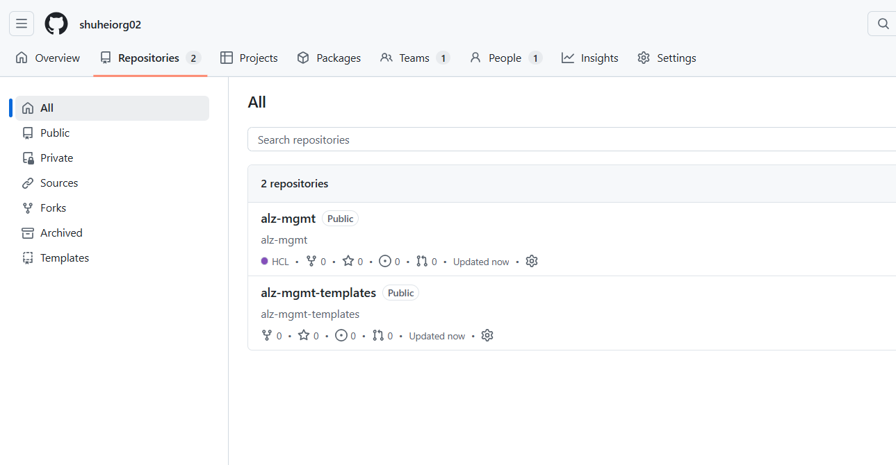

以下のようになれば実行成功です！

```
Time taken to complete Terraform apply:

Days Hours Minutes Seconds Milliseconds
---- ----- ------- ------- ------------
0    0     4       43      452


Bootstrap has completed successfully! Thanks for using our tool. Head over to Phase 3 in the documentation to continue...
PS C:\Users\user>
```

次のパートで何が作成されたか確認していきましょう。

---


## Part 3: Phase 1デプロイ実行

### State Storage

Terraform Stateを保存するAzure Storageが作成されます。

=== "作成されるリソース"

    ```text
    Resource Group: rg-alz-mgmt-state-japaneast-001
      └── Storage Account: stoalzmgmjap001xxxx
          └── Container: mgmt-tfstate
              └── Blob: terraform.tfstate
    ```

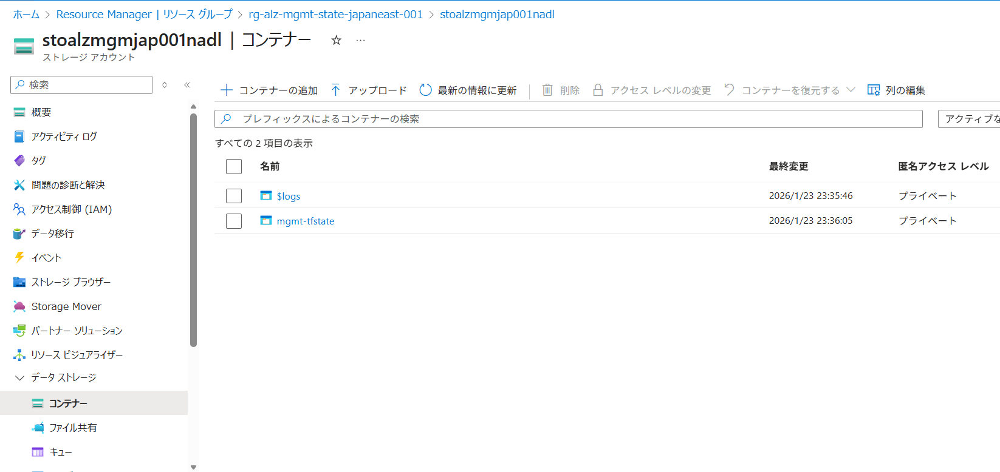

!!! info "State Storageの役割"
    - Terraform Stateを安全に保存
    - チームで共有可能
    - ロック機能でコンフリクト防止

---

### Managed Identityの作成

OIDCで使用するManaged Identityが作成されます。

=== "作成されるIdentity"

    ```text
    Resource Group: rg-alz-mgmt-identity-japaneast-001
      ├── Managed Identity: id-alz-mgmt-japaneast-apply-001
      └── Managed Identity: id-alz-mgmt-japaneast-plan-001
    ```
    
    **用途**:
    
    - `id-alz-mgmt-japaneast-plan-001`: Terraform Plan用（読み取り権限）
    - `id-alz-mgmt-japaneast-apply-001`: Terraform Apply用（書き込み権限）

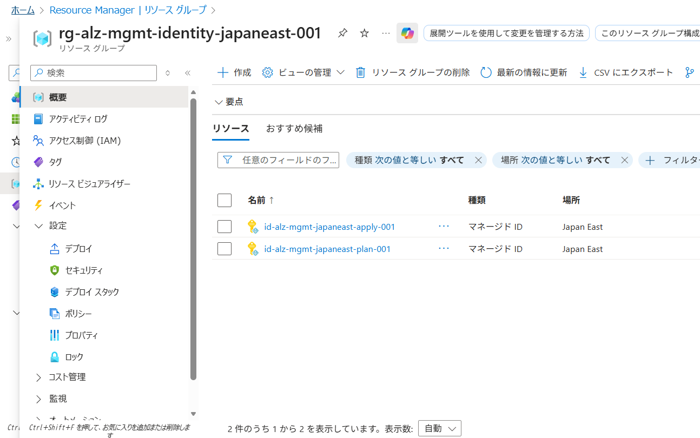

---

### Federated Credentialの設定

GitHub ActionsからAzureへの認証設定が作成されます。

=== "Plan用Federated Credential"

    ```bash title="設定内容"
    Name: github-actions-plan
    Identity: alz-plan-identity
    Issuer: https://token.actions.githubusercontent.com
    Subject: repo:shuhei0720org01/alz-mgmt:environment:alz-mgmt-plan
    Audiences: api://AzureADTokenExchange
    ```

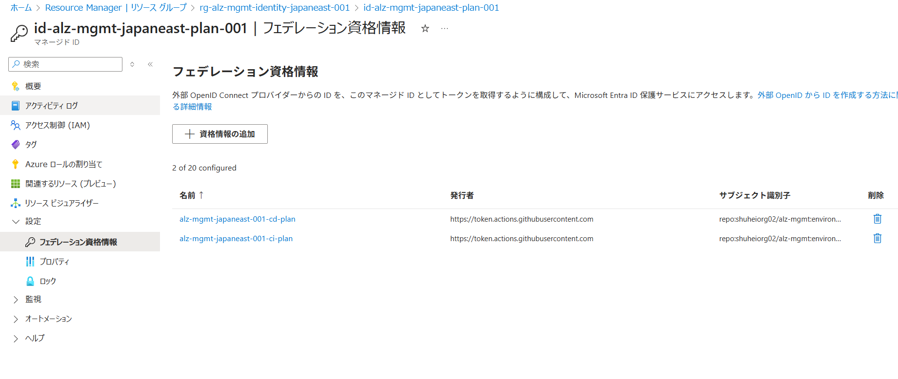

=== "Apply用Federated Credential"

    ```bash title="設定内容"
    Name: github-actions-apply
    Identity: alz-apply-identity
    Issuer: https://token.actions.githubusercontent.com
    Subject: repo:shuhei0720org01/alz-mgmt:environment:alz-mgmt-apply
    Audiences: api://AzureADTokenExchange
    ```

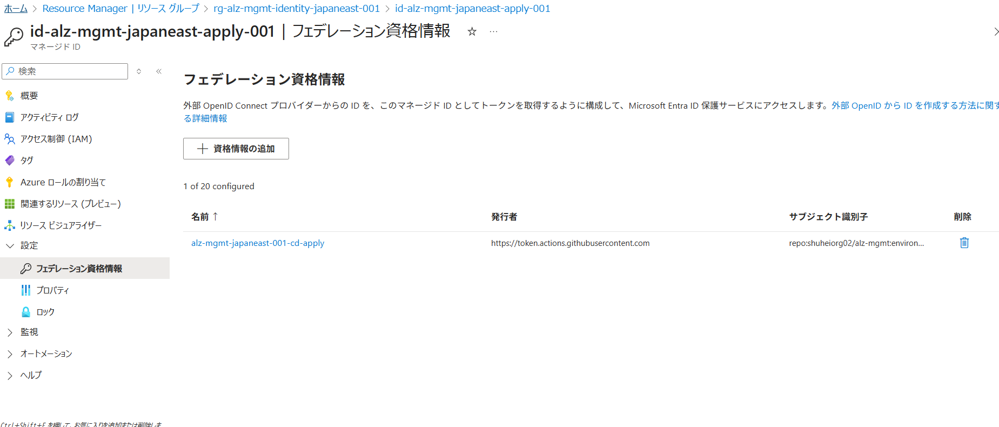


!!! success "OIDCのメリット（再確認）"
    - パスワード不要
    - 自動トークン発行
    - 短期間で期限切れ（安全）

---

### GitHub Repository/Actions作成

2つのリポジトリが作成されます。

=== "alz-mgmt（メイン）"

    **内容**:
    
    ```text
    alz-mgmt/
    ├── .github/
    │   └── workflows/
    │       ├── ci.yaml
    │       └── cd.yaml
    ├── main.tf
    ├── variables.tf
    ├── terraform.tfvars
    └── lib/
        ├── archetype_definitions/
        └── architecture_definitions/
    ```
    
    - Terraformコード
    - tfvars設定ファイル
    - CI/CD workflow呼び出し

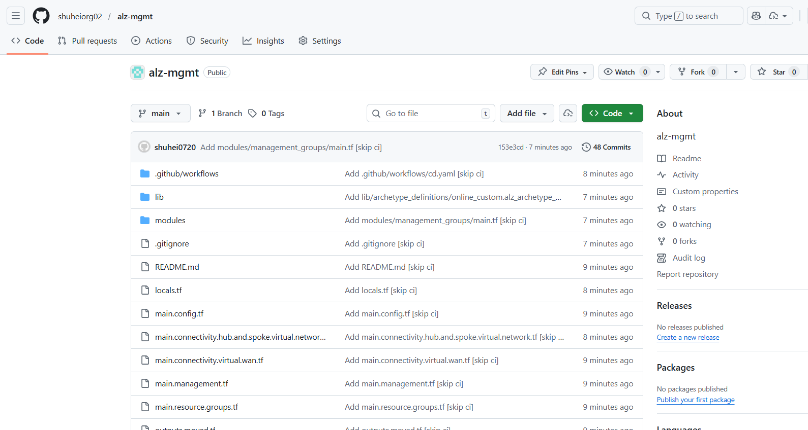

=== "alz-mgmt-templates（テンプレート）"

    **内容**:
    
    ```text
    alz-mgmt-templates/
    └── .github/
        └── workflows/
            ├── ci-template.yaml
            └── cd-template.yaml
    ```
    
    - 再利用可能ワークフロー
    - CI/CDロジック

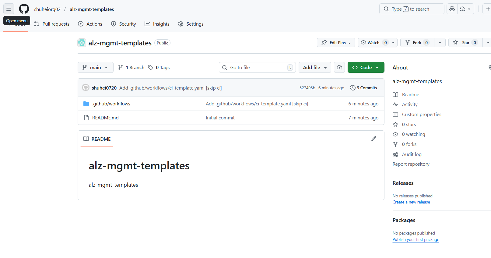

=== "GitHub Environments"

    **alz-mgmt-plan**:
    
    - Protection rules: なし（自動実行）
    - Variables:
        - `AZURE_CLIENT_ID`: Plan Identity
    
    **alz-mgmt-apply**:
    
    - Protection rules: Required reviewers（承認必須）
    - Variables:
        - `AZURE_CLIENT_ID`: Apply Identity

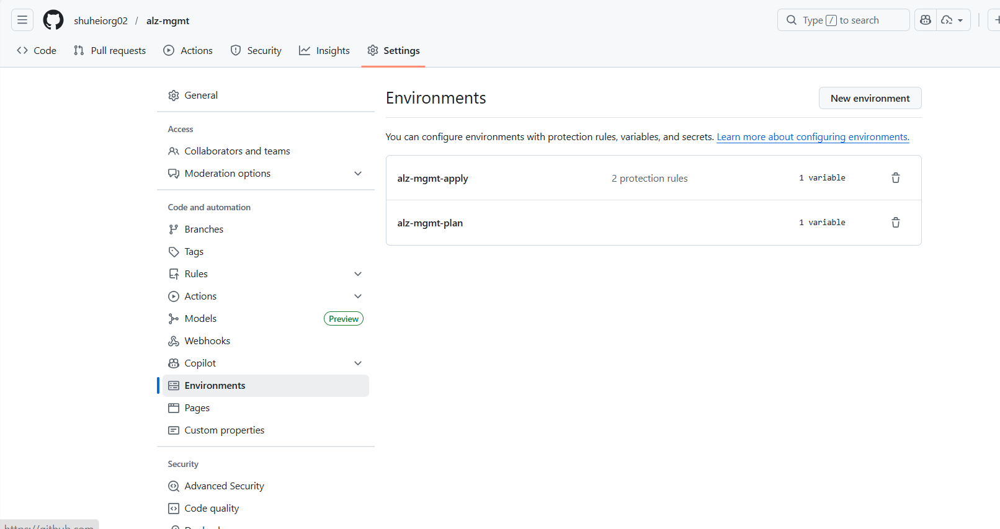


!!! success "Phase 1完了チェックリスト"
    - ✅ State Storage作成済み
    - ✅ Managed Identity作成済み
    - ✅ Federated Credential設定済み
    - ✅ GitHub Repository作成済み
    - ✅ GitHub Environments設定済み
    - ✅ Workflow作成済み

---

## まとめ

この章で学んだこと：

### ✅ Part 1: 前提条件の準備

- PowerShell 7.4+、Azure CLI 2.55+、Gitのインストール
- 4つのAzure Subscriptionの準備
- GitHubの準備

### ✅ Part 2: Bootstrap環境のセットアップ

- ALZ PowerShell Moduleのインストール
- Interactive Modeの実行
- Bootstrap実行

### ✅ Part 3: Phase 1デプロイ実行

- State Storage作成
- Managed Identity作成
- Federated Credential設定
- GitHub Repository/Actions作成

次の章では、実際にLanding Zonesをデプロイします（Phase 2）。

## 練習問題

理解度チェックです。休憩中に考えてみましょう。

### 問題1
Bootstrap Phase 1で作成するリソースは何ですか？（3つ答えてください）

### 問題2
Terraform StateをAzure Storageに保存する理由は何ですか？

### 問題3
Federated Credentialで設定する`subject`の値は何を表していますか？

---

## 練習問題の答え

### 答え1
1. **Storage Account**（Terraform State保存用）
2. **User Assigned Managed Identity**（GitHub Actions用の認証ID）
3. **Federated Credential**（OIDC認証用の信頼関係）

これらがBootstrap環境の基盤になります。

### 答え2
**複数人でTerraformを実行してもState情報を共有できるから**です。

ローカルState（❌）:
```
開発者A: terraform apply → ローカルにstate保存
開発者B: terraform apply → 開発者Aの変更が見えない！
→ リソースが重複作成される
```

リモートState（✅）:
```
開発者A: terraform apply → Azure Storageにstate保存
開発者B: terraform apply → Azure Storageからstate取得
→ 開発者Aの変更が見える
```

また、**State Lockingにより同時実行を防止**できます。

### 答え3
**どのGitHubリポジトリ・ブランチからの認証を許可するか**を表しています。

```hcl
subject = "repo:myorg/alz-mgmt:ref:refs/heads/main"
```

構造:
```
repo:{organization}/{repository}:ref:refs/heads/{branch}
```

例:
- `repo:myorg/alz-mgmt:ref:refs/heads/main` → mainブランチからのみ許可
- `repo:myorg/alz-mgmt:ref:refs/heads/develop` → developブランチからのみ許可
- `repo:myorg/alz-mgmt:pull_request` → Pull Requestからも許可

これにより、**特定のリポジトリ・ブランチからのみAzure認証を許可**できます。

!!! tip "次の章へ"
    [03_IaCのランディングゾーン環境を作ってみよう(続き).md](03_IaCのランディングゾーン環境を作ってみよう(続き).md)で、Landing Zonesのデプロイと検証を学びます。
