# 03. IaCのランディングゾーン環境を作ってみよう(続き) - Landing Zonesのデプロイと検証 🚀

## やってみよう💪

2章で準備は整ったので、この章でAzureにランディングゾーンを実際にデプロイしていきましょう！

---

## Part 1: Landing Zonesのデプロイ🛠️

### Phase 3 - Runの実行

いよいよLanding Zonesをデプロイします。

=== "GitHub Actionsでのデプロイ" ⚡

    **手順**:
    
    1. GitHubリポジトリにアクセス
    2. Actionsタブをクリック
    3. 「02 Azure Landing Zone Continuous Delivery」を選択
    4. 「Run workflow」をクリック
    5. ブランチを選択（通常はmain）
    6. 「Run workflow」を実行

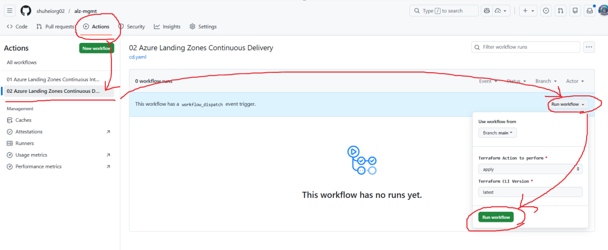

---


### GitHub Actionsでのデプロイ⚡

GitHub Actionsを使った自動デプロイの流れです。

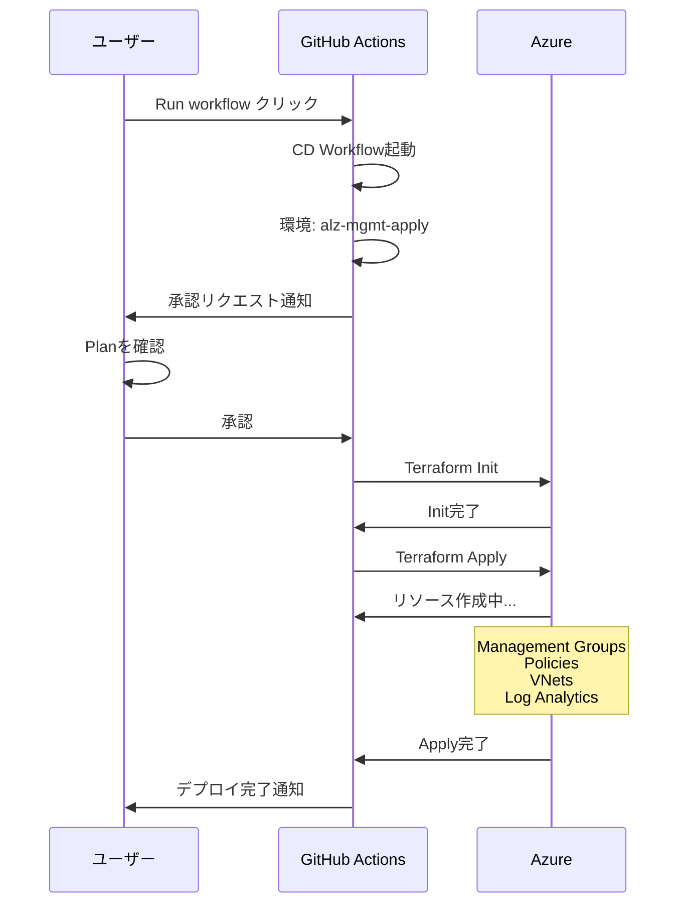
```mermaid
sequenceDiagram
    participant User as ユーザー
    participant GH as GitHub Actions
    participant Azure as Azure
    
    User->>GH: Run workflow クリック
    GH->>GH: CD Workflow起動
    GH->>GH: 環境: alz-mgmt-apply
    GH->>User: 承認リクエスト通知
    User->>User: Planを確認
    User->>GH: 承認
    GH->>Azure: Terraform Init
    Azure->>GH: Init完了
    GH->>Azure: Terraform Apply
    Azure->>GH: リソース作成中...
    Note over Azure: Management Groups<br/>Policies<br/>VNets<br/>Log Analytics
    Azure->>GH: Apply完了
    GH->>User: デプロイ完了通知
```

**実際の画面**:


02 Azure Landing Zone Continuous Delivery をクリックすると、実行中なのがわかります。
クリックして開いてみましょう。

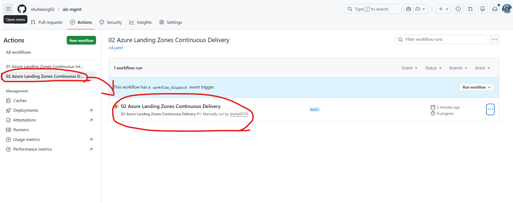

しばらく待つと、terraform planが終わって承認待ちになります。

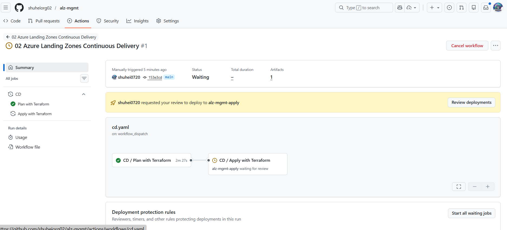

---

### Plan確認とApprovalについて👀

承認前に必ずPlanを確認します。

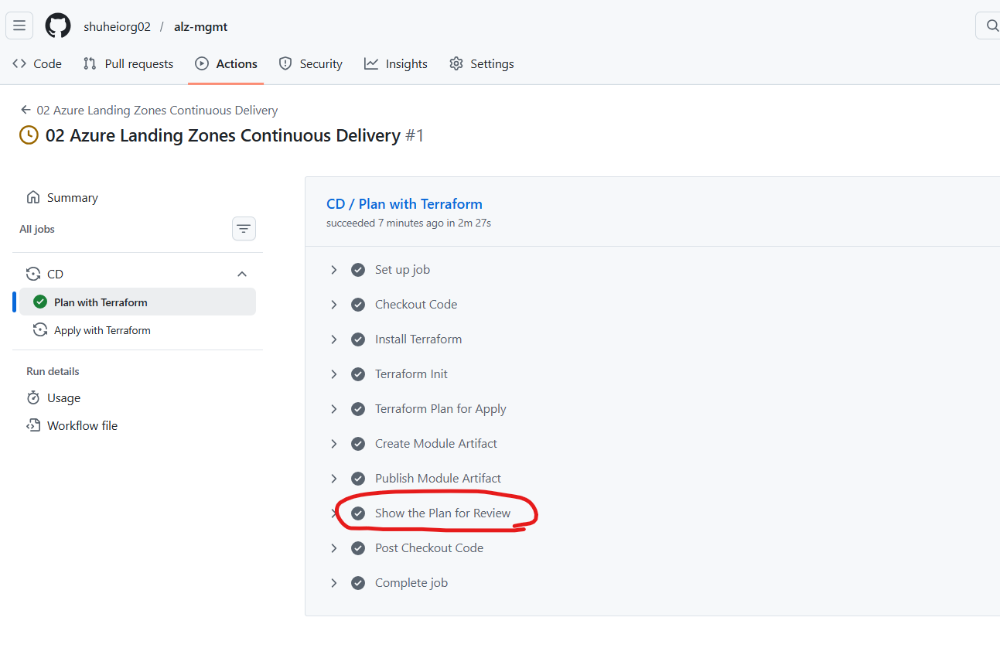

+が、新しく作成されるリソースです。

最初なので、物量が多いですが実運用だと確認が必要です。

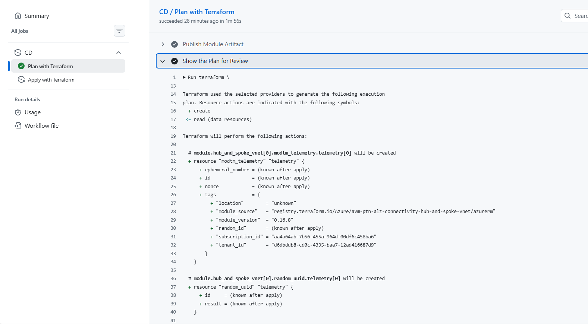

=== "確認ポイント"

    !!! warning "必ず確認⚠️"
        - ✅ 作成されるリソースは想定通りか
        - ✅ Management Group構造は正しいか
        - ✅ Subscription配置は正しいか
        - ✅ リージョンは正しいか（japaneast等）
        - ✅ 削除されるリソースがないか（初回は0のはず）

確認が済んだら、「Review deployments」をクリックして承認しましょう！Azureへのデプロイが始まります。

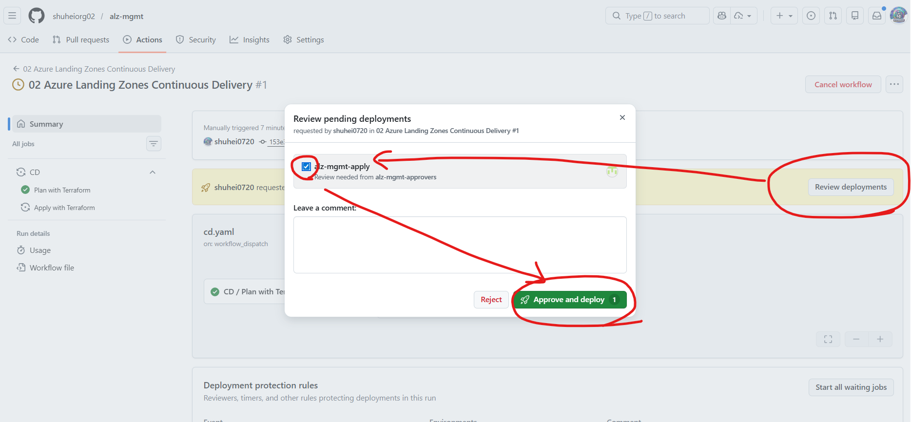

---

### Applyの実行

承認後、Terraformが自動実行されます。

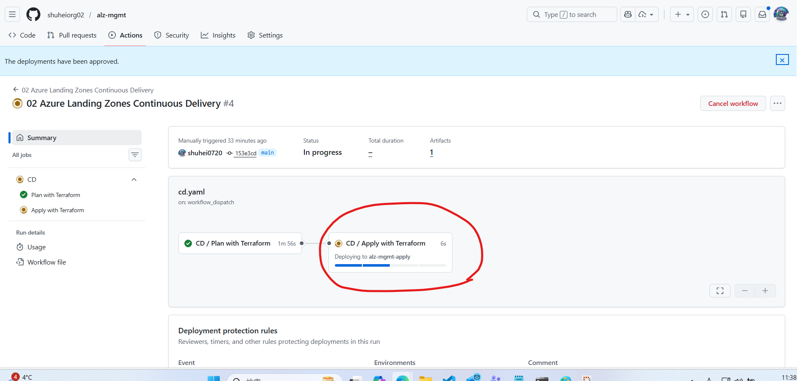

!!! info "デプロイ時間 ⏳"
    - 60〜90分かかります！
    
---

### デプロイ状況のモニタリング📊

実行したアクションをクリックして開くと、デプロイ状況をモニタリングできます。

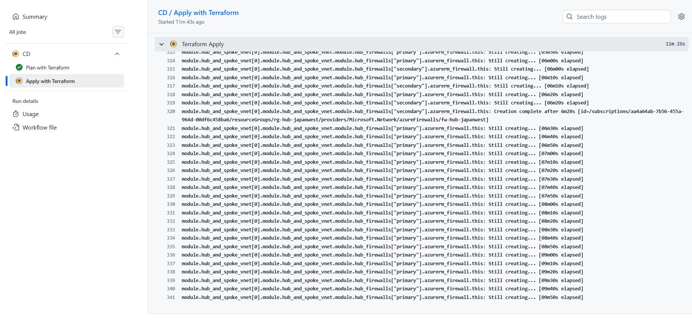

※もしエラーが出た場合は、エラーの赤文字の箇所を読んでみましょう。わからない場合はAIに聞いてみましょう。

以下のようになるとデプロイ成功です！

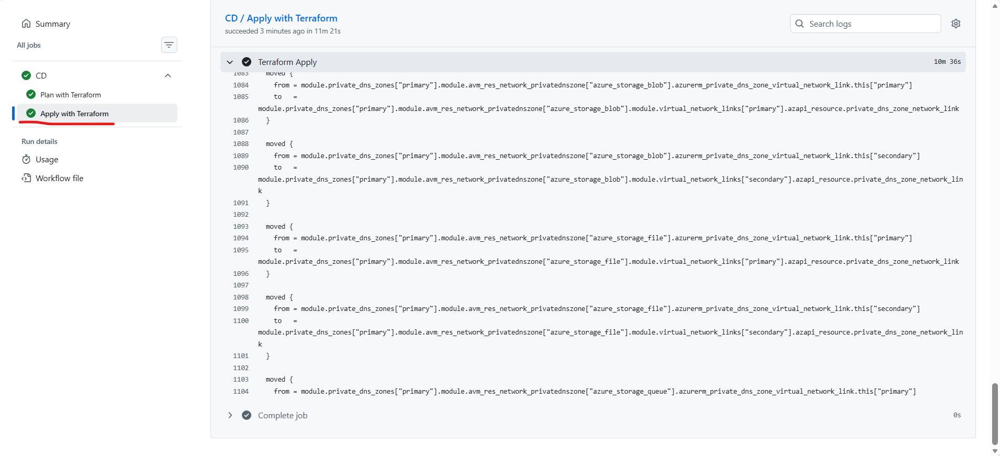

---

## Part 2: デプロイ後の検証🔍

### 管理グループ構造の確認

Azureポータルで作成された管理グループを確認してみましょう。

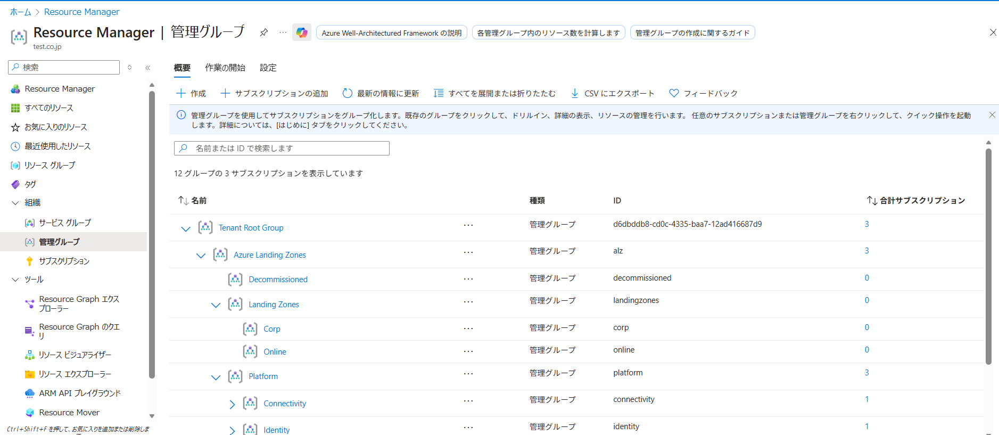

=== "確認ポイント" ✅

    !!! success "正しく作成されているか確認🎉"
        - ✅ Root Management Group（alz）が存在
        - ✅ Platform配下に3つのMG（Management、Connectivity、Identity）
        - ✅ Landing Zones配下に2つのMG（Corp、Online）
        - ✅ SandboxとDecommissionedが存在

---

### Policy割り当ての確認📜

Azureポータルでカスタムポリシーが作成されていることを確認しましょう。

alz管理グループスコープでいろいろ作成されています。

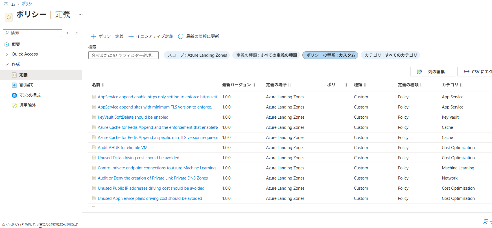

次に、Azureポータルでポリシーの割り当てを確認しましょう。

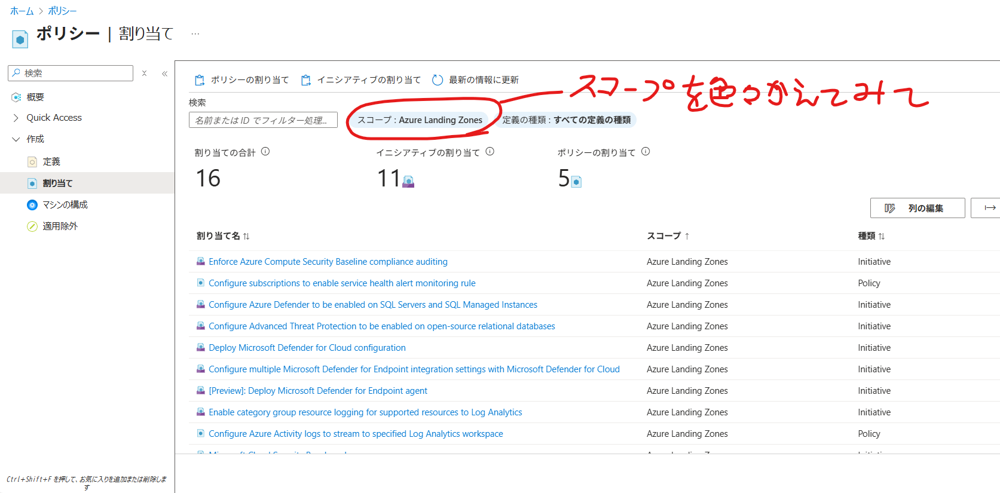

各管理グループスコープで様々なポリシーが割り当てられています。勉強になるので、じっくり見ていくのおすすめです。


割り当てられているポリシーの全容は、以下のサイトに書いています。こちらも参考になるので、見てみるといいでしょう。（英語なので日本語翻訳すると見やすいです）

https://github.com/Azure/Enterprise-Scale/wiki/ALZ-Policies

---

### Management Resourcesの確認🛠️

Log Analyticsワークスペース、DCRなどの管理リソースが作成されているか確認します。

リソースグループ「rg-managemanet-japaneast」に管理リソースが作成されています。

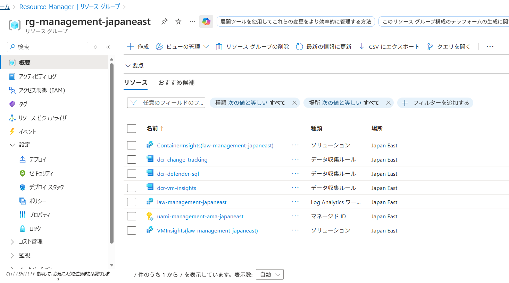

---

### Networking（Hub/Spoke）の確認🌐

Hub VNet、Azure Firewall、 VPN Gateway、 Bastionなどのネットワークリソースを確認します。

リソースグループ「rg-hub-japaneast」にHubのリソース、「rg-hub-dns-japaneast」にDNSのリソースが作成されています。


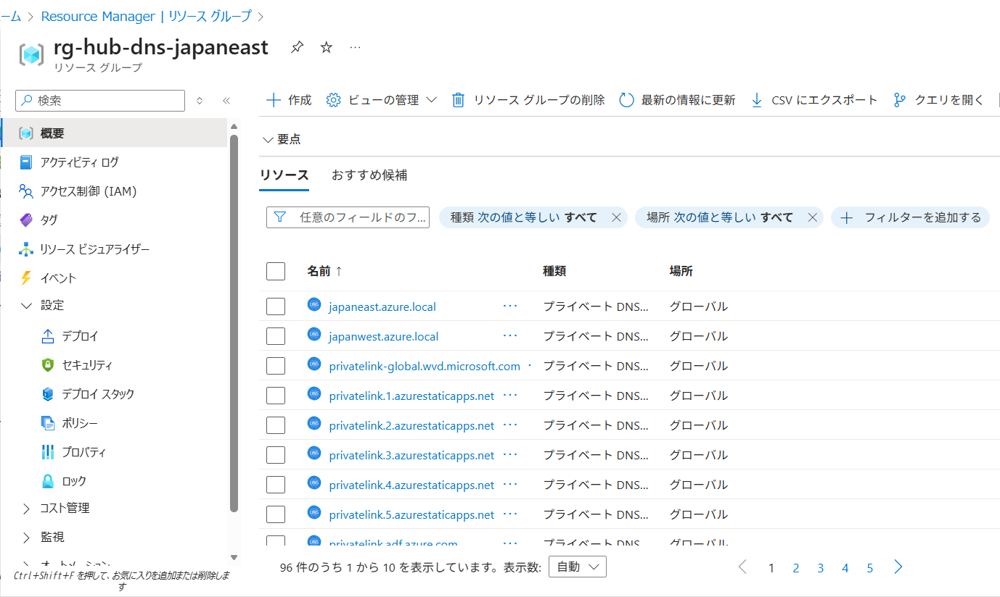


!!! success "検証完了チェックリスト✅"
    - ✅ Management Group階層が正しい
    - ✅ Policyが割り当て済み
    - ✅ Log Analytics Workspaceが稼働
    - ✅ Hub VNetが作成済み
    - ✅ Azure Firewallが稼働

---

## Part 3: カスタマイズの実践🎨

### 変更の適用方法

カスタマイズした設定の適用方法は以下のイメージになります。

詳しくは運用編で解説しますので、だいたいの理解でOKです。

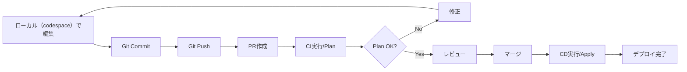
```mermaid
graph LR
    A[ローカル（codespace）で編集] --> B[Git Commit]
    B --> C[Git Push]
    C --> D[PR作成]
    D --> E[CI実行/Plan]
    E --> F{Plan OK?}
    F -->|No| G[修正]
    G --> A
    F -->|Yes| H[レビュー]
    H --> I[マージ]
    I --> J[CD実行/Apply]
    J --> K[デプロイ完了]
```

**手順**:

1. **ローカル（codespace）で編集**: tfvars、libファイルを変更
2. **Commit & Push**: feature ブランチにpush
3. **PR作成**: feature → main のPR
4. **CI実行**: 自動でPlan実行
5. **Plan確認**: 変更内容を確認
6. **マージ**: mainブランチにマージ
7. **CD実行**: 自動でApply実行
8. **承認**: Apply承認者が承認
9. **デプロイ**: 変更が適用される

!!! tip "安全なカスタマイズ🛡️"
    - 必ずfeatureブランチで作業
    - PRでPlanを確認
    - 小さい変更から始める
    - レビューを必ず受ける

---

### Azureポリシー割り当てのカスタマイズ📝

今回は検証のため、DDOSプロテクションは使用しないため、DDOSプロテクション適用のAzureポリシーの割り当てを削除してみましょう。

あなたの「alz-mgmt」リポジトリを開いて、「Code」→「Create Codespace on main」からgithub codespaceを作成し、ここで編集していきます。

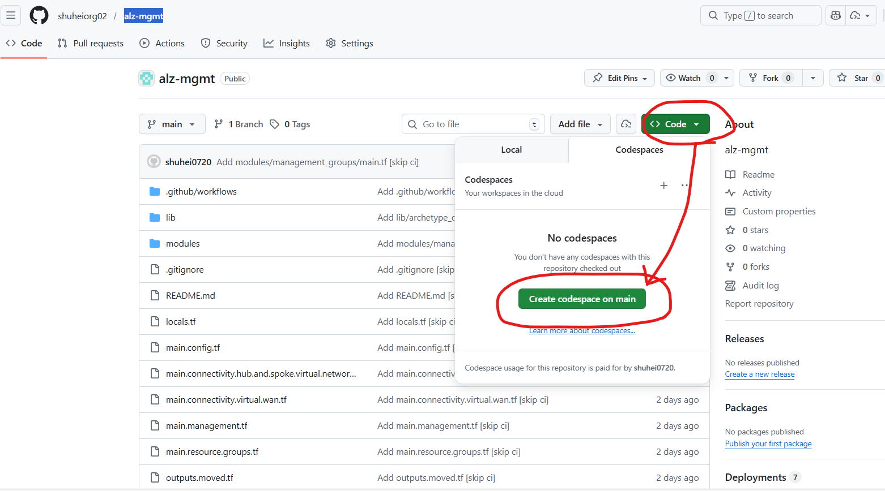

しばらく待つと、ブラウザでこんな画面が開きます。

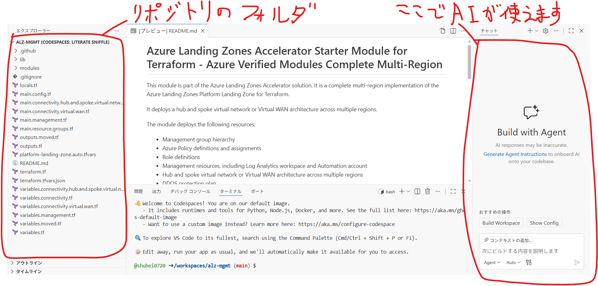

「lib/archetype_definitions/connectivity_custom.alz_archetype_override.yaml」を開いて編集していきましょう。

このファイルではAzureポリシーの割り当てをカスタマイズできます。

removeのところにDDOSのポリシーを削除する例が書いてあるので、コメントの「#」を削除して、削除する対象としましょう。

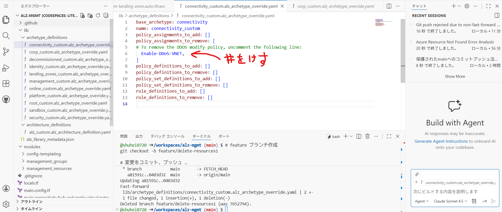


変更を保存したら、ターミナルで以下のコマンドを実行して、変更をリポジトリに反映していきます。

```
# feature ブランチ作成
git checkout -b feature/delete-ddos-policy

# 変更をコミット、プッシュ
git add .
git commit -m "ddosプロテクションのAzureポリシー割り当てを削除"
git push origin feature/delete-ddos-policy

# PR作成
gh pr create --base main --head feature/delete-ddos-policy --title "delete-ddos-policy" --body "delete-ddos-policy"

# PR番号を確認してマージ（squash mergeの例）
gh pr merge --squash

# mainブランチに戻る
git checkout main

# 最新を取得
git pull origin main

# ローカルブランチを強制削除
git branch -D feature/delete-ddos-policy

```

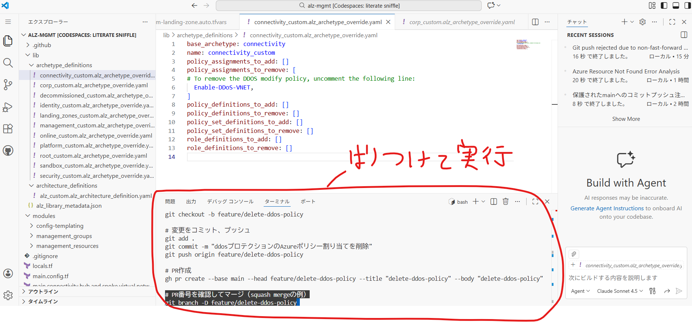

あなたのgithubの「alz-mgmt」リポジトリの画面に戻り、Actionsを見てみると、先ほどと同じように自動でCI（terraform plan）が実行されています。

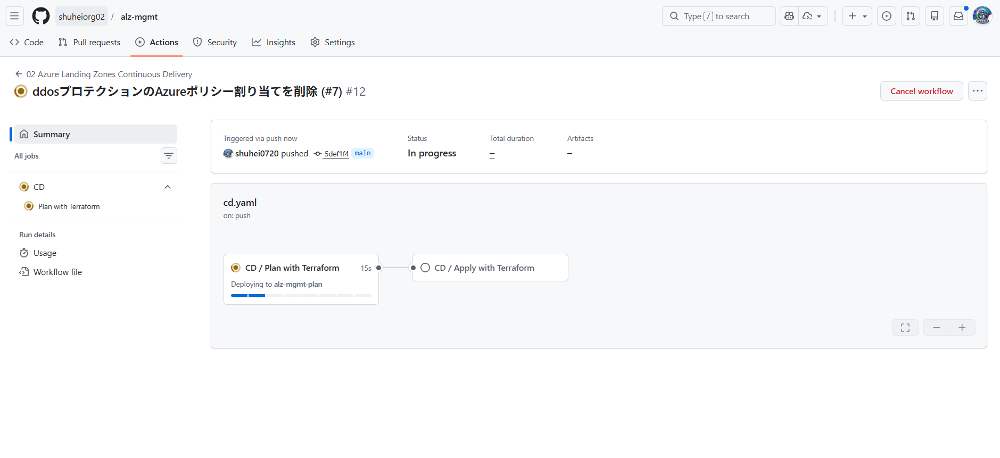

CIが終わったら、承認待ちになるので、先ほどと同じようにプランの変更点を確認して承認しましょう。

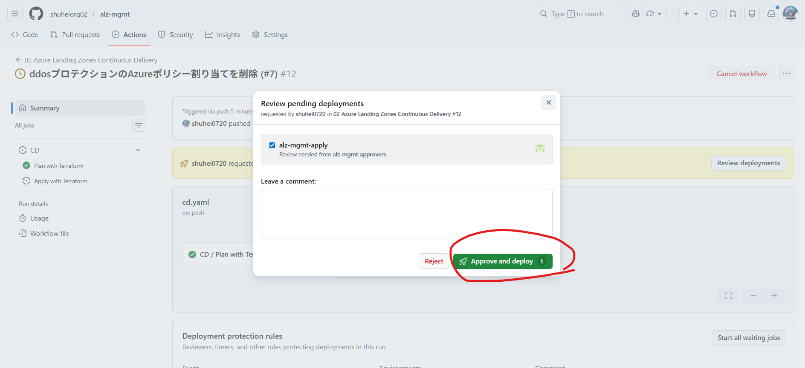

デプロイが終わると、DDOSプラン用のポリシーの割り当てが削除されます。

※Connectivity管理グループにもともと割り当てられていましたがなくなっています。

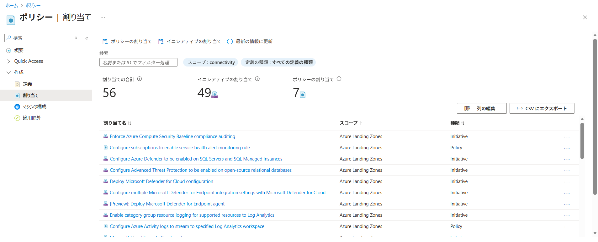

---

### 高額リソースの排除💸

今回は検証のために、高額リソースを消しておきましょう。

先ほどと同じようにgithub codespaceで編集していきます。

「platform-landing-zone.auto.tfvars」を開いて編集していきましょう。


次は、プライマリの高額リソースをfalseにします。

機能の有効無効の箇所を探して、falseに設定していきましょう。

※画像ではdnsが「true」で残ってますが、全部「false」にしてください。

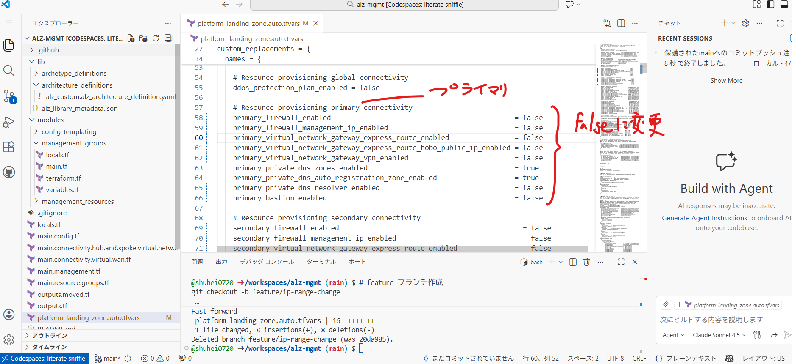

すぐ下のセカンダリの部分も同じように設定します。

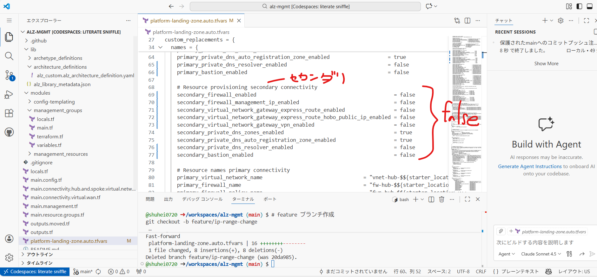


変更したら、ターミナルで以下のコマンドを実行して、変更をリポジトリに反映していきます。

```
# feature ブランチ作成
git checkout -b feature/delete-resources

# 変更をコミット、プッシュ
git add .
git commit -m "高額リソースを削除"
git push origin feature/delete-resources

# PR作成
gh pr create --base main --head feature/delete-resources --title "delete-resources" --body "delete-resources"

# PR番号を確認してマージ（squash mergeの例）
gh pr merge --squash

# mainブランチに戻る
git checkout main

# 最新を取得
git pull origin main

# ローカルブランチを強制削除
git branch -D feature/delete-resources

```


あなたのgithubの「alz-mgmt」リポジトリの画面に戻り、Actionsを見てみると、先ほどと同じように自動でCI（terraform plan）が実行されてるので、またplanで変更点を確認して承認→デプロイしていきましょう！

デプロイが終わると、高額のリソースが削除されるのでAzureポータルで確認しましょう。

※VNet、プライベートDNSゾーン、Azureポリシーは無料のリソースなので残しておいて大丈夫


---

### tfvarsのカスタマイズ⚙️

次に、設定をカスタマイズしてみましょう！

先ほどと同じようにgithub codespaceで「platform-landing-zone.auto.tfvars」を開いて編集していきましょう。

今回は、IPアドレス範囲をカスタマイズしてみます。

IPアドレスを定義している箇所を探して、以下のようにプライマリのIP範囲を「10.100.0.0/16」に変更してみましょう。

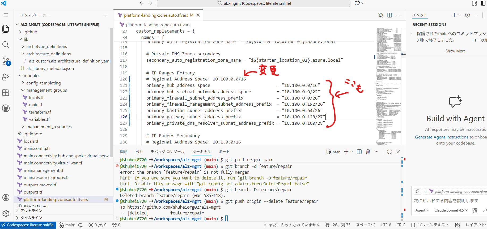


変更したら、ターミナルで以下のコマンドを実行して、変更をリポジトリに反映していきます。

```
# feature ブランチ作成
git checkout -b feature/ip-range-change

# 変更をコミット、プッシュ
git add .
git commit -m "ipレンジを変更"
git push origin feature/ip-range-change

# PR作成
gh pr create --base main --head feature/ip-range-change --title "ip-range-change" --body "ip-range-change"

# PR番号を確認してマージ（squash mergeの例）
gh pr merge --squash

# mainブランチに戻る
git checkout main

# 最新を取得
git pull origin main

# ローカルブランチを強制削除
git branch -D feature/ip-range-change

```

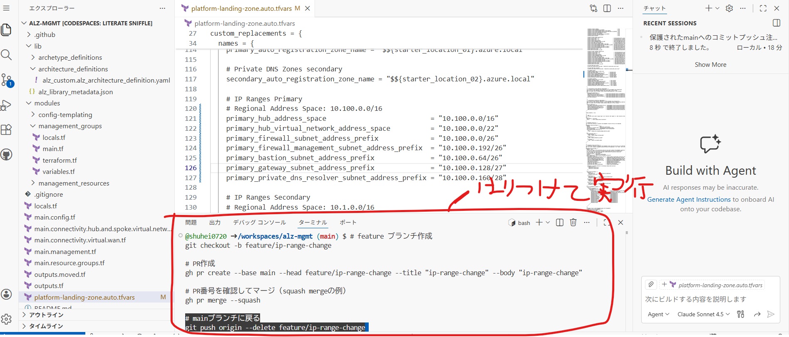

以下のような感じになると変更がリポジトリに反映されました。

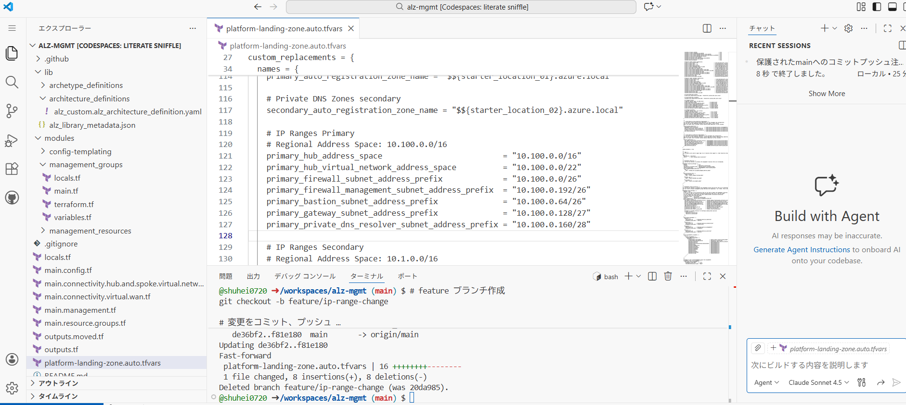

あなたのgithubの「alz-mgmt」リポジトリの画面に戻り、Actionsを見てみると、自動でCI（terraform plan）が実行されています。

※主はこの教科書のためにいろいろ試行錯誤しながらやってるので、過去の失敗のログが出てますが許して、、、

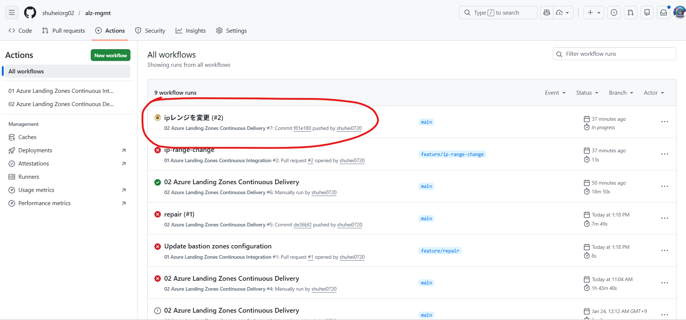

CIが終わったら、承認待ちになるので、先ほどと同じようにプランの変更点を確認して承認しましょう。

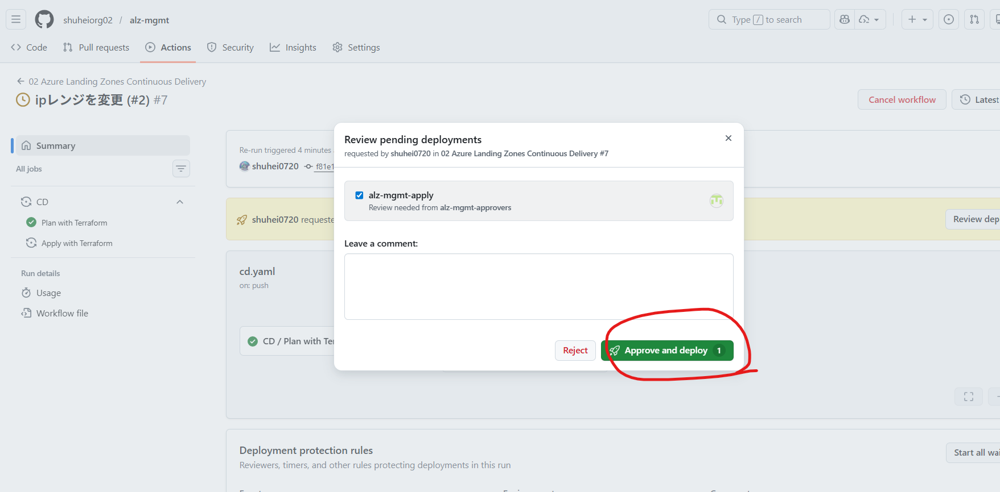

デプロイが終了したらAzureポータルでプライマリのHub VNetのIPを確認してみましょう。

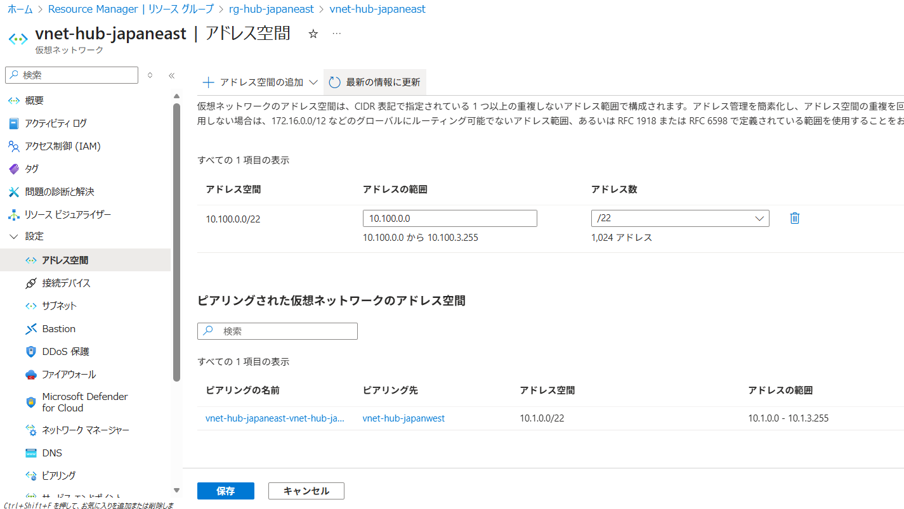

---

## まとめ📝

この章で学んだこと：

### ✅ Part 1: Landing Zonesのデプロイ

- Phase 3 - Runの実行
- GitHub Actionsでのデプロイ
- Plan確認とApproval
- Applyの実行
- デプロイ状況のモニタリング

### ✅ Part 2: デプロイ後の検証

- Management Group構造の確認
- Policy割り当ての確認
- Management Resourcesの確認
- Networking（Hub/Spoke or VWAN）の確認

### ✅ Part 3: カスタマイズの実践

- 変更の適用方法
- 高額リソースの排除
- tfvarsのカスタマイズ


次の章では、Landing Zonesの運用管理の基礎を学びます。

## 練習問題📝

理解度チェックです。休憩中に考えてみましょう。

### 問題1
Landing Zonesのデプロイに失敗した場合、  
最初に確認すべきログはどこにありますか？

### 問題2
デプロイ後に確認すべきリソースを3つ挙げてください。

### 問題3
`terraform state list`コマンドは何を確認するために使いますか？

---

## 練習問題の答え💡

### 答え1
**GitHub Actionsのワークフロー実行ログ**です。

GitHub → Actions → 該当のワークフロー実行:
```
Set up job
Run actions/checkout@v4
Run hashicorp/setup-terraform@v3
Terraform Init
Terraform Plan
Terraform Apply  # ← ここでエラー
```

エラーメッセージから原因を特定：
- **OIDC認証エラー**: Federated Credentialの設定ミス
- **権限エラー**: Managed Identityのロール不足
- **Terraformエラー**: 設定ファイルの間違い

### 答え2
1. **管理グループ**：階層構造が正しく作成されているか
2. **ポリシー割り当て**：適切な管理グループに割り当てられているか
3. **リソースグループ**：management、connectivityなどが作成されているか

Azure Portal または Azure CLI で確認:
```bash
# 管理グループ確認
az account management-group list

# リソースグループ確認
az group list --query "[].{name:name, location:location}"

# ポリシー割り当て確認
az policy assignment list --scope /providers/Microsoft.Management/managementGroups/contoso
```

### 答え3
**Terraformで管理しているリソースの一覧を確認**するために使います。

```bash
terraform state list
```

出力例:
```
azurerm_resource_group.management
azurerm_resource_group.connectivity
azurerm_log_analytics_workspace.management
azurerm_virtual_network.hub
azurerm_firewall.connectivity
...
```

これにより：
- どのリソースがTerraformで管理されているか確認
- デプロイ漏れがないかチェック
- Stateファイルの整合性確認

ができます。

!!! tip "次の章へ⏭️"
    [04_IaCランディングゾーンの運用管理.md](04_IaCランディングゾーンの運用管理.md)で、IaCの運用管理を学びます。
