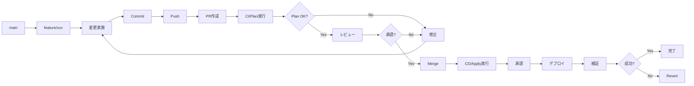

# 04. IaCランディングゾーンの運用管理

!!! info "この章で学ぶこと"
    Landing Zonesの日常運用と管理方法を学びます：

    1. terraformの運用
    2. 変更管理フロー
    3. サブスクリプション払い出しの自動化
    4. ポリシーの更新管理

    この章で、安定した運用ができるようになります。

---

## Part 1: Terraformの運用

### Configuration Driftの検出

Landing Zonesをデプロイした後、誰かがAzure Portalから手動でリソースを変更したり、設定を変えてしまったりすることがあります。

そうなると、Terraformのコードと実際のAzureの状態が違う。これを「Configuration Drift（設定のずれ）」と呼びます。

!!! warning "Driftが起きる典型的なケース"
    - Azure Portalから直接リソースを変更
    - 他のツールでの変更（Azure CLI、PowerShellなど）
    
    こういう変更があると、Terraformのコードと実際の状態がずれてしまいます。

#### Drift検出の仕組み

Terraformには、現在の状態とコードの差分を検出する機能が標準で備わっています。

```bash
# 現在の状態とコードの差分をチェック
terraform plan -detailed-exitcode
```

**Exit Codeの意味**:

- `0`: 変更なし（Driftなし）
- `1`: エラー発生
- `2`: 変更あり（Driftを検出！）

このコマンドを定期的に実行すれば、Driftを早期に発見できるってわけです。

#### GitHub ActionsでDrift検出を自動化

毎回手動でチェックするのは面倒だから、GitHub Actionsで自動化するのがベストプラクティスです。

毎日チェックして、もしDriftをログに出してくれるワークフローが以下です。

※ここからもしDriftがあったらTeamsに通知するなどの仕組みを実装します。

=== "ワークフローの作成"

    `.github/workflows/drift-detection.yml`を作成します：

    ```yaml title=".github/workflows/drift-detection.yml"
    name: Drift Detection

    on:
      schedule:
        - cron: '0 0 * * *'
      workflow_dispatch:

    permissions:
      contents: read
      id-token: write
      issues: write

    jobs:
      drift-check:
        uses: shuheiorg02/alz-mgmt-templates/.github/workflows/ci-template.yaml@main
        permissions:
          id-token: write
          contents: read
          pull-requests: write
        with:
          root_module_folder_relative_path: '.'
          terraform_cli_version: 'latest'

      analyze-drift:
        needs: drift-check
        if: always()
        runs-on: ubuntu-latest
        permissions:
          issues: write
          actions: read
        steps:
          - name: Check for Drift in Logs
            id: check
            uses: actions/github-script@v7
            with:
              script: |
                const jobs = await github.rest.actions.listJobsForWorkflowRun({
                  owner: context.repo.owner,
                  repo: context.repo.repo,
                  run_id: context.runId,
                });
                
                console.log(`Found ${jobs.data.jobs.length} jobs`);
                jobs.data.jobs.forEach(j => console.log(`Job: ${j.name} (${j.conclusion})`));
                
                const planJob = jobs.data.jobs.find(j => j.name.includes('Validate Terraform Plan'));
                if (!planJob) {
                  console.log('❌ Plan job not found');
                  core.setOutput('drift_detected', 'false');
                  return;
                }
                
                console.log(`✅ Found plan job: ${planJob.name} (ID: ${planJob.id})`);
                
                const logs = await github.rest.actions.downloadJobLogsForWorkflowRun({
                  owner: context.repo.owner,
                  repo: context.repo.repo,
                  job_id: planJob.id,
                });
                
                const logText = typeof logs.data === 'string' ? logs.data : String(logs.data);
                console.log(`Log size: ${logText.length} characters`);
                
                // ANSIエスケープシーケンスを除去
                const cleanedLog = logText.replace(/\x1b\[[0-9;]*m/g, '');
                console.log(`Cleaned log size: ${cleanedLog.length} characters`);
                
                // ログサンプルを出力
                const planIndex = cleanedLog.indexOf('Plan:');
                if (planIndex !== -1) {
                  console.log(`Found "Plan:" at position ${planIndex}`);
                  const sample = cleanedLog.substring(planIndex, planIndex + 100);
                  console.log('Sample around Plan:', sample);
                }
                
                // より柔軟な正規表現: 改行やタイムスタンプを含む可能性に対応
                // "Plan: 0 to add,\n 1 to change, 0 to destroy." のような複数行にも対応
                const planMatch = cleanedLog.match(/Plan:\s*(\d+)\s+to\s+add,\s*(\d+)\s+to\s+change,\s*(\d+)\s+to\s+destroy/is);
                
                if (planMatch) {
                  const [, add, change, destroy] = planMatch;
                  console.log(`📊 Plan match: ${add} to add, ${change} to change, ${destroy} to destroy`);
                  const hasChanges = parseInt(add) > 0 || parseInt(change) > 0 || parseInt(destroy) > 0;
                  
                  if (hasChanges) {
                    console.log('✅ Drift detected!');
                    core.setOutput('drift_detected', 'true');
                    core.setOutput('changes', `${add} to add, ${change} to change, ${destroy} to destroy`);
                    return;
                  } else {
                    console.log('✅ No changes detected');
                  }
                } else {
                  console.log('❌ No plan match found in logs');
                }
                
                core.setOutput('drift_detected', 'false');

          - name: Log Drift Detection
            if: steps.check.outputs.drift_detected == 'true'
            run: |
              echo "::warning::🚨 Configuration Drift検出: ${{ steps.check.outputs.changes }}"
              echo "詳細: https://github.com/${{ github.repository }}/actions/runs/${{ github.run_id }}"
    ```

=== "ハンズオン: ワークフローの実装"

    **Step 1: ワークフローファイルを作成**

     実践編と同じようにgithub codespacesを開きます。

    「.github/workflows/」フォルダに「drift-detection.yml」というファイルを作成します。

    「ワークフローの作成」タブのコードをコピーして、作成したファイルに貼り付けます。

    **Step 2: コミット＆プッシュ**

    ```bash
    # feature ブランチ作成
    git checkout -b feature/add-workflow

    # 変更をコミット、プッシュ
    git add .
    git commit -m "ワークフローを追加"
    git push origin feature/add-workflow

    # PR作成
    gh pr create --base main --head feature/add-workflow --title "add-workflow" --body  "add-workflow"

    # PR番号を確認してマージ（squash mergeの例）
    gh pr merge --squash

    # mainブランチに戻る
    git checkout main

    # 最新を取得
    git pull origin main

    # ローカルブランチを強制削除
    git branch -D feature/add-workflow
    ```

    **Step 3: 手動でテスト実行**

    1. GitHubリポジトリの「Actions」タブを開く
    2. 左側から「Drift Detection」を選択
    3. 「Run workflow」ボタンをクリック
    4. 「Run workflow」を確認

    !!! success "初回実行の結果"
        デプロイ直後なので、Driftは検出されないはず。「✅ No configuration drift detected」というメッセージが表示されるよ。

=== "動作確認: わざとDriftを作ってテスト"

    実際にDriftが検出されるかテストしてみよう。

    **Step 1: Azure Portalで手動変更**

    1. Azure Portalにログイン
    2. vnet-hub-japaneastにてきとうに一つタグを追加してみる。

    **Step 2: ワークフローを再実行**

    1. GitHub Actionsで**Drift Detection**を手動実行
    2. 実行が完了するまで待つ（2-3分程度）

    **Step 3: 結果を確認**

    - ワークフローが終わると、先ほど追加したタグが、Driftとしてログに出ていることが確認できる。

    !!! tip "Driftを解消する"
        テスト後は、CDのアプライを実行するとDriftが解消されます


#### Drift検出のベストプラクティス

=== "運用のポイント"

    **定期実行のタイミング**:
    
    - 毎日実行
    - リリース前後: デプロイ前後での状態確認
    - インシデント後: トラブル対応後の状態確認
    
    **Issueへの対応フロー**:
    
    1. **検出**: GitHub Actionsが検出
    2. **調査**: 誰が、なぜ変更したかを確認
    3. **判断**: 
        - 変更が正しい → Terraformコードを更新
        - 変更が誤り → Terraformで上書き
    4. **適用**: 決定した対応を実施
    5. **クローズ**
    
    **よくあるDriftのパターン**:
    
    | 変更内容 | 対応方法 |
    |---------|---------|
    | タグの追加・変更 | Terraformコードに反映 |
    | ネットワーク設定変更 | 通常は元に戻す |
    | ポリシーの無効化 | 必ず元に戻す |
    | リソースの削除 | 緊急時以外は元に戻す |

=== "注意点"

    !!! warning "Driftを放置しない"
        Driftを放置すると：
        
        - 次回の`terraform apply`で予期しない変更が発生
        - 本番環境の状態が不明確になる
        - トラブルシューティングが困難になる
        - コードとドキュメントの信頼性が低下
        
        検出したら必ず対応すること！

    !!! info "Stateful Resourcesの扱い"
        一部のリソース（Log Analyticsのデータなど）は、手動で操作しても問題ない場合がある。
        
        そういったリソースは、`lifecycle`ブロックで管理対象外にできる：
        
        ```hcl
        resource "azurerm_log_analytics_workspace" "example" {
          # ... 設定 ...
          
          lifecycle {
            ignore_changes = [
              tags["LastModified"],
              # 特定の属性の変更を無視
            ]
          }
        }
        ```

### Terraform Landing Zonesのバージョン更新

Azure Landing Zonesは定期的にアップデートされるます。

新機能の追加、バグ修正、セキュリティパッチなど、最新の状態に保つことが大事です。IaCのメリットを活かせます。

※IaCの管理でないと、Microsoftのアップデートに手動でついていく必要がある。直近などNSGフローログの廃止などがありました。今後はVMInsightsの廃止があるとの噂があります。

!!! info "なぜバージョン更新が必要？"
    - **セキュリティ**: 脆弱性への対応
    - **新機能**: Azureの新サービスへの対応
    - **バグ修正**: 既知の問題の解消
    - **ベストプラクティス**: Microsoftの推奨設定の反映
    
    半年〜1年に一度くらいは確認して、必要に応じて更新するのがおすすめ。

#### バージョン管理の仕組み

Landing Zonesでは、主要なバージョン更新箇所は二つあります。

**1. `terraform.tf` - ALZプロバイダーのバージョン**

```hcl title="terraform.tf"
terraform {
  required_version = "~> 1.12"
  
  required_providers {
    # Terraformプロバイダーのバージョン
    alz = {
      source  = "Azure/alz"
      version = "0.20.0"  # ← これ！ALZプロバイダー
    }
    azurerm = {
      source  = "hashicorp/azurerm"
      version = "~> 4.0"
    }
  }
}
```

**2. `modules/management_groups/main.tf` - AVMモジュールのバージョン**

```hcl title="modules/management_groups/main.tf"
module "management_groups" {
  source  = "Azure/avm-ptn-alz/azurerm"
  version = "0.14.1"  # ← これも！AVMパターンモジュール
  
  # ... 設定 ...
}
```

!!! warning "更新時にリリースノートは絶対確認！"

    対応バージョンは以下で確認：

    - [ALZプロバイダー リリースノート](https://github.com/Azure/terraform-provider-alz/releases)
    - [AVMパターンモジュール リリースノート](https://github.com/Azure/terraform-azurerm-avm-ptn-alz/releases)

#### バージョン更新の手順

- "Step 1: リポジトリのファイルで、現在のバージョン確認"

- "Step 2: リリースノートで最新バージョンの確認"
    
- "Step 3: コミットする"

- "Step 4: CIのterraformプランで変更点を確認"

- "Step 5: 変更点が確認できたらCDを起動して変更をデプロイする"


#### やってみよう: バージョンアップデートの実践

実際にバージョン更新を体験してみよう。

※バージョンは筆者がやってる時と違う場合があります。リリースノートを確認して最新のバージョンに更新してみましょう。

実践編と同じようにcodespacesを開いて、以下の2つのファイルを更新します。

!!! tip "更新が必要な2つのファイル"
    1. `terraform.tf` - ALZプロバイダー
    2. `modules/management_groups/main.tf` - AVMモジュール

**Step 1: terraform.tfのバージョンを変更**

「terraform.tf」を開いて、ALZプロバイダーのバージョンを更新：

```hcl title="terraform.tf（変更例）"
alz = {
  source  = "Azure/alz"
  version = "0.20.2"  # 0.20.0 → 0.20.2 に変更
}
```


**Step 2: modules/management_groups/main.tfのバージョンも変更**

`modules/management_groups/main.tf`を開いて、AVMモジュールのバージョンも変更：

```hcl title="modules/management_groups/main.tf（変更例）"
module "management_groups" {
  source  = "Azure/avm-ptn-alz/azurerm"
  version = "0.17.0"  # 0.14.1 → 0.17.0 に変更
  # ...
}
```


**Step 3: コミット&PRを作成**

以下のコマンドをターミナルで実行：

```bash
# feature ブランチ作成
git checkout -b feature/version-change

# 変更をコミット、プッシュ
git add .
git commit -m "バージョンを更新"
git push origin feature/version-change

# PR作成
gh pr create --base main --head feature/version-change --title "version-change" --body "version-change"

# PR番号を確認してマージ（squash mergeの例）
gh pr merge --squash

# mainブランチに戻る
git checkout main

# 最新を取得
git pull origin main

# ローカルブランチを強制削除
git branch -D feature/version-change
```

**Step 4: CIでPlanを確認**

リポジトリに戻るとCIが実行されているので、terraform planの変更点を確認しましょう。

!!! question "確認すること"
    - どんなリソースが変更される？
    - 削除されるリソースはない？
    - 意図しない変更はない？

**Step 5: 適用**

問題なければ、デプロイを承認して適用しましょう！

※バージョンに大きな変更があると、コードを変更する必要も出てくることがあります。できれば筆者と同じバージョンに更新することをお勧めします。


!!! success "完了！"
    これで2つのバージョン管理ポイントを確認できました。
    
    更新したファイル：
    - ✅ `terraform.tf` (ALZプロバイダー)
    - ✅ `modules/management_groups/main.tf` (AVMモジュール)


=== "まとめ"

    !!! success "学んだこと"
        ✅ バージョンファイルの場所と変更方法  
        ✅ terraform init/planでの確認方法  
        ✅ Git/GitHubでの変更フロー  
        ✅ CI/CDパイプラインの動作  
        ✅ バージョン更新の影響範囲の確認方法

    !!! tip "本番での運用ポイント"
        - **必ずリリースノートを読む**: 破壊的変更がないか確認
        - **テスト環境で先に試す**: 可能なら別のランディングゾーンで
        - **バックアップ**: 重要なリソースは事前にバックアップ
        - **メンテナンスウィンドウ**: 影響が少ない時間帯に実施
        - **ロールバック計画**: 問題が起きたときの戻し方を事前に決めておく

---

## Part 2: 変更管理フロー

### 変更リクエストの受付

変更リクエストを受け付ける際のプロセスです。

=== "変更リクエストテンプレート"

    ```markdown title=".github/ISSUE_TEMPLATE/change-request.md"
    ---
    name: 変更リクエスト
    about: Landing Zonesへの変更を申請
    title: '[変更] '
    labels: change-request
    assignees: ''
    ---
    
    ## 変更概要
    
    <!-- 何を変更するか簡潔に記載 -->
    
    ## 変更理由
    
    <!-- なぜこの変更が必要か -->
    
    ## 影響範囲
    
    - [ ] Management Group
    - [ ] Policy
    - [ ] Networking
    - [ ] Management Resources
    - [ ] その他: ___________
    
    ## 変更対象
    
    - Subscription: 
    - Resource Group: 
    - リソース: 
    
    ## 緊急度
    
    - [ ] 緊急（即日対応）
    - [ ] 高（1週間以内）
    - [ ] 中（2週間以内）
    - [ ] 低（1ヶ月以内）
    
    ## 変更予定日時
    
    YYYY-MM-DD HH:MM JST
    
    ## ロールバック計画
    
    <!-- 問題発生時の戻し方 -->
    ```

=== "レビュー基準"

    **承認条件**:
    
    - ✅ 変更理由が明確
    - ✅ 影響範囲が特定されている
    - ✅ ロールバック計画がある
    - ✅ テスト計画がある
    - ✅ セキュリティレビュー完了
    - ✅ 承認者の承認を得ている
    
    **却下理由**:
    
    - ❌ 影響範囲が不明
    - ❌ ロールバック計画なし
    - ❌ セキュリティリスクあり
    - ❌ ポリシー違反

### Branch→PR→Reviewフロー

GitHubでの変更フローです。



=== "Feature Branch作成"

    ```bash title="ブランチ作成"
    git checkout main
    git pull origin main
    git checkout -b feature/add-spoke-vnet
    ```

=== "変更実施"

    ```bash title="変更とコミット"
    # terraform.tfvarsを編集
    vim terraform.tfvars
    
    # 変更を確認
    git diff
    
    # コミット
    git add terraform.tfvars
    git commit -m "feat: App用Spoke VNetを追加"
    
    # Push
    git push origin feature/add-spoke-vnet
    ```

=== "PR作成"

    ```markdown title="PRテンプレート"
    ## 変更内容
    
    App用Spoke VNetを追加
    
    ## 変更理由
    
    新規アプリケーションのデプロイに必要
    
    ## 影響範囲
    
    - Networking: Spoke VNet追加
    - Peering: Hub VNetとのPeering追加
    
    ## テスト計画
    
    - [ ] CI/Planの確認
    - [ ] 疎通テスト
    
    ## チェックリスト
    
    - [x] tfvarsファイルを変更
    - [x] ローカルでPlan実行
    - [x] ドキュメント更新
    - [ ] レビュー完了
    - [ ] 承認完了
    
    ## 関連Issue
    
    Closes #123
    ```

### Terraform Plan確認

PRで実行されるPlanを確認します。

=== "Plan出力の確認"

    GitHub ActionsのCI実行結果を確認：
    
    ```text title="Plan Summary"
    Plan: 5 to add, 0 to change, 0 to destroy.
    
    + azurerm_virtual_network.app_spoke
    + azurerm_subnet.app_subnet
    + azurerm_virtual_network_peering.hub_to_app
    + azurerm_virtual_network_peering.app_to_hub
    + azurerm_route_table.app_routes
    ```

=== "確認ポイント"

    **必ず確認すること**:
    
    - ✅ 意図したリソースが追加されるか
    - ✅ 想定外の変更がないか
    - ✅ 削除されるリソースがないか
    - ✅ 依存関係が正しいか
    - ✅ 名前やタグが正しいか
    
    **警告サイン**:
    
    - ⚠️ `destroy` が含まれている
    - ⚠️ `to change` の数が多い
    - ⚠️ 意図しないリソースが含まれる

=== "コメントでの承認"

    ```markdown title="PR承認コメント"
    ## レビュー結果
    
    ✅ Plan確認完了
    
    ### 確認事項
    - [x] Spoke VNet: 10.1.0.0/16
    - [x] Subnet: app-subnet (10.1.0.0/24)
    - [x] Peering: 双方向
    - [x] Route Table: Hub Firewall経由
    
    ### 懸念事項
    なし
    
    承認します。マージしてください。
    ```

### Approval Process

本番適用の承認プロセスです。

=== "承認フロー"

    ```mermaid
    graph TD
        A[PR Merge] --> B[CD Workflow起動]
        B --> C[Plan実行]
        C --> D[承認待ち]
        D --> E{承認者確認}
        E -->|承認| F[Apply実行]
        E -->|却下| G[中止]
        F --> H[デプロイ完了]
        H --> I[通知]
    ```

=== "承認者の確認事項"

    **承認前チェックリスト**:
    
    - [ ] PRのレビューが完了しているか
    - [ ] Plan出力を確認したか
    - [ ] 影響範囲を理解しているか
    - [ ] ロールバック計画があるか
    - [ ] 変更時間帯は適切か
    - [ ] 関係者に通知済みか
    
    **承認コメント例**:
    
    ```text
    Plan確認しました。
    - 追加: 5リソース
    - 変更: 0リソース
    - 削除: 0リソース
    
    影響範囲: Networkingのみ
    ロールバック: Revert可能
    
    承認します。
    ```

=== "却下理由例"

    ```text
    以下の理由により却下します：
    
    ❌ 想定外のリソース削除が含まれている
    ❌ 変更時間帯が営業時間内（業務影響あり）
    ❌ ロールバック計画が不明瞭
    
    修正後、再度レビュー依頼してください。
    ```

### 変更履歴の管理

変更履歴を記録します。

=== "Gitログ"

    ```bash title="変更履歴確認"
    git log --oneline --graph --decorate --all
    ```
    
    ```text title="出力例"
    * a1b2c3d (HEAD -> main) feat: App用Spoke VNetを追加
    * d4e5f6g feat: SAP用Management Groupを追加
    * g7h8i9j fix: Firewallルールを修正
    * j0k1l2m feat: 環境タグ必須ポリシーを追加
    ```

=== "CHANGELOG.md"

    ```markdown title="CHANGELOG.md"
    # Changelog
    
    ## [1.2.0] - 2026-01-20
    
    ### Added
    - App用Spoke VNetを追加 (#123)
    - SAP用Management Groupを追加 (#120)
    
    ### Fixed
    - Firewallルールの誤設定を修正 (#121)
    
    ### Changed
    - Hub VNetのアドレス空間を拡張 (#122)
    
    ## [1.1.0] - 2026-01-15
    
    ### Added
    - 環境タグ必須ポリシーを追加 (#115)
    ```

=== "Release作成"

    ```bash title="Gitタグ作成"
    git tag -a v1.2.0 -m "Release v1.2.0: Spoke VNet追加"
    git push origin v1.2.0
    ```
    
    GitHubでReleaseを作成します。

!!! tip "変更管理のベストプラクティス"
    - 小さい変更から始める
    - 1つのPRで1つの変更
    - テスト環境で事前検証
    - ピーク時間を避ける
    - ロールバック計画を必ず用意

---

## Part 3: サブスクリプション払い出しの自動化

### Subscription Vendingとは？

新しいプロジェクトが始まるたび、「Azureサブスクリプションが欲しい！」って要望が来る。毎回手作業で対応するのは大変だし、設定漏れも起きやすい。

そこで、**YAMLファイルを1つ追加するだけで、サブスクリプションが自動的に払い出される仕組み**を作ろう。

!!! info "Subscription Vendingの仕組み"
    ```mermaid
    graph LR
        A[開発者] -->|YAMLファイル作成| B[parameters/myapp.yaml]
        B -->|PR作成| C[GitHub]
        C -->|CI/CD実行| D[Terraform]
        D -->|自動作成| E[サブスクリプション]
        D -->|自動配置| F[Management Group]
        D -->|自動設定| G[VNet/RBAC/タグ]
    ```
    
    開発者がやることは**YAMLファイルを1つ追加するだけ**！

---

### 🎯 やってみよう: サブスクリプション自動払い出し

!!! warning "前提条件"
    - Enterprise Agreement (EA) または Microsoft Customer Agreement (MCA) が必要
    - Billing Account への権限（Enrollment Account Owner など）
    
    **権限がない場合は、コードの確認だけでもOK！**

#### 手順1: 基盤のセットアップ

まず、サブスクリプション払い出しの仕組みを作ります。

```bash
# ブランチ作成
git checkout main
git pull origin main
git checkout -b feature/setup-subscription-vending

# ディレクトリ作成
mkdir -p subscription-vending/parameters
cd subscription-vending
```

#### 手順2: Terraformファイルを作成

**`main.tf`を作成：**

```hcl title="subscription-vending/main.tf"
terraform {
  required_version = "~> 1.12"
  required_providers {
    azurerm = {
      source  = "hashicorp/azurerm"
      version = "~> 4.0"
    }
  }
}

# YAMLファイルを読み込む
locals {
  subscription_files = fileset("${path.module}/parameters", "*.yaml")
  
  subscriptions = {
    for file in local.subscription_files :
    trimsuffix(file, ".yaml") => yamldecode(file("${path.module}/parameters/${file}"))
  }
}

# 各サブスクリプションを作成
module "subscription_vending" {
  source   = "Azure/lz-vending/azurerm"
  version  = "~> 4.1.3"
  
  for_each = local.subscriptions
  
  subscription_alias_enabled       = true
  subscription_display_name        = each.value.subscription_name
  subscription_alias_name          = each.key
  subscription_billing_scope       = var.billing_scope
  subscription_workload            = each.value.workload_type
  subscription_management_group_id = each.value.management_group_id
  
  subscription_tags = merge(
    each.value.tags,
    { "managed-by" = "terraform" }
  )
  
  # Virtual Network（オプション）
  virtual_network_enabled = lookup(each.value, "virtual_network", null) != null
  virtual_networks = lookup(each.value, "virtual_network", null) != null ? {
    primary = {
      name                = each.value.virtual_network.name
      address_space       = [each.value.virtual_network.address_space]
      location            = each.value.virtual_network.location
      resource_group_name = each.value.virtual_network.resource_group_name
      
      subnets = {
        for subnet in lookup(each.value.virtual_network, "subnets", []) :
        subnet.name => {
          name             = subnet.name
          address_prefixes = [subnet.address_prefix]
        }
      }
    }
  } : {}
  
  # ロール割り当て（オプション）
  role_assignment_enabled = lookup(each.value, "role_assignments", null) != null
  role_assignments = lookup(each.value, "role_assignments", null) != null ? {
    for idx, role in each.value.role_assignments :
    "${role.role}-${idx}" => {
      principal_id         = role.principal_id
      role_definition_name = role.role
      scope                = "subscription"
    }
  } : {}
}
```

**`variables.tf`を作成：**

```hcl title="subscription-vending/variables.tf"
variable "billing_scope" {
  description = "The billing scope for subscription creation (EA or MCA)"
  type        = string
  sensitive   = true
}
```

**`outputs.tf`を作成：**

```hcl title="subscription-vending/outputs.tf"
output "subscriptions" {
  description = "Created subscriptions"
  value = {
    for k, v in module.subscription_vending :
    k => {
      subscription_id = v.subscription_id
    }
  }
}
```

#### 手順3: 最初のサブスクリプションを定義

**YAMLファイルを作成：**

```yaml title="subscription-vending/parameters/demo-dev.yaml"
subscription_name: "Demo App - Development"
workload_type: "DevTest"
management_group_id: "landing-zones"

tags:
  environment: "development"
  cost-center: "engineering"
  project: "demo-app"
  owner: "demo-team"
```

#### 手順4: ルートのTerraformに統合

プロジェクトルートに戻って：

```bash
cd ..
```

**`main.tf`に追加：**

```hcl title="main.tf"
# ... 既存のLanding Zones設定 ...

# Subscription Vending
module "subscription_vending" {
  source = "./subscription-vending"
  
  billing_scope = var.billing_scope
}
```

**`variables.tf`に追加：**

```hcl title="variables.tf"
variable "billing_scope" {
  description = "Billing scope for subscription creation"
  type        = string
  sensitive   = true
}
```

**`terraform.tfvars`に追加：**

```hcl title="terraform.tfvars"
# あなたのBilling Scope IDに置き換え
# EA: /providers/Microsoft.Billing/billingAccounts/{billing_account_id}/enrollmentAccounts/{enrollment_account_id}
# MCA: /providers/Microsoft.Billing/billingAccounts/{billing_account_id}/billingProfiles/{billing_profile_id}/invoiceSections/{invoice_section_id}
billing_scope = "/providers/Microsoft.Billing/billingAccounts/xxxxx/enrollmentAccounts/xxxxx"
```

#### 手順5: コミット&PR作成

```bash
git add subscription-vending/ main.tf variables.tf terraform.tfvars
git commit -m "feat: Setup subscription vending"
git push origin feature/setup-subscription-vending

# PR作成
gh pr create --base main --head feature/setup-subscription-vending \
  --title "feat: Setup subscription vending" \
  --body "YAMLファイルベースのサブスクリプション払い出し機能を追加"
```

#### 手順6: CI/Planで確認してマージ

PRページでPlan結果を確認後、マージ：

```bash
gh pr merge --squash

git checkout main
git pull origin main
git branch -D feature/setup-subscription-vending
```

!!! success "基盤完成！"
    これで、YAMLファイルを追加するだけでサブスクリプションが作れるようになりました！

---

### 🚀 2つ目以降のサブスクリプション作成

基盤ができたので、**YAMLファイルを追加するだけ**でサブスクリプションを作れます！

#### 例1: シンプルなサブスクリプション

```bash
git checkout -b feature/add-webapp-sub
```

**YAMLファイルを作成：**

```yaml title="subscription-vending/parameters/webapp-prod.yaml"
subscription_name: "WebApp - Production"
workload_type: "Production"
management_group_id: "corp"

tags:
  environment: "production"
  cost-center: "product"
  project: "webapp"
  owner: "webapp-team"
```

```bash
git add subscription-vending/parameters/webapp-prod.yaml
git commit -m "feat: Add WebApp production subscription"
git push origin feature/add-webapp-sub

gh pr create --base main --head feature/add-webapp-sub \
  --title "feat: Add WebApp production subscription" \
  --body "WebApp本番環境用のサブスクリプションを追加"

# Plan確認後、マージ
gh pr merge --squash
```

#### 例2: VNet付きサブスクリプション

```yaml title="subscription-vending/parameters/myapp-dev.yaml"
subscription_name: "MyApp - Development"
workload_type: "DevTest"
management_group_id: "landing-zones"

tags:
  environment: "development"
  cost-center: "engineering"
  project: "myapp"
  owner: "myteam"

# Virtual Networkも作成
virtual_network:
  name: "vnet-myapp-dev"
  address_space: "10.100.0.0/16"
  location: "japaneast"
  resource_group_name: "rg-network-dev"
  subnets:
    - name: "snet-app"
      address_prefix: "10.100.1.0/24"
    - name: "snet-data"
      address_prefix: "10.100.2.0/24"
```

#### 例3: RBAC設定付き

```yaml title="subscription-vending/parameters/critical-prod.yaml"
subscription_name: "Critical System - Production"
workload_type: "Production"
management_group_id: "corp"

tags:
  environment: "production"
  cost-center: "it"
  project: "critical-system"
  criticality: "high"

role_assignments:
  - principal_id: "xxxxxxxx-xxxx-xxxx-xxxx-xxxxxxxxxxxx"  # プラットフォームチーム
    role: "Owner"
  - principal_id: "yyyyyyyy-yyyy-yyyy-yyyy-yyyyyyyyyyyy"  # 開発チーム
    role: "Reader"  # 本番は閲覧のみ
```

---

### 📋 YAMLファイルの書き方
    
    # ワークロードタイプ（Production または DevTest）
    workload_type: "DevTest"
    
    # Management Group ID（配置先）
    # - landing-zones: 通常のアプリケーション
    # - corp: 厳しいガバナンスが必要な場合
    # - online: インターネット公開アプリ
    management_group_id: "landing-zones"
    
    # タグ（必須）
    tags:
      environment: "development"
      cost-center: "engineering"
      project: "myapp"
      owner: "myteam"
    
    # Virtual Network（オプション）
    virtual_network:
      name: "vnet-myapp-dev"
      address_space: "10.100.0.0/16"
      location: "japaneast"
      resource_group_name: "rg-network-dev"
      subnets:
        - name: "snet-app"
          address_prefix: "10.100.1.0/24"
        - name: "snet-data"
          address_prefix: "10.100.2.0/24"
    
    # ロール割り当て（オプション）
    role_assignments:
      - principal_id: "xxxxxxxx-xxxx-xxxx-xxxx-xxxxxxxxxxxx"  # Azure AD Group ID
        role: "Contributor"
      - principal_id: "yyyyyyyy-yyyy-yyyy-yyyy-yyyyyyyyyyyy"
        role: "Reader"
    ```

### やってみよう: サブスクリプション自動払い出し

実際にパラメーターファイルを追加して、サブスクリプションを自動作成してみよう。

!!! warning "前提条件"
    - Enterprise Agreement (EA) または Microsoft Customer Agreement (MCA) が必要
    - Billing Account への権限（Enrollment Account Owner など）
    
    権限がない場合は、コードの確認だけでもOK！

=== "ハンズオン手順"

    **Step 1: ブランチを作成**
    
    ```bash
    git checkout main
    git pull origin main
    git checkout -b feature/setup-subscription-vending
    ```

    **Step 2: Subscription Vendingのファイルを作成**
    
    先ほどの「Step 2: Terraformファイル作成」の内容を作成：
    
    ```bash
    # ディレクトリ作成
    mkdir -p subscription-vending/parameters
    
    # ファイル作成（VS Codeなどで）
    # - subscription-vending/main.tf
    # - subscription-vending/variables.tf
    # - subscription-vending/outputs.tf
    ```

    **Step 3: 最初のサブスクリプションを定義**
    
    ```yaml title="subscription-vending/parameters/demo-dev.yaml"
    subscription_name: "Demo App - Development"
    workload_type: "DevTest"
    management_group_id: "landing-zones"
    
    tags:
      environment: "development"
      cost-center: "engineering"
      project: "demo-app"
      owner: "demo-team"
    
    # 最初はVNetなしでシンプルに
    # virtual_network: ...
    # role_assignments: ...
    ```

    **Step 4: ルートのmain.tfにモジュールを追加**
    
    プロジェクトルートの`main.tf`に追加：
    
    ```hcl title="main.tf"
    # ... 既存のLanding Zones設定 ...
    
    # Subscription Vending
    module "subscription_vending" {
      source = "./subscription-vending"
      
      billing_scope = var.billing_scope
    }
    ```
    
    `variables.tf`に追加：
    
    ```hcl title="variables.tf"
    variable "billing_scope" {
      description = "Billing scope for subscription creation"
      type        = string
      sensitive   = true
    }
    ```
    
    `terraform.tfvars`に追加：
    
    ```hcl title="terraform.tfvars"
    # あなたのBilling Scope IDに置き換え
    billing_scope = "/providers/Microsoft.Billing/billingAccounts/xxxxx/enrollmentAccounts/xxxxx"
    ```

    **Step 5: コミット&プッシュ、PR作成**
    
    ```bash
    git add subscription-vending/ main.tf variables.tf terraform.tfvars
    git commit -m "feat: Setup subscription vending"
    git push origin feature/setup-subscription-vending
    
    # PR作成
    gh pr create --base main --head feature/setup-subscription-vending \
      --title "feat: Setup subscription vending" \
      --body "Subscription Vending機能をセットアップ

## 概要
- パラメーターファイルベースのサブスクリプション払い出し
- 最初のサブスクリプション: Demo App Development

## 機能
- YAMLファイルを追加するだけでサブスクリプション作成
- Management Group自動配置
- タグ、VNet、RBACの自動設定"
    ```

    **Step 6: CI/Planで確認**
    
    PRページでPlan結果を確認：
    
    - 新しいサブスクリプションが作成される
    - Management Groupに配置される
    - タグが設定される

    **Step 7: マージ&デプロイ**
    
    ```bash
    gh pr merge --squash
    
    git checkout main
    git pull origin main
    git branch -D feature/setup-subscription-vending
    ```

=== "追加のサブスクリプションを作る"

    基盤ができたので、今度は**パラメーターファイルを追加するだけ**でサブスクリプションを作れます！
    
    **Step 1: ブランチ作成**
    
    ```bash
    git checkout -b feature/add-webapp-subscription
    ```
    
    **Step 2: YAMLファイルを追加**
    
    ```yaml title="subscription-vending/parameters/webapp-prod.yaml"
    subscription_name: "WebApp - Production"
    workload_type: "Production"
    management_group_id: "corp"  # Productionは厳しいガバナンス
    
    tags:
      environment: "production"
      cost-center: "product"
      project: "webapp"
      owner: "webapp-team"
      criticality: "high"
    
    # Virtual Networkも作成
    virtual_network:
      name: "vnet-webapp-prod"
      address_space: "10.200.0.0/16"
      location: "japaneast"
      resource_group_name: "rg-network-prod"
      subnets:
        - name: "snet-frontend"
          address_prefix: "10.200.1.0/24"
        - name: "snet-backend"
          address_prefix: "10.200.2.0/24"
        - name: "snet-database"
          address_prefix: "10.200.3.0/24"
    
    # ロール割り当て
    role_assignments:
      - principal_id: "xxxxxxxx-xxxx-xxxx-xxxx-xxxxxxxxxxxx"
        role: "Reader"  # Prodは閲覧のみ
      - principal_id: "yyyyyyyy-yyyy-yyyy-yyyy-yyyyyyyyyyyy"
        role: "Owner"   # プラットフォームチーム
    ```
    
    **Step 3: コミット&PR**
    
    ```bash
    git add subscription-vending/parameters/webapp-prod.yaml
    git commit -m "feat: Add WebApp production subscription"
    git push origin feature/add-webapp-subscription
    
    gh pr create --base main --head feature/add-webapp-subscription \
      --title "feat: Add WebApp production subscription" \
      --body "WebApp本番環境用のサブスクリプションを追加"
    ```
    
    これだけ！あとはCI/CDが自動的にサブスクリプションを作ってくれます。

=== "複数環境を一気に作る"

    開発、ステージング、本番を一気に作る場合：
    
    ```bash
    git checkout -b feature/add-myapp-environments
    ```
    
    3つのファイルを作成：
    
    ```yaml title="subscription-vending/parameters/myapp-dev.yaml"
    subscription_name: "MyApp - Development"
    workload_type: "DevTest"
    management_group_id: "landing-zones"
    tags:
      environment: "development"
      cost-center: "engineering"
      project: "myapp"
    ```
    
    ```yaml title="subscription-vending/parameters/myapp-staging.yaml"
    subscription_name: "MyApp - Staging"
    workload_type: "Production"
    management_group_id: "landing-zones"
    tags:
      environment: "staging"
      cost-center: "engineering"
      project: "myapp"
    ```
    
    ```yaml title="subscription-vending/parameters/myapp-prod.yaml"
    subscription_name: "MyApp - Production"
    workload_type: "Production"
    management_group_id: "corp"
    tags:
      environment: "production"
      cost-center: "product"
      project: "myapp"
    ```
    
    ```bash
    git add subscription-vending/parameters/myapp-*.yaml
    git commit -m "feat: Add MyApp all environments"
    git push origin feature/add-myapp-environments
    
    gh pr create --base main --head feature/add-myapp-environments \
      --title "feat: Add MyApp all environments" \
      --body "MyAppの全環境（Dev/Staging/Prod）を追加"
    ```
    
    これで3つのサブスクリプションが一度に作成されます！

### 運用のポイント

=== "申請から払い出しまで"

    **開発者がやること：**
    
    1. YAMLファイルを作成
    2. PRを作成
    3. レビュー待ち
    
    **プラットフォームチームがやること：**
    
    1. YAMLファイルのレビュー（設定が適切か確認）
    2. PRを承認
    3. マージ
    
    **自動で実行されること：**
    
    - サブスクリプション作成
    - Management Group配置
    - タグ付与
    - VNet作成（指定された場合）
    - RBAC設定（指定された場合）
    - ポリシー自動適用

=== "YAMLファイルのレビューポイント"

    PRレビュー時に確認すること：
    
    - ✅ **Management Group**: 環境に適したMGが選択されているか
    - ✅ **タグ**: 必須タグ（cost-center, project, owner）があるか
    - ✅ **ワークロードタイプ**: DevTestとProductionが正しいか
    - ✅ **VNetアドレス**: 他のVNetと重複していないか
    - ✅ **ロール割り当て**: 適切な権限か（Production環境でContributorは避ける）
    
    ```yaml
    # 悪い例（本番にContributor）
    role_assignments:
      - principal_id: "..."
        role: "Contributor"  # ❌ 本番環境では危険
    
    # 良い例（本番はReaderのみ）
    role_assignments:
      - principal_id: "..."
        role: "Reader"  # ✅ 本番は閲覧のみ
    ```

=== "トラブルシューティング"

    **エラー: YAMLパースエラー**
    
    ```
    Error: Invalid YAML syntax
    ```
    
    → インデントを確認。YAMLはスペース2つでインデント。
    
    **エラー: Billing scope権限不足**
    
    ```
    Error: insufficient privileges
    ```
    
    → Enrollment Account Owner権限が必要です。
    
    **エラー: Management Groupが見つからない**
    
    ```
    Error: management group not found
    ```
    
    → `management_group_id`の値を確認。Landing Zonesが正しくデプロイされているか確認。
    
    **エラー: サブスクリプション名の重複**
    
    ```
    Error: subscription alias already exists
    ```
    
    → YAMLファイル名を変更してください。ファイル名が`subscription_alias_name`になります。

---

## Part 4: ポリシーの更新管理

### ポリシー定義の追加


---

## まとめ

この章で学んだこと：

### ✅ Part 1: 日常運用タスク

- Policy準拠状況のチェック
- アラート対応
- 定期メンテナンス

### ✅ Part 2: 変更管理フロー

- 変更リクエストの受付
- Branch→PR→Reviewフロー
- Terraform Plan確認
- Approval Process
- 変更履歴の管理

### ✅ Part 3: サブスクリプションの払い出し自動化


### ✅ Part 4: ポリシーの更新管理

- ポリシー定義の追加
- ポリシー割り当ての変更
- Exclusion（除外）管理
- ポリシーの無効化・削除
- カスタムポリシーの作成

次の章では、運用の自動化と効率化について学びます。

## 練習問題

理解度チェックです。休憩中に考えてみましょう。

### 問題1
新しいリソースグループを追加する際の正しい手順は何ですか？

### 問題2
`terraform plan`と`terraform apply`の違いは何ですか？

### 問題3
ポリシー定義を更新する際に注意すべきことは何ですか？

---

## 練習問題の答え

### 答え1
正しい手順:

1. **ブランチ作成**
   ```bash
   git checkout -b feature/add-resource-group
   ```

2. **tfvarsファイル編集**
   ```hcl
   resource_group_config = {
     # 既存のRG
     "rg-management-jp" = { ... }
     
     # 新しいRG
     "rg-app-jp" = {
       location = "japaneast"
       tags = {
         environment = "prod"
         application = "myapp"
       }
     }
   }
   ```

3. **ローカルでplan確認**
   ```bash
   terraform plan
   ```

4. **Pull Request作成**
   ```bash
   git add .
   git commit -m "feat: Add app resource group"
   git push origin feature/add-resource-group
   ```

5. **レビュー承認後、マージ**

6. **GitHub Actionsで自動デプロイ**

### 答え2

| コマンド | 動作 | 実行結果 |
|----------|------|----------|
| `terraform plan` | **変更内容のプレビュー** | リソースは変更されない |
| `terraform apply` | **実際に変更を適用** | リソースが作成・変更・削除される |

**planの出力例:**
```
Terraform will perform the following actions:

  # azurerm_resource_group.app will be created
  + resource "azurerm_resource_group" "app" {
      + name     = "rg-app-jp"
      + location = "japaneast"
    }

Plan: 1 to add, 0 to change, 0 to destroy.
```

**必ずplanで確認してからapply**しましょう。

### 答え3

1. **既存リソースへの影響を確認**
   ```bash
   terraform plan
   ```
   ポリシー更新が既存リソースに影響する場合、Non-compliantになる可能性があります。

2. **段階的なロールアウト**
   ```
   1. まず監査モード（audit）で実施
   2. Non-compliant リソースを確認
   3. 修正後、強制モード（deny）に変更
   ```

3. **除外設定の確認**
   ```hcl
   not_scopes = [
     "/subscriptions/xxx/resourceGroups/rg-exception"
   ]
   ```
   特定のリソースをポリシーから除外できます。

4. **ドキュメント更新**
   - ポリシー変更の理由
   - 影響範囲
   - ロールバック手順

!!! tip "次の章へ"
    [05_プロジェクト構造.md](05_プロジェクト構造.md)で、実践編で作成したプロジェクトの構造を理解しましょう！
