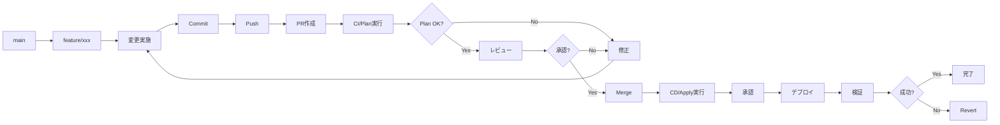

# 04. IaCランディングゾーンの運用管理

!!! info "この章で学ぶこと"
    Landing Zonesの日常運用と管理方法を学びます：

    1. terraformの運用
    2. 変更管理フロー
    3. サブスクリプション払い出しの自動化
    4. ポリシーの更新管理

    この章で、安定した運用ができるようになります。

---

## Part 1: Terraformの運用

### Configuration Driftの検出

Landing Zonesをデプロイした後、誰かがAzure Portalから手動でリソースを変更したり、設定を変えてしまったりすることがあります。

そうなると、Terraformのコードと実際のAzureの状態が違う。これを「Configuration Drift（設定のずれ）」と呼びます。

!!! warning "Driftが起きる典型的なケース"
    - Azure Portalから直接リソースを変更
    - 他のツールでの変更（Azure CLI、PowerShellなど）
    
    こういう変更があると、Terraformのコードと実際の状態がずれてしまいます。

#### Drift検出の仕組み

Terraformには、現在の状態とコードの差分を検出する機能が標準で備わっています。

```bash
# 現在の状態とコードの差分をチェック
terraform plan -detailed-exitcode
```

**Exit Codeの意味**:

- `0`: 変更なし（Driftなし）
- `1`: エラー発生
- `2`: 変更あり（Driftを検出！）

このコマンドを定期的に実行すれば、Driftを早期に発見できるってわけです。

#### GitHub ActionsでDrift検出を自動化

毎回手動でチェックするのは面倒だから、GitHub Actionsで自動化するのがベストプラクティスです。

毎日チェックして、もしDriftが見つかったらIssueを作成してくれるワークフローが以下です。

※IssueとはGitHubの問題チケットみたいなもの

=== "ワークフローの作成"

    `.github/workflows/drift-detection.yml`を作成します：

    ```yaml title=".github/workflows/drift-detection.yml"
    name: Drift Detection
    
    on:
      # 毎日 9:00 JSTに実行
      schedule:
        - cron: '0 0 * * *'
      # 手動実行も可能
      workflow_dispatch:
    
    permissions:
      contents: read
      id-token: write
      issues: write
    
    jobs:
      drift-detection:
        runs-on: ubuntu-latest
        
        steps:
          - name: Checkout
            uses: actions/checkout@v4
          
          - name: Setup Terraform
            uses: hashicorp/setup-terraform@v3
            with:
              terraform_version: "~> 1.10"
          
          - name: Azure Login
            uses: azure/login@v2
            with:
              client-id: ${{ secrets.AZURE_CLIENT_ID }}
              tenant-id: ${{ secrets.AZURE_TENANT_ID }}
              subscription-id: ${{ secrets.AZURE_SUBSCRIPTION_ID }}
          
          - name: Terraform Init
            run: terraform init
          
          - name: Terraform Plan
            id: plan
            run: |
              terraform plan -detailed-exitcode -no-color -out=tfplan 2>&1 | tee plan_output.txt
            continue-on-error: true
          
          - name: Check for Drift
            id: drift
            run: |
              if [ ${{ steps.plan.outcome }} == 'failure' ]; then
                if grep -q "Error" plan_output.txt; then
                  echo "status=error" >> $GITHUB_OUTPUT
                  echo "message=Terraform plan failed with errors" >> $GITHUB_OUTPUT
                else
                  echo "status=drift" >> $GITHUB_OUTPUT
                  echo "message=Configuration drift detected" >> $GITHUB_OUTPUT
                fi
              else
                echo "status=success" >> $GITHUB_OUTPUT
                echo "message=No drift detected" >> $GITHUB_OUTPUT
              fi
          
          - name: Create Issue on Drift
            if: steps.drift.outputs.status == 'drift'
            uses: actions/github-script@v7
            with:
              script: |
                const planOutput = require('fs').readFileSync('plan_output.txt', 'utf8');
                const body = `## ⚠️ Configuration Drift検出
                
                定期チェックで設定のずれ（Drift）を検出しました。
                
                ### 検出日時
                ${new Date().toLocaleString('ja-JP', { timeZone: 'Asia/Tokyo' })}
                
                ### 対応が必要な理由
                TerraformのコードとAzureの実際の状態が一致していません。以下のいずれかの対応が必要です：
                
                1. **手動変更を元に戻す**: Azure Portalでの変更をロールバック
                2. **Terraformコードを更新**: 変更が正しい場合、コードに反映
                3. **Terraformで再適用**: \`terraform apply\`で状態を同期
                
                ### Terraform Plan結果
                
                <details>
                <summary>詳細を見る</summary>
                
                \`\`\`
                ${planOutput.substring(0, 60000)}
                \`\`\`
                
                </details>
                
                ### 次のステップ
                
                - [ ] 変更内容を確認
                - [ ] 変更理由を調査
                - [ ] 対応方法を決定
                - [ ] 対応を実施
                - [ ] このIssueをクローズ
                `;
                
                await github.rest.issues.create({
                  owner: context.repo.owner,
                  repo: context.repo.repo,
                  title: `[Drift Detection] Configuration drift detected - ${new Date().toISOString().split('T')[0]}`,
                  body: body,
                  labels: ['drift-detection', 'operations']
                });
          
          - name: Notify Success
            if: steps.drift.outputs.status == 'success'
            run: |
              echo "✅ No configuration drift detected. System is in sync!"
    ```

=== "ハンズオン: ワークフローの実装"

    **Step 1: ワークフローファイルを作成**

    ```bash
    cd /workspaces/alz-mgmt
    
    # ディレクトリがなければ作成
    mkdir -p .github/workflows
    
    # ワークフローファイルを作成
    cat > .github/workflows/drift-detection.yml << 'EOF'
    # 上記のYAML内容をコピペ
    EOF
    ```

    **Step 2: コミット＆プッシュ**

    ```bash
    git add .github/workflows/drift-detection.yml
    git commit -m "Add drift detection workflow"
    git push origin main
    ```

    **Step 3: 手動でテスト実行**

    1. GitHubリポジトリの**Actions**タブを開く
    2. 左側から**Drift Detection**を選択
    3. **Run workflow**ボタンをクリック
    4. **Run workflow**を確認

    !!! success "初回実行の結果"
        デプロイ直後なので、Driftは検出されないはず。「✅ No configuration drift detected」というメッセージが表示されるよ。

=== "動作確認: わざとDriftを作ってテスト"

    実際にDriftが検出されるかテストしてみよう。

    **Step 1: Azure Portalで手動変更**

    1. Azure Portalにログイン
    2. Management Groupsに移動
    3. Landing Zonesのいずれかの Management Groupを選択
    4. **タグ**を追加（例: `TestTag: ManualChange`）

    **Step 2: ワークフローを再実行**

    1. GitHub Actionsで**Drift Detection**を手動実行
    2. 実行が完了するまで待つ（2-3分程度）

    **Step 3: 結果を確認**

    - ワークフローが「失敗」になる（これは期待される動作）
    - **Issues**タブに新しいIssueが作成される
    - Issueには変更内容の詳細が記載されている

    !!! tip "Driftを解消する"
        テスト後は、以下のいずれかで対応：
        
        ```bash
        # 方法1: Terraformで上書き（推奨）
        terraform apply -auto-approve
        
        # 方法2: Azure Portalで追加したタグを削除
        ```

#### Drift検出のベストプラクティス

=== "運用のポイント"

    **定期実行のタイミング**:
    
    - 毎日実行
    - リリース前後: デプロイ前後での状態確認
    - インシデント後: トラブル対応後の状態確認
    
    **Issueへの対応フロー**:
    
    1. **検出**: GitHub ActionsがIssueを作成
    2. **調査**: 誰が、なぜ変更したかを確認
    3. **判断**: 
        - 変更が正しい → Terraformコードを更新
        - 変更が誤り → Terraformで上書き
    4. **適用**: 決定した対応を実施
    5. **クローズ**: Issueをクローズ
    
    **よくあるDriftのパターン**:
    
    | 変更内容 | 対応方法 |
    |---------|---------|
    | タグの追加・変更 | Terraformコードに反映 |
    | ネットワーク設定変更 | 通常は元に戻す |
    | ポリシーの無効化 | 必ず元に戻す |
    | リソースの削除 | 緊急時以外は元に戻す |

=== "注意点"

    !!! warning "Driftを放置しない"
        Driftを放置すると：
        
        - 次回の`terraform apply`で予期しない変更が発生
        - 本番環境の状態が不明確になる
        - トラブルシューティングが困難になる
        - コードとドキュメントの信頼性が低下
        
        検出したら必ず対応すること！

    !!! info "Stateful Resourcesの扱い"
        一部のリソース（Log Analyticsのデータなど）は、手動で操作しても問題ない場合がある。
        
        そういったリソースは、`lifecycle`ブロックで管理対象外にできる：
        
        ```hcl
        resource "azurerm_log_analytics_workspace" "example" {
          # ... 設定 ...
          
          lifecycle {
            ignore_changes = [
              tags["LastModified"],
              # 特定の属性の変更を無視
            ]
          }
        }
        ```

### Terraform Landing Zonesのバージョン更新

Azure Landing Zonesは定期的にアップデートされるます。

新機能の追加、バグ修正、セキュリティパッチなど、最新の状態に保つことが大事です。IaCのメリットを活かせます。

※IaCの管理でないと、Microsoftのアップデートに手動でついていく必要がある。

!!! info "なぜバージョン更新が必要？"
    - **セキュリティ**: 脆弱性への対応
    - **新機能**: Azureの新サービスへの対応
    - **バグ修正**: 既知の問題の解消
    - **ベストプラクティス**: Microsoftの推奨設定の反映
    
    半年〜1年に一度くらいは確認して、必要に応じて更新するのがおすすめ。

#### バージョン管理の仕組み

Landing Zonesでは、`terraform.tf`でモジュールのバージョンを管理しています。

```hcl title="terraform.tf"
terraform {
  required_version = "~> 1.10"
  
  required_providers {
    azurerm = {
      source  = "hashicorp/azurerm"
      version = "~> 4.0"  # ← Providerのバージョン
    }
  }
}
```

また、使用している`alz`モジュールのバージョンもチェックが必要です。

```hcl title="main.*.tf"
module "alz" {
  source  = "Azure/avm-ptn-alz/azurerm"
  version = "~> 0.11.0"  # ← モジュールのバージョン
  # ...
}
```

#### バージョン更新の手順

=== "Step 1: 現在のバージョン確認"

    まずは現在使っているバージョンを確認しよう。

    ```bash
    cd /workspaces/alz-mgmt
    
    # Terraformのバージョン
    terraform version
    
    # 使用中のProviderバージョン
    terraform providers
    
    # モジュールのバージョンを確認
    grep 'version.*=' terraform.tf
    ```

    **出力例**:
    ```
    Terraform v1.10.3
    └── provider registry.terraform.io/hashicorp/azurerm v4.0.1
    
      required_version = "~> 1.10"
      version = "~> 4.0"
    ```

=== "Step 2: 最新バージョンの確認"

    次に、利用可能な最新バージョンを確認する。

    **Terraform本体**:
    ```bash
    # Terraform本体の最新版を確認
    curl -s https://checkpoint-api.hashicorp.com/v1/check/terraform | jq -r .current_version
    ```

    **AzureRM Provider**:
    - [Terraform Registry](https://registry.terraform.io/providers/hashicorp/azurerm/latest)でチェック
    - または：
    ```bash
    # 最新のProviderバージョンを確認
    terraform init -upgrade 2>&1 | grep azurerm
    ```

    **ALZ Module**:
    - [GitHub Releases](https://github.com/Azure/terraform-azurerm-avm-ptn-alz/releases)でチェック
    - リリースノートを必ず確認！破壊的変更がないかチェック

=== "Step 3: テスト環境で試す"

    いきなり本番を更新するのは危険。まずはブランチを作って試そう。

    ```bash
    # 作業ブランチを作成
    git checkout -b update/terraform-versions
    
    # バージョンを更新（例）
    sed -i 's/version = "~> 0.11.0"/version = "~> 0.12.0"/' main.management.tf
    sed -i 's/version = "~> 4.0"/version = "~> 4.1"/' terraform.tf
    
    # 依存関係を更新
    terraform init -upgrade
    
    # 変更内容を確認
    terraform plan
    ```

    !!! warning "破壊的変更に注意"
        `terraform plan`の結果を**必ず**確認すること：
        
        - `destroy`が含まれていないか
        - 予期しない変更がないか
        - リソースの再作成が発生していないか
        
        特にManagement Groupsやポリシーの再作成は避けたいよね。

=== "Step 4: リリースノートを読む"

    バージョンアップする前に、必ずリリースノートを確認しよう。

    **チェックポイント**:
    
    - **Breaking Changes**: 破壊的変更はあるか？
    - **New Features**: 新機能で使いたいものは？
    - **Bug Fixes**: 影響を受けるバグ修正は？
    - **Migration Guide**: 移行ガイドはあるか？
    
    例えば、ALZ Module v0.12.0のリリースノート：
    ```markdown
    ## v0.12.0
    
    ### ⚠️ Breaking Changes
    - Changed default policy assignment behavior
    - Renamed some variables (see migration guide)
    
    ### ✨ New Features
    - Support for new Azure regions
    - Enhanced logging configuration
    
    ### 🐛 Bug Fixes
    - Fixed issue with tag inheritance
    ```

=== "Step 5: 段階的に適用"

    問題なければ、段階的に適用していく。

    ```bash
    # まずはplanで最終確認
    terraform plan -out=tfplan
    
    # 問題なければapply
    terraform apply tfplan
    
    # 結果を確認
    terraform state list
    ```

    **適用後のチェック**:
    
    - [ ] Management Groupsが正常に見える
    - [ ] ポリシーが適用されている
    - [ ] Log Analyticsにログが流れている
    - [ ] CI/CDワークフローが動作する

=== "Step 6: 本番に反映"

    テストで問題なければ、本番に反映。

    ```bash
    # 変更をコミット
    git add terraform.tf main.*.tf .terraform.lock.hcl
    git commit -m "Update Terraform and provider versions to latest stable"
    
    # プルリクエストを作成
    git push origin update/terraform-versions
    ```

    プルリクエストには以下を記載：
    
    ```markdown
    ## Terraform/Provider バージョン更新
    
    ### 変更内容
    - Terraform: 1.9.x → 1.10.x
    - AzureRM Provider: 4.0.x → 4.1.x
    - ALZ Module: 0.11.x → 0.12.x
    
    ### テスト結果
    - [x] terraform plan: 変更なし
    - [x] terraform apply: 成功
    - [x] 全ワークフロー実行: 成功
    
    ### リリースノート
    - [Terraform v1.10.0](https://github.com/hashicorp/terraform/releases/tag/v1.10.0)
    - [AzureRM v4.1.0](https://github.com/hashicorp/terraform-provider-azurerm/releases/tag/v4.1.0)
    - [ALZ Module v0.12.0](https://github.com/Azure/terraform-azurerm-avm-ptn-alz/releases/tag/v0.12.0)
    ```

#### バージョン更新のベストプラクティス

=== "更新頻度の目安"

    | 更新タイプ | 頻度 | タイミング |
    |----------|-----|----------|
    | **Patch版** (1.10.1 → 1.10.2) | 月次 | バグ修正・セキュリティパッチ |
    | **Minor版** (1.10 → 1.11) | 四半期 | 新機能追加 |
    | **Major版** (1.x → 2.x) | 計画的 | 破壊的変更を含む |
    
    !!! tip "おすすめの戦略"
        - Patch版: すぐに適用（リスク低い）
        - Minor版: リリースノート確認後、1-2週間以内
        - Major版: 十分な検証期間を設けて計画的に

=== "自動化の検討"

    Dependabotを使えば、バージョン更新を自動で提案してくれるよ。

    `.github/dependabot.yml`を作成：

    ```yaml title=".github/dependabot.yml"
    version: 2
    updates:
      # Terraform providersの更新チェック
      - package-ecosystem: "terraform"
        directory: "/"
        schedule:
          interval: "weekly"
          day: "monday"
          time: "09:00"
        open-pull-requests-limit: 5
        labels:
          - "dependencies"
          - "terraform"
        commit-message:
          prefix: "deps"
          include: "scope"
    ```

    これで、毎週月曜日にバージョン更新のPRが自動作成されるようになる！

=== "注意点とトラブルシューティング"

    **よくある問題と対処法**:

    | 問題 | 原因 | 対処法 |
    |-----|------|-------|
    | `Error: Failed to query available provider packages` | ネットワークエラー | `terraform init -upgrade`を再実行 |
    | `Error: Inconsistent dependency lock file` | ロックファイルの不整合 | `.terraform.lock.hcl`を削除して再init |
    | プラン結果に大量の変更 | API仕様変更 | リリースノートで確認、必要に応じてロールバック |

    !!! danger "緊急時のロールバック"
        もしバージョン更新後に問題が発生したら：
        
        ```bash
        # 前のコミットに戻す
        git revert HEAD
        git push origin main
        
        # または、直接編集して元のバージョンに戻す
        terraform init -upgrade
        terraform plan
        terraform apply
        ```

    !!! info "State Lockに注意"
        バージョン更新中は、他の人がTerraformを実行しないように注意！
        
        Slackなどで「現在バージョン更新中です」と周知するのがベター。

#### GitHub ActionsでのCI/CD連携

バージョン更新後は、CI/CDワークフローも正常に動作するか確認しよう。

```bash
# 全てのワークフローをテスト実行
# 1. CI（terraform plan）
git push origin update/terraform-versions

# 2. Drift Detection
# GitHub Actions UIから手動実行

# 3. CD（terraform apply）
# PRマージ後に自動実行される
```

全てのワークフローが成功すれば、バージョン更新完了だ！🎉

---

## Part 2: 変更管理フロー

### 変更リクエストの受付

変更リクエストを受け付ける際のプロセスです。

=== "変更リクエストテンプレート"

    ```markdown title=".github/ISSUE_TEMPLATE/change-request.md"
    ---
    name: 変更リクエスト
    about: Landing Zonesへの変更を申請
    title: '[変更] '
    labels: change-request
    assignees: ''
    ---
    
    ## 変更概要
    
    <!-- 何を変更するか簡潔に記載 -->
    
    ## 変更理由
    
    <!-- なぜこの変更が必要か -->
    
    ## 影響範囲
    
    - [ ] Management Group
    - [ ] Policy
    - [ ] Networking
    - [ ] Management Resources
    - [ ] その他: ___________
    
    ## 変更対象
    
    - Subscription: 
    - Resource Group: 
    - リソース: 
    
    ## 緊急度
    
    - [ ] 緊急（即日対応）
    - [ ] 高（1週間以内）
    - [ ] 中（2週間以内）
    - [ ] 低（1ヶ月以内）
    
    ## 変更予定日時
    
    YYYY-MM-DD HH:MM JST
    
    ## ロールバック計画
    
    <!-- 問題発生時の戻し方 -->
    ```

=== "レビュー基準"

    **承認条件**:
    
    - ✅ 変更理由が明確
    - ✅ 影響範囲が特定されている
    - ✅ ロールバック計画がある
    - ✅ テスト計画がある
    - ✅ セキュリティレビュー完了
    - ✅ 承認者の承認を得ている
    
    **却下理由**:
    
    - ❌ 影響範囲が不明
    - ❌ ロールバック計画なし
    - ❌ セキュリティリスクあり
    - ❌ ポリシー違反

### Branch→PR→Reviewフロー

GitHubでの変更フローです。



=== "Feature Branch作成"

    ```bash title="ブランチ作成"
    git checkout main
    git pull origin main
    git checkout -b feature/add-spoke-vnet
    ```

=== "変更実施"

    ```bash title="変更とコミット"
    # terraform.tfvarsを編集
    vim terraform.tfvars
    
    # 変更を確認
    git diff
    
    # コミット
    git add terraform.tfvars
    git commit -m "feat: App用Spoke VNetを追加"
    
    # Push
    git push origin feature/add-spoke-vnet
    ```

=== "PR作成"

    ```markdown title="PRテンプレート"
    ## 変更内容
    
    App用Spoke VNetを追加
    
    ## 変更理由
    
    新規アプリケーションのデプロイに必要
    
    ## 影響範囲
    
    - Networking: Spoke VNet追加
    - Peering: Hub VNetとのPeering追加
    
    ## テスト計画
    
    - [ ] CI/Planの確認
    - [ ] 疎通テスト
    
    ## チェックリスト
    
    - [x] tfvarsファイルを変更
    - [x] ローカルでPlan実行
    - [x] ドキュメント更新
    - [ ] レビュー完了
    - [ ] 承認完了
    
    ## 関連Issue
    
    Closes #123
    ```

### Terraform Plan確認

PRで実行されるPlanを確認します。

=== "Plan出力の確認"

    GitHub ActionsのCI実行結果を確認：
    
    ```text title="Plan Summary"
    Plan: 5 to add, 0 to change, 0 to destroy.
    
    + azurerm_virtual_network.app_spoke
    + azurerm_subnet.app_subnet
    + azurerm_virtual_network_peering.hub_to_app
    + azurerm_virtual_network_peering.app_to_hub
    + azurerm_route_table.app_routes
    ```

=== "確認ポイント"

    **必ず確認すること**:
    
    - ✅ 意図したリソースが追加されるか
    - ✅ 想定外の変更がないか
    - ✅ 削除されるリソースがないか
    - ✅ 依存関係が正しいか
    - ✅ 名前やタグが正しいか
    
    **警告サイン**:
    
    - ⚠️ `destroy` が含まれている
    - ⚠️ `to change` の数が多い
    - ⚠️ 意図しないリソースが含まれる

=== "コメントでの承認"

    ```markdown title="PR承認コメント"
    ## レビュー結果
    
    ✅ Plan確認完了
    
    ### 確認事項
    - [x] Spoke VNet: 10.1.0.0/16
    - [x] Subnet: app-subnet (10.1.0.0/24)
    - [x] Peering: 双方向
    - [x] Route Table: Hub Firewall経由
    
    ### 懸念事項
    なし
    
    承認します。マージしてください。
    ```

### Approval Process

本番適用の承認プロセスです。

=== "承認フロー"

    ```mermaid
    graph TD
        A[PR Merge] --> B[CD Workflow起動]
        B --> C[Plan実行]
        C --> D[承認待ち]
        D --> E{承認者確認}
        E -->|承認| F[Apply実行]
        E -->|却下| G[中止]
        F --> H[デプロイ完了]
        H --> I[通知]
    ```

=== "承認者の確認事項"

    **承認前チェックリスト**:
    
    - [ ] PRのレビューが完了しているか
    - [ ] Plan出力を確認したか
    - [ ] 影響範囲を理解しているか
    - [ ] ロールバック計画があるか
    - [ ] 変更時間帯は適切か
    - [ ] 関係者に通知済みか
    
    **承認コメント例**:
    
    ```text
    Plan確認しました。
    - 追加: 5リソース
    - 変更: 0リソース
    - 削除: 0リソース
    
    影響範囲: Networkingのみ
    ロールバック: Revert可能
    
    承認します。
    ```

=== "却下理由例"

    ```text
    以下の理由により却下します：
    
    ❌ 想定外のリソース削除が含まれている
    ❌ 変更時間帯が営業時間内（業務影響あり）
    ❌ ロールバック計画が不明瞭
    
    修正後、再度レビュー依頼してください。
    ```

### 変更履歴の管理

変更履歴を記録します。

=== "Gitログ"

    ```bash title="変更履歴確認"
    git log --oneline --graph --decorate --all
    ```
    
    ```text title="出力例"
    * a1b2c3d (HEAD -> main) feat: App用Spoke VNetを追加
    * d4e5f6g feat: SAP用Management Groupを追加
    * g7h8i9j fix: Firewallルールを修正
    * j0k1l2m feat: 環境タグ必須ポリシーを追加
    ```

=== "CHANGELOG.md"

    ```markdown title="CHANGELOG.md"
    # Changelog
    
    ## [1.2.0] - 2026-01-20
    
    ### Added
    - App用Spoke VNetを追加 (#123)
    - SAP用Management Groupを追加 (#120)
    
    ### Fixed
    - Firewallルールの誤設定を修正 (#121)
    
    ### Changed
    - Hub VNetのアドレス空間を拡張 (#122)
    
    ## [1.1.0] - 2026-01-15
    
    ### Added
    - 環境タグ必須ポリシーを追加 (#115)
    ```

=== "Release作成"

    ```bash title="Gitタグ作成"
    git tag -a v1.2.0 -m "Release v1.2.0: Spoke VNet追加"
    git push origin v1.2.0
    ```
    
    GitHubでReleaseを作成します。

!!! tip "変更管理のベストプラクティス"
    - 小さい変更から始める
    - 1つのPRで1つの変更
    - テスト環境で事前検証
    - ピーク時間を避ける
    - ロールバック計画を必ず用意

---

## Part 3: サブスクリプション払い出しの自動化

### 新規Subscriptionの追加


---

## Part 4: ポリシーの更新管理

### ポリシー定義の追加

新しいポリシーを追加します。

=== "ポリシー定義ファイル作成"

    ```json title="lib/policy_definitions/Require-Backup-Tag.json"
    {
      "name": "Require-Backup-Tag",
      "type": "Microsoft.Authorization/policyDefinitions",
      "properties": {
        "displayName": "Require Backup tag on VMs",
        "policyType": "Custom",
        "mode": "Indexed",
        "description": "Requires Backup tag on all Virtual Machines",
        "metadata": {
          "category": "Compute",
          "version": "1.0.0"
        },
        "parameters": {
          "effect": {
            "type": "String",
            "defaultValue": "Audit",
            "allowedValues": [
              "Audit",
              "Deny",
              "Disabled"
            ],
            "metadata": {
              "displayName": "Effect",
              "description": "The effect determines what happens when the policy rule is evaluated to match"
            }
          }
        },
        "policyRule": {
          "if": {
            "allOf": [
              {
                "field": "type",
                "equals": "Microsoft.Compute/virtualMachines"
              },
              {
                "field": "tags['Backup']",
                "exists": "false"
              }
            ]
          },
          "then": {
            "effect": "[parameters('effect')]"
          }
        }
      }
    }
    ```

=== "libフォルダに配置"

    ```bash title="ファイル配置"
    # ポリシー定義を配置
    cp Require-Backup-Tag.json \
      lib/policy_definitions/
    
    # Git管理下に追加
    git add lib/policy_definitions/Require-Backup-Tag.json
    git commit -m "feat: Backupタグ必須ポリシーを追加"
    ```

=== "デプロイ"

    ```bash title="PR作成"
    git push origin feature/add-backup-policy
    
    # PR作成 → レビュー → マージ → デプロイ
    ```

### ポリシー割り当ての変更

ポリシーの割り当てを変更します。

=== "archetype定義に追加"

    ```yaml title="lib/archetype_definitions/landingzones_custom.yaml"
    name: landingzones_custom
    base_archetype: default
    
    policy_assignments_to_add:
      - Require-Backup-Tag  # 新規追加
      - Require-Tag-Environment
    
    policy_assignment_properties:
      Require-Backup-Tag:
        enforcement_mode: DoNotEnforce  # 最初は監視のみ
        parameters:
          effect:
            value: "Audit"
    ```

=== "段階的な適用"

    **フェーズ1: 監視モード（1ヶ月）**:
    
    ```yaml
    enforcement_mode: DoNotEnforce
    parameters:
      effect:
        value: "Audit"
    ```
    
    非準拠リソースを洗い出し。
    
    **フェーズ2: 警告モード（1ヶ月）**:
    
    ```yaml
    enforcement_mode: Default
    parameters:
      effect:
        value: "Audit"
    ```
    
    準拠を促進。
    
    **フェーズ3: 強制モード**:
    
    ```yaml
    enforcement_mode: Default
    parameters:
      effect:
        value: "Deny"
    ```
    
    新規リソースは必須化。

=== "影響確認"

    ```bash title="準拠状況確認"
    az policy state list \
      --policy-assignment "Require-Backup-Tag" \
      --filter "complianceState eq 'NonCompliant'" \
      --output table
    ```

### Exclusion（除外）管理

ポリシーの除外を管理します。

=== "除外設定の追加"

    ```bash title="特定リソースを除外"
    az policy exemption create \
      --name "test-vm-exemption" \
      --policy-assignment "/providers/Microsoft.Management/managementGroups/alz/providers/Microsoft.Authorization/policyAssignments/Require-Backup-Tag" \
      --scope "/subscriptions/<sub-id>/resourceGroups/test-rg/providers/Microsoft.Compute/virtualMachines/test-vm" \
      --exemption-category "Waiver" \
      --description "テスト環境のため除外" \
      --expires-on "2026-12-31T23:59:59Z"
    ```

=== "除外理由のカテゴリ"

    | カテゴリ | 用途 |
    |---------|------|
    | **Waiver** | 正当な理由による除外（ビジネス要件） |
    | **Mitigated** | 別の方法で対応済み |
    
    **Waiver例**:
    - レガシーシステム（移行計画あり）
    - 外部ベンダー管理リソース
    
    **Mitigated例**:
    - オンプレでバックアップ取得済み
    - 別のバックアップソリューション使用

=== "除外の定期レビュー"

    ```bash title="除外一覧確認"
    az policy exemption list \
      --query "[].{Name:name, Expires:expiresOn, Category:exemptionCategory}" \
      --output table
    ```
    
    **レビュー項目**:
    
    - 有効期限切れの除外を削除
    - 理由が依然有効か確認
    - 除外が不要になっていないか確認

### ポリシーの無効化・削除

ポリシーを無効化または削除します。

=== "一時無効化"

    ```yaml title="archetype定義で無効化"
    policy_assignment_properties:
      Require-Backup-Tag:
        enforcement_mode: DoNotEnforce  # 無効化
    ```
    
    または：
    
    ```bash title="Azure CLIで無効化"
    az policy assignment update \
      --name "Require-Backup-Tag" \
      --enforcement-mode DoNotEnforce
    ```

=== "割り当て削除"

    ```yaml title="archetype定義から削除"
    policy_assignments_to_remove:
      - Require-Backup-Tag  # 削除対象に追加
    ```
    
    ```bash
    git add lib/archetype_definitions/
    git commit -m "feat: Backupタグポリシーの割り当てを削除"
    # PR → マージ → デプロイ
    ```

=== "定義自体を削除"

    ```bash title="定義ファイル削除"
    git rm lib/policy_definitions/Require-Backup-Tag.json
    git commit -m "feat: Backupタグポリシー定義を削除"
    # PR → マージ → デプロイ
    ```
    
    !!! warning "注意"
        - 割り当てを先に削除
        - 定義削除は最後

### カスタムポリシーの作成

独自のポリシーを作成します。

=== "要件定義"

    **例: 特定リージョン限定ポリシー**
    
    - 目的: コストとコンプライアンスのため、japaneastとjapanwestのみ許可
    - 対象: すべてのリソース
    - 効果: Deny

=== "ポリシー定義作成"

    ```json title="lib/policy_definitions/Allowed-Locations.json"
    {
      "name": "Allowed-Locations",
      "type": "Microsoft.Authorization/policyDefinitions",
      "properties": {
        "displayName": "Allowed locations for resources",
        "policyType": "Custom",
        "mode": "Indexed",
        "description": "This policy restricts locations where resources can be deployed",
        "metadata": {
          "category": "General"
        },
        "parameters": {
          "listOfAllowedLocations": {
            "type": "Array",
            "metadata": {
              "displayName": "Allowed locations",
              "description": "The list of locations that resources can be deployed to",
              "strongType": "location"
            }
          }
        },
        "policyRule": {
          "if": {
            "not": {
              "field": "location",
              "in": "[parameters('listOfAllowedLocations')]"
            }
          },
          "then": {
            "effect": "deny"
          }
        }
      }
    }
    ```

=== "割り当て設定"

    ```yaml title="lib/archetype_definitions/root_custom.yaml"
    name: root_custom
    base_archetype: root
    
    policy_assignments_to_add:
      - Allowed-Locations
    
    policy_assignment_properties:
      Allowed-Locations:
        enforcement_mode: Default
        parameters:
          listOfAllowedLocations:
            value:
              - "japaneast"
              - "japanwest"
    ```

=== "テストとデプロイ"

    ```bash title="デプロイ"
    git add lib/policy_definitions/Allowed-Locations.json
    git add lib/archetype_definitions/root_custom.yaml
    git commit -m "feat: 許可リージョン制限ポリシーを追加"
    git push origin feature/add-location-policy
    
    # PR → レビュー → マージ → デプロイ
    ```
    
    ```bash title="動作確認"
    # 許可されていないリージョンでリソース作成を試みる
    az vm create \
      --name test-vm \
      --resource-group test-rg \
      --location koreacentral  # 許可されていないリージョン
    # → Error: Policy violation
    ```

---

## まとめ

この章で学んだこと：

### ✅ Part 1: 日常運用タスク

- Policy準拠状況のチェック
- アラート対応
- 定期メンテナンス

### ✅ Part 2: 変更管理フロー

- 変更リクエストの受付
- Branch→PR→Reviewフロー
- Terraform Plan確認
- Approval Process
- 変更履歴の管理

### ✅ Part 3: サブスクリプションの払い出し自動化


### ✅ Part 4: ポリシーの更新管理

- ポリシー定義の追加
- ポリシー割り当ての変更
- Exclusion（除外）管理
- ポリシーの無効化・削除
- カスタムポリシーの作成

次の章では、運用の自動化と効率化について学びます。

## 練習問題

理解度チェックです。休憩中に考えてみましょう。

### 問題1
新しいリソースグループを追加する際の正しい手順は何ですか？

### 問題2
`terraform plan`と`terraform apply`の違いは何ですか？

### 問題3
ポリシー定義を更新する際に注意すべきことは何ですか？

---

## 練習問題の答え

### 答え1
正しい手順:

1. **ブランチ作成**
   ```bash
   git checkout -b feature/add-resource-group
   ```

2. **tfvarsファイル編集**
   ```hcl
   resource_group_config = {
     # 既存のRG
     "rg-management-jp" = { ... }
     
     # 新しいRG
     "rg-app-jp" = {
       location = "japaneast"
       tags = {
         environment = "prod"
         application = "myapp"
       }
     }
   }
   ```

3. **ローカルでplan確認**
   ```bash
   terraform plan
   ```

4. **Pull Request作成**
   ```bash
   git add .
   git commit -m "feat: Add app resource group"
   git push origin feature/add-resource-group
   ```

5. **レビュー承認後、マージ**

6. **GitHub Actionsで自動デプロイ**

### 答え2

| コマンド | 動作 | 実行結果 |
|----------|------|----------|
| `terraform plan` | **変更内容のプレビュー** | リソースは変更されない |
| `terraform apply` | **実際に変更を適用** | リソースが作成・変更・削除される |

**planの出力例:**
```
Terraform will perform the following actions:

  # azurerm_resource_group.app will be created
  + resource "azurerm_resource_group" "app" {
      + name     = "rg-app-jp"
      + location = "japaneast"
    }

Plan: 1 to add, 0 to change, 0 to destroy.
```

**必ずplanで確認してからapply**しましょう。

### 答え3

1. **既存リソースへの影響を確認**
   ```bash
   terraform plan
   ```
   ポリシー更新が既存リソースに影響する場合、Non-compliantになる可能性があります。

2. **段階的なロールアウト**
   ```
   1. まず監査モード（audit）で実施
   2. Non-compliant リソースを確認
   3. 修正後、強制モード（deny）に変更
   ```

3. **除外設定の確認**
   ```hcl
   not_scopes = [
     "/subscriptions/xxx/resourceGroups/rg-exception"
   ]
   ```
   特定のリソースをポリシーから除外できます。

4. **ドキュメント更新**
   - ポリシー変更の理由
   - 影響範囲
   - ロールバック手順

!!! tip "次の章へ"
    [Chapter 17: 運用の自動化と効率化](17_運用の自動化と効率化.md)で、自動化やモニタリングを学びます。
