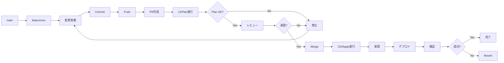

# 04. IaCランディングゾーンの運用管理

!!! info "この章で学ぶこと"
    Landing Zonesの日常運用と管理方法を学びます：

    1. terraformの運用
    2. 変更管理フロー
    3. サブスクリプション払い出しの自動化
    4. ポリシーの更新管理

    この章で、安定した運用ができるようになります。

---

## Part 1: Terraformの運用

### Configuration Driftの検出

Landing Zonesをデプロイした後、誰かがAzure Portalから手動でリソースを変更したり、設定を変えてしまったりすることがあります。

そうなると、Terraformのコードと実際のAzureの状態が違う。これを「Configuration Drift（設定のずれ）」と呼びます。

!!! warning "Driftが起きる典型的なケース"
    - Azure Portalから直接リソースを変更
    - 他のツールでの変更（Azure CLI、PowerShellなど）
    
    こういう変更があると、Terraformのコードと実際の状態がずれてしまいます。

#### Drift検出の仕組み

Terraformには、現在の状態とコードの差分を検出する機能が標準で備わっています。

```bash
# 現在の状態とコードの差分をチェック
terraform plan -detailed-exitcode
```

**Exit Codeの意味**:

- `0`: 変更なし（Driftなし）
- `1`: エラー発生
- `2`: 変更あり（Driftを検出！）

このコマンドを定期的に実行すれば、Driftを早期に発見できるってわけです。

#### GitHub ActionsでDrift検出を自動化

毎回手動でチェックするのは面倒だから、GitHub Actionsで自動化するのがベストプラクティスです。

毎日チェックして、もしDriftをログに出してくれるワークフローが以下です。

※ここからもしDriftがあったらTeamsに通知するなどの仕組みを実装します。

=== "ワークフローの作成"

    `.github/workflows/drift-detection.yml`を作成します：

    ```yaml title=".github/workflows/drift-detection.yml"
    name: Drift Detection

    on:
      schedule:
        - cron: '0 0 * * *'
      workflow_dispatch:

    permissions:
      contents: read
      id-token: write
      issues: write

    jobs:
      drift-check:
        uses: shuheiorg02/alz-mgmt-templates/.github/workflows/ci-template.yaml@main
        permissions:
          id-token: write
          contents: read
          pull-requests: write
        with:
          root_module_folder_relative_path: '.'
          terraform_cli_version: 'latest'

      analyze-drift:
        needs: drift-check
        if: always()
        runs-on: ubuntu-latest
        permissions:
          issues: write
          actions: read
        steps:
          - name: Check for Drift in Logs
            id: check
            uses: actions/github-script@v7
            with:
              script: |
                const jobs = await github.rest.actions.listJobsForWorkflowRun({
                  owner: context.repo.owner,
                  repo: context.repo.repo,
                  run_id: context.runId,
                });
                
                console.log(`Found ${jobs.data.jobs.length} jobs`);
                jobs.data.jobs.forEach(j => console.log(`Job: ${j.name} (${j.conclusion})`));
                
                const planJob = jobs.data.jobs.find(j => j.name.includes('Validate Terraform Plan'));
                if (!planJob) {
                  console.log('❌ Plan job not found');
                  core.setOutput('drift_detected', 'false');
                  return;
                }
                
                console.log(`✅ Found plan job: ${planJob.name} (ID: ${planJob.id})`);
                
                const logs = await github.rest.actions.downloadJobLogsForWorkflowRun({
                  owner: context.repo.owner,
                  repo: context.repo.repo,
                  job_id: planJob.id,
                });
                
                const logText = typeof logs.data === 'string' ? logs.data : String(logs.data);
                console.log(`Log size: ${logText.length} characters`);
                
                // ANSIエスケープシーケンスを除去
                const cleanedLog = logText.replace(/\x1b\[[0-9;]*m/g, '');
                console.log(`Cleaned log size: ${cleanedLog.length} characters`);
                
                // ログサンプルを出力
                const planIndex = cleanedLog.indexOf('Plan:');
                if (planIndex !== -1) {
                  console.log(`Found "Plan:" at position ${planIndex}`);
                  const sample = cleanedLog.substring(planIndex, planIndex + 100);
                  console.log('Sample around Plan:', sample);
                }
                
                // より柔軟な正規表現: 改行やタイムスタンプを含む可能性に対応
                // "Plan: 0 to add,\n 1 to change, 0 to destroy." のような複数行にも対応
                const planMatch = cleanedLog.match(/Plan:\s*(\d+)\s+to\s+add,\s*(\d+)\s+to\s+change,\s*(\d+)\s+to\s+destroy/is);
                
                if (planMatch) {
                  const [, add, change, destroy] = planMatch;
                  console.log(`📊 Plan match: ${add} to add, ${change} to change, ${destroy} to destroy`);
                  const hasChanges = parseInt(add) > 0 || parseInt(change) > 0 || parseInt(destroy) > 0;
                  
                  if (hasChanges) {
                    console.log('✅ Drift detected!');
                    core.setOutput('drift_detected', 'true');
                    core.setOutput('changes', `${add} to add, ${change} to change, ${destroy} to destroy`);
                    return;
                  } else {
                    console.log('✅ No changes detected');
                  }
                } else {
                  console.log('❌ No plan match found in logs');
                }
                
                core.setOutput('drift_detected', 'false');

          - name: Log Drift Detection
            if: steps.check.outputs.drift_detected == 'true'
            run: |
              echo "::warning::🚨 Configuration Drift検出: ${{ steps.check.outputs.changes }}"
              echo "詳細: https://github.com/${{ github.repository }}/actions/runs/${{ github.run_id }}"
    ```

=== "ハンズオン: ワークフローの実装"

    **Step 1: ワークフローファイルを作成**

     実践編と同じようにgithub codespacesを開きます。

    「.github/workflows/」フォルダに「drift-detection.yml」というファイルを作成します。

    「ワークフローの作成」タブのコードをコピーして、作成したファイルに貼り付けます。

    **Step 2: コミット＆プッシュ**

    ```bash
    # feature ブランチ作成
    git checkout -b feature/add-workflow

    # 変更をコミット、プッシュ
    git add .
    git commit -m "ワークフローを追加"
    git push origin feature/add-workflow

    # PR作成
    gh pr create --base main --head feature/add-workflow --title "add-workflow" --body  "add-workflow"

    # PR番号を確認してマージ（squash mergeの例）
    gh pr merge --squash

    # mainブランチに戻る
    git checkout main

    # 最新を取得
    git pull origin main

    # ローカルブランチを強制削除
    git branch -D feature/add-workflow
    ```

    **Step 3: 手動でテスト実行**

    1. GitHubリポジトリの「Actions」タブを開く
    2. 左側から「Drift Detection」を選択
    3. 「Run workflow」ボタンをクリック
    4. 「Run workflow」を確認

    !!! success "初回実行の結果"
        デプロイ直後なので、Driftは検出されないはず。「✅ No configuration drift detected」というメッセージが表示されるよ。

=== "動作確認: わざとDriftを作ってテスト"

    実際にDriftが検出されるかテストしてみよう。

    **Step 1: Azure Portalで手動変更**

    1. Azure Portalにログイン
    2. vnet-hub-japaneastにてきとうに一つタグを追加してみる。

    **Step 2: ワークフローを再実行**

    1. GitHub Actionsで**Drift Detection**を手動実行
    2. 実行が完了するまで待つ（2-3分程度）

    **Step 3: 結果を確認**

    - ワークフローが終わると、先ほど追加したタグが、Driftとしてログに出ていることが確認できる。

    !!! tip "Driftを解消する"
        テスト後は、CDのアプライを実行するとDriftが解消されます


#### Drift検出のベストプラクティス

=== "運用のポイント"

    **定期実行のタイミング**:
    
    - 毎日実行
    - リリース前後: デプロイ前後での状態確認
    - インシデント後: トラブル対応後の状態確認
    
    **Issueへの対応フロー**:
    
    1. **検出**: GitHub Actionsが検出
    2. **調査**: 誰が、なぜ変更したかを確認
    3. **判断**: 
        - 変更が正しい → Terraformコードを更新
        - 変更が誤り → Terraformで上書き
    4. **適用**: 決定した対応を実施
    5. **クローズ**
    
    **よくあるDriftのパターン**:
    
    | 変更内容 | 対応方法 |
    |---------|---------|
    | タグの追加・変更 | Terraformコードに反映 |
    | ネットワーク設定変更 | 通常は元に戻す |
    | ポリシーの無効化 | 必ず元に戻す |
    | リソースの削除 | 緊急時以外は元に戻す |

=== "注意点"

    !!! warning "Driftを放置しない"
        Driftを放置すると：
        
        - 次回の`terraform apply`で予期しない変更が発生
        - 本番環境の状態が不明確になる
        - トラブルシューティングが困難になる
        - コードとドキュメントの信頼性が低下
        
        検出したら必ず対応すること！

    !!! info "Stateful Resourcesの扱い"
        一部のリソース（Log Analyticsのデータなど）は、手動で操作しても問題ない場合がある。
        
        そういったリソースは、`lifecycle`ブロックで管理対象外にできる：
        
        ```hcl
        resource "azurerm_log_analytics_workspace" "example" {
          # ... 設定 ...
          
          lifecycle {
            ignore_changes = [
              tags["LastModified"],
              # 特定の属性の変更を無視
            ]
          }
        }
        ```

### Terraform Landing Zonesのバージョン更新

Azure Landing Zonesは定期的にアップデートされるます。

新機能の追加、バグ修正、セキュリティパッチなど、最新の状態に保つことが大事です。IaCのメリットを活かせます。

※IaCの管理でないと、Microsoftのアップデートに手動でついていく必要がある。直近などNSGフローログの廃止などがありました。今後はVMInsightsの廃止があるとの噂があります。

!!! info "なぜバージョン更新が必要？"
    - **セキュリティ**: 脆弱性への対応
    - **新機能**: Azureの新サービスへの対応
    - **バグ修正**: 既知の問題の解消
    - **ベストプラクティス**: Microsoftの推奨設定の反映
    
    半年〜1年に一度くらいは確認して、必要に応じて更新するのがおすすめ。

#### バージョン管理の仕組み

Landing Zonesでは、主要なバージョン更新箇所は二つあります。

**1. `terraform.tf` - ALZプロバイダーのバージョン**

```hcl title="terraform.tf"
terraform {
  required_version = "~> 1.12"
  
  required_providers {
    # Terraformプロバイダーのバージョン
    alz = {
      source  = "Azure/alz"
      version = "0.20.0"  # ← これ！ALZプロバイダー
    }
    azurerm = {
      source  = "hashicorp/azurerm"
      version = "~> 4.0"
    }
  }
}
```

**2. `modules/management_groups/main.tf` - AVMモジュールのバージョン**

```hcl title="modules/management_groups/main.tf"
module "management_groups" {
  source  = "Azure/avm-ptn-alz/azurerm"
  version = "0.14.1"  # ← これも！AVMパターンモジュール
  
  # ... 設定 ...
}
```

!!! warning "更新時にリリースノートは絶対確認！"

    対応バージョンは以下で確認：

    - [ALZプロバイダー リリースノート](https://github.com/Azure/terraform-provider-alz/releases)
    - [AVMパターンモジュール リリースノート](https://github.com/Azure/terraform-azurerm-avm-ptn-alz/releases)

#### バージョン更新の手順

- "Step 1: リポジトリのファイルで、現在のバージョン確認"

- "Step 2: リリースノートで最新バージョンの確認"
    
- "Step 3: コミットする"

- "Step 4: CIのterraformプランで変更点を確認"

- "Step 5: 変更点が確認できたらCDを起動して変更をデプロイする"


#### やってみよう: バージョンアップデートの実践

実際にバージョン更新を体験してみよう。

※バージョンは筆者がやってる時と違う場合があります。リリースノートを確認して最新のバージョンに更新してみましょう。

実践編と同じようにcodespacesを開いて、以下の2つのファイルを更新します。

!!! tip "更新が必要な2つのファイル"
    1. `terraform.tf` - ALZプロバイダー
    2. `modules/management_groups/main.tf` - AVMモジュール

**Step 1: terraform.tfのバージョンを変更**

「terraform.tf」を開いて、ALZプロバイダーのバージョンを更新：

```hcl title="terraform.tf（変更例）"
alz = {
  source  = "Azure/alz"
  version = "0.20.2"  # 0.20.0 → 0.20.2 に変更
}
```


**Step 2: modules/management_groups/main.tfのバージョンも変更**

`modules/management_groups/main.tf`を開いて、AVMモジュールのバージョンも変更：

```hcl title="modules/management_groups/main.tf（変更例）"
module "management_groups" {
  source  = "Azure/avm-ptn-alz/azurerm"
  version = "0.17.0"  # 0.14.1 → 0.17.0 に変更
  # ...
}
```


**Step 3: コミット&PRを作成**

以下のコマンドをターミナルで実行：

```bash
# feature ブランチ作成
git checkout -b feature/version-change

# 変更をコミット、プッシュ
git add .
git commit -m "バージョンを更新"
git push origin feature/version-change

# PR作成
gh pr create --base main --head feature/version-change --title "version-change" --body "version-change"

# PR番号を確認してマージ（squash mergeの例）
gh pr merge --squash

# mainブランチに戻る
git checkout main

# 最新を取得
git pull origin main

# ローカルブランチを強制削除
git branch -D feature/version-change
```

**Step 4: CIでPlanを確認**

リポジトリに戻るとCIが実行されているので、terraform planの変更点を確認しましょう。

!!! question "確認すること"
    - どんなリソースが変更される？
    - 削除されるリソースはない？
    - 意図しない変更はない？

**Step 5: 適用**

問題なければ、デプロイを承認して適用しましょう！

※バージョンに大きな変更があると、コードを変更する必要も出てくることがあります。できれば筆者と同じバージョンに更新することをお勧めします。


!!! success "完了！"
    これで2つのバージョン管理ポイントを確認できました。
    
    更新したファイル：
    - ✅ `terraform.tf` (ALZプロバイダー)
    - ✅ `modules/management_groups/main.tf` (AVMモジュール)


=== "まとめ"

    !!! success "学んだこと"
        ✅ バージョンファイルの場所と変更方法  
        ✅ terraform init/planでの確認方法  
        ✅ Git/GitHubでの変更フロー  
        ✅ CI/CDパイプラインの動作  
        ✅ バージョン更新の影響範囲の確認方法

    !!! tip "本番での運用ポイント"
        - **必ずリリースノートを読む**: 破壊的変更がないか確認
        - **テスト環境で先に試す**: 可能なら別のランディングゾーンで
        - **バックアップ**: 重要なリソースは事前にバックアップ
        - **メンテナンスウィンドウ**: 影響が少ない時間帯に実施
        - **ロールバック計画**: 問題が起きたときの戻し方を事前に決めておく

---

## Part 2: 変更管理フロー

### 変更リクエストの受付

変更リクエストを受け付ける際のプロセスです。

=== "変更リクエストテンプレート"

    ```markdown title=".github/ISSUE_TEMPLATE/change-request.md"
    ---
    name: 変更リクエスト
    about: Landing Zonesへの変更を申請
    title: '[変更] '
    labels: change-request
    assignees: ''
    ---
    
    ## 変更概要
    
    <!-- 何を変更するか簡潔に記載 -->
    
    ## 変更理由
    
    <!-- なぜこの変更が必要か -->
    
    ## 影響範囲
    
    - [ ] Management Group
    - [ ] Policy
    - [ ] Networking
    - [ ] Management Resources
    - [ ] その他: ___________
    
    ## 変更対象
    
    - Subscription: 
    - Resource Group: 
    - リソース: 
    
    ## 緊急度
    
    - [ ] 緊急（即日対応）
    - [ ] 高（1週間以内）
    - [ ] 中（2週間以内）
    - [ ] 低（1ヶ月以内）
    
    ## 変更予定日時
    
    YYYY-MM-DD HH:MM JST
    
    ## ロールバック計画
    
    <!-- 問題発生時の戻し方 -->
    ```

=== "レビュー基準"

    **承認条件**:
    
    - ✅ 変更理由が明確
    - ✅ 影響範囲が特定されている
    - ✅ ロールバック計画がある
    - ✅ テスト計画がある
    - ✅ セキュリティレビュー完了
    - ✅ 承認者の承認を得ている
    
    **却下理由**:
    
    - ❌ 影響範囲が不明
    - ❌ ロールバック計画なし
    - ❌ セキュリティリスクあり
    - ❌ ポリシー違反

### Branch→PR→Reviewフロー

GitHubでの変更フローです。



=== "Feature Branch作成"

    ```bash title="ブランチ作成"
    git checkout main
    git pull origin main
    git checkout -b feature/add-spoke-vnet
    ```

=== "変更実施"

    ```bash title="変更とコミット"
    # terraform.tfvarsを編集
    vim terraform.tfvars
    
    # 変更を確認
    git diff
    
    # コミット
    git add terraform.tfvars
    git commit -m "feat: App用Spoke VNetを追加"
    
    # Push
    git push origin feature/add-spoke-vnet
    ```

=== "PR作成"

    ```markdown title="PRテンプレート"
    ## 変更内容
    
    App用Spoke VNetを追加
    
    ## 変更理由
    
    新規アプリケーションのデプロイに必要
    
    ## 影響範囲
    
    - Networking: Spoke VNet追加
    - Peering: Hub VNetとのPeering追加
    
    ## テスト計画
    
    - [ ] CI/Planの確認
    - [ ] 疎通テスト
    
    ## チェックリスト
    
    - [x] tfvarsファイルを変更
    - [x] ローカルでPlan実行
    - [x] ドキュメント更新
    - [ ] レビュー完了
    - [ ] 承認完了
    
    ## 関連Issue
    
    Closes #123
    ```

### Terraform Plan確認

PRで実行されるPlanを確認します。

=== "Plan出力の確認"

    GitHub ActionsのCI実行結果を確認：
    
    ```text title="Plan Summary"
    Plan: 5 to add, 0 to change, 0 to destroy.
    
    + azurerm_virtual_network.app_spoke
    + azurerm_subnet.app_subnet
    + azurerm_virtual_network_peering.hub_to_app
    + azurerm_virtual_network_peering.app_to_hub
    + azurerm_route_table.app_routes
    ```

=== "確認ポイント"

    **必ず確認すること**:
    
    - ✅ 意図したリソースが追加されるか
    - ✅ 想定外の変更がないか
    - ✅ 削除されるリソースがないか
    - ✅ 依存関係が正しいか
    - ✅ 名前やタグが正しいか
    
    **警告サイン**:
    
    - ⚠️ `destroy` が含まれている
    - ⚠️ `to change` の数が多い
    - ⚠️ 意図しないリソースが含まれる

=== "コメントでの承認"

    ```markdown title="PR承認コメント"
    ## レビュー結果
    
    ✅ Plan確認完了
    
    ### 確認事項
    - [x] Spoke VNet: 10.1.0.0/16
    - [x] Subnet: app-subnet (10.1.0.0/24)
    - [x] Peering: 双方向
    - [x] Route Table: Hub Firewall経由
    
    ### 懸念事項
    なし
    
    承認します。マージしてください。
    ```

### Approval Process

本番適用の承認プロセスです。

=== "承認フロー"

    ```mermaid
    graph TD
        A[PR Merge] --> B[CD Workflow起動]
        B --> C[Plan実行]
        C --> D[承認待ち]
        D --> E{承認者確認}
        E -->|承認| F[Apply実行]
        E -->|却下| G[中止]
        F --> H[デプロイ完了]
        H --> I[通知]
    ```

=== "承認者の確認事項"

    **承認前チェックリスト**:
    
    - [ ] PRのレビューが完了しているか
    - [ ] Plan出力を確認したか
    - [ ] 影響範囲を理解しているか
    - [ ] ロールバック計画があるか
    - [ ] 変更時間帯は適切か
    - [ ] 関係者に通知済みか
    
    **承認コメント例**:
    
    ```text
    Plan確認しました。
    - 追加: 5リソース
    - 変更: 0リソース
    - 削除: 0リソース
    
    影響範囲: Networkingのみ
    ロールバック: Revert可能
    
    承認します。
    ```

=== "却下理由例"

    ```text
    以下の理由により却下します：
    
    ❌ 想定外のリソース削除が含まれている
    ❌ 変更時間帯が営業時間内（業務影響あり）
    ❌ ロールバック計画が不明瞭
    
    修正後、再度レビュー依頼してください。
    ```

### 変更履歴の管理

変更履歴を記録します。

=== "Gitログ"

    ```bash title="変更履歴確認"
    git log --oneline --graph --decorate --all
    ```
    
    ```text title="出力例"
    * a1b2c3d (HEAD -> main) feat: App用Spoke VNetを追加
    * d4e5f6g feat: SAP用Management Groupを追加
    * g7h8i9j fix: Firewallルールを修正
    * j0k1l2m feat: 環境タグ必須ポリシーを追加
    ```

=== "CHANGELOG.md"

    ```markdown title="CHANGELOG.md"
    # Changelog
    
    ## [1.2.0] - 2026-01-20
    
    ### Added
    - App用Spoke VNetを追加 (#123)
    - SAP用Management Groupを追加 (#120)
    
    ### Fixed
    - Firewallルールの誤設定を修正 (#121)
    
    ### Changed
    - Hub VNetのアドレス空間を拡張 (#122)
    
    ## [1.1.0] - 2026-01-15
    
    ### Added
    - 環境タグ必須ポリシーを追加 (#115)
    ```

=== "Release作成"

    ```bash title="Gitタグ作成"
    git tag -a v1.2.0 -m "Release v1.2.0: Spoke VNet追加"
    git push origin v1.2.0
    ```
    
    GitHubでReleaseを作成します。

!!! tip "変更管理のベストプラクティス"
    - 小さい変更から始める
    - 1つのPRで1つの変更
    - テスト環境で事前検証
    - ピーク時間を避ける
    - ロールバック計画を必ず用意

---

## Part 3: サブスクリプション払い出しの自動化

### Subscription Vendingとは？

新しいプロジェクトが始まるたび、「Azureサブスクリプションが欲しい！」って要望が来る。毎回手作業で対応するのは大変だし、設定漏れも起きやすい。

そこで、**`subscriptions/`ディレクトリにYAMLファイルを1つ追加するだけで、サブスクリプションが自動的に払い出される仕組み**を作ろう。

!!! info "Subscription Vendingの仕組み"
    ```mermaid
    graph LR
        A[開発者] -->|YAMLファイル作成| B[subscriptions/myapp.yaml]
        B -->|PR作成| C[GitHub]
        C -->|CI/CD実行| D[Terraform]
        D -->|自動作成| E[サブスクリプション]
        D -->|自動配置| F[Management Group]
        D -->|自動設定| G[VNet/RG/タグ]
    ```
    
    **開発者がやること:**
    
    1. `subscriptions/myapp-prod.yaml`を作成
    2. PRを作成
    3. レビュー待ち
    
    **自動で実行されること:**
    
    - サブスクリプション作成
    - 管理グループへの配置
    - リソースグループ作成
    - VNet作成（オプション）
    - タグ設定

---

### 🎯 やってみよう: サブスクリプション自動払い出し

**YAMLファイルを追加するだけで、サブスクリプションが自動作成される仕組み**を作ります。

!!! warning "前提条件"
    - Enterprise Agreement (EA) または Microsoft Customer Agreement (MCA) が必要
    - Billing Account への権限（Enrollment Account Owner など）
    
    **権限がない場合は、コードの確認だけでもOK！**

#### Step 1: ブランチ作成とディレクトリ準備

```bash
git checkout main
git pull origin main
git checkout -b feature/setup-subscription-vending

# サブスクリプション定義用のディレクトリ作成
mkdir -p subscriptions
```

#### Step 2: Terraformファイルを作成

既存の`main.*.tf`形式に合わせて、新しいファイルを作成：

**`main.subscription.vending.tf`を作成：**

```hcl title="main.subscription.vending.tf（新規作成）"
# ========================================
# Subscription Vending
# ========================================

locals {
  # subscriptions/ディレクトリからYAMLファイルを読み込む
  subscription_files = fileset("${path.module}/subscriptions", "*.yaml")
  
  # YAMLをパースして設定を作成
  subscriptions = {
    for file in local.subscription_files :
    trimsuffix(file, ".yaml") => yamldecode(file("${path.module}/subscriptions/${file}"))
  }
}

# 各サブスクリプションをループで作成
module "subscription_vending" {
  source  = "Azure/avm-ptn-alz-sub-vending/azurerm"
  version = "~> 0.1.0"
  
  for_each = local.subscriptions
  
  # サブスクリプション設定
  subscription_alias_enabled = true
  subscription_alias_name    = each.key
  subscription_display_name  = each.value.display_name
  subscription_billing_scope = var.billing_scope
  subscription_workload      = each.value.workload_type
  
  # 管理グループへの配置
  subscription_management_group_association_enabled = true
  subscription_management_group_id                  = each.value.management_group_id
  
  # 基本設定
  location          = lookup(each.value, "location", "japaneast")
  disable_telemetry = false
  
  # リソースグループ作成
  resource_group_creation_enabled = lookup(each.value, "resource_groups", null) != null
  resource_groups = lookup(each.value, "resource_groups", null) != null ? {
    for rg_key, rg in each.value.resource_groups :
    rg_key => {
      name     = rg.name
      location = lookup(rg, "location", "japaneast")
    }
  } : {}
  
  # VNet作成とHub接続
  virtual_network_enabled = lookup(each.value, "virtual_network", null) != null
  virtual_networks = lookup(each.value, "virtual_network", null) != null ? {
    primary = {
      name                    = each.value.virtual_network.name
      resource_group_key      = each.value.virtual_network.resource_group_key
      address_space           = [each.value.virtual_network.address_space]
      hub_network_resource_id = lookup(each.value.virtual_network, "hub_vnet_id", "")
      hub_peering_enabled     = lookup(each.value.virtual_network, "hub_peering_enabled", false)
      mesh_peering_enabled    = false
    }
  } : {}
  
  # タグ
  subscription_tags = merge(
    lookup(each.value, "tags", {}),
    {
      ManagedBy = "Terraform"
    }
  )
  
  depends_on = [
    module.management_groups
  ]
}
```

#### Step 3: 変数を追加

`variables.tf`に以下を追加：

```hcl title="variables.tf（末尾に追加）"
# ========================================
# Subscription Vending Variables
# ========================================

variable "billing_scope" {
  description = "Billing scope for subscription creation (EA or MCA)"
  type        = string
  sensitive   = true
  default     = ""
}
```

#### Step 4: tfvarsファイルを更新

`terraform.tfvars.json`に追加：

```json title="terraform.tfvars.json（追加）"
{
  // ... 既存の設定 ...
  
  // Subscription Vending
  "billing_scope": ""
}
```

!!! tip "billing_scopeの取得方法"
    ```bash
    # EA契約の場合
    az billing enrollment-account list --query "[].id" -o tsv
    
    # MCA契約の場合
    az billing account list
    ```

#### Step 5: outputs定義を追加

`outputs.tf`に追加：

```hcl title="outputs.tf（末尾に追加）"
# ========================================
# Subscription Vending Outputs
# ========================================

output "vended_subscriptions" {
  description = "All vended subscriptions"
  value = {
    for k, v in module.subscription_vending :
    k => {
      subscription_id = v.subscription_id
      display_name    = v.subscription_resource_id
    }
  }
}
```

#### Step 6: .gitignoreを更新

`subscriptions/`ディレクトリは追跡するが、中身は追跡する：

```bash title=".gitignore（確認）"
# subscriptions/ディレクトリは追跡する
# （特に除外設定は不要）
```

#### Step 7: READMEを作成

`subscriptions/README.md`を作成：

```markdown title="subscriptions/README.md（新規作成）"
# Subscription Definitions

このディレクトリにYAMLファイルを追加すると、サブスクリプションが自動作成されます。

## ファイル名のルール

ファイル名がサブスクリプションのエイリアス名になります。

例: `demo-app-dev.yaml` → サブスクリプションエイリアス: `demo-app-dev`

## YAMLファイルの書き方

### 最小構成

\`\`\`yaml
display_name: "Demo App - Development"
workload_type: "DevTest"
management_group_id: "landing-zones"

tags:
  Environment: "Development"
  Project: "Demo-App"
  CostCenter: "Engineering"
\`\`\`

### リソースグループ付き

\`\`\`yaml
display_name: "Demo App - Development"
workload_type: "DevTest"
management_group_id: "landing-zones"

resource_groups:
  network:
    name: "rg-demo-network"
    location: "japaneast"
  app:
    name: "rg-demo-app"
    location: "japaneast"

tags:
  Environment: "Development"
  Project: "Demo-App"
  CostCenter: "Engineering"
\`\`\`

### VNet付き（Hub-and-Spoke）

\`\`\`yaml
display_name: "Demo App - Development"
workload_type: "DevTest"
management_group_id: "landing-zones"

resource_groups:
  network:
    name: "rg-demo-network"
    location: "japaneast"

virtual_network:
  name: "vnet-demo-dev"
  resource_group_key: "network"
  address_space: "10.100.0.0/16"
  hub_vnet_id: "/subscriptions/xxxxx/resourceGroups/rg-connectivity-hub/providers/Microsoft.Network/virtualNetworks/vnet-hub-japaneast"
  hub_peering_enabled: true

tags:
  Environment: "Development"
  Project: "Demo-App"
  CostCenter: "Engineering"
\`\`\`

## 運用フロー

1. このディレクトリに新しいYAMLファイルを追加
2. PRを作成
3. CI/CDでPlan確認
4. PRをマージ
5. サブスクリプション自動作成
```

#### Step 8: コミット&PR作成

```bash
git add main.subscription.vending.tf variables.tf terraform.tfvars.json outputs.tf subscriptions/README.md
git commit -m "feat: Setup subscription vending with YAML-based configuration"
git push origin feature/setup-subscription-vending

# PR作成
gh pr create --base main --head feature/setup-subscription-vending \
  --title "feat: Setup subscription vending" \
  --body "YAMLファイルベースのサブスクリプション払い出し機能を追加

## 追加内容
- \`main.subscription.vending.tf\`（新規作成）
- \`subscriptions/\`ディレクトリとREADME
- YAMLファイルを追加するだけでサブスクリプション作成

## 動作確認
- [ ] CI/CDでPlan確認
- [ ] subscriptions/ディレクトリが空なので変更なし"
```

#### Step 9: CI/CDでPlan確認

PRを作成すると、GitHub Actionsが自動実行されます。

**Plan結果:**
```
No changes. Your infrastructure matches the configuration.

# ↑ subscriptions/ディレクトリにYAMLがないので、変更なし = 正常
```

#### Step 10: マージ

```bash
gh pr merge --squash

git checkout main
git pull origin main
git branch -D feature/setup-subscription-vending
```

!!! success "基盤完成！"
    サブスクリプション払い出しの仕組みが完成しました。
    
    次のステップで、実際にYAMLファイルを追加してサブスクリプションを作成します。

---

### 🚀 サブスクリプションを作成してみよう

YAMLファイルを追加するだけで、サブスクリプションが作成されます。

#### Step 1: billing_scopeを設定

まず、billing_scopeを設定しないとサブスクリプション作成できないので設定します。

```bash
git checkout -b feature/set-billing-scope
```

`terraform.tfvars.json`を編集：

```json title="terraform.tfvars.json"
{
  // ... 既存の設定 ...
  
  // Subscription Vending
  "billing_scope": "/providers/Microsoft.Billing/billingAccounts/1234567/enrollmentAccounts/123456"
}
```

```bash
git add terraform.tfvars.json
git commit -m "feat: Set billing scope for subscription vending"
git push origin feature/set-billing-scope

gh pr create --base main --head feature/set-billing-scope \
  --title "feat: Set billing scope" \
  --body "Billing scopeを設定"

# Plan確認後、マージ
gh pr merge --squash
```

#### Step 2: 最初のサブスクリプションを追加

```bash
git checkout main
git pull origin main
git checkout -b feature/add-demo-subscription
```

`subscriptions/demo-app-dev.yaml`を作成：

```yaml title="subscriptions/demo-app-dev.yaml（新規作成）"
display_name: "Demo App - Development"
workload_type: "DevTest"
management_group_id: "landing-zones"
location: "japaneast"

resource_groups:
  network:
    name: "rg-demo-network"
    location: "japaneast"
  app:
    name: "rg-demo-app"
    location: "japaneast"

tags:
  Environment: "Development"
  Project: "Demo-App"
  CostCenter: "Engineering"
  Owner: "demo-team"
```

#### Step 3: PR作成&Plan確認

```bash
git add subscriptions/demo-app-dev.yaml
git commit -m "feat: Add demo-app-dev subscription"
git push origin feature/add-demo-subscription

gh pr create --base main --head feature/add-demo-subscription \
  --title "feat: Add Demo App Development subscription" \
  --body "Demo App開発環境用のサブスクリプションを追加

## サブスクリプション情報
- 名前: Demo App - Development
- ワークロード: DevTest
- 管理グループ: landing-zones

## Plan確認事項
- [ ] サブスクリプション作成
- [ ] 管理グループ配置
- [ ] リソースグループ2つ作成"
```

**CI/CDのPlan結果を確認：**

```hcl
Terraform will perform the following actions:

  # module.subscription_vending["demo-app-dev"].azurerm_subscription.this will be created
  + resource "azurerm_subscription" "this" {
      + subscription_name = "demo-app-dev"
      + display_name      = "Demo App - Development"
      + workload          = "DevTest"
    }

  # module.subscription_vending["demo-app-dev"].azurerm_management_group_subscription_association.this will be created
  + resource "azurerm_management_group_subscription_association" "this" {
      + management_group_id = "landing-zones"
    }

  # module.subscription_vending["demo-app-dev"]...azurerm_resource_group.network will be created
  + resource "azurerm_resource_group" "network" {
      + name     = "rg-demo-network"
      + location = "japaneast"
    }

  # module.subscription_vending["demo-app-dev"]...azurerm_resource_group.app will be created
  + resource "azurerm_resource_group" "app" {
      + name     = "rg-demo-app"
      + location = "japaneast"
    }

Plan: 4 to add, 0 to change, 0 to destroy.
```

#### Step 4: マージして適用

```bash
gh pr merge --squash

git checkout main
git pull origin main
git branch -D feature/add-demo-subscription
```

#### Step 5: 作成確認

```bash
# サブスクリプション確認
az account list --query "[?name=='Demo App - Development']" -o table

# リソースグループ確認
az group list --subscription "Demo App - Development" -o table
```

!!! success "サブスクリプション作成完了！"
    YAMLファイルを1つ追加するだけで、以下が自動作成されました：
    - ✅ サブスクリプション `Demo App - Development`
    - ✅ 管理グループ `landing-zones` に配置
    - ✅ リソースグループ `rg-demo-network`
    - ✅ リソースグループ `rg-demo-app`

---

### 応用: VNet付きサブスクリプション

Hub-and-Spoke構成で、VNetも一緒に作成してみよう。

#### Step 1: Hub VNet IDを取得

```bash
# Connectivity HubのVNet IDを取得
az network vnet show \
  --resource-group rg-connectivity-hub \
  --name vnet-hub-japaneast \
  --query id -o tsv
```

#### Step 2: VNet付きYAMLファイルを作成

```bash
git checkout -b feature/add-webapp-subscription
```

`subscriptions/webapp-prod.yaml`を作成：

```yaml title="subscriptions/webapp-prod.yaml（新規作成）"
display_name: "WebApp - Production"
workload_type: "Production"
management_group_id: "corp"
location: "japaneast"

resource_groups:
  network:
    name: "rg-webapp-network"
    location: "japaneast"
  app:
    name: "rg-webapp-app"
    location: "japaneast"

virtual_network:
  name: "vnet-webapp-prod"
  resource_group_key: "network"
  address_space: "10.101.0.0/16"
  hub_vnet_id: "/subscriptions/xxxxx-xxxxx/resourceGroups/rg-connectivity-hub/providers/Microsoft.Network/virtualNetworks/vnet-hub-japaneast"
  hub_peering_enabled: true

tags:
  Environment: "Production"
  Project: "WebApp"
  CostCenter: "Product"
  Owner: "webapp-team"
```

#### Step 3: PR作成&確認

```bash
git add subscriptions/webapp-prod.yaml
git commit -m "feat: Add webapp-prod subscription with VNet"
git push origin feature/add-webapp-subscription

gh pr create --base main --head feature/add-webapp-subscription \
  --title "feat: Add WebApp Production subscription" \
  --body "WebApp本番環境用のサブスクリプションを追加

## サブスクリプション情報
- 名前: WebApp - Production
- ワークロード: Production
- 管理グループ: corp
- VNet: 10.101.0.0/16（Hub接続あり）

## Plan確認事項
- [ ] サブスクリプション作成
- [ ] VNet作成
- [ ] Hub Peering作成"
```

**Plan結果に追加される内容:**
```hcl
  # VNet作成
  + resource "azurerm_virtual_network" "primary" {
      + name                = "vnet-webapp-prod"
      + address_space       = ["10.101.0.0/16"]
      + resource_group_name = "rg-webapp-network"
    }

  # Hub Peering
  + resource "azurerm_virtual_network_peering" "hub" {
      + name                = "peer-webapp-to-hub"
      + remote_virtual_network_id = "/subscriptions/.../vnet-hub-japaneast"
    }
```

#### Step 4: マージ

```bash
gh pr merge --squash
```

!!! success "完了！"
    - ✅ サブスクリプション
    - ✅ VNet（10.101.0.0/16）
    - ✅ Hub VNetとのピアリング

---

### 複数サブスクリプションの一括管理

YAMLファイルをどんどん追加していけば、複数のサブスクリプションを管理できます。

**プロジェクト構造:**
```
alz-mgmt/
├── subscriptions/
│   ├── README.md
│   ├── demo-app-dev.yaml       # 開発環境
│   ├── webapp-prod.yaml        # WebApp本番
│   ├── dataapp-dev.yaml        # DataApp開発
│   └── dataapp-prod.yaml       # DataApp本番
├── main.subscription.vending.tf
├── variables.tf
└── terraform.tfvars.json
```

**YAMLファイルのテンプレート集:**

=== "最小構成"
    ```yaml
    display_name: "My Project - Development"
    workload_type: "DevTest"
    management_group_id: "landing-zones"
    
    tags:
      Environment: "Development"
      Project: "MyProject"
    ```

=== "リソースグループ付き"
    ```yaml
    display_name: "My Project - Production"
    workload_type: "Production"
    management_group_id: "corp"
    
    resource_groups:
      network:
        name: "rg-myproject-network"
      app:
        name: "rg-myproject-app"
      data:
        name: "rg-myproject-data"
    
    tags:
      Environment: "Production"
      Project: "MyProject"
    ```

=== "VNet付き（完全版）"
    ```yaml
    display_name: "My Project - Production"
    workload_type: "Production"
    management_group_id: "corp"
    location: "japaneast"
    
    resource_groups:
      network:
        name: "rg-myproject-network"
        location: "japaneast"
      app:
        name: "rg-myproject-app"
        location: "japaneast"
    
    virtual_network:
      name: "vnet-myproject-prod"
      resource_group_key: "network"
      address_space: "10.102.0.0/16"
      hub_vnet_id: "/subscriptions/xxxxx/resourceGroups/rg-connectivity-hub/providers/Microsoft.Network/virtualNetworks/vnet-hub-japaneast"
      hub_peering_enabled: true
    
    tags:
      Environment: "Production"
      Project: "MyProject"
      CostCenter: "Engineering"
      Owner: "myproject-team"
    ```

!!! tip "運用のベストプラクティス"
    - **ファイル名のルール**: `{project}-{environment}.yaml`（例: `webapp-prod.yaml`）
    - **アドレス空間の管理**: 10.100.0.0/16, 10.101.0.0/16, ... と順番に割り当て
    - **管理グループの使い分け**: 開発は`landing-zones`、本番は`corp`
    - **必須タグ**: Environment, Project, CostCenter, Owner
    - **PR単位**: 1つのPRで1つのサブスクリプション追加（レビューしやすい）
    - **Plan確認**: 必ずCI/CDのPlan結果をレビューしてからマージ

---

## Part 4: ポリシーの更新管理

### ポリシー定義の追加


---

## まとめ

この章で学んだこと：

### ✅ Part 1: 日常運用タスク

- Policy準拠状況のチェック
- アラート対応
- 定期メンテナンス

### ✅ Part 2: 変更管理フロー

- 変更リクエストの受付
- Branch→PR→Reviewフロー
- Terraform Plan確認
- Approval Process
- 変更履歴の管理

### ✅ Part 3: サブスクリプションの払い出し自動化


### ✅ Part 4: ポリシーの更新管理

- ポリシー定義の追加
- ポリシー割り当ての変更
- Exclusion（除外）管理
- ポリシーの無効化・削除
- カスタムポリシーの作成

次の章では、運用の自動化と効率化について学びます。

## 練習問題

理解度チェックです。休憩中に考えてみましょう。

### 問題1
新しいリソースグループを追加する際の正しい手順は何ですか？

### 問題2
`terraform plan`と`terraform apply`の違いは何ですか？

### 問題3
ポリシー定義を更新する際に注意すべきことは何ですか？

---

## 練習問題の答え

### 答え1
正しい手順:

1. **ブランチ作成**
   ```bash
   git checkout -b feature/add-resource-group
   ```

2. **tfvarsファイル編集**
   ```hcl
   resource_group_config = {
     # 既存のRG
     "rg-management-jp" = { ... }
     
     # 新しいRG
     "rg-app-jp" = {
       location = "japaneast"
       tags = {
         environment = "prod"
         application = "myapp"
       }
     }
   }
   ```

3. **ローカルでplan確認**
   ```bash
   terraform plan
   ```

4. **Pull Request作成**
   ```bash
   git add .
   git commit -m "feat: Add app resource group"
   git push origin feature/add-resource-group
   ```

5. **レビュー承認後、マージ**

6. **GitHub Actionsで自動デプロイ**

### 答え2

| コマンド | 動作 | 実行結果 |
|----------|------|----------|
| `terraform plan` | **変更内容のプレビュー** | リソースは変更されない |
| `terraform apply` | **実際に変更を適用** | リソースが作成・変更・削除される |

**planの出力例:**
```
Terraform will perform the following actions:

  # azurerm_resource_group.app will be created
  + resource "azurerm_resource_group" "app" {
      + name     = "rg-app-jp"
      + location = "japaneast"
    }

Plan: 1 to add, 0 to change, 0 to destroy.
```

**必ずplanで確認してからapply**しましょう。

### 答え3

1. **既存リソースへの影響を確認**
   ```bash
   terraform plan
   ```
   ポリシー更新が既存リソースに影響する場合、Non-compliantになる可能性があります。

2. **段階的なロールアウト**
   ```
   1. まず監査モード（audit）で実施
   2. Non-compliant リソースを確認
   3. 修正後、強制モード（deny）に変更
   ```

3. **除外設定の確認**
   ```hcl
   not_scopes = [
     "/subscriptions/xxx/resourceGroups/rg-exception"
   ]
   ```
   特定のリソースをポリシーから除外できます。

4. **ドキュメント更新**
   - ポリシー変更の理由
   - 影響範囲
   - ロールバック手順

!!! tip "次の章へ"
    [05_プロジェクト構造.md](05_プロジェクト構造.md)で、実践編で作成したプロジェクトの構造を理解しましょう！
