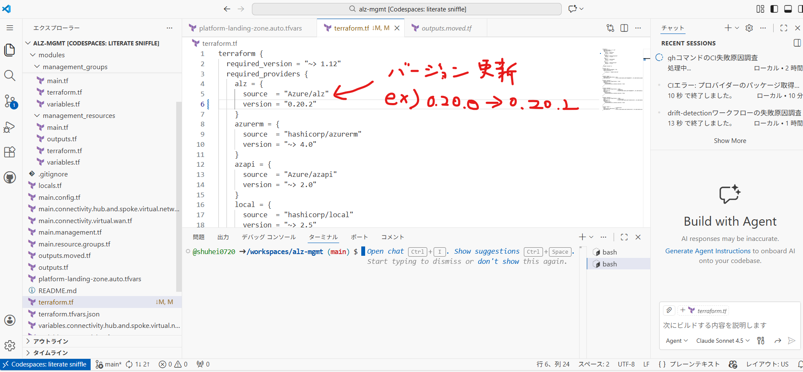
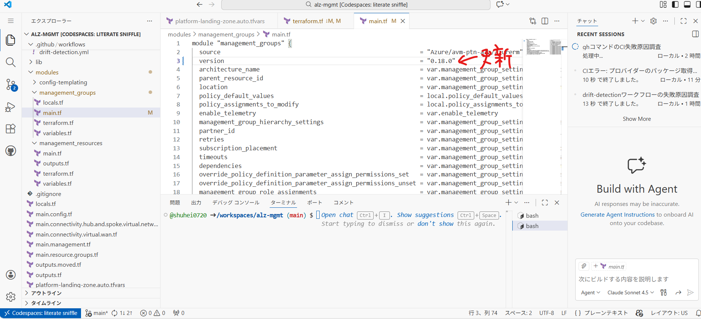
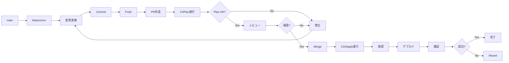
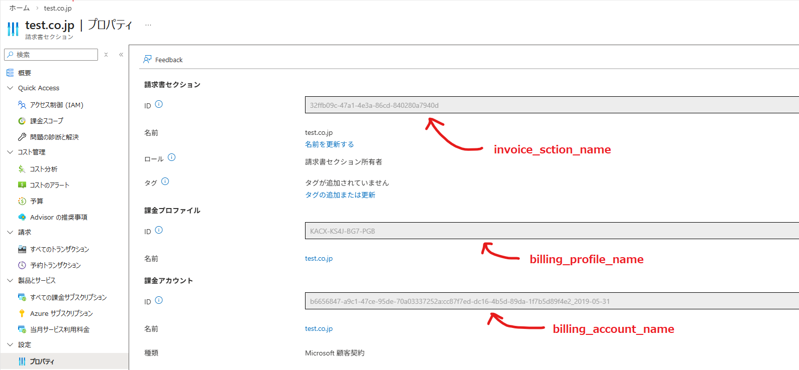

# 04. IaCランディングゾーンの運用管理

!!! info "この章で学ぶこと"
    Landing Zonesの日常運用と管理方法を学びます：

    1. terraformの運用
    2. 変更管理フロー
    3. サブスクリプション払い出しの自動化
    4. ポリシーの更新管理

    この章で、安定した運用ができるようになります。

---

## Part 1: Terraformの運用

### Configuration Driftの検出

Landing Zonesをデプロイした後、誰かがAzure Portalから手動でリソースを変更したり、設定を変えてしまったりすることがあります。

そうなると、Terraformのコードと実際のAzureの状態が違う。これを「Configuration Drift（設定のずれ）」と呼びます。

!!! warning "Driftが起きる典型的なケース"
    - Azure Portalから直接リソースを変更
    - 他のツールでの変更（Azure CLI、PowerShellなど）
    
    こういう変更があると、Terraformのコードと実際の状態がずれてしまいます。

#### Drift検出の仕組み

Terraformには、現在の状態とコードの差分を検出する機能が標準で備わっています。

```bash
# 現在の状態とコードの差分をチェック
terraform plan -detailed-exitcode
```

**Exit Codeの意味**:

- `0`: 変更なし（Driftなし）
- `1`: エラー発生
- `2`: 変更あり（Driftを検出！）

このコマンドを定期的に実行すれば、Driftを早期に発見できるってわけです。

#### GitHub ActionsでDrift検出を自動化

毎回手動でチェックするのは面倒だから、GitHub Actionsで自動化するのがベストプラクティスです。

毎日チェックして、もしDriftをログに出してくれるワークフローが以下です。

※ここからもしDriftがあったらTeamsに通知するなどの仕組みを実装します。

=== "ワークフローの作成"

    `.github/workflows/drift-detection.yml`を作成します：

    ```yaml title=".github/workflows/drift-detection.yml"
    name: Drift Detection

    on:
      schedule:
        - cron: '0 0 * * *'
      workflow_dispatch:

    permissions:
      contents: read
      id-token: write
      issues: write

    jobs:
      drift-check:
        uses: shuheiorg02/alz-mgmt-templates/.github/workflows/ci-template.yaml@main
        permissions:
          id-token: write
          contents: read
          pull-requests: write
        with:
          root_module_folder_relative_path: '.'
          terraform_cli_version: 'latest'

      analyze-drift:
        needs: drift-check
        if: always()
        runs-on: ubuntu-latest
        permissions:
          issues: write
          actions: read
        steps:
          - name: Check for Drift in Logs
            id: check
            uses: actions/github-script@v7
            with:
              script: |
                const jobs = await github.rest.actions.listJobsForWorkflowRun({
                  owner: context.repo.owner,
                  repo: context.repo.repo,
                  run_id: context.runId,
                });
                
                console.log(`Found ${jobs.data.jobs.length} jobs`);
                jobs.data.jobs.forEach(j => console.log(`Job: ${j.name} (${j.conclusion})`));
                
                const planJob = jobs.data.jobs.find(j => j.name.includes('Validate Terraform Plan'));
                if (!planJob) {
                  console.log('❌ Plan job not found');
                  core.setOutput('drift_detected', 'false');
                  return;
                }
                
                console.log(`✅ Found plan job: ${planJob.name} (ID: ${planJob.id})`);
                
                const logs = await github.rest.actions.downloadJobLogsForWorkflowRun({
                  owner: context.repo.owner,
                  repo: context.repo.repo,
                  job_id: planJob.id,
                });
                
                const logText = typeof logs.data === 'string' ? logs.data : String(logs.data);
                console.log(`Log size: ${logText.length} characters`);
                
                // ANSIエスケープシーケンスを除去
                const cleanedLog = logText.replace(/\x1b\[[0-9;]*m/g, '');
                console.log(`Cleaned log size: ${cleanedLog.length} characters`);
                
                // ログサンプルを出力
                const planIndex = cleanedLog.indexOf('Plan:');
                if (planIndex !== -1) {
                  console.log(`Found "Plan:" at position ${planIndex}`);
                  const sample = cleanedLog.substring(planIndex, planIndex + 100);
                  console.log('Sample around Plan:', sample);
                }
                
                // より柔軟な正規表現: 改行やタイムスタンプを含む可能性に対応
                // "Plan: 0 to add,\n 1 to change, 0 to destroy." のような複数行にも対応
                const planMatch = cleanedLog.match(/Plan:\s*(\d+)\s+to\s+add,\s*(\d+)\s+to\s+change,\s*(\d+)\s+to\s+destroy/is);
                
                if (planMatch) {
                  const [, add, change, destroy] = planMatch;
                  console.log(`📊 Plan match: ${add} to add, ${change} to change, ${destroy} to destroy`);
                  const hasChanges = parseInt(add) > 0 || parseInt(change) > 0 || parseInt(destroy) > 0;
                  
                  if (hasChanges) {
                    console.log('✅ Drift detected!');
                    core.setOutput('drift_detected', 'true');
                    core.setOutput('changes', `${add} to add, ${change} to change, ${destroy} to destroy`);
                    return;
                  } else {
                    console.log('✅ No changes detected');
                  }
                } else {
                  console.log('❌ No plan match found in logs');
                }
                
                core.setOutput('drift_detected', 'false');

          - name: Log Drift Detection
            if: steps.check.outputs.drift_detected == 'true'
            run: |
              echo "::warning::🚨 Configuration Drift検出: ${{ steps.check.outputs.changes }}"
              echo "詳細: https://github.com/${{ github.repository }}/actions/runs/${{ github.run_id }}"
    ```

=== "ハンズオン: ワークフローの実装"

    **Step 1: ワークフローファイルを作成**

     実践編と同じようにgithub codespacesを開きます。

    「.github/workflows/」フォルダに「drift-detection.yml」というファイルを作成します。

    「ワークフローの作成」タブのコードをコピーして、作成したファイルに貼り付けます。

    **Step 2: コミット＆プッシュ**

    ```bash
    # feature ブランチ作成
    git checkout -b feature/add-workflow

    # 変更をコミット、プッシュ
    git add .
    git commit -m "ワークフローを追加"
    git push origin feature/add-workflow

    # PR作成
    gh pr create --base main --head feature/add-workflow --title "add-workflow" --body  "add-workflow"

    # PR番号を確認してマージ（squash mergeの例）
    gh pr merge --squash

    # mainブランチに戻る
    git checkout main

    # 最新を取得
    git pull origin main

    # ローカルブランチを強制削除
    git branch -D feature/add-workflow
    ```

    **Step 3: 手動でテスト実行**

    1. GitHubリポジトリの「Actions」タブを開く
    2. 左側から「Drift Detection」を選択
    3. 「Run workflow」ボタンをクリック
    4. 「Run workflow」を確認

    !!! success "初回実行の結果"
        デプロイ直後なので、Driftは検出されないはず。「✅ No configuration drift detected」というメッセージが表示されるよ。

=== "動作確認: わざとDriftを作ってテスト"

    実際にDriftが検出されるかテストしてみよう。

    **Step 1: Azure Portalで手動変更**

    1. Azure Portalにログイン
    2. vnet-hub-japaneastにてきとうに一つタグを追加してみる。

    **Step 2: ワークフローを再実行**

    1. GitHub Actionsで**Drift Detection**を手動実行
    2. 実行が完了するまで待つ（2-3分程度）

    **Step 3: 結果を確認**

    - ワークフローが終わると、先ほど追加したタグが、Driftとしてログに出ていることが確認できる。

    !!! tip "Driftを解消する"
        テスト後は、CDのアプライを実行するとDriftが解消されます


#### Drift検出のベストプラクティス

=== "運用のポイント"

    **定期実行のタイミング**:
    
    - 毎日実行
    - リリース前後: デプロイ前後での状態確認
    - インシデント後: トラブル対応後の状態確認
    
    **Issueへの対応フロー**:
    
    1. **検出**: GitHub Actionsが検出
    2. **調査**: 誰が、なぜ変更したかを確認
    3. **判断**: 
        - 変更が正しい → Terraformコードを更新
        - 変更が誤り → Terraformで上書き
    4. **適用**: 決定した対応を実施
    5. **クローズ**
    
    **よくあるDriftのパターン**:
    
    | 変更内容 | 対応方法 |
    |---------|---------|
    | タグの追加・変更 | Terraformコードに反映 |
    | ネットワーク設定変更 | 通常は元に戻す |
    | ポリシーの無効化 | 必ず元に戻す |
    | リソースの削除 | 緊急時以外は元に戻す |

=== "注意点"

    !!! warning "Driftを放置しない"
        Driftを放置すると：
        
        - 次回の`terraform apply`で予期しない変更が発生
        - 本番環境の状態が不明確になる
        - トラブルシューティングが困難になる
        - コードとドキュメントの信頼性が低下
        
        検出したら必ず対応すること！

    !!! info "Stateful Resourcesの扱い"
        一部のリソース（Log Analyticsのデータなど）は、手動で操作しても問題ない場合がある。
        
        そういったリソースは、`lifecycle`ブロックで管理対象外にできる：
        
        ```hcl
        resource "azurerm_log_analytics_workspace" "example" {
          # ... 設定 ...
          
          lifecycle {
            ignore_changes = [
              tags["LastModified"],
              # 特定の属性の変更を無視
            ]
          }
        }
        ```

### Terraform Landing Zonesのバージョン更新

Azure Landing Zonesは定期的にアップデートされるます。

新機能の追加、バグ修正、セキュリティパッチなど、最新の状態に保つことが大事です。IaCのメリットを活かせます。

※IaCの管理でないと、Microsoftのアップデートに手動でついていく必要がある。直近などNSGフローログの廃止などがありました。今後はVMInsightsの廃止があるとの噂があります。

!!! info "なぜバージョン更新が必要？"
    - **セキュリティ**: 脆弱性への対応
    - **新機能**: Azureの新サービスへの対応
    - **バグ修正**: 既知の問題の解消
    - **ベストプラクティス**: Microsoftの推奨設定の反映
    
    半年〜1年に一度くらいは確認して、必要に応じて更新するのがおすすめ。

#### バージョン管理の仕組み

Landing Zonesでは、主要なバージョン更新箇所は3つあります。

**1. `terraform.tf` - ALZプロバイダーのバージョン**

```hcl title="terraform.tf"
terraform {
  required_version = "~> 1.12"
  
  required_providers {
    # Terraformプロバイダーのバージョン
    alz = {
      source  = "Azure/alz"
      version = "0.20.0"  # ← これ！ALZプロバイダー
    }
    azurerm = {
      source  = "hashicorp/azurerm"
      version = "~> 4.0"
    }
  }
}
```

**2. `modules/management_groups/main.tf` - AVMモジュールのバージョン**

```hcl title="modules/management_groups/main.tf"
module "management_groups" {
  source  = "Azure/avm-ptn-alz/azurerm"
  version = "0.14.1"  # ← これ！AVMパターンモジュール
  
  # ... 設定 ...
}
```

**3. `lib/alz_library_metadata.json` - Azureポリシーライブラリのバージョン**

```hcl title="lib/alz_library_metadata.json"
{
  "$schema": "https://raw.githubusercontent.com/Azure/Azure-Landing-Zones-Library/main/schemas/library_metadata.json",
  "name": "local",
  "display_name": "ALZ Accelerator - Azure Verified Modules for ALZ Platform Landing Zone",
  "description": "This library allows overriding policies, archetypes, and management group architecture in the ALZ Accelerator.",
  "dependencies": [
    {
      "path": "platform/alz",
      "ref": "2025.09.3"　# ← これ！Azureポリシーライブラリのバージョン
    }
  ]
}

```

!!! warning "更新時にリリースノートは絶対確認！"

    対応バージョンは以下で確認：

    - [ALZプロバイダー リリースノート](https://github.com/Azure/terraform-provider-alz/releases)
    - [AVMパターンモジュール リリースノート](https://github.com/Azure/terraform-azurerm-avm-ptn-alz/releases)
    - [Azureポリシーライブラリ リリースノート](https://github.com/Azure/Azure-Landing-Zones-Library/releases)

#### バージョン更新の手順

- "Step 1: リポジトリのファイルで、現在のバージョン確認"

- "Step 2: リリースノートで最新バージョンの確認"
    
- "Step 3: コミットする"

- "Step 4: CIのterraformプランで変更点を確認"

- "Step 5: 変更点が確認できたらCDを起動して変更をデプロイする"


#### やってみよう: バージョンアップデートの実践

実際にバージョン更新を体験してみよう。

本書作成時は、Azureポリシーライブラリの更新がなかったので、今回はALZプロバイダーとAVMモジュールを更新します。

※バージョンは筆者がやってる時と違う場合があります。リリースノートを確認して最新のバージョンに更新してみましょう。

実践編と同じようにcodespacesを開いて、以下の2つのファイルを更新します。

!!! tip "更新が必要な2つのファイル"
    1. `terraform.tf` - ALZプロバイダー
    2. `modules/management_groups/main.tf` - AVMモジュール

**Step 1: terraform.tfのバージョンを変更**

「terraform.tf」を開いて、ALZプロバイダーのバージョンを更新：

```hcl title="terraform.tf（変更例）"
alz = {
  source  = "Azure/alz"
  version = "0.20.2"  # 0.20.0 → 0.20.2 に変更
}
```



**Step 2: modules/management_groups/main.tfのバージョンも変更**

`modules/management_groups/main.tf`を開いて、AVMモジュールのバージョンも変更：

```hcl title="modules/management_groups/main.tf（変更例）"
module "management_groups" {
  source  = "Azure/avm-ptn-alz/azurerm"
  version = "0.17.0"  # 0.14.1 → 0.17.0 に変更
  # ...
}
```



**Step 3: コミット&PRを作成**

以下のコマンドをターミナルで実行：

```bash
# feature ブランチ作成
git checkout -b feature/version-change

# 変更をコミット、プッシュ
git add .
git commit -m "バージョンを更新"
git push origin feature/version-change

# PR作成
gh pr create --base main --head feature/version-change --title "version-change" --body "version-change"

# PR番号を確認してマージ（squash mergeの例）
gh pr merge --squash

# mainブランチに戻る
git checkout main

# 最新を取得
git pull origin main

# ローカルブランチを強制削除
git branch -D feature/version-change
```

**Step 4: CIでPlanを確認**

リポジトリに戻るとCIが実行されているので、terraform planの変更点を確認しましょう。

!!! question "確認すること"
    - どんなリソースが変更される？
    - 削除されるリソースはない？
    - 意図しない変更はない？

**Step 5: 適用**

問題なければ、デプロイを承認して適用しましょう！

※バージョンに大きな変更があると、コードを変更する必要も出てくることがあります。できれば筆者と同じバージョンに更新することをお勧めします。


!!! success "完了！"
    これで2つのバージョン管理ポイントを確認できました。
    
    更新したファイル：
    - ✅ `terraform.tf` (ALZプロバイダー)
    - ✅ `modules/management_groups/main.tf` (AVMモジュール)


=== "まとめ"

    !!! success "学んだこと"
        ✅ バージョンファイルの場所と変更方法  
        ✅ terraform init/planでの確認方法  
        ✅ Git/GitHubでの変更フロー  
        ✅ CI/CDパイプラインの動作  
        ✅ バージョン更新の影響範囲の確認方法

    !!! tip "本番での運用ポイント"
        - **必ずリリースノートを読む**: 破壊的変更がないか確認
        - **テスト環境で先に試す**: 可能なら別のランディングゾーンで
        - **バックアップ**: 重要なリソースは事前にバックアップ
        - **メンテナンスウィンドウ**: 影響が少ない時間帯に実施
        - **ロールバック計画**: 問題が起きたときの戻し方を事前に決めておく

---

## Part 2: 変更管理フロー

### 変更リクエストの受付

変更リクエストを受け付ける際のプロセスです。

=== "変更リクエストテンプレート"

    ```markdown title=".github/ISSUE_TEMPLATE/change-request.md"
    ---
    name: 変更リクエスト
    about: Landing Zonesへの変更を申請
    title: '[変更] '
    labels: change-request
    assignees: ''
    ---
    
    ## 変更概要
    
    <!-- 何を変更するか簡潔に記載 -->
    
    ## 変更理由
    
    <!-- なぜこの変更が必要か -->
    
    ## 影響範囲
    
    - [ ] Management Group
    - [ ] Policy
    - [ ] Networking
    - [ ] Management Resources
    - [ ] その他: ___________
    
    ## 変更対象
    
    - Subscription: 
    - Resource Group: 
    - リソース: 
    
    ## 緊急度
    
    - [ ] 緊急（即日対応）
    - [ ] 高（1週間以内）
    - [ ] 中（2週間以内）
    - [ ] 低（1ヶ月以内）
    
    ## 変更予定日時
    
    YYYY-MM-DD HH:MM JST
    
    ## ロールバック計画
    
    <!-- 問題発生時の戻し方 -->
    ```

=== "レビュー基準"

    **承認条件**:
    
    - ✅ 変更理由が明確
    - ✅ 影響範囲が特定されている
    - ✅ ロールバック計画がある
    - ✅ テスト計画がある
    - ✅ セキュリティレビュー完了
    - ✅ 承認者の承認を得ている
    
    **却下理由**:
    
    - ❌ 影響範囲が不明
    - ❌ ロールバック計画なし
    - ❌ セキュリティリスクあり
    - ❌ ポリシー違反

### Branch→PR→Reviewフロー

GitHubでの変更フローです。



=== "Feature Branch作成"

    ```bash title="ブランチ作成"
    git checkout main
    git pull origin main
    git checkout -b feature/add-spoke-vnet
    ```

=== "変更実施"

    ```bash title="変更とコミット"
    # terraform.tfvarsを編集
    vim terraform.tfvars
    
    # 変更を確認
    git diff
    
    # コミット
    git add terraform.tfvars
    git commit -m "feat: App用Spoke VNetを追加"
    
    # Push
    git push origin feature/add-spoke-vnet
    ```

=== "PR作成"

    ```markdown title="PRテンプレート"
    ## 変更内容
    
    App用Spoke VNetを追加
    
    ## 変更理由
    
    新規アプリケーションのデプロイに必要
    
    ## 影響範囲
    
    - Networking: Spoke VNet追加
    - Peering: Hub VNetとのPeering追加
    
    ## テスト計画
    
    - [ ] CI/Planの確認
    - [ ] 疎通テスト
    
    ## チェックリスト
    
    - [x] tfvarsファイルを変更
    - [x] ローカルでPlan実行
    - [x] ドキュメント更新
    - [ ] レビュー完了
    - [ ] 承認完了
    
    ## 関連Issue
    
    Closes #123
    ```

### Terraform Plan確認

PRで実行されるPlanを確認します。

=== "Plan出力の確認"

    GitHub ActionsのCI実行結果を確認：
    
    ```text title="Plan Summary"
    Plan: 5 to add, 0 to change, 0 to destroy.
    
    + azurerm_virtual_network.app_spoke
    + azurerm_subnet.app_subnet
    + azurerm_virtual_network_peering.hub_to_app
    + azurerm_virtual_network_peering.app_to_hub
    + azurerm_route_table.app_routes
    ```

=== "確認ポイント"

    **必ず確認すること**:
    
    - ✅ 意図したリソースが追加されるか
    - ✅ 想定外の変更がないか
    - ✅ 削除されるリソースがないか
    - ✅ 依存関係が正しいか
    - ✅ 名前やタグが正しいか
    
    **警告サイン**:
    
    - ⚠️ `destroy` が含まれている
    - ⚠️ `to change` の数が多い
    - ⚠️ 意図しないリソースが含まれる

=== "コメントでの承認"

    ```markdown title="PR承認コメント"
    ## レビュー結果
    
    ✅ Plan確認完了
    
    ### 確認事項
    - [x] Spoke VNet: 10.1.0.0/16
    - [x] Subnet: app-subnet (10.1.0.0/24)
    - [x] Peering: 双方向
    - [x] Route Table: Hub Firewall経由
    
    ### 懸念事項
    なし
    
    承認します。マージしてください。
    ```

### Approval Process

本番適用の承認プロセスです。

=== "承認フロー"

    ```mermaid
    graph TD
        A[PR Merge] --> B[CD Workflow起動]
        B --> C[Plan実行]
        C --> D[承認待ち]
        D --> E{承認者確認}
        E -->|承認| F[Apply実行]
        E -->|却下| G[中止]
        F --> H[デプロイ完了]
        H --> I[通知]
    ```

=== "承認者の確認事項"

    **承認前チェックリスト**:
    
    - [ ] PRのレビューが完了しているか
    - [ ] Plan出力を確認したか
    - [ ] 影響範囲を理解しているか
    - [ ] ロールバック計画があるか
    - [ ] 変更時間帯は適切か
    - [ ] 関係者に通知済みか
    
    **承認コメント例**:
    
    ```text
    Plan確認しました。
    - 追加: 5リソース
    - 変更: 0リソース
    - 削除: 0リソース
    
    影響範囲: Networkingのみ
    ロールバック: Revert可能
    
    承認します。
    ```

=== "却下理由例"

    ```text
    以下の理由により却下します：
    
    ❌ 想定外のリソース削除が含まれている
    ❌ 変更時間帯が営業時間内（業務影響あり）
    ❌ ロールバック計画が不明瞭
    
    修正後、再度レビュー依頼してください。
    ```

### 変更履歴の管理

変更履歴を記録します。

=== "Gitログ"

    ```bash title="変更履歴確認"
    git log --oneline --graph --decorate --all
    ```
    
    ```text title="出力例"
    * a1b2c3d (HEAD -> main) feat: App用Spoke VNetを追加
    * d4e5f6g feat: SAP用Management Groupを追加
    * g7h8i9j fix: Firewallルールを修正
    * j0k1l2m feat: 環境タグ必須ポリシーを追加
    ```

=== "CHANGELOG.md"

    ```markdown title="CHANGELOG.md"
    # Changelog
    
    ## [1.2.0] - 2026-01-20
    
    ### Added
    - App用Spoke VNetを追加 (#123)
    - SAP用Management Groupを追加 (#120)
    
    ### Fixed
    - Firewallルールの誤設定を修正 (#121)
    
    ### Changed
    - Hub VNetのアドレス空間を拡張 (#122)
    
    ## [1.1.0] - 2026-01-15
    
    ### Added
    - 環境タグ必須ポリシーを追加 (#115)
    ```

=== "Release作成"

    ```bash title="Gitタグ作成"
    git tag -a v1.2.0 -m "Release v1.2.0: Spoke VNet追加"
    git push origin v1.2.0
    ```
    
    GitHubでReleaseを作成します。

!!! tip "変更管理のベストプラクティス"
    - 小さい変更から始める
    - 1つのPRで1つの変更
    - テスト環境で事前検証
    - ピーク時間を避ける
    - ロールバック計画を必ず用意

---

## Part 3: サブスクリプション払い出しの自動化

### Subscription Vendingとは？

新しいプロジェクトが始まるたび、「Azureサブスクリプションが欲しい！」って要望が来る。毎回手作業で対応するのは大変だし、設定漏れも起きやすい。

そこで、**`subscriptions/`ディレクトリにYAMLファイルを1つ追加するだけで、サブスクリプションが自動的に払い出される仕組み**を作ろう。

!!! info "Subscription Vendingの仕組み"
    ```mermaid
    graph LR
        A[開発者] -->|YAMLファイル作成| B[subscriptions/myapp.yaml]
        B -->|PR作成| C[GitHub]
        C -->|CI/CD実行| D[Terraform]
        D -->|自動作成| E[サブスクリプション]
        D -->|自動配置| F[Management Group]
        D -->|自動設定| G[VNet/RG/タグ]
    ```
    
    **開発者がやること:**
    
    1. `subscriptions/myapp-prod.yaml`を作成
    2. PRを作成
    3. レビュー待ち
    
    **自動で実行されること:**
    
    - サブスクリプション作成
    - 管理グループへの配置
    - リソースグループ作成
    - VNet作成（オプション）
    - タグ設定

---

### 🎯 やってみよう: サブスクリプション自動払い出し

YAMLファイルを追加するだけで、サブスクリプションが自動作成される仕組みを作ります。


#### Step 1: ディレクトリ準備

実践編と同じようにcodespacesを開いていきましょう。

ターミナルで以下のコマンドを実行します。

```bash
# サブスクリプション定義用のディレクトリ作成
mkdir -p subscriptions
```

「subscriptions」フォルダが作成されます。

#### Step 2: Terraformファイルを作成

以下の名称で新しいファイルを作成します。

**`main.subscription.vending.tf`を作成：**

```hcl title="main.subscription.vending.tf（新規作成）"
# ========================================
# Terraformのサブスクリプションリソースの実装
# モジュールを使わず、azurerm_subscriptionリソースを使用
# ALZモジュールとの互換性維持のため
# ========================================

locals {
  # subscriptions/ディレクトリからYAMLファイルを読み込む
  subscription_files = fileset("${path.module}/subscriptions", "*.yaml")

  # YAMLをパースして設定を作成（README.mdは説明用のファイルとして除外）
  subscriptions = {
    for file in local.subscription_files :
    trimsuffix(file, ".yaml") => yamldecode(file("${path.module}/subscriptions/${file}"))
    if file != "README.md"
  }
}

# 手順3: 管理グループIDの取得
data "azurerm_management_group" "subscription_target" {
  for_each = local.subscriptions

  name = each.value.management_group_id
}

# データソースでBilling Scopeを取得
data "azurerm_billing_mca_account_scope" "this" {
  count = var.billing_account_name != null && var.billing_profile_name != null && var.invoice_section_name != null ? 1 : 0

  billing_account_name = var.billing_account_name
  billing_profile_name = var.billing_profile_name
  invoice_section_name = var.invoice_section_name
}

# 手順4: サブスクリプションの作成
resource "azurerm_subscription" "this" {
  for_each = local.subscriptions

  subscription_name = each.value.display_name
  alias             = each.key
  billing_scope_id  = data.azurerm_billing_mca_account_scope.this[0].id
  workload          = lookup(each.value, "workload_type", "Production")

  tags = lookup(each.value, "tags", {})

  # ライフサイクル: サブスクリプションは削除せず、管理グループのみ変更可能
  lifecycle {
    prevent_destroy = true
  }
}

# 手順5: 管理グループへの関連付け
resource "azurerm_management_group_subscription_association" "this" {
  for_each = local.subscriptions

  management_group_id = data.azurerm_management_group.subscription_target[each.key].id
  subscription_id     = "/subscriptions/${azurerm_subscription.this[each.key].subscription_id}"

  depends_on = [azurerm_subscription.this]
}

# 手順6: リソースグループの作成
locals {
  # 全サブスクリプションのリソースグループをフラット化
  subscription_resource_groups = merge([
    for sub_key, sub in local.subscriptions : {
      for rg_key, rg in lookup(sub, "resource_groups", {}) :
      "${sub_key}-${rg_key}" => merge(rg, {
        subscription_id = azurerm_subscription.this[sub_key].subscription_id
        location        = lookup(rg, "location", lookup(sub, "location", "japaneast"))
        tags            = lookup(sub, "tags", {})
      })
    }
  ]...)
}

resource "azurerm_resource_group" "this" {
  for_each = local.subscription_resource_groups

  name     = each.value.name
  location = each.value.location
  tags     = each.value.tags

  # プロバイダーエイリアスは使用せず、subscription_idで制御
  lifecycle {
    ignore_changes = [tags]
  }

  depends_on = [azurerm_subscription.this]
}

# 手順7: VNetの作成
locals {
  # VNetが定義されているサブスクリプションを抽出
  vnets = {
    for sub_key, sub in local.subscriptions :
    sub_key => merge(sub.virtual_network, {
      subscription_id = azurerm_subscription.this[sub_key].subscription_id
      location        = lookup(sub.virtual_network, "location", lookup(sub, "location", "japaneast"))
      tags            = lookup(sub, "tags", {})
    })
    if lookup(sub, "virtual_network", null) != null
  }
}

resource "azurerm_virtual_network" "this" {
  for_each = local.vnets

  name                = each.value.name
  location            = each.value.location
  resource_group_name = each.value.resource_group_name
  address_space       = each.value.address_space
  tags                = each.value.tags

  depends_on = [
    azurerm_resource_group.this,
    azurerm_subscription.this
  ]
}

# 手順8: サブネットの作成
locals {
  # 全VNetのサブネットをフラット化
  subnets = merge([
    for sub_key, vnet in local.vnets : {
      for subnet in lookup(vnet, "subnets", []) :
      "${sub_key}-${subnet.name}" => {
        name                = subnet.name
        vnet_name           = vnet.name
        resource_group_name = vnet.resource_group_name
        address_prefix      = subnet.address_prefix
        subscription_id     = vnet.subscription_id
      }
    }
  ]...)
}

resource "azurerm_subnet" "this" {
  for_each = local.subnets

  name                 = each.value.name
  resource_group_name  = each.value.resource_group_name
  virtual_network_name = each.value.vnet_name
  address_prefixes     = [each.value.address_prefix]

  depends_on = [azurerm_virtual_network.this]
}

# 手順9: Hub VNetへのピアリング
locals {
  # Hub接続が必要なVNetを抽出
  # Hub VNet情報は既存のhub_and_spoke_vnetモジュールから自動取得
  hub_vnet_id = try(
    values(module.hub_and_spoke_vnet[0].virtual_network_resource_ids)[0],
    var.hub_virtual_network_id
  )
  hub_vnet_name = try(
    values(module.hub_and_spoke_vnet[0].virtual_network_resource_names)[0],
    var.hub_virtual_network_name
  )
  hub_vnet_resource_group = try(
    split("/", local.hub_vnet_id)[4],
    var.hub_virtual_network_resource_group_name
  )

  vnet_peerings = {
    for sub_key, vnet in local.vnets :
    sub_key => vnet
    if lookup(vnet, "hub_peering_enabled", false) && local.hub_vnet_id != null
  }
}

# Spoke → Hub のピアリング
resource "azurerm_virtual_network_peering" "spoke_to_hub" {
  for_each = local.vnet_peerings

  name                      = "${each.value.name}-to-hub"
  resource_group_name       = each.value.resource_group_name
  virtual_network_name      = each.value.name
  remote_virtual_network_id = local.hub_vnet_id

  allow_virtual_network_access = true
  allow_forwarded_traffic      = true
  allow_gateway_transit        = false
  use_remote_gateways          = lookup(each.value, "use_hub_gateway", false)

  depends_on = [azurerm_virtual_network.this]
}

# Hub → Spoke のピアリング
resource "azurerm_virtual_network_peering" "hub_to_spoke" {
  for_each = local.vnet_peerings

  name                      = "hub-to-${each.value.name}"
  resource_group_name       = local.hub_vnet_resource_group
  virtual_network_name      = local.hub_vnet_name
  remote_virtual_network_id = azurerm_virtual_network.this[each.key].id

  allow_virtual_network_access = true
  allow_forwarded_traffic      = true
  allow_gateway_transit        = lookup(each.value, "use_hub_gateway", false)
  use_remote_gateways          = false

  depends_on = [azurerm_virtual_network.this]
}
```

#### Step 3: 変数を追加

`variables.tf`に以下を追加：

```hcl title="variables.tf（末尾に追加）"
# ========================================
# Subscription Vending用の変数を追加
# ========================================

variable "billing_account_name" {
  type        = string
  description = "The Billing Account name for MCA subscription creation"
  default     = null
}

variable "billing_profile_name" {
  type        = string
  description = "The Billing Profile name for MCA subscription creation"
  default     = null
}

variable "invoice_section_name" {
  type        = string
  description = "The Invoice Section name for MCA subscription creation"
  default     = null
}
```

#### Step 4: tfvarsファイルを更新

`terraform.tfvars.json`に以下を追加：

```json title="terraform.tfvars.json（追加）"
{
  // ... 既存の設定 ...
  
  "billing_account_name": "以下の手順で取得して設定",
  "billing_profile_name": "以下の手順で取得して設定",
  "invoice_section_name": "以下の手順で取得して設定",
}
```

**ここの値はAzureポータルで以下のように取得します。**

- Azureポータルで「コストの管理と請求」
- 右ペインの「課金プロファイル」
- あなたの課金プロファイル名をクリック
- 右ペインの「請求書セクション」
- あなたの請求書セクション名をクリック
- 右ペインの「プロパティ」




#### Step 5: コミット&PR作成


```
# feature ブランチ作成
git checkout -b feature/setup-subscription-vending

# 変更をコミット、プッシュ
git add .
git commit -m "YAMLファイルベースのサブスクリプション払い出し機能を追加"
git push origin feature/setup-subscription-vending

# PR作成
gh pr create --base main --head feature/setup-subscription-vending --title "feat: Setup subscription vending" --body "YAMLファイルベースのサブスクリプション払い出し機能を追加"

# PR番号を確認してマージ（squash mergeの例）
gh pr merge --squash

# mainブランチに戻る
git checkout main

# 最新を取得
git pull origin main

# ローカルブランチを強制削除
git branch -D feature/setup-subscription-vending

```


#### Step 6: CI/CDでPlan確認

GitHub Actionsが自動実行されるので、リポジトリに戻って確認しましょう。

プランの変更点を確認したら、デプロイを承認しましょう。

**Plan結果:**
```
No changes. Your infrastructure matches the configuration.

# ↑ subscriptions/ディレクトリにYAMLがないので、変更なし = 正常
```


### 🚀 サブスクリプションを作成してみよう

YAMLファイルを追加するだけで、サブスクリプションが作成されます。


#### Step 1: サブスクリプションのyamlを追加


`subscriptions/demo-app-dev.yaml`を作成：

```yaml title="subscriptions/test-subscription.yaml（新規作成）"
display_name: "test-subscription"
workload_type: "Production"
management_group_id: "corp"
location: "japaneast"

tags:
  environment: "test"
  cost_center: "test-12345"
  owner: "platform-team"

resource_groups:
  network:
    name: "rg-test-network"
    location: "japaneast"
  application:
    name: "rg-test-app"
    location: "japaneast"

virtual_network:
  name: "vnet-test"
  resource_group_name: "rg-test-network"
  address_space: ["10.200.0.0/16"]
  hub_peering_enabled: true
  use_hub_gateway: true
  subnets:
    - name: "snet-app"
      address_prefix: "10.200.1.0/24"
    - name: "snet-data"
      address_prefix: "10.200.2.0/24"
    - name: "snet-web"
      address_prefix: "10.200.3.0/24"
```

#### Step 2: PR作成&Plan確認

```
# feature ブランチ作成
git checkout -b feature/add-test-subscription

# 変更をコミット、プッシュ
git add .
git commit -m "テスト用のサブスクリプションを払い出い"
git push origin feature/add-test-subscription

# PR作成
gh pr create --base main --head feature/add-test-subscription --title "YAMLファイルベースのサブスクリプション払い出し機能を追加" --body "YAMLファイルベースのサブスクリプション払い出し機能を追加"

# PR番号を確認してマージ（squash mergeの例）
gh pr merge --squash

# mainブランチに戻る
git checkout main

# 最新を取得
git pull origin main

# ローカルブランチを強制削除
git branch -D feature/add-test-subscription

```


**CI/CDのPlan結果を確認：**

GitHub Actionsが自動実行されるので、リポジトリに戻って確認しましょう。

プランの変更点を確認したら、デプロイを承認しましょう。


#### Step 3: 作成確認

```bash
# サブスクリプション確認
az account list --query "[?name=='Demo App - Development']" -o table

# リソースグループ確認
az group list --subscription "Demo App - Development" -o table
```

!!! success "サブスクリプション作成完了！"
    YAMLファイルを1つ追加するだけで、以下が自動作成されました：
    - ✅ サブスクリプション `Demo App - Development`
    - ✅ 管理グループ `landing-zones` に配置
    - ✅ リソースグループ `rg-demo-network`
    - ✅ リソースグループ `rg-demo-app`

---


### 複数サブスクリプションの一括管理

YAMLファイルをどんどん追加していけば、複数のサブスクリプションを管理できます。

**プロジェクト構造:**
```
alz-mgmt/
├── subscriptions/
│   ├── README.md
│   ├── demo-app-dev.yaml       # 開発環境
│   ├── webapp-prod.yaml        # WebApp本番
│   ├── dataapp-dev.yaml        # DataApp開発
│   └── dataapp-prod.yaml       # DataApp本番
├── main.subscription.vending.tf
├── variables.tf
└── terraform.tfvars.json
```


!!! tip "運用のベストプラクティス"
    - **ファイル名のルール**: `{project}-{environment}.yaml`（例: `webapp-prod.yaml`）
    - **アドレス空間の管理**: 10.200.0.0/16, 10.201.0.0/16, ... と順番に割り当て
    - **管理グループの使い分け**: 開発は`sandbox`、本番は`corp`、オンライン用は`online`
    - **PR単位**: 1つのPRで1つのサブスクリプション追加（レビューしやすい）
    - **Plan確認**: 必ずCI/CDのPlan結果をレビューしてからマージ

---

## Part 4: カスタムポリシーの作成と管理

### カスタムポリシーとは？

Azureには標準で数百のポリシーが用意されていますが、組織独自のルールを適用したいこともあります。

**カスタムポリシーが必要になるケース:**

- 会社独自のタグ付けルール
- 特定のリソース設定の強制
- コストコントロールのための独自制限
- セキュリティ要件に合わせた独自チェック

ALZでは、カスタムポリシーを**コードで管理**できます。

---

### 🎯 やってみよう: カスタムポリシーを作成

実際に3ステップでカスタムポリシーを作ってみましょう。

#### シナリオ

「本番環境のリソースには必ず`Owner`タグを付ける」というルールを、ポリシーで強制したい。

#### 構成

1. **ポリシー定義**: 「Ownerタグがない本番リソースを検出」
2. **イニシアティブ**: 関連するタグポリシーをまとめる
3. **割り当て**: corp管理グループに適用

---

### Step 1: カスタムポリシー定義を作成

#### 1-1: ブランチ作成

```bash
git checkout main
git pull origin main
git checkout -b feature/add-custom-tag-policy
```

#### 1-2: ポリシー定義ファイルを作成

`lib/policy_definitions/`ディレクトリに新しいファイルを作成：

```bash
mkdir -p lib/policy_definitions
```

```json title="lib/policy_definitions/policy_definition_require_owner_tag.json（新規作成）"
{
  "name": "Require-Owner-Tag",
  "type": "Microsoft.Authorization/policyDefinitions",
  "apiVersion": "2021-06-01",
  "properties": {
    "displayName": "本番リソースにOwnerタグを必須化",
    "description": "Environmentタグが'Production'のリソースには、Ownerタグが必須です",
    "policyType": "Custom",
    "mode": "All",
    "metadata": {
      "category": "Tags",
      "version": "1.0.0",
      "source": "Custom"
    },
    "parameters": {
      "effect": {
        "type": "String",
        "metadata": {
          "displayName": "Effect",
          "description": "監査のみ、または作成を拒否"
        },
        "allowedValues": [
          "Audit",
          "Deny",
          "Disabled"
        ],
        "defaultValue": "Audit"
      }
    },
    "policyRule": {
      "if": {
        "allOf": [
          {
            "field": "tags['Environment']",
            "equals": "Production"
          },
          {
            "field": "tags['Owner']",
            "exists": "false"
          }
        ]
      },
      "then": {
        "effect": "[parameters('effect')]"
      }
    }
  }
}
```

!!! info "ポリシー定義の構造"
    - **name**: ポリシーのID（英数字とハイフンのみ）
    - **displayName**: Azure Portalで表示される名前
    - **mode**: `All`（全リソース）または`Indexed`（タグ対応リソース）
    - **policyRule**: 条件（if）と処理（then）
    - **effect**: Audit（監査）、Deny（拒否）、Disabled（無効）

---

### Step 2: カスタムポリシーイニシアティブを作成

複数のポリシーをまとめて管理するために、イニシアティブ（ポリシーセット）を作ります。

#### 2-1: イニシアティブ定義ファイルを作成

```bash
mkdir -p lib/policy_set_definitions
```

```json title="lib/policy_set_definitions/policy_set_definition_custom_tagging.json（新規作成）"
{
  "name": "Custom-Tagging-Initiative",
  "type": "Microsoft.Authorization/policySetDefinitions",
  "apiVersion": "2021-06-01",
  "properties": {
    "displayName": "カスタムタグ付けポリシーセット",
    "description": "組織のタグ付けルールを強制するポリシーセット",
    "policyType": "Custom",
    "metadata": {
      "category": "Tags",
      "version": "1.0.0",
      "source": "Custom"
    },
    "parameters": {
      "ownerTagEffect": {
        "type": "String",
        "metadata": {
          "displayName": "Ownerタグの効果",
          "description": "Ownerタグポリシーの動作"
        },
        "allowedValues": [
          "Audit",
          "Deny",
          "Disabled"
        ],
        "defaultValue": "Audit"
      }
    },
    "policyDefinitions": [
      {
        "policyDefinitionReferenceId": "RequireOwnerTag",
        "policyDefinitionName": "Require-Owner-Tag",
        "parameters": {
          "effect": {
            "value": "[parameters('ownerTagEffect')]"
          }
        }
      }
    ]
  }
}
```

!!! tip "イニシアティブを使う理由"
    1つずつポリシーを割り当てると管理が大変。イニシアティブにまとめると：
    
    - **一括適用**: 関連ポリシーを一度に適用
    - **パラメータ管理**: 全体のパラメータを一元管理
    - **バージョン管理**: ポリシーセット全体のバージョン管理が可能

---

### Step 3: ポリシー・イニシアティブを割り当て

作成したポリシーとイニシアティブを、管理グループに割り当てます。

#### 3-1: アーキタイプに登録

`lib/archetype_definitions/corp_custom.alz_archetype_override.yaml`を編集：

```yaml title="lib/archetype_definitions/corp_custom.alz_archetype_override.yaml"
name: corp_custom
parent_id: corp

# ポリシー定義を登録
policy_definitions:
  - Require-Owner-Tag

# イニシアティブ（ポリシーセット）を登録
policy_set_definitions:
  - Custom-Tagging-Initiative

# イニシアティブを割り当て
policy_assignments:
  - policy_assignment_name: Custom-Tagging
    display_name: "カスタムタグ付けポリシー"
    policy_set_definition_name: Custom-Tagging-Initiative
    scope_type: "management_group"
    parameters:
      ownerTagEffect:
        value: "Audit"  # まずは監査モードで
    enforcement_mode: "Default"
    identity:
      type: "None"
```

!!! info "割り当て先の選び方"
    - **root**: すべての管理グループに適用（全社ルール）
    - **platform**: プラットフォームリソースのみ
    - **landing-zones**: アプリケーションLZ全体
    - **corp**: 本番環境のみ
    - **online**: インターネット公開リソースのみ

---

### 🎯 やってみよう: 適用とテスト

#### 4-1: コミット&PR作成

```bash
# 作成したファイルをステージング
git add lib/policy_definitions/policy_definition_require_owner_tag.json \
        lib/policy_set_definitions/policy_set_definition_custom_tagging.json \
        lib/archetype_definitions/corp_custom.alz_archetype_override.yaml

# コミット
git commit -m "feat: Add custom Owner tag policy for production resources

- カスタムポリシー定義を追加
- タグ付けイニシアティブを作成
- corp管理グループに割り当て（Auditモード）"

# プッシュ
git push origin feature/add-custom-tag-policy

# PR作成
gh pr create --base main --head feature/add-custom-tag-policy \
  --title "feat: Add custom Owner tag policy" \
  --body "Add custom Owner tag policy"
```

#### 4-2: GitHub ActionsでPlan確認

PRを作成すると、GitHub Actionsが自動でTerraform Planを実行します。

**期待される出力:**

```hcl
Terraform will perform the following actions:

  # module.management_groups.azurerm_management_group_policy_definition.this["Require-Owner-Tag"] will be created
  + resource "azurerm_management_group_policy_definition" "this" {
      + name                  = "Require-Owner-Tag"
      + display_name          = "本番リソースにOwnerタグを必須化"
      + policy_type           = "Custom"
      + management_group_name = "corp"
    }

  # module.management_groups.azurerm_management_group_policy_set_definition.this["Custom-Tagging-Initiative"] will be created
  + resource "azurerm_management_group_policy_set_definition" "this" {
      + name                  = "Custom-Tagging-Initiative"
      + display_name          = "カスタムタグ付けポリシーセット"
      + policy_type           = "Custom"
      + management_group_name = "corp"
    }

  # module.management_groups.azurerm_management_group_policy_assignment.this["Custom-Tagging"] will be created
  + resource "azurerm_management_group_policy_assignment" "this" {
      + name                 = "Custom-Tagging"
      + management_group_id  = "/providers/Microsoft.Management/managementGroups/corp"
      + enforcement_mode     = "Default"
      + policy_definition_id = "..."
    }

Plan: 3 to add, 0 to change, 0 to destroy.
```

!!! success "3つのリソースが作成される"
    1. ポリシー定義（Require-Owner-Tag）
    2. イニシアティブ（Custom-Tagging-Initiative）
    3. ポリシー割り当て（corp管理グループ）

#### 4-3: マージ&適用

Plan結果を確認して問題なければマージ：

```bash
# PRをマージ
gh pr merge --squash

# ローカルのmainを更新
git checkout main
git pull origin main

# 作業ブランチを削除
git branch -D feature/add-custom-tag-policy
```

#### 4-4: Azure Portalで確認

マージから数分後、Azure Portalで確認できます：

```bash
# ポリシー定義を確認
az policy definition show \
  --management-group corp \
  --name "Require-Owner-Tag" \
  --query "{Name:name, DisplayName:displayName, PolicyType:policyType}" -o table

# イニシアティブを確認
az policy set-definition show \
  --management-group corp \
  --name "Custom-Tagging-Initiative" \
  --query "{Name:name, DisplayName:displayName}" -o table

# 割り当てを確認
az policy assignment list \
  --scope "/providers/Microsoft.Management/managementGroups/corp" \
  --query "[?displayName=='カスタムタグ付けポリシー'].{Name:name, EnforcementMode:enforcementMode}" -o table
```

**出力例:**
```
Name                    DisplayName                          PolicyType
----------------------  -----------------------------------  ----------
Require-Owner-Tag       本番リソースにOwnerタグを必須化      Custom

Name                        DisplayName
--------------------------  ----------------------------
Custom-Tagging-Initiative   カスタムタグ付けポリシーセット

Name             EnforcementMode
---------------  ---------------
Custom-Tagging   Default
```

---

### 🎯 やってみよう: Denyモードへの切り替え

非準拠リソースが全て修正されたら、Denyモードに変更して、今後の作成を防ぎます。

#### 5-1: Denyモードに変更

```bash
git checkout -b feature/enforce-owner-tag-policy
```

`lib/archetype_definitions/corp_custom.alz_archetype_override.yaml`を編集：

```yaml title="lib/archetype_definitions/corp_custom.alz_archetype_override.yaml（編集）"
policy_assignments:
  - policy_assignment_name: Custom-Tagging
    display_name: "カスタムタグ付けポリシー"
    policy_set_definition_name: Custom-Tagging-Initiative
    scope_type: "management_group"
    parameters:
      ownerTagEffect:
        value: "Deny"  # Audit → Deny に変更
    enforcement_mode: "Default"
    identity:
      type: "None"
```

```bash
git add lib/archetype_definitions/corp_custom.alz_archetype_override.yaml
git commit -m "feat: Enforce Owner tag policy (Audit -> Deny)"
git push origin feature/enforce-owner-tag-policy

gh pr create --base main --head feature/enforce-owner-tag-policy \
  --title "feat: Enforce Owner tag policy" \
  --body "feat: Enforce Owner tag policy"

gh pr merge --squash
```

!!! warning "Denyモードの影響"
    Denyモードに変更すると、条件に合わないリソース作成は**デプロイエラー**になります。
    
    **エラー例:**
    ```
    Error: creating Virtual Machine "vm-prod-01" (Resource Group "rg-app-prod"):
    The resource 'vm-prod-01' was disallowed by policy.
    Policy: カスタムタグ付けポリシー
    Reason: Resource does not have required tag 'Owner'
    ```
    
    必ず事前に関係者へ通知し、既存の非準拠リソースを修正してから変更しましょう。

---

### 🎯 やってみよう: ポリシーの一時無効化

緊急時や、メンテナンス時に、ポリシーを一時的に無効化する方法です。

#### シナリオ

大規模なインフラ変更を行う際、Ownerタグポリシーが邪魔になっている。作業中だけ一時的に無効化したい。

#### 6-1: ブランチ作成

```bash
git checkout main
git pull origin main
git checkout -b feature/disable-owner-tag-policy
```

#### 6-2: enforcement_modeをDoNotEnforceに変更

`lib/archetype_definitions/corp_custom.alz_archetype_override.yaml`を編集：

```yaml title="lib/archetype_definitions/corp_custom.alz_archetype_override.yaml（編集）"
policy_assignments:
  - policy_assignment_name: Custom-Tagging
    display_name: "カスタムタグ付けポリシー"
    policy_set_definition_name: Custom-Tagging-Initiative
    scope_type: "management_group"
    parameters:
      ownerTagEffect:
        value: "Deny"
    enforcement_mode: "DoNotEnforce"  # Default → DoNotEnforce に変更
    identity:
      type: "None"
```

#### 6-3: コミット&PR作成

```bash
git add lib/archetype_definitions/corp_custom.alz_archetype_override.yaml

git commit -m "chore: Temporarily disable Owner tag policy for maintenance

作業期間: 2026/01/26 - 2026/01/27
作業完了後に再度有効化する"

git push origin feature/disable-owner-tag-policy

gh pr create --base main --head feature/disable-owner-tag-policy \
  --title "chore: Temporarily disable Owner tag policy" \
  --body "メンテナンス作業のため、Ownerタグポリシーを一時無効化

## 無効化期間
- 開始: 2026/01/26
- 終了予定: 2026/01/27

## Plan確認事項
- [ ] enforcement_mode が DoNotEnforce に変更される
- [ ] ポリシー定義とイニシアティブは削除されない
- [ ] 既存リソースへの影響なし"
```

#### 6-4: Plan確認

GitHub Actionsの出力：

```hcl
Terraform will perform the following actions:

  # module.management_groups.azurerm_management_group_policy_assignment.this["Custom-Tagging"] will be updated in-place
  ~ resource "azurerm_management_group_policy_assignment" "this" {
        name               = "Custom-Tagging"
        management_group_id = "/providers/Microsoft.Management/managementGroups/corp"
      ~ enforcement_mode   = "Default" -> "DoNotEnforce"
        # (4 unchanged attributes hidden)
    }

Plan: 0 to add, 1 to change, 0 to destroy.
```

#### 6-5: マージ&確認

```bash
gh pr merge --squash
git checkout main
git pull origin main
git branch -D feature/disable-owner-tag-policy

# 無効化を確認
az policy assignment show \
  --name "Custom-Tagging" \
  --scope "/providers/Microsoft.Management/managementGroups/corp" \
  --query "{Name:name, EnforcementMode:enforcementMode}" -o table
```

**出力例:**
```
Name             EnforcementMode
---------------  ---------------
Custom-Tagging   DoNotEnforce
```

!!! success "ポリシーが無効化された"
    - ポリシーは割り当てられたまま
    - コンプライアンス評価は継続
    - ただし、リソース作成・変更を**ブロックしない**
    
    作業完了後、必ず`enforcement_mode: "Default"`に戻しましょう。

---

### 🎯 やってみよう: ポリシーの完全削除

不要になったポリシーを、定義ごと完全に削除する方法です。

#### シナリオ

Ownerタグポリシーが不要になった。ポリシー割り当て、イニシアティブ、定義を全て削除したい。

!!! warning "削除前の確認"
    削除する前に、必ず以下を確認してください：
    
    ```bash
    # このポリシーが他の場所で使われていないか確認
    az policy assignment list --query "[?contains(policyDefinitionId, 'Require-Owner-Tag')]" -o table
    
    # イニシアティブが他の管理グループで使われていないか確認
    az policy assignment list --query "[?contains(policyDefinitionId, 'Custom-Tagging-Initiative')]" -o table
    ```
    
    他の場所で使われている場合は、そちらも削除する必要があります。

#### 7-1: ブランチ作成

```bash
git checkout main
git pull origin main
git checkout -b feature/remove-owner-tag-policy
```

#### 7-2: アーキタイプから削除

`lib/archetype_definitions/corp_custom.alz_archetype_override.yaml`を編集：

```yaml title="lib/archetype_definitions/corp_custom.alz_archetype_override.yaml（編集）"
name: corp_custom
parent_id: corp

# ポリシー定義を削除
policy_definitions:
  # - Require-Owner-Tag  # この行を削除またはコメントアウト

# イニシアティブを削除
policy_set_definitions:
  # - Custom-Tagging-Initiative  # この行を削除またはコメントアウト

# ポリシー割り当てを削除
policy_assignments:
  # - policy_assignment_name: Custom-Tagging  # このブロック全体を削除
  #   display_name: "カスタムタグ付けポリシー"
  #   policy_set_definition_name: Custom-Tagging-Initiative
  #   scope_type: "management_group"
  #   parameters:
  #     ownerTagEffect:
  #       value: "Deny"
  #   enforcement_mode: "Default"
  #   identity:
  #     type: "None"
```

#### 7-3: ポリシー定義ファイルを削除

```bash
# ポリシー定義ファイルを削除
rm lib/policy_definitions/policy_definition_require_owner_tag.json

# イニシアティブ定義ファイルを削除
rm lib/policy_set_definitions/policy_set_definition_custom_tagging.json

# 削除を確認
git status
```

#### 7-4: コミット&PR作成

```bash
# 削除したファイルをステージング
git add lib/archetype_definitions/corp_custom.alz_archetype_override.yaml \
        lib/policy_definitions/policy_definition_require_owner_tag.json \
        lib/policy_set_definitions/policy_set_definition_custom_tagging.json

git commit -m "chore: Remove Owner tag policy

Ownerタグポリシーが不要になったため削除

削除内容:
- ポリシー定義: Require-Owner-Tag
- イニシアティブ: Custom-Tagging-Initiative
- ポリシー割り当て: Custom-Tagging (corp管理グループ)"

git push origin feature/remove-owner-tag-policy

gh pr create --base main --head feature/remove-owner-tag-policy \
  --title "chore: Remove Owner tag policy" \
  --body "不要になったOwnerタグポリシーを完全削除

## 削除内容
- ✅ ポリシー定義ファイル削除
- ✅ イニシアティブ定義ファイル削除
- ✅ アーキタイプから削除

## Plan確認事項
- [ ] ポリシー割り当てが削除される（destroy）
- [ ] イニシアティブが削除される（destroy）
- [ ] ポリシー定義が削除される（destroy）
- [ ] 既存リソースへの影響なし

## 削除後の動作
- Ownerタグがなくてもリソース作成可能になる
- 既存のコンプライアンス評価は停止"
```

#### 7-5: Plan確認

GitHub Actionsの出力：

```hcl
Terraform will perform the following actions:

  # module.management_groups.azurerm_management_group_policy_assignment.this["Custom-Tagging"] will be destroyed
  - resource "azurerm_management_group_policy_assignment" "this" {
      - name                 = "Custom-Tagging" -> null
      - management_group_id  = "/providers/Microsoft.Management/managementGroups/corp" -> null
      # (5 unchanged attributes hidden)
    }

  # module.management_groups.azurerm_management_group_policy_set_definition.this["Custom-Tagging-Initiative"] will be destroyed
  - resource "azurerm_management_group_policy_set_definition" "this" {
      - name                  = "Custom-Tagging-Initiative" -> null
      - display_name          = "カスタムタグ付けポリシーセット" -> null
      # (3 unchanged attributes hidden)
    }

  # module.management_groups.azurerm_management_group_policy_definition.this["Require-Owner-Tag"] will be destroyed
  - resource "azurerm_management_group_policy_definition" "this" {
      - name                  = "Require-Owner-Tag" -> null
      - display_name          = "本番リソースにOwnerタグを必須化" -> null
      # (3 unchanged attributes hidden)
    }

Plan: 0 to add, 0 to change, 3 to destroy.
```

!!! success "3つのリソースが削除される"
    1. ポリシー割り当て（Custom-Tagging）
    2. イニシアティブ（Custom-Tagging-Initiative）
    3. ポリシー定義（Require-Owner-Tag）

#### 7-6: マージ&確認

```bash
gh pr merge --squash
git checkout main
git pull origin main
git branch -D feature/remove-owner-tag-policy

# 削除を確認
az policy assignment list \
  --scope "/providers/Microsoft.Management/managementGroups/corp" \
  --query "[?displayName=='カスタムタグ付けポリシー']" -o table

az policy set-definition show \
  --management-group corp \
  --name "Custom-Tagging-Initiative" 2>&1 | grep "not found"

az policy definition show \
  --management-group corp \
  --name "Require-Owner-Tag" 2>&1 | grep "not found"
```

**出力例:**
```
# ポリシー割り当て → 空（削除された）

# イニシアティブ → Not found
PolicySetDefinitionNotFound: The policy set definition 'Custom-Tagging-Initiative' could not be found.

# ポリシー定義 → Not found
PolicyDefinitionNotFound: The policy definition 'Require-Owner-Tag' could not be found.
```

!!! success "ポリシーが完全に削除された"
    - ✅ ポリシー割り当て削除
    - ✅ イニシアティブ削除
    - ✅ ポリシー定義削除
    - ✅ コンプライアンス評価停止

---

### ポリシー管理のベストプラクティス

!!! tip "削除と無効化の使い分け"
    | 操作 | 使うケース | リソースの状態 | 復元 |
    |------|-----------|---------------|------|
    | **無効化** | 一時的なメンテナンス、テスト期間 | リソースは残る | すぐに再有効化可能 |
    | **削除** | 完全に不要、ポリシー変更 | リソースは削除される | 再作成が必要 |

!!! tip "削除の順序"
    1. **ポリシー割り当て**を先に削除
    2. **イニシアティブ**を削除
    3. **ポリシー定義**を削除
    
    Terraformが自動で依存関係を解決しますが、手動削除の場合はこの順序を守りましょう。

!!! tip "削除前のチェックリスト"
    - [ ] 他の管理グループで使われていないか確認
    - [ ] 削除の影響範囲を関係者に通知
    - [ ] Plan結果で削除されるリソースを確認
    - [ ] 削除後にリソース作成の動作が変わることを確認
    - [ ] ドキュメント（README等）も更新

---

### ベストプラクティス

!!! tip "段階的なロールアウト"
    新しいポリシーは必ず段階的に：
    
    1. **Audit**: 監査モードで影響範囲を確認
    2. **修正**: 非準拠リソースを修正
    3. **Deny**: 全て準拠したら強制モード
    4. **通知**: 事前に関係者へ通知

!!! tip "テスト環境で検証"
    - 先に`landing-zones`管理グループで試す
    - 問題なければ`corp`に適用

!!! tip "イニシアティブで整理"
    - 関連ポリシーはイニシアティブにまとめる
    - カテゴリ別（Tags、Security、Cost、Networkなど）に分類
    - バージョン番号を付けて管理

!!! tip "ドキュメント化"
    - PR本文に必ず影響範囲を記載
    - ポリシーの目的と背景を明記
    - ロールバック手順も準備

---

## まとめ

この章で学んだこと：

### ✅ Part 1: 日常運用タスク


### ✅ Part 2: 変更管理フロー

- 変更リクエストの受付
- Branch→PR→Reviewフロー
- Terraform Plan確認
- Approval Process
- 変更履歴の管理

### ✅ Part 3: サブスクリプションの払い出し自動化


### ✅ Part 4: ポリシーの更新管理


## 練習問題

理解度チェックです。休憩中に考えてみましょう。

### 問題1
新しいリソースグループを追加する際の正しい手順は何ですか？

### 問題2
`terraform plan`と`terraform apply`の違いは何ですか？

### 問題3
ポリシー定義を更新する際に注意すべきことは何ですか？

---

## 練習問題の答え

### 答え1
正しい手順:

1. **ブランチ作成**
   ```bash
   git checkout -b feature/add-resource-group
   ```

2. **tfvarsファイル編集**
   ```hcl
   resource_group_config = {
     # 既存のRG
     "rg-management-jp" = { ... }
     
     # 新しいRG
     "rg-app-jp" = {
       location = "japaneast"
       tags = {
         environment = "prod"
         application = "myapp"
       }
     }
   }
   ```

3. **ローカルでplan確認**
   ```bash
   terraform plan
   ```

4. **Pull Request作成**
   ```bash
   git add .
   git commit -m "feat: Add app resource group"
   git push origin feature/add-resource-group
   ```

5. **レビュー承認後、マージ**

6. **GitHub Actionsで自動デプロイ**

### 答え2

| コマンド | 動作 | 実行結果 |
|----------|------|----------|
| `terraform plan` | **変更内容のプレビュー** | リソースは変更されない |
| `terraform apply` | **実際に変更を適用** | リソースが作成・変更・削除される |

**planの出力例:**
```
Terraform will perform the following actions:

  # azurerm_resource_group.app will be created
  + resource "azurerm_resource_group" "app" {
      + name     = "rg-app-jp"
      + location = "japaneast"
    }

Plan: 1 to add, 0 to change, 0 to destroy.
```

**必ずplanで確認してからapply**しましょう。

### 答え3

1. **既存リソースへの影響を確認**
   ```bash
   terraform plan
   ```
   ポリシー更新が既存リソースに影響する場合、Non-compliantになる可能性があります。

2. **段階的なロールアウト**
   ```
   1. まず監査モード（audit）で実施
   2. Non-compliant リソースを確認
   3. 修正後、強制モード（deny）に変更
   ```

3. **除外設定の確認**
   ```hcl
   not_scopes = [
     "/subscriptions/xxx/resourceGroups/rg-exception"
   ]
   ```
   特定のリソースをポリシーから除外できます。

4. **ドキュメント更新**
   - ポリシー変更の理由
   - 影響範囲
   - ロールバック手順

!!! tip "次の章へ"
    [05_プロジェクト構造.md](05_プロジェクト構造.md)で、実践編で作成したプロジェクトの構造を理解しましょう！
