# 04. IaCランディングゾーンの運用管理 🚀

!!! info "この章で学ぶこと💡 "
    Landing Zonesの日常運用と管理方法を学びます：

    1. terraformの運用
    2. 変更管理フロー
    3. サブスクリプション払い出しの自動化
    4. ポリシーの更新管理

    この章で、安定した運用ができるようになります。

---

## 🛠️ Part 1: Terraformの運用

### 🔍 Configuration Driftの検出

Landing Zonesをデプロイした後、誰かがAzure Portalから手動でリソースを変更したり、設定を変えてしまったりすることがあります。

そうなると、Terraformのコードと実際のAzureの状態が違う。これを「Configuration Drift（設定のずれ）」と呼びます。

この設定のずれを検知する仕組みが必要になります。


!!! warning "Driftが起きる典型的なケース⚠️ "
    - Azure Portalから直接リソースを変更
    - 他のツールでの変更（Azure CLI、PowerShellなど）
    
    こういう変更があると、Terraformのコードと実際の状態がずれてしまいます。

#### 🧭 Drift検出の仕組み

Terraformには、現在の状態とコードの差分を検出する機能が標準で備わっています。

```bash
# 現在の状態とコードの差分をチェック
terraform plan -detailed-exitcode
```

**Exit Codeの意味**:

- `0`: 変更なし（Driftなし）
- `1`: エラー発生
- `2`: 変更あり（Driftを検出！）

このコマンドを定期的に実行すれば、Driftを早期に発見できるってわけです。

#### 🤖 GitHub ActionsでDrift検出を自動化

毎回手動でチェックするのは面倒だから、GitHub Actionsで自動化するのがベストプラクティスです。

毎日チェックして、もしDriftをログに出してくれるワークフローが以下です。

※ここからもしDriftがあったらTeamsに通知するなどの仕組みを実装します。

=== "📝 ワークフローの作成"

    `.github/workflows/drift-detection.yml`を作成します：

    ```yaml title=".github/workflows/drift-detection.yml"
    name: Drift Detection

    on:
      schedule:
        - cron: '0 0 * * *'
      workflow_dispatch:

    permissions:
      contents: read
      id-token: write
      issues: write

    jobs:
      drift-check:
        uses: <あなたのgithub組織名>/alz-mgmt-templates/.github/workflows/ci-template.yaml@main
        permissions:
          id-token: write
          contents: read
          pull-requests: write
        with:
          root_module_folder_relative_path: '.'
          terraform_cli_version: 'latest'

      analyze-drift:
        needs: drift-check
        if: always()
        runs-on: ubuntu-latest
        permissions:
          issues: write
          actions: read
        steps:
          - name: Check for Drift in Logs
            id: check
            uses: actions/github-script@v7
            with:
              script: |
                const jobs = await github.rest.actions.listJobsForWorkflowRun({
                  owner: context.repo.owner,
                  repo: context.repo.repo,
                  run_id: context.runId,
                });
                
                console.log(`Found ${jobs.data.jobs.length} jobs`);
                jobs.data.jobs.forEach(j => console.log(`Job: ${j.name} (${j.conclusion})`));
                
                const planJob = jobs.data.jobs.find(j => j.name.includes('Validate Terraform Plan'));
                if (!planJob) {
                  console.log('❌ Plan job not found');
                  core.setOutput('drift_detected', 'false');
                  return;
                }
                
                console.log(`✅ Found plan job: ${planJob.name} (ID: ${planJob.id})`);
                
                const logs = await github.rest.actions.downloadJobLogsForWorkflowRun({
                  owner: context.repo.owner,
                  repo: context.repo.repo,
                  job_id: planJob.id,
                });
                
                const logText = typeof logs.data === 'string' ? logs.data : String(logs.data);
                console.log(`Log size: ${logText.length} characters`);
                
                // ANSIエスケープシーケンスを除去
                const cleanedLog = logText.replace(/\x1b\[[0-9;]*m/g, '');
                console.log(`Cleaned log size: ${cleanedLog.length} characters`);
                
                // ログサンプルを出力
                const planIndex = cleanedLog.indexOf('Plan:');
                if (planIndex !== -1) {
                  console.log(`Found "Plan:" at position ${planIndex}`);
                  const sample = cleanedLog.substring(planIndex, planIndex + 100);
                  console.log('Sample around Plan:', sample);
                }
                
                // より柔軟な正規表現: 改行やタイムスタンプを含む可能性に対応
                // "Plan: 0 to add,\n 1 to change, 0 to destroy." のような複数行にも対応
                const planMatch = cleanedLog.match(/Plan:\s*(\d+)\s+to\s+add,\s*(\d+)\s+to\s+change,\s*(\d+)\s+to\s+destroy/is);
                
                if (planMatch) {
                  const [, add, change, destroy] = planMatch;
                  console.log(`📊 Plan match: ${add} to add, ${change} to change, ${destroy} to destroy`);
                  const hasChanges = parseInt(add) > 0 || parseInt(change) > 0 || parseInt(destroy) > 0;
                  
                  if (hasChanges) {
                    console.log('✅ Drift detected!');
                    core.setOutput('drift_detected', 'true');
                    core.setOutput('changes', `${add} to add, ${change} to change, ${destroy} to destroy`);
                    return;
                  } else {
                    console.log('✅ No changes detected');
                  }
                } else {
                  console.log('❌ No plan match found in logs');
                }
                
                core.setOutput('drift_detected', 'false');

          - name: Log Drift Detection
            if: steps.check.outputs.drift_detected == 'true'
            run: |
              echo "::warning::🚨 Configuration Drift検出: ${{ steps.check.outputs.changes }}"
              echo "詳細: https://github.com/${{ github.repository }}/actions/runs/${{ github.run_id }}"
    ```

=== "👐 ハンズオン: ワークフローの実装"

    **Step 1: ワークフローファイルを作成**

     実践編と同じようにgithub codespacesを開きます。

    「.github/workflows/」フォルダに「drift-detection.yml」というファイルを作成します。

    「ワークフローの作成」タブのコードをコピーして、作成したファイルに貼り付けます。

    コード内の<あなたのgithub組織名>というところをあなたのgithub組織名に書き換えて保存してください。

    **Step 2: コミット＆プッシュ**

    ```bash
    # feature ブランチ作成
    git checkout -b feature/add-workflow

    # 変更をコミット、プッシュ
    git add .
    git commit -m "ワークフローを追加"
    git push origin feature/add-workflow

    # PR作成
    gh pr create --base main --head feature/add-workflow --title "add-workflow" --body  "add-workflow"

    # PR番号を確認してマージ（squash mergeの例）
    gh pr merge --squash

    # mainブランチに戻る
    git checkout main

    # 最新を取得
    git pull origin main

    # ローカルブランチを強制削除
    git branch -D feature/add-workflow
    ```

    **Step 3: 手動でテスト実行**

    1. GitHubリポジトリの「Actions」タブを開く
    2. 左側から「Drift Detection」を選択
    3. 「Run workflow」ボタンをクリック
    4. 「Run workflow」を確認

    !!! success "初回実行の結果"
        デプロイ直後なので、Driftは検出されないはず。「✅ No configuration drift detected」というメッセージが表示されるよ。

=== "🧪 動作確認: わざとDriftを作ってテスト"

    実際にDriftが検出されるかテストしてみよう。

    **Step 1: Azure Portalで手動変更**

    1. Azure Portalにログイン
    2. vnet-hub-japaneastにてきとうに一つタグを追加してみる。

    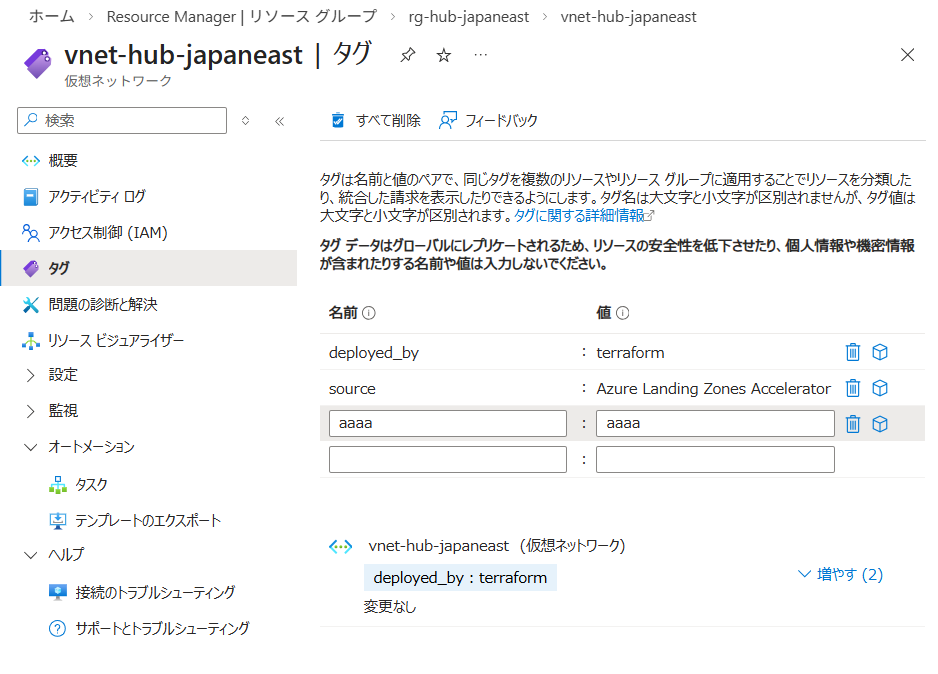

    **Step 2: ワークフローを再実行**

    1. GitHub Actionsで「Drift Detection」を手動実行
    2. 実行が完了するまで待つ（2-3分程度）

    **Step 3: 結果を確認**

    - ワークフローが終わると、先ほど追加したタグが、Driftとしてログに出ていることが確認できる。

    !!! tip "Driftを解消する💡 "
        テスト後は、CDのアプライを実行するとDriftが解消されます

---


#### 🏅 Drift検出のベストプラクティス

=== "🔑 運用のポイント"

    **定期実行のタイミング**:
    
    - 毎日実行
    - リリース前後: デプロイ前後での状態確認
    - インシデント後: トラブル対応後の状態確認
    
    **Issueへの対応フロー**:
    
    1. **検出**: GitHub Actionsが検出
    2. **調査**: 誰が、なぜ変更したかを確認
    3. **判断**: 
        - 変更が正しい → Terraformコードを更新
        - 変更が誤り → Terraformで上書き
    4. **適用**: 決定した対応を実施
    5. **クローズ**
    
    **よくあるDriftのパターン**:
    
    | 変更内容 | 対応方法 |
    |---------|---------|
    | タグの追加・変更 | Terraformコードに反映 |
    | ネットワーク設定変更 | 通常は元に戻す |
    | ポリシーの無効化 | 必ず元に戻す |
    | リソースの削除 | 緊急時以外は元に戻す |

=== "注意点"

    !!! warning "Driftを放置しない⚠️ "
        Driftを放置すると：
        
        - 次回の`terraform apply`で予期しない変更が発生
        - 本番環境の状態が不明確になる
        - トラブルシューティングが困難になる
        - コードとドキュメントの信頼性が低下
        
        検出したら必ず対応すること！

    !!! info "Stateful Resourcesの扱いℹ️ "
        一部のリソース（Log Analyticsのデータなど）は、手動で操作しても問題ない場合がある。
        
        そういったリソースは、`lifecycle`ブロックで管理対象外にできる：
        
        ```hcl
        resource "azurerm_log_analytics_workspace" "example" {
          # ... 設定 ...
          
          lifecycle {
            ignore_changes = [
              tags["LastModified"],
              # 特定の属性の変更を無視
            ]
          }
        }
        ```

---

### 🆙 Terraform Landing Zonesのバージョン更新

Azure Landing Zonesは定期的にアップデートされるます。

新機能の追加、バグ修正、セキュリティパッチなど、最新の状態に保つことが大事です。IaCのメリットを活かせます。

※IaCの管理でないと、Microsoftのアップデートに手動でついていく必要がある。直近などNSGフローログの廃止などがありました。今後はVMInsightsの廃止があるとの噂があります。

!!! info "なぜバージョン更新が必要？💡 "
    - **セキュリティ**: 脆弱性への対応
    - **新機能**: Azureの新サービスへの対応
    - **バグ修正**: 既知の問題の解消
    - **ベストプラクティス**: Microsoftの推奨設定の反映
    
    半年〜1年に一度くらいは確認して、必要に応じて更新するのがおすすめ。

---

#### 🗂️ バージョン管理の仕組み

Landing Zonesでは、主要なバージョン更新箇所は3つあります。

**1. `terraform.tf` - ALZプロバイダーのバージョン**

```hcl title="terraform.tf"
terraform {
  required_version = "~> 1.12"
  
  required_providers {
    # Terraformプロバイダーのバージョン
    alz = {
      source  = "Azure/alz"
      version = "0.20.0"  # ← これ！ALZプロバイダー
    }
    azurerm = {
      source  = "hashicorp/azurerm"
      version = "~> 4.0"
    }
  }
}
```

**2. `modules/management_groups/main.tf` - AVMモジュールのバージョン**

```hcl title="modules/management_groups/main.tf"
module "management_groups" {
  source  = "Azure/avm-ptn-alz/azurerm"
  version = "0.14.1"  # ← これ！AVMパターンモジュール
  
  # ... 設定 ...
}
```

**3. `lib/alz_library_metadata.json` - Azureポリシーライブラリのバージョン**

```hcl title="lib/alz_library_metadata.json"
{
  "$schema": "https://raw.githubusercontent.com/Azure/Azure-Landing-Zones-Library/main/schemas/library_metadata.json",
  "name": "local",
  "display_name": "ALZ Accelerator - Azure Verified Modules for ALZ Platform Landing Zone",
  "description": "This library allows overriding policies, archetypes, and management group architecture in the ALZ Accelerator.",
  "dependencies": [
    {
      "path": "platform/alz",
      "ref": "2025.09.3"　# ← これ！Azureポリシーライブラリのバージョン
    }
  ]
}

```

!!! warning "更新時にリリースノートは絶対確認！"

    対応バージョンは以下で確認：

    - [ALZプロバイダー リリースノート](https://github.com/Azure/terraform-provider-alz/releases)
    - [AVMパターンモジュール リリースノート](https://github.com/Azure/terraform-azurerm-avm-ptn-alz/releases)
    - [Azureポリシーライブラリ リリースノート](https://github.com/Azure/Azure-Landing-Zones-Library/releases)

---

#### 🔄 バージョン更新の手順

- "Step 1: リポジトリのファイルで、現在のバージョン確認"

- "Step 2: リリースノートで最新バージョンの確認"
    
- "Step 3: コミットする"

- "Step 4: CIのterraformプランで変更点を確認"

- "Step 5: 変更点が確認できたらCDを起動して変更をデプロイする"

---

#### 🎯 やってみよう: バージョンアップデートの実践

実際にバージョン更新を体験してみよう。

本書作成時は、Azureポリシーライブラリの更新がなかったので、今回はALZプロバイダーとAVMモジュールを更新します。

※バージョンは筆者がやってる時と違う場合があります。リリースノートを確認して最新のバージョンに更新してみましょう。

実践編と同じようにcodespacesを開いて、以下の2つのファイルを更新します。

!!! tip "更新が必要な2つのファイル📝 "
    1. `terraform.tf` - ALZプロバイダー
    2. `modules/management_groups/main.tf` - AVMモジュール

**Step 1: terraform.tfのバージョンを変更**

「terraform.tf」を開いて、ALZプロバイダーのバージョンを更新：

```hcl title="terraform.tf（変更例）"
alz = {
  source  = "Azure/alz"
  version = "0.20.2"  # 0.20.0 → 0.20.2 に変更
}
```

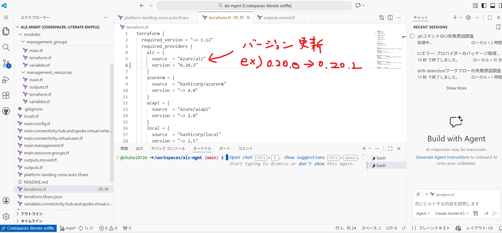

**Step 2: modules/management_groups/main.tfのバージョンも変更**

`modules/management_groups/main.tf`を開いて、AVMモジュールのバージョンも変更：

```hcl title="modules/management_groups/main.tf（変更例）"
module "management_groups" {
  source  = "Azure/avm-ptn-alz/azurerm"
  version = "0.17.0"  # 0.14.1 → 0.17.0 に変更
  # ...
}
```

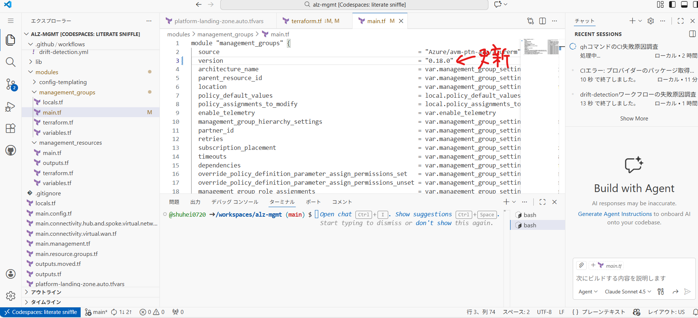

**Step 3: コミット&PRを作成**

以下のコマンドをターミナルで実行：

```bash
# feature ブランチ作成
git checkout -b feature/version-change

# 変更をコミット、プッシュ
git add .
git commit -m "バージョンを更新"
git push origin feature/version-change

# PR作成
gh pr create --base main --head feature/version-change --title "version-change" --body "version-change"

# PR番号を確認してマージ（squash mergeの例）
gh pr merge --squash

# mainブランチに戻る
git checkout main

# 最新を取得
git pull origin main

# ローカルブランチを強制削除
git branch -D feature/version-change
```

**Step 4: CIでPlanを確認**

リポジトリに戻るとCIが実行されているので、terraform planの変更点を確認しましょう。

!!! question "確認すること"
    - どんなリソースが変更される？
    - 削除されるリソースはない？
    - 意図しない変更はない？

**Step 5: 適用**

問題なければ、デプロイを承認して適用しましょう！

※バージョンに大きな変更があると、コードを変更する必要も出てくることがあります。できれば筆者と同じバージョンに更新することをお勧めします。


!!! success "完了！"
    これで2つのバージョン管理ポイントを確認できました。
    
    更新したファイル：
    - ✅ `terraform.tf` (ALZプロバイダー)
    - ✅ `modules/management_groups/main.tf` (AVMモジュール)


=== "📝 まとめ"

    !!! success "学んだこと🎉 "
        ✅ バージョンファイルの場所と変更方法  
        ✅ terraform init/planでの確認方法  
        ✅ Git/GitHubでの変更フロー  
        ✅ CI/CDパイプラインの動作  
        ✅ バージョン更新の影響範囲の確認方法

    !!! tip "本番での運用ポイント💡 "
        - **必ずリリースノートを読む**: 破壊的変更がないか確認
        - **テスト環境で先に試す**: 可能なら別のランディングゾーンで
        - **バックアップ**: 重要なリソースは事前にバックアップ
        - **メンテナンスウィンドウ**: 影響が少ない時間帯に実施
        - **ロールバック計画**: 問題が起きたときの戻し方を事前に決めておく

---

## 🔄 Part 2: 変更管理フロー

Part2では、Azureランディングゾーンで作ったインフラを変更する際にどうやるか見ていきましょう。

基本的に、Githubの仕組みを使って変更を管理していきます。

### 🌿 Branch→PR→Reviewフロー

GitHubを使った変更フローを図で見ていきましょう。

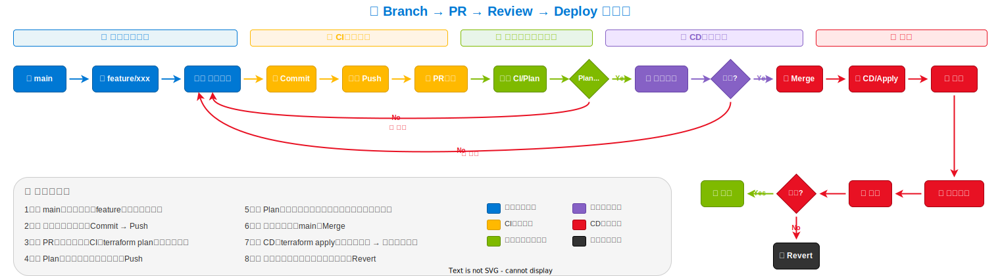

このように基本的にはすべての変更作業が、ブランチ作成→コード変更→コミット・プッシュ→プルリクエスト→承認→マージという共通の流れをたどっていくことになります。

---

### 変更管理ハンズオン

それでは、ハンズオンで変更作業の一連の流れを体験してみましょう。

実は、これまでの変更作業でコマンドでやってた「git add」などあれが変更の流れすべてまとめた一連のスクリプトだったんです。

ここでは、手動でのやり方を体験してみます。

#### ブランチ作成、コード更新

まずブランチを作成します。

Github Codespaceを開いてください。

開いた画面で、左側の枝みたいなアイコンを押すと「GitHub拡張機能」の画面が開きます。この画面でGitのほぼすべての操作がGUIでできてしまいます。

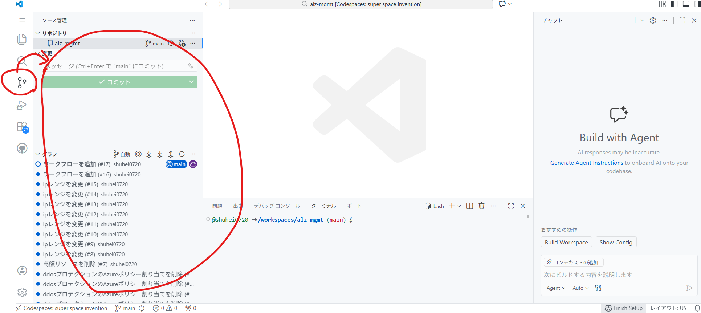

特に下部のグラフというところはこれまでの変更履歴が木のような形で記録されています。（画像の履歴はいろいろ検証しているので多くてすみません、、、）

絵もかいてみましたが、mainとブランチという概念の理解が必要です。mainが木の幹のようなものでこれまでの変更履歴をきれいに一直線に記録しています。ブランチが木の枝のようなもので、mainから離れて機能などを開発し、あとからmainと統合（マージ）します。

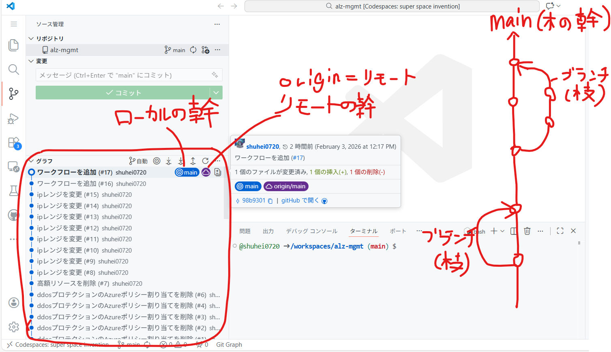

それでは、ブランチを作ってみましょう！グラフのところに枝みたいなのができますよ。

「その他の操作」→「ブランチ」→「ブランチの作成」を押してください。

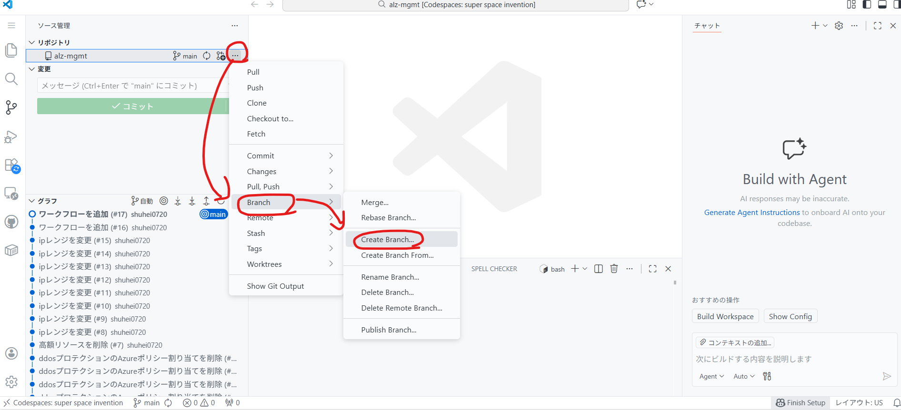

すると、ブランチの名前を入力する画面が出てくるので、「test-branch」と入力してエンターを押しましょう。

すると、先ほどまで「main」だったところが「test-branch」に変わります。現在値が「test-branch」であることを示しています。

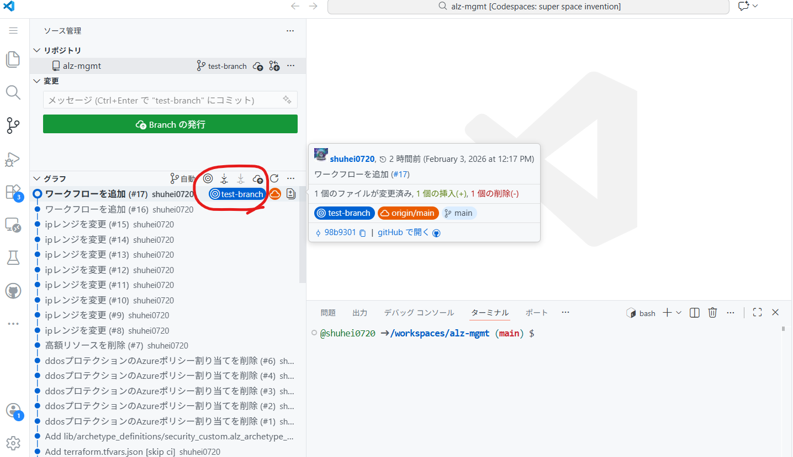

そしたら、新しく「test.txt」というファイルを追加します。

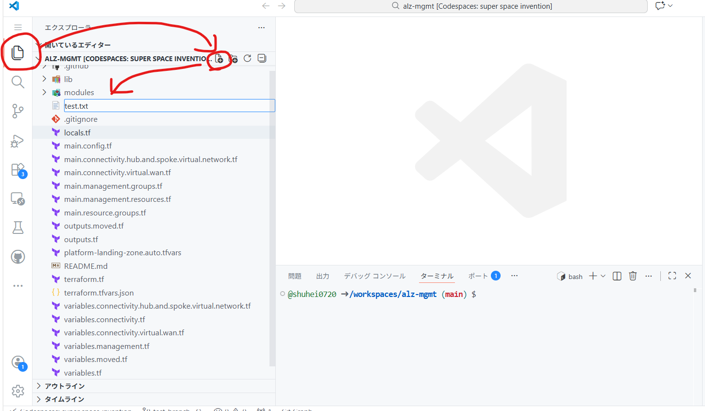

Github拡張機能に戻ると、「変更」欄に追加したファイルが表示されています。

#### コミット、プッシュ

✨ボタンを押してAIにコミットメッセージを生成してもらい、「コミット」を押してコミットしてみましょう。

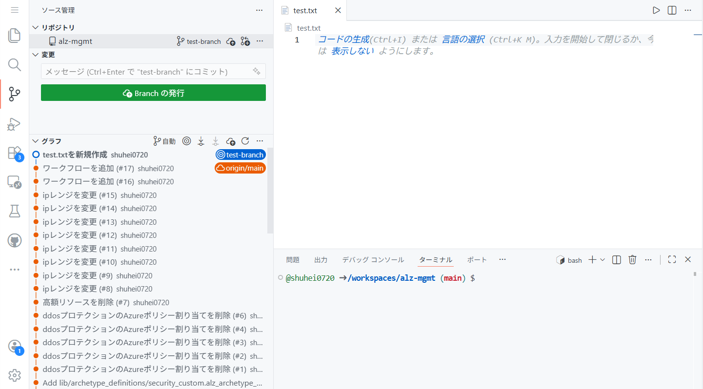

すると、「test-branch」が進んだことがわかります。「main」を離れてブランチが進んでいることがわかります。

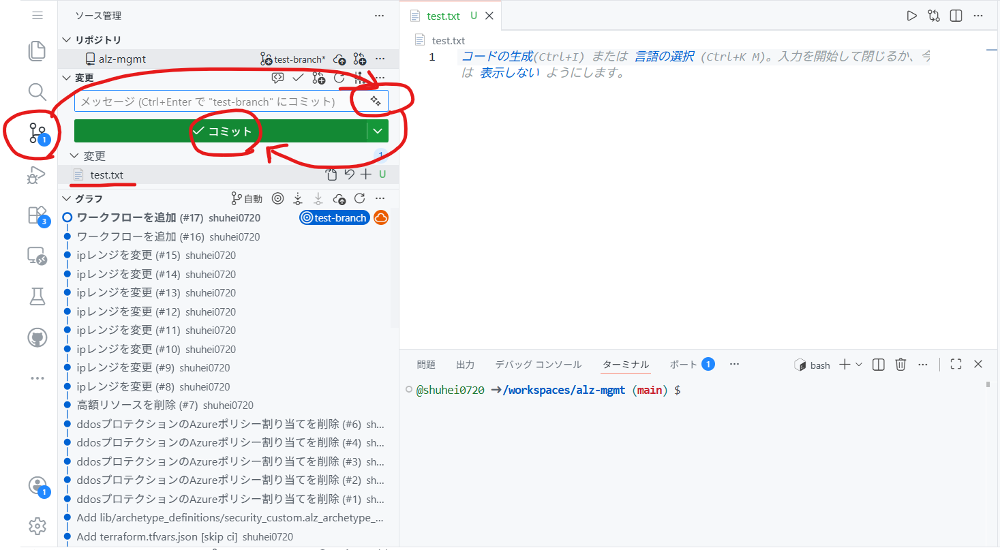

次に、ブランチをリモートにプッシュしてみましょう。

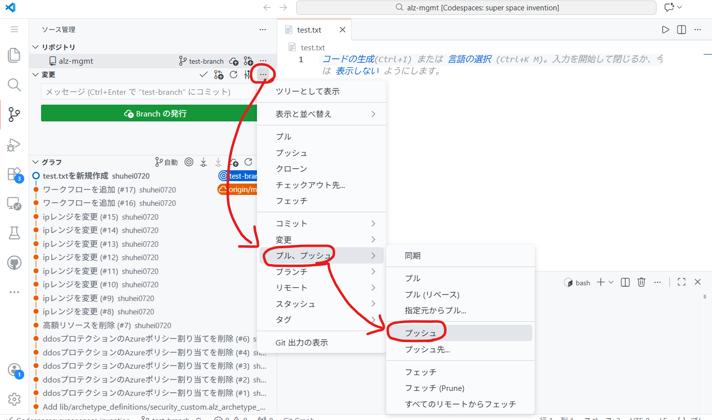

以下のような確認画面が出ますが、これはリモートにもブランチを作成することを意味します。OKを押しましょう。

ℹ️ローカルとリモートのリポジトリは別々に存在していると理解してください。それぞれにmainもブランチも存在しています。リモートはoriginと言ったりします。

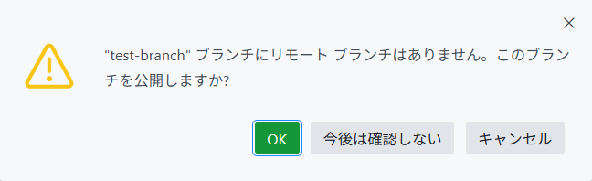

リモートにもブランチができているのがわかりますね。

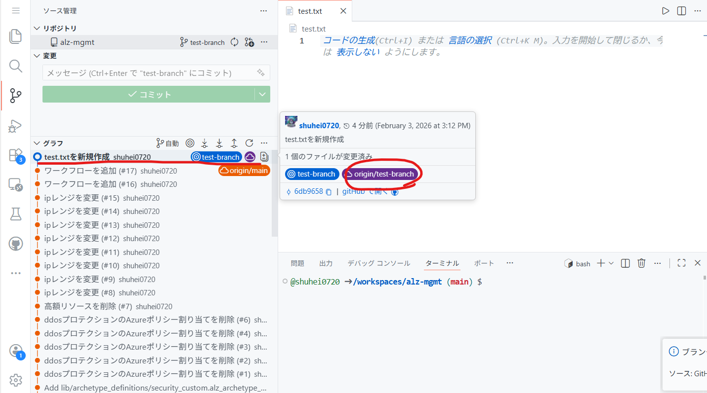

#### プルリクエスト、マージ

ここまでできたら、ブラウザでGitHubのあなたの「alz-mgnt」リポジトリに移動しましょう。

すると、リモートにブランチを発行したので、プルリクエストの作成ボタンが出ています。ボタンを押してみましょう。

ℹ️プルリクエスト＝承認依頼みたいな理解でOKです。

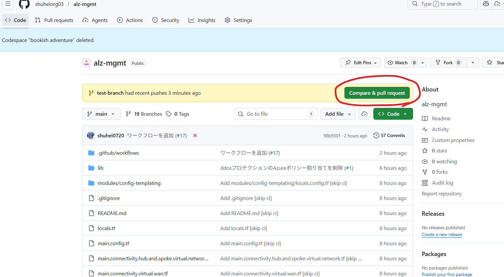

プルリクエストの作成画面に移動するので、「Create pull request」を押しましょう。

ℹ️現場では、ここで変更内容など、承認に必要な情報を記入します。

そうすると、プルリクエストの画面に移動します。これは承認者が確認する画面で、ここで変更内容を確認しOKであればマージします。「Squash and merge」を押しましょう。

ℹ️GitHubリポジトリでは承認できるユーザーを絞り込んで承認者だけがマージできます。mainへのマージをトリガーにCI/CD（terraformのプランとアプライ。今まで何回か見ましたよね）が動き、デプロイとなるので、マージ＝本番環境の変更っを意味します。

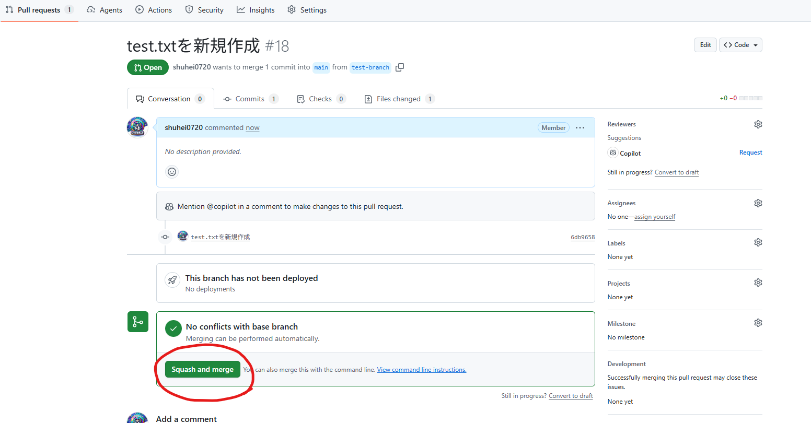

承認コメントを入力する画面になるので、そのままマージしましょう。

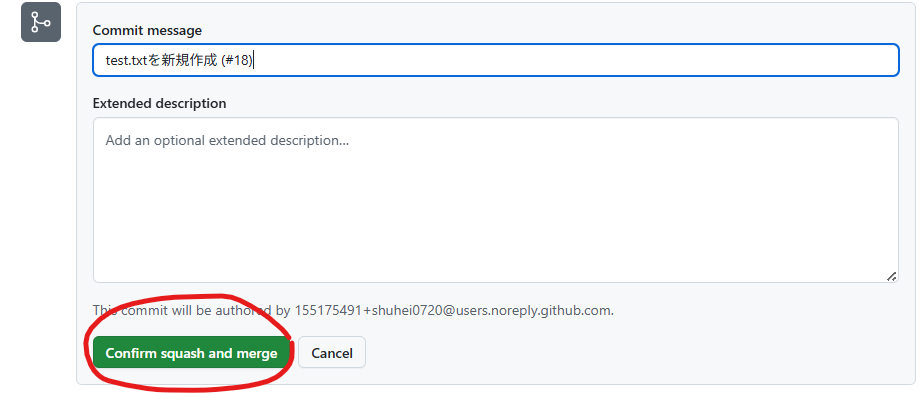

マージしたタイミングで、CI/CDが動き出します。GitHub Actionsのページで確認してみましょう。（筆者は時間が置いたのでもう終わっちゃってる）

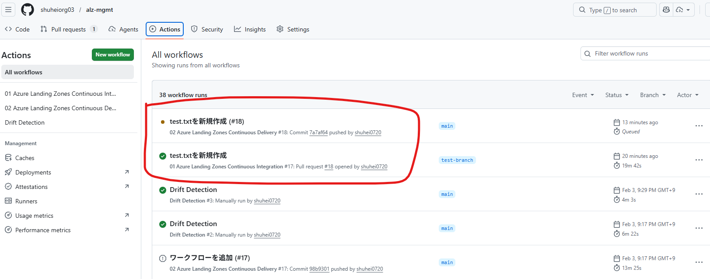

#### 後片付け

マージできたら、先ほど開いていたGitHub Codespaceに戻りましょう。

グラフを見ると、origin/mainが進んでブランチが枝になっているのがわかりますね。

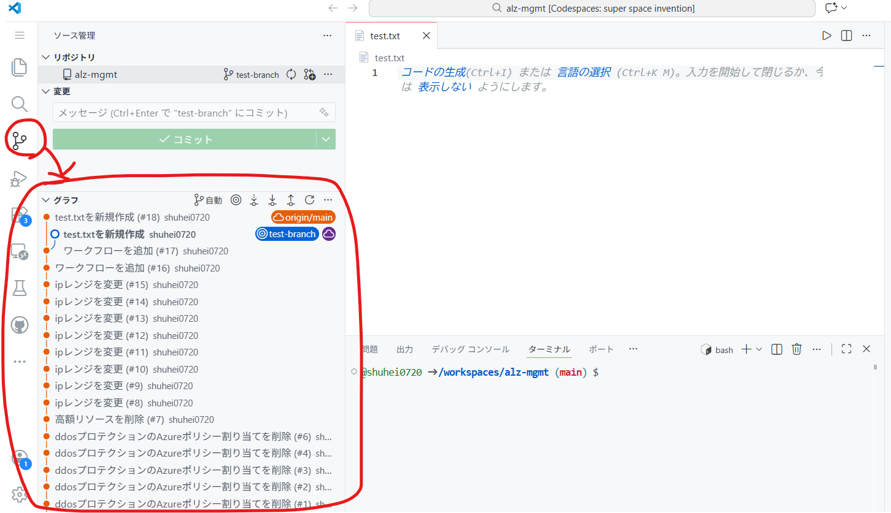

そうしたら、リモートが最新になったので、ローカルをリモートに合わせましょう。

origin/mainのところを右クリックして、「チェックアウト」→「origin/main」

ℹ️チェックアウトは現在のブランチ（mainもブランチの一種）を切り替えるという意味です。

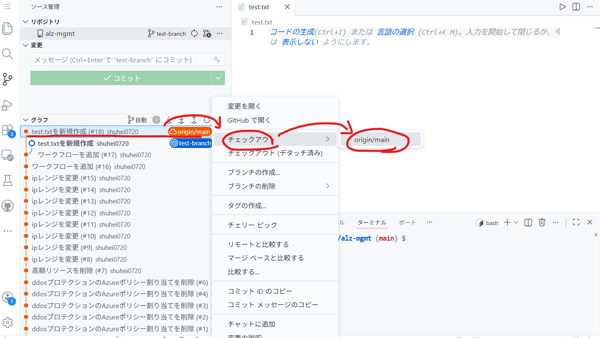

次は、プルをやりましょう。画面のように操作して「プル」してください。

ℹ️プルとは、「リモート」の最新状況をローカルの現在のブランチに反映する（引っ張ってくる＝プル）操作です。

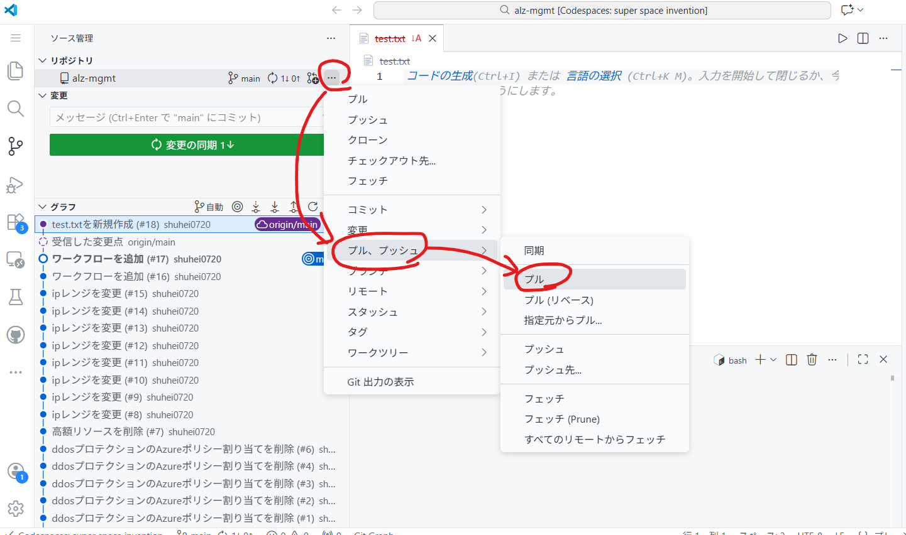

OK!グラフが一直線で綺麗になりました。この一連の流れがGitHubのコードを変更してインフラを変更する一連の流れになります。理解できたでしょうか。

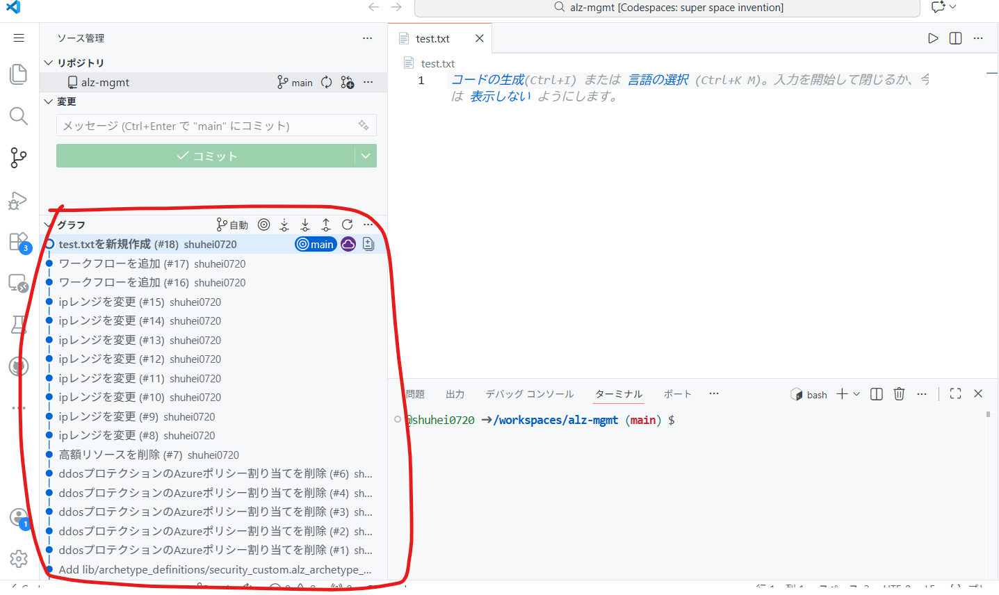

私の好きなサービスであるGitHubを説明できてうれしいです。GitHubは個人用途でも無料で使えて超便利なサービスですし、とりまきのエコシステムがすごく良いものがそろっているのでぜひ使ってみてください。


---

## ⚡ Part 3: サブスクリプション払い出しの自動化

### Subscription Vendingとは？

新しいプロジェクトが始まるたび、「Azureサブスクリプションが欲しい！」って要望が来る。毎回手作業で対応するのは大変だし、設定漏れも起きやすい。

そこで、`subscriptions/`ディレクトリにYAMLファイルを1つ追加するだけで、サブスクリプションが自動的に払い出される仕組みを作ってみましょう。


---

### 🎯✨ やってみよう: サブスクリプション自動払い出し

YAMLファイルを追加するだけで、サブスクリプションが自動作成される仕組みを作ります。

⚠️最後にサブスクリプションを作成してから24時間以上経っていないとterraformでのサブスクリプション作成がタイムアウトしてしまいます。その場合、時間を空けてください。

#### 事前準備：権限追加

サブスクリプションの作成に必要な権限を追加します。

AzureポータルでマネージドID「id-alz-mgmt-japaneast-apply-001」のオブジェクトIDをコピーします。

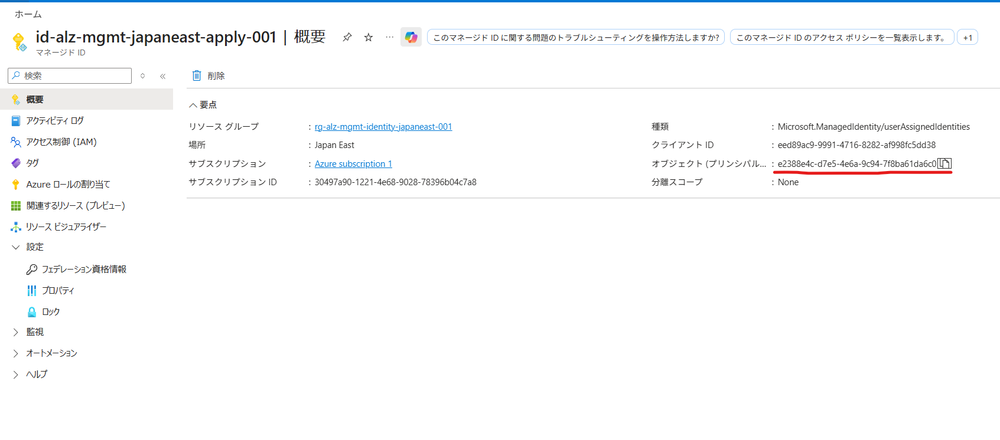

- Azureポータルで「コストの管理と請求」
- あなたの課金スコープを選択
- 左ペインの「アクセス制御 (IAM)」
- 「追加」をクリック
- 「ユーザー、グループ、またはアプリ」欄に先ほどコピーしたオブジェクトIDを貼り付けるとユーザーマネージドIDが出てくるので選択して追加

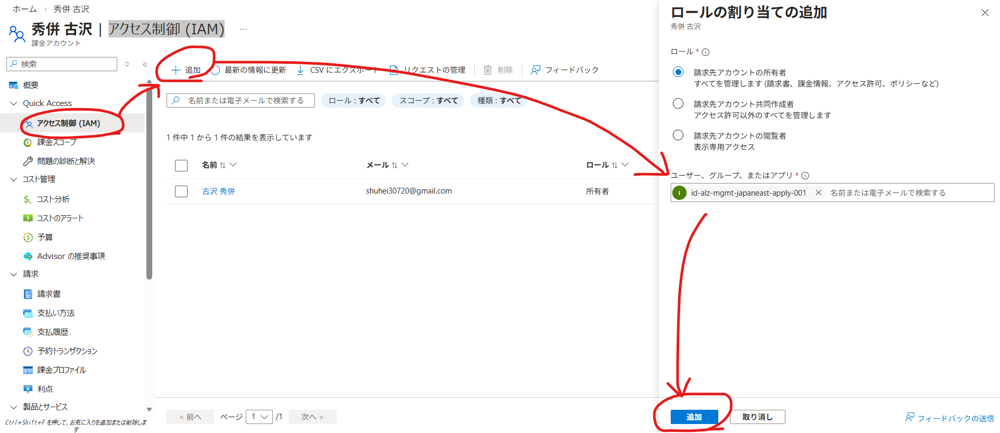


#### 🗂️ Step 1: ディレクトリ準備

実践編と同じようにcodespacesを開いていきましょう。

ターミナルで以下のコマンドを実行します。

```bash
# サブスクリプション定義用のディレクトリ作成
mkdir -p subscriptions
```

「subscriptions」フォルダが作成されます。

#### 📄 Step 2: Terraformファイルを作成

以下の名称で新しいファイルを作成します。

**`main.subscription.vending.tf`を作成：**

```hcl title="main.subscription.vending.tf（新規作成）"
# ========================================
# Terraformのサブスクリプションリソースの実装
# ========================================

locals {
  # subscriptions/ディレクトリからYAMLファイルを読み込む
  subscription_files = fileset("${path.module}/subscriptions", "*.yaml")

  # YAMLをパースして設定を作成（README.mdは説明用のファイルとして除外）
  subscriptions = {
    for file in local.subscription_files :
    trimsuffix(file, ".yaml") => yamldecode(file("${path.module}/subscriptions/${file}"))
    if file != "README.md"
  }
}

# 手順3: 管理グループIDの取得
data "azurerm_management_group" "subscription_target" {
  for_each = local.subscriptions

  name = each.value.management_group_id

  depends_on = [
    module.management_groups
  ]
}

# データソースでBilling Scopeを取得
data "azurerm_billing_mca_account_scope" "this" {
  count = var.billing_account_name != null && var.billing_profile_name != null && var.invoice_section_name != null ? 1 : 0

  billing_account_name = var.billing_account_name
  billing_profile_name = var.billing_profile_name
  invoice_section_name = var.invoice_section_name
}

# 手順4: サブスクリプションの作成
resource "azurerm_subscription" "this" {
  for_each = local.subscriptions

  subscription_name = each.value.display_name
  alias             = each.key
  billing_scope_id  = data.azurerm_billing_mca_account_scope.this[0].id
  workload          = lookup(each.value, "workload_type", "Production")

  tags = lookup(each.value, "tags", {})
}

# 手順5: Subscription Alias に対するロール割り当て
resource "azurerm_role_assignment" "alias_plan" {
  for_each = local.subscriptions

  scope                = "/providers/Microsoft.Subscription/aliases/${each.key}"
  role_definition_name = "Owner"
  principal_id         = var.plan_service_principal_object_id

  depends_on = [azurerm_subscription.this]
}

# 手順6: 管理グループへの関連付け
resource "azurerm_management_group_subscription_association" "this" {
  for_each = local.subscriptions

  management_group_id = data.azurerm_management_group.subscription_target[each.key].id
  subscription_id     = "/subscriptions/${azurerm_subscription.this[each.key].subscription_id}"

  depends_on = [azurerm_subscription.this]
}

# 手順7: リソースグループの作成
locals {
  # 全サブスクリプションのリソースグループをフラット化
  subscription_resource_groups = merge([
    for sub_key, sub in local.subscriptions : {
      for rg_key, rg in lookup(sub, "resource_groups", {}) :
      "${sub_key}-${rg_key}" => merge(rg, {
        subscription_id = azurerm_subscription.this[sub_key].subscription_id
        location        = lookup(rg, "location", lookup(sub, "location", "japaneast"))
        tags            = lookup(sub, "tags", {})
      })
    }
  ]...)
}

resource "azapi_resource" "resource_group" {
  for_each = local.subscription_resource_groups

  type      = "Microsoft.Resources/resourceGroups@2024-03-01"
  name      = each.value.name
  location  = each.value.location
  parent_id = "/subscriptions/${each.value.subscription_id}"

  body = {
    properties = {}
  }

  tags = each.value.tags

  lifecycle {
    ignore_changes = [tags]
  }

  depends_on = [
    azurerm_subscription.this,
    azurerm_role_assignment.alias_plan
  ]
}

# 手順8: リソースプロバイダーの登録
# 新しいサブスクリプションではMicrosoft.Networkが登録されていないため、
# VNet作成前に登録が必要
resource "azapi_resource_action" "register_network_provider" {
  for_each = local.subscriptions

  type        = "Microsoft.Resources/providers@2022-09-01"
  resource_id = "/subscriptions/${azurerm_subscription.this[each.key].subscription_id}/providers/Microsoft.Network"
  action      = "register"
  method      = "POST"

  depends_on = [
    azurerm_subscription.this,
    azurerm_role_assignment.alias_plan
  ]
}

# 手順9: VNetの作成
locals {
  # VNetが定義されているサブスクリプションを抽出
  vnets = {
    for sub_key, sub in local.subscriptions :
    sub_key => merge(sub.virtual_network, {
      subscription_id = azurerm_subscription.this[sub_key].subscription_id
      location        = lookup(sub.virtual_network, "location", lookup(sub, "location", "japaneast"))
      tags            = lookup(sub, "tags", {})
    })
    if lookup(sub, "virtual_network", null) != null
  }
}

resource "azapi_resource" "virtual_network" {
  for_each = local.vnets

  type      = "Microsoft.Network/virtualNetworks@2024-01-01"
  name      = each.value.name
  location  = each.value.location
  parent_id = "/subscriptions/${each.value.subscription_id}/resourceGroups/${each.value.resource_group_name}"

  body = {
    properties = {
      addressSpace = {
        addressPrefixes = each.value.address_space
      }
    }
  }

  tags = each.value.tags

  depends_on = [
    azapi_resource.resource_group,
    azurerm_subscription.this,
    azapi_resource_action.register_network_provider,
    module.management_groups
  ]
}

# 手順10: NSGの作成
locals {
  # 全VNetのサブネット用NSGをフラット化
  nsgs = merge([
    for sub_key, vnet in local.vnets : {
      for subnet in lookup(vnet, "subnets", []) :
      "${sub_key}-${subnet.name}" => {
        name                = "nsg-${subnet.name}"
        vnet_name           = vnet.name
        resource_group_name = vnet.resource_group_name
        subscription_id     = vnet.subscription_id
        location            = vnet.location
        tags                = vnet.tags
      }
    }
  ]...)
}

resource "azapi_resource" "nsg" {
  for_each = local.nsgs

  type      = "Microsoft.Network/networkSecurityGroups@2024-01-01"
  name      = each.value.name
  location  = each.value.location
  parent_id = "/subscriptions/${each.value.subscription_id}/resourceGroups/${each.value.resource_group_name}"

  body = {
    properties = {
      securityRules = []
    }
  }

  tags = each.value.tags

  depends_on = [
    azapi_resource.resource_group,
    azapi_resource_action.register_network_provider
  ]
}

# 手順11: サブネットの作成
locals {
  # 全VNetのサブネットをフラット化
  subnets = merge([
    for sub_key, vnet in local.vnets : {
      for subnet in lookup(vnet, "subnets", []) :
      "${sub_key}-${subnet.name}" => {
        name                = subnet.name
        vnet_name           = vnet.name
        resource_group_name = vnet.resource_group_name
        address_prefix      = subnet.address_prefix
        subscription_id     = vnet.subscription_id
        nsg_key             = "${sub_key}-${subnet.name}"
        vnet_key            = sub_key
      }
    }
  ]...)
}

resource "azapi_resource" "subnet" {
  for_each = local.subnets

  type      = "Microsoft.Network/virtualNetworks/subnets@2024-01-01"
  name      = each.value.name
  parent_id = "/subscriptions/${each.value.subscription_id}/resourceGroups/${each.value.resource_group_name}/providers/Microsoft.Network/virtualNetworks/${each.value.vnet_name}"

  body = {
    properties = {
      addressPrefix = each.value.address_prefix
      networkSecurityGroup = {
        id = azapi_resource.nsg[each.value.nsg_key].id
      }
    }
  }

  # VNet単位で排他制御（同一VNetへのサブネット操作は順次実行される）
  locks = [azapi_resource.virtual_network[each.value.vnet_key].id]

  depends_on = [
    azapi_resource.virtual_network,
    azapi_resource.nsg
  ]
}

# 手順12: Hub VNetへのピアリング
locals {
  # Hub接続が必要なVNetを抽出
  # Hub VNet情報は既存のhub_and_spoke_vnetモジュールから自動取得
  hub_vnet_id = try(
    values(module.hub_and_spoke_vnet[0].virtual_network_resource_ids)[0],
    var.hub_virtual_network_id
  )
  hub_vnet_name = try(
    values(module.hub_and_spoke_vnet[0].virtual_network_resource_names)[0],
    var.hub_virtual_network_name
  )
  hub_vnet_resource_group = try(
    split("/", local.hub_vnet_id)[4],
    var.hub_virtual_network_resource_group_name
  )

  vnet_peerings = {
    for sub_key, sub in local.subscriptions :
    sub_key => merge(sub.virtual_network, {
      subscription_key = sub_key
    })
    if lookup(sub, "virtual_network", null) != null &&
    lookup(sub.virtual_network, "hub_peering_enabled", false)
  }
}

# Spoke → Hub のピアリング
resource "azapi_resource" "spoke_to_hub_peering" {
  for_each = local.vnet_peerings

  type      = "Microsoft.Network/virtualNetworks/virtualNetworkPeerings@2024-01-01"
  name      = "${each.value.name}-to-hub"
  parent_id = "/subscriptions/${azurerm_subscription.this[each.value.subscription_key].subscription_id}/resourceGroups/${each.value.resource_group_name}/providers/Microsoft.Network/virtualNetworks/${each.value.name}"

  body = {
    properties = {
      remoteVirtualNetwork = {
        id = local.hub_vnet_id
      }
      allowVirtualNetworkAccess = true
      allowForwardedTraffic     = true
      allowGatewayTransit       = false
      useRemoteGateways         = lookup(each.value, "use_hub_gateway", false)
    }
  }

  depends_on = [azapi_resource.virtual_network]
}

# Hub → Spoke のピアリング（connectivityサブスクリプションのプロバイダーを使用）
resource "azapi_resource" "hub_to_spoke_peering" {
  provider = azapi.connectivity
  for_each = local.vnet_peerings

  type      = "Microsoft.Network/virtualNetworks/virtualNetworkPeerings@2024-01-01"
  name      = "hub-to-${each.value.name}"
  parent_id = local.hub_vnet_id

  body = {
    properties = {
      remoteVirtualNetwork = {
        id = "/subscriptions/${azurerm_subscription.this[each.value.subscription_key].subscription_id}/resourceGroups/${each.value.resource_group_name}/providers/Microsoft.Network/virtualNetworks/${each.value.name}"
      }
      allowVirtualNetworkAccess = true
      allowForwardedTraffic     = true
      allowGatewayTransit       = lookup(each.value, "use_hub_gateway", false)
      useRemoteGateways         = false
    }
  }

  depends_on = [azapi_resource.virtual_network]
}
```

#### 📝 Step 3: 変数を追加

`variables.tf`に以下を追加：

```hcl title="variables.tf（末尾に追加）"
# ========================================
# Subscription Vending用の変数を追加
# ========================================

variable "billing_account_name" {
  type        = string
  description = "The Billing Account name for MCA subscription creation"
  default     = null
}

variable "billing_profile_name" {
  type        = string
  description = "The Billing Profile name for MCA subscription creation"
  default     = null
}

variable "invoice_section_name" {
  type        = string
  description = "The Invoice Section name for MCA subscription creation"
  default     = null
}

variable "hub_virtual_network_id" {
  type        = string
  description = "The resource ID of the hub virtual network. Used as fallback when hub_and_spoke_vnet module is not deployed."
  default     = null
}

variable "hub_virtual_network_name" {
  type        = string
  description = "The name of the hub virtual network. Used as fallback when hub_and_spoke_vnet module is not deployed."
  default     = null
}

variable "hub_virtual_network_resource_group_name" {
  type        = string
  description = "The resource group name of the hub virtual network. Used as fallback when hub_and_spoke_vnet module is not deployed."
  default     = null
}

variable "plan_service_principal_object_id" {
  type        = string
  description = "The Object ID of the Plan Service Principal used for Terraform Plan operations. This principal will be granted Owner role on Subscription Aliases for read access."
  default     = null
}
```

#### 🗒️ Step 4: tfvarsファイルを更新

`terraform.tfvars.json`に以下を追加：

```json title="terraform.tfvars.json（追加）"
{
  // ... 既存の設定 ...
  "virtual_hubs": {},
  "virtual_wan_settings": {},

  "billing_account_name": "以下の手順で取得して設定",
  "billing_profile_name": "以下の手順で取得して設定",
  "invoice_section_name": "以下の手順で取得して設定",
  "plan_service_principal_object_id": "plan用のサービスプリンシパルのオブジェクトIDを設定"
}
```

**ここの値はAzureポータルで以下のように取得します。**

- Azureポータルで「コストの管理と請求」
- あなたの課金スコープを選択
- 右ペインの「課金プロファイル」
- あなたの課金プロファイル名をクリック
- 右ペインの「請求書セクション」
- あなたの請求書セクション名をクリック
- 右ペインの「プロパティ」

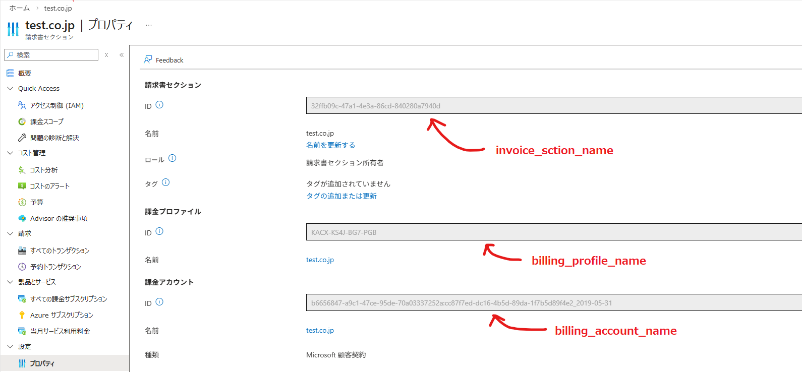

さっき編集していたファイルに追加

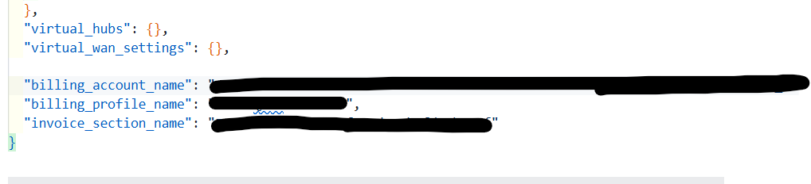

⚠️plan用のマネージドIDのオブジェクトIDも設定してください。


#### 📨 Step 5: コミット&PR作成

以下のコマンドを実行しましょう。


```
# feature ブランチ作成
git checkout -b feature/setup-subscription-vending

# 変更をコミット、プッシュ
git add .
git commit -m "YAMLファイルベースのサブスクリプション払い出し機能を追加"
git push origin feature/setup-subscription-vending

# PR作成
gh pr create --base main --head feature/setup-subscription-vending --title "feat: Setup subscription vending" --body "YAMLファイルベースのサブスクリプション払い出し機能を追加"

# PR番号を確認してマージ（squash mergeの例）
gh pr merge --squash

# mainブランチに戻る
git checkout main

# 最新を取得
git pull origin main

# ローカルブランチを強制削除
git branch -D feature/setup-subscription-vending

```


#### 🧪 Step 6: CI/CDでPlan確認

GitHub Actionsが自動実行されるので、リポジトリに戻って確認しましょう。

プランの変更点を確認したら、デプロイを承認しましょう。

**Plan結果:**
```
No changes. Your infrastructure matches the configuration.

# ↑ subscriptions/ディレクトリにYAMLがないので、変更なし = 正常
```

---

### 🚀 サブスクリプションを作成してみよう

YAMLファイルを追加するだけで、サブスクリプションが作成されます。


#### 📝 Step 1: サブスクリプションのyamlを追加


`subscriptions/demo-app-dev.yaml`を作成：

```yaml title="subscriptions/test-subscription.yaml（新規作成）"
display_name: "test-subscription"
workload_type: "Production"
management_group_id: "corp"
location: "japaneast"

tags:
  environment: "test"
  cost_center: "test-12345"
  owner: "platform-team"

resource_groups:
  network:
    name: "rg-test-network"
    location: "japaneast"
  application:
    name: "rg-test-app"
    location: "japaneast"

virtual_network:
  name: "vnet-test"
  resource_group_name: "rg-test-network"
  address_space: ["10.200.0.0/16"]
  hub_peering_enabled: true
  use_hub_gateway: false
  subnets:
    - name: "snet-app"
      address_prefix: "10.200.1.0/24"
    - name: "snet-data"
      address_prefix: "10.200.2.0/24"
    - name: "snet-web"
      address_prefix: "10.200.3.0/24"
```

⚠️vpngatewayは削除しているため、use_hub_gatewayはfalseにしましょう。

#### 📨 Step 2: PR作成&Plan確認

以下のコマンドを実行してください。

```
# feature ブランチ作成
git checkout -b feature/add-test-subscription

# 変更をコミット、プッシュ
git add .
git commit -m "テスト用のサブスクリプションを払い出い"
git push origin feature/add-test-subscription

# PR作成
gh pr create --base main --head feature/add-test-subscription --title "YAMLファイルベースのサブスクリプション払い出し機能を追加" --body "YAMLファイルベースのサブスクリプション払い出し機能を追加"

# PR番号を確認してマージ（squash mergeの例）
gh pr merge --squash

# mainブランチに戻る
git checkout main

# 最新を取得
git pull origin main

# ローカルブランチを強制削除
git branch -D feature/add-test-subscription

```


**CI/CDのPlan結果を確認：**

GitHub Actionsが自動実行されるので、リポジトリに戻って確認しましょう。

プランの変更点を確認したら、デプロイを承認しましょう。


#### 🔍 Step 3: 作成確認

Azureポータルで確認すると、サブスクリプションが作成されているのが確認できます！

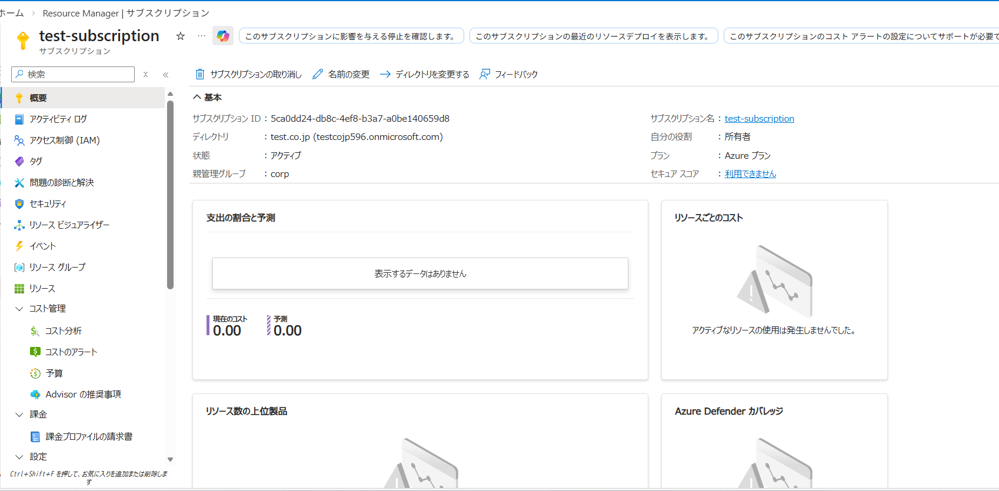

ちゃんとVNetも払い出されています。

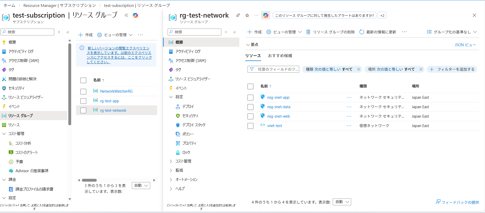

現場では、申請チケットと連動して自動でyamlファイルを作るようにすると、サブスクリプションの作成が完全に自動化できますよ(^▽^)/


---


### 複数サブスクリプションの一括管理

YAMLファイルをどんどん追加していけば、複数のサブスクリプションを管理できます。

**プロジェクト構造:**
```
alz-mgmt/
├── subscriptions/
│   ├── README.md
│   ├── demo-app-dev.yaml       # 開発環境
│   ├── webapp-prod.yaml        # WebApp本番
│   ├── dataapp-dev.yaml        # DataApp開発
│   └── dataapp-prod.yaml       # DataApp本番
├── main.subscription.vending.tf
├── variables.tf
└── terraform.tfvars.json
```


!!! tip "運用のベストプラクティス💡 "
    - **ファイル名のルール**: `{project}-{environment}.yaml`（例: `webapp-prod.yaml`）
    - **アドレス空間の管理**: 10.200.0.0/16, 10.201.0.0/16, ... と順番に割り当て
    - **管理グループの使い分け**: 開発は`sandbox`、本番は`corp`、オンライン用は`online`
    - **PR単位**: 1つのPRで1つのサブスクリプション追加（レビューしやすい）
    - **Plan確認**: 必ずCI/CDのPlan結果をレビューしてからマージ

---

## 🛡️ Part 4: カスタムポリシーの作成と管理

このPartでは、カスタムポリシーの作成と管理を体験してみましょう！

管理のフローは以下のようなイメージになります。

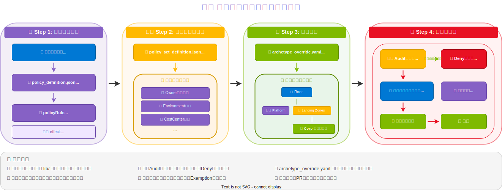

### 🏷️ カスタムポリシーとは？

Azureには標準で数百のポリシーが用意されていますが、組織独自のルールを適用したいこともあります。

**カスタムポリシーが必要になるケース:**

- 会社独自のタグ付けルール
- 特定のリソース設定の強制
- コストコントロールのための独自制限
- セキュリティ要件に合わせた独自チェック

ALZでは、カスタムポリシーを**コードで管理**できます。

---

### 🎯✨ やってみよう: カスタムポリシーを作成

実際に3ステップでカスタムポリシーを作ってみましょう。

#### 📝 シナリオ

「`deployed_by`タグの値が`terraform`でないリソースを検出する」というポリシーを作りたい。

これにより、**Terraform以外で作成されたリソース（手動作成など）を検出**できます。IaC運用の徹底に役立つポリシーです。

#### 🏗️ 構成

1. **ポリシー定義**: 「deployed_byタグがterraformでないリソースを検出」
2. **イニシアティブ**: IaC準拠チェックポリシーをまとめる
3. **割り当て**: Platform管理グループに適用（プラットフォームリソースを監視）

---

### 📝 Step 1: カスタムポリシー定義を作成


#### 📄 1-1: ポリシー定義ファイルを作成

`lib/policy_definitions/`ディレクトリに新しいファイルを作成：

```bash
mkdir -p lib/policy_definitions
```

作成したディレクトリに「Audit-Non-Terraform-Resources.alz_policy_definition.json」を作成し、以下記入してください。

```json title="lib/policy_definitions/Audit-Non-Terraform-Resources.alz_policy_definition.json（新規作成）"
{
  "name": "Audit-Non-Terraform-Resources",
  "type": "Microsoft.Authorization/policyDefinitions",
  "apiVersion": "2021-06-01",
  "properties": {
    "displayName": "Terraform以外で作成されたリソースを検出",
    "description": "deployed_byタグの値が'terraform'でないリソースを検出します。IaC運用の徹底に活用できます。",
    "policyType": "Custom",
    "mode": "Indexed",
    "metadata": {
      "category": "Tags",
      "version": "1.0.0",
      "source": "Custom"
    },
    "parameters": {
      "effect": {
        "type": "String",
        "metadata": {
          "displayName": "Effect",
          "description": "監査のみ、または作成を拒否"
        },
        "allowedValues": [
          "Audit",
          "Deny",
          "Disabled"
        ],
        "defaultValue": "Audit"
      },
      "tagName": {
        "type": "String",
        "metadata": {
          "displayName": "タグ名",
          "description": "チェック対象のタグ名"
        },
        "defaultValue": "deployed_by"
      },
      "tagValue": {
        "type": "String",
        "metadata": {
          "displayName": "期待するタグ値",
          "description": "このタグ値を持つリソースは準拠とみなされます"
        },
        "defaultValue": "terraform"
      }
    },
    "policyRule": {
      "if": {
        "anyOf": [
          {
            "field": "[concat('tags[', parameters('tagName'), ']')]",
            "exists": "false"
          },
          {
            "field": "[concat('tags[', parameters('tagName'), ']')]",
            "notEquals": "[parameters('tagValue')]"
          }
        ]
      },
      "then": {
        "effect": "[parameters('effect')]"
      }
    }
  }
}
```

!!! info "ポリシー定義の構造ℹ️ "
    - **name**: ポリシーのID（英数字とハイフンのみ）
    - **displayName**: Azure Portalで表示される名前
    - **mode**: `All`（全リソース）または`Indexed`（タグ対応リソース）
    - **policyRule**: 条件（if）と処理（then）
    - **effect**: Audit（監査）、Deny（拒否）、Disabled（無効）

!!! tip "なぜこのポリシーが役立つ？💡"
    - **手動作成の検出**: Azure Portalからの直接作成を発見
    - **ドリフト防止**: IaC以外の変更を早期発見
    - **ガバナンス強化**: 「すべてのリソースはTerraformで管理」を徹底

---

### 🗂️ Step 2: カスタムポリシーイニシアティブを作成

複数のポリシーをまとめて管理するために、イニシアティブ（ポリシーセット）を作ります。

#### 📄 2-1: イニシアティブ定義ファイルを作成

```bash
mkdir -p lib/policy_set_definitions
```

作成したディレクトリに「IaC-Compliance-Initiative.alz_policy_set_definition.json」を作成し、以下の内容を記入してください。

```json title="lib/policy_set_definitions/IaC-Compliance-Initiative.alz_policy_set_definition.json（新規作成）"
{
  "name": "IaC-Compliance-Initiative",
  "type": "Microsoft.Authorization/policySetDefinitions",
  "apiVersion": "2021-06-01",
  "properties": {
    "displayName": "IaC準拠チェックポリシーセット",
    "description": "Terraform等のIaCツールで管理されていないリソースを検出するポリシーセット",
    "policyType": "Custom",
    "metadata": {
      "category": "Tags",
      "version": "1.0.0",
      "source": "Custom"
    },
    "parameters": {
      "auditNonTerraformEffect": {
        "type": "String",
        "metadata": {
          "displayName": "非Terraformリソース検出の効果",
          "description": "deployed_byタグがterraformでないリソースに対するアクション"
        },
        "allowedValues": [
          "Audit",
          "Deny",
          "Disabled"
        ],
        "defaultValue": "Audit"
      }
    },
    "policyDefinitions": [
      {
        "policyDefinitionReferenceId": "AuditNonTerraformResources",
        "policyDefinitionName": "Audit-Non-Terraform-Resources",
        "parameters": {
          "effect": {
            "value": "[parameters('auditNonTerraformEffect')]"
          },
          "tagName": {
            "value": "deployed_by"
          },
          "tagValue": {
            "value": "terraform"
          }
        }
      }
    ]
  }
}
```

!!! tip "イニシアティブを使う理由💡 "
    1つずつポリシーを割り当てると管理が大変。イニシアティブにまとめると：
    
    - **一括適用**: 関連ポリシーを一度に適用
    - **パラメータ管理**: 全体のパラメータを一元管理
    - **バージョン管理**: ポリシーセット全体のバージョン管理が可能

---

### 🏷️ Step 3: アーキタイプに登録

作成したポリシーとイニシアティブを、アーキタイプに登録します。ここに登録すると、定義を自動で定義を作成してくれます。楽！

#### 📝 3-1: アーキタイプに登録

`lib/archetype_definitions/root_custom.alz_archetype_override.yaml`を編集：

ポリシーのところを追加します！（さっき追加したファイル名の冒頭が名前になります）

```yaml title="lib/archetype_definitions/root_custom.alz_archetype_override.yaml"
base_archetype: root
name: root_custom
policy_assignments_to_add: []
policy_assignments_to_remove: []
policy_definitions_to_add: [
  Audit-Non-Terraform-Resources
]
policy_definitions_to_remove: []
policy_set_definitions_to_add: [
  IaC-Compliance-Initiative
]
policy_set_definitions_to_remove: []
role_definitions_to_add: []
role_definitions_to_remove: []

```
### 🏷️ Step 4: ポリシーの割り当てを定義

ポリシーの割り当てを作成します。今回はplatform管理グループに割り当てることとしましょう。

`lib/policy_assignments/`ディレクトリに新しいファイルを作成：

```bash
mkdir -p lib/policy_assignments
```
作成したディレクトリに「Assign-IaC-Compliance.alz_policy_assignment.json」を作成し、以下の内容を記入してください。

```json title="lib/policy_assignments/Assign-IaC-Compliance.alz_policy_assignment.json（新規作成）"
{
  "name": "Assign-IaC-Compliance",
  "type": "Microsoft.Authorization/policyAssignments",
  "apiVersion": "2022-06-01",
  "properties": {
    "displayName": "IaC準拠チェックポリシー割り当て",
    "description": "Terraform等のIaCツールで管理されていないリソースを検出します",
    "policyDefinitionId": "/providers/Microsoft.Management/managementGroups/placeholder/providers/Microsoft.Authorization/policySetDefinitions/IaC-Compliance-Initiative",
    "parameters": {
      "auditNonTerraformEffect": {
        "value": "Audit"
      }
    },
    "nonComplianceMessages": [
      {
        "message": "このリソースはTerraformで管理されていません。deployed_byタグにterraformを設定してください。"
      }
    ],
    "enforcementMode": "Default"
  },
  "location": "japaneast",
  "identity": {
    "type": "None"
  }
}
```


---

### 🎯✨ やってみよう: 適用とテスト

コミットとPR、マージして適用しましょう！

#### 📨 5-1: コミット&PR作成

```bash
# feature ブランチ作成
git checkout -b feature/add-iac-compliance-policy

# 変更をコミット、プッシュ
git add .
git commit -m "カスタムポリシーを追加"
git push origin feature/add-iac-compliance-policy

# PR作成
gh pr create --base main --head feature/add-iac-compliance-policy --title "カスタムポリシーを追加" --body "カスタムポリシーを追加"

# PR番号を確認してマージ（squash mergeの例）
gh pr merge --squash

# mainブランチに戻る
git checkout main

# 最新を取得
git pull origin main

# ローカルブランチを強制削除
git branch -D feature/add-iac-compliance-policy
```

#### 🧪 5-2: GitHub ActionsでPlan確認

ci/cdが実行されるので、planを確認してデプロイ内容を確認しましょう。

#### ✅ 5-3: デプロイ

Plan結果を確認して問題なければ承認してデプロイしましょう！


#### 🔍 5-4: Azure Portalで確認

承認から数分後、Azure Portalで確認できます

ポリシー定義

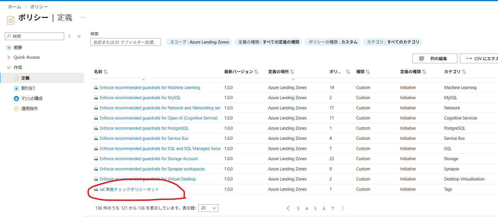

ポリシー割り当て

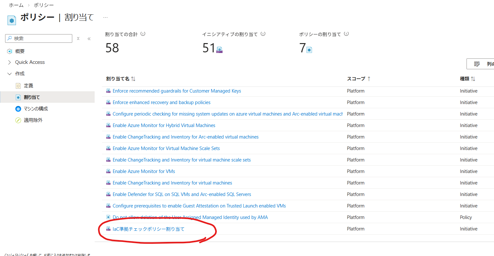


---

### 🎯✨ やってみよう: Denyモードへの切り替え

非準拠リソースが全て修正されたら、Denyモードに変更して、今後の手動作成を防ぎます。

#### 📝 6-1: Denyモードに変更

`lib/policy_assignments/Assign-IaC-Compliance.alz_policy_assignment.json`を編集して、

「auditNonTerraformEffect」パラメーターを「Audit」から「Deny」に変更しましょう！

```yaml title="lib/policy_assignments/Assign-IaC-Compliance.alz_policy_assignment.json（編集）"
{
  "name": "Assign-IaC-Compliance",
  "type": "Microsoft.Authorization/policyAssignments",
  "apiVersion": "2022-06-01",
  "properties": {
    "displayName": "IaC準拠チェックポリシー割り当て",
    "description": "Terraform等のIaCツールで管理されていないリソースを検出します",
    "policyDefinitionId": "/providers/Microsoft.Management/managementGroups/placeholder/providers/Microsoft.Authorization/policySetDefinitions/IaC-Compliance-Initiative",
    "parameters": {
      "auditNonTerraformEffect": {
        "value": "Deny"  # ←AuditからDenyに変更
      }
    },
    "nonComplianceMessages": [
      {
        "message": "このリソースはTerraformで管理されていません。deployed_byタグにterraformを設定してください。"
      }
    ],
    "enforcementMode": "Default"
  },
  "location": "japaneast",
  "identity": {
    "type": "None"
  }
}
```

変更を保存して適用しましょう！

```bash
# feature ブランチ作成
git checkout -b feature/enforce-iac-compliance-policy

# 変更をコミット、プッシュ
git add .
git commit -m "カスタムポリシーを強制に変更"
git push origin feature/enforce-iac-compliance-policy

# PR作成
gh pr create --base main --head feature/enforce-iac-compliance-policy --title "カスタムポリシーを強制に変更" --body "カスタムポリシーを強制に変更"

# PR番号を確認してマージ（squash mergeの例）
gh pr merge --squash

# mainブランチに戻る
git checkout main

# 最新を取得
git pull origin main

# ローカルブランチを強制削除
git branch -D feature/enforce-iac-compliance-policy
```

!!! warning "Denyモードの影響⚠️ "
    Denyモードに変更すると、`deployed_by=terraform`タグがないリソース作成は**デプロイエラー**になります。
    
    **エラー例:**
    ```
    Error: creating Storage Account "stmanual01" (Resource Group "rg-management"):
    The resource 'stmanual01' was disallowed by policy.
    Policy: IaC準拠チェックポリシー
    Reason: Resource does not have tag 'deployed_by' with value 'terraform'
    ```
    
    必ず事前に関係者へ通知し、Terraform以外での作成が必要なリソースは適用除外を設定してから変更しましょう。

---

### 🌟 カスタムポリシー開発のベストプラクティス

!!! tip "段階的なロールアウト🚦 "
    新しいポリシーは段階的に：
    
    1. **Audit**: 監査モードで影響範囲を確認
    2. **修正**: 非準拠リソースを修正
    3. **Deny**: 全て準拠したら強制モード
    4. **通知**: 事前に関係者へ通知

!!! tip "テスト環境で検証🧪 "
    - 先に`Sandbox`管理グループで試す
    - 問題なければ`corp`に適用

!!! tip "イニシアティブで整理🗂️ "
    - 関連ポリシーはイニシアティブにまとめる
    - カテゴリ別（Tags、Security、Cost、Networkなど）に分類
    - バージョン番号を付けて管理

!!! tip "ドキュメント化📚 "
    - PR本文に影響範囲を記載
    - ポリシーの目的と背景を明記
    - ロールバック手順も準備

---

## 📝 まとめ

この章で学んだこと：

### ✅🛠️ Part 1: Terraformの運用

- **Configuration Drift検出**: GitHub Actionsで定期的にDriftをチェック
- **バージョン更新**: Terraform / ALZモジュールの段階的なアップデート手順
- **tfvars管理**: 環境ごとの設定ファイル管理

### ✅🔄 Part 2: 変更管理フロー

- **変更リクエスト受付**: 申請テンプレートで必要情報を収集
- **Branch→PR→Review**: feature/xxxブランチで変更 → PRでレビュー
- **Terraform Plan確認**: 変更内容を事前に確認
- **Approval Process**: 承認フローでガバナンス強化
- **変更履歴管理**: Gitコミットで完全な追跡可能性

### ✅⚡ Part 3: サブスクリプション払い出しの自動化

- **Subscription Vending**: YAMLファイル追加でサブスクリプション自動作成
- **管理グループへの自動配置**: corpやonlineへ自動的に配置
- **リソースグループ自動作成**: サブスクリプションと一緒にRGも作成
- **VNet自動作成**: 必要に応じてネットワークも自動構築

### ✅🛡️ Part 4: カスタムポリシーの作成と管理

- **カスタムポリシー定義**: lib/policy_definitions/にJSONで定義
- **イニシアティブ作成**: 複数ポリシーをまとめて管理
- **archetype_override**: 管理グループへの割り当て
- **段階的ロールアウト**: Audit → 修正 → Deny

---

## 🏋️‍♂️ 練習問題

理解度チェックです。休憩中に考えてみましょう。

### ❓ 問題1
新しいリソースグループを追加する際の正しい手順は何ですか？

### ❓ 問題2
`terraform plan`と`terraform apply`の違いは何ですか？

### ❓ 問題3
ポリシー定義を更新する際に注意すべきことは何ですか？

---

## 📝 練習問題の答え

### 🅰️ 答え1
正しい手順:

1. **ブランチ作成**
   ```bash
   git checkout -b feature/add-resource-group
   ```

2. **tfvarsファイル編集**
   ```hcl
   resource_group_config = {
     # 既存のRG
     "rg-management-jp" = { ... }
     
     # 新しいRG
     "rg-app-jp" = {
       location = "japaneast"
       tags = {
         environment = "prod"
         application = "myapp"
       }
     }
   }
   ```

3. **ローカルでplan確認**
   ```bash
   terraform plan
   ```

4. **Pull Request作成**
   ```bash
   git add .
   git commit -m "feat: Add app resource group"
   git push origin feature/add-resource-group
   ```

5. **レビュー承認後、マージ**

6. **GitHub Actionsで自動デプロイ**

### 🅰️ 答え2

| コマンド | 動作 | 実行結果 |
|----------|------|----------|
| `terraform plan` | **変更内容のプレビュー** | リソースは変更されない |
| `terraform apply` | **実際に変更を適用** | リソースが作成・変更・削除される |

**planの出力例:**
```
Terraform will perform the following actions:

  # azurerm_resource_group.app will be created
  + resource "azurerm_resource_group" "app" {
      + name     = "rg-app-jp"
      + location = "japaneast"
    }

Plan: 1 to add, 0 to change, 0 to destroy.
```

必ずplanで確認してからapplyしましょう。

### 🅰️ 答え3

1. **既存リソースへの影響を確認**
   ```bash
   terraform plan
   ```
   ポリシー更新が既存リソースに影響する場合、Non-compliantになる可能性があります。

2. **段階的なロールアウト**
   ```
   1. まず監査モード（audit）で実施
   2. Non-compliant リソースを確認
   3. 修正後、強制モード（deny）に変更
   ```

3. **除外設定の確認**
   ```hcl
   not_scopes = [
     "/subscriptions/xxx/resourceGroups/rg-exception"
   ]
   ```
   特定のリソースをポリシーから除外できます。

4. **ドキュメント更新**

   - ポリシー変更の理由
   - 影響範囲
   - ロールバック手順

!!! tip "次の章へ👉 "
    [05_プロジェクト構造.md](05_プロジェクト構造.md)で、実践編で作成したプロジェクトの構造を理解しましょう！
