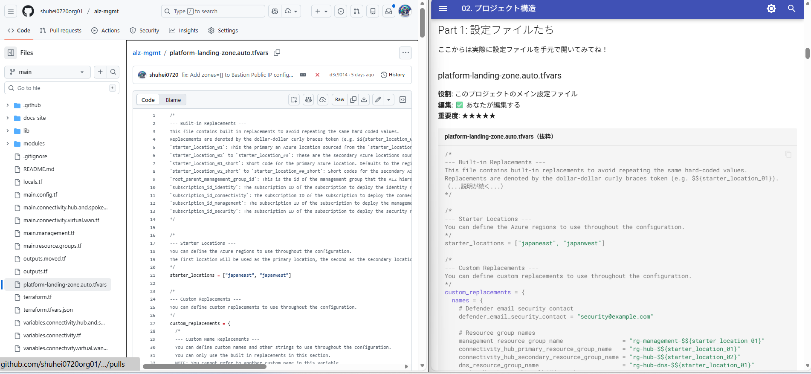

# 05. プロジェクト構造 - ファイルとフォルダの全体像 🗂️

!!! info "この章で学ぶこと💡 "
    実践編で作成したランディングゾーンのファイル構成を理解します。
    

この章以降で、実践編で作ったランディングゾーンの詳細を解明していきます。

複雑なだけあって、理解するところが多いですがこれを理解すれば、様々な技術の面で勉強になります。
ぜひ頑張ってみてください。

ちなみにこの章以降はオタク向けです🤓


※ここからは実践編で作成したリポジトリを開きながら見ていきましょう。

　こんな感じ↓


---

## 🗺️ ファイル構成の鳥瞰図

まず、全体のファイル構成を見てみましょう：

```text title="ファイル構成の鳥瞰図"
alz-mgmt/
├── 📝 設定ファイル（あなたが編集する）
│   ├── platform-landing-zone.auto.tfvars  ← メイン設定（ここだけ触ればOK）
│   ├── terraform.tfvars.json              ← 秘密情報（Git管理外）
│   └── terraform.tf                       ← Terraform自体の設定
│
├── 🎯 変数定義ファイル（変数の型を定義）
│   ├── variables.tf                                      ← 共通変数
│   ├── variables.connectivity.tf                         ← 接続関連
│   ├── variables.connectivity.hub.and.spoke.virtual.network.tf
│   ├── variables.connectivity.virtual.wan.tf
│   ├── variables.management.tf                           ← 管理関連
│   └── variables.moved.tf                                ← 後方互換用
│
├── 🔧 ローカル変数（計算済みの値）
│   └── locals.tf                          ← 変数を加工した値
│
├── 🚀 メイン処理ファイル（実際の処理）
│   ├── main.config.tf                                    ← 設定処理
│   ├── main.resource.groups.tf                           ← リソースグループ作成
│   ├── main.management.tf                                ← 管理グループ・ポリシー
│   ├── main.connectivity.hub.and.spoke.virtual.network.tf ← Hub-Spokeネットワーク
│   └── main.connectivity.virtual.wan.tf                  ← Virtual WAN
│
├── 📤 出力定義（作ったリソースの情報を出力）
│   ├── outputs.tf                         ← 出力定義
│   └── outputs.moved.tf                   ← 後方互換用
│
├── 📦 モジュール（再利用可能な部品）
│   ├── config-templating/                 ← 設定のテンプレート処理
│   ├── management_groups/                 ← 管理グループ・ポリシー
│   └── management_resources/              ← Log Analytics等
│
├── 📚 ライブラリ（ポリシー定義のYAML）
│   ├── alz_library_metadata.json
│   ├── archetype_definitions/             ← 管理グループの種類
│   └── architecture_definitions/          ← 全体構成
│
├── 🤖 CI/CD（自動化）
│   └── .github/
│       └── workflows/
│           └── cd.yaml                    ← GitHub Actions設定
│

```


**🔄 実際の処理の流れ**

これらのファイルがどのような流れで処理されるか視覚化すると以下のようになります。

ファイルは多いけど、やってることはこれだけです！


---

## 📝 Part 1: 設定ファイルたち

ここからは実際に設定ファイルを手元で開いてみください！


### 🗒️ platform-landing-zone.auto.tfvars

**役割**: このプロジェクトのメイン設定ファイル  
**編集**: ✅ あなたが編集する  
**重要度**: ★★★★★

```hcl title="platform-landing-zone.auto.tfvars（抜粋）"
/*
--- Built-in Replacements ---
This file contains built-in replacements to avoid repeating the same hard-coded values.
Replacements are denoted by the dollar-dollar curly braces token (e.g. $${starter_location_01}).
（...説明が続く...）
*/

/*
--- Starter Locations ---
You can define the Azure regions to use throughout the configuration.
*/
starter_locations = ["japaneast", "japanwest"]

/*
--- Custom Replacements ---
You can define custom replacements to use throughout the configuration.
*/
custom_replacements = {
  names = {
    # Defender email security contact
    defender_email_security_contact = "security@example.com"

    # Resource group names
    management_resource_group_name                 = "rg-management-$${starter_location_01}"
    connectivity_hub_primary_resource_group_name   = "rg-hub-$${starter_location_01}"
    connectivity_hub_secondary_resource_group_name = "rg-hub-$${starter_location_02}"
    dns_resource_group_name                        = "rg-hub-dns-$${starter_location_01}"
    # （...他のリソースグループ名が続く...）
    
    # Resource provisioning primary connectivity
    primary_firewall_enabled                      = true
    primary_virtual_network_gateway_vpn_enabled   = true
    primary_bastion_enabled                       = true
    # （...他の設定が500行以上続く...）
  }
}
```

このファイルだけ編集すれば、ほとんどの設定が変更できます。

**🌟 重要なポイント：**

- `$${starter_location_01}`のような変数展開が使える（テンプレート機能）
- リソース名、リソースグループ名を一括定義
- どのリソースを有効/無効にするかもここで設定

**🤔 なぜ`.auto.tfvars`？**

- `.tfvars`だと`terraform apply -var-file=xxx.tfvars`って指定が必要
- `.auto.tfvars`は自動で読み込まれる
- 楽だから`.auto`をつけてる

---

### 🗃️ terraform.tfvars.json

**役割**: サブスクリプションIDや各種設定  
**編集**: ✅ 最初だけ編集する  
**重要度**: ★★★★☆

```json title="terraform.tfvars.json（実際のファイル）"
{
  "connectivity_tags": null,
  "management_groups_enabled": true,
  "management_resources_enabled": true,
  "private_link_private_dns_zone_virtual_network_link_moved_blocks_enabled": false,
  "root_parent_management_group_id": "あなたのテナントルートMG ID",
  "starter_locations_short": {},
  "subscription_id_connectivity": null,
  "subscription_id_identity": null,
  "subscription_id_management": null,
  "subscription_ids": {
    "management": "あなたのサブスクリプションID",
    "identity": "あなたのサブスクリプションID",
    "connectivity": "あなたのサブスクリプションID",
    "security": "あなたのサブスクリプションID"
  },
  "virtual_hubs": {},
  "virtual_wan_settings": {}
}
```

**🤔 なぜJSON形式？**

- HCLより機械的に生成しやすい
- CI/CDで動的に作りやすい
- 複数の設定を1つのファイルにまとめられる


**🔑 主要な設定項目（ファイル記載順）：**

1. `connectivity_tags`: 接続リソース用の追加タグ（通常はnull）
2. `management_groups_enabled`: 管理グループを作成するか（true/false）
3. `management_resources_enabled`: 管理リソース（Log Analyticsなど）を作成するか
4. `private_link_private_dns_zone_virtual_network_link_moved_blocks_enabled`: 後方互換性フラグ
5. `root_parent_management_group_id`: 管理グループ階層の親となるMG ID
6. `starter_locations_short`: リージョンの短縮名をカスタマイズする場合（通常は空）
7. `subscription_id_connectivity`: 旧形式（後方互換性のため残っている、通常はnull）
8. `subscription_id_identity`: 旧形式（後方互換性のため残っている、通常はnull）
9. `subscription_id_management`: 旧形式（後方互換性のため残っている、通常はnull）
10. `subscription_ids`: **新形式のサブスクリプションID指定（map形式）** ← これを使う
11. `virtual_hubs`: Virtual WAN使用時のHub設定（通常は空）
12. `virtual_wan_settings`: Virtual WAN使用時の設定（通常は空）

---

### ⚙️ terraform.tf

**役割**: Terraform自体の設定  
**編集**: ❌ 基本触らない  
**重要度**: ★★★☆☆

```hcl title="terraform.tf"
terraform {
  required_version = "~> 1.12"
  
  required_providers {
    alz = {
      source  = "Azure/alz"
      version = "0.20.0"
    }
    azurerm = {
      source  = "hashicorp/azurerm"
      version = "~> 4.0"
    }
    azapi = {
      source  = "Azure/azapi"
      version = "~> 2.0"
    }
    local = {
      source  = "hashicorp/local"
      version = "~> 2.5"
    }
  }
  
  backend "azurerm" {}
}
```

#### 🏷️ required_version
```hcl
required_version = "~> 1.12"
```
Terraform 1.12.x じゃないと動かない宣言。

#### 📦 required_providers

使うプロバイダーのバージョン指定。

**alz**: Azure Landing Zones専用プロバイダー（管理グループ・ポリシー管理）  
**azurerm**: Azure Resource Manager（Azureのメインプロバイダー）  
**azapi**: Azure API直接叩く用（azurermでできないことに使う）  
**local**: ローカルファイル操作用（設定ファイルの読み書き）

**なぜ`~> 4.0`？**

- `~>` = 互換性のある範囲でバージョンアップOK
- `4.0` = 4.0.x, 4.1.x, 4.99.x はOK、5.0.x はNG
- バグ修正は受け取りたいけど、破壊的変更は避けたい

#### 🗄️ backend
```hcl
backend "azurerm" {}
```
状態ファイル（`terraform.tfstate`）をAzure Storageに保存。

`{}`が空なのは、実行時に指定するから：
```bash title="backendの初期化"
terraform init \
  -backend-config="resource_group_name=rg-tfstate" \
  -backend-config="storage_account_name=stotfstate" \
  -backend-config="container_name=tfstate" \
  -backend-config="key=terraform.tfstate"
```

GitHub Actionsでこの指定をやってます。

---

## 🧩 Part 2: 変数定義ファイルたち

### 📝 変数定義ファイルの役割

Terraformの変数には型があります。

```hcl title="変数定義の例"
# variables.tf
variable "location" {
  type        = string           # 型は文字列
  description = "Azure region"   # 説明
  default     = "japaneast"      # デフォルト値
}
```

このファイルで「どんな変数を受け取るか」を定義します。

---

### 🗂️ variables.tf（メイン変数）

**役割**: プロジェクト全体で使う共通変数  
**編集**: ❌ 触らない  
**重要度**: ★★★☆☆

```hcl title="variables.tf（抜粋：主要な3つの変数のみ掲載、実際は10個の変数がある）"
variable "starter_locations" {
  type        = list(string)
  description = "The default for Azure resources. (e.g 'uksouth')"
  validation {
    condition     = length(var.starter_locations) > 0
    error_message = "You must provide at least one starter location region."
  }
}

# （省略: starter_locations_short）

variable "subscription_ids" {
  description = "The list of subscription IDs to deploy the Platform Landing Zones into"
  type        = map(string)
  default     = {}
  nullable    = false
  validation {
    condition     = length(var.subscription_ids) == 0 || alltrue([for id in values(var.subscription_ids) : can(regex("^([0-9a-fA-F]{8}-[0-9a-fA-F]{4}-[0-9a-fA-F]{4}-[0-9a-fA-F]{4}-[0-9a-fA-F]{12})$", id))])
    error_message = "All subscription IDs must be valid GUIDs"
  }
}

# （省略: subscription_id_connectivity, subscription_id_identity, subscription_id_management - 旧形式で非推奨）
# （省略: root_parent_management_group_id, enable_telemetry）

variable "custom_replacements" {
  type = object({
    names                      = optional(map(string), {})
    resource_group_identifiers = optional(map(string), {})
    resource_identifiers       = optional(map(string), {})
  })
  default = {
    names                      = {}
    resource_group_identifiers = {}
    resource_identifiers       = {}
  }
  description = "Custom replacements"
}

# （省略: tags）
```

#### 📋 list(string)型

```hcl
starter_locations = ["japaneast", "japanwest"]
```

文字列のリスト。何個でもOK。

**validation（バリデーション）**:

```hcl
validation {
  condition     = length(var.starter_locations) > 0
  error_message = "You must provide at least one starter location region."
}
```

- 最低1つのリージョンが必要
- 空のリストを渡すとエラー

#### 🗺️ map(string)型

```hcl
subscription_ids = {
  "management"   = "xxx-xxx-xxx"
  "connectivity" = "yyy-yyy-yyy"
}
```

キーと値のペア。JavaScriptのオブジェクトみたいなものだけど配列に近い。


#### 🧱 object型

```hcl
variable "custom_replacements" {
  type = object({
    names                      = optional(map(string), {})
    resource_group_identifiers = optional(map(string), {})
    resource_identifiers       = optional(map(string), {})
  })
  default = {
    names                      = {}
    resource_group_identifiers = {}
    resource_identifiers       = {}
  }
  description = "Custom replacements"
}
```

構造化されたデータ。JavaScriptのオブジェクトみたいなもの。

**optional（オプショナル）**:

```hcl
names = optional(map(string), {})
```

- `optional`= この項目は省略可能
- 第2引数の`{}`はデフォルト値（省略時は空マップ）
- Terraform 1.3以降の機能

---

### 🌐 variables.connectivity.tf（ネットワーク変数）

**役割**: ネットワーク関連の変数定義  
**編集**: ❌ 触らない  
**重要度**: ★★☆☆☆

```hcl title="variables.connectivity.tf"
variable "connectivity_type" {
  type        = string
  description = "The type of network connectivity technology to use for the private DNS zones"
  default     = "hub_and_spoke_vnet"
  validation {
    condition     = contains(values(local.const.connectivity), var.connectivity_type)
    error_message = "The connectivity type must be either 'hub_and_spoke_vnet', 'virtual_wan' or 'none'"
  }
}

variable "connectivity_resource_groups" {
  type = map(object({
    name     = string
    location = string
    tags     = optional(map(string))
    settings = optional(any)
  }))
  default     = {}
  description = <<DESCRIPTION
A map of resource groups to create. These must be created before the connectivity module is applied.

The following attributes are supported:

  - name: The name of the resource group
  - location: The location of the resource group
  - settings: (Optional) An object, which can include an `enabled` setting value that indicates whether the resource group should be created.

DESCRIPTION
}

variable "connectivity_tags" {
  type        = map(string)
  default     = null
  description = "(Optional) Tags of the connectivity resources."
}
```

**🔑 ポイント:**

- `connectivity_type`: "hub_and_spoke_vnet", "virtual_wan", "none"の3択
- `connectivity_resource_groups`: 接続用リソースグループの定義
- `connectivity_tags`: 接続リソース用のタグ

**🤔 なぜファイルを分けてる？**

- 役割ごとに分けた方が見やすい
- ネットワーク担当者は`variables.connectivity.tf`だけ見ればいい

---

### 🕰️ variables.moved.tf（後方互換用）

**役割**: 古いバージョンとの互換性維持  
**編集**: ❌ 絶対触らない  
**重要度**: ★☆☆☆☆

```hcl title="variables.moved.tf"
variable "private_link_private_dns_zone_virtual_network_link_moved_blocks_enabled" {
  description = <<DESCRIPTION
Enable or disable the creation of Private Link Private DNS Zone Virtual Network Link moved blocks.

NOTE: This is a temporary variable to support migration to the new module and will be moved in the next major version.
DESCRIPTION
  type        = bool
  default     = false
}
```

マイグレーション用の一時的な変数。次のメジャーバージョンで削除予定。

変数名が変わったとき、古い名前でも動くようにするおまじない。  
普通は気にしなくていいです。

---

## 🧮 Part 3: ローカル変数ファイル

### 📝 locals.tf

**役割**: 変数を加工した値を定義  
**編集**: △ たまに触る  
**重要度**: ★★★☆☆

```hcl title="locals.tf（抜粋：実際はもっと長い）"
# 定数定義
locals {
  const = {
    connectivity = {
      virtual_wan        = "virtual_wan"
      hub_and_spoke_vnet = "hub_and_spoke_vnet"
      none               = "none"
    }
  }
}

# 接続タイプのフラグ
locals {
  connectivity_enabled                    = var.connectivity_type != local.const.connectivity.none
  connectivity_virtual_wan_enabled        = var.connectivity_type == local.const.connectivity.virtual_wan
  connectivity_hub_and_spoke_vnet_enabled = var.connectivity_type == local.const.connectivity.hub_and_spoke_vnet
}

# リソースグループの依存関係を構築
locals {
  resource_groups = {
    resource_groups = module.resource_groups
  }
  hub_and_spoke_networks_settings = merge(module.config.outputs.hub_and_spoke_networks_settings, local.resource_groups)
  hub_virtual_networks            = (merge({ vnets = module.config.outputs.hub_virtual_networks }, local.resource_groups)).vnets
  # （...他の設定が続く...）
}

# ポリシーの依存関係を構築
locals {
  management_group_dependencies = {
    policy_assignments = [
      module.management_resources,
      module.hub_and_spoke_vnet,
      module.virtual_wan
    ]
    # （...他の設定が続く...）
  }
}
```

**🔎 このファイルの役割：**

1. **定数定義**: 接続タイプの文字列を定数化
2. **フラグ計算**: どの接続タイプが有効かを計算
3. **依存関係構築**: モジュール間の依存関係を明示的に定義
4. **設定のマージ**: configモジュールの出力と他のモジュールの出力を統合

**🆚 変数とローカル変数の違い**

| 項目 | 変数（variable） | ローカル変数（local） |
|------|-----------------|---------------------|
| 定義 | `variable "x"` | `locals { x = }` |
| 値の設定 | `.tfvars`ファイルで | Terraform内で計算 |
| 用途 | 外部から設定 | 内部で計算 |
| 例 | リージョン名 | "japaneast-rg" |

**🤔 なぜlocalsを使う？**

こういうコードがあったとします：
```hcl
resource "azurerm_resource_group" "primary" {
  name     = "${var.prefix}-rg-${var.location}"
  location = var.location
}

resource "azurerm_virtual_network" "primary" {
  name                = "${var.prefix}-vnet-${var.location}"
  resource_group_name = "${var.prefix}-rg-${var.location}"  # 同じ計算を2回
  location            = var.location
}
```

同じ計算を何度もしてる。localsを使うと：

```hcl title="localsで再利用"
locals {
  rg_name = "${var.prefix}-rg-${var.location}"
}

resource "azurerm_resource_group" "primary" {
  name     = local.rg_name
  location = var.location
}

resource "azurerm_virtual_network" "primary" {
  name                = "${var.prefix}-vnet-${var.location}"
  resource_group_name = local.rg_name  # 再利用
  location            = var.location
}
```

DRY原則（Don't Repeat Yourself）ですね。

---

## 🏗️ Part 4: メイン処理ファイルたち

### 🏷️ ファイル名の命名規則

このプロジェクトのメインファイルは`main.*.tf`という名前です。

- `main.config.tf` → 設定処理
- `main.resource.groups.tf` → リソースグループ
- `main.management.tf` → 管理グループ
- `main.connectivity.hub.and.spoke.virtual.network.tf` → Hub-Spoke
- `main.connectivity.virtual.wan.tf` → Virtual WAN

**🤔 なぜ分けてる？**

- 1ファイルだと巨大すぎる
- 役割ごとに分けると見やすい
- 並行作業しやすい（別の人が別のファイルを編集）

**📚 Terraformの読み込み順**

実は順番は関係ない！  
Terraformが依存関係を解析して、自動で順序を決めてくれます。

---

### 🧩 main.config.tf

**役割**: 設定のテンプレート処理  
**重要度**: ★★★★☆

```hcl title="main.config.tf"
module "config" {
  source = "./modules/config-templating"

  starter_locations               = var.starter_locations
  starter_locations_short         = var.starter_locations_short
  subscription_id_connectivity    = try(var.subscription_ids["connectivity"], var.subscription_id_connectivity)
  subscription_id_identity        = try(var.subscription_ids["identity"], var.subscription_id_identity)
  subscription_id_management      = try(var.subscription_ids["management"], var.subscription_id_management)
  subscription_id_security        = try(var.subscription_ids["security"], "")
  root_parent_management_group_id = var.root_parent_management_group_id

  custom_replacements = var.custom_replacements

  inputs = {
    connectivity_resource_groups    = var.connectivity_resource_groups
    hub_and_spoke_networks_settings = var.hub_and_spoke_networks_settings
    hub_virtual_networks            = var.hub_virtual_networks
    virtual_wan_settings            = var.virtual_wan_settings
    virtual_hubs                    = var.virtual_hubs
    management_resource_settings    = var.management_resource_settings
    management_group_settings       = var.management_group_settings
    tags                            = var.tags
    connectivity_tags               = var.connectivity_tags
  }

  enable_telemetry = var.enable_telemetry
}
```

**🔑 ポイント1: try関数**

```hcl
subscription_id_management = try(var.subscription_ids["management"], var.subscription_id_management)
```

- 新しい形式（`subscription_ids`マップ）を試す
- 失敗したら古い形式（`subscription_id_management`）を使う
- 後方互換性を保つテクニック

**🔑 ポイント2: inputsブロック**

```hcl
inputs = {
  connectivity_resource_groups = var.connectivity_resource_groups
  # ...
}
```

複数の設定を1つのオブジェクトにまとめてモジュールに渡す。  
モジュール内でテンプレート変数の展開処理を行います。

---

### 🗂️ main.resource.groups.tf

**役割**: リソースグループを作る  
**重要度**: ★★★☆☆

```hcl title="main.resource.groups.tf"
module "resource_groups" {
  source  = "Azure/avm-res-resources-resourcegroup/azurerm"
  version = "0.2.1"

  for_each = { for key, value in module.config.outputs.connectivity_resource_groups : key => value if try(value.settings.enabled, true) }

  name             = each.value.name
  location         = each.value.location
  enable_telemetry = var.enable_telemetry
  tags             = try(each.value.tags, null) == null ? module.config.outputs.tags : each.value.tags

  providers = {
    azurerm = azurerm.connectivity
  }
}
```

**🔑 ポイント: for_eachと条件フィルタ**

```hcl
for_each = { for key, value in module.config.outputs.connectivity_resource_groups : key => value if try(value.settings.enabled, true) }
```

これは複雑ですが：

1. `module.config.outputs.connectivity_resource_groups`から全リソースグループを取得
2. `for key, value in ...`でループ
3. `if try(value.settings.enabled, true)`で有効なものだけフィルタ
4. 結果をマップとして`for_each`に渡す

`for_each`でループして、複数のRGを作る。

`each.value.name`で各要素にアクセス。

**📝 tagsの条件式**:

```hcl
tags = try(each.value.tags, null) == null ? module.config.outputs.tags : each.value.tags
```

- リソースグループ固有のタグがあればそれを使う
- なければデフォルトのタグを使う

---

### 🛡️ main.management.tf

**役割**: 管理グループとポリシーを作る  
**重要度**: ★★★★★

```hcl title="main.management.tf"
module "management_resources" {
  source = "./modules/management_resources"

  count = var.management_resources_enabled ? 1 : 0

  enable_telemetry             = var.enable_telemetry
  management_resource_settings = local.management_resource_settings

  providers = {
    azurerm = azurerm.management
  }
}

module "management_groups" {
  source = "./modules/management_groups"

  count = var.management_groups_enabled ? 1 : 0

  enable_telemetry          = var.enable_telemetry
  management_group_settings = local.management_group_settings
}

moved {
  from = module.management_groups
  to   = module.management_groups[0]
}

moved {
  from = module.management_resources
  to   = module.management_resources[0]
}
```

**🔑 ポイント1: 2つのモジュール**

- `management_resources`: Log AnalyticsやAutomation Accountを作る
- `management_groups`: 管理グループとポリシーを作る

両方とも`count`で有効/無効を切り替え可能。

**🔑 ポイント2: moved ブロック**

```hcl
moved {
  from = module.management_groups
  to   = module.management_groups[0]
}
```

旧バージョンとの互換性維持。以前は`count`なしだったが、今は`count`ありに変更。  
既存のリソースを削除せずに移行するためのブロック。

このモジュールで200個以上のポリシーが作られます。  
詳しくは後の章で。

---

### 🌐 main.connectivity.hub.and.spoke.virtual.network.tf

**役割**: Hub-Spoke型ネットワークを作る  
**重要度**: ★★★★☆

名前が長すぎるよね()

```hcl title="main.connectivity.hub.and.spoke.virtual.network.tf"
module "hub_and_spoke_vnet" {
  source  = "Azure/avm-ptn-alz-connectivity-hub-and-spoke-vnet/azurerm"
  version = "0.16.8"

  count = local.connectivity_hub_and_spoke_vnet_enabled ? 1 : 0

  hub_and_spoke_networks_settings = local.hub_and_spoke_networks_settings
  hub_virtual_networks            = local.hub_virtual_networks
  enable_telemetry                = var.enable_telemetry
  tags                            = coalesce(module.config.outputs.connectivity_tags, module.config.outputs.tags)

  providers = {
    azurerm = azurerm.connectivity
    azapi   = azapi.connectivity
  }
}
```

Firewall, Bastion, VPN Gateway, VNet全部ここで作られます。

**🔑 ポイント: coalesce関数**

```hcl
tags = coalesce(module.config.outputs.connectivity_tags, module.config.outputs.tags)
```

- `connectivity_tags`があればそれを使う
- なければデフォルトの`tags`を使う
- coalesce = 最初のnullでない値を返す

---

### 🌐 main.connectivity.virtual.wan.tf

**役割**: Virtual WANを作る  
**重要度**: ★★★☆☆

Hub-Spokeの代わりにVirtual WANを使う場合。

```hcl title="main.connectivity.virtual.wan.tf"
module "virtual_wan" {
  source  = "Azure/avm-ptn-alz-connectivity-virtual-wan/azurerm"
  version = "0.13.5"

  count = local.connectivity_virtual_wan_enabled ? 1 : 0

  virtual_wan_settings = local.virtual_wan_settings
  virtual_hubs         = local.virtual_hubs
  enable_telemetry     = var.enable_telemetry
  tags                 = coalesce(module.config.outputs.connectivity_tags, module.config.outputs.tags)

  providers = {
    azurerm = azurerm.connectivity
  }
}
```

`hub_and_spoke_vnet`か`virtual_wan`、どちらか一方だけが動く仕組み。

---

## 📤 Part 5: 出力定義ファイル

### 📝 outputs.tf

**役割**: 作ったリソースの情報を出力  
**重要度**: ★★☆☆☆

```hcl title="outputs.tf（抜粋）"
output "dns_server_ip_address" {
  value = local.connectivity_enabled ? (local.connectivity_hub_and_spoke_vnet_enabled ? module.hub_and_spoke_vnet[0].dns_server_ip_addresses : module.virtual_wan[0].dns_server_ip_address) : null
}

output "hub_and_spoke_vnet_virtual_network_resource_ids" {
  value = local.connectivity_hub_and_spoke_vnet_enabled ? module.hub_and_spoke_vnet[0].virtual_network_resource_ids : null
}

output "hub_and_spoke_vnet_bastion_host_public_ip_address" {
  value = local.connectivity_hub_and_spoke_vnet_enabled ? module.hub_and_spoke_vnet[0].bastion_host_public_ip_address : null
}

output "hub_and_spoke_vnet_firewall_resource_ids" {
  value = local.connectivity_hub_and_spoke_vnet_enabled ? module.hub_and_spoke_vnet[0].firewall_resource_ids : null
}

output "hub_and_spoke_vnet_firewall_private_ip_address" {
  value = local.connectivity_hub_and_spoke_vnet_enabled ? module.hub_and_spoke_vnet[0].firewall_private_ip_addresses : null
}

（...他のHub-Spoke出力、Virtual WAN出力、Management出力が続く...）
```

**🤔 なぜ出力する？**

- 他のTerraformプロジェクトで使う
- デバッグ用
- ドキュメント生成用

**🧮 三項演算子の連鎖**
```hcl
value = local.connectivity_enabled ? 
  (local.connectivity_hub_and_spoke_vnet_enabled ? 
    module.hub_and_spoke_vnet[0].dns_server_ip_addresses : 
    module.virtual_wan[0].dns_server_ip_address) : 
  null
```

- Connectivity無効 → `null`
- Hub-Spoke有効 → Hub-SpokeのDNS
- Virtual WAN有効 → Virtual WANのDNS

---

## 🧩 Part 6: モジュールフォルダ

### 🧩 modules/config-templating/

**役割**: 設定ファイルのテンプレート処理

```text title="モジュール構造"
modules/config-templating/
├── data.tf          ← データソース定義
├── locals.config.tf ← テンプレート置換ロジック
├── outputs.tf       ← 処理結果を出力
├── terraform.tf     ← プロバイダー設定
└── variables.tf     ← 入力変数
```

`$${starter_location_01}`を`japaneast`に変換するエンジン。

詳しくは[06_設定テンプレート.md](./06_設定テンプレート.md)で。

---

### 🧩 modules/management_groups/

**役割**: 管理グループとポリシーを作る

```text title="モジュール構造"
modules/management_groups/
├── locals.tf     ← ローカル変数
├── main.tf       ← メイン処理
├── terraform.tf  ← プロバイダー設定
└── variables.tf  ← 入力変数
```

実際は`main.tf`が`Azure/avm-ptn-alz/azurerm`モジュールを呼んでるだけ。  
ラッパーモジュール。(ラッパーは囲うやつみたいな感じかな。サランラップがイメージしやすい)

---

### 🧩 modules/management_resources/

**役割**: Log AnalyticsとAutomation Accountを作る

```text title="モジュール構造"
modules/management_resources/
├── main.tf       ← メイン処理
├── outputs.tf    ← 出力
├── terraform.tf  ← プロバイダー設定
└── variables.tf  ← 入力変数
```

これも`Azure/avm-ptn-alz-management/azurerm`モジュールのラッパー。

---

## 📚 Part 7: ライブラリフォルダ

### 📚 lib/

**役割**: ポリシー定義をYAMLで管理

```text title="libフォルダ構造"
lib/
├── alz_library_metadata.json        ← メタデータ
├── archetype_definitions/           ← 管理グループの種類
│   ├── connectivity_custom.alz_archetype_override.yaml
│   ├── corp_custom.alz_archetype_override.yaml
│   ├── landing_zones_custom.alz_archetype_override.yaml
│   ├── management_custom.alz_archetype_override.yaml
│   ├── online_custom.alz_archetype_override.yaml
│   └── ...
└── architecture_definitions/        ← 全体アーキテクチャ
    └── alz_custom.alz_architecture_definition.yaml
```

**🧬 Archetype（アーキタイプ）とは？**
管理グループの「種類」。

- `connectivity`: 接続用（Firewall等）
- `management`: 管理用（Log Analytics等）
- `corp`: 企業ネットワーク接続あり
- `online`: インターネット接続のみ
- `landing_zones`: アプリケーション用

各アーキタイプに適用するポリシーがYAMLで定義されています。

例: `connectivity_custom.alz_archetype_override.yaml`
```yaml title="connectivity_custom.alz_archetype_override.yaml"
base_archetype: connectivity
name: connectivity_custom
policy_assignments_to_add: []
policy_assignments_to_remove: [
# To remove the DDOS modify policy, uncomment the following line:
  # Enable-DDoS-VNET,
]
policy_definitions_to_add: []
policy_definitions_to_remove: []
policy_set_definitions_to_add: []
policy_set_definitions_to_remove: []
role_definitions_to_add: []
role_definitions_to_remove: []
```

**🔑 ポイント:**

- `base_archetype: connectivity`: 既存のconnectivityアーキタイプを継承
- `policy_assignments_to_remove`: DDOS保護ポリシーを削除する例（コメントアウト）
- 他のファイルも同様に、ベースアーキタイプを上書き（override）する形式

---

## 🤖 Part 8: CI/CDフォルダ

### 🤖 .github/workflows/cd.yaml

**役割**: GitHub Actionsの設定

```yaml title="cd.yaml（抜粋）"
---
name: 02 Azure Landing Zones Continuous Delivery
on:
  push:
    branches:
      - main
  workflow_dispatch:
    inputs:
      terraform_action:
        description: 'Terraform Action to perform'
        required: true
        default: 'apply'
        type: choice
        options:
          - 'apply'
          - 'destroy'
      terraform_cli_version:
        description: 'Terraform CLI Version'
        required: true
        default: 'latest'
        type: string

jobs:
  plan_and_apply:
    uses: shuhei0720org01/alz-mgmt-templates/.github/workflows/cd-template.yaml@main
    name: 'CD'
    permissions:
      id-token: write
      contents: read
    with:
      terraform_action: ${{ inputs.terraform_action }}
      root_module_folder_relative_path: '.'
      terraform_cli_version: ${{ inputs.terraform_cli_version }}
```

**🔑 ポイント:**

- `on.push.branches`: mainブランチへのpushで自動実行
- `workflow_dispatch`: 手動実行も可能
- `inputs`: applyかdestroyを選択
- `uses`: 別リポジトリ（alz-mgmt-templates）のワークフローを再利用
- `permissions`: OIDC認証でAzureにアクセス

実際の処理は`alz-mgmt-templates`リポジトリに書いてあります。

---

## 📝 まとめ

### 🗂️ ファイルの役割分担

| ファイル | 役割 | 編集 |
|---------|------|------|
| `platform-landing-zone.auto.tfvars` | メイン設定 | ✅ |
| `terraform.tfvars.json` | 秘密情報 | ✅初回のみ |
| `terraform.tf` | Terraform設定 | ❌ |
| `variables.*.tf` | 変数定義 | ❌ |
| `locals.tf` | ローカル変数 | △ |
| `main.*.tf` | メイン処理 | ❌ |
| `outputs.tf` | 出力定義 | ❌ |
| `modules/` | モジュール | △ |
| `lib/` | ポリシー定義 | △ |
| `.github/` | CI/CD | ❌ |

---

### 🔄 データの流れ（再掲）

```text title="全体のフロー"
.tfvars（設定）
  ↓
variables.tf（変数定義）
  ↓
modules/config-templating（テンプレート処理）
  ↓
locals.tf（ローカル変数）
  ↓
main.*.tf（メイン処理）
  ↓
modules/（各モジュール実行）
  ↓
Azure（リソース作成）
  ↓
outputs.tf（結果出力）
```

---

### 🏆 重要度ランキング

理解すべき優先度：

1. ★★★★★ `platform-landing-zone.auto.tfvars`
2. ★★★★☆ `main.management.tf`, `main.connectivity.hub.and.spoke.virtual.network.tf`
3. ★★★☆☆ `locals.tf`, `main.config.tf`
4. ★★☆☆☆ `variables.tf`, `outputs.tf`
5. ★☆☆☆☆ その他

---

## 🏋️‍♂️ 練習問題

### ❓ 問題1
`.auto.tfvars`ファイルと普通の`.tfvars`ファイルの違いは何ですか？

### ❓ 問題2
`locals.tf`と`variables.tf`の使い分けを説明してください。

### ❓ 問題3
`main.*.tf`ファイルが複数に分かれている理由を2つ挙げてください。

### ❓ 問題4
`for_each`と`count`の違いは何ですか？

---

## 📝 練習問題の答え

### 🅰️ 答え1
`.auto.tfvars`ファイルは、Terraformが自動的に読み込むファイルです。普通の`.tfvars`ファイルは`-var-file`オプションで明示的に指定しないと読み込まれません。`.auto.tfvars`を使うと、`terraform apply`だけで自動的に設定が適用されるので便利です。

### 🅰️ 答え2

variables.tfは外部から渡される変数を定義します（入力パラメータ）。locals.tfは内部で計算される変数を定義します（計算結果）。

例：

- `variables.tf`: `var.location`（ユーザーが指定）
- `locals.tf`: `local.location_short`（locationから自動計算）

### 🅰️ 答え3
`main.*.tf`ファイルが分かれている理由：

1. **役割の明確化**: ファイル名を見ただけで何のリソースか分かる（`main.connectivity.*.tf`ならネットワーク関連）
2. **保守性の向上**: 変更したい機能のファイルだけを開けばよく、数千行のファイルを探し回る必要がない

### 🅰️ 答え4
countは数値でリソースを作ります（`count = 3`なら3個）。インデックスは`count.index`で0,1,2...

for_eachはマップやセットでリソースを作ります。各要素に名前があり、`each.key`や`each.value`でアクセスできます。

例：
```hcl title="count vs for_each"
# count: リソース名が resource[0], resource[1]...
count = 2

# for_each: リソース名が resource["app1"], resource["app2"]...
for_each = toset(["app1", "app2"])
```

for_eachのほうが、リソースの追加・削除時に他のリソースに影響しないため推奨されます。

---

## 次のステップ

プロジェクト構造は理解できましたか？

次は[06_設定ファイル完全解説.md](./06_設定ファイル完全解説.md)で、設定ファイルの詳細にディープダイブしていきましょう。

---

**所要時間**: 40分  
**難易度**: ★★★☆☆  
**前**: [04_IaCランディングゾーンの運用管理.md](./04_IaCランディングゾーンの運用管理.md)  
**次**: [06_設定ファイル完全解説.md](./06_設定ファイル完全解説.md)
