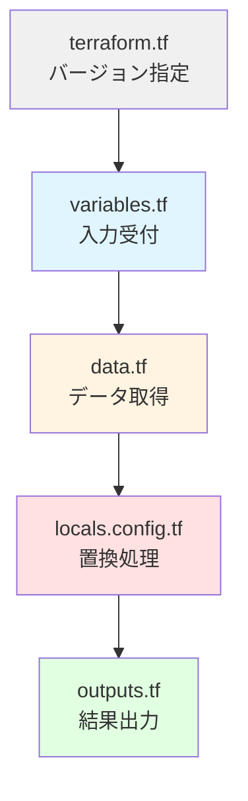
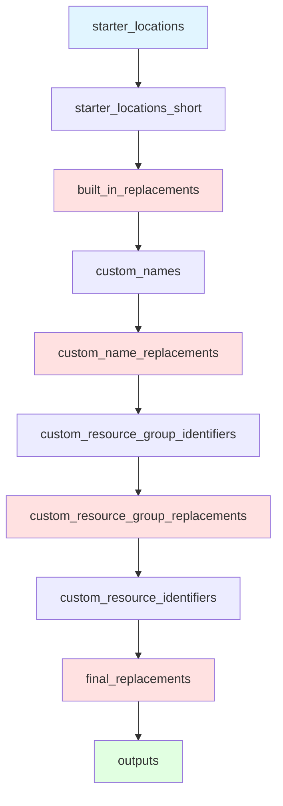
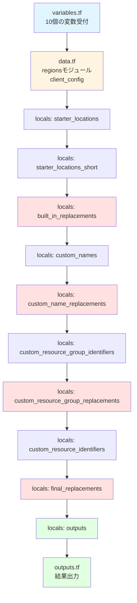

# 06. 設定テンプレート - パラメーター置換エンジン完全解説

!!! info "この章で学ぶこと"
    `modules/config-templating/`モジュールの全ファイルを完全解説します：

    1. モジュール全体の役割と仕組み
    2. terraform.tf - バージョン設定
    3. variables.tf - 入力変数の定義（全10個）
    4. data.tf - 外部データの取得
    5. locals.config.tf - 置換ロジックの全ステップ
    6. outputs.tf - 処理結果の出力
    7. 実践：カスタム変数の追加方法


---

## はじめに：テンプレートエンジンの正体

### 「穴埋めゲーム」の仕組み

このモジュールが何をしているか、超シンプルな例で理解しましょう。

=== "入力（テンプレート）"

    ```hcl title="設定ファイル"
    resource_group_name = "rg-management-$${starter_location_01}"
    ```

    `$${starter_location_01}`が「穴」です。

=== "変数"

    ```hcl title="変数の値"
    starter_locations = ["japaneast", "japanwest"]
    ```

    `starter_location_01` = "japaneast"

=== "出力（置換後）"

    ```hcl title="結果"
    resource_group_name = "rg-management-japaneast"
    ```

    穴が埋まった！

これがこのモジュールの役割です。シンプルでしょ？

### なぜテンプレート化するの？

!!! question "直接書けばいいんじゃない？"
    ```hcl title="直接書いた場合"
    primary_resource_group_name   = "rg-management-japaneast"
    secondary_resource_group_name = "rg-management-japanwest"
    ```

**問題点：**

- リージョンを変更したい時、全部書き直し
- 3リージョン、4リージョンに増やす時、大変
- コピペミスが起きやすい

**テンプレートを使うと：**
```hcl title="テンプレート方式"
resource_group_name = "rg-management-$${starter_location_01}"
# ↑ この1行だけでOK

starter_locations = ["japaneast", "japanwest", "koreacentral"]
# ↑ ここを変えるだけで全部適用される
```

楽だよね！

---

## モジュールの構造

```text title="modules/config-templating/のファイル構成"
modules/config-templating/
├── terraform.tf      ← Terraformバージョン設定
├── variables.tf      ← 入力変数の定義（10個）
├── data.tf           ← Azureから情報を取得（2つ）
├── locals.config.tf  ← 置換処理のメインロジック（75行）
└── outputs.tf        ← 処理結果を出力（2つ）
```

**処理の流れ：**



---

## Part 1: terraform.tf - バージョン設定

まずは基本設定から。

```hcl title="modules/config-templating/terraform.tf"
terraform {
  required_version = "~> 1.12"
  required_providers {
    azurerm = {
      source  = "hashicorp/azurerm"
      version = "~> 4.0"
    }
  }
}
```

**何を定義してる？**

| 項目 | 値 | 意味 |
|------|-----|------|
| `required_version` | `~> 1.12` | Terraform 1.12以上が必要 |
| `azurerm` プロバイダー | `~> 4.0` | Azure Provider 4.x系を使用 |

**`~>`の意味：**
```text
~> 1.12 = 1.12以上、2.0未満
~> 4.0  = 4.0以上、5.0未満
```

マイナーバージョンアップはOK、メジャーバージョンアップは避ける設定です。

---

## Part 2: variables.tf - 入力変数の定義

このモジュールが受け取る変数を全部見ていきます。**全10個あります。**

### 全体像

```hcl title="modules/config-templating/variables.tf（完全版：59行）"
variable "starter_locations" {
  type        = list(string)
  description = "The default for Azure resources. (e.g 'uksouth')"
}

variable "starter_locations_short" {
  type        = map(string)
  default     = {}
  description = "Optional overrides for starter location short codes. Keys should match the built-in replacement names (for example 'starter_location_01_short', 'starter_location_02_short')."
}

variable "subscription_id_connectivity" {
  type        = string
  description = "value of the subscription id for the Connectivity subscription"
}

variable "subscription_id_identity" {
  type        = string
  description = "value of the subscription id for the Identity subscription"
}

variable "subscription_id_management" {
  type        = string
  description = "value of the subscription id for the Management subscription"
}

variable "subscription_id_security" {
  type        = string
  description = "value of the subscription id for the Security subscription"
}

variable "root_parent_management_group_id" {
  type        = string
  default     = ""
  description = "This is the id of the management group that the ALZ hierarchy will be nested under, will default to the Tenant Root Group"
}

variable "custom_replacements" {
  type = object({
    names                      = optional(map(string), {})
    resource_group_identifiers = optional(map(string), {})
    resource_identifiers       = optional(map(string), {})
  })
  description = "Custom replacements"
}

variable "inputs" {
  type        = any
  description = "A map of input variables to be used in the configuration templating module."
}

variable "enable_telemetry" {
  type        = bool
  default     = true
  description = <<DESCRIPTION
This variable controls whether or not telemetry is enabled for the module.
For more information see <https://aka.ms/avm/telemetryinfo>.
If it is set to false, then no telemetry will be collected.
DESCRIPTION
  nullable    = false
}
```

### 変数1: starter_locations

```hcl
variable "starter_locations" {
  type        = list(string)
  description = "The default for Azure resources. (e.g 'uksouth')"
}
```

**役割：** メインリージョンのリスト

**具体例：**
```hcl
starter_locations = ["japaneast", "japanwest"]
```

**使われ方：**

- `starter_location_01` = "japaneast"
- `starter_location_02` = "japanwest"

に変換されます。

### 変数2: starter_locations_short

```hcl
variable "starter_locations_short" {
  type        = map(string)
  default     = {}
  description = "Optional overrides for starter location short codes."
}
```

**役割：** リージョン短縮名のカスタム上書き（オプション）

**具体例：**
```hcl
starter_locations_short = {
  "starter_location_01_short" = "je"  # japaneast → je にしたい
}
```

**デフォルト動作：**
空`{}`の場合、regionsモジュールから自動取得（`jpe`）。

### 変数3-6: サブスクリプションID（4つ）

```hcl
variable "subscription_id_connectivity" {
  type        = string
  description = "value of the subscription id for the Connectivity subscription"
}

variable "subscription_id_identity" {
  type        = string
  description = "value of the subscription id for the Identity subscription"
}

variable "subscription_id_management" {
  type        = string
  description = "value of the subscription id for the Management subscription"
}

variable "subscription_id_security" {
  type        = string
  description = "value of the subscription id for the Security subscription"
}
```

**役割：** 4つの専用サブスクリプションのID

| サブスクリプション | 用途 |
|-------------------|------|
| `connectivity` | ネットワーク関連（Hub VNetなど） |
| `identity` | ID管理（ADなど） |
| `management` | 管理リソース（Log Analyticsなど） |
| `security` | セキュリティ（Sentinel、Defenderなど） |

**具体例：**
```hcl
subscription_id_connectivity = "xxxx-xxxx-xxxx-xxxx"
subscription_id_identity     = "yyyy-yyyy-yyyy-yyyy"
subscription_id_management   = "zzzz-zzzz-zzzz-zzzz"
subscription_id_security     = "aaaa-aaaa-aaaa-aaaa"
```

これらはテンプレート内で`$${subscription_id_connectivity}`のように使えます。

### 変数7: root_parent_management_group_id

```hcl
variable "root_parent_management_group_id" {
  type        = string
  default     = ""
  description = "This is the id of the management group that the ALZ hierarchy will be nested under, will default to the Tenant Root Group"
}
```

**役割：** 管理グループの最上位親ID

**デフォルト動作：**

- 空文字`""`の場合 → テナントルートグループを使用
- 指定した場合 → その管理グループの配下に作成

**具体例：**
```hcl
# 例1: テナントルート配下に作成（デフォルト）
root_parent_management_group_id = ""

# 例2: カスタム管理グループ配下に作成
root_parent_management_group_id = "mg-my-company"
```

### 変数8: custom_replacements

```hcl
variable "custom_replacements" {
  type = object({
    names                      = optional(map(string), {})
    resource_group_identifiers = optional(map(string), {})
    resource_identifiers       = optional(map(string), {})
  })
  description = "Custom replacements"
}
```

**役割：** カスタム置換変数の定義

**3つのレベル：**

1. **names**: 基本的な名前
2. **resource_group_identifiers**: リソースグループのフルパス
3. **resource_identifiers**: 個別リソースのフルパス

**具体例：**
```hcl
custom_replacements = {
  names = {
    firewall_name = "fw-$${starter_location_01}"
    # fw-japaneast に置換される
  }
  
  resource_group_identifiers = {
    connectivity_rg_id = "/subscriptions/$${subscription_id_connectivity}/resourceGroups/$${connectivity_resource_group_name}"
  }
  
  resource_identifiers = {
    firewall_id = "$${connectivity_rg_id}/providers/Microsoft.Network/azureFirewalls/$${firewall_name}"
  }
}
```

**階層的に置換されます：**
```text
names → resource_group_identifiers → resource_identifiers
```

### 変数9: inputs

```hcl
variable "inputs" {
  type        = any
  description = "A map of input variables to be used in the configuration templating module."
}
```

**役割：** 置換対象の全設定

**具体例：**
```hcl
inputs = {
  management_groups_enabled = true
  connectivity_resource_groups = {
    vnet_primary = {
      name     = "rg-connectivity-$${starter_location_01}"
      location = "$${starter_location_01}"
    }
  }
}
```

**`any`型の意味：**

どんな構造でもOK。このモジュールはJSON化してテンプレート置換するだけなので。

### 変数10: enable_telemetry

```hcl
variable "enable_telemetry" {
  type        = bool
  default     = true
  description = <<DESCRIPTION
This variable controls whether or not telemetry is enabled for the module.
For more information see <https://aka.ms/avm/telemetryinfo>.
If it is set to false, then no telemetry will be collected.
DESCRIPTION
  nullable    = false
}
```

**役割：** テレメトリ（利用統計）の送信可否

**値：**
- `true` （デフォルト）: Microsoftに利用統計を送信
- `false`: 送信しない

**`nullable = false`の意味：**

`null`は許可しない。必ず`true`か`false`を指定。

---

## Part 3: data.tf - 外部データの取得

置換に使うデータを集めます。

```hcl title="modules/config-templating/data.tf"
module "regions" {
  source           = "Azure/avm-utl-regions/azurerm"
  version          = "0.9.2"
  use_cached_data  = false
  enable_telemetry = var.enable_telemetry
}

data "azurerm_client_config" "current" {}
```

### データソース1: regionsモジュール

```hcl
module "regions" {
  source           = "Azure/avm-utl-regions/azurerm"
  version          = "0.9.2"
  use_cached_data  = false
  enable_telemetry = var.enable_telemetry
}
```

**何してる？**  

Azureの全リージョン情報を提供するモジュール。

**取得できる情報：**
```hcl
module.regions.regions_by_name["japaneast"] = {
  name         = "japaneast"
  display_name = "Japan East"
  geo_code     = "jpe"     # 3文字の地理コード
  short_name   = "jpe"     # 短縮名
  # ...その他の情報
}
```

**パラメータ：**

- `use_cached_data = false`: キャッシュを使わず最新データを取得
- `enable_telemetry`: 変数から受け継ぐ

**使用例：**
```hcl
# japaneastの短縮コードを取得
module.regions.regions_by_name["japaneast"].geo_code
# 結果: "jpe"
```

### データソース2: azurerm_client_config

```hcl
data "azurerm_client_config" "current" {}
```

**何してる？**  
現在ログイン中のAzure環境情報を取得。

**取得される情報：**
```hcl
data.azurerm_client_config.current = {
  tenant_id       = "xxxx-xxxx-xxxx-xxxx"  # テナントID
  subscription_id = "yyyy-yyyy-yyyy-yyyy"  # サブスクリプションID
  client_id       = "zzzz-zzzz-zzzz-zzzz"  # クライアントID
  object_id       = "aaaa-aaaa-aaaa-aaaa"  # オブジェクトID
}
```

**なぜ必要？**  
`root_parent_management_group_id`が未指定の場合、テナントIDを使います。

---

## Part 4: locals.config.tf - 置換ロジックの核心

ここがこのモジュールの心臓部です。

### 全体の処理フロー



### ステップ1: starter_locationsのマップ化

```hcl title="locals.config.tf（1-3行目）"
locals {
  starter_locations = { for i, location in var.starter_locations : "starter_location_${format("%02d", i + 1)}" => location }
}
```

**何してる？**  
リストをマップに変換。

**具体例：**
```hcl
# 入力
var.starter_locations = ["japaneast", "japanwest"]

# 出力
local.starter_locations = {
  "starter_location_01" = "japaneast"
  "starter_location_02" = "japanwest"
}
```

**`format("%02d", i + 1)`の意味：**

- `i`は0始まり
- `i + 1`で1始まりに
- `%02d`で2桁ゼロ埋め（01, 02, ...）

### ステップ2: 短縮名の生成

```hcl title="locals.config.tf（4-16行目）"
  starter_locations_short = {
    for i, location in var.starter_locations :
    "starter_location_${format("%02d", i + 1)}_short" => coalesce(
      # 1. User override (if provided)
      try(var.starter_locations_short["starter_location_${format("%02d", i + 1)}_short"], null),
      # 2. Official geo_code from regions module
      try(module.regions.regions_by_name[location].geo_code, null),
      # 3. Calculated short_name from regions module
      try(module.regions.regions_by_name[location].short_name, null),
      # 4. Last resort: full region name
      location
    )
  }
```

**何してる？**  
リージョンの短縮名を作成。4段階のフォールバック。

**coalesceの仕組み：**
```hcl
coalesce(値1, 値2, 値3, 値4)
# 最初に見つかったnullでない値を返す
```

**優先順位：**

1. **ユーザー指定**：`var.starter_locations_short`にあれば使う
2. **geo_code**：regionsモジュールの公式地理コード（例: `jpe`）
3. **short_name**：regionsモジュールの短縮名
4. **リージョン名そのまま**：最後の手段

**具体例：**
```hcl
# japaneastの場合
var.starter_locations_short = {}  # 空

# 処理
try(var.starter_locations_short["starter_location_01_short"], null)  # → null（存在しない）
try(module.regions.regions_by_name["japaneast"].geo_code, null)      # → "jpe" ←採用！
# 以降はスキップ

# 結果
starter_location_01_short = "jpe"
```

**なぜ`try()`を使う？**  
存在しないキーにアクセスするとエラーになるので、`try()`で`null`に変換。

### ステップ3: built_in_replacementsの作成

```hcl title="locals.config.tf（17-27行目）"
  built_in_replacements = merge(
    local.starter_locations,
    local.starter_locations_short,
    {
      root_parent_management_group_id = var.root_parent_management_group_id == "" ? data.azurerm_client_config.current.tenant_id : var.root_parent_management_group_id
      subscription_id_connectivity    = var.subscription_id_connectivity
      subscription_id_identity        = var.subscription_id_identity
      subscription_id_management      = var.subscription_id_management
      subscription_id_security        = var.subscription_id_security
  })
}
```

**何してる？**  
組み込み変数をすべて1つのマップに統合。

**merge()の動作：**
```hcl
merge(マップ1, マップ2, マップ3)
# すべてのキーを1つのマップに結合
```

**結果の中身：**
```hcl
local.built_in_replacements = {
  # リージョン
  "starter_location_01"       = "japaneast"
  "starter_location_02"       = "japanwest"
  
  # 短縮名
  "starter_location_01_short" = "jpe"
  "starter_location_02_short" = "jpw"
  
  # 管理グループ
  "root_parent_management_group_id" = "テナントIDまたは指定値"
  
  # サブスクリプションID
  "subscription_id_connectivity" = "xxxx-xxxx"
  "subscription_id_identity"     = "yyyy-yyyy"
  "subscription_id_management"   = "zzzz-zzzz"
  "subscription_id_security"     = "aaaa-aaaa"
}
```

**三項演算子の処理：**
```hcl
var.root_parent_management_group_id == "" 
  ? data.azurerm_client_config.current.tenant_id 
  : var.root_parent_management_group_id
```

- 空文字 → テナントIDを使用
- 値あり → その値を使用

### ステップ4: custom_namesの処理

```hcl title="locals.config.tf（29-34行目）"
# Custom name replacements
locals {
  custom_names_json           = replace(replace(tostring(jsonencode(var.custom_replacements.names)), "\"true\"", "{{string_true}}"), "\"false\"", "{{string_false}}")
  custom_names_json_templated = templatestring(local.custom_names_json, local.built_in_replacements)
  custom_names_json_final     = replace(replace(replace(replace(local.custom_names_json_templated, "\"true\"", "true"), "\"false\"", "false"), "{{string_true}}", "\"true\""), "{{string_false}}", "\"false\"")
  custom_names                = jsondecode(local.custom_names_json_final)
}
```

**何してる？**  
カスタム名にテンプレート置換を適用。

**なぜ複雑？**  
`templatestring()`関数が`true`/`false`を文字列として扱ってしまうため、特殊処理が必要。

**処理ステップ：**

1. **JSON化**: `jsonencode()` → オブジェクトをJSON文字列に
2. **ブール値保護**: `"true"` → `"{{string_true}}"`
3. **テンプレート置換**: `templatestring()` → `$${xxx}`を置換
4. **ブール値復元**: `"{{string_true}}"` → `"true"`
5. **JSON解析**: `jsondecode()` → 文字列をオブジェクトに戻す

**具体例：**

```hcl title="入力"
var.custom_replacements.names = {
  firewall_enabled = true
  firewall_name = "fw-$${starter_location_01}"
}
```

```hcl title="処理過程"
# 1. JSON化
'{"firewall_enabled":"true","firewall_name":"fw-$${starter_location_01}"}'

# 2. ブール値保護
'{"firewall_enabled":"{{string_true}}","firewall_name":"fw-$${starter_location_01}"}'

# 3. テンプレート置換
'{"firewall_enabled":"{{string_true}}","firewall_name":"fw-japaneast"}'

# 4. ブール値復元
'{"firewall_enabled":"true","firewall_name":"fw-japaneast"}'

# 5. JSON解析
{
  firewall_enabled = true
  firewall_name = "fw-japaneast"
}
```

### ステップ5: custom_name_replacementsの作成

```hcl title="locals.config.tf（36-38行目）"
locals {
  custom_name_replacements = merge(local.built_in_replacements, local.custom_names)
}
```

**何してる？**  
組み込み変数とカスタム名を統合。

**結果：**
```hcl
{
  # built_in_replacements
  "starter_location_01" = "japaneast"
  "subscription_id_connectivity" = "xxxx-xxxx"
  # ...
  
  # custom_names
  "firewall_enabled" = true
  "firewall_name" = "fw-japaneast"
}
```

この時点で`$${firewall_name}`も使えるようになります。

### ステップ6: custom_resource_group_identifiersの処理

```hcl title="locals.config.tf（40-45行目）"
# Custom resource group identifiers
locals {
  custom_resource_group_identifiers_json           = replace(replace(tostring(jsonencode(var.custom_replacements.resource_group_identifiers)), "\"true\"", "{{string_true}}"), "\"false\"", "{{string_false}}")
  custom_resource_group_identifiers_json_templated = templatestring(local.custom_resource_group_identifiers_json, local.custom_name_replacements)
  custom_resource_group_identifiers_json_final     = replace(replace(replace(replace(local.custom_resource_group_identifiers_json_templated, "\"true\"", "true"), "\"false\"", "false"), "{{string_true}}", "\"true\""), "{{string_false}}", "\"false\"")
  custom_resource_group_identifiers                = jsondecode(local.custom_resource_group_identifiers_json_final)
}
```

**何してる？**  
リソースグループのフルパスを生成。

**ステップ4と同じパターン：**

JSON化 → ブール値保護 → テンプレート置換 → ブール値復元 → JSON解析

**具体例：**
```hcl title="入力"
var.custom_replacements.resource_group_identifiers = {
  connectivity_rg_id = "/subscriptions/$${subscription_id_connectivity}/resourceGroups/$${connectivity_resource_group_name}"
}
```

```hcl title="出力"
{
  connectivity_rg_id = "/subscriptions/xxxx-xxxx/resourceGroups/rg-connectivity-japaneast"
}
```

**前のステップで作った変数を使える：**

- `$${subscription_id_connectivity}` ← built_in_replacements
- `$${connectivity_resource_group_name}` ← custom_names

### ステップ7: custom_resource_group_replacementsの作成

```hcl title="locals.config.tf（47-49行目）"
locals {
  custom_resource_group_replacements = merge(local.custom_name_replacements, local.custom_resource_group_identifiers)
}
```

**何してる？**  
カスタム名とRGパスを統合。

**結果：**
```hcl
{
  # custom_name_replacements
  "firewall_name" = "fw-japaneast"
  # ...
  
  # custom_resource_group_identifiers
  "connectivity_rg_id" = "/subscriptions/xxxx/resourceGroups/rg-connectivity-japaneast"
}
```

### ステップ8: custom_resource_identifiersの処理

```hcl title="locals.config.tf（51-56行目）"
# Custom resource identifiers
locals {
  custom_resource_identifiers_json           = replace(replace(tostring(jsonencode(var.custom_replacements.resource_identifiers)), "\"true\"", "{{string_true}}"), "\"false\"", "{{string_false}}")
  custom_resource_identifiers_json_templated = templatestring(local.custom_resource_identifiers_json, local.custom_resource_group_replacements)
  custom_resource_identifiers_json_final     = replace(replace(replace(replace(local.custom_resource_identifiers_json_templated, "\"true\"", "true"), "\"false\"", "false"), "{{string_true}}", "\"true\""), "{{string_false}}", "\"false\"")
  custom_resource_identifiers                = jsondecode(local.custom_resource_identifiers_json_final)
}
```

**何してる？**  
個別リソースのフルパスを生成。

**具体例：**
```hcl title="入力"
var.custom_replacements.resource_identifiers = {
  firewall_id = "$${connectivity_rg_id}/providers/Microsoft.Network/azureFirewalls/$${firewall_name}"
}
```

```hcl title="出力"
{
  firewall_id = "/subscriptions/xxxx/resourceGroups/rg-connectivity-japaneast/providers/Microsoft.Network/azureFirewalls/fw-japaneast"
}
```

**前のステップで作った変数を使える：**

- `$${connectivity_rg_id}` ← custom_resource_group_identifiers
- `$${firewall_name}` ← custom_names

### ステップ9: final_replacementsの作成

```hcl title="locals.config.tf（58-60行目）"
locals {
  final_replacements = merge(local.custom_resource_group_replacements, local.custom_resource_identifiers)
}
```

**何してる？**  
すべての置換変数を1つのマップに統合。

**最終的な内容：**
```hcl
{
  # built_in_replacements
  "starter_location_01" = "japaneast"
  "subscription_id_connectivity" = "xxxx-xxxx"
  
  # custom_names
  "firewall_name" = "fw-japaneast"
  
  # resource_group_identifiers
  "connectivity_rg_id" = "/subscriptions/xxxx/resourceGroups/..."
  
  # resource_identifiers
  "firewall_id" = "/subscriptions/xxxx/resourceGroups/.../providers/..."
}
```

**階層構造の完成：**
```text
組み込み変数
  ↓
カスタム名（組み込みを参照可能）
  ↓
RGパス（カスタム名を参照可能）
  ↓
リソースパス（RGパスを参照可能）
```

### ステップ10: outputsの生成

```hcl title="locals.config.tf（62-67行目）"
locals {
  outputs_json           = { for key, value in var.inputs : key => replace(replace(tostring(jsonencode(value)), "\"true\"", "{{string_true}}"), "\"false\"", "{{string_false}}") }
  outputs_json_templated = { for key, value in local.outputs_json : key => templatestring(value, local.final_replacements) }
  outputs_json_final     = { for key, value in local.outputs_json_templated : key => replace(replace(replace(replace(value, "\"true\"", "true"), "\"false\"", "false"), "{{string_true}}", "\"true\""), "{{string_false}}", "\"false\"") }
  outputs                = { for key, value in local.outputs_json_final : key => jsondecode(value) }
}
```

**何してる？**  
すべての入力設定に対してテンプレート置換を実行。

**for式の構造：**
```hcl
{ for key, value in var.inputs : key => 処理(value) }
```

各設定に対して同じ処理（JSON化 → ブール値保護 → 置換 → ブール値復元 → JSON解析）を実行。

**具体例：**
```hcl title="入力"
var.inputs = {
  connectivity_resource_groups = {
    vnet_primary = {
      name     = "rg-connectivity-$${starter_location_01}"
      location = "$${starter_location_01}"
    }
  }
}
```

```hcl title="出力"
local.outputs = {
  connectivity_resource_groups = {
    vnet_primary = {
      name     = "rg-connectivity-japaneast"
      location = "japaneast"
    }
  }
}
```

---

## Part 5: outputs.tf - 処理結果の出力

最後に、処理済みの設定を出力します。

```hcl title="modules/config-templating/outputs.tf（完全版：6行）"
output "custom_replacements" {
  value = local.final_replacements
}

output "outputs" {
  value = local.outputs
}
```

### output 1: custom_replacements

```hcl
output "custom_replacements" {
  value = local.final_replacements
}
```

**何を出力？**  
すべての置換変数のマップ。

**具体例：**
```hcl
{
  "starter_location_01"            = "japaneast"
  "starter_location_01_short"      = "jpe"
  "subscription_id_connectivity"   = "xxxx-xxxx"
  "firewall_name"                  = "fw-japaneast"
  "connectivity_rg_id"             = "/subscriptions/xxxx/..."
  "firewall_id"                    = "/subscriptions/xxxx/.../providers/..."
}
```

**用途：**

- デバッグ：どんな変数が使えるか確認
- 他モジュールへの引き継ぎ

### output 2: outputs

```hcl
output "outputs" {
  value = local.outputs
}
```

**何を出力？**  
置換済みの全設定。

**具体例：**
```hcl
{
  management_groups_enabled = true
  connectivity_resource_groups = {
    vnet_primary = {
      name     = "rg-connectivity-japaneast"
      location = "japaneast"
    }
  }
  hub_virtual_networks = {
    primary = {
      name                = "vnet-hub-japaneast"
      resource_group_name = "rg-connectivity-japaneast"
      # ...
    }
  }
}
```

**用途：**
メインモジュールで使用する最終設定。

---

## Part 6: 実践 - カスタム変数の追加

実際にテンプレート変数を追加してみましょう。

### シナリオ: 環境名を追加したい

**要件：**

- `dev`, `stg`, `prod`のような環境名をリソース名に含めたい
- 例: `rg-connectivity-dev-japaneast`

### 手順1: custom_replacementsに環境名を追加

```hcl title="platform-landing-zone.auto.tfvars"
custom_replacements = {
  names = {
    # 環境名を定義
    environment = "dev"
    
    # この環境名を使って名前を定義
    connectivity_resource_group_name = "rg-connectivity-$${environment}-$${starter_location_01}"
    hub_vnet_name = "vnet-hub-$${environment}-$${starter_location_01}"
  }
}
```

### 手順2: 他の設定で使用

```hcl title="platform-landing-zone.auto.tfvars"
connectivity_resource_groups = {
  vnet_primary = {
    name     = "$${connectivity_resource_group_name}"
    location = "$${starter_location_01}"
  }
}

hub_virtual_networks = {
  primary = {
    name                = "$${hub_vnet_name}"
    resource_group_name = "$${connectivity_resource_group_name}"
    location            = "$${starter_location_01}"
    # ...
  }
}
```

### 手順3: デプロイ

```bash
terraform plan
```

**期待される結果：**
```text
+ resource_group "vnet_primary" {
    name     = "rg-connectivity-dev-japaneast"
    location = "japaneast"
  }

+ virtual_network "primary" {
    name                = "vnet-hub-dev-japaneast"
    resource_group_name = "rg-connectivity-dev-japaneast"
  }
```

環境名が含まれたリソースが作成されます！

### 手順4: 環境の切り替え

```hcl title="stg環境に切り替え"
custom_replacements = {
  names = {
    environment = "stg"  # devからstgに変更
    # 以下同じ
    connectivity_resource_group_name = "rg-connectivity-$${environment}-$${starter_location_01}"
    hub_vnet_name = "vnet-hub-$${environment}-$${starter_location_01}"
  }
}
```

**結果：**
```text
rg-connectivity-stg-japaneast
vnet-hub-stg-japaneast
```

この1箇所を変えるだけで、すべてのリソース名が切り替わります！

---

## まとめ

### このモジュールの全体像

!!! success "config-templatingモジュールの役割"
    **5つのファイルで構成：**
    
    1. **terraform.tf**: Terraform 1.12以上、azurerm 4.x以上を要求
    2. **variables.tf**: 10個の入力変数を定義
    3. **data.tf**: regionsモジュールとclient_configでデータ取得
    4. **locals.config.tf**: 10ステップの置換処理
    5. **outputs.tf**: 置換変数と置換済み設定を出力

### 処理の流れ（完全版）



### 重要なポイント

| ポイント | 説明 |
|---------|------|
| **段階的処理** | 10ステップで徐々に変数を増やす |
| **ブール値保護** | JSON処理でtrue/falseを保護 |
| **階層的置換** | 後の段階で前の変数を参照可能 |
| **coalesceのフォールバック** | 4段階の優先順位で短縮名を決定 |
| **for式の活用** | すべての設定に一括処理 |


---

## 次のステップ

config-templatingモジュールの全ファイルを完全解説しました！

次は[07_リソースグループ.md](./07_リソースグループ.md)に進んで、  
`main.resource.groups.tf`でリソースグループがどう作られるか学びましょう。

**所要時間**: 60分  
**難易度**: ★★★★★  
**次**: [07_リソースグループ.md](./07_リソースグループ.md)
