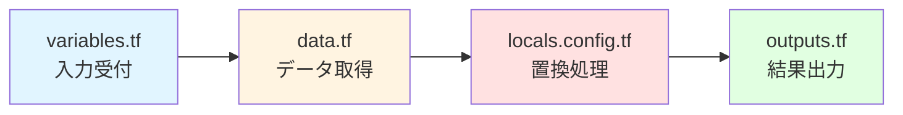
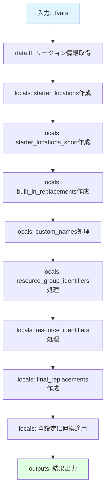

# 06. 設定テンプレート - 魔法の置換エンジン

!!! info "この章で学ぶこと"
    `modules/config-templating/`モジュールの全貌を理解します：

    1. テンプレートエンジンって何してるの？
    2. data.tfで取得するデータ
    3. locals.config.tfの置換ロジック
    4. outputs.tfの出力内容
    5. 実践：テンプレート変数の追加方法

    このモジュールが分かれば、設定ファイルの`$${xxx}`がどう処理されるか完全に理解できます。

---

## テンプレートエンジンの正体

### 「穴埋めゲーム」の仕組み

まず、このモジュールが何をしているか、超シンプルな例で理解しましょう。

=== "入力"

    ```hcl title="設定ファイル（テンプレート）"
    resource_group_name = "rg-management-$${starter_location_01}"
    ```

    `$${starter_location_01}`が「穴」です。

=== "変数"

    ```hcl title="変数の値"
    starter_locations = ["japaneast", "japanwest"]
    ```

    `starter_location_01` = "japaneast"

=== "出力"

    ```hcl title="置換後"
    resource_group_name = "rg-management-japaneast"
    ```

    穴が埋まった！

これがこのモジュールの役割です。シンプルでしょ？

### なぜテンプレート化するの？

!!! question "直接書けばいいんじゃない？"
    ```hcl title="直接書いた場合"
    primary_resource_group_name   = "rg-management-japaneast"
    secondary_resource_group_name = "rg-management-japanwest"
    ```

    これでもいいんですが...

**問題点：**
- リージョンを変更したい時、全部書き直し
- 3リージョン、4リージョンに増やす時、大変
- コピペミスが起きやすい

**テンプレートを使うと：**
```hcl title="テンプレート方式"
resource_group_name = "rg-management-$${starter_location_01}"
# ↑ この1行だけでOK

starter_locations = ["japaneast", "japanwest", "koreacentral"]
# ↑ ここを変えるだけで全部適用される
```

楽だよね！

---

## モジュールの構造

```text title="modules/config-templating/のファイル"
modules/config-templating/
├── data.tf           ← Azureから情報を取得
├── locals.config.tf  ← 置換処理のメインロジック
├── outputs.tf        ← 処理結果を出力
├── terraform.tf      ← Terraformバージョン設定
└── variables.tf      ← 入力変数の定義
```

**処理の流れ：**



1. **variables.tf**: 設定を受け取る窓口
2. **data.tf**: Azureリージョン情報などを取得
3. **locals.config.tf**: テンプレート置換の実行
4. **outputs.tf**: 処理済みの設定を返す

---

## Part 1: data.tf - 外部データの取得

まずは、置換に使うデータを集めます。

### 実際のファイル

```hcl title="modules/config-templating/data.tf（完全版）"
module "regions" {
  source           = "Azure/avm-utl-regions/azurerm"
  version          = "0.9.2"
  use_cached_data  = false
  enable_telemetry = var.enable_telemetry
}

data "azurerm_client_config" "current" {}
```

たった8行！シンプルでしょ？

### regionsモジュールって何？

```hcl
module "regions" {
  source  = "Azure/avm-utl-regions/azurerm"
  version = "0.9.2"
  # ...
}
```

**これは何してる？**  
Azureの全リージョンの情報を提供してくれるモジュールです。

**取得できる情報：**
- `geo_code`: 短縮コード（例: `jpe` = Japan East）
- `short_name`: 短い名前（例: `japaneast` → `jpe`）
- `display_name`: 表示名（例: `Japan East`）

**使用例：**
```hcl title="リージョン情報の取得"
module.regions.regions_by_name["japaneast"].geo_code
# 結果: "jpe"

module.regions.regions_by_name["japanwest"].short_name
# 結果: "jpw"
```

### azurerm_client_configって何？

```hcl
data "azurerm_client_config" "current" {}
```

**これは何してる？**  
現在ログインしているAzure環境の情報を取得します。

**取得できる情報：**
```hcl title="取得される値"
data.azurerm_client_config.current.tenant_id         # テナントID
data.azurerm_client_config.current.subscription_id   # サブスクリプションID
data.azurerm_client_config.current.client_id         # クライアントID
```

**なぜ必要？**  
管理グループの親IDに使います。デフォルトでテナントルートを親にする場合：

```hcl
root_parent_management_group_id = data.azurerm_client_config.current.tenant_id
```

---

## Part 2: locals.config.tf - 置換ロジックの核心

ここがこのモジュールの心臓部です。段階的に処理が進みます。

### ステップ1: リージョンマッピングの作成

```hcl title="starter_locationsの変換"
locals {
  starter_locations = { 
    for i, location in var.starter_locations : 
    "starter_location_${format("%02d", i + 1)}" => location 
  }
}
```

**何をしてる？**  
リストをマップに変換しています。

**具体例：**
```hcl title="入力"
starter_locations = ["japaneast", "japanwest"]
```

```hcl title="出力"
{
  "starter_location_01" = "japaneast"
  "starter_location_02" = "japanwest"
}
```

**なぜこうするの？**  
テンプレート内で`$${starter_location_01}`って書けるようにするためです。

### ステップ2: 短縮名の生成

```hcl title="starter_locations_shortの生成"
locals {
  starter_locations_short = {
    for i, location in var.starter_locations :
    "starter_location_${format("%02d", i + 1)}_short" => coalesce(
      # 1. ユーザー指定の値（もしあれば）
      try(var.starter_locations_short["starter_location_${format("%02d", i + 1)}_short"], null),
      # 2. regionsモジュールのgeo_code
      try(module.regions.regions_by_name[location].geo_code, null),
      # 3. regionsモジュールのshort_name
      try(module.regions.regions_by_name[location].short_name, null),
      # 4. 最後の手段: リージョン名そのまま
      location
    )
  }
}
```

**何してる？**  
リージョンの短縮名を作っています。

**coalesceの仕組み：**
```hcl title="優先順位で取得"
coalesce(値1, 値2, 値3, 値4)
# 最初に見つかったnullでない値を返す
```

**具体例：**
```hcl title="japaneastの場合"
# 1. ユーザー指定なし → null
# 2. geo_code → "jpe" ← これが採用される！
# 3. short_name（使われない）
# 4. "japaneast"（使われない）

結果: "jpe"
```

**なぜこうする？**  
リソース名を短くするためです：
```hcl
"rg-management-japaneast"  # 長い
"rg-management-jpe"        # 短い！
```

### ステップ3: 組み込み置換マップの作成

```hcl title="built_in_replacementsの作成"
locals {
  built_in_replacements = merge(
    local.starter_locations,
    local.starter_locations_short,
    {
      root_parent_management_group_id = var.root_parent_management_group_id == "" ? data.azurerm_client_config.current.tenant_id : var.root_parent_management_group_id
      subscription_id_connectivity    = var.subscription_id_connectivity
      subscription_id_identity        = var.subscription_id_identity
      subscription_id_management      = var.subscription_id_management
      subscription_id_security        = var.subscription_id_security
  })
}
```

**何してる？**  
すべての組み込み変数をまとめています。

**中身を見てみると：**
```hcl title="built_in_replacementsの内容"
{
  # リージョン
  "starter_location_01"       = "japaneast"
  "starter_location_02"       = "japanwest"
  
  # 短縮名
  "starter_location_01_short" = "jpe"
  "starter_location_02_short" = "jpw"
  
  # 管理グループ
  "root_parent_management_group_id" = "xxxx-xxxx-xxxx-xxxx"
  
  # サブスクリプションID
  "subscription_id_connectivity" = "yyyy-yyyy-yyyy-yyyy"
  "subscription_id_identity"     = "zzzz-zzzz-zzzz-zzzz"
  # ...
}
```

これで基本的な置換が可能になりました！

### ステップ4: カスタム名の処理

```hcl title="custom_namesの処理"
locals {
  custom_names_json           = replace(replace(tostring(jsonencode(var.custom_replacements.names)), "\"true\"", "{{string_true}}"), "\"false\"", "{{string_false}}")
  custom_names_json_templated = templatestring(local.custom_names_json, local.built_in_replacements)
  custom_names_json_final     = replace(replace(replace(replace(local.custom_names_json_templated, "\"true\"", "true"), "\"false\"", "false"), "{{string_true}}", "\"true\""), "{{string_false}}", "\"false\"")
  custom_names                = jsondecode(local.custom_names_json_final)
}
```

**何してる？**  
カスタム名（ユーザー定義の名前）にテンプレート置換を適用しています。

**なぜこんなに複雑？**  
`true`/`false`のブール値を文字列として扱うための回避策です。

**処理の流れ：**

1. **JSON化**: オブジェクトをJSON文字列に変換
2. **ブール値を一時保護**: `"true"` → `"{{string_true}}"`
3. **テンプレート置換**: `$${xxx}`を実際の値に置換
4. **ブール値を復元**: `"{{string_true}}"` → `"true"`
5. **JSON解析**: 文字列を再びオブジェクトに戻す

**具体例：**
```hcl title="入力"
custom_replacements = {
  names = {
    firewall_enabled = true
    firewall_name = "fw-$${starter_location_01}"
  }
}
```

```hcl title="出力"
{
  firewall_enabled = true
  firewall_name = "fw-japaneast"
}
```

### ステップ5: リソースグループ識別子の処理

```hcl title="custom_resource_group_identifiersの処理"
locals {
  custom_resource_group_identifiers_json           = replace(replace(tostring(jsonencode(var.custom_replacements.resource_group_identifiers)), "\"true\"", "{{string_true}}"), "\"false\"", "{{string_false}}")
  custom_resource_group_identifiers_json_templated = templatestring(local.custom_resource_group_identifiers_json, local.custom_name_replacements)
  custom_resource_group_identifiers_json_final     = replace(replace(replace(replace(local.custom_resource_group_identifiers_json_templated, "\"true\"", "true"), "\"false\"", "false"), "{{string_true}}", "\"true\""), "{{string_false}}", "\"false\"")
  custom_resource_group_identifiers                = jsondecode(local.custom_resource_group_identifiers_json_final)
}
```

**何してる？**  
リソースグループの完全パス（Resource ID）を生成しています。

**具体例：**
```hcl title="入力"
resource_group_identifiers = {
  management_resource_group_id = "/subscriptions/$${subscription_id_management}/resourcegroups/$${management_resource_group_name}"
}
```

```hcl title="出力"
management_resource_group_id = "/subscriptions/xxxx-xxxx/resourcegroups/rg-management-japaneast"
```

### ステップ6: リソース識別子の処理

```hcl title="custom_resource_identifiersの処理"
locals {
  custom_resource_identifiers_json           = replace(replace(tostring(jsonencode(var.custom_replacements.resource_identifiers)), "\"true\"", "{{string_true}}"), "\"false\"", "{{string_false}}")
  custom_resource_identifiers_json_templated = templatestring(local.custom_resource_identifiers_json, local.custom_resource_group_replacements)
  custom_resource_identifiers_json_final     = replace(replace(replace(replace(local.custom_resource_identifiers_json_templated, "\"true\"", "true"), "\"false\"", "false"), "{{string_true}}", "\"true\""), "{{string_false}}", "\"false\"")
  custom_resource_identifiers                = jsondecode(local.custom_resource_identifiers_json_final)
}
```

**何してる？**  
個別リソースの完全パス（Resource ID）を生成しています。

**具体例：**
```hcl title="入力"
resource_identifiers = {
  log_analytics_workspace_id = "$${management_resource_group_id}/providers/Microsoft.OperationalInsights/workspaces/$${log_analytics_workspace_name}"
}
```

```hcl title="出力"
log_analytics_workspace_id = "/subscriptions/xxxx/resourcegroups/rg-management-japaneast/providers/Microsoft.OperationalInsights/workspaces/law-management-japaneast"
```

### ステップ7: 最終置換マップの作成

```hcl title="final_replacementsの作成"
locals {
  final_replacements = merge(local.custom_resource_group_replacements, local.custom_resource_identifiers)
}
```

**何してる？**  
すべての置換変数を1つのマップに統合しています。

**階層構造：**
```text
built_in_replacements (組み込み)
  ↓
custom_name_replacements (+ カスタム名)
  ↓
custom_resource_group_replacements (+ RGパス)
  ↓
final_replacements (+ リソースパス)
```

### ステップ8: 全設定の置換

```hcl title="outputsの生成"
locals {
  outputs_json           = { for key, value in var.inputs : key => replace(replace(tostring(jsonencode(value)), "\"true\"", "{{string_true}}"), "\"false\"", "{{string_false}}") }
  outputs_json_templated = { for key, value in local.outputs_json : key => templatestring(value, local.final_replacements) }
  outputs_json_final     = { for key, value in local.outputs_json_templated : key => replace(replace(replace(replace(value, "\"true\"", "true"), "\"false\"", "false"), "{{string_true}}", "\"true\""), "{{string_false}}", "\"false\"") }
  outputs                = { for key, value in local.outputs_json_final : key => jsondecode(value) }
}
```

**何してる？**  
すべての入力設定に対してテンプレート置換を実行しています。

**処理対象：**
- `management_groups_enabled`
- `connectivity_resource_groups`
- `hub_virtual_networks`
- その他すべての設定

---

## Part 3: outputs.tf - 処理結果の出力

最後に、処理済みの設定を出力します。

```hcl title="modules/config-templating/outputs.tf（完全版）"
output "custom_replacements" {
  value = local.final_replacements
}

output "outputs" {
  value = local.outputs
}
```

**2つの出力：**

### 1. custom_replacements
```hcl title="置換変数のマップ"
{
  "starter_location_01" = "japaneast"
  "firewall_name" = "fw-japaneast"
  "management_resource_group_id" = "/subscriptions/xxxx/..."
  # ... すべての置換変数
}
```

**用途：** デバッグや確認用

### 2. outputs
```hcl title="置換済みの全設定"
{
  management_groups_enabled = true
  connectivity_resource_groups = {
    vnet_primary = {
      name = "rg-hub-japaneast"
      location = "japaneast"
    }
  }
  # ... すべての設定
}
```

**用途：** メインの設定として使用

---

## Part 4: 実践 - テンプレート変数の追加

実際にテンプレート変数を追加してみましょう。

### シナリオ: 環境名を追加したい

**要件：**
- `dev`, `stg`, `prod`のような環境名をリソース名に含めたい
- 例: `rg-management-dev-japaneast`

### 手順1: 変数の追加

```hcl title="platform-landing-zone.auto.tfvars"
custom_replacements = {
  names = {
    environment = "dev"
    
    # この環境名を使って名前を定義
    management_resource_group_name = "rg-management-$${environment}-$${starter_location_01}"
  }
}
```

### 手順2: 確認

```bash
terraform plan
```

**期待される結果：**
```text
resource_group_name: "rg-management-dev-japaneast"
```

### 手順3: デプロイ

```bash
terraform apply
```

これで環境名が含まれたリソースが作成されます！

---

## まとめ

### このモジュールの役割

!!! success "config-templatingモジュールがやっていること"
    1. **データ収集**: Azureリージョン情報などを取得
    2. **変数作成**: リージョンマッピング、短縮名の生成
    3. **段階的置換**: 組み込み → カスタム名 → RGパス → リソースパス
    4. **全設定処理**: すべての設定ファイルに置換を適用
    5. **結果出力**: 置換済み設定を返す

### 処理の流れ（再掲）



### 重要なポイント

| ポイント | 説明 |
|---------|------|
| **段階的処理** | 組み込み → カスタムの順で処理 |
| **ブール値保護** | `true`/`false`を特殊文字列で保護 |
| **階層的置換** | 後の段階で前の段階の変数を使える |
| **全自動** | 一度設定すれば、あとは自動で置換 |

---

## 練習問題

### 問題1
`$${starter_location_01}`が`japaneast`に置換される仕組みを説明してください。

### 問題2
なぜ`custom_names`の処理で`true`/`false`を保護しているのですか？

### 問題3
新しいテンプレート変数`company_name`を追加して、リソース名に含めてください。

---

## 練習問題の答え

### 答え1
`locals.config.tf`で次の処理が行われます：

1. `starter_locations = ["japaneast", ...]`がマップに変換される
2. `{ "starter_location_01" = "japaneast" }`が作成される
3. `built_in_replacements`にマージされる
4. `templatestring()`関数で`$${starter_location_01}`が`japaneast`に置換される

### 答え2
Terraformの`templatestring()`関数は、文字列内の`true`/`false`をブール値として解釈してしまいます。これを防ぐため、一時的に`{{string_true}}`のような特殊文字列に置き換えてから、後で元に戻しています。

### 答え3
```hcl title="platform-landing-zone.auto.tfvars"
custom_replacements = {
  names = {
    company_name = "mycompany"
    management_resource_group_name = "rg-$${company_name}-management-$${starter_location_01}"
  }
}
```

結果: `rg-mycompany-management-japaneast`

---

## 次のステップ

config-templatingモジュールの仕組みが理解できましたか？

次は[07_リソースグループ.md](./07_リソースグループ.md)に進んで、  
`main.resource.groups.tf`でリソースグループがどう作られるか学びましょう。

**所要時間**: 30分  
**難易度**: ★★★★☆  
**次**: [07_リソースグループ.md](./07_リソースグループ.md)
