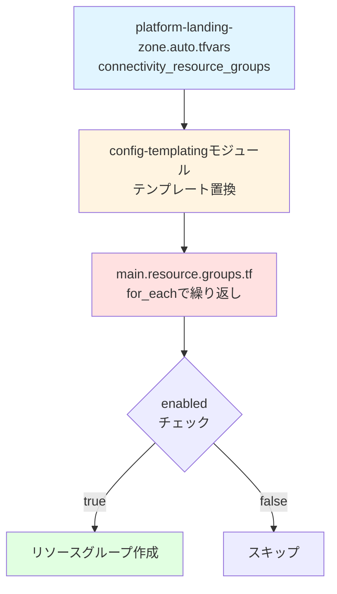

# 07. リソースグループ - 最初のリソース作成

!!! info "この章で学ぶこと"
    `main.resource.groups.tf`でリソースグループを作成する仕組みを学びます：

    1. リソースグループって何？
    2. main.resource.groups.tfの詳細解説
    3. for_eachの仕組みとフィルタリング
    4. try()関数の使い方
    5. 実践：新しいリソースグループの追加方法

---

## はじめに：リソースグループって何？

### リソースの「入れ物」

Azureでは、すべてのリソース（仮想マシン、ネットワーク、データベースなど）は必ず「リソースグループ」に入れる必要があります。

=== "リアル世界の例"

    ```text title="家の中の収納"
    家（サブスクリプション）
    ├── リビング（リソースグループ1）
    │   ├── テレビ
    │   ├── ソファ
    │   └── テーブル
    ├── キッチン（リソースグループ2）
    │   ├── 冷蔵庫
    │   ├── 電子レンジ
    │   └── 食器棚
    └── 寝室（リソースグループ3）
        ├── ベッド
        └── クローゼット
    ```

    部屋ごとに物をまとめると管理しやすい！

=== "Azureの構造"

    ```text title="Azure Landing Zones"
    Subscription（サブスクリプション）
    ├── rg-connectivity-japaneast（RG）
    │   ├── vnet-hub-japaneast
    │   ├── firewall-hub-japaneast
    │   └── bastion-hub-japaneast
    ├── rg-management-japaneast（RG）
    │   ├── log-analytics-workspace
    │   └── automation-account
    └── rg-identity-japaneast（RG）
        └── （将来のIDリソース）
    ```

    用途ごとにリソースグループを分けて管理！

### なぜリソースグループが必要？

**メリット：**

- **まとめて操作**: リソースグループ単位で削除、移動、権限設定
- **管理しやすい**: 関連するリソースを1箇所にまとめる
- **コスト管理**: リソースグループ単位でコスト集計
- **ライフサイクル管理**: 開発環境は週末に削除、など

**具体例：**
```bash
# リソースグループごと削除
az group delete --name rg-connectivity-japaneast
# ↑ 中のリソース全部が消える
```

---

## Part 1: main.resource.groups.tf の全体像

このファイルでリソースグループを作成します。

```hcl title="main.resource.groups.tf"
module "resource_groups" {
  source  = "Azure/avm-res-resources-resourcegroup/azurerm"
  version = "0.2.1"

  for_each = { for key, value in module.config.outputs.connectivity_resource_groups : key => value if try(value.settings.enabled, true) }

  name             = each.value.name
  location         = each.value.location
  enable_telemetry = var.enable_telemetry
  tags             = try(each.value.tags, null) == null ? module.config.outputs.tags : each.value.tags

  providers = {
    azurerm = azurerm.connectivity
  }
}
```

**たった15行！** でも色々なことをやっています。

---

## Part 2: コードを詳しく見ていく

### 2-1: モジュールの基本設定

```hcl
module "resource_groups" {
  source  = "Azure/avm-res-resources-resourcegroup/azurerm"
  version = "0.2.1"
```

**何してる？**

AzureのVerified Module（公式モジュール）を使ってリソースグループを作成。

**source の意味：**
```text
Azure/avm-res-resources-resourcegroup/azurerm
  │     │                                │
  │     │                                └─ Azureプロバイダー
  │     └─ モジュール名
  └─ Terraform Registry上の組織名
```

**version = "0.2.1":**

特定バージョンを指定して、予期しない変更を防ぐ。

### 2-2: for_each - 複数のリソースグループを作成

```hcl
  for_each = { for key, value in module.config.outputs.connectivity_resource_groups : key => value if try(value.settings.enabled, true) }
```

**何してる？**

`connectivity_resource_groups`の設定から、有効なものだけを取り出して、それぞれにリソースグループを作成。

**for_eachの基本：**

```hcl title="for_eachの構文"
for_each = {
  "キー1" = { 設定1 }
  "キー2" = { 設定2 }
}
# → それぞれに対してリソースを作成
```

**for式の構文：**

```hcl
{ for key, value in 元のマップ : キー => 値 if 条件 }
```

**具体例で理解する：**

```hcl title="入力（module.config.outputs.connectivity_resource_groups）"
{
  "vnet_primary" = {
    name     = "rg-connectivity-japaneast"
    location = "japaneast"
    settings = {
      enabled = true
    }
  }
  "vnet_secondary" = {
    name     = "rg-connectivity-japanwest"
    location = "japanwest"
    settings = {
      enabled = false  # 無効
    }
  }
  "firewall" = {
    name     = "rg-firewall-japaneast"
    location = "japaneast"
    # settings がない（デフォルトでtrue）
  }
}
```

```hcl title="for_each処理後"
{
  "vnet_primary" = {
    name     = "rg-connectivity-japaneast"
    location = "japaneast"
    settings = { enabled = true }
  }
  # vnet_secondaryは除外される（enabled = false）
  "firewall" = {
    name     = "rg-firewall-japaneast"
    location = "japaneast"
  }
}
```

**try()関数の役割：**

```hcl
try(value.settings.enabled, true)
```

- `value.settings.enabled`があれば、その値を使う
- なければ`true`（デフォルト有効）

**なぜtry()を使う？**

`settings.enabled`が存在しない場合、エラーになるのを防ぐため。

```hcl title="try()なしの場合"
value.settings.enabled  # settingsがない → エラー！
```

```hcl title="try()ありの場合"
try(value.settings.enabled, true)  # settingsがない → true を返す
```

### 2-3: リソースグループの設定

```hcl
  name             = each.value.name
  location         = each.value.location
  enable_telemetry = var.enable_telemetry
```

**each.value の意味：**

for_eachで繰り返す際、現在処理中の値を`each.value`で参照できます。

**具体例：**

```hcl title="vnet_primaryを処理中の場合"
each.key   = "vnet_primary"
each.value = {
  name     = "rg-connectivity-japaneast"
  location = "japaneast"
  settings = { enabled = true }
}

# だから
name     = each.value.name     # → "rg-connectivity-japaneast"
location = each.value.location # → "japaneast"
```

### 2-4: タグの設定

```hcl
  tags = try(each.value.tags, null) == null ? module.config.outputs.tags : each.value.tags
```

**何してる？**

タグの優先順位を設定しています。

**処理の流れ：**

1. `try(each.value.tags, null)`: リソース固有のタグがあるか確認
2. `== null ?`: なければ...
3. `module.config.outputs.tags`: グローバルタグを使う
4. `: each.value.tags`: あれば、リソース固有のタグを使う

**具体例：**

```hcl title="ケース1: リソース固有のタグなし"
each.value = {
  name = "rg-connectivity-japaneast"
  # tagsなし
}

try(each.value.tags, null) # → null
→ module.config.outputs.tags を使用
```

```hcl title="ケース2: リソース固有のタグあり"
each.value = {
  name = "rg-connectivity-japaneast"
  tags = {
    Environment = "Production"
    Owner = "NetworkTeam"
  }
}

try(each.value.tags, null) # → { Environment = "Production", ... }
→ each.value.tags を使用
```

**なぜこうする？**

- デフォルト: 全リソースに共通タグを適用
- 例外: 特定のリソースだけ個別タグを設定

### 2-5: プロバイダーの指定

```hcl
  providers = {
    azurerm = azurerm.connectivity
  }
```

**何してる？**

このリソースグループを作成するサブスクリプションを指定しています。

**背景：**

このプロジェクトでは複数のサブスクリプションを使います：

- `connectivity`: ネットワーク用
- `management`: 管理用
- `identity`: ID管理用
- `security`: セキュリティ用

**terraform.tfでの定義：**

```hcl title="terraform.tf（抜粋）"
provider "azurerm" {
  alias           = "connectivity"
  subscription_id = var.subscription_id_connectivity
  features {}
}

provider "azurerm" {
  alias           = "management"
  subscription_id = var.subscription_id_management
  features {}
}
```

**指定方法：**

```hcl
providers = {
  azurerm = azurerm.connectivity
}
# → connectivityサブスクリプションに作成
```

---

## Part 3: for_eachの仕組みを深掘り

### for_each vs count

Terraformでは複数のリソースを作成する方法が2つあります。

=== "count"

    ```hcl title="countを使った場合"
    resource "azurerm_resource_group" "example" {
      count    = 3
      name     = "rg-example-${count.index}"
      location = "japaneast"
    }
    
    # 作成されるリソース
    # azurerm_resource_group.example[0]
    # azurerm_resource_group.example[1]
    # azurerm_resource_group.example[2]
    ```
    
    **問題点：**
    
    - インデックス番号で管理（0, 1, 2...）
    - 途中を削除すると番号がずれる

=== "for_each"

    ```hcl title="for_eachを使った場合"
    resource "azurerm_resource_group" "example" {
      for_each = {
        "primary"   = "japaneast"
        "secondary" = "japanwest"
      }
      name     = "rg-${each.key}"
      location = each.value
    }
    
    # 作成されるリソース
    # azurerm_resource_group.example["primary"]
    # azurerm_resource_group.example["secondary"]
    ```
    
    **メリット：**
    
    - キーで管理（わかりやすい）
    - 削除・追加が安全

### for式のパターン

```hcl title="基本形"
{ for key, value in var.map : key => value }
```

```hcl title="キーを変換"
{ for key, value in var.map : upper(key) => value }
# 例: "primary" → "PRIMARY"
```

```hcl title="値を変換"
{ for key, value in var.map : key => "${value}-rg" }
# 例: "japaneast" → "japaneast-rg"
```

```hcl title="条件フィルタ"
{ for key, value in var.map : key => value if value.enabled }
# enabledがtrueのものだけ
```

### try()関数の使い方

```hcl title="基本構文"
try(式1, 式2, 式3)
# 左から順に評価、エラーなしで取得できた値を返す
```

**具体例：**

```hcl title="例1: 設定があるか確認"
try(var.config.advanced.setting, "default")
# configがない → "default"
# advancedがない → "default"  
# settingがない → "default"
# settingがある → その値
```

```hcl title="例2: nullか確認"
try(var.tags, null)
# var.tagsがある → その値
# var.tagsがない → null
```

```hcl title="例3: 複数のフォールバック"
try(
  var.custom_name,
  var.default_name,
  "fallback-name"
)
# custom_name → default_name → fallback-name の順で探す
```

---

## Part 4: 実践 - 新しいリソースグループを追加

実際に新しいリソースグループを追加してみましょう。

### シナリオ: 監視用のリソースグループを追加

**要件：**

- 名前: `rg-monitoring-japaneast`
- 場所: `japaneast`
- タグ: カスタムタグを設定

### 手順1: 設定ファイルに追加

```hcl title="platform-landing-zone.auto.tfvars"
connectivity_resource_groups = {
  # 既存のリソースグループ
  vnet_primary = {
    name     = "rg-connectivity-$${starter_location_01}"
    location = "$${starter_location_01}"
  }
  
  # 新規追加：監視用リソースグループ
  monitoring = {
    name     = "rg-monitoring-$${starter_location_01}"
    location = "$${starter_location_01}"
    tags = {
      Purpose = "Monitoring"
      Owner   = "OpsTeam"
    }
  }
}
```

### 手順2: Terraform実行

```bash
terraform plan
```

**出力例：**
```text
Terraform will perform the following actions:

  # module.resource_groups["monitoring"] will be created
  + resource "azurerm_resource_group" "this" {
      + id       = (known after apply)
      + location = "japaneast"
      + name     = "rg-monitoring-japaneast"
      + tags     = {
          + "Owner"   = "OpsTeam"
          + "Purpose" = "Monitoring"
        }
    }

Plan: 1 to add, 0 to change, 0 to destroy.
```

```bash
terraform apply
```

### 手順3: 無効化する場合

リソースグループを削除せずに無効化したい場合：

```hcl title="platform-landing-zone.auto.tfvars"
connectivity_resource_groups = {
  monitoring = {
    name     = "rg-monitoring-$${starter_location_01}"
    location = "$${starter_location_01}"
    settings = {
      enabled = false  # 無効化
    }
  }
}
```

**結果：**
```bash
terraform plan
```
```text
Terraform will perform the following actions:

  # module.resource_groups["monitoring"] will be destroyed
  - resource "azurerm_resource_group" "this" {
      - id       = "..." -> null
      - name     = "rg-monitoring-japaneast" -> null
      - location = "japaneast" -> null
    }

Plan: 0 to add, 0 to change, 1 to destroy.
```

---

## Part 5: よくあるパターン

### パターン1: 複数リージョンに同じRGを作成

```hcl title="platform-landing-zone.auto.tfvars"
connectivity_resource_groups = {
  vnet_primary = {
    name     = "rg-connectivity-$${starter_location_01}"
    location = "$${starter_location_01}"
  }
  vnet_secondary = {
    name     = "rg-connectivity-$${starter_location_02}"
    location = "$${starter_location_02}"
  }
}
```

### パターン2: 環境ごとにRGを作成

```hcl title="platform-landing-zone.auto.tfvars"
# custom_replacementsで環境名を定義
custom_replacements = {
  names = {
    environment = "dev"
  }
}

connectivity_resource_groups = {
  vnet_primary = {
    name     = "rg-connectivity-$${environment}-$${starter_location_01}"
    location = "$${starter_location_01}"
  }
}
# 結果: rg-connectivity-dev-japaneast
```

### パターン3: 条件付きで作成

```hcl title="platform-landing-zone.auto.tfvars"
connectivity_resource_groups = {
  firewall_rg = {
    name     = "rg-firewall-$${starter_location_01}"
    location = "$${starter_location_01}"
    settings = {
      enabled = var.enable_firewall  # 変数で制御
    }
  }
}
```

---

## まとめ

### main.resource.groups.tf のポイント

!!! success "このファイルの役割"
    **3つの主要機能：**
    
    1. **for_each**: 設定から複数のリソースグループを作成
    2. **フィルタリング**: `enabled = false`のものは作成しない
    3. **タグの優先順位**: リソース固有 > グローバル

### 重要な概念

| 概念 | 説明 |
|------|------|
| **for_each** | マップの各要素に対してリソースを作成 |
| **for式** | マップを変換・フィルタリング |
| **try()** | エラーを回避してデフォルト値を返す |
| **each.key/value** | 現在処理中のキーと値 |
| **プロバイダー指定** | どのサブスクリプションに作成するか |

### 処理の流れ



---

## 次のステップ

リソースグループの作成方法を理解しましたか？

次は[08_管理グループとポリシー.md](./08_管理グループとポリシー.md)に進んで、  
`main.management.tf`で管理グループ階層とポリシーがどう設定されるか学びましょう。

**所要時間**: 30分  
**難易度**: ★★★☆☆  
**次**: [08_管理グループとポリシー.md](./08_管理グループとポリシー.md)
