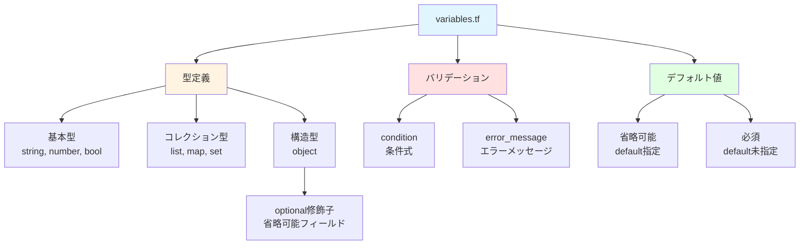

# 07. 変数定義 - variables.tfの読み方 🧩

!!! 💡 info "この章で学ぶこと"
    `variables.tf`の型定義を完全理解します：

    1. 変数定義の3つの要素（型・バリデーション・デフォルト値）
    2. 基本型（string、number、bool）
    3. コレクション型（list、map、set）
    4. 構造型（object）とoptional修飾子
    5. バリデーションルールの書き方
    6. 実践：カスタム変数の追加方法

---

## 🗺️ 変数定義の全体像

変数定義（variables.tf）の構造を視覚化してみましょう。



**🔑 3つの要素**：

1. **型定義**：どんなデータ型か（string、number、list等）
2. **バリデーション**：入力値のチェック（条件を満たさないとエラー）
3. **デフォルト値**：省略時の初期値（任意）

---

## 📝 variables.tfの役割

**🔎 3つの役割がある**：

### 🧬 1. 型の定義
```hcl title="型の定義例"
variable "starter_locations" {
  type = list(string)  # ←文字列のリスト
}
```

「これは文字列のリストです」と宣言しています。

---

### ✅ 2. バリデーション
```hcl title="値のチェック"
validation {
  condition     = length(var.starter_locations) > 0
  error_message = "最低1つのリージョンが必要です"
}
```

---


間違った値が入ってたらエラーを出す。

### 🏷️ 3. デフォルト値
```hcl title="初期値の設定"
variable "enable_telemetry" {
  type    = bool
  default = true  # ←指定しなかったらtrue
}
```

値を指定しなかった時の初期値。

---

## 🗾 Part 1: リージョン設定

### 🌍 starter_locations

```hcl title="リージョン設定変数"
variable "starter_locations" {
  type        = list(string)
  description = "The default for Azure resources. (e.g 'uksouth')"
  
  validation {
    condition     = length(var.starter_locations) > 0
    error_message = "You must provide at least one starter location region."
  }
  
  validation {
    condition     = var.connectivity_type == "none" || ((length(var.virtual_hubs) <= length(var.starter_locations)) || (length(var.hub_virtual_networks) <= length(var.starter_locations)))
    error_message = "The number of regions supplied in `starter_locations` must match the number of regions specified for connectivity."
  }
}
```

**🔍 分解して見ていきましょう**

#### 📝 type = list(string)
```hcl
type = list(string)
```

**意味**：文字列のリスト

**🟢 OK例**：
```hcl title="正しい記述例"
starter_locations = ["japaneast", "japanwest"]  # ✅
starter_locations = ["eastus"]                   # ✅
```

**🔴 NG例**：
```hcl title="間違った記述例"
starter_locations = "japaneast"     # ❌ リストじゃない
starter_locations = [123, 456]      # ❌ 文字列じゃない
starter_locations = []              # ❌ 空はダメ（次のバリデーションでエラー）
```

#### ✅ validation 1: 最低1個必要
```hcl title="空リスト禁止のチェック"
validation {
  condition     = length(var.starter_locations) > 0
  error_message = "You must provide at least one starter location region."
}
```

**🔎 チェック内容**：

- `length(var.starter_locations) > 0`：リストの長さが0より大きい？

- つまり、最低1個は入ってないとダメ

**⚠️ エラー例**：
```hcl
starter_locations = []  # ❌

# エラーメッセージ：
# You must provide at least one starter location region.
```

#### ✅ validation 2: Hubの数とリージョン数が合ってるか
```hcl
validation {
  condition     = var.connectivity_type == "none" || ((length(var.virtual_hubs) <= length(var.starter_locations)) || (length(var.hub_virtual_networks) <= length(var.starter_locations)))
  error_message = "The number of regions supplied in `starter_locations` must match the number of regions specified for connectivity."
}
```

**🔎 意味**：

- Hub VNetを2個作るなら、リージョンも2個指定してね
- Hub VNet 3個なのにリージョン2個だと足りないからエラー

**📝 例**：
```hcl title="正しい設定例"
# OK
starter_locations = ["japaneast", "japanwest"]
hub_virtual_networks = {
  primary = { ... }
  secondary = { ... }
}

# NG
starter_locations = ["japaneast"]  # リージョン1個
hub_virtual_networks = {
  primary = { ... }
  secondary = { ... }  # Hub 2個 → 足りない！
}
```

---

### 🏷️ starter_locations_short

```hcl title="リージョン短縮コードのオーバーライド"
variable "starter_locations_short" {
  type        = map(string)
  default     = {}
  description = <<DESCRIPTION
Optional overrides for the starter location short codes.
...
DESCRIPTION
}
```

**❓ これは何？**

リージョンの短縮コードを手動で指定したい時に使う。

**🔄 デフォルト動作**：

- `japaneast` → `jpe`（自動生成）
- `japanwest` → `jpw`（自動生成）

**🛠️ 手動で変えたい場合**：
```hcl title="短縮コードのカスタマイズ"
starter_locations_short = {
  starter_location_01_short = "je"   # jpeじゃなくてjeにしたい
  starter_location_02_short = "jw"   # jpwじゃなくてjwにしたい
}
```

普通は使わない。デフォルトで十分。

---

## 🆔 Part 2: サブスクリプションID

### 🗂️ subscription_ids（新しい方式）

```hcl title="サブスクリプションID変数（推奨）"
variable "subscription_ids" {
  description = "The list of subscription IDs to deploy the Platform Landing Zones into"
  type        = map(string)
  default     = {}
  nullable    = false
  
  validation {
    condition     = length(var.subscription_ids) == 0 || alltrue([for id in values(var.subscription_ids) : can(regex("^([0-9a-fA-F]{8}-[0-9a-fA-F]{4}-[0-9a-fA-F]{4}-[0-9a-fA-F]{4}-[0-9a-fA-F]{12})$", id))])
    error_message = "All subscription IDs must be valid GUIDs"
  }
  
  validation {
    condition     = length(var.subscription_ids) == 0 || alltrue([for id in keys(var.subscription_ids) : contains(["management", "connectivity", "identity", "security"], id)])
    error_message = "The keys of the subscription_ids map must be one of 'management', 'connectivity', 'identity' or 'security'"
  }
}
```

**🧩 type = map(string)**

キーと値のペア。

**📝 使い方**：
```hcl title="サブスクリプションIDの設定例"
subscription_ids = {
  management   = "12345678-1234-1234-1234-123456789012"
  connectivity = "87654321-4321-4321-4321-210987654321"
  identity     = "11111111-2222-3333-4444-555555555555"
  security     = "99999999-8888-7777-6666-555555555555"
}
```

#### ✅ validation 1: GUID形式チェック
```hcl title="サブスクリプションIDの形式チェック"
validation {
  condition     = length(var.subscription_ids) == 0 || alltrue([for id in values(var.subscription_ids) : can(regex("^([0-9a-fA-F]{8}-[0-9a-fA-F]{4}-[0-9a-fA-F]{4}-[0-9a-fA-F]{4}-[0-9a-fA-F]{12})$", id))])
  error_message = "All subscription IDs must be valid GUIDs"
}
```

**🔎 チェック内容**：

- サブスクリプションIDが正しいGUID形式か？

- `xxxxxxxx-xxxx-xxxx-xxxx-xxxxxxxxxxxx`の形式

**🔴 NG例**：
```hcl
subscription_ids = {
  management = "abc"  # ❌ GUID形式じゃない
}

# エラー: All subscription IDs must be valid GUIDs
```

#### ✅ validation 2: キー名チェック
```hcl title="許可されたキー名のチェック"
validation {
  condition     = length(var.subscription_ids) == 0 || alltrue([for id in keys(var.subscription_ids) : contains(["management", "connectivity", "identity", "security"], id)])
  error_message = "The keys of the subscription_ids map must be one of 'management', 'connectivity', 'identity' or 'security'"
}
```

**🔎 チェック内容**：
キー名は`management`、`connectivity`、`identity`、`security`のどれかじゃないとダメ。

**🔴 NG例**：
```hcl
subscription_ids = {
  production = "12345678-..."  # ❌ productionは使えない
}

# エラー: The keys of the subscription_ids map must be one of 'management', 'connectivity', 'identity' or 'security'
```

---

### 🗃️ subscription_id_connectivity（古い方式）

```hcl title="非推奨：古いサブスクリプションID設定"
variable "subscription_id_connectivity" {
  description = "DEPRECATED (use subscription_ids instead): The identifier of the Connectivity Subscription"
  type        = string
  default     = null
  
  validation {
    condition     = var.subscription_id_connectivity == null || can(regex("^([0-9a-fA-F]{8}-[0-9a-fA-F]{4}-[0-9a-fA-F]{4}-[0-9a-fA-F]{4}-[0-9a-fA-F]{12})$", var.subscription_id_connectivity))
    error_message = "The subscription ID must be a valid GUID"
  }
}
```

DEPRECATEDって書いてあるでしょ？
これは古い方式。使わないで。

昔はこう書いてた：
```hcl
# 古い方式（使わないで）
subscription_id_connectivity = "12345678-..."
subscription_id_management   = "87654321-..."
subscription_id_identity     = "11111111-..."
```

今はこう：
```hcl
# 新しい方式（こっち使って）
subscription_ids = {
  connectivity = "12345678-..."
  management   = "87654321-..."
  identity     = "11111111-..."
}
```

---

## 🏢 Part 3: 管理グループ設定

### 🏠 root_parent_management_group_id

```hcl title="管理グループの親設定"
variable "root_parent_management_group_id" {
  type        = string
  default     = ""
  description = "This is the id of the management group that the ALZ hierarchy will be nested under, will default to the Tenant Root Group"
}
```

**これは何？🧐**

Landing Zonesの管理グループ階層を、どこにぶら下げるか。

**デフォルト**（`""`）：
```
Tenant Root Group（テナントルート）
  └── ALZの管理グループ階層
```

**既存の管理グループの下に作りたい場合🛠️**：
```hcl title="カスタム親管理グループの指定"
root_parent_management_group_id = "/providers/Microsoft.Management/managementGroups/my-company"

# 結果
my-company
  └── ALZの管理グループ階層
```

普通はデフォルトでOK。

---

## 🧰 Part 4: その他の設定

### 📡 enable_telemetry

```hcl title="テレメトリー有効/無効設定"
variable "enable_telemetry" {
  type        = bool
  default     = true
  description = "Flag to enable/disable telemetry"
}
```

**これは何？🧐**

Microsoftに使用状況データを送るかどうか。

**true**：匿名データを送る（デフォルト）
**false**：送らない

無効にしたい場合：
```hcl title="テレメトリーを無効化"
enable_telemetry = false
```

個人情報は送られないから、trueのままでいいと思う。

---

### 🛠️ custom_replacements

```hcl title="カスタム置換変数"
variable "custom_replacements" {
  type = object({
    names                      = optional(map(string), {})
    resource_group_identifiers = optional(map(string), {})
    resource_identifiers       = optional(map(string), {})
  })
  default = {
    names                      = {}
    resource_group_identifiers = {}
    resource_identifiers       = {}
  }
  description = "Custom replacements"
}
```

**型が複雑！🤯**

`object`型で、中に3つの`map(string)`が入ってる。

**object型とは？🧩**

JavaScriptのオブジェクトみたいなやつ。

```hcl title="custom_replacementsの使用例"
custom_replacements = {
  names = {
    firewall_name = "fw-custom-name"
  }
  resource_group_identifiers = {
    ...
  }
  resource_identifiers = {
    ...
  }
}
```

optionalって何？🤔

- `optional(map(string), {})`：省略可能。省略したら空マップ`{}`になる

つまり、これでもOK：
```hcl
custom_replacements = {
  names = {
    firewall_name = "fw-custom-name"
  }
  # resource_group_identifiers省略
  # resource_identifiers省略
}
```

Chapter 6で見た設定が、ここで定義されてる。

---

### 🏷️ tags

```hcl title="タグ変数"
variable "tags" {
  type        = map(string)
  default     = null
  description = "(Optional) Tags of the resource."
}
```

**型**：`map(string)`（キーと値のペア）

**デフォルト**：`null`（何も指定しなければタグなし）

**使い方**：
```hcl title="タグの設定例"
tags = {
  environment = "production"
  cost_center = "IT"
  owner       = "platform-team"
}
```

---

## 🧬 Part 5: 変数の型まとめ

Terraformでよく使う型をまとめとくね。

### 🧱 プリミティブ型（基本型）

#### 📝 string（文字列）
```hcl title="文字列型の定義"
variable "name" {
  type = string
}

# 使い方
name = "my-resource"
```

#### 🔢 number（数値）
```hcl title="数値型の定義"
variable "count" {
  type = number
}

# 使い方
count = 3
```

#### 🔘 bool（真偽値）
```hcl title="真偽値型の定義"
variable "enabled" {
  type = bool
}

# 使い方
enabled = true
```

---

### 📚 コレクション型（複数の値）

#### 📋 list（リスト）
```hcl title="リスト型の定義"
variable "locations" {
  type = list(string)
}

# 使い方
locations = ["japaneast", "japanwest"]
```

#### 🗺️ map（マップ）
```hcl title="マップ型の定義"
variable "tags" {
  type = map(string)
}

# 使い方
tags = {
  env = "prod"
  app = "web"
}
```

#### 🧩 set（セット）
```hcl title="セット型の定義"
variable "unique_items" {
  type = set(string)
}

# 使い方
unique_items = ["a", "b", "c"]  # 重複は自動削除される
```

---

### 🏗️ 構造型（複雑な構造）

#### 🧩 object（オブジェクト）
```hcl title="オブジェクト型の定義"
variable "vm_config" {
  type = object({
    name = string
    size = string
    enabled = bool
  })
}

# 使い方
vm_config = {
  name = "my-vm"
  size = "Standard_B2s"
  enabled = true
}
```

#### 🏷️ optional（省略可能）
```hcl title="省略可能なフィールドの定義"
variable "config" {
  type = object({
    name = string
    tags = optional(map(string), {})  # 省略可。省略したら{}
  })
}

# 使い方1: 全部指定
config = {
  name = "test"
  tags = {env = "dev"}
}

# 使い方2: tags省略
config = {
  name = "test"
  # tags省略 → 自動で{}になる
}
```

---

## ✅ バリデーションの書き方

### 📝 基本パターン

```hcl title="バリデーションの基本構文"
variable "example" {
  type = string
  
  validation {
    condition     = 条件式
    error_message = "エラーメッセージ"
  }
}
```

**conditionがfalseになったらエラー**

---

### 🔄 よく使うパターン

#### 📏 長さチェック
```hcl title="リストの長さチェック"
validation {
  condition     = length(var.my_list) > 0
  error_message = "リストは最低1個必要"
}
```

#### 🔤 正規表現チェック
```hcl title="文字列パターンのチェック"
validation {
  condition     = can(regex("^[a-z0-9-]+$", var.name))
  error_message = "名前は小文字、数字、ハイフンのみ"
}
```

#### 🎯 値の範囲チェック
```hcl title="数値範囲のチェック"
validation {
  condition     = var.count >= 1 && var.count <= 10
  error_message = "countは1〜10の間"
}
```

#### 🗂️ 選択肢チェック
```hcl title="許可された値のチェック"
validation {
  condition     = contains(["dev", "stg", "prod"], var.environment)
  error_message = "environmentはdev、stg、prodのどれか"
}
```

#### 🧮 リスト全要素チェック
```hcl title="全要素の条件チェック"
validation {
  condition     = alltrue([for item in var.items : length(item) > 3])
  error_message = "全ての要素は4文字以上"
}
```

---

## 🛠️ 実践：自分で変数を追加してみよう

例えば、「Firewallの名前をカスタマイズしたい」って時。

### 1️⃣ variables.tfに追加
```hcl title="カスタムFirewall名変数の定義"
variable "custom_firewall_name" {
  type        = string
  default     = null
  description = "Custom name for the firewall"
  
  validation {
    condition     = var.custom_firewall_name == null || can(regex("^fw-[a-z0-9-]+$", var.custom_firewall_name))
    error_message = "Firewall name must start with 'fw-' and contain only lowercase letters, numbers, and hyphens"
  }
}
```

---

### 2️⃣ platform-landing-zone.auto.tfvarsで使う
```hcl title="カスタムFirewall名の設定"
custom_firewall_name = "fw-my-custom-firewall"
```

---

### 3️⃣ main.tfで参照
```hcl title="Firewallリソースで変数を使用"
resource "azurerm_firewall" "example" {
  name = var.custom_firewall_name != null ? var.custom_firewall_name : "fw-default"
  ...
}
```

簡単でしょ？

---

## 📝 まとめ

**variables.tfの役割**：

1. **型定義**：どんなデータ型か
2. **バリデーション**：間違った値をチェック
3. **デフォルト値**：省略時の初期値

**よく使う型**：

- `string`、`number`、`bool`：基本型
- `list(type)`、`map(type)`：コレクション型
- `object({...})`：構造型
- `optional(type, default)`：省略可能

**バリデーション**：

- `length()`、`can()`、`regex()`、`contains()`、`alltrue()`

次のChapterでは、`locals.tf`を見ていきます。
変数を計算・加工するロジックがどうなっているか解説します。

---

## 🏋️‍♂️ 練習問題

理解度チェックです。休憩中に考えてみましょう。

### ❓ 問題1
次の変数定義のうち、正しくないものはどれですか？

```hcl
A. variable "name" { type = string }
B. variable "count" { type = number, default = 1 }
C. variable "tags" { type = map(string) }
```

### ❓ 問題2
`optional`修飾子を使った変数定義で、  
省略時に空文字列（`""`）がデフォルトになるように書いてください。

### ❓ 問題3
次のvalidation条件は何をチェックしていますか？

```hcl
validation {
  condition     = contains(["japaneast", "japanwest"], var.location)
  error_message = "Invalid location"
}
```

---

## 📝 練習問題の答え

### 💡 答え1
**B が間違い**です。

```hcl
# ❌ カンマは使わない
variable "count" { type = number, default = 1 }

# ✅ 正しい書き方
variable "count" {
  type    = number
  default = 1
}
```

### 💡 答え2
```hcl title="optional修飾子でデフォルト値を指定"
variable "description" {
  type = object({
    text = optional(string, "")
  })
}
```

`optional(string, "")`とすることで、省略時に空文字列がデフォルトになります。

### 💡 答え3
リージョンが`japaneast`または`japanwest`のみ許可されることをチェックしています。

`contains(list, value)`で、リストに値が含まれているか確認します。
含まれていない場合は、`error_message`が表示されます。

---

**所要時間**: 35分  
**難易度**: ★★★☆☆  
**前**: [06_設定ファイル完全解説.md](./06_設定ファイル完全解説.md)  
**次**: [08_ローカル変数.md](./08_ローカル変数.md)
