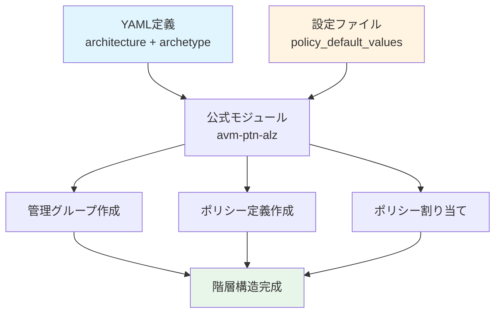

# 08. 管理グループとポリシー - 階層構造の設計

!!! info "この章で学ぶこと"
    `main.management.tf`と`lib/`フォルダで管理グループ階層とポリシーを設定する仕組みを学びます：

    1. 管理グループって何？なぜ必要？
    2. main.management.tfの詳細解説
    3. modules/management_groups/の内部構造
    4. 公式モジュール（Azure/avm-ptn-alz/azurerm）の解説
    5. lib/フォルダのYAML定義
    6. 実践：カスタムポリシーとアーキタイプの追加方法

---

## はじめに：管理グループって何？

### 組織の「組織図」

管理グループは、Azureサブスクリプションを階層的に管理する仕組みです。

=== "会社の組織図"

    ```text title="一般企業の構造"
    社長
    ├── 営業本部
    │   ├── 東日本営業部
    │   └── 西日本営業部
    ├── 技術本部
    │   ├── 開発部
    │   └── インフラ部
    └── 管理本部
        ├── 総務部
        └── 経理部
    ```

    部署ごとにルールや権限を設定！

=== "Azure Landing Zones"

    ```text title="管理グループ階層"
    Tenant Root（テナントルート）
    └── alz（Azure Landing Zones）
        ├── platform（プラットフォーム）
        │   ├── management（管理）
        │   ├── connectivity（接続）
        │   ├── identity（ID管理）
        │   └── security（セキュリティ）
        ├── landingzones（ランディングゾーン）
        │   ├── corp（社内システム）
        │   └── online（外部公開）
        ├── sandbox（検証環境）
        └── decommissioned（廃止予定）
    ```

    用途ごとにサブスクリプションを分類！

### なぜ管理グループが必要？

**メリット：**

- **階層的なポリシー適用**: 親の設定が子に継承される
- **まとめて権限管理**: 部署ごとにアクセス制御
- **コスト管理**: グループ単位で予算設定
- **ガバナンス**: 企業全体のルールを統一

**具体例：**

```text title="ポリシーの継承"
alz（全社ルール：「暗号化必須」）
├── platform（プラットフォームルール：「タグ必須」）
│   └── management
│       └── サブスクリプション
│           ↑ 「暗号化必須」+「タグ必須」が適用される
```

---

## Part 1: main.management.tf の全体像

```hcl title="main.management.tf"
module "management_resources" {
  source = "./modules/management_resources"

  count = var.management_resources_enabled ? 1 : 0

  enable_telemetry             = var.enable_telemetry
  management_resource_settings = local.management_resource_settings

  providers = {
    azurerm = azurerm.management
  }
}

module "management_groups" {
  source = "./modules/management_groups"

  count = var.management_groups_enabled ? 1 : 0

  enable_telemetry          = var.enable_telemetry
  management_group_settings = local.management_group_settings
}

moved {
  from = module.management_groups
  to   = module.management_groups[0]
}

moved {
  from = module.management_resources
  to   = module.management_resources[0]
}
```

**2つのモジュール：**

| モジュール | 役割 | この章で解説 |
|-----------|------|-------------|
| `management_resources` | Log Analytics、Automation Account等 | 次章（Chapter 09） |
| `management_groups` | 管理グループ階層とポリシー | ✅ この章 |

---

## Part 2: modules/management_groups/の構造

### 2-1: ディレクトリ構成

```text
modules/management_groups/
├── main.tf         # 公式モジュール呼び出し
├── variables.tf    # 入力変数定義
├── locals.tf       # ローカル変数（データ変換）
└── terraform.tf    # プロバイダー要件
```

### 2-2: main.tfの内容

```hcl title="modules/management_groups/main.tf"
module "management_groups" {
  source                                                        = "Azure/avm-ptn-alz/azurerm"
  version                                                       = "0.14.1"
  architecture_name                                             = var.management_group_settings.architecture_name
  parent_resource_id                                            = var.management_group_settings.parent_resource_id
  location                                                      = var.management_group_settings.location
  policy_default_values                                         = local.policy_default_values
  policy_assignments_to_modify                                  = local.policy_assignments_to_modify
  enable_telemetry                                              = var.enable_telemetry
  management_group_hierarchy_settings                           = var.management_group_settings.management_group_hierarchy_settings
  partner_id                                                    = var.management_group_settings.partner_id
  retries                                                       = var.management_group_settings.retries
  subscription_placement                                        = var.management_group_settings.subscription_placement
  timeouts                                                      = var.management_group_settings.timeouts
  dependencies                                                  = var.management_group_settings.dependencies
  override_policy_definition_parameter_assign_permissions_set   = var.management_group_settings.override_policy_definition_parameter_assign_permissions_set
  override_policy_definition_parameter_assign_permissions_unset = var.management_group_settings.override_policy_definition_parameter_assign_permissions_unset
  management_group_role_assignments                             = var.management_group_settings.management_group_role_assignments
  role_assignment_definition_lookup_enabled                     = var.management_group_settings.role_assignment_definition_lookup_enabled
  policy_assignment_non_compliance_message_settings             = var.management_group_settings.policy_assignment_non_compliance_message_settings
  role_assignment_name_use_random_uuid                          = var.management_group_settings.role_assignment_name_use_random_uuid
}
```

**何してる？**

Azure公式の「Azure Landing Zones Pattern Module」を使用。

### 2-3: variables.tfの内容

```hcl title="modules/management_groups/variables.tf（主要部分）"
variable "management_group_settings" {
  type = object({
    architecture_name            = optional(string, "alz_custom")
    parent_resource_id           = string
    location                     = string
    policy_default_values        = optional(any)
    policy_assignments_to_modify = optional(any)
    management_group_hierarchy_settings = optional(object({
      default_management_group_name            = string
      require_authorization_for_group_creation = optional(bool, true)
      update_existing                          = optional(bool, false)
    }))
    partner_id = optional(string)
    retries = optional(object({
      management_groups = optional(object({
        error_message_regex  = optional(list(string))
        interval_seconds     = optional(number)
        max_interval_seconds = optional(number)
        multiplier           = optional(number)
        randomization_factor = optional(number)
      }))
      # ... 他のリトライ設定
    }), {})
    subscription_placement = optional(map(object({
      subscription_id       = string
      management_group_name = string
    })))
    timeouts = optional(object({
      management_group = optional(object({
        create = optional(string, "60m")
        delete = optional(string, "60m")
        update = optional(string, "60m")
        read   = optional(string, "60m")
      }), {})
      # ... 他のタイムアウト設定
    }))
    dependencies = optional(map(list(string)), {})
    # ... 他のオプション設定
  })
}

variable "enable_telemetry" {
  type        = bool
  default     = true
  description = "テレメトリー送信の有効化"
}
```

**主要な変数：**

| 変数 | 必須 | デフォルト | 用途 |
|------|------|-----------|------|
| `architecture_name` | オプション | `"alz_custom"` | アーキテクチャ定義名 |
| `parent_resource_id` | ✅ 必須 | なし | 親管理グループID |
| `location` | ✅ 必須 | なし | デフォルトリージョン |
| `policy_default_values` | オプション | なし | ポリシーパラメータ |
| `policy_assignments_to_modify` | オプション | なし | ポリシー変更 |
| `subscription_placement` | オプション | なし | サブスクリプション配置 |
| `retries` | オプション | `{}` | リトライ設定 |
| `timeouts` | オプション | 各60分 | タイムアウト設定 |

**特徴的な設定：**

**リトライ設定（retries）：**

API呼び出しが失敗した場合の再試行設定。大規模環境で有用。

```hcl title="リトライ設定例"
retries = {
  management_groups = {
    interval_seconds     = 10
    max_interval_seconds = 180
    multiplier           = 2
  }
}
```

**タイムアウト設定（timeouts）：**

リソース作成の待機時間。デフォルトは60分。

```hcl title="タイムアウト設定例"
timeouts = {
  management_group = {
    create = "120m"  # 大規模環境では長めに
  }
}
```

### 2-4: locals.tfのデータ変換

```hcl title="modules/management_groups/locals.tf"
locals {
  policy_default_values = { for k, v in try(var.management_group_settings.policy_default_values, {}) : k => jsonencode({ value = v }) }
  policy_assignments_to_modify = { for management_group_key, management_group_value in try(var.management_group_settings.policy_assignments_to_modify, {}) : management_group_key => {
    policy_assignments = { for policy_assignment_key, policy_assignment_value in try(management_group_value.policy_assignments, {}) : policy_assignment_key => {
      enforcement_mode        = try(policy_assignment_value.enforcement_mode, null)
      identity                = try(policy_assignment_value.identity, null)
      identity_ids            = try(policy_assignment_value.identity_ids, null)
      parameters              = try({ for parameter_key, parameter_value in try(policy_assignment_value.parameters, {}) : parameter_key => jsonencode({ value = parameter_value }) }, null)
      non_compliance_messages = try(policy_assignment_value.non_compliance_messages, null)
      resource_selectors      = try(policy_assignment_value.resource_selectors, null)
      overrides               = try(policy_assignment_value.overrides, null)
    } }
  } }
}
```

**何してる？**

- `policy_default_values`: ポリシーパラメータをJSON形式に変換
- `policy_assignments_to_modify`: ポリシー割り当ての変更内容を整形

**なぜJSON変換？**

Azure Policy APIはJSON形式のパラメータを要求するため。

---

## Part 3: 公式モジュール（Azure/avm-ptn-alz/azurerm）の内部構造

### 3-1: モジュール全体像

**GitHubリポジトリ：**

https://github.com/Azure/terraform-azurerm-avm-ptn-alz


ここからは公式のモジュールを開きながら見ていきましょう。こんな感じ↓


**主要ファイル：**

```text
terraform-azurerm-avm-ptn-alz/
├── main.tf                          # メインエントリポイント（data.alz_architecture）
├── main.management_groups.tf        # 管理グループ作成（Level 0-6）
├── main.policy_definitions.tf       # ポリシー定義
├── main.policy_set_definitions.tf   # ポリシーセット定義
├── main.policy_assignments.tf       # ポリシー割り当て
├── main.policy_role_assignments.tf  # ポリシー用RBAC
├── main.role_definitions.tf         # カスタムロール定義
├── main.role_assignments.tf         # RBAC割り当て
├── locals.tf                        # ローカル変数（管理グループのレベル分け）
├── variables.tf                     # 入力変数
├── outputs.tf                       # 出力
└── terraform.tf                     # プロバイダー要件
```

**このモジュールが作成するリソース：**

| リソース | 個数 | 用途 |
|---------|------|------|
| `azapi_resource` (management_groups) | 複数（レベル0-6） | 管理グループ階層 |
| `azapi_resource` (policy_definitions) | 複数 | カスタムポリシー定義 |
| `azapi_resource` (policy_set_definitions) | 複数 | ポリシーイニシアティブ |
| `azapi_resource` (policy_assignments) | 複数 | ポリシー割り当て |
| `azapi_resource` (policy_role_assignments) | 複数 | ポリシー用RBAC |
| `azapi_resource` (role_definitions) | 複数 | カスタムロール定義 |
| `azapi_resource` (management_group_role_assignments) | 複数 | 管理グループRBAC |

### 3-2: main.tf - データソースでYAML読み込み

```hcl title="main.tf"
data "alz_architecture" "this" {
  name                         = var.architecture_name
  root_management_group_id     = var.parent_resource_id
  location                     = var.location
  policy_assignments_to_modify = var.policy_assignments_to_modify
  policy_default_values        = var.policy_default_values

  override_policy_definition_parameter_assign_permissions_set   = var.override_policy_definition_parameter_assign_permissions_set
  override_policy_definition_parameter_assign_permissions_unset = var.override_policy_definition_parameter_assign_permissions_unset
}
```

**何してる？**

`alz` providerの`data.alz_architecture`でYAML定義を読み込み：

- `lib/architecture_definitions/`から管理グループ階層
- `lib/archetype_definitions/`から各アーキタイプのポリシー定義
- テンプレート変数（`${parent_management_group_id}`等）を置換

### 3-3: locals.tf - 管理グループのレベル分け

```hcl title="locals.tf"
locals {
  management_groups = { for v in data.alz_architecture.this.management_groups : v.id => {
    id           = v.id
    level        = v.level
    exists       = v.exists
    display_name = v.display_name
    parent_id    = v.parent_id
  } }
  management_groups_level_0 = { for k, v in local.management_groups : k => v if v.level == 0 && !v.exists }
  management_groups_level_1 = { for k, v in local.management_groups : k => v if v.level == 1 && !v.exists }
  management_groups_level_2 = { for k, v in local.management_groups : k => v if v.level == 2 && !v.exists }
  management_groups_level_3 = { for k, v in local.management_groups : k => v if v.level == 3 && !v.exists }
  management_groups_level_4 = { for k, v in local.management_groups : k => v if v.level == 4 && !v.exists }
  management_groups_level_5 = { for k, v in local.management_groups : k => v if v.level == 5 && !v.exists }
  management_groups_level_6 = { for k, v in local.management_groups : k => v if v.level == 6 && !v.exists }
}

locals {
  policy_definitions = {
    for pdval in flatten([
      for mg in data.alz_architecture.this.management_groups : [
        for pdname, pd in mg.policy_definitions : {
          key        = pdname
          definition = jsondecode(pd)
          mg         = mg.id
        }
      ]
  ]) : "${pdval.mg}/${pdval.key}" => pdval }
}

locals {
  policy_set_definitions = {
    for psdval in flatten([
      for mg in data.alz_architecture.this.management_groups : [
        for psdname, psd in mg.policy_set_definitions : {
          key            = psdname
          set_definition = jsondecode(psd)
          mg             = mg.id
        }
      ]
  ]) : "${psdval.mg}/${psdval.key}" => psdval }
}
```

**何してる？**

**管理グループのレベル分け：**

- `data.alz_architecture.this.management_groups`から全管理グループを取得
- `.level`でレベル（0-6）を判定
- `.exists`で既存管理グループを除外
- レベルごとに`local.management_groups_level_X`を作成

**ポリシー定義の抽出：**

- 各管理グループの`.policy_definitions`からJSONを抽出
- キー形式：`"<管理グループID>/<ポリシー定義名>"`

**ポリシーセット定義の抽出：**

- 各管理グループの`.policy_set_definitions`から抽出

### 3-4: main.management_groups.tf - 階層的な作成

```hcl title="main.management_groups.tf（Level 0の例）"
resource "azapi_resource" "management_groups_level_0" {
  for_each = local.management_groups_level_0

  name      = each.value.id
  parent_id = "/"
  type      = "Microsoft.Management/managementGroups@2023-04-01"
  body = {
    properties = {
      details = {
        parent = {
          id = "/providers/Microsoft.Management/managementGroups/${each.value.parent_id}"
        }
      }
      displayName = each.value.display_name
    }
  }
  create_headers = var.enable_telemetry ? { "User-Agent" : local.avm_azapi_header } : null
  delete_headers = var.enable_telemetry ? { "User-Agent" : local.avm_azapi_header } : null
  read_headers   = var.enable_telemetry ? { "User-Agent" : local.avm_azapi_header } : null
  replace_triggers_external_values = [
    each.value.parent_id,
  ]
  retry = var.retries.management_groups.error_message_regex != null ? {
    error_message_regex  = var.retries.management_groups.error_message_regex
    interval_seconds     = lookup(var.retries.management_groups, "interval_seconds", null)
    max_interval_seconds = lookup(var.retries.management_groups, "max_interval_seconds", null)
    multiplier           = lookup(var.retries.management_groups, "multiplier", null)
    randomization_factor = lookup(var.retries.management_groups, "randomization_factor", null)
  } : null
  schema_validation_enabled = var.schema_validation_enabled.management_groups
  update_headers            = var.enable_telemetry ? { "User-Agent" : local.avm_azapi_header } : null

  timeouts {
    create = var.timeouts.management_group.create
    delete = var.timeouts.management_group.delete
    read   = var.timeouts.management_group.read
    update = var.timeouts.management_group.update
  }

  depends_on = [
    terraform_data.management_groups_dependencies,
  ]
}

# Level 1-6も同様の構造（depends_onが前レベルになる）
resource "azapi_resource" "management_groups_level_1" {
  for_each = local.management_groups_level_1
  # ... 同様の設定
  depends_on = [azapi_resource.management_groups_level_0]
}
```

**何してる？**

**階層的な作成順序：**

1. Level 0 → Level 1 → Level 2 → ... → Level 6の順番
2. `depends_on`で前レベルの完了を待つ
3. 親管理グループが存在してから子を作成

**リトライ設定：**

- `retry.error_message_regex`: "AuthorizationFailed"などのエラーで再試行
- `interval_seconds`: リトライ間隔
- `max_interval_seconds`: 最大間隔
- `multiplier`: 間隔の倍率
- `randomization_factor`: ランダム化係数

**タイムアウト設定：**

- `create`: 作成タイムアウト（デフォルト60分）
- `delete`: 削除タイムアウト（デフォルト5分）
- `update`: 更新タイムアウト（デフォルト5分）
- `read`: 読み取りタイムアウト（デフォルト60分）

### 3-5: main.policy_definitions.tf - ポリシー定義の展開

```hcl title="main.policy_definitions.tf"
resource "azapi_resource" "policy_definitions" {
  for_each = local.policy_definitions

  name      = each.value.definition.name
  parent_id = "${coalesce(lookup(var.parent_id_overrides.policy_definitions, each.key, null), "/providers/Microsoft.Management/managementGroups")}/${each.value.mg}"
  type      = "Microsoft.Authorization/policyDefinitions@2021-06-01"
  body = {
    properties = each.value.definition.properties
  }
  create_headers         = var.enable_telemetry ? { "User-Agent" : local.avm_azapi_header } : null
  delete_headers         = var.enable_telemetry ? { "User-Agent" : local.avm_azapi_header } : null
  read_headers           = var.enable_telemetry ? { "User-Agent" : local.avm_azapi_header } : null
  response_export_values = []
  retry = var.retries.policy_definitions.error_message_regex != null ? {
    error_message_regex  = var.retries.policy_definitions.error_message_regex
    interval_seconds     = lookup(var.retries.policy_definitions, "interval_seconds", null)
    max_interval_seconds = lookup(var.retries.policy_definitions, "max_interval_seconds", null)
    multiplier           = lookup(var.retries.policy_definitions, "multiplier", null)
    randomization_factor = lookup(var.retries.policy_definitions, "randomization_factor", null)
  } : null
  schema_validation_enabled = var.schema_validation_enabled.policy_definitions
  update_headers            = var.enable_telemetry ? { "User-Agent" : local.avm_azapi_header } : null

  timeouts {
    create = var.timeouts.policy_definition.create
    delete = var.timeouts.policy_definition.delete
    read   = var.timeouts.policy_definition.read
    update = var.timeouts.policy_definition.update
  }

  depends_on = [time_sleep.after_management_groups]
}
```

**何してる？**

**ポリシー定義の作成：**

- `local.policy_definitions`（`locals.tf`で作成）をループ
- 各管理グループに対応するポリシー定義を展開
- `parent_id`で配置先管理グループを指定

**依存関係：**

- `depends_on = [time_sleep.after_management_groups]`で管理グループ作成後に実行

### 3-6: main.policy_assignments.tf - ポリシー割り当て

```hcl title="main.policy_assignments.tf（抜粋）"
resource "azapi_resource" "policy_assignments" {
  for_each = local.policy_assignments_final

  location  = var.location
  name      = each.value.assignment.name
  parent_id = "${coalesce(lookup(var.parent_id_overrides.policy_assignments, each.key, null), "/providers/Microsoft.Management/managementGroups")}/${each.value.mg}"
  type      = "Microsoft.Authorization/policyAssignments@2024-04-01"
  body = {
    properties = {
      description       = lookup(each.value.assignment.properties, "description", null)
      definitionVersion = lookup(each.value.assignment.properties, "definitionVersion", "1.*.*")
      displayName       = lookup(each.value.assignment.properties, "displayName", null)
      enforcementMode   = lookup(each.value.assignment.properties, "enforcementMode", null)
      metadata = merge(lookup(each.value.assignment.properties, "metadata", {}), {
        createdBy = ""
        createdOn = ""
        updatedBy = ""
        updatedOn = ""
      })
      nonComplianceMessages = lookup(each.value.assignment.properties, "nonComplianceMessages", null)
      parameters            = lookup(each.value.assignment.properties, "parameters", null)
      policyDefinitionId    = lookup(each.value.assignment.properties, "policyDefinitionId", null)
      resourceSelectors     = lookup(each.value.assignment.properties, "resourceSelectors", null)
    }
  }
  identity = lookup(each.value.assignment, "identity", null) != null ? {
    type        = each.value.assignment.identity.type
    identityIds = lookup(each.value.assignment.identity, "identityIds", null)
  } : null

  create_headers = var.enable_telemetry ? { "User-Agent" : local.avm_azapi_header } : null
  delete_headers = var.enable_telemetry ? { "User-Agent" : local.avm_azapi_header } : null
  read_headers   = var.enable_telemetry ? { "User-Agent" : local.avm_azapi_header } : null
  retry = var.retries.policy_assignments.error_message_regex != null ? {
    error_message_regex  = var.retries.policy_assignments.error_message_regex
    interval_seconds     = lookup(var.retries.policy_assignments, "interval_seconds", 5)
    max_interval_seconds = lookup(var.retries.policy_assignments, "max_interval_seconds", 30)
    multiplier           = lookup(var.retries.policy_assignments, "multiplier", null)
    randomization_factor = lookup(var.retries.policy_assignments, "randomization_factor", null)
  } : null
  schema_validation_enabled = var.schema_validation_enabled.policy_assignments
  update_headers            = var.enable_telemetry ? { "User-Agent" : local.avm_azapi_header } : null

  timeouts {
    create = var.timeouts.policy_assignment.create
    delete = var.timeouts.policy_assignment.delete
    read   = var.timeouts.policy_assignment.read
    update = var.timeouts.policy_assignment.update
  }

  depends_on = [
    terraform_data.policy_assignments_dependencies,
    time_sleep.after_policy_set_definitions,
  ]
}
```

**何してる？**

**ポリシー割り当ての作成：**

- アーキタイプ定義に基づいて各管理グループにポリシーを割り当て
- `enforcementMode`: "Default"（有効）/"DoNotEnforce"（無効）
- `parameters`: ポリシーパラメータ（JSON形式）
- `identity`: Managed Identityの設定（ポリシーがリソース修正する場合）

**リトライ設定の工夫：**

- `interval_seconds = 5`: 短い間隔から開始
- `max_interval_seconds = 30`: 最大30秒まで延長
- ポリシー定義作成直後のエラー対策

### 3-7: variables.tf - 主要な入力変数

```hcl title="variables.tf（主要部分）"
variable "architecture_name" {
  type        = string
  description = "アーキテクチャ定義の名前（*.alz_architecture_definition.[json|yaml|yml]）"
  nullable    = false
}

variable "parent_resource_id" {
  type        = string
  description = "親管理グループのリソースID（テナントIDまたは管理グループ名）"
  nullable    = false

  validation {
    condition     = !strcontains(var.parent_resource_id, "/")
    error_message = "管理グループ名のみを指定（パスは含めない）"
  }
}

variable "location" {
  type        = string
  description = "デフォルトリージョン（ポリシーのManaged Identity用）"
  nullable    = false
}

variable "policy_default_values" {
  type        = map(string)
  default     = {}
  description = "ポリシーパラメータのデフォルト値"
  nullable    = false
}

variable "policy_assignments_to_modify" {
  type = map(object({
    policy_assignments = map(object({
      enforcement_mode        = optional(string)
      identity                = optional(string)
      identity_ids            = optional(set(string))
      parameters              = optional(map(any))
      non_compliance_messages = optional(list(object({
        message                        = string
        policy_definition_reference_id = optional(string)
      })))
      resource_selectors = optional(list(object({
        name = string
        selectors = list(object({
          kind   = string
          in     = optional(list(string))
          notIn  = optional(list(string))
        }))
      })))
    }))
  }))
  default     = {}
  description = "ポリシー割り当ての変更設定"
  nullable    = false
}

variable "retries" {
  type = object({
    management_groups = optional(object({
      error_message_regex  = optional(list(string))
      interval_seconds     = optional(number)
      max_interval_seconds = optional(number)
      multiplier           = optional(number)
      randomization_factor = optional(number)
    }), {})
    # ... 他のリソース種別のretries設定
  })
  default     = {}
  description = "リトライ設定"
  nullable    = false
}

variable "timeouts" {
  type = object({
    management_group = optional(object({
      create = optional(string, "60m")
      delete = optional(string, "5m")
      update = optional(string, "5m")
      read   = optional(string, "60m")
    }), {})
    # ... 他のリソース種別のtimeouts設定
  })
  default     = {}
  description = "タイムアウト設定"
  nullable    = false
}
```

**主要な変数：**

| 変数 | 必須 | デフォルト | 用途 |
|------|------|-----------|------|
| `architecture_name` | ✅ 必須 | なし | アーキテクチャ定義名 |
| `parent_resource_id` | ✅ 必須 | なし | 親管理グループID |
| `location` | ✅ 必須 | なし | デフォルトリージョン |
| `policy_default_values` | オプション | `{}` | ポリシーパラメータ |
| `policy_assignments_to_modify` | オプション | `{}` | ポリシー割り当て変更 |
| `retries` | オプション | `{}` | リトライ設定 |
| `timeouts` | オプション | 各60分等 | タイムアウト設定 |

### 3-8: outputs.tf - 出力

```hcl title="outputs.tf"
output "management_group_resource_ids" {
  description = "管理グループ名とリソースIDのマップ"
  value = { for k, v in merge(
    azapi_resource.management_groups_level_0,
    azapi_resource.management_groups_level_1,
    azapi_resource.management_groups_level_2,
    azapi_resource.management_groups_level_3,
    azapi_resource.management_groups_level_4,
    azapi_resource.management_groups_level_5,
    azapi_resource.management_groups_level_6,
  ) : k => v.id }
}

output "policy_assignment_resource_ids" {
  description = "ポリシー割り当て名とリソースIDのマップ"
  value       = { for k, v in azapi_resource.policy_assignments : k => v.id }
}

output "policy_definition_resource_ids" {
  description = "ポリシー定義名とリソースIDのマップ"
  value       = { for k, v in azapi_resource.policy_definitions : k => v.id }
}

output "policy_set_definition_resource_ids" {
  description = "ポリシーセット定義名とリソースIDのマップ"
  value       = { for k, v in azapi_resource.policy_set_definitions : k => v.id }
}

output "role_definition_resource_ids" {
  description = "ロール定義名とリソースIDのマップ"
  value       = { for k, v in azapi_resource.role_definitions : k => v.id }
}
```

**何を出力してる？**

- 作成された全リソースのIDマップ
- 他モジュールから参照可能


---

## Part 4: lib/フォルダのYAML定義

### 4-1: アーキテクチャ定義

```yaml title="lib/architecture_definitions/alz_custom.alz_architecture_definition.yaml"
name: alz_custom
management_groups:
  - id: alz
    display_name: Azure Landing Zones
    parent_management_group_id: ${parent_management_group_id}
    archetypes:
      - root_custom
    
  - id: platform
    display_name: Platform
    parent_management_group_id: alz
    archetypes:
      - platform_custom
    
  - id: management
    display_name: Management
    parent_management_group_id: platform
    archetypes:
      - management_custom
    
  - id: connectivity
    display_name: Connectivity
    parent_management_group_id: platform
    archetypes:
      - connectivity_custom
```

**何を定義してる？**

- 管理グループのID
- 表示名
- 親子関係
- 適用するアーキタイプ

### 4-2: アーキタイプ定義

```yaml title="lib/archetype_definitions/root_custom.alz_archetype_override.yaml"
name: root_custom
base_archetype: root

policy_assignments_to_add:
  - Deny-Resource-Locations
  - Deny-RSG-Locations

policy_assignments_to_remove: []

policy_definitions_to_add: []
policy_definitions_to_remove: []
```

**何を定義してる？**

- ベースアーキタイプ（継承元）
- 追加するポリシー割り当て
- 削除するポリシー割り当て
- カスタムポリシー定義

**アーキタイプとは？**

ポリシーとRBAC設定のテンプレート。用途別に定義されています。

| アーキタイプ | 用途 |
|------------|------|
| `root` | ルート管理グループ |
| `platform` | プラットフォーム全体 |
| `management` | 管理用リソース |
| `connectivity` | ネットワーク接続 |
| `landing_zones` | アプリケーション環境 |

---

## Part 5: 動作の完全な流れ

### ステップ1: 設定ファイルから取得

```hcl title="platform-landing-zone.auto.tfvars（抜粋）"
management_group_settings = {
  architecture_name = "alz_custom"
  location          = "japaneast"
  policy_default_values = {
    allowed_locations     = ["japaneast", "japanwest"]
    log_analytics_workspace_id = "/subscriptions/.../workspace"
  }
}
```

### ステップ2: locals.tfでデータ変換

```hcl title="modules/management_groups/locals.tf"
locals {
  policy_default_values = {
    allowed_locations = jsonencode({
      value = ["japaneast", "japanwest"]
    })
    log_analytics_workspace_id = jsonencode({
      value = "/subscriptions/.../workspace"
    })
  }
}
```

### ステップ3: 公式モジュールに渡す

```hcl title="modules/management_groups/main.tf"
module "management_groups" {
  source  = "Azure/avm-ptn-alz/azurerm"
  version = "0.14.1"

  architecture_name     = "alz_custom"
  location              = "japaneast"
  policy_default_values = local.policy_default_values
  # ...
}
```

### ステップ4: YAML定義を読み込み

モジュール内部で`lib/`フォルダを読み込み：

1. `alz_custom.alz_architecture_definition.yaml` → 管理グループ階層
2. `root_custom.alz_archetype_override.yaml` → ポリシー設定
3. 各ポリシー定義ファイル → ポリシーの詳細

### ステップ5: リソース作成

```text
+ azurerm_management_group.alz
+ azurerm_management_group.platform
+ azurerm_management_group.management
+ azurerm_management_group.connectivity
+ azurerm_management_group_policy_assignment.xxx (多数)
+ azurerm_policy_definition.xxx (カスタムポリシー)
```

---

## Part 6: 実践 - カスタマイズパターン

### パターン1: 許可リージョンの変更

**要件：**

- 日本リージョンのみ許可
- 他リージョンでのリソース作成を禁止

#### 手順1: policy_default_valuesを設定

```hcl title="platform-landing-zone.auto.tfvars"
management_group_settings = {
  architecture_name = "alz_custom"
  location          = "japaneast"
  policy_default_values = {
    allowed_locations         = ["japaneast", "japanwest"]
    allowed_locations_for_rgs = ["japaneast", "japanwest"]
  }
}
```

#### 手順2: Terraform実行

```bash
terraform plan
```

**出力：**

```text
+ azurerm_management_group_policy_assignment.deny_locations
  parameters = {
    allowed_locations = {
      value = ["japaneast", "japanwest"]
    }
  }
```

```bash
terraform apply
```

#### 手順3: 確認

```bash
az policy assignment list --scope "/providers/Microsoft.Management/managementGroups/alz"
```

---

### パターン2: カスタムポリシーの追加

**要件：**

- 特定のVMサイズのみ許可
- Standard_D*シリーズのみ

#### 手順1: カスタムポリシー定義を作成

```json title="lib/policy_definitions/policy_definition_custom_vm_size.json"
{
  "name": "Deny-VM-Size",
  "properties": {
    "displayName": "許可されたVMサイズの制限",
    "policyType": "Custom",
    "mode": "All",
    "description": "Standard_D*シリーズのみ許可",
    "policyRule": {
      "if": {
        "allOf": [
          {
            "field": "type",
            "equals": "Microsoft.Compute/virtualMachines"
          },
          {
            "not": {
              "field": "Microsoft.Compute/virtualMachines/sku.name",
              "like": "Standard_D*"
            }
          }
        ]
      },
      "then": {
        "effect": "deny"
      }
    }
  }
}
```

#### 手順2: アーキタイプ定義に追加

```yaml title="lib/archetype_definitions/landing_zones_custom.alz_archetype_override.yaml"
name: landing_zones_custom
base_archetype: landing_zones

policy_assignments_to_add:
  - Deny-VM-Size

policy_definitions_to_add:
  - Deny-VM-Size
```

#### 手順3: Terraform実行

```bash
terraform plan
```

**出力：**

```text
+ azurerm_policy_definition.deny_vm_size
  display_name = "許可されたVMサイズの制限"

+ azurerm_management_group_policy_assignment.deny_vm_size
  policy_definition_id = "/providers/Microsoft.Management/managementGroups/alz/providers/Microsoft.Authorization/policyDefinitions/Deny-VM-Size"
```

```bash
terraform apply
```

#### 手順4: 確認

```bash
az policy definition list --management-group alz --query "[?displayName=='許可されたVMサイズの制限']"
```

---

### パターン3: 特定ポリシーの無効化

**要件：**

- 開発環境では一部ポリシーを無効化
- 例：タグ必須ポリシーを無効

#### 手順1: policy_assignments_to_modifyを設定

```hcl title="platform-landing-zone.auto.tfvars"
management_group_settings = {
  architecture_name = "alz_custom"
  policy_assignments_to_modify = {
    landingzones = {
      policy_assignments = {
        Enforce-Mandatory-Tags = {
          enforcement_mode = "DoNotEnforce"
        }
      }
    }
  }
}
```

#### 手順2: Terraform実行

```bash
terraform plan
```

**出力：**

```text
~ azurerm_management_group_policy_assignment.enforce_tags
  enforcement_mode = "Default" -> "DoNotEnforce"
```

```bash
terraform apply
```

#### 手順3: 確認

```bash
az policy assignment show \
  --name "Enforce-Mandatory-Tags" \
  --scope "/providers/Microsoft.Management/managementGroups/landingzones"
```

**出力：**

```json
{
  "enforcementMode": "DoNotEnforce"
}
```

---

## まとめ

### 管理グループとポリシーのポイント

!!! success "このコードの役割"
    **4つの主要機能：**
    
    1. **階層構造**: YAML定義で管理グループ階層を構築
    2. **ポリシー管理**: アーキタイプでポリシーをテンプレート化
    3. **公式モジュール**: Azure Verified Moduleで安全・確実
    4. **柔軟なカスタマイズ**: policy_default_valuesで環境固有の設定

### 主要コンポーネント

| コンポーネント | 役割 | 重要度 |
|--------------|------|--------|
| **architecture_definition** | 管理グループ階層 | ★★★★★ |
| **archetype_definition** | ポリシーテンプレート | ★★★★★ |
| **policy_default_values** | 環境固有パラメータ | ★★★★☆ |
| **policy_assignments_to_modify** | ポリシーの上書き | ★★★☆☆ |

### 管理グループ作成フロー



---

## 次のステップ

管理グループとポリシーの構築方法を理解しましたか？

次は[09_管理リソースv3.md](./09_管理リソースv3.md)に進んで、  
Log AnalyticsやAutomation Accountなどの管理リソースの構築方法を学びましょう。

**所要時間**: 60分  
**難易度**: ★★★★★  
**次**: [09_管理リソースv3.md](./09_管理リソースv3.md)
