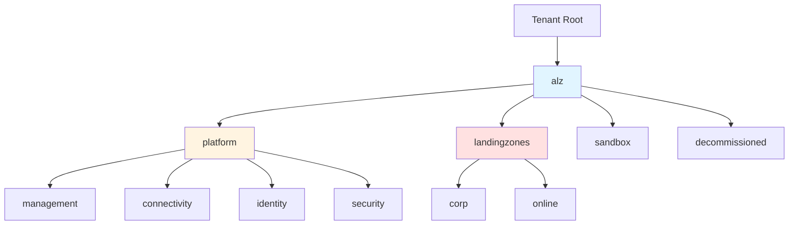

# 08. 管理グループとポリシー - 階層構造の設計

!!! info "この章で学ぶこと"
    `main.management.tf`と`lib/`フォルダで管理グループ階層とポリシーを設定する仕組みを学びます：

    1. 管理グループって何？なぜ必要？
    2. main.management.tfの詳細解説
    3. lib/フォルダのYAML定義
    4. アーキタイプの概念
    5. 実践：カスタムポリシーの追加方法

---

## はじめに：管理グループって何？

### 組織の「組織図」

管理グループは、Azureサブスクリプションを階層的に管理する仕組みです。

=== "会社の組織図"

    ```text title="一般企業の構造"
    社長
    ├── 営業本部
    │   ├── 東日本営業部
    │   └── 西日本営業部
    ├── 技術本部
    │   ├── 開発部
    │   └── インフラ部
    └── 管理本部
        ├── 総務部
        └── 経理部
    ```

    部署ごとにルールや権限を設定！

=== "Azure Landing Zones"

    ```text title="管理グループ階層"
    Tenant Root（テナントルート）
    └── alz（Azure Landing Zones）
        ├── platform（プラットフォーム）
        │   ├── management（管理）
        │   ├── connectivity（接続）
        │   ├── identity（ID管理）
        │   └── security（セキュリティ）
        ├── landingzones（ランディングゾーン）
        │   ├── corp（社内システム）
        │   └── online（外部公開）
        ├── sandbox（検証環境）
        └── decommissioned（廃止予定）
    ```

    用途ごとにサブスクリプションを分類！

### なぜ管理グループが必要？

**メリット：**

- **階層的なポリシー適用**: 親の設定が子に継承される
- **まとめて権限管理**: 部署ごとにアクセス制御
- **コスト管理**: グループ単位で予算設定
- **ガバナンス**: 企業全体のルールを統一

**具体例：**

```text title="ポリシーの継承"
alz（全社ルール：「暗号化必須」）
├── platform（プラットフォームルール：「タグ必須」）
│   └── management
│       └── サブスクリプション
│           ↑ 「暗号化必須」+「タグ必須」が適用される
```

---

## Part 1: main.management.tf の全体像

このファイルで2つのモジュールを呼び出します。

```hcl title="main.management.tf"
module "management_resources" {
  source = "./modules/management_resources"

  count = var.management_resources_enabled ? 1 : 0

  enable_telemetry             = var.enable_telemetry
  management_resource_settings = local.management_resource_settings

  providers = {
    azurerm = azurerm.management
  }
}

module "management_groups" {
  source = "./modules/management_groups"

  count = var.management_groups_enabled ? 1 : 0

  enable_telemetry          = var.enable_telemetry
  management_group_settings = local.management_group_settings
}

moved {
  from = module.management_groups
  to   = module.management_groups[0]
}

moved {
  from = module.management_resources
  to   = module.management_resources[0]
}
```

**2つのモジュール：**

1. **management_resources**: Log AnalyticsやAutomation Accountなどの管理リソース（次章で解説）
2. **management_groups**: 管理グループ階層とポリシー（この章で解説）

---

## Part 2: management_groupsモジュールの詳細

### 2-1: モジュールの基本設定

```hcl
module "management_groups" {
  source = "./modules/management_groups"

  count = var.management_groups_enabled ? 1 : 0
```

**何してる？**

管理グループを作成するかどうかを変数で制御。

**countの使い方：**

```hcl
count = var.management_groups_enabled ? 1 : 0
```

- `true` → `count = 1` → モジュールを1回実行（作成）
- `false` → `count = 0` → モジュールを実行しない（作成しない）

**なぜcount？**

管理グループは必須ではない環境もあるため、オン/オフできるようにしている。

### 2-2: パラメータの渡し方

```hcl
  enable_telemetry          = var.enable_telemetry
  management_group_settings = local.management_group_settings
```

**management_group_settingsって何？**

`locals.tf`で定義された設定で、lib/フォルダのYAMLを読み込んだもの。

**locals.tfでの定義（簡略版）：**

```hcl title="locals.tf（抜粋）"
locals {
  management_group_settings = {
    architecture_definition_name = "alz_custom"
    location                     = var.default_location
    # ...その他の設定
  }
}
```

### 2-3: moved ブロック

```hcl
moved {
  from = module.management_groups
  to   = module.management_groups[0]
}

moved {
  from = module.management_resources
  to   = module.management_resources[0]
}
```

**何してる？**

Terraformのリソース名が変更された場合、既存のリソースを削除・再作成せずに移行する。

**背景：**

以前は`count`なしで定義していたが、後から`count`を追加した。
```hcl
# 以前
module.management_groups

# 現在
module.management_groups[0]
```

**movedがない場合：**
```text
- 古いリソースを削除
+ 新しいリソースを作成
→ ダウンタイム発生！
```

**movedがある場合：**
```text
~ リソース名を変更（削除・再作成なし）
→ ダウンタイムなし！
```

---

## Part 3: lib/フォルダの構造

```text title="lib/フォルダ"
lib/
├── alz_library_metadata.json           ← ライブラリのメタデータ
├── archetype_definitions/              ← アーキタイプ定義
│   ├── root_custom.alz_archetype_override.yaml
│   ├── platform_custom.alz_archetype_override.yaml
│   ├── landing_zones_custom.alz_archetype_override.yaml
│   ├── corp_custom.alz_archetype_override.yaml
│   ├── online_custom.alz_archetype_override.yaml
│   ├── sandbox_custom.alz_archetype_override.yaml
│   ├── management_custom.alz_archetype_override.yaml
│   ├── connectivity_custom.alz_archetype_override.yaml
│   ├── identity_custom.alz_archetype_override.yaml
│   ├── security_custom.alz_archetype_override.yaml
│   └── decommissioned_custom.alz_archetype_override.yaml
└── architecture_definitions/           ← アーキテクチャ定義
    └── alz_custom.alz_architecture_definition.yaml
```

**2種類のYAML：**

1. **architecture_definition**: 管理グループの階層構造を定義
2. **archetype_definition**: 各管理グループに適用するポリシーを定義

---

## Part 4: architecture_definition - 階層構造の定義

```yaml title="lib/architecture_definitions/alz_custom.alz_architecture_definition.yaml"
name: alz_custom
management_groups:
  - id: alz
    display_name: Azure Landing Zones
    archetypes:
      - root_custom
    exists: false
    parent_id: null

  - id: platform
    display_name: Platform
    archetypes:
      - platform_custom
    exists: false
    parent_id: alz

  - id: landingzones
    display_name: Landing Zones
    archetypes:
      - landing_zones_custom
    exists: false
    parent_id: alz

  - id: corp
    display_name: Corp
    archetypes:
      - corp_custom
    exists: false
    parent_id: landingzones

  - id: online
    display_name: Online
    archetypes:
      - online_custom
    exists: false
    parent_id: landingzones

  - id: sandbox
    display_name: Sandbox
    archetypes:
      - sandbox_custom
    exists: false
    parent_id: alz

  - id: security
    display_name: Security
    archetypes:
      - security_custom
    exists: false
    parent_id: platform

  - id: management
    display_name: Management
    archetypes:
      - management_custom
    exists: false
    parent_id: platform

  - id: connectivity
    display_name: Connectivity
    archetypes:
      - connectivity_custom
    exists: false
    parent_id: platform

  - id: identity
    display_name: Identity
    archetypes:
      - identity_custom
    exists: false
    parent_id: platform

  - id: decommissioned
    display_name: Decommissioned
    archetypes:
      - decommissioned_custom
    exists: false
    parent_id: alz
```

### 各フィールドの意味

**id:**

管理グループの一意な識別子。

```yaml
id: platform
```

**display_name:**

Azure Portal上で表示される名前。

```yaml
display_name: Platform
```

**archetypes:**

この管理グループに適用するアーキタイプのリスト。

```yaml
archetypes:
  - platform_custom
```

**exists:**

既存の管理グループを使うか、新規作成するか。

```yaml
exists: false  # 新規作成
exists: true   # 既存を使用
```

**parent_id:**

親となる管理グループのID。

```yaml
parent_id: alz  # alzの配下に作成
parent_id: null # ルート直下（最上位）
```

### 階層構造の可視化



---

## Part 5: archetype_definition - ポリシーの定義

```yaml title="lib/archetype_definitions/root_custom.alz_archetype_override.yaml"
base_archetype: root
name: root_custom
policy_assignments_to_add: []
policy_assignments_to_remove: []
policy_definitions_to_add: []
policy_definitions_to_remove: []
policy_set_definitions_to_add: []
policy_set_definitions_to_remove: []
role_definitions_to_add: []
role_definitions_to_remove: []
```

### アーキタイプって何？

**アーキタイプ = ポリシーのテンプレート**

特定の用途に合わせた設定のセットです。

**base_archetype:**

Azure公式のアーキタイプを継承。

```yaml
base_archetype: root  # Microsoftの公式rootアーキタイプを継承
```

**利用可能な公式アーキタイプ：**

- `root`: ルート管理グループ用
- `platform`: プラットフォーム用
- `landing_zones`: ランディングゾーン用
- `corp`: 社内システム用
- `online`: 外部公開用

### カスタマイズの方法

**追加（to_add）:**

公式アーキタイプに加えて、追加のポリシーを適用。

```yaml
policy_assignments_to_add:
  - custom-policy-1
  - custom-policy-2
```

**削除（to_remove）:**

公式アーキタイプから特定のポリシーを除外。

```yaml
policy_assignments_to_remove:
  - unwanted-policy
```

### ポリシーの種類

**1. policy_definitions:**

個別のポリシー定義。

```yaml
policy_definitions_to_add:
  - Deny-Public-IP  # パブリックIPの作成を禁止
```

**2. policy_set_definitions:**

複数のポリシーをまとめたもの（イニシアティブ）。

```yaml
policy_set_definitions_to_add:
  - Security-Baseline  # セキュリティベースラインのポリシーセット
```

**3. policy_assignments:**

ポリシーを管理グループに割り当てる。

```yaml
policy_assignments_to_add:
  - Deploy-AzActivity-Log  # アクティビティログの設定を自動デプロイ
```

**4. role_definitions:**

カスタムRBACロールの定義。

```yaml
role_definitions_to_add:
  - Network-Admin  # ネットワーク管理者用カスタムロール
```

---

## Part 6: 実践 - カスタムポリシーの追加

実際にカスタムポリシーを追加してみましょう。

### シナリオ: platformにタグ必須ポリシーを追加

**要件：**

- platformとその配下の管理グループに「Environment」タグを必須にする

### 手順1: アーキタイプファイルの編集

```yaml title="lib/archetype_definitions/platform_custom.alz_archetype_override.yaml"
base_archetype: platform
name: platform_custom
policy_assignments_to_add:
  - Require-Environment-Tag  # 追加
policy_assignments_to_remove: []
policy_definitions_to_add: []
policy_definitions_to_remove: []
policy_set_definitions_to_add: []
policy_set_definitions_to_remove: []
role_definitions_to_add: []
role_definitions_to_remove: []
```

### 手順2: Terraform実行

```bash
terraform plan
```

**出力例：**
```text
Terraform will perform the following actions:

  # module.management_groups[0].azurerm_management_group_policy_assignment.this["platform"] will be updated
  ~ resource "azurerm_management_group_policy_assignment" "this" {
      + policy_assignment "Require-Environment-Tag" {
          + enforcement_mode = "Default"
        }
    }

Plan: 0 to add, 1 to change, 0 to destroy.
```

```bash
terraform apply
```

### 手順3: 適用範囲の確認

```text title="ポリシーが適用される管理グループ"
platform（直接適用）
├── management（継承）
├── connectivity（継承）
├── identity（継承）
└── security（継承）
```

配下の管理グループにも自動適用されます！

---

## Part 7: よくあるパターン

### パターン1: 特定のポリシーを除外

```yaml title="corp_custom.alz_archetype_override.yaml"
base_archetype: corp
name: corp_custom
policy_assignments_to_add: []
policy_assignments_to_remove:
  - Deny-Public-Endpoints  # 社内システムはパブリックエンドポイントを許可
```

### パターン2: カスタム管理グループの追加

```yaml title="alz_custom.alz_architecture_definition.yaml"
management_groups:
  # 既存の管理グループ
  
  # 新規追加：開発環境用
  - id: development
    display_name: Development
    archetypes:
      - development_custom
    exists: false
    parent_id: landingzones
```

```yaml title="development_custom.alz_archetype_override.yaml（新規作成）"
base_archetype: corp
name: development_custom
policy_assignments_to_add:
  - Auto-Shutdown-VMs  # 開発環境は自動停止
policy_assignments_to_remove: []
policy_definitions_to_add: []
policy_definitions_to_remove: []
policy_set_definitions_to_add: []
policy_set_definitions_to_remove: []
role_definitions_to_add: []
role_definitions_to_remove: []
```

### パターン3: 既存の管理グループを使用

```yaml title="alz_custom.alz_architecture_definition.yaml"
management_groups:
  - id: existing-mg
    display_name: Existing Management Group
    archetypes:
      - root_custom
    exists: true  # 既存を使用
    parent_id: null
```

---

## Part 8: 各管理グループの役割

### platform配下

**management:**

- Log Analyticsワークスペース
- Automation Account
- 監視ソリューション

**connectivity:**

- Hub VNet
- Azure Firewall
- VPN/ExpressRoute Gateway

**identity:**

- Active Directory Domain Services
- Azure AD Connect

**security:**

- Microsoft Sentinel
- Microsoft Defender for Cloud
- Key Vault

### landingzones配下

**corp:**

- 社内システム用サブスクリプション
- オンプレミスとの接続あり
- プライベートネットワーク

**online:**

- 外部公開システム用サブスクリプション
- インターネット公開
- パブリックエンドポイント

### その他

**sandbox:**

- 検証・実験用
- ポリシーが緩い
- 短期間のリソース

**decommissioned:**

- 廃止予定のリソース
- 削除前の一時保管

---

## まとめ

### main.management.tf のポイント

!!! success "このファイルの役割"
    **2つのモジュールを呼び出し：**
    
    1. **management_groups**: 管理グループ階層とポリシー
    2. **management_resources**: 管理リソース（次章）
    
    どちらも変数で有効/無効を切り替え可能。

### lib/フォルダの構造

| ファイル | 役割 |
|---------|------|
| **architecture_definition** | 管理グループの階層構造を定義 |
| **archetype_definition** | 各管理グループに適用するポリシーを定義 |

### アーキタイプの継承

```text
公式アーキタイプ（Microsoftが提供）
  ↓ 継承
カスタムアーキタイプ（独自のポリシー追加・削除）
  ↓ 適用
管理グループ
  ↓ 継承
配下のサブスクリプション
```

### 階層構造の再掲

```text
Tenant Root
└── alz（最上位）
    ├── platform（プラットフォーム）
    │   ├── management
    │   ├── connectivity
    │   ├── identity
    │   └── security
    ├── landingzones（ワークロード）
    │   ├── corp
    │   └── online
    ├── sandbox（検証）
    └── decommissioned（廃止予定）
```

---

## 次のステップ

管理グループとポリシーの仕組みを理解しましたか？

次は[09_管理リソース.md](./09_管理リソース.md)に進んで、  
`management_resources`モジュールでLog AnalyticsやAutomation Accountがどう作られるか学びましょう。

**所要時間**: 40分  
**難易度**: ★★★★☆  
**次**: [09_管理リソース.md](./09_管理リソース.md)
