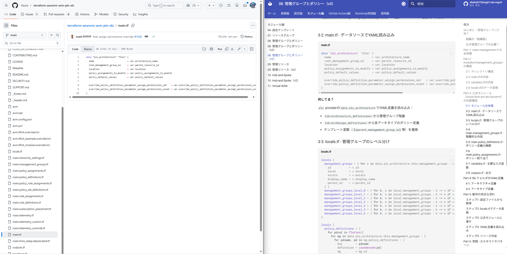
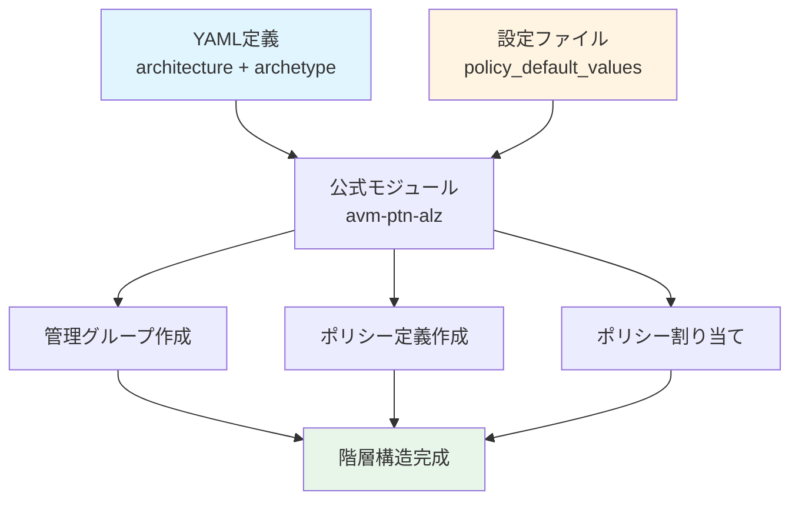

# 08. 管理グループとポリシー - 階層構造の設計

!!! info "この章で学ぶこと"
    `main.management.tf`と`lib/`フォルダで管理グループ階層とポリシーを設定する仕組みを学びます：

    1. 管理グループって何？なぜ必要？
    2. main.management.tfの詳細解説
    3. modules/management_groups/の内部構造
    4. 公式モジュール（Azure/avm-ptn-alz/azurerm）の解説
    5. lib/フォルダのYAML定義
    6. 実践：カスタムポリシーとアーキタイプの追加方法

---

## はじめに：管理グループって何？

### 組織の「組織図」

管理グループは、Azureサブスクリプションを階層的に管理する仕組みです。

=== "会社の組織図"

    ```text title="一般企業の構造"
    社長
    ├── 営業本部
    │   ├── 東日本営業部
    │   └── 西日本営業部
    ├── 技術本部
    │   ├── 開発部
    │   └── インフラ部
    └── 管理本部
        ├── 総務部
        └── 経理部
    ```

    部署ごとにルールや権限を設定！

=== "Azure Landing Zones"

    ```text title="管理グループ階層"
    Tenant Root（テナントルート）
    └── alz（Azure Landing Zones）
        ├── platform（プラットフォーム）
        │   ├── management（管理）
        │   ├── connectivity（接続）
        │   ├── identity（ID管理）
        │   └── security（セキュリティ）
        ├── landingzones（ランディングゾーン）
        │   ├── corp（社内システム）
        │   └── online（外部公開）
        ├── sandbox（検証環境）
        └── decommissioned（廃止予定）
    ```

    用途ごとにサブスクリプションを分類！

### なぜ管理グループが必要？

**メリット：**

- **階層的なポリシー適用**: 親の設定が子に継承される
- **まとめて権限管理**: 部署ごとにアクセス制御
- **コスト管理**: グループ単位で予算設定
- **ガバナンス**: 企業全体のルールを統一

**具体例：**

```text title="ポリシーの継承"
alz（全社ルール：「暗号化必須」）
├── platform（プラットフォームルール：「タグ必須」）
│   └── management
│       └── サブスクリプション
│           ↑ 「暗号化必須」+「タグ必須」が適用される
```

---

## Part 1: main.management.tf の全体像

```hcl title="main.management.tf"
module "management_resources" {
  source = "./modules/management_resources"

  count = var.management_resources_enabled ? 1 : 0

  enable_telemetry             = var.enable_telemetry
  management_resource_settings = local.management_resource_settings

  providers = {
    azurerm = azurerm.management
  }
}

module "management_groups" {
  source = "./modules/management_groups"

  count = var.management_groups_enabled ? 1 : 0

  enable_telemetry          = var.enable_telemetry
  management_group_settings = local.management_group_settings
}

moved {
  from = module.management_groups
  to   = module.management_groups[0]
}

moved {
  from = module.management_resources
  to   = module.management_resources[0]
}
```

**2つのモジュール：**

| モジュール | 役割 | この章で解説 |
|-----------|------|-------------|
| `management_resources` | Log Analytics、Automation Account等 | 次章（Chapter 09） |
| `management_groups` | 管理グループ階層とポリシー | ✅ この章 |

---

## Part 2: modules/management_groups/の構造

### 2-1: ディレクトリ構成

```text
modules/management_groups/
├── main.tf         # 公式モジュール呼び出し
├── variables.tf    # 入力変数定義
├── locals.tf       # ローカル変数（データ変換）
└── terraform.tf    # プロバイダー要件
```

### 2-2: main.tfの内容

```hcl title="modules/management_groups/main.tf"
module "management_groups" {
  source                                                        = "Azure/avm-ptn-alz/azurerm"
  version                                                       = "0.14.1"
  architecture_name                                             = var.management_group_settings.architecture_name
  parent_resource_id                                            = var.management_group_settings.parent_resource_id
  location                                                      = var.management_group_settings.location
  policy_default_values                                         = local.policy_default_values
  policy_assignments_to_modify                                  = local.policy_assignments_to_modify
  enable_telemetry                                              = var.enable_telemetry
  management_group_hierarchy_settings                           = var.management_group_settings.management_group_hierarchy_settings
  partner_id                                                    = var.management_group_settings.partner_id
  retries                                                       = var.management_group_settings.retries
  subscription_placement                                        = var.management_group_settings.subscription_placement
  timeouts                                                      = var.management_group_settings.timeouts
  dependencies                                                  = var.management_group_settings.dependencies
  override_policy_definition_parameter_assign_permissions_set   = var.management_group_settings.override_policy_definition_parameter_assign_permissions_set
  override_policy_definition_parameter_assign_permissions_unset = var.management_group_settings.override_policy_definition_parameter_assign_permissions_unset
  management_group_role_assignments                             = var.management_group_settings.management_group_role_assignments
  role_assignment_definition_lookup_enabled                     = var.management_group_settings.role_assignment_definition_lookup_enabled
  policy_assignment_non_compliance_message_settings             = var.management_group_settings.policy_assignment_non_compliance_message_settings
  role_assignment_name_use_random_uuid                          = var.management_group_settings.role_assignment_name_use_random_uuid
}
```

**何してる？**

Azure公式の「Azure Landing Zones Pattern Module」を使用。

### 2-3: locals.tfのデータ変換

```hcl title="modules/management_groups/locals.tf"
locals {
  policy_default_values = { for k, v in try(var.management_group_settings.policy_default_values, {}) : k => jsonencode({ value = v }) }
  policy_assignments_to_modify = { for management_group_key, management_group_value in try(var.management_group_settings.policy_assignments_to_modify, {}) : management_group_key => {
    policy_assignments = { for policy_assignment_key, policy_assignment_value in try(management_group_value.policy_assignments, {}) : policy_assignment_key => {
      enforcement_mode        = try(policy_assignment_value.enforcement_mode, null)
      identity                = try(policy_assignment_value.identity, null)
      identity_ids            = try(policy_assignment_value.identity_ids, null)
      parameters              = try({ for parameter_key, parameter_value in try(policy_assignment_value.parameters, {}) : parameter_key => jsonencode({ value = parameter_value }) }, null)
      non_compliance_messages = try(policy_assignment_value.non_compliance_messages, null)
      resource_selectors      = try(policy_assignment_value.resource_selectors, null)
      overrides               = try(policy_assignment_value.overrides, null)
    } }
  } }
}
```

**何してる？**

- `policy_default_values`: ポリシーパラメータをJSON形式に変換
- `policy_assignments_to_modify`: ポリシー割り当ての変更内容を整形

**なぜJSON変換？**

Azure Policy APIはJSON形式のパラメータを要求するため。

---

## Part 3: 公式モジュール（Azure/avm-ptn-alz/azurerm）の内部構造

### 3-1: モジュール全体像

**GitHubリポジトリ：**

https://github.com/Azure/terraform-azurerm-avm-ptn-alz


ここからは公式のモジュールを開きながら見ていきましょう。こんな感じ↓


**このモジュールの役割：**

- 管理グループ階層の作成
- ポリシー定義の展開
- ポリシー割り当ての適用
- ロールベースアクセス制御（RBAC）の設定

**作成されるリソース（主要）：**

| リソース | 個数 | 用途 |
|---------|------|------|
| `azurerm_management_group` | 複数 | 管理グループ階層 |
| `azurerm_management_group_policy_assignment` | 複数 | ポリシー割り当て |
| `azurerm_policy_definition` | 複数 | カスタムポリシー |
| `azurerm_policy_set_definition` | 複数 | ポリシーイニシアティブ |
| `azurerm_role_assignment` | 複数 | RBAC権限 |

### 3-2: 主要な入力変数

```hcl title="主要変数（抜粋）"
variable "architecture_name" {
  type        = string
  default     = "alz"
  description = "アーキテクチャ定義の名前"
}

variable "parent_resource_id" {
  type        = string
  description = "親管理グループのリソースID"
}

variable "location" {
  type        = string
  description = "デフォルトのAzureリージョン"
}

variable "policy_default_values" {
  type        = map(string)
  default     = {}
  description = "ポリシーパラメータのデフォルト値"
}

variable "subscription_placement" {
  type        = map(list(string))
  default     = {}
  description = "サブスクリプションの配置先"
}
```

### 3-3: アーキテクチャ定義の読み込み

モジュール内部では、`lib/`フォルダ（もしくはカスタムパス）からYAML定義を読み込みます。

**主要なYAMLファイル：**

| ファイル | 役割 |
|---------|------|
| `alz_architecture_definition.yaml` | 管理グループ階層構造 |
| `<archetype>_alz_archetype_definition.yaml` | アーキタイプ定義 |
| `policy_*.json` | ポリシー定義（JSON） |

### 3-4: 管理グループの作成ロジック

モジュール内部では、YAML定義を解析して管理グループを動的に作成します。

```hcl title="内部ロジック（概念）"
# 1. YAML定義を読み込む
locals {
  architecture_definition = yamldecode(file("${path.module}/lib/architecture_definitions/${var.architecture_name}.alz_architecture_definition.yaml"))
}

# 2. 管理グループを動的に作成
resource "azurerm_management_group" "level_1" {
  for_each = local.management_groups_level_1

  name         = each.value.id
  display_name = each.value.display_name
  parent_management_group_id = var.parent_resource_id
}

resource "azurerm_management_group" "level_2" {
  for_each = local.management_groups_level_2

  name         = each.value.id
  display_name = each.value.display_name
  parent_management_group_id = azurerm_management_group.level_1[each.value.parent].id
}

# （以下、レベルごとに繰り返し）
```

### 3-5: ポリシー割り当てのロジック

```hcl title="ポリシー割り当て（概念）"
# アーキタイプからポリシー割り当てを取得
locals {
  policy_assignments = {
    for mg_key, mg_value in local.management_groups :
    mg_key => lookup(local.archetypes[mg_value.archetype], "policy_assignments", {})
  }
}

# ポリシーを割り当て
resource "azurerm_management_group_policy_assignment" "this" {
  for_each = local.policy_assignments

  name                 = each.value.name
  policy_definition_id = each.value.policy_definition_id
  management_group_id  = each.value.management_group_id
  parameters           = jsonencode(each.value.parameters)
}
```

---

## Part 4: lib/フォルダのYAML定義

### 4-1: アーキテクチャ定義

```yaml title="lib/architecture_definitions/alz_custom.alz_architecture_definition.yaml"
name: alz_custom
management_groups:
  - id: alz
    display_name: Azure Landing Zones
    parent_management_group_id: ${parent_management_group_id}
    archetypes:
      - root_custom
    
  - id: platform
    display_name: Platform
    parent_management_group_id: alz
    archetypes:
      - platform_custom
    
  - id: management
    display_name: Management
    parent_management_group_id: platform
    archetypes:
      - management_custom
    
  - id: connectivity
    display_name: Connectivity
    parent_management_group_id: platform
    archetypes:
      - connectivity_custom
```

**何を定義してる？**

- 管理グループのID
- 表示名
- 親子関係
- 適用するアーキタイプ

### 4-2: アーキタイプ定義

```yaml title="lib/archetype_definitions/root_custom.alz_archetype_override.yaml"
name: root_custom
base_archetype: root

policy_assignments_to_add:
  - Deny-Resource-Locations
  - Deny-RSG-Locations

policy_assignments_to_remove: []

policy_definitions_to_add: []
policy_definitions_to_remove: []
```

**何を定義してる？**

- ベースアーキタイプ（継承元）
- 追加するポリシー割り当て
- 削除するポリシー割り当て
- カスタムポリシー定義

**アーキタイプとは？**

ポリシーとRBAC設定のテンプレート。用途別に定義されています。

| アーキタイプ | 用途 |
|------------|------|
| `root` | ルート管理グループ |
| `platform` | プラットフォーム全体 |
| `management` | 管理用リソース |
| `connectivity` | ネットワーク接続 |
| `landing_zones` | アプリケーション環境 |

---

## Part 5: 動作の完全な流れ

### ステップ1: 設定ファイルから取得

```hcl title="platform-landing-zone.auto.tfvars（抜粋）"
management_group_settings = {
  architecture_name = "alz_custom"
  location          = "japaneast"
  policy_default_values = {
    allowed_locations     = ["japaneast", "japanwest"]
    log_analytics_workspace_id = "/subscriptions/.../workspace"
  }
}
```

### ステップ2: locals.tfでデータ変換

```hcl title="modules/management_groups/locals.tf"
locals {
  policy_default_values = {
    allowed_locations = jsonencode({
      value = ["japaneast", "japanwest"]
    })
    log_analytics_workspace_id = jsonencode({
      value = "/subscriptions/.../workspace"
    })
  }
}
```

### ステップ3: 公式モジュールに渡す

```hcl title="modules/management_groups/main.tf"
module "management_groups" {
  source  = "Azure/avm-ptn-alz/azurerm"
  version = "0.14.1"

  architecture_name     = "alz_custom"
  location              = "japaneast"
  policy_default_values = local.policy_default_values
  # ...
}
```

### ステップ4: YAML定義を読み込み

モジュール内部で`lib/`フォルダを読み込み：

1. `alz_custom.alz_architecture_definition.yaml` → 管理グループ階層
2. `root_custom.alz_archetype_override.yaml` → ポリシー設定
3. 各ポリシー定義ファイル → ポリシーの詳細

### ステップ5: リソース作成

```text
+ azurerm_management_group.alz
+ azurerm_management_group.platform
+ azurerm_management_group.management
+ azurerm_management_group.connectivity
+ azurerm_management_group_policy_assignment.xxx (多数)
+ azurerm_policy_definition.xxx (カスタムポリシー)
```

---

## Part 6: 実践 - カスタマイズパターン

### パターン1: 許可リージョンの変更

**要件：**

- 日本リージョンのみ許可
- 他リージョンでのリソース作成を禁止

#### 手順1: policy_default_valuesを設定

```hcl title="platform-landing-zone.auto.tfvars"
management_group_settings = {
  architecture_name = "alz_custom"
  location          = "japaneast"
  policy_default_values = {
    allowed_locations         = ["japaneast", "japanwest"]
    allowed_locations_for_rgs = ["japaneast", "japanwest"]
  }
}
```

#### 手順2: Terraform実行

```bash
terraform plan
```

**出力：**

```text
+ azurerm_management_group_policy_assignment.deny_locations
  parameters = {
    allowed_locations = {
      value = ["japaneast", "japanwest"]
    }
  }
```

```bash
terraform apply
```

#### 手順3: 確認

```bash
az policy assignment list --scope "/providers/Microsoft.Management/managementGroups/alz"
```

---

### パターン2: カスタムポリシーの追加

**要件：**

- 特定のVMサイズのみ許可
- Standard_D*シリーズのみ

#### 手順1: カスタムポリシー定義を作成

```json title="lib/policy_definitions/policy_definition_custom_vm_size.json"
{
  "name": "Deny-VM-Size",
  "properties": {
    "displayName": "許可されたVMサイズの制限",
    "policyType": "Custom",
    "mode": "All",
    "description": "Standard_D*シリーズのみ許可",
    "policyRule": {
      "if": {
        "allOf": [
          {
            "field": "type",
            "equals": "Microsoft.Compute/virtualMachines"
          },
          {
            "not": {
              "field": "Microsoft.Compute/virtualMachines/sku.name",
              "like": "Standard_D*"
            }
          }
        ]
      },
      "then": {
        "effect": "deny"
      }
    }
  }
}
```

#### 手順2: アーキタイプ定義に追加

```yaml title="lib/archetype_definitions/landing_zones_custom.alz_archetype_override.yaml"
name: landing_zones_custom
base_archetype: landing_zones

policy_assignments_to_add:
  - Deny-VM-Size

policy_definitions_to_add:
  - Deny-VM-Size
```

#### 手順3: Terraform実行

```bash
terraform plan
```

**出力：**

```text
+ azurerm_policy_definition.deny_vm_size
  display_name = "許可されたVMサイズの制限"

+ azurerm_management_group_policy_assignment.deny_vm_size
  policy_definition_id = "/providers/Microsoft.Management/managementGroups/alz/providers/Microsoft.Authorization/policyDefinitions/Deny-VM-Size"
```

```bash
terraform apply
```

#### 手順4: 確認

```bash
az policy definition list --management-group alz --query "[?displayName=='許可されたVMサイズの制限']"
```

---

### パターン3: 特定ポリシーの無効化

**要件：**

- 開発環境では一部ポリシーを無効化
- 例：タグ必須ポリシーを無効

#### 手順1: policy_assignments_to_modifyを設定

```hcl title="platform-landing-zone.auto.tfvars"
management_group_settings = {
  architecture_name = "alz_custom"
  policy_assignments_to_modify = {
    landingzones = {
      policy_assignments = {
        Enforce-Mandatory-Tags = {
          enforcement_mode = "DoNotEnforce"
        }
      }
    }
  }
}
```

#### 手順2: Terraform実行

```bash
terraform plan
```

**出力：**

```text
~ azurerm_management_group_policy_assignment.enforce_tags
  enforcement_mode = "Default" -> "DoNotEnforce"
```

```bash
terraform apply
```

#### 手順3: 確認

```bash
az policy assignment show \
  --name "Enforce-Mandatory-Tags" \
  --scope "/providers/Microsoft.Management/managementGroups/landingzones"
```

**出力：**

```json
{
  "enforcementMode": "DoNotEnforce"
}
```

---

## まとめ

### 管理グループとポリシーのポイント

!!! success "このコードの役割"
    **4つの主要機能：**
    
    1. **階層構造**: YAML定義で管理グループ階層を構築
    2. **ポリシー管理**: アーキタイプでポリシーをテンプレート化
    3. **公式モジュール**: Azure Verified Moduleで安全・確実
    4. **柔軟なカスタマイズ**: policy_default_valuesで環境固有の設定

### 主要コンポーネント

| コンポーネント | 役割 | 重要度 |
|--------------|------|--------|
| **architecture_definition** | 管理グループ階層 | ★★★★★ |
| **archetype_definition** | ポリシーテンプレート | ★★★★★ |
| **policy_default_values** | 環境固有パラメータ | ★★★★☆ |
| **policy_assignments_to_modify** | ポリシーの上書き | ★★★☆☆ |

### 管理グループ作成フロー



---

## 次のステップ

管理グループとポリシーの構築方法を理解しましたか？

次は[09_管理リソースv3.md](./09_管理リソースv3.md)に進んで、  
Log AnalyticsやAutomation Accountなどの管理リソースの構築方法を学びましょう。

**所要時間**: 60分  
**難易度**: ★★★★★  
**次**: [09_管理リソースv3.md](./09_管理リソースv3.md)
