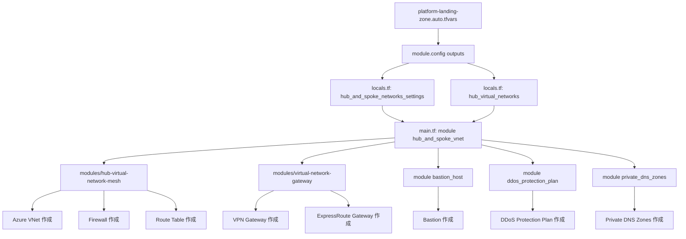

# 10. Hub-and-Spoke - ネットワークの中核

!!! info "この章で学ぶこと"
    Hub-and-Spokeネットワークの全体像を完全理解します：

    1. Hub-and-Spoke vs Virtual WANの比較
    2. platform-landing-zone.auto.tfvarsの設定解説
    3. main.connectivity.hub.and.spoke.virtual.network.tfの解説
    4. Azure/avm-ptn-alz-connectivity-hub-and-spoke-vnet公式モジュール完全解説
    5. Firewall、Bastion、VPN Gatewayの設定
    6. 実践：Spoke VNetの追加方法


## ネットワークアーキテクチャの選択

このプロジェクトではHub-and-Spokeを採用していますが、もう1つの選択肢としてVirtual WANもあります。

### 2つのアーキテクチャ比較

| 観点 | Hub-and-Spoke | Virtual WAN |
|------|--------------|-------------|
| **推奨規模** | 中小企業（〜1000人） | 大企業（1000人以上） |
| **リージョン数** | 1〜3リージョン | 4リージョン以上 |
| **初期コスト** | 低（¥50万/月〜） | 高（¥100万/月〜） |
| **管理の柔軟性** | 高（全て自分で設定） | 低（Microsoftが自動管理） |
| **学習難易度** | 易（VNetの知識があればOK） | 難（Virtual WAN固有の概念） |
| **グローバル接続** | 手動設定が必要 | 自動で最適化 |
| **実装時間** | 2〜4時間 | 1〜2時間 |
| **トラブルシューティング** | 自分で全部確認 | Microsoftが大部分を管理 |

### どっちを選ぶべき？

**Hub-and-Spokeを選ぶべきケース：**

- ✅ 最初のLanding Zones構築（学習しやすい）
- ✅ 日本国内のみ、またはアジア圏のみ
- ✅ 細かくカスタマイズしたい
- ✅ コストを抑えたい
- ✅ ネットワークの仕組みを理解したい

**Virtual WANを選ぶべきケース：**

- ✅ グローバル展開（アメリカ、ヨーロッパ、アジア全て）
- ✅ 複数のオンプレミス拠点がある
- ✅ SD-WANを使っている
- ✅ Microsoftに任せて運用を楽にしたい
- ✅ 既にVirtual WANの経験がある

**このプロジェクトの選択：**

このプロジェクトはHub-and-Spokeを採用しています。理由は：

1. 初心者にも理解しやすい
2. カスタマイズの自由度が高い
3. コストが予測しやすい
4. 日本の中小企業に最適

Virtual WANについては[Chapter 11](./11_Virtual_WAN.md)で詳しく解説します。

---

## このChapterでやること

Hub-and-Spokeネットワークの仕組みを理解しよう。

**Hub-and-Spokeって何？**

中央に1つのHub（ハブ）VNet、周りに複数のSpoke（スポーク）VNetを配置するネットワーク構成。

**例えるなら**：

- **Hub**：空港のハブ（成田、羽田）
- **Spoke**：地方空港
- 地方から海外行くには、一度ハブを経由する

**ネットワークも同じ**：

- **Hub**：中央のVNet（Firewall、VPN Gatewayがある）
- **Spoke**：アプリケーション用VNet
- Spokeからインターネットやオンプレに行くには、Hubを経由

**📊 Hub-and-Spoke構成図（このプロジェクト）**

```text title="Hub-and-Spoke構成"
                    インターネット
                         ↕
                   Azure Firewall
                         |
         ┌───────────────┼───────────────┐
         │         Hub VNet              │
         │    (10.0.0.0/16)             │
         │                               │
         │  ┌─────────┐  ┌──────────┐   │
         │  │Firewall │  │  Bastion │   │
         │  └─────────┘  └──────────┘   │
         │                               │
         │  ┌──────────┐  ┌───────────┐ │
         │  │VPN GW    │  │ER Gateway │ │
         │  └──────────┘  └───────────┘ │
         │       ↓             ↓         │
         └───────┼─────────────┼─────────┘
                 ↓             ↓
         オンプレミス      ExpressRoute
           (VPN)           (専用線)
                 
      VNet Peering ↓      ↓      ↓
         
    ┌──────────┐  ┌──────────┐  ┌──────────┐
    │ Spoke 1  │  │ Spoke 2  │  │ Spoke 3  │
    │ (Corp)   │  │ (Online) │  │  (Dev)   │
    │10.1.0.0  │  │10.2.0.0  │  │10.3.0.0  │
    └──────────┘  └──────────┘  └──────────┘
        Web          API         Database
       Server      Server        Server
```

**🎯 通信の流れ（例）**

```text title="通信の流れ"
Spoke 1 (Webサーバー) → インターネット へアクセスしたい
  ↓
1. User Defined Route (UDR) で Hub へ
  ↓
2. Hub の Firewall でセキュリティチェック
  ↓
3. 許可されたらインターネットへ
  ↓
4. 戻りも Firewall 経由
  ↓
5. Spoke 1 へ到達
```

**🔐 このアーキテクチャの特徴**

| 要素 | 配置場所 | 役割 | 共有/個別 |
|------|----------|------|-----------|
| **Firewall** | Hub | 全トラフィックの検査 | 全Spokeで共有 |
| **Bastion** | Hub | VM への安全なログイン | 全Spokeで共有 |
| **VPN Gateway** | Hub | オンプレミス接続 | 全Spokeで共有 |
| **ExpressRoute GW** | Hub | 専用線接続 | 全Spokeで共有 |
| **アプリケーション** | Spoke | 実際のワークロード | 個別 |

---

## Hub-and-Spokeのメリット

### 1. セキュリティ集約

全トラフィックがHubを経由するから、Firewallで一元管理できる。「Spokeごとにファイアウォール買う」必要なし。

### 2. コスト削減

VPN Gateway：1台約4万円/月。Hubに1台だけ置いて全Spokeで共有すればOK。Spokeごとに買わなくていい。

### 3. 管理が楽

DNSサーバー、Firewallルール、VPN接続、全部Hubで一元管理。

### 4. 柔軟性

新しいアプリ追加したくなったら、新しいSpoke VNet作ってHubにピアリングするだけ。

---

## Part 1: 設定ファイル（platform-landing-zone.auto.tfvars）

platform-landing-zone.auto.tfvarsファイルを見ていこう。

### connectivity_type

```hcl title="platform-landing-zone.auto.tfvars（抜粋）"
connectivity_type = "hub_and_spoke_vnet"
```

**何をしてる？**：ネットワークの種類を指定

- `hub_and_spoke_vnet`：Hub-and-Spoke構成（この章）
- `virtual_wan`：Virtual WAN構成（Chapter 11で解説）
- `none`：ネットワーク作らない

### connectivity_resource_groups

```hcl title="platform-landing-zone.auto.tfvars（抜粋）"
connectivity_resource_groups = {
  ddos = {
    name     = "$${ddos_resource_group_name}"
    location = "$${starter_location_01}"
    settings = {
      enabled = "$${ddos_protection_plan_enabled}"
    }
  }
  vnet_primary = {
    name     = "$${connectivity_hub_primary_resource_group_name}"
    location = "$${starter_location_01}"
    settings = {
      enabled = true
    }
  }
  vnet_secondary = {
    name     = "$${connectivity_hub_secondary_resource_group_name}"
    location = "$${starter_location_02}"
    settings = {
      enabled = true
    }
  }
  dns = {
    name     = "$${dns_resource_group_name}"
    location = "$${starter_location_01}"
    settings = {
      enabled = "$${primary_private_dns_zones_enabled}"
    }
  }
}
```

**何してる？**

4種類のリソースグループを定義してる：

- **ddos**: DDoS Protection Plan用
- **vnet_primary**: プライマリHub VNet用（東日本）
- **vnet_secondary**: セカンダリHub VNet用（西日本）
- **dns**: Private DNS Zone用

全て`$${変数名}`形式で変数置換システムを使ってる（Chapter 09で学んだやつ）。

### hub_and_spoke_networks_settings

```hcl title="platform-landing-zone.auto.tfvars（抜粋）"
hub_and_spoke_networks_settings = {
  enabled_resources = {
    ddos_protection_plan = "$${ddos_protection_plan_enabled}"
  }
  ddos_protection_plan = {
    name                = "$${ddos_protection_plan_name}"
    resource_group_name = "$${ddos_resource_group_name}"
    location            = "$${starter_location_01}"
  }
}
```

**何してる？**

DDoS Protection Planの設定。

**DDoS Protectionって何？**

DDoS攻撃（大量アクセスでサーバーダウンさせる攻撃）から守る仕組み。

**料金**：

```
Standard：約40万円/月（高い！）
Basic：無料（自動で有効）
```

**変数置換後の値**：

`custom_replacements.names`で`ddos_protection_plan_enabled = false`と定義されてることが多い（コスト削減のため）。

### hub_virtual_networks - primary

まず全体構造：

```hcl title="platform-landing-zone.auto.tfvars（抜粋）"
hub_virtual_networks = {
  primary = {
    # プライマリHub（東日本）の設定
  }
  secondary = {
    # セカンダリHub（西日本）の設定
  }
}
```

**primaryの詳細**：

```hcl title="platform-landing-zone.auto.tfvars（抜粋）"
primary = {
  location          = "$${starter_location_01}"
  default_parent_id = "$${primary_connectivity_resource_group_id}"
  enabled_resources = {
    firewall                              = "$${primary_firewall_enabled}"
    bastion                               = "$${primary_bastion_enabled}"
    virtual_network_gateway_express_route = "$${primary_virtual_network_gateway_express_route_enabled}"
    virtual_network_gateway_vpn           = "$${primary_virtual_network_gateway_vpn_enabled}"
    private_dns_zones                     = "$${primary_private_dns_zones_enabled}"
    private_dns_resolver                  = "$${primary_private_dns_resolver_enabled}"
  }
  hub_virtual_network = {
    name                          = "$${primary_virtual_network_name}"
    address_space                 = ["$${primary_hub_virtual_network_address_space}"]
    routing_address_space         = ["$${primary_hub_address_space}"]
    route_table_name_firewall     = "$${primary_route_table_firewall_name}"
    route_table_name_user_subnets = "$${primary_route_table_user_subnets_name}"
    subnets                       = {}
  }
  firewall = {
    subnet_address_prefix            = "$${primary_firewall_subnet_address_prefix}"
    management_subnet_address_prefix = "$${primary_firewall_management_subnet_address_prefix}"
    name                             = "$${primary_firewall_name}"
    default_ip_configuration = {
      public_ip_config = {
        name = "$${primary_firewall_public_ip_name}"
      }
    }
    management_ip_enabled = "$${primary_firewall_management_ip_enabled}"
    management_ip_configuration = {
      public_ip_config = {
        name = "$${primary_firewall_management_public_ip_name}"
      }
    }
  }
  firewall_policy = {
    name = "$${primary_firewall_policy_name}"
  }
  virtual_network_gateways = {
    subnet_address_prefix = "$${primary_gateway_subnet_address_prefix}"
    express_route = {
      name                                  = "$${primary_virtual_network_gateway_express_route_name}"
      hosted_on_behalf_of_public_ip_enabled = "$${primary_virtual_network_gateway_express_route_hobo_public_ip_enabled}"
      ip_configurations = {
        default = {
          public_ip = {
            name = "$${primary_virtual_network_gateway_express_route_public_ip_name}"
          }
        }
      }
    }
    vpn = {
      name = "$${primary_virtual_network_gateway_vpn_name}"
      ip_configurations = {
        active_active_1 = {
          public_ip = {
            name = "$${primary_virtual_network_gateway_vpn_public_ip_name_1}"
          }
        }
        active_active_2 = {
          public_ip = {
            name = "$${primary_virtual_network_gateway_vpn_public_ip_name_2}"
          }
        }
      }
    }
  }
  private_dns_zones = {
    parent_id = "$${dns_resource_group_id}"
    private_link_private_dns_zones_regex_filter = {
      enabled = false
    }
    auto_registration_zone_enabled = "$${primary_private_dns_auto_registration_zone_enabled}"
    auto_registration_zone_name    = "$${primary_auto_registration_zone_name}"
  }
  private_dns_resolver = {
    subnet_address_prefix = "$${primary_private_dns_resolver_subnet_address_prefix}"
    name                  = "$${primary_private_dns_resolver_name}"
  }
  bastion = {
    subnet_address_prefix = "$${primary_bastion_subnet_address_prefix}"
    name                  = "$${primary_bastion_host_name}"
    zones                 = []
    bastion_public_ip = {
      name  = "$${primary_bastion_host_public_ip_name}"
      zones = []
    }
  }
}
```

**構成要素**：

1. **enabled_resources**: どのリソースを作成するか制御
2. **hub_virtual_network**: Hub VNet本体の設定
3. **firewall**: Azure Firewallの設定
4. **firewall_policy**: Firewall Policyの設定
5. **virtual_network_gateways**: VPN/ExpressRoute Gatewayの設定
6. **private_dns_zones**: Private DNS Zoneの設定
7. **private_dns_resolver**: DNS Resolverの設定
8. **bastion**: Azure Bastionの設定

### hub_virtual_networks - secondary

```hcl title="platform-landing-zone.auto.tfvars（抜粋）"
secondary = {
  location          = "$${starter_location_02}"
  default_parent_id = "$${secondary_connectivity_resource_group_id}"
  enabled_resources = {
    firewall                              = "$${secondary_firewall_enabled}"
    bastion                               = "$${secondary_bastion_enabled}"
    virtual_network_gateway_express_route = "$${secondary_virtual_network_gateway_express_route_enabled}"
    virtual_network_gateway_vpn           = "$${secondary_virtual_network_gateway_vpn_enabled}"
    private_dns_zones                     = "$${secondary_private_dns_zones_enabled}"
    private_dns_resolver                  = "$${secondary_private_dns_resolver_enabled}"
  }
  hub_virtual_network = {
    name                          = "$${secondary_virtual_network_name}"
    address_space                 = ["$${secondary_hub_virtual_network_address_space}"]
    routing_address_space         = ["$${secondary_hub_address_space}"]
    route_table_name_firewall     = "$${secondary_route_table_firewall_name}"
    route_table_name_user_subnets = "$${secondary_route_table_user_subnets_name}"
    subnets                       = {}
  }
  firewall = {
    subnet_address_prefix            = "$${secondary_firewall_subnet_address_prefix}"
    management_subnet_address_prefix = "$${secondary_firewall_management_subnet_address_prefix}"
    name                             = "$${secondary_firewall_name}"
    default_ip_configuration = {
      public_ip_config = {
        name = "$${secondary_firewall_public_ip_name}"
      }
    }
    management_ip_enabled = "$${secondary_firewall_management_ip_enabled}"
    management_ip_configuration = {
      public_ip_config = {
        name = "$${secondary_firewall_management_public_ip_name}"
      }
    }
  }
  firewall_policy = {
    name = "$${secondary_firewall_policy_name}"
  }
  virtual_network_gateways = {
    subnet_address_prefix = "$${secondary_gateway_subnet_address_prefix}"
    express_route = {
      name                                  = "$${secondary_virtual_network_gateway_express_route_name}"
      hosted_on_behalf_of_public_ip_enabled = "$${secondary_virtual_network_gateway_express_route_hobo_public_ip_enabled}"
      ip_configurations = {
        default = {
          public_ip = {
            name = "$${secondary_virtual_network_gateway_express_route_public_ip_name}"
          }
        }
      }
    }
    vpn = {
      name = "$${secondary_virtual_network_gateway_vpn_name}"
      ip_configurations = {
        active_active_1 = {
          public_ip = {
            name = "$${secondary_virtual_network_gateway_vpn_public_ip_name_1}"
          }
        }
        active_active_2 = {
          public_ip = {
            name = "$${secondary_virtual_network_gateway_vpn_public_ip_name_2}"
          }
        }
      }
    }
  }
  private_dns_zones = {
    parent_id = "$${dns_resource_group_id}"
    private_link_private_dns_zones_regex_filter = {
      enabled = true
    }
    auto_registration_zone_enabled = "$${secondary_private_dns_auto_registration_zone_enabled}"
    auto_registration_zone_name    = "$${secondary_auto_registration_zone_name}"
  }
  private_dns_resolver = {
    subnet_address_prefix = "$${secondary_private_dns_resolver_subnet_address_prefix}"
    name                  = "$${secondary_private_dns_resolver_name}"
  }
  bastion = {
    subnet_address_prefix = "$${secondary_bastion_subnet_address_prefix}"
    name                  = "$${secondary_bastion_host_name}"
    zones                 = []
    bastion_public_ip = {
      name  = "$${secondary_bastion_host_public_ip_name}"
      zones = []
    }
  }
}
```

**primaryとの違い**：

- `starter_location_02`：西日本リージョン（セカンダリ）
- `secondary_*`変数：セカンダリ用の変数名
- 構造は`primary`と全く同じ

**キーは何でもいい**：

`primary`、`secondary`というキー名は任意。複数のHubを作る時に識別するため。`tokyo`、`osaka`とかでもOK。

---

## Part 2: main.connectivity.hub.and.spoke.virtual.network.tf

```tf title="main.connectivity.hub.and.spoke.virtual.network.tf"
module "hub_and_spoke_vnet" {
  source  = "Azure/avm-ptn-alz-connectivity-hub-and-spoke-vnet/azurerm"
  version = "0.16.8"
  count   = local.connectivity_hub_and_spoke_vnet_enabled ? 1 : 0

  hub_and_spoke_networks_settings = local.hub_and_spoke_networks_settings
  hub_virtual_networks            = local.hub_virtual_networks
  enable_telemetry                = var.enable_telemetry
  tags                            = var.tags

  providers = {
    azurerm = azurerm.connectivity
    azapi   = azapi.connectivity
  }
}
```

**何をしてる？**

公式モジュール`Azure/avm-ptn-alz-connectivity-hub-and-spoke-vnet/azurerm`を呼び出してHub-and-Spokeネットワークを作成してる。

**主要なパラメータ**：

| パラメータ | 内容 | 元データ |
|-----------|------|----------|
| `hub_and_spoke_networks_settings` | DDoS Protection等の共有設定 | `locals.tf`で作成 |
| `hub_virtual_networks` | Hub VNetの設定 | `locals.tf`で作成 |
| `enable_telemetry` | テレメトリ送信 | `variables.tf`から |
| `tags` | タグ | `variables.tf`から |

**locals.tfでの設定**：

```tf title="locals.tf"
# DDoS Protection等の共有設定
hub_and_spoke_networks_settings = merge(
  module.config.outputs.hub_and_spoke_networks_settings,
  local.resource_groups
)

# Hub VNetの設定
hub_virtual_networks = (merge({
  vnets = module.config.outputs.hub_virtual_networks
}, local.resource_groups)).vnets
```

**何をしてる？**

`module.config.outputs`（config-templatingモジュールの出力）と`local.resource_groups`（リソースグループ情報）をマージして、公式モジュールに渡す形式に整えてる。

**重要**：Chapter 08-09と違って、このプロジェクトにはローカルのwrapperモジュール（`modules/connectivity/`）がない。直接公式モジュールを呼んでる。

---

## Part 3: 公式モジュールの内部構造

---

ここからは公式のモジュールを開きながら見ていきましょう。

**GitHubリポジトリ**：

https://github.com/Azure/terraform-azurerm-avm-ptn-alz-connectivity-hub-and-spoke-vnet


### モジュール構造とファイル一覧

```
terraform-azurerm-avm-ptn-alz-connectivity-hub-and-spoke-vnet/
├── main.tf                      # メインモジュール呼び出し（9つ）
├── locals.tf                    # Hub VNet設定の組み立て
├── locals.firewall.tf           # Firewall設定の組み立て
├── locals.bastion.tf            # Bastion設定の組み立て
├── locals.gateways.tf           # VPN/ER Gateway設定の組み立て
├── locals.ddos.tf               # DDoS Protection設定
├── locals.dns_resolver.tf       # DNS Resolver設定
├── locals.subnets.tf            # Subnet設定の組み立て
├── main.ip_ranges.tf            # IPアドレス範囲の自動計算
├── outputs.tf                   # 出力
├── variables.tf                 # 入力変数
└── modules/
    ├── hub-virtual-network-mesh/  # Hub VNetメッシュサブモジュール
    │   ├── main.tf                # Hub VNet作成
    │   ├── main.firewall.tf       # Firewall作成
    │   ├── main.routing.tf        # Route Table作成
    │   ├── locals.subnet.tf       # Subnet計算
    │   ├── locals.firewall.tf     # Firewall計算
    │   ├── outputs.tf
    │   └── variables.tf
    └── virtual-network-gateway/   # Gateway専用サブモジュール
        ├── main.tf                # VPN/ER Gateway作成
        ├── locals.tf
        ├── outputs.tf
        └── variables.tf
```

**何をしてる？**

このモジュール、9つのメインモジュールと2つのサブモジュールを組み合わせてHub-and-Spokeを構築してる。

**main.tfの9つのモジュール**：

1. **hub_and_spoke_vnet**：Hub VNet、Firewall、Route Table（サブモジュール）
2. **virtual_network_gateway**：VPN/ExpressRoute Gateway（サブモジュール）
3. **gateway_route_table**：Gateway Subnet用Route Table
4. **dns_resolver**：Private DNS Resolver
5. **private_dns_zones**：Private Link用Private DNS Zones（約50種類）
6. **private_dns_zone_auto_registration**：VM自動登録用Private DNS Zone
7. **ddos_protection_plan**：DDoS Protection Plan
8. **bastion_public_ip**：Bastion用Public IP
9. **bastion_host**：Azure Bastion本体

**作成されるリソース**：

- Azure Virtual Network（Hub VNet）
- Azure Firewall + Firewall Policy
- Azure Bastion + Public IP
- VPN Gateway + ExpressRoute Gateway
- Private DNS Resolver（Inbound/Outbound Endpoint）
- Private DNS Zones（Private Link用 + 自動登録用）
- Route Tables（Firewall用、User Subnets用、Gateway用）
- VNet Peering（複数Hub間メッシュ）
- DDoS Protection Plan
- Public IP Addresses（複数）

### main.tf - 全モジュール呼び出し

実際のmain.tfは9つのモジュールを呼び出してる。順番に見ていこう。

#### 1. hub_and_spoke_vnet - Hub VNet + Firewall

```tf title="main.tf（1/9）"
module "hub_and_spoke_vnet" {
  source = "./modules/hub-virtual-network-mesh"

  enable_telemetry     = var.enable_telemetry
  hub_virtual_networks = local.hub_virtual_networks
  retry                = var.retry
  tags                 = var.tags
  timeouts             = var.timeouts
}
```

**何してる？**

サブモジュール`hub-virtual-network-mesh`を呼び出してHub VNet、Firewall、Route Tableを作成してる。

**ポイント**：

- `local.hub_virtual_networks`：入力変数を組み立てた設定（localsで準備）
- サブモジュールがVNet、Firewall、Route Tableを一括作成

#### 2. virtual_network_gateway - VPN/ExpressRoute Gateway

```tf title="main.tf（2/9）"
module "virtual_network_gateway" {
  source   = "./modules/virtual-network-gateway"
  for_each = local.virtual_network_gateways

  location                                  = each.value.virtual_network_gateway.location
  name                                      = each.value.name
  parent_id                                 = each.value.parent_id
  edge_zone                                 = try(each.value.virtual_network_gateway.edge_zone, null)
  enable_telemetry                          = var.enable_telemetry
  express_route_circuits                    = try(each.value.virtual_network_gateway.express_route_circuits, null)
  express_route_remote_vnet_traffic_enabled = try(each.value.virtual_network_gateway.express_route_remote_vnet_traffic_enabled, false)
  express_route_virtual_wan_traffic_enabled = try(each.value.virtual_network_gateway.express_route_virtual_wan_traffic_enabled, false)
  hosted_on_behalf_of_public_ip_enabled     = try(each.value.virtual_network_gateway.hosted_on_behalf_of_public_ip_enabled, false)
  ip_configurations                         = each.value.ip_configurations
  local_network_gateways                    = try(each.value.virtual_network_gateway.local_network_gateways, {})
  retry                                     = var.retry
  sku                                       = each.value.virtual_network_gateway.sku
  subnet_creation_enabled                   = false
  tags                                      = each.value.tags
  timeouts                                  = var.timeouts
  type                                      = each.value.virtual_network_gateway.type
  virtual_network_gateway_subnet_id         = each.value.virtual_network_gateway_subnet_id
  vpn_active_active_enabled                 = try(each.value.virtual_network_gateway.vpn_active_active_enabled, null)
  vpn_bgp_enabled                           = try(each.value.virtual_network_gateway.vpn_bgp_enabled, null)
  vpn_bgp_route_translation_for_nat_enabled = try(each.value.virtual_network_gateway.vpn_bgp_route_translation_for_nat_enabled, null)
  vpn_bgp_settings                          = try(each.value.virtual_network_gateway.vpn_bgp_settings, null)
  vpn_custom_route                          = try(each.value.virtual_network_gateway.vpn_custom_route, null)
  vpn_default_local_network_gateway_id      = try(each.value.virtual_network_gateway.vpn_default_local_network_gateway_id, null)
  vpn_dns_forwarding_enabled                = try(each.value.virtual_network_gateway.vpn_dns_forwarding_enabled, null)
  vpn_generation                            = try(each.value.virtual_network_gateway.vpn_generation, null)
  vpn_ip_sec_replay_protection_enabled      = try(each.value.virtual_network_gateway.vpn_ip_sec_replay_protection_enabled, null)
  vpn_point_to_site                         = try(each.value.virtual_network_gateway.vpn_point_to_site, null)
  vpn_policy_groups                         = try(each.value.virtual_network_gateway.vpn_policy_groups, null)
  vpn_private_ip_address_enabled            = try(each.value.virtual_network_gateway.vpn_private_ip_address_enabled, null)
  vpn_type                                  = try(each.value.virtual_network_gateway.vpn_type, null)

  depends_on = [module.hub_and_spoke_vnet]
}
```

**何してる？**

サブモジュール`virtual-network-gateway`を呼び出してVPN Gateway / ExpressRoute Gatewayを作成してる。

**ポイント**：

- `for_each = local.virtual_network_gateways`：複数Gatewayを一度に作成（primary-vpn、primary-express-route、secondary-vpn、...）
- `depends_on = [module.hub_and_spoke_vnet]`：Hub VNet（GatewaySubnet含む）作成完了を待つ
- `try()`関数：オプション設定が未指定でもエラーにならない

**local.virtual_network_gatewaysの構造**：

```tf
{
  "primary-express-route" = { ... }
  "primary-vpn"           = { ... }
  "secondary-express-route" = { ... }
  "secondary-vpn"         = { ... }
}
```

Hubごとに ExpressRoute と VPN の2種類 Gateway を作成可能。

#### 3. gateway_route_table - Gateway Subnet用Route Table

```tf title="main.tf（3/9）"
module "gateway_route_table" {
  source   = "Azure/avm-res-network-routetable/azurerm"
  version  = "0.3.1"
  for_each = local.gateway_route_table

  location                      = each.value.location
  name                          = each.value.name
  resource_group_name           = each.value.resource_group_name
  bgp_route_propagation_enabled = each.value.bgp_route_propagation_enabled
  enable_telemetry              = var.enable_telemetry
  tags                          = var.tags
}
```

**何してる？**

Gateway Subnet用のRoute Tableを作成してる。

**ポイント**：

- `for_each = local.gateway_route_table`：必要なHubにだけ作成
- `bgp_route_propagation_enabled`：BGP経由のルート伝播設定
- 公式モジュール：`Azure/avm-res-network-routetable/azurerm` v0.3.1

**使用シーン**：

VPN接続やExpressRoute接続からのトラフィックを制御したい時にGateway Subnet用Route Tableを使う。

#### 4. dns_resolver - Private DNS Resolver

```tf title="main.tf（4/9）"
module "dns_resolver" {
  source   = "Azure/avm-res-network-dnsresolver/azurerm"
  version  = "0.7.3"
  for_each = local.private_dns_resolver

  location                    = each.value.location
  name                        = each.value.name
  resource_group_name         = each.value.resource_group_name
  virtual_network_resource_id = module.hub_and_spoke_vnet.virtual_networks[each.key].id
  enable_telemetry            = var.enable_telemetry
  inbound_endpoints           = each.value.inbound_endpoints
  outbound_endpoints          = each.value.outbound_endpoints
  tags                        = each.value.tags
}
```

**何してる？**

Private DNS Resolverを作成してる。

**ポイント**：

- `for_each = local.private_dns_resolver`：有効なHubにだけ作成
- `inbound_endpoints`：オンプレミスからのDNSクエリを受け付けるエンドポイント
- `outbound_endpoints`：Azure内部からオンプレミスDNSに転送するエンドポイント
- 公式モジュール：`Azure/avm-res-network-dnsresolver/azurerm` v0.7.3

**使用シーン**：

ハイブリッド環境でAzure ⇄ オンプレミス間のDNS名前解決が必要な時に使う。

#### 5 & 6. private_dns_zones + private_dns_zone_auto_registration

```tf title="main.tf（5-6/9）"
module "private_dns_zones" {
  source   = "Azure/avm-ptn-network-private-link-private-dns-zones/azurerm"
  version  = "0.6.1"
  for_each = local.private_dns_zones

  location                                                       = each.value.location
  resource_group_name                                            = each.value.resource_group_name
  enable_telemetry                                               = var.enable_telemetry
  private_link_private_dns_zones                                 = each.value.private_link_private_dns_zones
  tags                                                           = each.value.tags
  virtual_network_resource_ids                                   = each.value.virtual_network_resource_ids
  virtual_network_link_name_template                             = each.value.virtual_network_link_name_template
  virtual_network_link_overrides_by_virtual_network              = each.value.virtual_network_link_overrides_by_virtual_network
  virtual_network_link_overrides_by_zone                         = each.value.virtual_network_link_overrides_by_zone
  virtual_network_link_overrides_by_zone_and_virtual_network     = each.value.virtual_network_link_overrides_by_zone_and_virtual_network
  virtual_network_link_resolution_policy_default                 = each.value.virtual_network_link_resolution_policy_default
}

module "private_dns_zone_auto_registration" {
  source   = "Azure/avm-res-network-privatednszone/azurerm"
  version  = "0.4.3"
  for_each = local.private_dns_zones_auto_registration

  domain_name           = each.value.domain_name
  parent_id             = each.value.parent_id
  enable_telemetry      = var.enable_telemetry
  tags                  = each.value.tags
  virtual_network_links = each.value.virtual_network_links
}
```

**何してる？**

Private DNS Zonesを作成してる。2種類ある：

1. **private_dns_zones**：Private Link用DNS Zones（約50種類）
2. **private_dns_zone_auto_registration**：VM自動登録用DNS Zone

**private_dns_zones（Private Link用）**：

Azure Private LinkでPrivateエンドポイント作ると、専用のFQDN（例：`mysa.blob.core.windows.net`）でアクセスする。これをPrivate IPに解決するためのDNS Zone。

例：
- `privatelink.blob.core.windows.net`（Storage Blob）
- `privatelink.database.windows.net`（SQL Database）
- `privatelink.azurecr.io`（Container Registry）
- 他約50種類

**private_dns_zone_auto_registration（VM自動登録用）**：

Hub VNet内に作ったVMを自動でDNSに登録する。例えば`eastus.azure.local`というゾーン作れば、VM作成時に自動で`vm01.eastus.azure.local`というAレコードが追加される。

**ポイント**：

- `for_each`：有効なHubにだけ作成
- `virtual_network_resource_ids`：複数VNetにリンク可能（Hub + Spoke全部）
- 公式モジュール：
  - `Azure/avm-ptn-network-private-link-private-dns-zones/azurerm` v0.6.1
  - `Azure/avm-res-network-privatednszone/azurerm` v0.4.3

#### 7. ddos_protection_plan - DDoS Protection Plan

```tf title="main.tf（7/9）"
module "ddos_protection_plan" {
  source  = "Azure/avm-res-network-ddosprotectionplan/azurerm"
  version = "0.3.0"
  count   = local.ddos_protection_plan_enabled ? 1 : 0

  location            = local.ddos_protection_plan.location
  name                = local.ddos_protection_plan.name
  resource_group_name = local.ddos_protection_plan.resource_group_name
  enable_telemetry    = var.enable_telemetry
  tags                = local.ddos_protection_plan.tags
}
```

**何してる？**

DDoS Protection Planを作成してる。

**ポイント**：

- `count = local.ddos_protection_plan_enabled ? 1 : 0`：有効時のみ作成（条件付き）
- **共有リソース**：複数Hub VNetで1つのDDoS Protection Planを共有
- 公式モジュール：`Azure/avm-res-network-ddosprotectionplan/azurerm` v0.3.0

**DDoS Protection Planの役割**：

Standard SKUのPublic IPをDDoS攻撃から保護する。Hub VNetに関連付けると、そのVNet内の全Public IPが保護される。

**コスト注意**：

DDoS Protection Planは固定費（月額約30万円）+ Public IP数に応じた変動費。小規模環境では無効化推奨。

#### 8 & 9. bastion_public_ip + bastion_host - Azure Bastion

```tf title="main.tf（8-9/9）"
module "bastion_public_ip" {
  source   = "Azure/avm-res-network-publicipaddress/azurerm"
  version  = "0.2.0"
  for_each = local.bastion_host_public_ips

  location                = each.value.location
  name                    = each.value.name
  resource_group_name     = each.value.resource_group_name
  allocation_method       = each.value.public_ip_settings.allocation_method
  ddos_protection_mode    = each.value.public_ip_settings.ddos_protection_mode
  ddos_protection_plan_id = each.value.public_ip_settings.ddos_protection_plan_id
  domain_name_label       = each.value.public_ip_settings.domain_name_label
  edge_zone               = each.value.public_ip_settings.edge_zone
  enable_telemetry        = var.enable_telemetry
  idle_timeout_in_minutes = each.value.public_ip_settings.idle_timeout_in_minutes
  ip_tags                 = each.value.public_ip_settings.ip_tags
  ip_version              = each.value.public_ip_settings.ip_version
  public_ip_prefix_id     = each.value.public_ip_settings.public_ip_prefix_id
  reverse_fqdn            = each.value.public_ip_settings.reverse_fqdn
  sku                     = each.value.public_ip_settings.sku
  sku_tier                = each.value.public_ip_settings.sku_tier
  tags                    = each.value.tags
  zones                   = each.value.zones
}

module "bastion_host" {
  source   = "Azure/avm-res-network-bastionhost/azurerm"
  version  = "0.6.0"
  for_each = local.bastion_hosts

  location                           = each.value.location
  name                               = each.value.name
  resource_group_name                = each.value.resource_group_name
  enable_telemetry                   = var.enable_telemetry
  bastion_copy_paste_enabled         = each.value.copy_paste_enabled
  bastion_file_copy_enabled          = each.value.file_copy_enabled
  bastion_ip_configuration_name      = each.value.ip_configuration_name
  bastion_ip_connect_enabled         = each.value.ip_connect_enabled
  bastion_kerberos_enabled           = each.value.kerberos_enabled
  bastion_scale_units                = each.value.scale_units
  bastion_shareable_link_enabled     = each.value.shareable_link_enabled
  bastion_sku                        = each.value.sku
  bastion_subnet_id                  = module.hub_and_spoke_vnet.virtual_networks[each.key].subnets["${each.key}-bastion"].resource_id
  bastion_tunneling_enabled          = each.value.tunneling_enabled
  bastion_virtual_network_id         = module.hub_and_spoke_vnet.virtual_networks[each.key].id
  public_ip_resource_id              = module.bastion_public_ip[each.key].public_ip_id
  tags                               = each.value.tags
  zones                              = each.value.zones

  depends_on = [module.hub_and_spoke_vnet]
}
```

**何してる？**

Azure Bastion（セキュアRDP/SSHゲートウェイ）を作成してる。2つのモジュール使ってる：

1. **bastion_public_ip**：Bastion用のPublic IP
2. **bastion_host**：Bastion本体

**ポイント**：

- `for_each = local.bastion_host_public_ips` / `local.bastion_hosts`：有効なHubにだけ作成
- `depends_on = [module.hub_and_spoke_vnet]`：BastionSubnet作成完了を待つ
- `bastion_subnet_id`：Hub VNetのBastionSubnetを参照
- 公式モジュール：
  - `Azure/avm-res-network-publicipaddress/azurerm` v0.2.0
  - `Azure/avm-res-network-bastionhost/azurerm` v0.6.0

**Bastion機能設定**：

```tf
bastion_copy_paste_enabled     = each.value.copy_paste_enabled     # コピペ許可
bastion_file_copy_enabled      = each.value.file_copy_enabled      # ファイル転送許可
bastion_ip_connect_enabled     = each.value.ip_connect_enabled     # Private IP直接接続
bastion_tunneling_enabled      = each.value.tunneling_enabled      # SSH/RDPトンネリング
bastion_shareable_link_enabled = each.value.shareable_link_enabled # 共有リンク発行
```

Standard SKUならこれらの機能全部使える。Basic SKUだとコピペのみ。

---

**main.tfまとめ**：

9つのモジュールでHub-and-Spokeネットワーク全体を構築してる：

1. Hub VNet + Firewall（サブモジュール）
2. VPN/ER Gateway（サブモジュール）
3. Gateway用Route Table
4. Private DNS Resolver
5. Private Link用DNS Zones
6. VM自動登録用DNS Zone
7. DDoS Protection Plan
8. Bastion Public IP
9. Bastion Host

すべて`local.xxx`で設定を組み立ててから各モジュールに渡してる。次は`locals.tf`類を見ていこう。

### locals.tf - Hub VNet設定の組み立て

```tf title="locals.tf（抜粋）"
locals {
  has_regions = length(var.hub_virtual_networks) > 0
  hub_virtual_networks = {
    for key, value in var.hub_virtual_networks : key => merge(value.hub_virtual_network, {
      parent_id                     = coalesce(value.hub_virtual_network.parent_id, value.default_parent_id)
      name                          = coalesce(value.hub_virtual_network.name, local.default_names[key].virtual_network_name)
      location                      = value.location
      ddos_protection_plan_id       = local.ddos_protection_plan_id != null ? local.ddos_protection_plan_id : value.hub_virtual_network.ddos_protection_plan_id
      firewall                      = local.firewalls[key]
      subnets                       = merge(local.subnets[key], value.hub_virtual_network.subnets)
      address_space                 = coalesce(value.hub_virtual_network.address_space, [local.virtual_network_default_ip_prefixes[key]])
      routing_address_space         = coalesce(value.hub_virtual_network.routing_address_space, [value.default_hub_address_space])
      ...
    })
  }
}
```

**何をしてる？**

入力変数`var.hub_virtual_networks`を受け取って、サブモジュールに渡す形式に変換してる。

**処理内容**：

- `coalesce()`でデフォルト値適用（名前未指定なら自動生成）
- `merge()`でFirewall設定、Subnet設定を統合
- IPアドレス範囲を自動計算（未指定なら10.0.0.0/16、10.1.0.0/16、...）

**coalesce()の役割**：

```tf
name = coalesce(value.hub_virtual_network.name, local.default_names[key].virtual_network_name)
```

`value.hub_virtual_network.name`が指定されてたらそれを使う。nullなら`local.default_names[key].virtual_network_name`（自動生成名）を使う。

### locals.firewall.tf - Firewall設定の組み立て

```tf title="locals.firewall.tf（抜粋）"
locals {
  firewall_default_ip_configuration = {
    for key, value in var.hub_virtual_networks : key => merge(value.firewall.default_ip_configuration, {
      name = coalesce(value.firewall.default_ip_configuration.name, "default")
      public_ip_config = merge(value.firewall.default_ip_configuration.public_ip_config, {
        name  = coalesce(value.firewall.default_ip_configuration.public_ip_config.name, local.default_names[key].firewall_public_ip_name)
        zones = coalesce(value.firewall.default_ip_configuration.public_ip_config.zones, local.availability_zones[key])
      })
    })
  }
  firewall_enabled = { for key, value in var.hub_virtual_networks : key => value.enabled_resources.firewall }
  firewalls = { for key, value in var.hub_virtual_networks : key => local.firewall_enabled[key] ? merge(value.firewall, {
    name                             = coalesce(value.firewall.name, local.default_names[key].firewall_name)
    firewall_policy                  = local.firewall_policies[key]
    subnet_address_prefix            = coalesce(value.firewall.subnet_address_prefix, local.virtual_network_subnet_default_ip_prefixes[key]["firewall"])
    management_subnet_address_prefix = coalesce(value.firewall.management_subnet_address_prefix, local.virtual_network_subnet_default_ip_prefixes[key]["firewall_management"])
    default_ip_configuration         = local.firewall_default_ip_configuration[key]
    management_ip_configuration      = local.firewall_management_ip_configuration[key]
    ip_configurations                = local.firewall_ip_configurations[key]
    tags                             = coalesce(value.firewall.tags, var.tags, {})
    zones                            = coalesce(value.firewall.zones, local.availability_zones[key])
  }) : null }
}
```

**何をしてる？**

Firewall設定を組み立ててる。

**処理内容**：

- `firewall_enabled`：Firewallが有効かチェック
- `firewall_default_ip_configuration`：デフォルトIP設定（Public IP名、Zones）
- `firewalls`：全Firewall設定を統合（名前、Subnet、ポリシー、IP設定）

**Zones自動設定**：

```tf
zones = coalesce(value.firewall.zones, local.availability_zones[key])
```

ユーザーが`zones`を指定してなければ、`local.availability_zones[key]`を適用。リージョンがAvailability Zones非対応なら空リスト、対応なら`["1", "2", "3"]`。

**三項演算子での条件分岐**：

```tf
firewalls = { for key, value in var.hub_virtual_networks : key => local.firewall_enabled[key] ? merge(...) : null }
```

`firewall_enabled[key]`がtrueならFirewall設定をmerge。falseならnull（Firewall作らない）。

### locals.bastion.tf - Bastion設定の組み立て

```tf title="locals.bastion.tf（抜粋）"
locals {
  bastions_enabled = { for key, value in var.hub_virtual_networks : key => value.enabled_resources.bastion }
}

locals {
  bastion_host_public_ips = {
    for key, value in var.hub_virtual_networks : key => {
      name                = coalesce(value.bastion.bastion_public_ip.name, local.default_names[key].bastion_host_public_ip_name)
      location            = value.location
      resource_group_name = coalesce(value.bastion.bastion_public_ip.resource_group_name, value.bastion.resource_group_name, local.hub_virtual_networks_resource_group_names[key])
      tags                = coalesce(value.bastion.bastion_public_ip.tags, var.tags, {})
      zones               = coalesce(value.bastion.bastion_public_ip.zones, local.availability_zones[key])
      public_ip_settings  = value.bastion.bastion_public_ip
    } if local.bastions_enabled[key]
  }
  bastion_hosts = {
    for key, value in var.hub_virtual_networks : key => {
      name                       = coalesce(value.bastion.name, local.default_names[key].bastion_host_name)
      location                   = value.location
      resource_group_name        = coalesce(value.bastion.resource_group_name, local.hub_virtual_networks_resource_group_names[key])
      ...
    } if local.bastions_enabled[key]
  }
}
```

**何をしてる？**

Bastion設定を組み立ててる。

**処理内容**：

- `bastions_enabled`：Bastionが有効かチェック
- `bastion_host_public_ips`：Bastion用Public IP設定（名前、Zones、location）
- `bastion_hosts`：Bastion本体の設定

**if文で絞り込み**：`if local.bastions_enabled[key]`でBastion有効なHubだけ処理。

**Zones継承**：

```tf
zones = coalesce(value.bastion.bastion_public_ip.zones, local.availability_zones[key])
```

Bastion Public IPのZonesも、未指定ならリージョンのAvailability Zonesを自動適用。

### locals.gateways.tf - Gateway設定の組み立て

```tf title="locals.gateways.tf（抜粋）"
locals {
  virtual_network_gateways = merge(local.virtual_network_gateways_express_route, local.virtual_network_gateways_vpn)
  virtual_network_gateways_express_route = {
    for hub_network_key, hub_network_value in var.hub_virtual_networks : "${hub_network_key}-express-route" => {
      name                              = coalesce(hub_network_value.virtual_network_gateways.express_route.name, local.default_names[hub_network_key].virtual_network_gateway_express_route_name)
      virtual_network_gateway_subnet_id = module.hub_and_spoke_vnet.virtual_networks[hub_network_key].subnets["${hub_network_key}-gateway"].resource_id
      parent_id                         = coalesce(hub_network_value.virtual_network_gateways.express_route.parent_id, hub_network_value.hub_virtual_network.parent_id, hub_network_value.default_parent_id)
      tags                              = coalesce(hub_network_value.virtual_network_gateways.express_route.tags, var.tags, {})
      ip_configurations                 = local.virtual_network_gateways_express_route_ip_configurations[hub_network_key]
      virtual_network_gateway           = hub_network_value.virtual_network_gateways.express_route
    } if hub_network_value.enabled_resources.virtual_network_gateway_express_route
  }
  virtual_network_gateways_vpn = {
    for hub_network_key, hub_network_value in var.hub_virtual_networks : "${hub_network_key}-vpn" => {
      name                              = coalesce(hub_network_value.virtual_network_gateways.vpn.name, local.default_names[hub_network_key].virtual_network_gateway_vpn_name)
      virtual_network_gateway_subnet_id = module.hub_and_spoke_vnet.virtual_networks[hub_network_key].subnets["${hub_network_key}-gateway"].resource_id
      parent_id                         = coalesce(hub_network_value.virtual_network_gateways.vpn.parent_id, hub_network_value.hub_virtual_network.parent_id, hub_network_value.default_parent_id)
      tags                              = coalesce(hub_network_value.virtual_network_gateways.vpn.tags, var.tags, {})
      ip_configurations                 = local.virtual_network_gateways_vpn_ip_configurations[hub_network_key]
      virtual_network_gateway           = hub_network_value.virtual_network_gateways.vpn
    } if hub_network_value.enabled_resources.virtual_network_gateway_vpn
  }
}
```

**何をしてる？**

VPN GatewayとExpressRoute Gateway設定を組み立ててる。

**処理内容**：

- `virtual_network_gateways_express_route`：ExpressRoute Gateway設定
- `virtual_network_gateways_vpn`：VPN Gateway設定
- `merge()`で2つを統合して`virtual_network_gateways`に

**for_each用のキー**：`"${hub_network_key}-express-route"`や`"${hub_network_key}-vpn"`でユニークキー生成。

例：
```
primary-express-route → ExpressRoute Gateway（東日本）
primary-vpn           → VPN Gateway（東日本）
secondary-express-route → ExpressRoute Gateway（西日本）
secondary-vpn         → VPN Gateway（西日本）
```

**GatewaySubnetの参照**：

```tf
virtual_network_gateway_subnet_id = module.hub_and_spoke_vnet.virtual_networks[hub_network_key].subnets["${hub_network_key}-gateway"].resource_id
```

サブモジュールが作成したGatewaySubnetのIDを取得して渡してる。これで`main.tf`の`module "virtual_network_gateway"`が使える。

### main.ip_ranges.tf - IPアドレス範囲の自動計算

```tf title="main.ip_ranges.tf"
locals {
  virtual_network_default_ip_prefix_size = 22
  virtual_network_subnet_default_ip_prefix_sizes = {
    bastion             = 26
    firewall            = 26
    firewall_management = 26
    gateway             = 27
    dns_resolver        = 28
  }
}

locals {
  virtual_network_default_ip_prefix_input = {
    for key, value in var.hub_virtual_networks : key => {
      address_space = value.default_hub_address_space == null ? "10.${index(keys(var.hub_virtual_networks), key)}.0.0/16" : value.default_hub_address_space
      address_prefixes = {
        hub = local.virtual_network_default_ip_prefix_size
      }
    }
  }
}

module "virtual_network_ip_prefixes" {
  source   = "Azure/avm-utl-network-ip-addresses/azurerm"
  version  = "0.1.0"
  for_each = local.virtual_network_default_ip_prefix_input

  address_prefixes = each.value.address_prefixes
  address_space    = each.value.address_space
}
```

**何をしてる？**

Hub VNetとサブネットのIPアドレス範囲を自動計算してる。

**自動計算ロジック**：

```
Hub未指定の場合：
primary   → 10.0.0.0/16（65536 IP）
secondary → 10.1.0.0/16（65536 IP）
tertiary  → 10.2.0.0/16（65536 IP）
...

Hub VNet（実際の使用部分）：
→ /22（1024 IP）を各Hubに割り当て

各サブネット：
bastion             → /26（64 IP）
firewall            → /26（64 IP）
firewall_management → /26（64 IP）
gateway             → /27（32 IP）
dns_resolver        → /28（16 IP）
```

**index()関数でHub順序取得**：

```tf
"10.${index(keys(var.hub_virtual_networks), key)}.0.0/16"
```

`index(keys(var.hub_virtual_networks), key)`で、そのHubが何番目かを取得。

例：
```tf
var.hub_virtual_networks = {
  primary   = { ... }  # index = 0 → 10.0.0.0/16
  secondary = { ... }  # index = 1 → 10.1.0.0/16
  tertiary  = { ... }  # index = 2 → 10.2.0.0/16
}
```

**ユーティリティモジュール**：`Azure/avm-utl-network-ip-addresses/azurerm` v0.1.0でCIDR計算を委譲。

このモジュールが`address_space`（10.0.0.0/16）と`address_prefixes`（hub = 22）を受け取って、10.0.0.0/22、10.0.4.0/22、...と自動分割してくれる。

### modules/hub-virtual-network-mesh/main.tf - Hub VNet作成

```tf title="modules/hub-virtual-network-mesh/main.tf（抜粋）"
module "hub_virtual_networks" {
  source   = "Azure/avm-res-network-virtualnetwork/azurerm"
  version  = "0.15.0"
  for_each = var.hub_virtual_networks

  location      = each.value.location
  parent_id     = each.value.parent_id
  address_space = each.value.address_space
  ddos_protection_plan = each.value.ddos_protection_plan_id == null ? null : {
    id     = each.value.ddos_protection_plan_id
    enable = true
  }
  dns_servers = each.value.dns_servers == null ? null : {
    dns_servers = each.value.dns_servers
  }
  enable_telemetry        = var.enable_telemetry
  flow_timeout_in_minutes = each.value.flow_timeout_in_minutes
  name                    = each.value.name
  retry                   = var.retry
  tags                    = each.value.tags == null ? var.tags : each.value.tags
  timeouts                = var.timeouts
}

module "hub_virtual_network_subnets" {
  source   = "Azure/avm-res-network-virtualnetwork/azurerm//modules/subnet"
  version  = "0.15.0"
  for_each = local.virtual_network_subnets

  virtual_network = {
    resource_id = local.virtual_network_id[each.value.virtual_network_key]
  }
  name             = each.value.name
  address_prefixes = each.value.address_prefixes
  ...
}
```

**何をしてる？**

Hub VNetとサブネットを作成してる。

**処理内容**：

1. `hub_virtual_networks`：Hub VNet作成（`for_each`で複数Hub対応）
2. `hub_virtual_network_subnets`：サブネット作成（Firewall、Bastion、Gateway等）

**公式サブモジュール呼び出し**：`Azure/avm-res-network-virtualnetwork/azurerm` v0.15.0を使ってVNet作成。

**DDoS Protection Plan関連付け**：

```tf
ddos_protection_plan = each.value.ddos_protection_plan_id == null ? null : {
  id     = each.value.ddos_protection_plan_id
  enable = true
}
```

`ddos_protection_plan_id`が指定されてたらVNetに関連付け。nullなら関連付けなし。

**Subnet作成はモジュール使用**：

```tf
source = "Azure/avm-res-network-virtualnetwork/azurerm//modules/subnet"
```

`//modules/subnet`はサブモジュール内のさらに下位モジュール。VNetリソース本体とは別管理。

### modules/hub-virtual-network-mesh/main.firewall.tf - Firewall作成

```tf title="modules/hub-virtual-network-mesh/main.firewall.tf（抜粋）"
module "hub_firewalls" {
  source   = "Azure/avm-res-network-azurefirewall/azurerm"
  version  = "0.4.0"
  for_each = local.firewalls

  firewall_sku_name   = each.value.sku_name
  firewall_sku_tier   = each.value.sku_tier
  location            = var.hub_virtual_networks[each.key].location
  name                = each.value.name
  resource_group_name = each.value.resource_group_name
  enable_telemetry    = var.enable_telemetry
  firewall_management_ip_configuration = each.value.management_ip_enabled ? {
    name                 = try(each.value.management_ip_configuration.name, null)
    public_ip_address_id = try(module.fw_management_ips[each.key].public_ip_id, null)
    subnet_id            = try(module.hub_virtual_network_subnets["${each.key}-${local.firewall_management_subnet_name}"].resource_id, null)
  } : null
  firewall_policy_id         = each.value.firewall_policy_id
  firewall_private_ip_ranges = each.value.private_ip_ranges
  firewall_subnet_id         = try(module.hub_virtual_network_subnets["${each.key}-${local.firewall_subnet_name}"].resource_id, null)
  firewall_tags              = each.value.tags
  firewall_zones             = each.value.zones
  ...
}

module "fw_policies" {
  source   = "Azure/avm-res-network-firewallpolicy/azurerm"
  version  = "0.5.1"
  for_each = local.firewall_policies

  location                                          = var.hub_virtual_networks[each.key].location
  name                                              = each.value.name
  resource_group_name                               = each.value.resource_group_name
  enable_telemetry                                  = var.enable_telemetry
  firewall_policy_auto_learn_private_ranges_enabled = each.value.auto_learn_private_ranges_enabled
  firewall_policy_base_policy_id                    = each.value.base_policy_id
  firewall_policy_dns                               = each.value.dns
  firewall_policy_explicit_proxy                    = each.value.explicit_proxy
  firewall_policy_identity                          = each.value.identity
  firewall_policy_insights                          = each.value.insights
  firewall_policy_intrusion_detection               = each.value.intrusion_detection
  firewall_policy_private_ip_ranges                 = each.value.private_ip_ranges
  firewall_policy_sku                               = each.value.sku
  firewall_policy_sql_redirect_allowed              = each.value.sql_redirect_allowed
  firewall_policy_threat_intelligence_allowlist     = each.value.threat_intelligence_allowlist
  firewall_policy_threat_intelligence_mode          = each.value.threat_intelligence_mode
  firewall_policy_timeouts                          = var.timeouts
  ...
}
```

**何をしてる？**

Azure FirewallとFirewall Policyを作成してる。

**処理内容**：

1. `hub_firewalls`：Azure Firewall作成（`for_each`で複数Hub対応）
2. `fw_policies`：Firewall Policy作成

**公式モジュール使用**：

- `Azure/avm-res-network-azurefirewall/azurerm` v0.4.0（Firewall本体）
- `Azure/avm-res-network-firewallpolicy/azurerm` v0.5.1（Firewall Policy）

**Management IP設定**：

```tf
firewall_management_ip_configuration = each.value.management_ip_enabled ? {
  name                 = try(each.value.management_ip_configuration.name, null)
  public_ip_address_id = try(module.fw_management_ips[each.key].public_ip_id, null)
  subnet_id            = try(module.hub_virtual_network_subnets["${each.key}-${local.firewall_management_subnet_name}"].resource_id, null)
} : null
```

`management_ip_enabled`がtrueの場合のみManagement IP設定を追加。falseならnull。

**Management IPが必要なケース**：

Firewall SKUがBasicの場合、Management用のPublic IPとSubnetが必須。StandardやPremiumは不要。

### modules/hub-virtual-network-mesh/main.routing.tf - Route Table作成

```tf title="modules/hub-virtual-network-mesh/main.routing.tf（抜粋）"
module "hub_routing_firewall" {
  source   = "Azure/avm-res-network-routetable/azurerm"
  version  = "0.3.1"
  for_each = local.route_tables_firewall

  location                      = each.value.location
  name                          = coalesce(var.hub_virtual_networks[each.key].route_table_name_firewall, "rt-firewall-${each.key}")
  resource_group_name           = local.resource_group_names[each.key]
  bgp_route_propagation_enabled = true
  enable_telemetry              = var.enable_telemetry
  tags                          = each.value.tags == null ? var.tags : each.value.tags
}

resource "azurerm_route" "firewall_default" {
  for_each = local.default_route_internet

  address_prefix         = each.value.address_prefix
  name                   = each.value.name
  next_hop_type          = each.value.next_hop_type
  resource_group_name    = each.value.resource_group_name
  route_table_name       = module.hub_routing_firewall[each.value.virtual_network_key].name
  next_hop_in_ip_address = each.value.next_hop_in_ip_address
}

resource "azurerm_route" "firewall_mesh" {
  for_each = local.final_route_map_firewall

  address_prefix         = each.value.address_prefix
  name                   = each.value.name
  next_hop_type          = each.value.next_hop_type
  resource_group_name    = each.value.resource_group_name
  route_table_name       = module.hub_routing_firewall[each.value.virtual_network_key].name
  next_hop_in_ip_address = each.value.next_hop_in_ip_address
}

module "hub_routing_user_subnets" {
  source   = "Azure/avm-res-network-routetable/azurerm"
  version  = "0.3.1"
  for_each = local.route_tables_user_subnets

  location                      = each.value.location
  name                          = coalesce(var.hub_virtual_networks[each.key].route_table_name_user_subnets, "rt-user-subnets-${each.key}")
  resource_group_name           = local.resource_group_names[each.key]
  bgp_route_propagation_enabled = false
  enable_telemetry              = var.enable_telemetry
  tags                          = each.value.tags == null ? var.tags : each.value.tags
- `for_each`で複数Hub、複数Gateway対応

### locals.tf - Hub VNet設定の組み立て

```tf title="locals.tf（抜粋）"
locals {
  has_regions = length(var.hub_virtual_networks) > 0
  hub_virtual_networks = {
    for key, value in var.hub_virtual_networks : key => merge(value.hub_virtual_network, {
      parent_id                     = coalesce(value.hub_virtual_network.parent_id, value.default_parent_id)
      name                          = coalesce(value.hub_virtual_network.name, local.default_names[key].virtual_network_name)
      location                      = value.location
      ddos_protection_plan_id       = local.ddos_protection_plan_id != null ? local.ddos_protection_plan_id : value.hub_virtual_network.ddos_protection_plan_id
      firewall                      = local.firewalls[key]
      subnets                       = merge(local.subnets[key], value.hub_virtual_network.subnets)
      address_space                 = coalesce(value.hub_virtual_network.address_space, [local.virtual_network_default_ip_prefixes[key]])
      routing_address_space         = coalesce(value.hub_virtual_network.routing_address_space, [value.default_hub_address_space])
      ...
    })
  }
}
```

**何をしてる？**

入力変数`var.hub_virtual_networks`を受け取って、サブモジュールに渡す形式に変換してる。

**処理内容**：

- `coalesce()`でデフォルト値適用（名前未指定なら自動生成）
- `merge()`でFirewall設定、Subnet設定を統合
- IPアドレス範囲を自動計算（未指定なら10.0.0.0/16、10.1.0.0/16、...）

### locals.firewall.tf - Firewall設定の組み立て

```tf title="locals.firewall.tf（抜粋）"
locals {
  firewall_default_ip_configuration = {
    for key, value in var.hub_virtual_networks : key => merge(value.firewall.default_ip_configuration, {
      name = coalesce(value.firewall.default_ip_configuration.name, "default")
      public_ip_config = merge(value.firewall.default_ip_configuration.public_ip_config, {
        name  = coalesce(value.firewall.default_ip_configuration.public_ip_config.name, local.default_names[key].firewall_public_ip_name)
        zones = coalesce(value.firewall.default_ip_configuration.public_ip_config.zones, local.availability_zones[key])
      })
    })
  }
  firewall_enabled = { for key, value in var.hub_virtual_networks : key => value.enabled_resources.firewall }
  firewalls = { for key, value in var.hub_virtual_networks : key => local.firewall_enabled[key] ? merge(value.firewall, {
    name                             = coalesce(value.firewall.name, local.default_names[key].firewall_name)
    firewall_policy                  = local.firewall_policies[key]
    subnet_address_prefix            = coalesce(value.firewall.subnet_address_prefix, local.virtual_network_subnet_default_ip_prefixes[key]["firewall"])
    management_subnet_address_prefix = coalesce(value.firewall.management_subnet_address_prefix, local.virtual_network_subnet_default_ip_prefixes[key]["firewall_management"])
    default_ip_configuration         = local.firewall_default_ip_configuration[key]
    management_ip_configuration      = local.firewall_management_ip_configuration[key]
    ip_configurations                = local.firewall_ip_configurations[key]
    tags                             = coalesce(value.firewall.tags, var.tags, {})
    zones                            = coalesce(value.firewall.zones, local.availability_zones[key])
  }) : null }
}
```

**何をしてる？**

Firewall設定を組み立ててる。

**処理内容**：

- `firewall_enabled`：Firewallが有効かチェック
- `firewall_default_ip_configuration`：デフォルトIP設定（Public IP名、Zones）
- `firewalls`：全Firewall設定を統合（名前、Subnet、ポリシー、IP設定）

**Zones自動設定**：

```tf
zones = coalesce(value.firewall.zones, local.availability_zones[key])
```

ユーザーが`zones`を指定してなければ、`local.availability_zones[key]`を適用。リージョンがAvailability Zones非対応なら空リスト、対応なら`["1", "2", "3"]`。

### locals.bastion.tf - Bastion設定の組み立て

```tf title="locals.bastion.tf（抜粋）"
locals {
  bastions_enabled = { for key, value in var.hub_virtual_networks : key => value.enabled_resources.bastion }
}

locals {
  bastion_host_public_ips = {
    for key, value in var.hub_virtual_networks : key => {
      name                = coalesce(value.bastion.bastion_public_ip.name, local.default_names[key].bastion_host_public_ip_name)
      location            = value.location
      resource_group_name = coalesce(value.bastion.bastion_public_ip.resource_group_name, value.bastion.resource_group_name, local.hub_virtual_networks_resource_group_names[key])
      tags                = coalesce(value.bastion.bastion_public_ip.tags, var.tags, {})
      zones               = coalesce(value.bastion.bastion_public_ip.zones, local.availability_zones[key])
      public_ip_settings  = value.bastion.bastion_public_ip
    } if local.bastions_enabled[key]
  }
  bastion_hosts = {
    for key, value in var.hub_virtual_networks : key => {
      name                       = coalesce(value.bastion.name, local.default_names[key].bastion_host_name)
      location                   = value.location
      resource_group_name        = coalesce(value.bastion.resource_group_name, local.hub_virtual_networks_resource_group_names[key])
      ...
    } if local.bastions_enabled[key]
  }
}
```

**何をしてる？**

Bastion設定を組み立ててる。

**処理内容**：

- `bastions_enabled`：Bastionが有効かチェック
- `bastion_host_public_ips`：Bastion用Public IP設定（名前、Zones、location）
- `bastion_hosts`：Bastion本体の設定

**if文で絞り込み**：`if local.bastions_enabled[key]`でBastion有効なHubだけ処理。

### locals.gateways.tf - Gateway設定の組み立て

```tf title="locals.gateways.tf（抜粋）"
locals {
  virtual_network_gateways = merge(local.virtual_network_gateways_express_route, local.virtual_network_gateways_vpn)
  virtual_network_gateways_express_route = {
    for hub_network_key, hub_network_value in var.hub_virtual_networks : "${hub_network_key}-express-route" => {
      name                              = coalesce(hub_network_value.virtual_network_gateways.express_route.name, local.default_names[hub_network_key].virtual_network_gateway_express_route_name)
      virtual_network_gateway_subnet_id = module.hub_and_spoke_vnet.virtual_networks[hub_network_key].subnets["${hub_network_key}-gateway"].resource_id
      parent_id                         = coalesce(hub_network_value.virtual_network_gateways.express_route.parent_id, hub_network_value.hub_virtual_network.parent_id, hub_network_value.default_parent_id)
      tags                              = coalesce(hub_network_value.virtual_network_gateways.express_route.tags, var.tags, {})
      ip_configurations                 = local.virtual_network_gateways_express_route_ip_configurations[hub_network_key]
      virtual_network_gateway           = hub_network_value.virtual_network_gateways.express_route
    } if hub_network_value.enabled_resources.virtual_network_gateway_express_route
  }
  virtual_network_gateways_vpn = {
    for hub_network_key, hub_network_value in var.hub_virtual_networks : "${hub_network_key}-vpn" => {
      name                              = coalesce(hub_network_value.virtual_network_gateways.vpn.name, local.default_names[hub_network_key].virtual_network_gateway_vpn_name)
      virtual_network_gateway_subnet_id = module.hub_and_spoke_vnet.virtual_networks[hub_network_key].subnets["${hub_network_key}-gateway"].resource_id
      parent_id                         = coalesce(hub_network_value.virtual_network_gateways.vpn.parent_id, hub_network_value.hub_virtual_network.parent_id, hub_network_value.default_parent_id)
      tags                              = coalesce(hub_network_value.virtual_network_gateways.vpn.tags, var.tags, {})
      ip_configurations                 = local.virtual_network_gateways_vpn_ip_configurations[hub_network_key]
      virtual_network_gateway           = hub_network_value.virtual_network_gateways.vpn
    } if hub_network_value.enabled_resources.virtual_network_gateway_vpn
  }
}
```

**何をしてる？**

VPN GatewayとExpressRoute Gateway設定を組み立ててる。

**処理内容**：

- `virtual_network_gateways_express_route`：ExpressRoute Gateway設定
- `virtual_network_gateways_vpn`：VPN Gateway設定
- `merge()`で2つを統合して`virtual_network_gateways`に

**for_each用のキー**：`"${hub_network_key}-express-route"`や`"${hub_network_key}-vpn"`でユニークキー生成。

**GatewaySubnetの参照**：

```tf
virtual_network_gateway_subnet_id = module.hub_and_spoke_vnet.virtual_networks[hub_network_key].subnets["${hub_network_key}-gateway"].resource_id
```

サブモジュールが作成したGatewaySubnetのIDを取得して渡してる。

### main.ip_ranges.tf - IPアドレス範囲の自動計算

```tf title="main.ip_ranges.tf（抜粋）"
locals {
  virtual_network_default_ip_prefix_size = 22
  virtual_network_subnet_default_ip_prefix_sizes = {
    bastion             = 26
    firewall            = 26
    firewall_management = 26
    gateway             = 27
    dns_resolver        = 28
  }
}

locals {
  virtual_network_default_ip_prefix_input = {
    for key, value in var.hub_virtual_networks : key => {
      address_space = value.default_hub_address_space == null ? "10.${index(keys(var.hub_virtual_networks), key)}.0.0/16" : value.default_hub_address_space
      address_prefixes = {
        hub = local.virtual_network_default_ip_prefix_size
      }
    }
  }
}

module "virtual_network_ip_prefixes" {
  source   = "Azure/avm-utl-network-ip-addresses/azurerm"
  version  = "0.1.0"
  for_each = local.virtual_network_default_ip_prefix_input

  address_prefixes = each.value.address_prefixes
  address_space    = each.value.address_space
}
```

**何をしてる？**

Hub VNetとサブネットのIPアドレス範囲を自動計算してる。

**自動計算ロジック**：

```
Hub未指定の場合：
primary   → 10.0.0.0/16
secondary → 10.1.0.0/16
tertiary  → 10.2.0.0/16
...

各サブネット：
bastion             → /26（64 IP）
firewall            → /26（64 IP）
firewall_management → /26（64 IP）
gateway             → /27（32 IP）
dns_resolver        → /28（16 IP）
```

**ユーティリティモジュール**：`Azure/avm-utl-network-ip-addresses/azurerm`でCIDR計算を委譲。

### modules/hub-virtual-network-mesh/main.tf - Hub VNet作成

```tf title="modules/hub-virtual-network-mesh/main.tf（抜粋）"
module "hub_virtual_networks" {
  source   = "Azure/avm-res-network-virtualnetwork/azurerm"
  version  = "0.15.0"
  for_each = var.hub_virtual_networks

  location      = each.value.location
  parent_id     = each.value.parent_id
  address_space = each.value.address_space
  ddos_protection_plan = each.value.ddos_protection_plan_id == null ? null : {
    id     = each.value.ddos_protection_plan_id
    enable = true
  }
  dns_servers = each.value.dns_servers == null ? null : {
    dns_servers = each.value.dns_servers
  }
  enable_telemetry        = var.enable_telemetry
  flow_timeout_in_minutes = each.value.flow_timeout_in_minutes
  name                    = each.value.name
  retry                   = var.retry
  tags                    = each.value.tags == null ? var.tags : each.value.tags
  timeouts                = var.timeouts
}

module "hub_virtual_network_subnets" {
  source   = "Azure/avm-res-network-virtualnetwork/azurerm//modules/subnet"
  version  = "0.15.0"
  for_each = local.virtual_network_subnets

  virtual_network = {
    resource_id = local.virtual_network_id[each.value.virtual_network_key]
  }
  name             = each.value.name
  address_prefixes = each.value.address_prefixes
  ...
}
```

**何をしてる？**

Hub VNetとサブネットを作成してる。

**処理内容**：

1. `hub_virtual_networks`：Hub VNet作成（`for_each`で複数Hub対応）
2. `hub_virtual_network_subnets`：サブネット作成（Firewall、Bastion、Gateway等）

**公式サブモジュール呼び出し**：`Azure/avm-res-network-virtualnetwork/azurerm`を使ってVNet作成。

### modules/hub-virtual-network-mesh/main.firewall.tf - Firewall作成

```tf title="modules/hub-virtual-network-mesh/main.firewall.tf（抜粋）"
module "hub_firewalls" {
  source   = "Azure/avm-res-network-azurefirewall/azurerm"
  version  = "0.4.0"
  for_each = local.firewalls

  firewall_sku_name   = each.value.sku_name
  firewall_sku_tier   = each.value.sku_tier
  location            = var.hub_virtual_networks[each.key].location
  name                = each.value.name
  resource_group_name = each.value.resource_group_name
  enable_telemetry    = var.enable_telemetry
  firewall_management_ip_configuration = each.value.management_ip_enabled ? {
    name                 = try(each.value.management_ip_configuration.name, null)
    public_ip_address_id = try(module.fw_management_ips[each.key].public_ip_id, null)
    subnet_id            = try(module.hub_virtual_network_subnets["${each.key}-${local.firewall_management_subnet_name}"].resource_id, null)
  } : null
  firewall_policy_id         = each.value.firewall_policy_id
  firewall_private_ip_ranges = each.value.private_ip_ranges
  firewall_subnet_id         = try(module.hub_virtual_network_subnets["${each.key}-${local.firewall_subnet_name}"].resource_id, null)
  firewall_tags              = each.value.tags
  firewall_zones             = each.value.zones
  ...
}

module "fw_policies" {
  source   = "Azure/avm-res-network-firewallpolicy/azurerm"
  version  = "0.5.1"
  for_each = local.firewall_policies

  location                                          = var.hub_virtual_networks[each.key].location
  name                                              = each.value.name
  resource_group_name                               = each.value.resource_group_name
  enable_telemetry                                  = var.enable_telemetry
  firewall_policy_auto_learn_private_ranges_enabled = each.value.auto_learn_private_ranges_enabled
  firewall_policy_base_policy_id                    = each.value.base_policy_id
  firewall_policy_dns                               = each.value.dns
  firewall_policy_explicit_proxy                    = each.value.explicit_proxy
  firewall_policy_identity                          = each.value.identity
  firewall_policy_insights                          = each.value.insights
  firewall_policy_intrusion_detection               = each.value.intrusion_detection
  firewall_policy_private_ip_ranges                 = each.value.private_ip_ranges
  firewall_policy_sku                               = each.value.sku
  firewall_policy_sql_redirect_allowed              = each.value.sql_redirect_allowed
  firewall_policy_threat_intelligence_allowlist     = each.value.threat_intelligence_allowlist
  firewall_policy_threat_intelligence_mode          = each.value.threat_intelligence_mode
  firewall_policy_timeouts                          = var.timeouts
  ...
}
```

**何をしてる？**

Azure FirewallとFirewall Policyを作成してる。

**処理内容**：

1. `hub_firewalls`：Azure Firewall作成（`for_each`で複数Hub対応）
2. `fw_policies`：Firewall Policy作成

**Management IP設定**：

```tf
firewall_management_ip_configuration = each.value.management_ip_enabled ? {
  name                 = try(each.value.management_ip_configuration.name, null)
  public_ip_address_id = try(module.fw_management_ips[each.key].public_ip_id, null)
  subnet_id            = try(module.hub_virtual_network_subnets["${each.key}-${local.firewall_management_subnet_name}"].resource_id, null)
} : null
```

`management_ip_enabled`がtrueの場合のみManagement IP設定を追加。falseならnull。

### modules/hub-virtual-network-mesh/main.routing.tf - Route Table作成

```tf title="modules/hub-virtual-network-mesh/main.routing.tf（抜粋）"
module "hub_routing_firewall" {
  source   = "Azure/avm-res-network-routetable/azurerm"
  version  = "0.3.1"
  for_each = local.route_tables_firewall

  location                      = each.value.location
  name                          = coalesce(var.hub_virtual_networks[each.key].route_table_name_firewall, "rt-firewall-${each.key}")
  resource_group_name           = local.resource_group_names[each.key]
  bgp_route_propagation_enabled = true
  enable_telemetry              = var.enable_telemetry
  tags                          = each.value.tags == null ? var.tags : each.value.tags
}

resource "azurerm_route" "firewall_default" {
  for_each = local.default_route_internet

  address_prefix         = each.value.address_prefix
  name                   = each.value.name
  next_hop_type          = each.value.next_hop_type
  resource_group_name    = each.value.resource_group_name
  route_table_name       = module.hub_routing_firewall[each.value.virtual_network_key].name
  next_hop_in_ip_address = each.value.next_hop_in_ip_address
}

resource "azurerm_route" "firewall_mesh" {
  for_each = local.final_route_map_firewall

  address_prefix         = each.value.address_prefix
  name                   = each.value.name
  next_hop_type          = each.value.next_hop_type
  resource_group_name    = each.value.resource_group_name
  route_table_name       = module.hub_routing_firewall[each.value.virtual_network_key].name
  next_hop_in_ip_address = each.value.next_hop_in_ip_address
}

module "hub_routing_user_subnets" {
  source   = "Azure/avm-res-network-routetable/azurerm"
  version  = "0.3.1"
  for_each = local.route_tables_user_subnets

  location                      = each.value.location
  name                          = coalesce(var.hub_virtual_networks[each.key].route_table_name_user_subnets, "rt-user-subnets-${each.key}")
  resource_group_name           = local.resource_group_names[each.key]
  bgp_route_propagation_enabled = false
  enable_telemetry              = var.enable_telemetry
  tags                          = each.value.tags == null ? var.tags : each.value.tags
}
```

**何をしてる？**

Route Table（ルートテーブル）を作成してる。

**処理内容**：

1. `hub_routing_firewall`：Firewallサブネット用Route Table（BGP有効）
2. `firewall_default`：デフォルトルート（0.0.0.0/0 → Internet）
3. `firewall_mesh`：Hub間ルート（他のHub VNetへのルート）
4. `hub_routing_user_subnets`：ユーザーサブネット用Route Table（BGP無効）

**BGP Route Propagation**：

```
Firewall用：bgp_route_propagation_enabled = true
User Subnet用：bgp_route_propagation_enabled = false
```

Firewallサブネットは動的ルート学習を有効化、ユーザーサブネットは無効化。

### outputs.tf - モジュール出力

```tf title="outputs.tf（抜粋）"
output "bastion_host_dns_names" {
  description = "The bastion host resources associated with the virtual WAN, grouped by hub key."
  value       = { for key, value in module.bastion_host : key => value.dns_name }
}

output "bastion_host_public_ip_address" {
  description = "The public IP addresses of the bastion hosts associated with the virtual WAN, grouped by hub key."
  value       = { for key, value in module.bastion_public_ip : key => value.public_ip_address }
}

output "bastion_host_resource_ids" {
  description = "The resource IDs of the bastion hosts associated with the virtual WAN, grouped by hub key."
  value       = { for key, value in module.bastion_host : key => value.resource_id }
}

output "dns_server_ip_addresses" {
  description = "DNS server IP addresses for each hub virtual network."
  value       = { for key, value in local.hub_virtual_networks : key => value.hub_router_ip_address != null ? value.hub_router_ip_address : (local.firewall_enabled[key] ? module.hub_and_spoke_vnet.firewalls[key].private_ip_address : null) }
}

output "firewall_policies" {
  description = "Firewall policies for each hub virtual network."
  value       = module.hub_and_spoke_vnet.firewall_policies
}

output "firewall_private_ip_addresses" {
  description = "Private IP addresses of the firewalls."
  value       = { for key, value in module.hub_and_spoke_vnet.firewalls : key => value.private_ip_address }
}

output "firewall_public_ip_addresses" {
  description = "Public IP addresses of the firewalls."
  value       = { for key, value in module.hub_and_spoke_vnet.firewalls : key => value.public_ip_addresses }
}

output "firewall_resource_ids" {
  description = "Resource IDs of the firewalls."
  value       = { for key, value in module.hub_and_spoke_vnet.firewalls : key => value.id }
}

output "firewall_resource_names" {
  description = "Resource names of the firewalls."
  value       = { for key, value in module.hub_and_spoke_vnet.firewalls : key => value.name }
}

output "virtual_network_resource_ids" {
  description = "Resource IDs of the virtual networks."
  value       = { for key, value in module.hub_and_spoke_vnet.virtual_networks : key => value.id }
}

output "virtual_network_resource_names" {
  description = "Resource names of the virtual networks."
  value       = { for key, value in module.hub_and_spoke_vnet.virtual_networks : key => value.name }
}
```

**何をしてる？**

作成したリソースのIDやIPアドレスを出力してる。

**主要な出力**：

- Bastion：DNS名、Public IP、Resource ID
- Firewall：Private IP、Public IP、Resource ID、名前、ポリシー
- VNet：Resource ID、名前

**for式で複数Hub対応**：`{ for key, value in ... : key => value.xxx }`で全Hubの情報をmap形式で出力。

### variables.tf - 入力変数

```tf title="variables.tf（主要部分）"
variable "hub_virtual_networks" {
  type = map(object({
    enabled_resources = optional(object({
      firewall                              = optional(bool, true)
      firewall_policy                       = optional(bool, true)
      bastion                               = optional(bool, true)
      virtual_network_gateway_express_route = optional(bool, true)
      virtual_network_gateway_vpn           = optional(bool, true)
      private_dns_zones                     = optional(bool, true)
      private_dns_resolver                  = optional(bool, true)
    }), {})

    default_hub_address_space = optional(string)
    default_parent_id         = optional(string)
    location                  = string

    hub_virtual_network = optional(object({
      name                             = optional(string)
      address_space                    = optional(list(string))
      parent_id                        = optional(string)
      route_table_firewall_enabled     = optional(bool, true)
      route_table_user_subnets_enabled = optional(bool, true)
      route_table_name_firewall        = optional(string)
      route_table_name_user_subnets    = optional(string)
      bgp_community                    = optional(string)
      ddos_protection_plan_id          = optional(string)
      dns_servers                      = optional(list(string))
      flow_timeout_in_minutes          = optional(number, 4)
      mesh_peering_enabled             = optional(bool, true)
      peering_names                    = optional(map(string))
      routing_address_space            = optional(list(string))
      hub_router_ip_address            = optional(string)
      tags                             = optional(map(string))
      ...
    }), {})

    firewall = optional(object({
      name                                              = optional(string)
      resource_group_name                               = optional(string)
      sku_name                                          = string
      sku_tier                                          = string
      subnet_address_prefix                             = string
      subnet_default_outbound_access_enabled            = optional(bool, false)
      firewall_policy_id                                = optional(string, null)
      management_ip_enabled                             = optional(bool, true)
      management_subnet_address_prefix                  = optional(string, null)
      management_subnet_default_outbound_access_enabled = optional(bool, false)
      private_ip_ranges                                 = optional(list(string))
      subnet_route_table_id                             = optional(string)
      tags                                              = optional(map(string))
      zones                                             = optional(list(string))
      ...
    }))

    bastion = optional(object({
      subnet_address_prefix                  = optional(string)
      subnet_default_outbound_access_enabled = optional(bool, false)
      name                                   = optional(string)
      copy_paste_enabled                     = optional(bool, false)
      file_copy_enabled                      = optional(bool, false)
      ip_connect_enabled                     = optional(bool, false)
      kerberos_enabled                       = optional(bool, false)
      scale_units                            = optional(number, 2)
      shareable_link_enabled                 = optional(bool, false)
      sku                                    = optional(string, "Standard")
      tags                                   = optional(map(string), null)
      tunneling_enabled                      = optional(bool, false)
      zones                                  = optional(set(string), null)
      resource_group_name                    = optional(string)
      bastion_public_ip = optional(object({
        name                    = optional(string)
        allocation_method       = optional(string, "Static")
        sku                     = optional(string, "Standard")
        sku_tier                = optional(string, "Regional")
        idle_timeout_in_minutes = optional(number, 4)
        zones                   = optional(set(string), null)
        tags                    = optional(map(string), null)
        domain_name_label       = optional(string, null)
        public_ip_prefix_id     = optional(string, null)
        reverse_fqdn            = optional(string, null)
        ip_version              = optional(string, "IPv4")
        ip_tags                 = optional(map(string), {})
        edge_zone               = optional(string, null)
        ddos_protection_mode    = optional(string, "VirtualNetworkInherited")
        ddos_protection_plan_id = optional(string, null)
        resource_group_name     = optional(string)
      }), {})
    }), {})

    virtual_network_gateways = optional(object({
      subnet_address_prefix                     = optional(string)
      subnet_default_outbound_access_enabled    = optional(bool, false)
      route_table_creation_enabled              = optional(bool, false)
      route_table_name                          = optional(string)
      route_table_bgp_route_propagation_enabled = optional(bool, false)

      express_route = optional(object({
        name      = optional(string)
        parent_id = optional(string)
        sku       = optional(string, null)
        edge_zone = optional(string)
        express_route_circuits = optional(map(object({
          id = string
          connection = optional(object({
            resource_group_name            = optional(string, null)
            authorization_key              = optional(string, null)
            express_route_gateway_bypass   = optional(bool, null)
            private_link_fast_path_enabled = optional(bool, false)
            name                           = optional(string, null)
            routing_weight                 = optional(number, null)
            shared_key                     = optional(string, null)
            tags                           = optional(map(string), {})
          }), null)
          ...
        })), {})
        ...
      }), {})

      vpn = optional(object({
        name                                      = optional(string)
        parent_id                                 = optional(string)
        edge_zone                                 = optional(string)
        bgp_route_translation_for_nat_enabled     = optional(bool, false)
        default_local_network_gateway_id          = optional(string)
        dns_forwarding_enabled                    = optional(bool, false)
        generation                                = optional(string, null)
        hosted_on_behalf_of_public_ip_enabled     = optional(bool, false)
        ip_sec_replay_protection_enabled          = optional(bool, true)
        private_ip_address_enabled                = optional(bool, null)
        remote_vnet_traffic_enabled               = optional(bool, true)
        sku                                       = optional(string, "VpnGw1AZ")
        tags                                      = optional(map(string), {})
        type                                      = optional(string, "Vpn")
        virtual_wan_traffic_enabled               = optional(bool, false)
        vpn_type                                  = optional(string, "RouteBased")
        ...
      }), {})
    }), {})

    ...
  }))
  default     = {}
  description = <<DESCRIPTION
A map of hub networks to create.
...
DESCRIPTION
}
```

**何をしてる？**

入力変数の型定義。

**主要な設定**：

| 項目 | 内容 | デフォルト |
|------|------|----------|
| `enabled_resources` | 有効化するリソース | 全てtrue |
| `location` | リージョン | 必須 |
| `hub_virtual_network` | Hub VNet設定 | address_space等 |
| `firewall` | Firewall設定 | sku_name, subnet等必須 |
| `bastion` | Bastion設定 | sku "Standard"等 |
| `virtual_network_gateways` | Gateway設定 | VPN/ExpressRoute |

**optional()とデフォルト値**：

```tf
firewall                              = optional(bool, true)
management_ip_enabled                 = optional(bool, true)
sku                                   = optional(string, "Standard")
scale_units                           = optional(number, 2)
```

指定されなければデフォルト値を適用。

---

## Part 4: 処理フロー



**フロー説明**：

1. **tfvarsファイル**：ユーザーがHub VNet設定を記述
2. **config-templatingモジュール**：設定を読み込み、テンプレート置換
3. **locals.tf**：config出力とリソースグループ情報をマージ、公式モジュール用に整形
4. **main.tf**：公式モジュール呼び出し（hub_and_spoke_vnet、virtual_network_gateway等）
5. **サブモジュール**：
   - `hub-virtual-network-mesh`：Hub VNet、Firewall、Route Table作成
   - `virtual-network-gateway`：VPN Gateway、ExpressRoute Gateway作成
   - 追加モジュール：Bastion、DDoS、Private DNS作成
6. **Azureリソース作成**：各サブモジュールが実際のリソースを作成

---

## Part 5: 実践パターン集

### パターン1：最小構成（ネットワークだけ）

**使い道**：開発環境、コスト最小化

```hcl title="最小構成の設定"
hub_virtual_networks = {
  primary = {
    location = "japaneast"
    default_parent_id = "/subscriptions/.../resourceGroups/rg-jpe-connectivity"
    
    enabled_resources = {
      firewall                              = false  # ←無効化
      bastion                               = false  # ←無効化
      virtual_network_gateway_express_route = false
      virtual_network_gateway_vpn           = false  # ←無効化
      private_dns_zones                     = true   # ←これだけ有効
      private_dns_resolver                  = false
    }
    
    hub_virtual_network = {
      name          = "vnet-jpe-hub"
      address_space = ["10.0.0.0/16"]
    }
  }
}

hub_and_spoke_networks_settings = {
  enabled_resources = {
    ddos_protection_plan = false  # ←無効化
  }
}
```

**コスト**：約0円/月（VNetとPrivate DNSは無料）

**デメリット**：セキュリティ機能なし、VM接続不便

### パターン2：Firewall + Bastion構成

**使い道**：本番環境、セキュリティ重視

```hcl title="Firewall + Bastion構成"
hub_virtual_networks = {
  primary = {
    location = "japaneast"
    default_parent_id = "/subscriptions/.../resourceGroups/rg-jpe-connectivity"
    
    enabled_resources = {
      firewall                              = true   # ←有効
      bastion                               = true   # ←有効
      virtual_network_gateway_express_route = false
      virtual_network_gateway_vpn           = false
      private_dns_zones                     = true
      private_dns_resolver                  = false
    }
    
    hub_virtual_network = {
      name          = "vnet-jpe-hub"
      address_space = ["10.0.0.0/16"]
    }
    
    firewall = {
      subnet_address_prefix            = "10.0.0.0/26"
      management_subnet_address_prefix = "10.0.0.64/26"
      name                             = "fw-jpe-hub"
      sku_name                         = "AZFW_VNet"
      sku_tier                         = "Standard"
      
      default_ip_configuration = {
        public_ip_config = {
          name = "pip-fw-jpe-hub"
        }
      }
      
      management_ip_enabled = true
      management_ip_configuration = {
        public_ip_config = {
          name = "pip-fw-jpe-hub-mgmt"
        }
      }
    }
    
    firewall_policy = {
      name = "fwp-jpe-hub"
    }
    
    bastion = {
      subnet_address_prefix = "10.0.2.0/27"
      name                  = "bas-jpe-hub"
      
      bastion_public_ip = {
        name  = "pip-bas-jpe-hub"
        zones = []  # ←Japan regionは空リスト
      }
    }
  }
}
```

**コスト**：約20万円/月（Firewall 17万 + Bastion 2.7万）

**メリット**：トラフィック制御、安全なVM接続

### パターン3：VPN Gateway追加

**使い道**：オンプレミス接続

```hcl title="VPN Gateway追加構成"
hub_virtual_networks = {
  primary = {
    # Part 2の設定に追加
    enabled_resources = {
      firewall                              = true
      bastion                               = true
      virtual_network_gateway_express_route = false
      virtual_network_gateway_vpn           = true   # ←有効
      private_dns_zones                     = true
      private_dns_resolver                  = false
    }
    
    virtual_network_gateways = {
      subnet_address_prefix = "10.0.1.0/26"
      
      vpn = {
        name = "vpngw-jpe-hub"
        sku  = "VpnGw1AZ"
        
        ip_configurations = {
          default = {
            public_ip = {
              name = "pip-vpngw-jpe-hub"
            }
          }
          second = {  # ←Active-Active構成
            public_ip = {
              name = "pip-vpngw-jpe-hub-second"
            }
          }
        }
      }
    }
  }
}
```

**コスト**：約24万円/月（Part 2 + VPN Gateway 4万）

**メリット**：オンプレミスとの接続

### パターン4：マルチリージョン構成

**使い道**：冗長化、災害対策

```hcl title="マルチリージョン構成"
hub_virtual_networks = {
  primary = {
    location = "japaneast"
    default_parent_id = "/subscriptions/.../resourceGroups/rg-jpe-connectivity"
    
    # Part 2と同じ設定
    enabled_resources = { ... }
    hub_virtual_network = { ... }
    firewall = { ... }
    bastion = { ... }
  }
  
  secondary = {
    location = "japanwest"
    default_parent_id = "/subscriptions/.../resourceGroups/rg-jpw-connectivity"
    
    # Japan Westも同じ構成
    enabled_resources = { ... }
    hub_virtual_network = {
      name          = "vnet-jpw-hub"
      address_space = ["10.1.0.0/16"]  # ←アドレス空間を分ける
    }
    firewall = {
      subnet_address_prefix            = "10.1.0.0/26"
      management_subnet_address_prefix = "10.1.0.64/26"
      name                             = "fw-jpw-hub"
      ...
    }
    bastion = {
      subnet_address_prefix = "10.1.2.0/27"
      name                  = "bas-jpw-hub"
      ...
    }
  }
}
```

**コスト**：約40万円/月（Part 2 × 2リージョン）

**メリット**：冗長化、地理的分散

### パターン5：management_ip無効化でコスト削減

**使い道**：開発環境、コスト削減

```hcl title="Firewall Management IP無効化"
firewall = {
  subnet_address_prefix            = "10.0.0.0/26"
  # management_subnet_address_prefix を削除
  name                             = "fw-jpe-hub"
  sku_name                         = "AZFW_VNet"
  sku_tier                         = "Standard"
  
  default_ip_configuration = {
    public_ip_config = {
      name = "pip-fw-jpe-hub"
    }
  }
  
  management_ip_enabled = false  # ←無効化
  # management_ip_configuration を削除
}
```

**コスト削減**：

```
管理用Public IP削減：約¥1,000/月
管理用Subnet不要
```

**デメリット**：管理機能が制限される

### パターン6：Custom Route追加

**使い道**：特定トラフィックのルーティングカスタマイズ

```hcl title="Custom Route追加"
hub_virtual_network = {
  name          = "vnet-jpe-hub"
  address_space = ["10.0.0.0/16"]
  
  route_table_entries_user_subnets = [
    {
      name           = "route-to-onprem"
      address_prefix = "192.168.0.0/16"  # ←オンプレミス
      next_hop_type  = "VirtualNetworkGateway"
    },
    {
      name           = "route-to-nva"
      address_prefix = "172.16.0.0/12"
      next_hop_type  = "VirtualAppliance"
      next_hop_ip_address = "10.0.3.4"  # ←NVAのIP
    }
  ]
}
```

**使い道**：オンプレミスへのルート、カスタムNVA経由

---

## デバッグ技

### VNetの確認

```bash title="VNet情報の取得"
# VNet一覧
az network vnet list --output table

# 特定のVNetの詳細
az network vnet show \
  --resource-group rg-jpe-connectivity \
  --name vnet-jpe-hub
```

### Firewallの確認

```bash title="Firewall情報とログの確認"
# Firewall一覧
az network firewall list --output table

# Firewallのログ確認
az monitor log-analytics query \
  --workspace <workspace-id> \
  --analytics-query "AzureDiagnostics | where Category == 'AzureFirewallApplicationRule' | take 10"
```

### ルートテーブルの確認

```bash title="ルートテーブル情報の取得"
# ルートテーブル一覧
az network route-table list --output table

# 特定のルートテーブルの詳細
az network route-table show \
  --resource-group rg-jpe-connectivity \
  --name rt-user-jpe
```

### Bastionの接続

Azureポータル：

```
VM → Connect → Bastion
  ↓
ユーザー名とパスワード入力
  ↓
ブラウザでRDP/SSH接続
```

---

## よくあるエラー

### エラー1: サブネット名が違う

```
Error: subnet name must be 'AzureFirewallSubnet'
```

**原因**：Firewallのサブネット名が間違ってる

**対処法**：サブネット名は自動生成されるから、手動で作らない。

### エラー2: zonesエラー（Japan region）

```
Error: availability zones are not supported in this region
```

**原因**：Japan East/Westで`zones`を指定してる

**対処法**：

```hcl title="Japan regionではzonesを空リストに"
zones = []  # ←空リスト
```

Chapter 3で詳しく解説したやつ。

### エラー3: アドレス空間の重複

```
Error: address space overlaps with existing VNet
```

**原因**：VNetのアドレス空間が他と重複

**対処法**：

```hcl title="アドレス空間を分ける"
# NG
primary:   10.0.0.0/16
secondary: 10.0.0.0/16  # ←重複

# OK
primary:   10.0.0.0/16
secondary: 10.1.0.0/16  # ←分ける
```

### エラー4: Firewallがタイムアウト

```
Error: timeout waiting for firewall to be ready
```

**原因**：Firewallの作成に時間がかかる（30分〜1時間）

**対処法**：

```bash title="再度applyを実行"
# もう一度apply
terraform apply

# または待つ
```

---

## まとめ

**Hub-and-Spokeの構成要素**：

1. **Hub VNet**：中央のVNet
2. **Firewall**：トラフィック制御
3. **VPN Gateway**：オンプレ接続
4. **ExpressRoute Gateway**：専用線接続
5. **Bastion**：安全なRDP/SSH
6. **Private DNS**：プライベート名前解決

**覚えておくこと**：

- Hub経由で全トラフィック制御
- Firewallでセキュリティ集約
- VPN Gatewayでオンプレ接続
- Bastionで安全なVM接続
- Japan regionは`zones = []`必須
- コスト削減：不要なリソースは無効化


---

## 練習問題

理解度チェックです。

### 問題1
Hub-and-Spokeアーキテクチャで、「Hub」の役割は何ですか？

### 問題2
Azure FirewallのSKUを3つ挙げ、それぞれの特徴を簡単に説明してください。

### 問題3
Japan East/Westリージョンでデプロイする際、なぜ`zones = []`にする必要がありますか？

### 問題4
VPN GatewayとExpressRoute Gatewayの違いは何ですか？

---

## 練習問題の答え

### 答え1
Hubの役割は、**中央集約ポイント**として機能することです：

**主な機能**：
- すべてのトラフィックの集約・制御
- Firewallでセキュリティ検査
- On-premises接続の終端（VPN/ExpressRoute）
- Spoke VNet間の通信を中継
- 共通サービス（Bastion、DNS）の提供

Spoke VNetは直接通信せず、必ずHub経由で通信します（Hub-and-Spokeの原則）。

### 答え2
Azure FirewallのSKU：

**1. Basic**：
- 月額：~5万円
- スループット：最大250 Mbps
- 用途：小規模・開発環境

**2. Standard**：
- 月額：~15万円
- スループット：最大30 Gbps
- 機能：脅威インテリジェンス、FQDNフィルタリング
- 用途：本番環境（一般的）

**3. Premium**：
- 月額：~35万円
- スループット：最大100 Gbps
- 機能：TLS検査、IDPS、URL filtering
- 用途：高セキュリティ要件の環境

### 答え3
Japan East/WestリージョンはAvailability Zones（AZ）をサポートしていないためです。

**Availability Zonesとは**：
- データセンターを物理的に分離したゾーン
- 冗長性・高可用性を実現

**Japan Eastで`zones = [1, 2, 3]`にすると**：
```
Error: Availability Zones are not supported in Japan East
```

**対処法**：
```hcl
zones = []  # 空配列にする
```

これでAZ機能を無効化し、通常のデプロイになります。

### 答え4
**VPN Gateway**：
- **接続方法**：インターネット経由（暗号化）
- **帯域幅**：最大10 Gbps
- **月額コスト**：~2.7万円～
- **用途**：拠点間VPN、リモートワーカー接続
- **設定**：比較的簡単

**ExpressRoute Gateway**：
- **接続方法**：専用線（インターネット未経由）
- **帯域幅**：最大100 Gbps
- **月額コスト**：~5万円～ + 回線費用
- **用途**：大容量・低レイテンシが必要な場合
- **設定**：通信事業者との契約が必要

**使い分け**：
- コスト重視・小規模 → VPN Gateway
- 帯域・品質重視・大規模 → ExpressRoute

---

次のChapterでは、Virtual WAN構成を見ていきます。Hub-and-Spokeのマネージド版で、より大規模な環境向けです。

---

**所要時間**: 60分

**難易度**: ★★★★★

**前**: [09_管理リソース](./09_管理リソース.md)

**次**: [11_Virtual_WAN](./11_Virtual_WAN.md)
