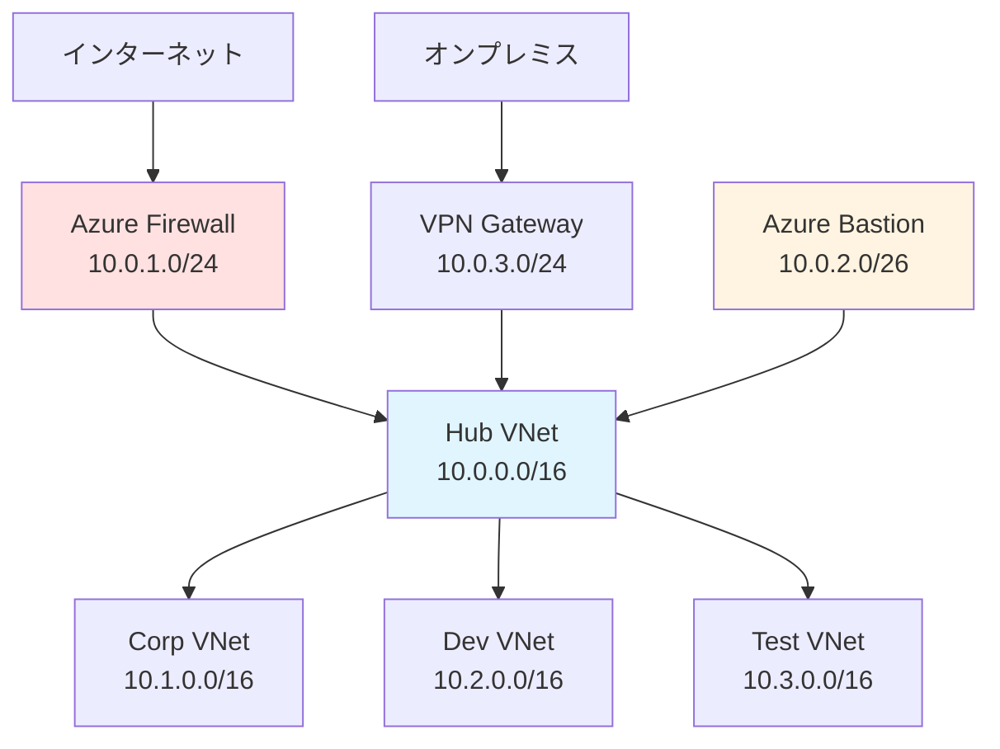

# 10. Hub-and-Spoke - ネットワークアーキテクチャ

!!! info "この章で学ぶこと"
    `main.connectivity.hub.and.spoke.virtual.network.tf`でHub-and-Spokeネットワークを構築する仕組みを学びます：

    1. Hub-and-Spokeって何？なぜ使う？
    2. main.connectivity.hub.and.spoke.virtual.network.tfの詳細解説
    3. Hub VNetの構成要素（Firewall、Bastion、Gateway）
    4. Spoke VNetとの接続
    5. 実践：新しいSpoke VNetの追加方法

---

## はじめに：Hub-and-Spokeって何？

### ネットワークの「ハブ空港」モデル

Hub-and-Spokeは、中央のHubを経由してすべての通信を制御するネットワーク構成です。

=== "空港の例"

    ```text title="航空ネットワーク"
    羽田空港（Hub）
    ├─→ 札幌（Spoke）
    ├─→ 大阪（Spoke）
    ├─→ 福岡（Spoke）
    └─→ 沖縄（Spoke）
    
    札幌 ⇄ 大阪の移動
    └→ 必ず羽田を経由
    ```

    ハブで集中管理！

=== "Azure Hub-and-Spoke"

    ```text title="ネットワーク構成"
    Hub VNet（中央集権）
    ├── Azure Firewall（トラフィック制御）
    ├── VPN Gateway（オンプレ接続）
    ├── Azure Bastion（安全なアクセス）
    └── Peering接続
        ├─→ Corp VNet（Spoke）
        ├─→ Dev VNet（Spoke）
        └─→ Test VNet（Spoke）
    
    Spoke間の通信
    └→ 必ずHubを経由
    ```

### なぜHub-and-Spokeを使う？

**メリット：**

- **集中管理**: Firewallなどのセキュリティ機器を1箇所に配置
- **コスト削減**: 共有リソースを複数Spokeで利用
- **セキュリティ**: すべてのトラフィックを監視・制御
- **拡張性**: Spokeを追加するだけで拡張可能

**デメリット：**

- **単一障害点**: Hubが止まるとすべて影響
- **帯域幅**: Hub経由なので帯域に注意
- **複雑さ**: 小規模環境では過剰

---

## Part 1: Hub-and-Spoke vs Virtual WAN

### 2つのアーキテクチャ

| 項目 | Hub-and-Spoke | Virtual WAN |
|------|---------------|-------------|
| **構成** | 自分でVNet作成 | Azureがマネージド |
| **複雑さ** | 手動設定が必要 | 自動化されている |
| **コスト** | 比較的安い | やや高い |
| **用途** | 中小規模 | グローバル展開 |

**このプロジェクトでは：**

```hcl title="どちらか選択"
connectivity_type = "hub_and_spoke_vnet"  # この章
connectivity_type = "virtual_wan"          # 次章
connectivity_type = "none"                 # 接続なし
```

---

## Part 2: main.connectivity.hub.and.spoke.virtual.network.tf の全体像

```hcl title="main.connectivity.hub.and.spoke.virtual.network.tf"
module "hub_and_spoke_vnet" {
  source  = "Azure/avm-ptn-alz-connectivity-hub-and-spoke-vnet/azurerm"
  version = "0.16.8"

  count = local.connectivity_hub_and_spoke_vnet_enabled ? 1 : 0

  hub_and_spoke_networks_settings = local.hub_and_spoke_networks_settings
  hub_virtual_networks            = local.hub_virtual_networks
  enable_telemetry                = var.enable_telemetry
  tags                            = coalesce(module.config.outputs.connectivity_tags, module.config.outputs.tags)

  providers = {
    azurerm = azurerm.connectivity
    azapi   = azapi.connectivity
  }
}
```

**たった15行！** でも強力なモジュールです。

---

## Part 3: コードを詳しく見ていく

### 3-1: モジュールの基本設定

```hcl
module "hub_and_spoke_vnet" {
  source  = "Azure/avm-ptn-alz-connectivity-hub-and-spoke-vnet/azurerm"
  version = "0.16.8"
```

**何してる？**

Azure公式のHub-and-Spokeパターンモジュールを使用。

**このモジュールが作成するリソース：**

- Hub Virtual Network
- Azure Firewall（オプション）
- Azure Bastion（オプション）
- VPN/ExpressRoute Gateway（オプション）
- VNet Peering（自動）
- Route Tables（自動）

### 3-2: 条件付き作成

```hcl
count = local.connectivity_hub_and_spoke_vnet_enabled ? 1 : 0
```

**何してる？**

`connectivity_type`の設定に応じて作成するか決定。

**locals.tfでの定義：**

```hcl title="locals.tf（抜粋）"
locals {
  connectivity_hub_and_spoke_vnet_enabled = var.connectivity_type == "hub_and_spoke_vnet"
}
```

**動作：**

```hcl title="Hub-and-Spokeを使う場合"
connectivity_type = "hub_and_spoke_vnet"
→ count = 1 → モジュール実行
```

```hcl title="Virtual WANを使う場合"
connectivity_type = "virtual_wan"
→ count = 0 → モジュール実行しない
```

### 3-3: ネットワーク設定

```hcl
hub_and_spoke_networks_settings = local.hub_and_spoke_networks_settings
hub_virtual_networks            = local.hub_virtual_networks
```

**locals.tfでの構築：**

```hcl title="locals.tf（抜粋）"
locals {
  hub_and_spoke_networks_settings = merge(
    module.config.outputs.hub_and_spoke_networks_settings,
    local.resource_groups
  )
  hub_virtual_networks = (merge(
    { vnets = module.config.outputs.hub_virtual_networks },
    local.resource_groups
  )).vnets
}
```

**何をしてる？**

1. `module.config.outputs`からテンプレート置換済みの設定を取得
2. `local.resource_groups`（作成済みのリソースグループ）とマージ
3. 依存関係を明示的に作る

### 3-4: タグの設定

```hcl
tags = coalesce(module.config.outputs.connectivity_tags, module.config.outputs.tags)
```

**優先順位：**

1. `connectivity_tags`: 接続リソース専用タグ
2. `tags`: グローバルタグ

### 3-5: プロバイダー指定

```hcl
providers = {
  azurerm = azurerm.connectivity
  azapi   = azapi.connectivity
}
```

**2つのプロバイダー：**

**azurerm:**

通常のAzureリソース作成。

**azapi:**

ARMテンプレート直接操作（最新機能対応）。

---

## Part 4: Hub Virtual Networkの構成

### 基本構成

```hcl title="platform-landing-zone.auto.tfvars（例）"
hub_virtual_networks = {
  primary = {
    name                = "vnet-hub-$${starter_location_01}"
    resource_group_name = "rg-connectivity-$${starter_location_01}"
    location            = "$${starter_location_01}"
    address_space       = ["10.0.0.0/16"]
    
    # サブネット設定
    subnets = {
      # Azure Firewall用
      AzureFirewallSubnet = {
        name             = "AzureFirewallSubnet"
        address_prefixes = ["10.0.1.0/24"]
      }
      
      # Azure Bastion用
      AzureBastionSubnet = {
        name             = "AzureBastionSubnet"
        address_prefixes = ["10.0.2.0/26"]
      }
      
      # VPN Gateway用
      GatewaySubnet = {
        name             = "GatewaySubnet"
        address_prefixes = ["10.0.3.0/24"]
      }
    }
    
    # Azure Firewall設定
    firewall = {
      enabled = true
      name    = "fw-hub-$${starter_location_01}"
      sku_name = "AZFW_VNet"
      sku_tier = "Standard"
    }
    
    # Azure Bastion設定
    bastion = {
      enabled = true
      name    = "bas-hub-$${starter_location_01}"
      sku     = "Standard"
    }
    
    # VPN Gateway設定
    vpn_gateway = {
      enabled = true
      name    = "vpngw-hub-$${starter_location_01}"
      sku     = "VpnGw1"
    }
  }
}
```

---

## Part 5: 各コンポーネントの詳細

### 5-1: Azure Firewall

**役割：**

すべてのトラフィックを検査・制御。

**SKU比較：**

| SKU | 機能 | 用途 |
|-----|------|------|
| **Standard** | 基本的なファイアウォール | 一般的な使用 |
| **Premium** | TLS検査、IDPS | セキュリティ重視 |

**設定例：**

```hcl title="Firewall設定"
firewall = {
  enabled  = true
  name     = "fw-hub-japaneast"
  sku_name = "AZFW_VNet"
  sku_tier = "Standard"
  
  # ファイアウォールポリシー
  firewall_policy = {
    name = "fwpol-hub-japaneast"
    sku  = "Standard"
    
    # ルールコレクション
    rule_collection_groups = {
      internet_outbound = {
        priority = 100
        application_rules = [
          {
            name = "allow-microsoft"
            source_addresses = ["10.0.0.0/8"]
            protocols = [{
              type = "Https"
              port = 443
            }]
            destination_fqdns = [
              "*.microsoft.com",
              "*.windows.net"
            ]
          }
        ]
      }
    }
  }
}
```

### 5-2: Azure Bastion

**役割：**

VMへの安全なRDP/SSH接続。

**SKU比較：**

| SKU | 機能 | 用途 |
|-----|------|------|
| **Basic** | 基本的なRDP/SSH | 開発環境 |
| **Standard** | ファイル転送、ネイティブクライアント | 本番環境 |

**設定例：**

```hcl title="Bastion設定"
bastion = {
  enabled = true
  name    = "bas-hub-japaneast"
  sku     = "Standard"
  
  # Standard SKUの機能
  copy_paste_enabled     = true
  file_copy_enabled      = true
  shareable_link_enabled = false
  tunneling_enabled      = true
}
```

**メリット：**

- パブリックIPが不要
- NSGでRDP/SSHポートを開ける必要なし
- MFAとAzure ADの統合

### 5-3: VPN Gateway

**役割：**

オンプレミスとの接続。

**SKU比較：**

| SKU | 帯域幅 | 用途 |
|-----|--------|------|
| **VpnGw1** | 650 Mbps | 小規模 |
| **VpnGw2** | 1 Gbps | 中規模 |
| **VpnGw3** | 1.25 Gbps | 大規模 |

**設定例：**

```hcl title="VPN Gateway設定"
vpn_gateway = {
  enabled = true
  name    = "vpngw-hub-japaneast"
  sku     = "VpnGw1"
  
  # BGP設定
  bgp_settings = {
    asn = 65515
  }
  
  # ローカルネットワークゲートウェイ
  local_network_gateways = {
    onprem = {
      name            = "lng-onprem"
      gateway_address = "203.0.113.1"
      address_space   = ["192.168.0.0/16"]
    }
  }
}
```

### 5-4: ExpressRoute Gateway（オプション）

**役割：**

専用線でオンプレミスと接続。

**設定例：**

```hcl title="ExpressRoute Gateway設定"
expressroute_gateway = {
  enabled = true
  name    = "ergw-hub-japaneast"
  sku     = "Standard"
}
```

---

## Part 6: Route Tablesの自動設定

### 自動生成されるルート

**Hub → Spoke:**

```text
宛先: 10.1.0.0/16 (Spoke VNet)
次ホップ: VNet Peering
```

**Spoke → Hub:**

```text
宛先: 0.0.0.0/0 (インターネット)
次ホップ: Azure Firewall (10.0.1.4)
```

**Spoke → Spoke:**

```text
宛先: 10.2.0.0/16 (別のSpoke)
次ホップ: Azure Firewall経由
```

### Route Tableの例

```hcl title="自動生成されるルート"
route_table "rt-spoke-corp" {
  route "to-internet" {
    address_prefix         = "0.0.0.0/0"
    next_hop_type          = "VirtualAppliance"
    next_hop_in_ip_address = "10.0.1.4"  # Firewall IP
  }
  
  route "to-spoke-dev" {
    address_prefix         = "10.2.0.0/16"
    next_hop_type          = "VirtualAppliance"
    next_hop_in_ip_address = "10.0.1.4"
  }
}
```

---

## Part 7: 実践 - 新しいSpoke VNetの追加

### シナリオ: 開発環境用のSpoke追加

**要件：**

- 名前: `vnet-dev-japaneast`
- アドレス空間: `10.2.0.0/16`
- Hubと自動接続

### 手順1: Spoke VNetの定義

```hcl title="platform-landing-zone.auto.tfvars"
hub_and_spoke_networks_settings = {
  spoke_virtual_networks = {
    dev = {
      name                = "vnet-dev-$${starter_location_01}"
      resource_group_name = "rg-dev-$${starter_location_01}"
      location            = "$${starter_location_01}"
      address_space       = ["10.2.0.0/16"]
      
      subnets = {
        default = {
          name             = "subnet-default"
          address_prefixes = ["10.2.1.0/24"]
        }
        web = {
          name             = "subnet-web"
          address_prefixes = ["10.2.2.0/24"]
        }
      }
    }
  }
}
```

### 手順2: Terraform実行

```bash
terraform plan
```

**作成されるリソース：**

```text
+ VNet: vnet-dev-japaneast
+ Subnet: subnet-default
+ Subnet: subnet-web
+ VNet Peering: vnet-dev → vnet-hub
+ VNet Peering: vnet-hub → vnet-dev
+ Route Table: rt-dev
+ Route: 0.0.0.0/0 → Firewall
```

```bash
terraform apply
```

### 手順3: 接続の確認

```bash
# Peering確認
az network vnet peering list \
  --resource-group rg-connectivity-japaneast \
  --vnet-name vnet-hub-japaneast
```

**出力例：**
```json
{
  "name": "peer-to-vnet-dev",
  "peeringState": "Connected",
  "remoteVirtualNetwork": {
    "id": "/subscriptions/.../vnet-dev-japaneast"
  }
}
```

---

## Part 8: よくあるパターン

### パターン1: Firewall無効化（開発環境）

```hcl title="コスト削減"
hub_virtual_networks = {
  primary = {
    # ...
    firewall = {
      enabled = false  # Firewallなし
    }
  }
}
```

### パターン2: マルチリージョン

```hcl title="2リージョン構成"
hub_virtual_networks = {
  primary = {
    name     = "vnet-hub-$${starter_location_01}"
    location = "$${starter_location_01}"
    # ...
  }
  secondary = {
    name     = "vnet-hub-$${starter_location_02}"
    location = "$${starter_location_02}"
    # ...
  }
}
```

### パターン3: Private Endpoint用サブネット

```hcl title="Private Endpoint専用サブネット"
subnets = {
  private-endpoints = {
    name             = "subnet-private-endpoints"
    address_prefixes = ["10.0.10.0/24"]
    
    # Private Endpoint用設定
    private_endpoint_network_policies_enabled = false
  }
}
```

### パターン4: カスタムDNS

```hcl title="カスタムDNSサーバー"
hub_virtual_networks = {
  primary = {
    # ...
    dns_servers = ["10.0.5.4", "10.0.5.5"]
  }
}
```

---

## Part 9: トラブルシューティング

### 問題1: Spoke間で通信できない

**原因:**

Route TableでFirewall経由のルートが設定されていない。

**確認：**

```bash
az network route-table route list \
  --resource-group rg-dev-japaneast \
  --route-table-name rt-dev
```

**解決：**

モジュールが自動設定するので、通常は問題なし。カスタムルートを追加した場合は確認。

### 問題2: Bastionから接続できない

**原因:**

VMのNSGでインバウンドを許可していない。

**解決：**

```hcl title="NSGルール"
security_rule {
  name                       = "allow-bastion"
  priority                   = 100
  direction                  = "Inbound"
  access                     = "Allow"
  protocol                   = "Tcp"
  source_port_range          = "*"
  destination_port_ranges    = ["22", "3389"]
  source_address_prefix      = "10.0.2.0/26"  # Bastion subnet
  destination_address_prefix = "*"
}
```

### 問題3: Firewallでブロックされる

**原因:**

Firewallポリシーで許可ルールがない。

**確認：**

Azure Portal → Firewall → Logs → AzureFirewallApplicationRule

**解決：**

必要なルールを追加。

---

## まとめ

### Hub-and-Spokeのポイント

!!! success "このアーキテクチャの役割"
    **4つの主要機能：**
    
    1. **Hub VNet**: 中央集権的なネットワークハブ
    2. **Azure Firewall**: トラフィックの検査・制御
    3. **Azure Bastion**: 安全なVM接続
    4. **VPN/ExpressRoute**: オンプレミス接続

### 主要コンポーネント

| コンポーネント | 必須 | 用途 |
|---------------|------|------|
| **Hub VNet** | ✅ 必須 | 中央ハブ |
| **Azure Firewall** | オプション | トラフィック制御 |
| **Azure Bastion** | オプション | 安全なアクセス |
| **VPN Gateway** | オプション | オンプレ接続（VPN） |
| **ExpressRoute** | オプション | オンプレ接続（専用線） |

### アーキテクチャ図



---

## 次のステップ

Hub-and-Spokeアーキテクチャを理解しましたか？

次は[11_Virtual_WAN.md](./11_Virtual_WAN.md)に進んで、  
`main.connectivity.virtual.wan.tf`でVirtual WANの構築方法を学びましょう。

**所要時間**: 50分  
**難易度**: ★★★★★  
**次**: [11_Virtual_WAN.md](./11_Virtual_WAN.md)
