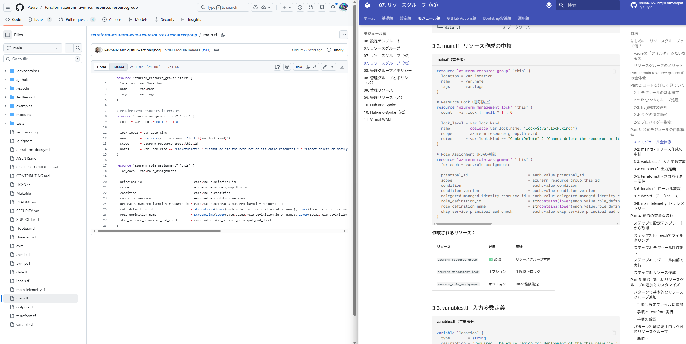

# 10. リソースグループ - 基盤の作成 📦


!!! info "この章で学ぶこと"
    `main.resource.groups.tf`でリソースグループを作成する仕組みを学びます：

    1. 📦リソースグループって何？
    2. 📝main.resource.groups.tfの解説
    3. 🏗️公式モジュールの内部構造（完全解説）
    4. 🔁for_eachの活用方法
    5. 🛠️実践：新しいリソースグループの追加方法

---

## はじめに：リソースグループって何？📦

### 🗂️Azureの「フォルダ」みたいなもの

リソースグループは、Azureリソースをまとめて管理する「箱」です。

=== "例：会社の組織"

    ```text title="組織構造"
    会社
    ├── 営業部（リソースグループ）
    │   ├── 営業システム（VM）
    │   └── 顧客DB（Database）
    ├── 開発部（リソースグループ）
    │   ├── 開発サーバー（VM）
    │   └── テストDB（Database）
    └── 総務部（リソースグループ）
        ├── 給与システム（VM）
        └── 人事DB（Database）
    ```

    部署ごとに管理！✨

=== "Azure Landing Zonesの構成"

    ```text title="リソースグループ構成"
    Azure Subscription
    ├── rg-connectivity-japaneast（接続用）
    │   ├── VNet（仮想ネットワーク）
    │   ├── Firewall（ファイアウォール）
    │   └── Bastion（踏み台）
    ├── rg-management-japaneast（管理用）
    │   ├── Log Analytics
    │   └── Automation Account
    └── rg-identity-japaneast（ID管理用）
        └── Domain Controller
    ```

---

### 🌟リソースグループのメリット

- **まとめて管理**: 関連リソースを1箇所に📦
- **一括削除**: リソースグループごと削除可能🗑️
- **タグ管理**: コスト管理や分類🏷️
- **RBAC**: アクセス権限の設定🔑

---

### 📝どこで定義するの？

リソースグループは `platform-landing-zone.auto.tfvars` で定義します。

```hcl title="platform-landing-zone.auto.tfvars（抜粋）"
connectivity_resource_groups = {
  ddos = {
    name     = "$${ddos_resource_group_name}"
    location = "$${starter_location_01}"
    settings = {
      enabled = "$${ddos_protection_plan_enabled}"
    }
  }
  vnet_primary = {
    name     = "$${connectivity_hub_primary_resource_group_name}"
    location = "$${starter_location_01}"
    settings = {
      enabled = true
    }
  }
  vnet_secondary = {
    name     = "$${connectivity_hub_secondary_resource_group_name}"
    location = "$${starter_location_02}"
    settings = {
      enabled = true
    }
  }
  dns = {
    name     = "$${dns_resource_group_name}"
    location = "$${starter_location_01}"
    settings = {
      enabled = "$${primary_private_dns_zones_enabled}"
    }
  }
}
```

**ポイント**:

- `$${変数名}`: テンプレート変数（Chapter 09で解説した置換システム）
- `enabled`: true/falseで作成可否を制御
- 4種類のリソースグループを定義：ddos、vnet_primary、vnet_secondary、dns

**処理の流れ**:

```
1. platform-landing-zone.auto.tfvars で定義
  ↓
2. modules/config-templating で変数置換
  ↓
3. main.resource.groups.tf で作成
```

---

## 🏗️Part 1: main.resource.groups.tf の全体像

```hcl title="main.resource.groups.tf"
module "resource_groups" {
  source  = "Azure/avm-res-resources-resourcegroup/azurerm"
  version = "0.2.1"

  for_each = { for key, value in module.config.outputs.connectivity_resource_groups : key => value if try(value.settings.enabled, true) }

  name             = each.value.name
  location         = each.value.location
  enable_telemetry = var.enable_telemetry
  tags             = try(each.value.tags, null) == null ? module.config.outputs.tags : each.value.tags

  providers = {
    azurerm = azurerm.connectivity
  }
}
```

**たった15行！** でも強力な公式モジュールを使っています。💪

---

## 🔍Part 2: コードを詳しく見ていく

### 🧩2-1: モジュールの基本設定

```hcl
module "resource_groups" {
  source  = "Azure/avm-res-resources-resourcegroup/azurerm"
  version = "0.2.1"
```

**何してる？**

Azure公式の「Azure Verified Modules (AVM)」を使用。

**AVMとは：**

- Microsoftが公式にメンテナンスしているTerraformモジュール
- ベストプラクティスに基づいた実装
- バージョン管理されているので安全

**モジュールの構成：**

| ファイル | 役割 |
|---------|------|
| `main.tf` | リソース作成 |
| `variables.tf` | 入力変数定義 |
| `outputs.tf` | 出力定義 |
| `terraform.tf` | プロバイダー要件 |

---

### 🔁2-2: for_eachでループ処理

```hcl
for_each = { for key, value in module.config.outputs.connectivity_resource_groups : key => value if try(value.settings.enabled, true) }
```

**何してる？**

`connectivity_resource_groups`から有効なリソースグループだけを選んでループ。

**処理の流れ：**

1. `module.config.outputs.connectivity_resource_groups`を取得
2. `for key, value in ...`でループ
3. `if try(value.settings.enabled, true)`でフィルタリング
4. `{ key => value }`形式のマップを作成

**具体例：**

```hcl title="入力データ（connectivity_resource_groups）"
{
  "connectivity" = {
    name     = "rg-connectivity-japaneast"
    location = "japaneast"
    settings = { enabled = true }
  }
  "management" = {
    name     = "rg-management-japaneast"
    location = "japaneast"
    settings = { enabled = false }  # 無効
  }
}
```

**フィルタリング後：**

```hcl title="for_each結果"
{
  "connectivity" = {
    name     = "rg-connectivity-japaneast"
    location = "japaneast"
    settings = { enabled = true }
  }
  # "management"は除外される
}
```

---

### 🛡️2-3: try()関数の役割

```hcl
if try(value.settings.enabled, true)
```

**何してる？**

`value.settings.enabled`が存在しない場合、`true`をデフォルト値として使う。

**動作：**

```hcl title="パターン1: enabledが定義されている"
{
  settings = { enabled = false }
}
→ false（明示的に無効）
```

```hcl title="パターン2: enabledが定義されていない"
{
  # settingsがない
}
→ true（デフォルトで有効）
```

---

### 🏷️2-4: タグの優先順位

```hcl
tags = try(each.value.tags, null) == null ? module.config.outputs.tags : each.value.tags
```

**何してる？**

リソースグループ固有のタグがなければ、グローバルタグを使う。

**優先順位：**

1. `each.value.tags`: リソースグループ固有のタグ
2. `module.config.outputs.tags`: グローバルタグ

### ☁️2-5: プロバイダー指定

---

```hcl
providers = {
  azurerm = azurerm.connectivity
}
```

**何してる？**

`connectivity`サブスクリプション用のプロバイダーを使用。

---

## 🏗️Part 3: 公式モジュールの内部構造

### 🧩3-1: モジュール全体像

**GitHubリポジトリ：**

https://github.com/Azure/terraform-azurerm-avm-res-resources-resourcegroup


ここからは公式のモジュールを開きながら見ていきましょう。こんな感じ↓


**主要ファイル：**

```text
terraform-azurerm-avm-res-resources-resourcegroup/
├── main.tf                   # リソース定義
├── variables.tf              # 入力変数
├── outputs.tf                # 出力
├── terraform.tf              # プロバイダー要件
├── locals.tf                 # ローカル変数
├── main.telemetry.tf         # テレメトリー
└── data.tf                   # データソース
```

---

### 🏗️3-2: main.tf - リソース作成の中核

```hcl title="main.tf（完全版）"
resource "azurerm_resource_group" "this" {
  location = var.location
  name     = var.name
  tags     = var.tags
}

# Resource Lock（削除防止）
resource "azurerm_management_lock" "this" {
  count = var.lock != null ? 1 : 0

  lock_level = var.lock.kind
  name       = coalesce(var.lock.name, "lock-${var.lock.kind}")
  scope      = azurerm_resource_group.this.id
  notes      = var.lock.kind == "CanNotDelete" ? "Cannot delete the resource or its child resources." : "Cannot delete or modify the resource or its child resources."
}

# Role Assignment（RBAC権限）
resource "azurerm_role_assignment" "this" {
  for_each = var.role_assignments

  principal_id                           = each.value.principal_id
  scope                                  = azurerm_resource_group.this.id
  condition                              = each.value.condition
  condition_version                      = each.value.condition_version
  delegated_managed_identity_resource_id = each.value.delegated_managed_identity_resource_id
  role_definition_id                     = strcontains(lower(each.value.role_definition_id_or_name), lower(local.role_definition_resource_substring)) ? "/subscriptions/${data.azurerm_subscription.current.subscription_id}${each.value.role_definition_id_or_name}" : null
  role_definition_name                   = strcontains(lower(each.value.role_definition_id_or_name), lower(local.role_definition_resource_substring)) ? null : each.value.role_definition_id_or_name
  skip_service_principal_aad_check       = each.value.skip_service_principal_aad_check
}
```

**作成されるリソース：**

| リソース | 必須 | 用途 |
|---------|------|------|
| `azurerm_resource_group` | ✅ 必須 | リソースグループ本体 |
| `azurerm_management_lock` | オプション | 削除防止ロック |
| `azurerm_role_assignment` | オプション | RBAC権限設定 |

---

### 📝3-3: variables.tf - 入力変数定義

```hcl title="variables.tf（主要部分）"
variable "location" {
  type        = string
  description = "Required. The Azure region for deployment of the this resource."
  nullable    = false
}

variable "name" {
  type        = string
  description = "Required. The name of the this resource."

  validation {
    condition     = can(regex("^[a-zA-Z0-9_().-]{1,89}[a-zA-Z0-9_()-]$", var.name))
    error_message = <<ERROR_MESSAGE
    The resource group name must meet the following requirements:
    - `Between 1 and 90 characters long.` 
    - `Can only contain Alphanumerics, underscores, parentheses, hyphens, periods.`
    - `Cannot end in a period`
    ERROR_MESSAGE
  }
}

variable "enable_telemetry" {
  type        = bool
  default     = true
  description = <<DESCRIPTION
This variable controls whether or not telemetry is enabled for the module.
For more information see <https://aka.ms/avm/telemetryinfo>.
If it is set to false, then no telemetry will be collected.
DESCRIPTION
  nullable    = false
}

variable "lock" {
  type = object({
    kind = string
    name = optional(string, null)
  })
  default     = null
  description = <<DESCRIPTION
  Controls the Resource Lock configuration for this resource. The following properties can be specified:
  
  - `kind` - (Required) The type of lock. Possible values are `\"CanNotDelete\"` and `\"ReadOnly\"`.
  - `name` - (Optional) The name of the lock. If not specified, a name will be generated based on the `kind` value. Changing this forces the creation of a new resource.
  DESCRIPTION

  validation {
    condition     = var.lock != null ? contains(["CanNotDelete", "ReadOnly"], var.lock.kind) : true
    error_message = "Lock kind must be either `\"CanNotDelete\"` or `\"ReadOnly\"`."
  }
}

variable "role_assignments" {
  type = map(object({
    role_definition_id_or_name             = string
    principal_id                           = string
    description                            = optional(string, null)
    skip_service_principal_aad_check       = optional(bool, false)
    condition                              = optional(string, null)
    condition_version                      = optional(string, null)
    delegated_managed_identity_resource_id = optional(string, null)
    principal_type                         = optional(string, null)
  }))
  default     = {}
  description = <<DESCRIPTION
Optional. A map of role assignments to create on this resource. The map key is deliberately arbitrary to avoid issues where map keys maybe unknown at plan time.

- `role_definition_id_or_name` - (Required) The ID or name of the role definition to assign to the principal.
- `principal_id` - (Required) The ID of the principal to assign the role to.
- `description` - (Optional) The description of the role assignment.
- `skip_service_principal_aad_check` - (Optional) If set to true, skips the Azure Active Directory check for the service principal in the tenant. Defaults to false.
- `condition` - (Optional) The condition which will be used to scope the role assignment.
- `condition_version` - (Optional) The version of the condition syntax. Valid values are '2.0'.
- `delegated_managed_identity_resource_id` - (Optional) The delegated Azure Resource Id which contains a Managed Identity. Changing this forces a new resource to be created. NOTE:
this field is only used in cross tenant scenario.
DESCRIPTION
  nullable    = false

  validation {
    condition = alltrue(
      [for role in var.role_assignments :
        can(regex("^/providers/Microsoft\\.Authorization/roleDefinitions/[0-9a-fA-F-]+$", role.role_definition_id_or_name))
        ||
        can(regex("^[[:alpha:]]+?", role.role_definition_id_or_name))
      ]
    )
    error_message = <<ERROR_MESSAGE
        role_definition_id_or_name must have the following format: 
         - Using the role definition Id : `/providers/Microsoft.Authorization/roleDefinitions/<role_guid>`
         - Using the role name: Reader | "Storage Blob Data Reader"
      ERROR_MESSAGE
  }
}

variable "tags" {
  type        = map(string)
  default     = null
  description = "(Optional) Tags of the resource."
}
```

**変数の種類：**

| 変数 | 必須 | デフォルト | 用途 |
|------|------|-----------|------|
| `location` | ✅ 必須 | なし | Azureリージョン |
| `name` | ✅ 必須 | なし | リソースグループ名 |
| `enable_telemetry` | オプション | `true` | テレメトリー有効化 |
| `lock` | オプション | `null` | 削除防止ロック |
| `role_assignments` | オプション | `{}` | RBAC権限 |
| `tags` | オプション | `null` | タグ |

---

### 📤3-4: outputs.tf - 出力定義

```hcl title="outputs.tf"
output "name" {
  description = "The name of the resource group"
  value       = azurerm_resource_group.this.name
}

output "resource" {
  description = "This is the full output for the resource group."
  value       = azurerm_resource_group.this
}

output "resource_id" {
  description = "The resource Id of the resource group"
  value       = azurerm_resource_group.this.id
}
```

**出力される情報：**

| 出力 | 内容 | 用途 |
|------|------|------|
| `name` | リソースグループ名 | 他モジュールで参照 |
| `resource` | リソース全体 | すべてのプロパティにアクセス |
| `resource_id` | リソースID | 依存関係の指定 |

---

### ☁️3-5: terraform.tf - プロバイダー要件

```hcl title="terraform.tf"
terraform {
  required_version = ">= 1.9, < 2.0"

  required_providers {
    azapi = {
      source  = "Azure/azapi"
      version = "~> 2.4"
    }
    azurerm = {
      source  = "hashicorp/azurerm"
      version = ">= 3.71, < 5.0.0"
    }
    modtm = {
      source  = "azure/modtm"
      version = "~> 0.3"
    }
    random = {
      source  = "hashicorp/random"
      version = "~> 3.5"
    }
  }
}
```

**必要なプロバイダー：**

| プロバイダー | バージョン | 用途 |
|------------|-----------|------|
| `azurerm` | >= 3.71, < 5.0.0 | Azure管理 |
| `azapi` | ~> 2.4 | ARM API直接操作 |
| `modtm` | ~> 0.3 | テレメトリー |
| `random` | ~> 3.5 | ランダム値生成 |

---

### 🧮3-6: locals.tf - ローカル変数

```hcl title="locals.tf"
locals {
  role_definition_resource_substring = "/providers/Microsoft.Authorization/roleDefinitions"
}
```

**役割：**

Role Definition IDの判定に使用。

---

### 🔎3-7: data.tf - データソース

```hcl title="data.tf"
data "azurerm_subscription" "current" {}
```

**役割：**

現在のサブスクリプション情報を取得。

---

### 📡3-8: main.telemetry.tf - テレメトリー

```hcl title="main.telemetry.tf（抜粋）"
data "modtm_module_source" "telemetry" {
  count = var.enable_telemetry ? 1 : 0

  module_path = path.module
}

resource "random_uuid" "telemetry" {
  count = var.enable_telemetry ? 1 : 0
}

resource "modtm_telemetry" "telemetry" {
  count = var.enable_telemetry ? 1 : 0

  tags = merge({
    subscription_id = one(data.azapi_client_config.telemetry).subscription_id
    tenant_id       = one(data.azapi_client_config.telemetry).tenant_id
    module_source   = one(data.modtm_module_source.telemetry).module_source
    module_version  = one(data.modtm_module_source.telemetry).module_version
    random_id       = one(random_uuid.telemetry).result
  }, { location = local.main_location })
}
```

**役割：**

Microsoftにモジュール使用状況を送信（匿名化）。

---

## 🚀Part 4: 動作の完全な流れ

### 1️⃣ステップ1: 設定テンプレートから取得

```hcl title="module.config.outputs.connectivity_resource_groups"
{
  "connectivity" = {
    name     = "rg-connectivity-japaneast"
    location = "japaneast"
    tags = {
      environment = "production"
      purpose     = "connectivity"
    }
    settings = {
      enabled = true
    }
  }
}
```

---

### 2️⃣ステップ2: for_eachでフィルタリング

```hcl title="フィルタリング処理"
for_each = {
  for key, value in module.config.outputs.connectivity_resource_groups : 
    key => value 
    if try(value.settings.enabled, true)
}
```

**結果：**

```hcl
{
  "connectivity" = {
    name     = "rg-connectivity-japaneast"
    location = "japaneast"
    tags = { ... }
    settings = { enabled = true }
  }
}
```

---

### 3️⃣ステップ3: モジュール呼び出し

```hcl title="実際の呼び出し"
module "resource_groups" {
  source  = "Azure/avm-res-resources-resourcegroup/azurerm"
  version = "0.2.1"

  # connectivity用
  name             = "rg-connectivity-japaneast"
  location         = "japaneast"
  enable_telemetry = true
  tags = {
    environment = "production"
    purpose     = "connectivity"
  }

  providers = {
    azurerm = azurerm.connectivity
  }
}
```

---

### 4️⃣ステップ4: モジュール内部で実行

```hcl title="main.tf内で実行"
resource "azurerm_resource_group" "this" {
  location = "japaneast"
  name     = "rg-connectivity-japaneast"
  tags = {
    environment = "production"
    purpose     = "connectivity"
  }
}
```

---

### 5️⃣ステップ5: リソース作成

```bash
# Terraform実行
terraform apply
```

**作成されるリソース：**

```text
+ azurerm_resource_group.connectivity
  name     = "rg-connectivity-japaneast"
  location = "japaneast"
```

---

## 🛠️Part 5: 実践 - 新しいリソースグループの追加とカスタマイズ

### 📝パターン1: 基本的なリソースグループ追加

**要件：**📝

- 名前: `rg-security-japaneast`
- リージョン: `japaneast`
- カスタムタグ: 追加

#### 手順1: 設定ファイルに追加🛠️

```hcl title="platform-landing-zone.auto.tfvars"
connectivity_resource_groups = {
  connectivity = {
    name     = "rg-connectivity-$${starter_location_01}"
    location = "$${starter_location_01}"
  }
  
  security = {  # 新規追加
    name     = "rg-security-$${starter_location_01}"
    location = "$${starter_location_01}"
    tags = {
      purpose = "security"
    }
  }
}
```

#### 手順2: Terraform実行🚀

```bash
terraform plan
```

**出力：**

```text
+ module.resource_groups["security"]
  + azurerm_resource_group.this
    name     = "rg-security-japaneast"
    location = "japaneast"
```

```bash
terraform apply
```

#### 手順3: 確認🔍

```bash
az group show --name rg-security-japaneast
```

**出力：**

```json
{
  "id": "/subscriptions/.../resourceGroups/rg-security-japaneast",
  "location": "japaneast",
  "name": "rg-security-japaneast",
  "tags": {
    "purpose": "security"
  }
}
```

---

### パターン2: 削除防止ロック付きリソースグループ🔒

**要件：**📝

- 名前: `rg-production-japaneast`
- リージョン: `japaneast`
- 削除防止ロック: 有効

!!! warning "main.resource.groups.tf の修正が必要"
    現在の`main.resource.groups.tf`では`lock`パラメータを渡していません。
    
    以下の手順でmain.resource.groups.tfを修正してから、設定ファイルを変更します。

#### 手順1: main.resource.groups.tfを修正🛠️

```hcl title="main.resource.groups.tf（修正前）"
module "resource_groups" {
  source  = "Azure/avm-res-resources-resourcegroup/azurerm"
  version = "0.2.1"

  for_each = { for key, value in module.config.outputs.connectivity_resource_groups : key => value if try(value.settings.enabled, true) }

  name             = each.value.name
  location         = each.value.location
  enable_telemetry = var.enable_telemetry
  tags             = try(each.value.tags, null) == null ? module.config.outputs.tags : each.value.tags

  providers = {
    azurerm = azurerm.connectivity
  }
}
```

**修正後：**

```hcl title="main.resource.groups.tf（修正後）"
module "resource_groups" {
  source  = "Azure/avm-res-resources-resourcegroup/azurerm"
  version = "0.2.1"

  for_each = { for key, value in module.config.outputs.connectivity_resource_groups : key => value if try(value.settings.enabled, true) }

  name             = each.value.name
  location         = each.value.location
  enable_telemetry = var.enable_telemetry
  tags             = try(each.value.tags, null) == null ? module.config.outputs.tags : each.value.tags
  
  # ロックパラメータを追加
  lock = try(each.value.lock, null)

  providers = {
    azurerm = azurerm.connectivity
  }
}
```

#### 手順2: 設定ファイルにロックを追加🔒

```hcl title="platform-landing-zone.auto.tfvars"
connectivity_resource_groups = {
  production = {
    name     = "rg-production-$${starter_location_01}"
    location = "$${starter_location_01}"
    lock = {
      kind = "CanNotDelete"
      name = "production-lock"
    }
  }
}
```

#### 手順3: Terraform実行🚀

```bash
terraform plan
```

**出力：**

```text
+ module.resource_groups["production"]
  + azurerm_resource_group.this
    name     = "rg-production-japaneast"
    location = "japaneast"
  
  + azurerm_management_lock.this[0]
    lock_level = "CanNotDelete"
    name       = "production-lock"
```

```bash
terraform apply
```

#### 手順4: ロックの確認🔍

```bash
az lock list --resource-group rg-production-japaneast
```

**出力：**

```json
[
  {
    "id": "/subscriptions/.../resourceGroups/rg-production-japaneast/providers/Microsoft.Authorization/locks/production-lock",
    "level": "CanNotDelete",
    "name": "production-lock",
    "notes": "Cannot delete the resource or its child resources."
  }
]
```

---

### パターン3: RBAC権限付きリソースグループ🛡️

**要件：**📝

- 名前: `rg-app-japaneast`
- リージョン: `japaneast`
- 開発者にContributor権限
- 閲覧者にReader権限

!!! warning "main.resource.groups.tf の修正が必要"
    `role_assignments`パラメータも現在は渡していません。

#### 手順1: main.resource.groups.tfを修正🛠️

```hcl title="main.resource.groups.tf（修正後）"
module "resource_groups" {
  source  = "Azure/avm-res-resources-resourcegroup/azurerm"
  version = "0.2.1"

  for_each = { for key, value in module.config.outputs.connectivity_resource_groups : key => value if try(value.settings.enabled, true) }

  name             = each.value.name
  location         = each.value.location
  enable_telemetry = var.enable_telemetry
  tags             = try(each.value.tags, null) == null ? module.config.outputs.tags : each.value.tags
  
  # ロックパラメータを追加
  lock = try(each.value.lock, null)
  
  # RBAC権限パラメータを追加
  role_assignments = try(each.value.role_assignments, {})

  providers = {
    azurerm = azurerm.connectivity
  }
}
```

#### 手順2: Principal IDを取得🆔

開発者と閲覧者のPrincipal IDを取得します。

```bash
# ユーザーのPrincipal ID取得
az ad user show --id developer@example.com --query id -o tsv

# サービスプリンシパルのPrincipal ID取得
az ad sp show --id <app-id> --query id -o tsv
```

#### 手順3: 設定ファイルに権限を追加🔑

```hcl title="platform-landing-zone.auto.tfvars"
connectivity_resource_groups = {
  app = {
    name     = "rg-app-$${starter_location_01}"
    location = "$${starter_location_01}"
    role_assignments = {
      developer = {
        role_definition_id_or_name = "Contributor"
        principal_id               = "xxxxxxxx-xxxx-xxxx-xxxx-xxxxxxxxxxxx"
        description                = "開発者権限"
      }
      reader = {
        role_definition_id_or_name = "Reader"
        principal_id               = "yyyyyyyy-yyyy-yyyy-yyyy-yyyyyyyyyyyy"
        description                = "閲覧者権限"
      }
    }
  }
}
```

#### 手順4: Terraform実行🚀

```bash
terraform plan
```

**出力：**

```text
+ module.resource_groups["app"]
  + azurerm_resource_group.this
    name     = "rg-app-japaneast"
    location = "japaneast"
  
  + azurerm_role_assignment.this["developer"]
    principal_id         = "xxxxxxxx-xxxx-xxxx-xxxx-xxxxxxxxxxxx"
    role_definition_name = "Contributor"
    scope                = "/subscriptions/.../resourceGroups/rg-app-japaneast"
  
  + azurerm_role_assignment.this["reader"]
    principal_id         = "yyyyyyyy-yyyy-yyyy-yyyy-yyyyyyyyyyyy"
    role_definition_name = "Reader"
    scope                = "/subscriptions/.../resourceGroups/rg-app-japaneast"
```

```bash
terraform apply
```

#### 手順5: 権限の確認🔍

```bash
az role assignment list --resource-group rg-app-japaneast --output table
```

**出力：**

```text
PrincipalName          Role         Scope
---------------------  -----------  ---------------------------------------
developer@example.com  Contributor  /subscriptions/.../rg-app-japaneast
viewer@example.com     Reader       /subscriptions/.../rg-app-japaneast
```

---

## まとめ📝

**リソースグループ作成の役割**：📦

1. **公式モジュール使用**: Azure Verified Modulesで安全・確実
2. **for_eachループ**: 複数リソースグループを効率的に作成
3. **フィルタリング**: `enabled`フラグで柔軟に制御

**モジュール構造**：🧩

- **main.resource.groups.tf**: ルートモジュールでfor_eachループ
- **main.tf**: 公式モジュール呼び出し
- **variables.tf**: 入力変数定義
- **outputs.tf**: 作成したリソースグループ情報を出力
- **terraform.tf**: プロバイダー要件定義
- **main.telemetry.tf**: テレメトリー送信（オプション）

**重要なポイント**：🌟

- for_eachで複数リソースグループを一括作成
- enabled = trueのものだけ作成（フィルタリング）
- 公式モジュールは内部でazurerm_resource_groupを呼び出す
- location、tagsなどのパラメータを柔軟に設定
- テレメトリーで使用状況を追跡（opt-out可能）


---

## 練習問題💡

理解度チェックです。📝

### 問題1❓
以下のfor_each式は、どのリソースグループを作成しますか？

```hcl
resource_groups = {
  connectivity = { enabled = true,  location = "japaneast" }
  management   = { enabled = true,  location = "japaneast" }
  identity     = { enabled = false, location = "japaneast" }
}

for_each = { for k, v in var.resource_groups : k => v if v.enabled }
```

### 問題2❓
Azure Verified Modulesを使うメリットを2つ挙げてください。

### 問題3❓
リソースグループの`lock`パラメータで設定できる2つのロックレベルは何ですか？

### 問題4❓
テレメトリーを無効化するには、どの変数を`false`に設定すれば良いですか？

---

## 練習問題の答え📝

### 答え1✅

作成されるリソースグループは**2つ**です：

- `connectivity`（enabled = true）✅
- `management`（enabled = true）✅
- `identity`（enabled = false）❌ 作成されない

`if v.enabled`のフィルタリングにより、`enabled = true`のものだけが`for_each`に渡されます。

### 答え2✅
Azure Verified Modulesのメリット：

1. **セキュリティと品質保証**：Microsoftが公式にレビュー・検証済み
2. **ベストプラクティス実装**：Azureの推奨設定が自動適用される
3. **継続的な更新**：Azure APIの変更に自動追従
4. **テスト済み**：本番環境で使える信頼性

### 答え3✅
リソースグループのロックレベルは2種類：

**1. CanNotDelete（削除防止）**：
- 読み取り・変更：✅ 可能
- 削除：❌ 不可能

**2. ReadOnly（読み取り専用）**：
- 読み取り：✅ 可能
- 変更・削除：❌ 不可能

本番環境では`CanNotDelete`を推奨（変更はできるけど誤削除は防ぐ）。

### 答え4✅
テレメトリーを無効化するには：

```hcl
enable_telemetry = false
```

を設定します。デフォルトは`true`で、Microsoftにモジュール使用状況が送信されます（個人情報は含まれない）。

---

次のChapterでは、管理グループとポリシーの構築を見ていきます。ALZの心臓部で、一番複雑だけど超重要なところだよ。💓

---

**所要時間**: 40分  
**難易度**: ★★★☆☆  
**前**: [09_設定テンプレート.md](./09_設定テンプレート.md)  
**次**: [11_管理グループとポリシー.md](./11_管理グループとポリシー.md)
