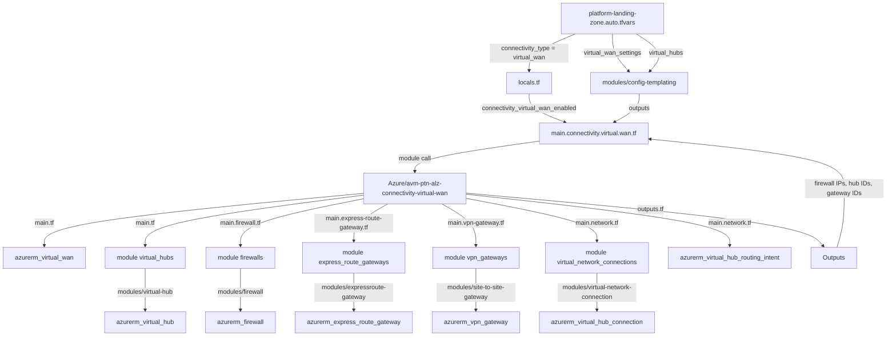

# Chapter 11: Virtual WAN ネットワーク構成

!!! info "この章で学ぶこと"
    Virtual WANの全体像を完全理解します：

    1. Virtual WAN vs Hub-and-Spokeの比較
    2. platform-landing-zone.auto.tfvarsの設定解説
    3. main.connectivity.virtual.wan.tfの解説
    4. Azure/avm-ptn-alz-connectivity-virtual-wan公式モジュール完全解説（9サブモジュール）
    5. virtual_hubs変数の500+行構造解説
    6. 実践パターン集（6パターン：最小構成～マルチリージョン）

## Virtual WANとHub-and-Spokeの違い

まず、前ChapterのHub-and-Spoke型と今回のVirtual WAN型の違いを整理しておきましょう。

### Hub-and-Spoke型の特徴

- **手動管理**: Hub VNetとSpoke VNetを自分で作成・管理
- **VNet Peering**: 各VNetを手動でPeering接続
- **小～中規模向け**: 数十～数百のVNet接続に適している
- **柔軟なカスタマイズ**: ネットワーク設定を細かく制御できる
- **コスト効率**: 小規模なら月額2～3万円程度から

### Virtual WAN型の特徴

- **マネージドサービス**: Microsoftが基盤を管理
- **自動メッシュ接続**: Hub間が自動的にMicrosoftバックボーン経由で接続
- **大規模グローバル向け**: 数千のVPN接続、複数リージョン展開に適している
- **シンプルな設定**: 複雑な設定が不要
- **高コスト**: 基本料金で月額5～6万円から（2 Capacity Unitの場合）

**どちらを選ぶ？**

- 小～中規模で日本国内中心 → **Hub-and-Spoke**
- 大規模、グローバル展開、多数のブランチ拠点 → **Virtual WAN**

## 全体のアーキテクチャ

Virtual WANの構成要素を見ておきましょう：

```
グローバル Virtual WAN (1つ)
  │
  ├─ Virtual Hub (東日本)
  │   ├─ VPN Gateway (On-premises接続)
  │   ├─ ExpressRoute Gateway (専用線接続)
  │   ├─ Azure Firewall (セキュリティ)
  │   ├─ VNet接続 (複数のSpoke VNet)
  │   ├─ Routing Intent (全トラフィック制御)
  │   └─ Sidecar VNet → Azure Bastion
  │
  └─ Virtual Hub (西日本)
      ├─ VPN Gateway
      ├─ ExpressRoute Gateway
      ├─ Azure Firewall
      ├─ VNet接続
      ├─ Routing Intent
      └─ Sidecar VNet → Azure Bastion

※ Hub間は自動的にMicrosoftバックボーンで接続
```

**重要な概念**:

- **Global Transit Hub**: 各リージョンのVirtual Hubが自動的にメッシュ接続
- **Routing Intent**: 全トラフィックをFirewall経由にできる
- **Sidecar VNet**: Virtual HubにはサブネットがないのでBastion用に別VNet作成

## Part 1: 設定ファイル（platform-landing-zone.auto.tfvars）

**重要な注意**：

実際のplatform-landing-zone.auto.tfvarsでは**Virtual WAN用の設定はコメントアウトされています**。このプロジェクトはHub-and-Spoke構成を採用しているためです。

Virtual WANを使う場合は、以下のように設定を変更します。

### connectivity_typeの設定

```hcl title="platform-landing-zone.auto.tfvars（抜粋）"
# 現在の設定（Hub-and-Spoke）
connectivity_type = "hub_and_spoke_vnet"

# Virtual WANを使う場合は以下に変更
# connectivity_type = "virtual_wan"
```

**何してる？**

- `hub_and_spoke_vnet`：Hub-and-Spoke型（Chapter 10、現在の設定）
- `virtual_wan`：Virtual WAN型（このChapter）
- この値で[locals.tf](../locals.tf)の`connectivity_virtual_wan_enabled`が決まる

### Virtual WAN用の設定（現在はコメントアウト）

実際のファイルには**Virtual WAN用の設定は含まれていません**。Hub-and-Spoke用の設定（`connectivity_resource_groups`、`hub_and_spoke_networks_settings`、`hub_virtual_networks`）のみが記述されています。

Virtual WANを使う場合は、以下の設定を追加する必要があります：

```hcl title="platform-landing-zone.auto.tfvars（追加が必要な設定例）"
# このプロジェクトには含まれていない設定例
virtual_wan_settings = {
  virtual_wan = {
    name                = "$${virtual_wan_name}"
    resource_group_name = "$${virtual_wan_resource_group_name}"
    location            = "$${starter_location_01}"
  }
  ddos_protection_plan = {
    name                = "$${ddos_protection_plan_name}"
    location            = "$${starter_location_01}"
    resource_group_name = "$${ddos_resource_group_name}"
  }
}

virtual_hubs = {
  primary = {
    location = "$${starter_location_01}"
    enabled_resources = {
      firewall                              = "$${primary_firewall_enabled}"
      firewall_policy                       = true
      virtual_network_gateway_express_route = "$${primary_virtual_network_gateway_express_route_enabled}"
      virtual_network_gateway_vpn           = "$${primary_virtual_network_gateway_vpn_enabled}"
      sidecar_virtual_network               = "$${primary_bastion_enabled}"
      bastion                               = "$${primary_bastion_enabled}"
      private_dns_zones                     = "$${primary_private_dns_zones_enabled}"
      private_dns_resolver                  = "$${primary_private_dns_resolver_enabled}"
    }
    hub = {
      name           = "$${primary_virtual_hub_name}"
      address_prefix = "$${primary_virtual_hub_address_prefix}"
      hub_routing_preference                 = "ExpressRoute"
      virtual_router_auto_scale_min_capacity = 2
    }
    # ... その他の詳細設定
  }
}
```

**注意**：

- 上記は**例**です。実際のファイルには含まれていません
- Virtual WANに切り替える場合は、`custom_replacements.names`にも対応する変数を追加する必要があります
- このドキュメントでは、Virtual WANの構造を理解するために解説を続けます
```

**何してる？**

- **virtual_wan**: グローバルなVirtual WANリソースの設定
  - `name`: Virtual WAN名（グローバルで1つ）
  - `location`: メインリージョン（東日本など）
  - `resource_group_name`: 配置するリソースグループ
- **ddos_protection_plan**: DDoS Protection Plan（オプション）
  - Sidecar VNetに適用される

### virtual_hubsの設定（最小構成）

```hcl title="platform-landing-zone.auto.tfvars（抜粋）"
virtual_hubs = {
  primary = {
    enabled_resources = {
      firewall                              = true
      firewall_policy                       = true
      virtual_network_gateway_express_route = true
      virtual_network_gateway_vpn           = true
      sidecar_virtual_network               = true
      bastion                               = true
      private_dns_zones                     = false
      private_dns_resolver                  = false
    }
    location = "japaneast"
    hub = {
      name           = "vhub-hub-japaneast-001"
      address_prefix = "10.0.0.0/23"
      hub_routing_preference                 = "ExpressRoute"
      virtual_router_auto_scale_min_capacity = 2
    }
  }
}
```

**何してる？**

- **enabled_resources**: どのリソースを作成するか制御
  - `firewall`: Azure Firewall作成
  - `firewall_policy`: Firewall Policy作成
  - `virtual_network_gateway_express_route`: ExpressRoute Gateway作成
  - `virtual_network_gateway_vpn`: VPN Gateway作成
  - `sidecar_virtual_network`: Bastion用Sidecar VNet作成
  - `bastion`: Azure Bastion作成
- **hub**: Virtual Hub本体の設定
  - `address_prefix`: Virtual Hubのアドレス空間（/23推奨 = 512 IP）
  - `hub_routing_preference`: ルーティング優先順位（ExpressRoute優先/VPN優先/AS Path優先）
  - `virtual_router_auto_scale_min_capacity`: 最小Capacity Unit（2～50、デフォルト2）

**Capacity Unitとコスト**:

- 1 Capacity Unit = 約2.7万円/月
- 2 Capacity Unit（最小） = 約5.4万円/月
- スループット: 1 Unit ≈ 500 Mbps

## Part 2: main.connectivity.virtual.wan.tfの解説

```hcl title="main.connectivity.virtual.wan.tf（全文）"
module "virtual_wan" {
  source  = "Azure/avm-ptn-alz-connectivity-virtual-wan/azurerm"
  version = "0.13.5"

  count = local.connectivity_virtual_wan_enabled ? 1 : 0

  virtual_wan_settings = module.config[0].outputs.virtual_wan_settings
  virtual_hubs         = module.config[0].outputs.virtual_hubs
  enable_telemetry     = var.enable_telemetry
  tags                 = coalesce(var.connectivity_tags, var.tags, {})

  providers = {
    azurerm.connectivity = azurerm.connectivity
  }

  depends_on = [module.resource_groups]
}
```

**何してる？**

- **count**: `connectivity_type = "virtual_wan"`の時だけ実行
- **パラメータ**:
  - `virtual_wan_settings`: [config-templatingモジュール](../../modules/config-templating/)から取得
  - `virtual_hubs`: 同じくconfig-templatingから取得（Virtual Hubの設定マップ）
  - `enable_telemetry`: テレメトリ送信の有無
  - `tags`: タグ（connectivity_tags優先、なければvar.tags）
- **provider**: 接続用サブスクリプションを使う（`azurerm.connectivity`）
- **depends_on**: リソースグループ作成後に実行

**Hub-and-Spokeとの違い**:

- Chapter 10と同じく、**ローカルラッパーモジュールなし**
- 直接公式モジュールを呼び出す
- パラメータは全て[config-templatingモジュール](../../modules/config-templating/)で処理

### locals.tfでの有効化判定

```hcl title="locals.tf（抜粋）"
connectivity_virtual_wan_enabled = var.connectivity_type == local.const.connectivity.virtual_wan
```

**何してる？**

- `connectivity_type`変数が`"virtual_wan"`の時だけtrue
- これでVirtual WAN型とHub-and-Spoke型を切り替え

## Part 3: Azure/avm-ptn-alz-connectivity-virtual-wan モジュール完全解説

ここからは公式モジュールの内部を完全に見ていきます。

**GitHubリポジトリ:**

https://github.com/Azure/terraform-azurerm-avm-ptn-alz-connectivity-virtual-wan


ここからは公式のモジュールを開きながら見ていきましょう。

### モジュール全体の構造

Virtual WANモジュールは以下の構成になっています：

```
terraform-azurerm-avm-ptn-alz-connectivity-virtual-wan/
├── main.tf                     # Virtual WAN本体とVirtual Hub
├── main.firewall.tf            # Azure Firewall統合
├── main.express-route-gateway.tf  # ExpressRoute Gateway
├── main.vpn-gateway.tf         # Site-to-Site VPN Gateway
├── main.p2s-vpn-gateway.tf     # Point-to-Site VPN Gateway
├── main.network.tf             # VNet接続とRouting Intent
├── variables.tf                # 入力変数定義
├── outputs.tf                  # 出力定義
├── locals.tf                   # ローカル変数処理
└── modules/                    # サブモジュール
    ├── virtual-wan/            # Virtual WANコア機能
    ├── virtual-hub/            # Virtual Hub作成
    ├── firewall/               # Firewall作成
    ├── virtual-network-connection/  # VNet接続
    ├── expressroute-gateway/   # ExpressRoute Gateway作成
    ├── site-to-site-gateway/   # S2S VPN Gateway作成
    └── (他のサブモジュール)
```

### 作成されるリソース一覧

このモジュールで作成される主要なAzureリソース：

**ネットワークコア:**

- `azurerm_virtual_wan` - グローバルVirtual WAN
- `azurerm_virtual_hub` - リージョンごとのVirtual Hub（Virtual Router）
- `azurerm_virtual_hub_route_table` - カスタムルートテーブル
- `azurerm_virtual_hub_routing_intent` - Routing Intent（全トラフィック制御）

**Gateway:**

- `azurerm_vpn_gateway` - Site-to-Site VPN Gateway（スケール1～20ユニット）
- `azurerm_express_route_gateway` - ExpressRoute Gateway（スケール1～20ユニット）
- `azurerm_point_to_site_vpn_gateway` - Point-to-Site VPN Gateway
- `azurerm_vpn_site` - VPN Site定義（On-premises拠点）
- `azurerm_vpn_gateway_connection` - VPN接続

**セキュリティ:**

- `azurerm_firewall` - Azure Firewall（AZFW_Hub SKU）
- 依存: `azurerm_firewall_policy` - Firewall Policy（別モジュール）

**VNet接続:**

- `azurerm_virtual_hub_connection` - Spoke VNetとVirtual Hubの接続
- `azurerm_virtual_network` - Sidecar VNet（Bastion用）
- `azurerm_bastion_host` - Azure Bastion（Sidecar VNet内）

**その他:**

- `azurerm_resource_group` - リソースグループ（オプション）
- `azurerm_private_dns_zone` - Private DNS Zone（オプション）
- `azurerm_private_dns_resolver` - Private DNS Resolver（オプション）

### main.tf: Virtual WAN本体の作成

[modules/virtual-wan/main.tf](https://github.com/Azure/terraform-azurerm-avm-ptn-alz-connectivity-virtual-wan/blob/main/modules/virtual-wan/main.tf)の主要部分を見ていきます。

#### リソースグループ作成（オプション）

```hcl
resource "azurerm_resource_group" "rg" {
  count = var.create_resource_group ? 1 : 0

  location = var.location
  name     = var.resource_group_name
  tags     = try(merge(var.resource_group_tags, var.tags), var.tags)
}

locals {
  resource_group_name = var.create_resource_group ? azurerm_resource_group.rg[0].name : var.resource_group_name
}
```

**何してる？**

- `create_resource_group = true`の時だけリソースグループ作成
- 既存のリソースグループを使う場合は`false`にする
- locals.resource_group_nameで作成/既存を統一的に扱う

#### Virtual WAN本体の作成

```hcl
resource "azurerm_virtual_wan" "virtual_wan" {
  location                          = var.location
  name                              = var.virtual_wan_name
  resource_group_name               = local.resource_group_name
  allow_branch_to_branch_traffic    = var.allow_branch_to_branch_traffic
  disable_vpn_encryption            = var.disable_vpn_encryption
  office365_local_breakout_category = var.office365_local_breakout_category
  tags                              = merge(var.tags, var.virtual_wan_tags)
  type                              = var.type
}
```

**何してる？**

- **Virtual WAN**: グローバルで1つの仮想WANリソース
- **allow_branch_to_branch_traffic**: ブランチ拠点間の通信を許可（デフォルトtrue）
- **disable_vpn_encryption**: VPN暗号化を無効化（デフォルトfalse = 暗号化有効）
- **type**: `Standard`（推奨）または`Basic`
  - Basic: VPN Gatewayのみ、Hub間ルーティングなし
  - Standard: すべての機能が使える

#### Virtual Hubの作成（サブモジュール呼び出し）

```hcl
module "virtual_hubs" {
  source = "../virtual-hub"

  virtual_hubs = {
    for key, value in local.virtual_hubs : key => {
      name                                   = value.name
      location                               = value.location
      resource_group_name                    = value.resource_group_name
      address_prefix                         = value.address_prefix
      virtual_wan_id                         = azurerm_virtual_wan.virtual_wan.id
      hub_routing_preference                 = value.hub_routing_preference
      sku                                    = value.sku
      tags                                   = value.tags
      virtual_router_auto_scale_min_capacity = value.virtual_router_auto_scale_min_capacity
    }
  }
}
```

**何してる？**

- **virtual-hubサブモジュール**を呼び出してVirtual Hub作成
- **for_each**: 複数のHubを作成可能（東日本、西日本など）
- **virtual_wan_id**: 親のVirtual WAN IDを渡す
- **address_prefix**: /23推奨（512 IPアドレス）
- **hub_routing_preference**: ルーティング優先順位
  - `ExpressRoute`: ExpressRoute優先
  - `VpnGateway`: VPN Gateway優先
  - `ASPath`: AS Pathの長さで判断
- **virtual_router_auto_scale_min_capacity**: 最小Capacity Unit（2～50）

#### Virtual Hub Route Tableの作成

```hcl
resource "azurerm_virtual_hub_route_table" "virtual_hub_route_table" {
  for_each = var.virtual_hub_route_tables

  name           = each.value.name
  virtual_hub_id = module.virtual_hubs.resource_id[each.value.virtual_hub_key]
  labels         = each.value.labels

  dynamic "route" {
    for_each = each.value.routes

    content {
      destinations      = route.value.destinations
      destinations_type = route.value.destinations_type
      name              = route.value.name
      next_hop          = try(module.virtual_network_connections.resource_object[route.value.vnet_connection_key].id, route.value.next_hop)
      next_hop_type     = route.value.next_hop_type
    }
  }
}
```

**何してる？**

- **カスタムルートテーブル**: デフォルトの`defaultRouteTable`以外のルートテーブル作成
- **labels**: ラベルで分類（例: `["production", "dev"]`）
- **routes**: 静的ルート定義
  - `destinations`: 宛先CIDR（例: `["10.1.0.0/16"]`）
  - `destinations_type`: `CIDR`、`ResourceId`、`Service`
  - `next_hop`: 次ホップ（VNet接続IDやFirewall ID）
- **用途**: 環境ごとにルーティングを分離（本番/開発など）

### main.firewall.tf: Azure Firewallの統合

```hcl
module "firewalls" {
  source = "../firewall"

  diagnostic_settings = var.diagnostic_settings_azure_firewall
  firewalls = {
    for key, value in var.firewalls : key => {
      location             = module.virtual_hubs.resource_object[value.virtual_hub_key].location
      name                 = value.name
      resource_group_name  = module.virtual_hubs.resource_object[value.virtual_hub_key].resource_group
      sku_name             = value.sku_name
      sku_tier             = value.sku_tier
      firewall_policy_id   = value.firewall_policy_id
      tags                 = value.tags
      virtual_hub_id       = module.virtual_hubs.resource_object[value.virtual_hub_key].id
      vhub_public_ip_count = value.vhub_public_ip_count
      zones                = value.zones
    }
  }
}
```

**何してる？**

- **firewallサブモジュール**呼び出し
- **sku_name**: `AZFW_Hub`（Virtual WAN用）固定
- **sku_tier**: `Basic`、`Standard`、`Premium`
  - Basic: 基本的なフィルタリング（~5万円/月）
  - Standard: 脅威インテリジェンス付き（~15万円/月）
  - Premium: TLS Inspection、IDPSなど（~30万円/月）
- **firewall_policy_id**: Firewall PolicyのリソースID（必須）
- **vhub_public_ip_count**: Public IP数（1～100、デフォルト1）
- **zones**: Availability Zones（例: `[1, 2, 3]`）

**modules/firewall/main.tf**の実装：

```hcl
resource "azurerm_firewall" "fw" {
  for_each = var.firewalls != null ? var.firewalls : {}

  location            = each.value.location
  name                = each.value.name
  resource_group_name = each.value.resource_group_name
  sku_name            = each.value.sku_name
  sku_tier            = each.value.sku_tier
  firewall_policy_id  = each.value.firewall_policy_id
  tags                = try(each.value.tags, {})
  zones               = each.value.zones

  virtual_hub {
    virtual_hub_id  = each.value.virtual_hub_id
    public_ip_count = each.value.vhub_public_ip_count
  }
}
```

**何してる？**

- **virtual_hubブロック**: Virtual WANモード専用の設定
- **virtual_hub_id**: 配置するVirtual Hub ID
- **public_ip_count**: Public IP数（スループットに影響）
  - 1 IP = ~30 Gbps
  - 複数IPで負荷分散

### main.express-route-gateway.tf: ExpressRoute Gateway

```hcl
module "express_route_gateways" {
  source = "../expressroute-gateway"

  expressroute_gateways = {
    for key, gw in local.expressroute_gateways : key => {
      name                          = gw.name
      resource_group_name           = module.virtual_hubs.resource_object[gw.virtual_hub_key].resource_group
      virtual_hub_id                = module.virtual_hubs.resource_object[gw.virtual_hub_key].id
      location                      = module.virtual_hubs.resource_object[gw.virtual_hub_key].location
      scale_units                   = gw.scale_units
      allow_non_virtual_wan_traffic = gw.allow_non_virtual_wan_traffic
      tags                          = gw.tags
    }
  }
}
```

**何してる？**

- **expressroute-gatewayサブモジュール**呼び出し
- **scale_units**: スケールユニット（1～20）
  - 1 unit = ~2 Gbps、~2.7万円/月
  - 10 unit = ~10 Gbps、~27万円/月
- **allow_non_virtual_wan_traffic**: Virtual WAN外のトラフィックを許可（デフォルトfalse）

**ExpressRoute回線接続**（別リソース）：

```hcl
module "er_connections" {
  source = "../expressroute-gateway-connection"

  er_circuit_connections = {
    for key, er_conn in local.er_circuit_connections : key => {
      name                                 = er_conn.name
      express_route_gateway_id             = module.express_route_gateways.resource_object[er_conn.express_route_gateway_key].id
      express_route_circuit_peering_id     = er_conn.express_route_circuit_peering_id
      authorization_key                    = er_conn.authorization_key
      enable_internet_security             = er_conn.enable_internet_security
      express_route_gateway_bypass_enabled = er_conn.express_route_gateway_bypass_enabled
      routing_weight                       = er_conn.routing_weight
      routing                              = er_conn.routing
    }
  }
}
```

**何してる？**

- **express_route_circuit_peering_id**: ExpressRoute回線のPeering ID
- **authorization_key**: 回線の認証キー（別サブスクリプションの場合）
- **routing_weight**: ルーティング重み付け（0～32000）

### main.vpn-gateway.tf: Site-to-Site VPN Gateway

```hcl
module "vpn_gateways" {
  source = "../site-to-site-gateway"

  vpn_gateways = {
    for key, gw in local.vpn_gateways : key => {
      name                                  = gw.name
      location                              = module.virtual_hubs.resource_object[gw.virtual_hub_key].location
      resource_group_name                   = module.virtual_hubs.resource_object[gw.virtual_hub_key].resource_group
      virtual_hub_id                        = module.virtual_hubs.resource_object[gw.virtual_hub_key].id
      bgp_route_translation_for_nat_enabled = gw.bgp_route_translation_for_nat_enabled
      bgp_settings                          = gw.bgp_settings
      routing_preference                    = gw.routing_preference
      scale_unit                            = gw.scale_unit
      tags                                  = gw.tags
    }
  }
}
```

**何してる？**

- **site-to-site-gatewayサブモジュール**呼び出し
- **scale_unit**: スケールユニット（1～20）
  - 1 unit = ~500 Mbps、~2.7万円/月
  - 10 unit = ~5 Gbps、~27万円/月
  - 20 unit = ~10 Gbps、~54万円/月
- **bgp_settings**: BGP設定
  - `asn`: AS番号（64512～65534はプライベートAS）
  - `peer_weight`: ピアの重み付け（0～100）
  - `instance_0/1_bgp_peering_address`: カスタムBGPアドレス

**VPN Site定義**（別リソース）：

```hcl
module "vpn_sites" {
  source = "../vpn-site"

  vpn_sites = {
    for key, site in local.vpn_sites : key => {
      name            = site.name
      location        = module.virtual_hubs.resource_object[site.virtual_hub_key].location
      resource_group_name = module.virtual_hubs.resource_object[site.virtual_hub_key].resource_group
      virtual_wan_id  = azurerm_virtual_wan.virtual_wan.id
      address_cidrs   = site.address_cidrs
      links           = site.links
      device_vendor   = site.device_vendor
      device_model    = site.device_model
      o365_policy     = site.o365_policy
      tags            = site.tags
    }
  }
}
```

**何してる？**

- **VPN Site**: On-premises拠点の定義
- **address_cidrs**: 拠点のIPアドレス範囲（例: `["192.168.1.0/24"]`）
- **links**: VPN接続リンク設定
  - `name`: リンク名
  - `ip_address`: 拠点のPublic IP
  - `bgp`: BGP設定（オプション）
    - `asn`: 拠点のAS番号
    - `peering_address`: BGPピアリングアドレス

### main.p2s-vpn-gateway.tf: Point-to-Site VPN Gateway

```hcl
resource "azurerm_point_to_site_vpn_gateway" "p2s_gateway" {
  for_each = local.p2s_gateways != null ? local.p2s_gateways : {}

  location                        = module.virtual_hubs.resource_object[each.value.virtual_hub_key].location
  name                            = each.value.name
  resource_group_name             = module.virtual_hubs.resource_object[each.value.virtual_hub_key].resource_group
  virtual_hub_id                  = module.virtual_hubs.resource_object[each.value.virtual_hub_key].id
  vpn_server_configuration_id     = azurerm_vpn_server_configuration.p2s_gateway_vpn_server_configuration[each.value.p2s_gateway_vpn_server_configuration_key].id
  scale_unit                      = each.value.scale_unit
  dns_servers                     = each.value.dns_servers
  tags                            = each.value.tags

  connection_configuration {
    name = each.value.connection_configuration.name

    vpn_client_address_pool {
      address_prefixes = each.value.connection_configuration.vpn_client_address_pool.address_prefixes
    }
  }
}
```

**何してる？**

- **Point-to-Site VPN**: リモートワーカー向けVPN
- **vpn_server_configuration_id**: VPN Server Configuration ID（認証設定）
- **scale_unit**: スケールユニット（1～20）
  - 1 unit = ~500 Mbps、約2.7万円/月
- **vpn_client_address_pool**: クライアントに割り当てるIPアドレスプール
  - 例: `["172.16.0.0/24"]`（256クライアント）

**VPN Server Configuration**（認証設定）：

```hcl
resource "azurerm_vpn_server_configuration" "p2s_gateway_vpn_server_configuration" {
  for_each = var.p2s_gateway_vpn_server_configurations != null ? var.p2s_gateway_vpn_server_configurations : {}

  location                 = module.virtual_hubs.resource_object[each.value.virtual_hub_key].location
  name                     = each.value.name
  resource_group_name      = module.virtual_hubs.resource_object[each.value.virtual_hub_key].resource_group
  vpn_authentication_types = each.value.vpn_authentication_types

  dynamic "client_root_certificate" {
    for_each = each.value.client_root_certificate != null ? [each.value.client_root_certificate] : []
    content {
      name             = client_root_certificate.value.name
      public_cert_data = client_root_certificate.value.public_cert_data
    }
  }

  dynamic "azure_active_directory_authentication" {
    for_each = each.value.azure_active_directory_authentication != null ? [each.value.azure_active_directory_authentication] : []
    content {
      audience = azure_active_directory_authentication.value.audience
      issuer   = azure_active_directory_authentication.value.issuer
      tenant   = azure_active_directory_authentication.value.tenant
    }
  }
}
```

**何してる？**

- **vpn_authentication_types**: 認証方式
  - `Certificate`: 証明書認証
  - `AAD`: Azure AD認証
- **client_root_certificate**: ルート証明書（証明書認証の場合）
- **azure_active_directory_authentication**: Azure AD設定（AAD認証の場合）

### main.network.tf: VNet接続とRouting Intent

#### VNet接続

```hcl
module "virtual_network_connections" {
  source = "../virtual-network-connection"

  virtual_network_connections = {
    for key, vnet_conn in var.virtual_network_connections : key => {
      name                      = vnet_conn.name
      virtual_hub_id            = module.virtual_hubs.resource_id[vnet_conn.virtual_hub_key]
      remote_virtual_network_id = vnet_conn.remote_virtual_network_id
      internet_security_enabled = lookup(vnet_conn, "internet_security_enabled", false)
      routing = lookup(vnet_conn, "routing", null) == null ? null : {
        associated_route_table_id = vnet_conn.routing.associated_route_table_id
        propagated_route_table = lookup(vnet_conn.routing, "propagated_route_table", null) == null ? null : {
          route_table_ids = lookup(vnet_conn.routing.propagated_route_table, "route_table_ids", [])
          labels          = lookup(vnet_conn.routing.propagated_route_table, "labels", [])
        }
        static_vnet_route = lookup(vnet_conn.routing, "static_vnet_route", null) == null ? null : {
          name                = lookup(vnet_conn.routing.static_vnet_route, "name", null)
          address_prefixes    = lookup(vnet_conn.routing.static_vnet_route, "address_prefixes", [])
          next_hop_ip_address = lookup(vnet_conn.routing.static_vnet_route, "next_hop_ip_address", null)
        }
      }
    }
  }
}
```

**何してる？**

- **virtual-network-connectionサブモジュール**呼び出し
- **remote_virtual_network_id**: 接続するSpoke VNetのリソースID
- **internet_security_enabled**: インターネット向けトラフィックをFirewall経由にする（デフォルトfalse）
- **routing**: ルーティング設定
  - **associated_route_table_id**: 関連付けるルートテーブルID（デフォルトは`defaultRouteTable`）
  - **propagated_route_table**: ルート伝播先
    - `route_table_ids`: 伝播先ルートテーブルIDリスト
    - `labels`: 伝播先ラベル（例: `["production"]`）
  - **static_vnet_route**: 静的ルート追加
    - `address_prefixes`: 宛先CIDR
    - `next_hop_ip_address`: 次ホップIP（NVAなど）

**modules/virtual-network-connection/main.tf**の実装：

```hcl
resource "azurerm_virtual_hub_connection" "vnet_connection" {
  for_each = var.virtual_network_connections != null ? var.virtual_network_connections : {}

  name                      = each.value.name
  virtual_hub_id            = each.value.virtual_hub_id
  remote_virtual_network_id = each.value.remote_virtual_network_id
  internet_security_enabled = each.value.internet_security_enabled

  dynamic "routing" {
    for_each = each.value.routing != null ? [each.value.routing] : []

    content {
      associated_route_table_id = routing.value.associated_route_table_id

      dynamic "propagated_route_table" {
        for_each = routing.value.propagated_route_table != null ? [routing.value.propagated_route_table] : []

        content {
          route_table_ids = propagated_route_table.value.route_table_ids
          labels          = propagated_route_table.value.labels
        }
      }

      dynamic "static_vnet_route" {
        for_each = routing.value.static_vnet_route != null ? [routing.value.static_vnet_route] : []

        content {
          name                = static_vnet_route.value.name
          address_prefixes    = static_vnet_route.value.address_prefixes
          next_hop_ip_address = static_vnet_route.value.next_hop_ip_address
        }
      }
    }
  }
}
```

**何してる？**

- **azurerm_virtual_hub_connection**: VNet接続リソース
- **dynamic "routing"**: ルーティング設定（オプション）
- **dynamic "propagated_route_table"**: ルート伝播設定（オプション）
- **dynamic "static_vnet_route"**: 静的ルート（オプション）

#### Routing Intent

```hcl
resource "azurerm_virtual_hub_routing_intent" "routing_intent" {
  for_each = local.routing_intents != null ? local.routing_intents : {}

  name           = each.value.name
  virtual_hub_id = module.virtual_hubs.resource_object[each.value.virtual_hub_key].id

  dynamic "routing_policy" {
    for_each = each.value.routing_policies

    content {
      destinations = routing_policy.value.destinations
      name         = routing_policy.value.name
      next_hop     = module.firewalls.resource_object[routing_policy.value.next_hop_firewall_key].id
    }
  }
}
```

**何してる？**

- **Routing Intent**: 全トラフィックをFirewall経由にする設定
- **routing_policies**: ルーティングポリシー
  - **destinations**: 対象トラフィック
    - `Internet`: インターネット向けトラフィック
    - `PrivateTraffic`: プライベートトラフィック（VNet間、On-premises）
  - **next_hop**: 次ホップ（Firewall ID）

**具体例**:

```hcl
routing_intents = {
  primary = {
    name            = "routing-intent-primary"
    virtual_hub_key = "primary"
    routing_policies = [
      {
        name                  = "InternetTraffic"
        destinations          = ["Internet"]
        next_hop_firewall_key = "primary_fw"
      },
      {
        name                  = "PrivateTraffic"
        destinations          = ["PrivateTraffic"]
        next_hop_firewall_key = "primary_fw"
      }
    ]
  }
}
```

**何してる？**

- すべてのインターネット向けトラフィックをFirewall経由
- すべてのプライベートトラフィック（VNet間、On-premises）もFirewall経由
- これで**全トラフィックをFirewallで検査**できる

### locals.tf: データ変換処理

[modules/virtual-wan/locals.tf](https://github.com/Azure/terraform-azurerm-avm-ptn-alz-connectivity-virtual-wan/blob/main/modules/virtual-wan/locals.tf)の主要部分：

```hcl
locals {
  er_circuit_connections = var.er_circuit_connections != null ? {
    for key, er_conn in var.er_circuit_connections : key => {
      name                                 = er_conn.name
      express_route_gateway_key            = er_conn.express_route_gateway_key
      express_route_circuit_peering_id     = er_conn.express_route_circuit_peering_id
      authorization_key                    = try(er_conn.authorization_key, null)
      enable_internet_security             = try(er_conn.enable_internet_security, null)
      express_route_gateway_bypass_enabled = try(er_conn.express_route_gateway_bypass_enabled, null)
      routing_weight                       = try(er_conn.routing_weight, null)
      routing                              = try(er_conn.routing, null)
    }
  } : null

  expressroute_gateways = var.expressroute_gateways != null ? {
    for key, gw in var.expressroute_gateways : key => {
      name                          = gw.name
      virtual_hub_key               = gw.virtual_hub_key
      scale_units                   = gw.scale_units
      allow_non_virtual_wan_traffic = gw.allow_non_virtual_wan_traffic
      tags                          = try(gw.tags, null) == null ? var.tags : gw.tags
    }
  } : null
}
```

**何してる？**

- **try()関数**: オプション値の安全な取得
  - 値が存在しなければnull
  - エラーにならない
- **タグのマージ**: 個別タグがなければグローバルタグを使う

```hcl
locals {
  routing_intents = {
    for key, intent in var.routing_intents : key => {
      name            = intent.name
      virtual_hub_key = intent.virtual_hub_key
      routing_policies = lookup(intent, "routing_policies", null) == null ? [] : [
        for routing_policy in intent.routing_policies : {
          name                  = routing_policy.name
          destinations          = routing_policy.destinations
          next_hop_firewall_key = routing_policy.next_hop_firewall_key
      }]
    }
  }

  virtual_hubs = {
    for key, vhub in var.virtual_hubs : key => {
      name                                   = vhub.name
      location                               = vhub.location
      resource_group_name                    = try(vhub.resource_group_name, "")
      address_prefix                         = vhub.address_prefix
      hub_routing_preference                 = try(vhub.hub_routing_preference, "")
      sku                                    = try(vhub.sku, null)
      tags                                   = try(vhub.tags, null) == null ? var.tags : vhub.tags
      virtual_router_auto_scale_min_capacity = vhub.virtual_router_auto_scale_min_capacity
    }
  }
}
```

**何してる？**

- **routing_intents**: Routing Intent設定の正規化
- **virtual_hubs**: Virtual Hub設定の正規化
  - デフォルト値の適用
  - タグのマージ

```hcl
locals {
  vpn_gateways = var.vpn_gateways != null ? {
    for key, gw in var.vpn_gateways : key => {
      name                                  = gw.name
      virtual_hub_key                       = gw.virtual_hub_key
      bgp_route_translation_for_nat_enabled = gw.bgp_route_translation_for_nat_enabled
      bgp_settings                          = gw.bgp_settings
      routing_preference                    = gw.routing_preference
      scale_unit                            = gw.scale_unit
      tags                                  = try(gw.tags, null) == null ? var.tags : gw.tags
    }
  } : null

  vpn_sites = var.vpn_sites != null ? {
    for key, site in var.vpn_sites : key => {
      name            = site.name
      virtual_hub_key = site.virtual_hub_key
      address_cidrs   = site.address_cidrs
      links           = site.links
      device_vendor   = site.device_vendor
      device_model    = site.device_model
      o365_policy     = site.o365_policy
      tags            = try(site.tags, null) == null ? var.tags : site.tags
    }
  } : null
}
```

**何してる？**

- **vpn_gateways**: VPN Gateway設定の正規化
- **vpn_sites**: VPN Site設定の正規化
- nullチェックで安全に処理

### variables.tf: 入力変数定義

[modules/virtual-wan/variables.tf](https://github.com/Azure/terraform-azurerm-avm-ptn-alz-connectivity-virtual-wan/blob/main/modules/virtual-wan/variables.tf)の主要部分：

#### 必須変数

```hcl
variable "location" {
  type        = string
  description = "The Virtual WAN location."
  nullable    = false
}

variable "resource_group_name" {
  type        = string
  description = "Name of the Resource Group where the Virtual WAN and it's child resources will be created."
  nullable    = false

  validation {
    condition     = length(var.resource_group_name) >= 1 && length(var.resource_group_name) <= 90
    error_message = "Resource group name must be between 1 and 90 characters."
  }
}

variable "virtual_wan_name" {
  type        = string
  description = "Name of the Virtual WAN resource itself."
  nullable    = false

  validation {
    condition     = length(var.virtual_wan_name) >= 1 && length(var.virtual_wan_name) <= 80
    error_message = "Virtual WAN name must be between 1 and 80 characters."
  }
}
```

**何してる？**

- **location**: Virtual WANのメインリージョン
- **resource_group_name**: リソースグループ名
- **virtual_wan_name**: Virtual WAN名
- **validation**: 入力値の検証（文字数制限など）

#### Virtual Hubs変数

```hcl
variable "virtual_hubs" {
  type = map(object({
    name                                   = string
    location                               = string
    resource_group_name                    = optional(string, null)
    address_prefix                         = string
    tags                                   = optional(map(string))
    sku                                    = optional(string, null)
    hub_routing_preference                 = optional(string, "ExpressRoute")
    virtual_router_auto_scale_min_capacity = optional(number, 2)
  }))
  default     = {}
  description = <<DESCRIPTION
Map of objects for Virtual Hubs to deploy into the Virtual WAN.

- `name`: Name for the Virtual Hub resource.
- `location`: Location for the Virtual Hub resource.
- `resource_group_name`: Optional resource group name to deploy the Virtual Hub into.
- `address_prefix`: Address prefix for the Virtual Hub. Recommend using a `/23` CIDR block.
- `tags`: Optional tags to apply to the Virtual Hub resource.
- `sku`: Optional SKU for the Virtual Hub. Possible values are: `Standard`, `Basic`.
- `hub_routing_preference`: Optional hub routing preference. Possible values are: `ExpressRoute`, `ASPath`, `VpnGateway`. Defaults to `ExpressRoute`.
- `virtual_router_auto_scale_min_capacity`: Optional minimum capacity for the Virtual Router auto scale. Defaults to `2`.
DESCRIPTION
}
```

**何してる？**

- **map(object(...))**: 複数のVirtual Hubを定義できる（キーは任意）
- **optional()**: オプション値とデフォルト値
- **address_prefix**: /23推奨（512 IPアドレス）
- **hub_routing_preference**: ルーティング優先順位
- **virtual_router_auto_scale_min_capacity**: 最小Capacity Unit（2～50）

#### Firewall変数

```hcl
variable "firewalls" {
  type = map(object({
    virtual_hub_key      = string
    sku_name             = optional(string, "AZFW_Hub")
    sku_tier             = string
    name                 = string
    zones                = optional(list(number), [1, 2, 3])
    firewall_policy_id   = optional(string)
    vhub_public_ip_count = optional(string)
    tags                 = optional(map(string))
  }))
  default     = {}
  description = <<DESCRIPTION
Map of objects for Azure Firewall resources to deploy into the Virtual WAN Virtual Hubs.

- `virtual_hub_key`: The arbitrary key specified in the `virtual_hubs` variable.
- `sku_name`: The SKU name for the Azure Firewall. Defaults to `AZFW_Hub`.
- `sku_tier`: The SKU tier for the Azure Firewall. Possible values are: `Basic`, `Standard`, `Premium`.
- `name`: The name for the Azure Firewall resource.
- `zones`: Optional list of zones to deploy the Azure Firewall into. Defaults to `[1, 2, 3]`.
- `firewall_policy_id`: Optional Azure Firewall Policy Resource ID.
- `vhub_public_ip_count`: Optional number of public IP addresses.
- `tags`: Optional tags to apply to the Azure Firewall resource.
DESCRIPTION
}
```

**何してる？**

- **virtual_hub_key**: 配置するVirtual HubのキーDESCRIPTION
- **sku_name**: `AZFW_Hub`固定（Virtual WAN用）
- **sku_tier**: 3種類のティア
  - `Basic`: 基本機能のみ
  - `Standard`: 脅威インテリジェンス
  - `Premium`: TLS Inspection、IDPS
- **zones**: Availability Zones（`[1, 2, 3]`がデフォルト）
- **vhub_public_ip_count**: Public IP数（1～100）

#### ExpressRoute Gateway変数

```hcl
variable "expressroute_gateways" {
  type = map(object({
    name                          = string
    virtual_hub_key               = string
    tags                          = optional(map(string))
    allow_non_virtual_wan_traffic = optional(bool, false)
    scale_units                   = optional(number, 1)
  }))
  default     = {}
  description = <<DESCRIPTION
Map of objects for Express Route Gateways to deploy into the Virtual WAN Virtual Hubs.

- `name`: Name for the ExpressRoute Gateway.
- `virtual_hub_key`: The arbitrary key specified in the `virtual_hubs` variable.
- `tags`: Optional tags.
- `allow_non_virtual_wan_traffic`: Optional boolean to accept traffic from non Virtual WAN networks. Defaults to `false`.
- `scale_units`: Optional number of scale units. Defaults to `1`.
DESCRIPTION
}
```

**何してる？**

- **scale_units**: スケールユニット（1～20）
  - 1 unit = ~2 Gbps
  - スループット要件に応じて増減
- **allow_non_virtual_wan_traffic**: Virtual WAN外のトラフィックを許可

#### VPN Gateway変数

```hcl
variable "vpn_gateways" {
  type = map(object({
    name                                  = string
    virtual_hub_key                       = string
    tags                                  = optional(map(string))
    bgp_route_translation_for_nat_enabled = optional(bool)
    bgp_settings = optional(object({
      instance_0_bgp_peering_address = optional(object({
        custom_ips = list(string)
      }))
      instance_1_bgp_peering_address = optional(object({
        custom_ips = list(string)
      }))
      peer_weight = number
      asn         = number
    }))
    routing_preference = optional(string)
    scale_unit         = optional(number)
  }))
  default     = {}
  description = <<DESCRIPTION
Map of objects for S2S VPN Gateways to deploy into the Virtual WAN Virtual Hubs.

- `name`: Name for the S2S VPN Gateway.
- `virtual_hub_key`: The arbitrary key specified in the `virtual_hubs` variable.
- `tags`: Optional tags.
- `bgp_route_translation_for_nat_enabled`: Optional boolean for BGP route translation.
- `bgp_settings`: Optional BGP settings object.
- `routing_preference`: Optional routing preference. `Microsoft Network` or `Internet`.
- `scale_unit`: Optional number of scale units.
DESCRIPTION
}
```

**何してる？**

- **scale_unit**: スケールユニット（1～20）
  - 1 unit = ~500 Mbps
- **bgp_settings**: BGP設定
  - `asn`: AS番号（64512～65534はプライベートAS）
  - `peer_weight`: ピアの重み付け
  - `instance_0/1_bgp_peering_address`: カスタムBGPアドレス
- **routing_preference**: ルーティング優先順位
  - `Microsoft Network`: Microsoftネットワーク経由（デフォルト）
  - `Internet`: インターネット経由

#### VNet接続変数

```hcl
variable "virtual_network_connections" {
  type = map(object({
    name                      = string
    virtual_hub_key           = string
    remote_virtual_network_id = string
    internet_security_enabled = optional(bool, false)
    routing = optional(object({
      associated_route_table_id  = optional(string)
      associated_route_table_key = optional(string)
      propagated_route_table = optional(object({
        route_table_ids  = optional(list(string), [])
        route_table_keys = optional(list(string), [])
        labels           = optional(list(string), [])
      }))
      static_vnet_route = optional(object({
        name                = optional(string)
        address_prefixes    = optional(list(string), [])
        next_hop_ip_address = optional(string)
      }))
    }))
  }))
  default     = {}
  description = <<DESCRIPTION
Map of objects for Virtual Network connections.

- `name`: Name for the Virtual Network connection.
- `virtual_hub_key`: The arbitrary key specified in the `virtual_hubs` variable.
- `remote_virtual_network_id`: The Resource ID of the Virtual Network.
- `internet_security_enabled`: Optional boolean to enable internet security.
- `routing`: Optional routing configuration object.
DESCRIPTION
  nullable    = false
}
```

**何してる？**

- **remote_virtual_network_id**: 接続するSpoke VNetのリソースID
- **internet_security_enabled**: インターネット向けトラフィックをFirewall経由にする
- **routing**: ルーティング設定
  - `associated_route_table_id`: 関連付けるルートテーブルID
  - `propagated_route_table`: ルート伝播先
  - `static_vnet_route`: 静的ルート

#### Routing Intent変数

```hcl
variable "routing_intents" {
  type = map(object({
    name            = string
    virtual_hub_key = string
    routing_policies = list(object({
      name                  = string
      destinations          = list(string)
      next_hop_firewall_key = string
    }))
  }))
  default     = {}
  description = <<DESCRIPTION
Map of objects for routing intents.

- `name`: Name for the routing intent resource.
- `virtual_hub_key`: The arbitrary key specified in the `virtual_hubs` variable.
- `routing_policies`: List of routing policies.
  - `name`: Name for the routing policy.
  - `destinations`: List of destinations. Allowed values are: `Internet`, `PrivateTraffic`.
  - `next_hop_firewall_key`: The arbitrary key specified in the `firewalls` variable.
DESCRIPTION
}
```

**何してる？**

- **routing_policies**: ルーティングポリシーのリスト
- **destinations**: トラフィックタイプ
  - `Internet`: インターネット向け
  - `PrivateTraffic`: プライベート（VNet間、On-premises）
- **next_hop_firewall_key**: Firewallのキー（複数Firewall対応）

### outputs.tf: 出力定義

[modules/virtual-wan/outputs.standard.tf](https://github.com/Azure/terraform-azurerm-avm-ptn-alz-connectivity-virtual-wan/blob/main/modules/virtual-wan/outputs.standard.tf)の主要部分：

```hcl
output "firewall_private_ip_address" {
  description = "A map of Azure Firewall private IP address."
  value       = module.firewalls.private_ip_address
}

output "firewall_private_ip_address_by_hub_key" {
  description = "A map of Azure Firewall private IP address with hub keys."
  value       = { for key, value in var.firewalls : value.virtual_hub_key => module.firewalls.private_ip_address[key] }
}

output "firewall_public_ip_addresses" {
  description = "A map of Azure Firewall public IP addresses."
  value       = module.firewalls.public_ip_addresses
}

output "firewall_resource_ids" {
  description = "A map of Azure Firewall resource IDs."
  value       = module.firewalls.resource_ids
}

output "firewall_resource_names" {
  description = "A map of Azure Firewall resource names."
  value       = module.firewalls.resource_names
}
```

**何してる？**

- **firewall_private_ip_address**: Firewall のPrivate IPアドレス
- **firewall_public_ip_addresses**: FirewallのPublic IPアドレス（リスト）
- **firewall_resource_ids**: FirewallのリソースIDマップ
- **Hub Key別の出力**: Virtual Hub単位でFirewall情報を取得できる

```hcl
output "resource_id" {
  description = "Virtual WAN ID"
  value       = azurerm_virtual_wan.virtual_wan.id
}

output "virtual_hub_resource_ids" {
  description = "A map of Azure Virtual Hub resource IDs."
  value       = module.virtual_hubs.resource_ids
}

output "virtual_hub_resource_names" {
  description = "A map of Azure Virtual Hub resource names."
  value       = module.virtual_hubs.resource_names
}
```

**何してる？**

- **resource_id**: Virtual WANのリソースID
- **virtual_hub_resource_ids**: Virtual HubのリソースIDマップ
- **virtual_hub_resource_names**: Virtual Hubの名前マップ

```hcl
output "firewall_ip_addresses" {
  description = "Azure Firewall IP addresses."
  value = var.firewalls != null ? { for key, value in module.firewalls.resource_object : key => {
    firewall_key        = key
    private_ip_address  = module.firewalls.resource_object[key].virtual_hub[0].private_ip_address
    public_ip_addresses = module.firewalls.resource_object[key].virtual_hub[0].public_ip_addresses
  } } : null
}
```

**何してる？**

- **firewall_ip_addresses**: Firewall IPアドレス情報の統合
  - `firewall_key`: Firewallのキー
  - `private_ip_address`: Private IP
  - `public_ip_addresses`: Public IPリスト（Virtual WAN Hubモード）

```hcl
output "ergw_id" {
  description = "ExpressRoute Gateway IDs"
  value       = try(var.expressroute_gateways, null) != null ? [for gw in module.express_route_gateways.resource_object : gw.id] : null
}

output "ergw_resource_ids_by_hub_key" {
  description = "ExpressRoute Gateway IDs by hub key"
  value       = try(var.expressroute_gateways, null) != null ? { for key, value in var.expressroute_gateways : value.virtual_hub_key => module.express_route_gateways.resource_object[key].id } : null
}
```

**何してる？**

- **ergw_id**: ExpressRoute GatewayのIDリスト
- **ergw_resource_ids_by_hub_key**: Hub Key別のExpressRoute Gateway ID

```hcl
output "vpn_gateway_resource_ids" {
  description = "VPN Gateway resource IDs"
  value       = module.vpn_gateways.resource_ids
}

output "p2s_vpn_gw_id" {
  description = "P2S VPN Gateway ID"
  value       = var.p2s_gateways != null ? [for gw in azurerm_point_to_site_vpn_gateway.p2s_gateway : gw.id] : null
}
```

**何してる？**

- **vpn_gateway_resource_ids**: S2S VPN GatewayのリソースIDマップ
- **p2s_vpn_gw_id**: P2S VPN GatewayのIDリスト

## Part 4: データフロー全体像

Virtual WAN全体のデータフローを図で見てみましょう：



**フローの説明**:

1. **tfvars設定**: `connectivity_type = "virtual_wan"`でVirtual WAN型を選択
2. **config-templating**: パラメータ処理と変数の統合
3. **main.connectivity.virtual.wan.tf**: 公式モジュールを直接呼び出し
4. **公式モジュール内部**:
   - **main.tf**: Virtual WAN本体とVirtual Hub作成
   - **main.firewall.tf**: Azure Firewall統合
   - **main.express-route-gateway.tf**: ExpressRoute Gateway作成
   - **main.vpn-gateway.tf**: VPN Gateway作成
   - **main.network.tf**: VNet接続とRouting Intent設定
5. **outputs**: リソースIDとIPアドレスを返す

## Part 5: tfvarsでの詳細設定

実際の設定例を見ていきましょう。

### Firewall設定

```hcl title="platform-landing-zone.auto.tfvars（抜粋）"
virtual_hubs = {
  primary = {
    enabled_resources = {
      firewall        = true
      firewall_policy = true
      # ...他の設定
    }
    firewall = {
      name                 = "fw-hub-japaneast-001"
      sku_tier             = "Standard"
      zones                = [1, 2, 3]
      vhub_public_ip_count = 2
    }
    firewall_policy = {
      name                     = "fwp-hub-japaneast-001"
      sku                      = "Standard"
      threat_intelligence_mode = "Deny"
      base_policy_id           = null
      dns = {
        proxy_enabled = true
        servers       = []
      }
    }
  }
}
```

**何してる？**

- **firewall.sku_tier**: 3種類
  - `Basic`: 基本機能（~5万円/月）
  - `Standard`: 脅威インテリジェンス（~15万円/月）
  - `Premium`: TLS Inspection、IDPS（~30万円/月）
- **firewall.zones**: Availability Zones（`[1, 2, 3]`で3ゾーン冗長）
- **firewall.vhub_public_ip_count**: Public IP数（1～100）
  - 1 IP = ~30 Gbps
  - 複数IPで負荷分散
- **firewall_policy.threat_intelligence_mode**: 脅威インテリジェンスモード
  - `Alert`: アラートのみ
  - `Deny`: ブロック
  - `Off`: 無効

### VPN Gateway設定

```hcl title="platform-landing-zone.auto.tfvars（抜粋）"
virtual_hubs = {
  primary = {
    enabled_resources = {
      virtual_network_gateway_vpn = true
      # ...他の設定
    }
    virtual_network_gateways = {
      vpn = {
        name       = "vpngw-hub-japaneast-001"
        scale_unit = 2
        bgp_settings = {
          asn         = 65515
          peer_weight = 0
        }
      }
    }
    vpn_sites = {
      tokyo_office = {
        name = "vpnsite-tokyo-office"
        links = [
          {
            name       = "primary-link"
            ip_address = "203.0.113.10"
            bgp = {
              asn             = 65001
              peering_address = "169.254.21.1"
            }
          }
        ]
        address_cidrs = ["192.168.1.0/24"]
      }
    }
  }
}
```

**何してる？**

- **scale_unit**: スケールユニット（1～20）
  - 1 unit = ~500 Mbps、~2.7万円/月
  - 2 unit = ~1 Gbps、~5.4万円/月
- **bgp_settings**: BGP設定
  - `asn`: Azure側のAS番号（デフォルト65515）
  - `peer_weight`: ピアの重み付け（0～100）
- **vpn_sites**: On-premises拠点定義
  - `links`: VPN接続リンク（Primary/Secondaryで冗長化可能）
  - `ip_address`: 拠点のPublic IP
  - `bgp`: BGP設定（オプション）
  - `address_cidrs`: 拠点のIPアドレス範囲

### ExpressRoute Gateway設定

```hcl title="platform-landing-zone.auto.tfvars（抜粋）"
virtual_hubs = {
  primary = {
    enabled_resources = {
      virtual_network_gateway_express_route = true
      # ...他の設定
    }
    virtual_network_gateways = {
      express_route = {
        name                          = "ergw-hub-japaneast-001"
        scale_units                   = 2
        allow_non_virtual_wan_traffic = false
      }
    }
    express_route_circuit_connections = {
      hq_connection = {
        name                             = "er-conn-hq"
        express_route_circuit_peering_id = "/subscriptions/.../expressRouteCircuits/er-hq/peerings/AzurePrivatePeering"
        authorization_key                = "xxxxxxxx-xxxx-xxxx-xxxx-xxxxxxxxxxxx"
      }
    }
  }
}
```

**何してる？**

- **scale_units**: スケールユニット（1～20）
  - 1 unit = ~2 Gbps、~2.7万円/月
  - 10 unit = ~10 Gbps、~27万円/月
- **allow_non_virtual_wan_traffic**: Virtual WAN外のトラフィックを許可
- **express_route_circuit_connections**: ExpressRoute回線接続
  - `express_route_circuit_peering_id`: ExpressRoute回線のPeering ID
  - `authorization_key`: 回線の認証キー（別サブスクリプションの場合）

### VNet接続設定

```hcl title="platform-landing-zone.auto.tfvars（抜粋）"
virtual_hubs = {
  primary = {
    virtual_network_connections = {
      spoke_prod = {
        name                      = "vnet-conn-spoke-prod"
        remote_virtual_network_id = "/subscriptions/.../virtualNetworks/vnet-spoke-prod"
        internet_security_enabled = true
        routing = {
          associated_route_table_key = "default"
          propagated_route_table = {
            labels = ["production"]
          }
        }
      }
      spoke_dev = {
        name                      = "vnet-conn-spoke-dev"
        remote_virtual_network_id = "/subscriptions/.../virtualNetworks/vnet-spoke-dev"
        internet_security_enabled = false
        routing = {
          associated_route_table_key = "custom_dev"
          propagated_route_table = {
            labels = ["development"]
          }
        }
      }
    }
  }
}
```

**何してる？**

- **internet_security_enabled**: インターネット向けトラフィックをFirewall経由にする
  - true: `0.0.0.0/0`ルートが伝播される
  - false: インターネットトラフィックは直接
- **routing.associated_route_table_key**: 関連付けるルートテーブル
  - `default`: デフォルトルートテーブル（`defaultRouteTable`）
  - カスタムルートテーブル名も指定可能
- **routing.propagated_route_table.labels**: ルート伝播先ラベル
  - 環境ごとにラベル分け（`production`、`development`など）

### Routing Intent設定

```hcl title="platform-landing-zone.auto.tfvars（抜粋）"
virtual_hubs = {
  primary = {
    routing_intents = {
      all_traffic = {
        name = "routing-intent-all-traffic"
        routing_policies = [
          {
            name                  = "InternetTraffic"
            destinations          = ["Internet"]
            next_hop_firewall_key = "primary_fw"
          },
          {
            name                  = "PrivateTraffic"
            destinations          = ["PrivateTraffic"]
            next_hop_firewall_key = "primary_fw"
          }
        ]
      }
    }
  }
}
```

**何してる？**

- **Routing Intent**: 全トラフィックをFirewall経由にする最強設定
- **InternetTraffic**: インターネット向けトラフィック
- **PrivateTraffic**: プライベートトラフィック（VNet間、On-premises）
- これで**すべてのトラフィックがFirewallで検査**される

### Sidecar VNet + Bastion設定

```hcl title="platform-landing-zone.auto.tfvars（抜粋）"
virtual_hubs = {
  primary = {
    enabled_resources = {
      sidecar_virtual_network = true
      bastion                 = true
      # ...他の設定
    }
    sidecar_virtual_network = {
      name          = "vnet-sidecar-japaneast-001"
      address_space = ["10.0.1.0/24"]
      subnets = {
        bastion = {
          name             = "AzureBastionSubnet"
          address_prefixes = ["10.0.1.0/26"]
        }
      }
    }
    bastion = {
      name = "bas-hub-japaneast-001"
      sku  = "Standard"
      zones = []  # 日本リージョンはZones非対応
    }
  }
}
```

**何してる？**

- **Sidecar VNet**: Virtual HubにはサブネットがないのでBastion用VNet作成
- **AzureBastionSubnet**: Bastion専用サブネット（必ず`AzureBastionSubnet`という名前）
- **bastion.sku**: 2種類
  - `Basic`: 基本機能（~1.5万円/月）
  - `Standard`: ファイル転送、スケーリング対応（~17万円/月）
- **bastion.zones**: Availability Zones
  - 日本リージョン（`japaneast`、`japanwest`）は`zones = []`（Zones非対応）
  - 米国・欧州リージョンは`zones = [1, 2, 3]`可能

## Part 6: カスタムルートテーブルとRouting Intent

### defaultRouteTableの仕組み

Virtual Hubには自動的に`defaultRouteTable`が作成されます：

```
defaultRouteTable (自動作成)
├─ 0.0.0.0/0 → Firewall (Routing Intentで設定)
├─ 10.1.0.0/16 → vnet-spoke-prod (VNet接続で自動伝播)
├─ 10.2.0.0/16 → vnet-spoke-dev (VNet接続で自動伝播)
└─ 192.168.0.0/16 → VPN Gateway (VPN Siteで自動伝播)
```

**何してる？**

- **自動作成**: Virtual Hub作成時に自動的に`defaultRouteTable`が作成される
- **自動伝播**: VNet接続とVPN Site接続のルートが自動的に伝播される
- **Routing Intent**: Firewall経由のルートを追加

### カスタムルートテーブルで環境分離

本番と開発でルーティングを分離する例：

```hcl title="platform-landing-zone.auto.tfvars（抜粋）"
virtual_hubs = {
  primary = {
    # カスタムルートテーブル定義
    custom_route_tables = {
      production = {
        name   = "rt-production"
        labels = ["production"]
      }
      development = {
        name   = "rt-development"
        labels = ["development"]
      }
    }
    
    # VNet接続でルートテーブル指定
    virtual_network_connections = {
      spoke_prod = {
        name                      = "vnet-conn-spoke-prod"
        remote_virtual_network_id = "/subscriptions/.../vnet-spoke-prod"
        routing = {
          associated_route_table_key = "production"  # 本番用ルートテーブル
          propagated_route_table = {
            labels = ["production"]  # 本番環境同士のみ伝播
          }
        }
      }
      spoke_dev = {
        name                      = "vnet-conn-spoke-dev"
        remote_virtual_network_id = "/subscriptions/.../vnet-spoke-dev"
        routing = {
          associated_route_table_key = "development"  # 開発用ルートテーブル
          propagated_route_table = {
            labels = ["development"]  # 開発環境同士のみ伝播
          }
        }
      }
    }
  }
}
```

**何してる？**

- **カスタムルートテーブル**: 環境ごとにルートテーブル作成
- **associated_route_table_key**: VNet接続が使うルートテーブル
- **propagated_route_table.labels**: ルート伝播先ラベル
- 結果: 本番環境と開発環境が**完全に分離**される

### Routing Intentの3つの使い方

#### パターン1: インターネットトラフィックのみFirewall経由

```hcl
routing_intents = {
  internet_only = {
    name = "routing-intent-internet"
    routing_policies = [
      {
        name                  = "InternetTraffic"
        destinations          = ["Internet"]
        next_hop_firewall_key = "primary_fw"
      }
    ]
  }
}
```

**何してる？**

- インターネット向けトラフィック（`0.0.0.0/0`）だけFirewall経由
- VNet間、On-premisesトラフィックは直接通信（Firewall不要）
- コスト削減したい場合に有効

#### パターン2: すべてのトラフィックをFirewall経由

```hcl
routing_intents = {
  all_traffic = {
    name = "routing-intent-all"
    routing_policies = [
      {
        name                  = "InternetTraffic"
        destinations          = ["Internet"]
        next_hop_firewall_key = "primary_fw"
      },
      {
        name                  = "PrivateTraffic"
        destinations          = ["PrivateTraffic"]
        next_hop_firewall_key = "primary_fw"
      }
    ]
  }
}
```

**何してる？**

- **すべてのトラフィックがFirewall経由**
- インターネット向け + VNet間 + On-premisesすべて検査
- セキュリティ最優先の場合

#### パターン3: Routing Intentなし（手動ルート設定）

```hcl
# Routing Intentを使わず、カスタムルートテーブルで手動設定
virtual_hubs = {
  primary = {
    custom_route_tables = {
      custom_fw = {
        name = "rt-custom-fw"
        routes = {
          internet = {
            name              = "route-internet"
            destinations      = ["0.0.0.0/0"]
            destinations_type = "CIDR"
            next_hop          = "/subscriptions/.../azureFirewalls/fw-hub-japaneast-001"
            next_hop_type     = "ResourceId"
          }
        }
      }
    }
  }
}
```

**何してる？**

- Routing Intentを使わず、カスタムルートテーブルで細かく制御
- 特定のCIDRだけFirewall経由など、柔軟な設定が可能
- 上級者向け

## Part 7: デバッグとトラブルシューティング

### Virtual Hubのルートテーブルを確認

```bash
# Virtual Hubの有効なルートを確認
az network vhub get-effective-routes \
  --resource-group rg-connectivity-vwan \
  --name vhub-hub-japaneast-001 \
  --resource-type RouteTable \
  --resource-id "/subscriptions/.../routeTables/defaultRouteTable"
```

**出力例**:

```json
{
  "value": [
    {
      "addressPrefixes": ["0.0.0.0/0"],
      "asPath": "",
      "nextHopType": "Azure Firewall",
      "nextHops": ["10.0.0.4"]
    },
    {
      "addressPrefixes": ["10.1.0.0/16"],
      "asPath": "",
      "nextHopType": "Virtual Network Connection",
      "nextHops": ["/subscriptions/.../virtualNetworks/vnet-spoke-prod"]
    }
  ]
}
```

### VNet接続の状態確認

```bash
# VNet接続の状態を確認
az network vhub connection show \
  --resource-group rg-connectivity-vwan \
  --vhub-name vhub-hub-japaneast-001 \
  --name vnet-conn-spoke-prod
```

**確認ポイント**:

- `provisioningState`: `Succeeded`になっているか
- `routingConfiguration.associatedRouteTable`: 正しいルートテーブルが関連付けられているか
- `routingConfiguration.propagatedRouteTables`: ルート伝播先が正しいか

### Firewallログの確認

```bash
# Firewallログをクエリ
az monitor log-analytics query \
  --workspace "/subscriptions/.../workspaces/law-hub-japaneast" \
  --analytics-query "
    AzureDiagnostics
    | where Category == 'AzureFirewallNetworkRule'
    | where TimeGenerated > ago(1h)
    | project TimeGenerated, msg_s, Protocol, SourceIP, DestinationIP, Action
    | order by TimeGenerated desc
  "
```

### よくあるエラーと対処法

#### エラー1: Routing Intentが作成できない

```
Error: Routing intent can only be created when Azure Firewall is deployed
```

**原因**: FirewallなしでRouting Intentを設定しようとした

**対処法**:

```hcl
enabled_resources = {
  firewall        = true  # Firewallを有効化
  firewall_policy = true
}
routing_intents = {
  # ...Routing Intentを設定
}
```

#### エラー2: VNet接続が失敗する

```
Error: VNet connection failed with error: Address space overlap detected
```

**原因**: Virtual HubとSpoke VNetのアドレス空間が重複

**対処法**:

- Virtual Hub: `10.0.0.0/23`（512 IP）
- Spoke VNet: `10.1.0.0/16`（65536 IP）
- 重複しないように設計する

#### エラー3: Capacity Unitが足りない

```
Error: Virtual Hub capacity exceeded. Increase virtual_router_auto_scale_min_capacity
```

**原因**: 接続数が多すぎてCapacity Unit不足

**対処法**:

```hcl
hub = {
  virtual_router_auto_scale_min_capacity = 4  # 2から4に増やす
}
```

**Capacity Unitの目安**:

- 2 Unit: VNet接続~50個、VPN接続~500個
- 4 Unit: VNet接続~100個、VPN接続~1000個

## Part 8: まとめ

Virtual WANモジュールの理解が深まったでしょうか？重要なポイントをまとめます：

### アーキテクチャ

- **Global Transit Hub**: 複数リージョンのVirtual Hubが自動メッシュ接続
- **Managed Service**: Microsoftが管理、設定はシンプル
- **Scale**: 数千のVPN接続、数百のVNet接続に対応

### 主要コンポーネント

- **Virtual WAN**: グローバルで1つの仮想WANリソース
- **Virtual Hub**: リージョンごとの仮想ルーター（/23推奨）
- **Gateway**: VPN/ExpressRoute Gateway（スケール1～20 Unit）
- **Firewall**: Azure Firewall（Basic/Standard/Premium）
- **Routing Intent**: 全トラフィックをFirewall経由にする設定
- **Sidecar VNet**: Bastion用の別VNet

### コスト目安

- Virtual Hub: 2 Capacity Unit = ~5.4万円/月
- VPN Gateway: 1 Unit = ~2.7万円/月
- ExpressRoute Gateway: 1 Unit = ~2.7万円/月
- Firewall: Standard = ~15万円/月

**合計（最小構成）**: 月額~23万円から

### Hub-and-Spokeとの使い分け

- **小～中規模（~100 VNet）**: Hub-and-Spoke型（Chapter 10）がコスト効率良い
- **大規模（100+ VNet）**: Virtual WAN型が管理しやすい
- **グローバル展開**: Virtual WAN型が最適（自動メッシュ接続）

## Part 9: 実践パターン集

実際の構成パターンを見ていきましょう。

### パターン1: 最小構成（VNetのみ）

```hcl title="platform-landing-zone.auto.tfvars"
connectivity_type = "virtual_wan"

virtual_wan_settings = {
  virtual_wan = {
    name                = "vwan-hub-japaneast-001"
    resource_group_name = "rg-connectivity-vwan"
    location            = "japaneast"
  }
}

virtual_hubs = {
  primary = {
    enabled_resources = {
      firewall                              = false
      virtual_network_gateway_express_route = false
      virtual_network_gateway_vpn           = false
      sidecar_virtual_network               = false
      bastion                               = false
    }
    location = "japaneast"
    hub = {
      name                                   = "vhub-hub-japaneast-001"
      address_prefix                         = "10.0.0.0/23"
      virtual_router_auto_scale_min_capacity = 2
    }
    virtual_network_connections = {
      spoke1 = {
        name                      = "vnet-conn-spoke1"
        remote_virtual_network_id = "/subscriptions/.../vnet-spoke1"
      }
    }
  }
}
```

**構成内容**:

- Virtual WAN + Virtual Hub + VNet接続のみ
- Firewall、Gateway、Bastionなし
- **月額コスト**: ~5.4万円（Virtual Hub 2 Unit）

### パターン2: Firewall + VPN Gateway

```hcl title="platform-landing-zone.auto.tfvars"
connectivity_type = "virtual_wan"

virtual_wan_settings = {
  virtual_wan = {
    name                = "vwan-hub-japaneast-001"
    resource_group_name = "rg-connectivity-vwan"
    location            = "japaneast"
  }
}

virtual_hubs = {
  primary = {
    enabled_resources = {
      firewall                              = true
      firewall_policy                       = true
      virtual_network_gateway_express_route = false
      virtual_network_gateway_vpn           = true
      sidecar_virtual_network               = true
      bastion                               = true
    }
    location = "japaneast"
    hub = {
      name                                   = "vhub-hub-japaneast-001"
      address_prefix                         = "10.0.0.0/23"
      virtual_router_auto_scale_min_capacity = 2
    }
    firewall = {
      name                 = "fw-hub-japaneast-001"
      sku_tier             = "Standard"
      vhub_public_ip_count = 1
    }
    firewall_policy = {
      name                     = "fwp-hub-japaneast-001"
      threat_intelligence_mode = "Deny"
    }
    virtual_network_gateways = {
      vpn = {
        name       = "vpngw-hub-japaneast-001"
        scale_unit = 1
      }
    }
    vpn_sites = {
      tokyo_office = {
        name = "vpnsite-tokyo"
        links = [
          {
            name       = "primary"
            ip_address = "203.0.113.10"
          }
        ]
        address_cidrs = ["192.168.1.0/24"]
      }
    }
    routing_intents = {
      all = {
        name = "routing-intent-all"
        routing_policies = [
          {
            name                  = "InternetTraffic"
            destinations          = ["Internet"]
            next_hop_firewall_key = "primary"
          },
          {
            name                  = "PrivateTraffic"
            destinations          = ["PrivateTraffic"]
            next_hop_firewall_key = "primary"
          }
        ]
      }
    }
    sidecar_virtual_network = {
      name          = "vnet-sidecar-japaneast-001"
      address_space = ["10.0.1.0/24"]
    }
    bastion = {
      name = "bas-hub-japaneast-001"
      sku  = "Standard"
    }
  }
}
```

**構成内容**:

- Virtual WAN + Virtual Hub
- Firewall Standard + Routing Intent（全トラフィック検査）
- VPN Gateway 1 Unit（On-premises接続）
- Bastion Standard（Sidecar VNet内）
- **月額コスト**: ~29万円
  - Virtual Hub 2 Unit: ~5.4万円
  - Firewall Standard: ~15万円
  - VPN Gateway 1 Unit: ~2.7万円
  - Bastion Standard: ~1.5万円
  - Sidecar VNet: ~0.3万円

### パターン3: ExpressRoute + マルチリージョン

```hcl title="platform-landing-zone.auto.tfvars"
connectivity_type = "virtual_wan"

virtual_wan_settings = {
  virtual_wan = {
    name                = "vwan-hub-japaneast-001"
    resource_group_name = "rg-connectivity-vwan"
    location            = "japaneast"
  }
}

virtual_hubs = {
  primary = {
    enabled_resources = {
      firewall                              = true
      firewall_policy                       = true
      virtual_network_gateway_express_route = true
      virtual_network_gateway_vpn           = false
      sidecar_virtual_network               = true
      bastion                               = true
    }
    location = "japaneast"
    hub = {
      name                                   = "vhub-hub-japaneast-001"
      address_prefix                         = "10.0.0.0/23"
      hub_routing_preference                 = "ExpressRoute"
      virtual_router_auto_scale_min_capacity = 2
    }
    firewall = {
      name                 = "fw-hub-japaneast-001"
      sku_tier             = "Standard"
      vhub_public_ip_count = 1
    }
    virtual_network_gateways = {
      express_route = {
        name        = "ergw-hub-japaneast-001"
        scale_units = 2
      }
    }
    express_route_circuit_connections = {
      hq_connection = {
        name                             = "er-conn-hq"
        express_route_circuit_peering_id = "/subscriptions/.../peerings/AzurePrivatePeering"
      }
    }
  }
  
  secondary = {
    enabled_resources = {
      firewall                              = true
      firewall_policy                       = true
      virtual_network_gateway_express_route = true
      virtual_network_gateway_vpn           = false
      sidecar_virtual_network               = true
      bastion                               = true
    }
    location = "japanwest"
    hub = {
      name                                   = "vhub-hub-japanwest-001"
      address_prefix                         = "10.1.0.0/23"
      hub_routing_preference                 = "ExpressRoute"
      virtual_router_auto_scale_min_capacity = 2
    }
    firewall = {
      name                 = "fw-hub-japanwest-001"
      sku_tier             = "Standard"
      vhub_public_ip_count = 1
    }
    virtual_network_gateways = {
      express_route = {
        name        = "ergw-hub-japanwest-001"
        scale_units = 2
      }
    }
  }
}
```

**構成内容**:

- Virtual WAN（グローバル1つ）
- Virtual Hub × 2（東日本、西日本）
- Hub間は自動メッシュ接続（Microsoftバックボーン経由）
- Firewall Standard × 2
- ExpressRoute Gateway 2 Unit × 2
- Bastion × 2
- **月額コスト**: ~58万円
  - Virtual Hub 2 Unit × 2: ~10.8万円
  - Firewall Standard × 2: ~30万円
  - ExpressRoute Gateway 2 Unit × 2: ~10.8万円
  - Bastion Standard × 2: ~3万円
  - その他: ~3.4万円

**メリット**:

- リージョン間が自動接続（設定不要）
- DR（災害復旧）対応
- ExpressRouteでOn-premises高速接続

### パターン4: 開発環境分離（カスタムルートテーブル）

```hcl title="platform-landing-zone.auto.tfvars"
virtual_hubs = {
  primary = {
    # カスタムルートテーブル定義
    custom_route_tables = {
      production = {
        name   = "rt-production"
        labels = ["production"]
      }
      development = {
        name   = "rt-development"
        labels = ["development"]
      }
      shared = {
        name   = "rt-shared"
        labels = ["shared"]
      }
    }
    
    # VNet接続
    virtual_network_connections = {
      spoke_prod_web = {
        name                      = "vnet-conn-prod-web"
        remote_virtual_network_id = "/subscriptions/.../vnet-prod-web"
        routing = {
          associated_route_table_key = "production"
          propagated_route_table = {
            labels = ["production", "shared"]  # 本番とSharedにルート伝播
          }
        }
      }
      spoke_prod_db = {
        name                      = "vnet-conn-prod-db"
        remote_virtual_network_id = "/subscriptions/.../vnet-prod-db"
        routing = {
          associated_route_table_key = "production"
          propagated_route_table = {
            labels = ["production"]  # 本番のみにルート伝播
          }
        }
      }
      spoke_dev_web = {
        name                      = "vnet-conn-dev-web"
        remote_virtual_network_id = "/subscriptions/.../vnet-dev-web"
        routing = {
          associated_route_table_key = "development"
          propagated_route_table = {
            labels = ["development", "shared"]  # 開発とSharedにルート伝播
          }
        }
      }
      spoke_shared = {
        name                      = "vnet-conn-shared"
        remote_virtual_network_id = "/subscriptions/.../vnet-shared"
        routing = {
          associated_route_table_key = "shared"
          propagated_route_table = {
            labels = ["production", "development", "shared"]  # 全環境にルート伝播
          }
        }
      }
    }
  }
}
```

**何してる？**:

- **本番環境**: `production`ルートテーブル
  - 本番VNet同士は通信可能
  - Shared VNet（Jump Server、Monitoringなど）とも通信可能
  - 開発VNetとは**通信不可**
- **開発環境**: `development`ルートテーブル
  - 開発VNet同士は通信可能
  - Shared VNetとも通信可能
  - 本番VNetとは**通信不可**
- **共有環境**: `shared`ルートテーブル
  - すべての環境と通信可能

### パターン5: インターネットトラフィックのみFirewall経由（コスト削減）

```hcl title="platform-landing-zone.auto.tfvars"
virtual_hubs = {
  primary = {
    enabled_resources = {
      firewall        = true
      firewall_policy = true
      # ...他の設定
    }
    routing_intents = {
      internet_only = {
        name = "routing-intent-internet"
        routing_policies = [
          {
            name                  = "InternetTraffic"
            destinations          = ["Internet"]
            next_hop_firewall_key = "primary"
          }
          # PrivateTrafficは設定しない
        ]
      }
    }
  }
}
```

**何してる？**:

- インターネット向けトラフィック（`0.0.0.0/0`）だけFirewall経由
- VNet間、On-premisesトラフィックは直接通信（Firewall不要）
- **Firewallのスループット削減 → コスト削減**

**月額コスト削減例**:

- すべてのトラフィックをFirewall経由: Firewall Standard（~15万円/月）
- インターネットのみFirewall経由: Firewall Basic（~5万円/月）で十分
- **差額: 10万円/月の削減**

### パターン6: NVA（Network Virtual Appliance）統合

```hcl title="platform-landing-zone.auto.tfvars"
virtual_hubs = {
  primary = {
    virtual_network_connections = {
      spoke_nva = {
        name                      = "vnet-conn-nva"
        remote_virtual_network_id = "/subscriptions/.../vnet-nva"
        routing = {
          static_vnet_route = {
            name                = "route-to-nva"
            address_prefixes    = ["10.0.0.0/8"]
            next_hop_ip_address = "10.2.0.4"  # NVAのPrivate IP
          }
        }
      }
      spoke_workload = {
        name                      = "vnet-conn-workload"
        remote_virtual_network_id = "/subscriptions/.../vnet-workload"
        routing = {
          associated_route_table_key = "custom_via_nva"
        }
      }
    }
    
    custom_route_tables = {
      custom_via_nva = {
        name = "rt-via-nva"
        routes = {
          to_nva = {
            name                = "route-to-nva"
            destinations        = ["10.0.0.0/8"]
            destinations_type   = "CIDR"
            vnet_connection_key = "spoke_nva"  # NVA VNet経由
            next_hop_type       = "ResourceId"
          }
        }
      }
    }
  }
}
```

**何してる？**:

- Azure FirewallではなくサードパーティNVA（Palo Alto、Fortinet等）を使う
- NVA VNetへの静的ルート設定
- Workload VNetからのトラフィックをNVA経由にする

**用途**:

- 既存のNVAライセンスを活用
- Azure Firewallにない機能が必要
- マルチクラウド統一管理

---

## 練習問題

理解度チェックです。

### 問題1
Virtual WANとHub-and-Spokeの主な違いを3つ挙げてください。

### 問題2
Virtual Hubのアドレス空間として推奨されるサイズは何ですか？また、その理由は？

### 問題3
Routing Intentの2つのルーティングポリシーは何ですか？

### 問題4
カスタムルートテーブルを使って本番環境と開発環境を分離する場合、どのように設定しますか？

---

## 練習問題の答え

### 答え1
Virtual WANとHub-and-Spokeの主な違い：

**1. 管理方法**：
- Hub-and-Spoke：手動管理（VNet、Peering等を自分で作成）
- Virtual WAN：マネージドサービス（Microsoftが基盤を管理）

**2. Hub間接続**：
- Hub-and-Spoke：手動でVNet Peeringを設定
- Virtual WAN：自動メッシュ接続（Microsoftバックボーン経由）

**3. コスト**：
- Hub-and-Spoke：~2-3万円/月～（小規模から開始可能）
- Virtual WAN：~23万円/月～（基本料金が高い）

**4. 規模**：
- Hub-and-Spoke：小～中規模（~100 VNet）
- Virtual WAN：大規模（100+ VNet、数千VPN接続）

### 答え2
Virtual Hubのアドレス空間として推奨されるのは **/23（512アドレス）** です。

**理由**：
- Azure Firewallが最大250個のIPアドレスを使用
- VPN Gateway、ExpressRoute Gatewayもアドレスを消費
- 将来の拡張に備えて余裕を持たせる

**最小サイズ**：
- /24（256アドレス）も可能だが、拡張性に制限

**より大きなサイズ**：
- /22以上も可能だが、IPアドレス空間を無駄遣い

/23が**機能と効率のバランスが最適**です。

### 答え3
Routing Intentの2つのルーティングポリシー：

**1. InternetTraffic**：
- インターネット向けトラフィック（`0.0.0.0/0`）
- Firewall経由でセキュリティ検査
- 例：VNetからインターネットへの通信

**2. PrivateTraffic**：
- プライベートトラフィック（VNet間、On-premises）
- Firewall経由でセキュリティ検査
- 例：VNet間通信、VPN経由のOn-premises通信

**使い分け**：
- 両方設定：すべてのトラフィックがFirewall経由（最もセキュア）
- InternetTrafficのみ：コスト削減（VNet間は直接通信）

### 答え4
カスタムルートテーブルで環境分離する手順：

**ステップ1: ルートテーブル定義**：
```hcl
custom_route_tables = {
  production = {
    name   = "rt-production"
    labels = ["production"]
  }
  development = {
    name   = "rt-development"
    labels = ["development"]
  }
}
```

**ステップ2: VNet接続に割り当て**：
```hcl
virtual_network_connections = {
  prod_web = {
    routing = {
      associated_route_table_key = "production"  # このVNetは本番用
      propagated_route_table = {
        labels = ["production"]  # 本番環境にのみルート伝播
      }
    }
  }
  dev_web = {
    routing = {
      associated_route_table_key = "development"  # このVNetは開発用
      propagated_route_table = {
        labels = ["development"]  # 開発環境にのみルート伝播
      }
    }
  }
}
```

**結果**：
- 本番VNet同士は通信可能
- 開発VNet同士は通信可能
- 本番↔開発の通信は**遮断**

---

以上で、Virtual WANの完全解説を終わります。公式モジュールの内部構造から実際の設定パターンまで、すべてを網羅しました。

次のChapterでは、GitHub Actionsを使ったCI/CDパイプラインの構築を学びます。

**所要時間**: 80分  
**難易度**: ★★★★★  
**前**: [10_Hub-and-Spoke.md](./10_Hub-and-Spoke.md)  
**次**: [12_GitHub_Actions.md](./12_GitHub_Actions.md)
