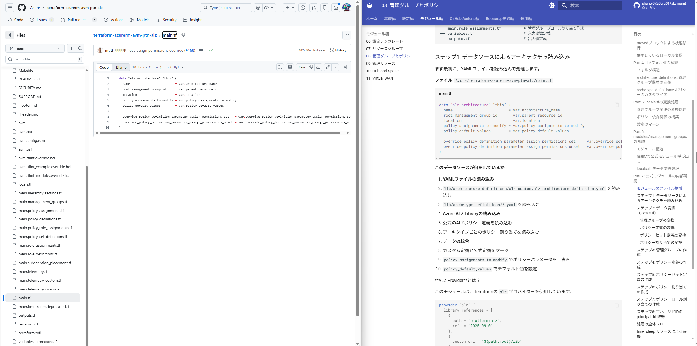

# 11. 管理グループとポリシー - Azure Landing Zonesの心臓部💓

!!! info "この章で学ぶこと"
    Azure Landing Zonesの核となる管理グループとポリシーの仕組みを学びます：

    1. 🗂️管理グループの階層構造（概念説明）
    2. 📝platform-landing-zone.auto.tfvarsの解説（管理グループ設定）
    3. 🏗️main.management.tfの解説（モジュール呼び出し）
    4. 📄lib/フォルダのYAML解説（ポリシー定義）
    5. 🔄locals.tfの変換処理（データ加工）
    6. 🧩modules/management_groups/の解説（ローカルモジュール）
    7. 🏢公式モジュールの内部解説（Azure/avm-ptn-alz/azurerm）
    8. 🛡️公式のAzureポリシーを解説
    9. 🛠️実践パターン（カスタマイズ方法）

    **この章の内容はめちゃめちゃ長いですが、一番重要なところなので頑張りましょう！！🔥**

---

## Part 1: 管理グループの階層構造🗂️

### 管理グループとは何か？🤔

管理グループは、複数のサブスクリプションをまとめて、ポリシーやRBACを一元管理する仕組みです。

いちばんわかりやすい例えをするなら、「フォルダ構造」です📁。

```
Tenant Root（テナントルート）
└── alz（Azure Landing Zones）
    ├── platform（共通基盤）
    │   ├── management（管理）
    │   ├── connectivity（接続）
    │   └── identity（ID管理）
    └── landingzones（アプリ環境）
        ├── corp（企業向け）
        └── online（オンライン向け）
```

---

### ポリシーの継承構造🔗

管理グループの最大の特徴は、**親から子へのポリシー継承**です。

**例：全環境で同じルールを適用したい場合**

```
alz に「特定リージョン以外は使用禁止」ポリシーを適用
↓
配下の全管理グループ・サブスクリプションに自動適用
```

これにより、一度設定すれば全環境に適用されるので、管理の手間が激減します。

!!! tip "ポリシー継承の使い分け💡"
    - **alz**: 全環境共通のルール（リージョン制限、タグ必須など）
    - **platform**: 共通基盤のルール（ネットワーク設定、ログ転送など）
    - **landingzones**: アプリ環境のルール（VM診断設定、バックアップなど）

---

### この Chapter で学ぶこと📝

1. **設定ファイル（platform-landing-zone.auto.tfvars）**: どんな設定ができるのか
2. **main.management.tf**: どうやって管理グループを作るのか
3. **lib/ フォルダ**: YAMLでポリシーをどう定義するのか
4. **locals.tf**: 設定がどう変換されるのか
5. **modules/management_groups/**: ローカルモジュールの役割
6. **公式モジュール**: Azure公式モジュールの内部構造
7. **実践パターン**: よくあるカスタマイズ方法

---

## Part 2: platform-landing-zone.auto.tfvarsの解説📝

このファイルで管理グループのすべてを設定します。ここでは管理グループに関連する部分だけを解説します。

### 管理グループとポリシー設定🔧

これがこのChapterのメイン設定です。

```hcl title="management_group_settings"
management_group_settings = {
  enabled            = true
  architecture_name  = "alz_custom"
  location           = "$${starter_location_01}"
  parent_resource_id = "$${root_parent_management_group_id}"
  
  policy_default_values = {
    ama_change_tracking_data_collection_rule_id = "$${ama_change_tracking_data_collection_rule_id}"
    ama_mdfc_sql_data_collection_rule_id        = "$${ama_mdfc_sql_data_collection_rule_id}"
    ama_vm_insights_data_collection_rule_id     = "$${ama_vm_insights_data_collection_rule_id}"
    ama_user_assigned_managed_identity_id       = "$${ama_user_assigned_managed_identity_id}"
    ama_user_assigned_managed_identity_name     = "$${ama_user_assigned_managed_identity_name}"
    log_analytics_workspace_id                  = "$${log_analytics_workspace_id}"
    ddos_protection_plan_id                     = "$${ddos_protection_plan_id}"
    private_dns_zone_subscription_id            = "$${subscription_id_connectivity}"
    private_dns_zone_region                     = "$${starter_location_01}"
    private_dns_zone_resource_group_name        = "$${dns_resource_group_name}"
  }
  
  subscription_placement = {
    identity = {
      subscription_id       = "$${subscription_id_identity}"
      management_group_name = "identity"
    }
    connectivity = {
      subscription_id       = "$${subscription_id_connectivity}"
      management_group_name = "connectivity"
    }
    management = {
      subscription_id       = "$${subscription_id_management}"
      management_group_name = "management"
    }
    security = {
      subscription_id       = "$${subscription_id_security}"
      management_group_name = "security"
    }
  }
  
  policy_assignments_to_modify = {
    alz = {
      policy_assignments = {
        Deploy-MDFC-Config-H224 = {
          parameters = {
            ascExportResourceGroupName                  = "$${asc_export_resource_group_name}"
            ascExportResourceGroupLocation              = "$${starter_location_01}"
            emailSecurityContact                        = "$${defender_email_security_contact}"
            enableAscForServers                         = "DeployIfNotExists"
            enableAscForServersVulnerabilityAssessments = "DeployIfNotExists"
            enableAscForSql                             = "DeployIfNotExists"
            enableAscForAppServices                     = "DeployIfNotExists"
            enableAscForStorage                         = "DeployIfNotExists"
            enableAscForContainers                      = "DeployIfNotExists"
            enableAscForKeyVault                        = "DeployIfNotExists"
            enableAscForSqlOnVm                         = "DeployIfNotExists"
            enableAscForArm                             = "DeployIfNotExists"
            enableAscForOssDb                           = "DeployIfNotExists"
            enableAscForCosmosDbs                       = "DeployIfNotExists"
            enableAscForCspm                            = "DeployIfNotExists"
          }
        }
      }
    }
  }
}
```

**主要なパラメータ**:🌟

#### `architecture_name`

```hcl
architecture_name = "alz_custom"
```

lib/architecture_definitions/ フォルダ内のYAMLファイル名を指定します。

→ `alz_custom.alz_architecture_definition.yaml` を読み込む

#### `parent_resource_id`

```hcl
parent_resource_id = "$${root_parent_management_group_id}"
```

ルート管理グループのIDです。通常はテナントルートまたは既存の親管理グループを指定します。

#### `policy_default_values`

ポリシーパラメータのデフォルト値です。ポリシーに定義されたパラメータを上書きできます。

**重要なポリシーパラメータ**:🛡️

| パラメータ | 用途 |
|----------|------|
| `ama_*_data_collection_rule_id` | Azure Monitor Agentのデータ収集ルールID |
| `ama_user_assigned_managed_identity_id` | AMA用マネージドIDのリソースID |
| `log_analytics_workspace_id` | Log AnalyticsワークスペースのリソースID |
| `ddos_protection_plan_id` | DDoS Protection PlanのリソースID |
| `private_dns_zone_*` | Private DNSゾーンの設定 |

これらの値は、ポリシーが作成するリソース（VM、SQL Serverなど）に自動的に適用されます。

#### `subscription_placement`

サブスクリプションを管理グループに配置する設定です。

```hcl
subscription_placement = {
  identity = {
    subscription_id       = "$${subscription_id_identity}"
    management_group_name = "identity"
  }
}
```

この設定により、指定したサブスクリプションが対応する管理グループに自動的に配置されます。

#### `policy_assignments_to_modify`

既存のポリシー割り当てを変更する設定です。

```hcl
policy_assignments_to_modify = {
  alz = {
    policy_assignments = {
      Deploy-MDFC-Config-H224 = {
        parameters = {
          emailSecurityContact = "$${defender_email_security_contact}"
          # ...
        }
      }
    }
  }
}
```

**使いどころ**:💡

- ポリシーパラメータの変更
- enforcement_modeの変更（強制モード/監査モード）
- マネージドIDの追加


---

## Part 3: main.management.tfの解説🏗️

設定ファイルを読み込んで、実際に管理グループを作成するファイルです。

### ファイル全体🗂️

```hcl title="main.management.tf"
module "management_resources" {
  source = "./modules/management_resources"

  count = var.management_resources_enabled ? 1 : 0

  enable_telemetry             = var.enable_telemetry
  management_resource_settings = local.management_resource_settings

  providers = {
    azurerm = azurerm.management
  }
}

module "management_groups" {
  source = "./modules/management_groups"

  count = var.management_groups_enabled ? 1 : 0

  enable_telemetry          = var.enable_telemetry
  management_group_settings = local.management_group_settings
}

moved {
  from = module.management_groups
  to   = module.management_groups[0]
}

moved {
  from = module.management_resources
  to   = module.management_resources[0]
}
```

---

### countパターンによる条件付き作成🔢

```hcl
count = var.management_resources_enabled ? 1 : 0
```

このパターンにより、変数で有効/無効を切り替えられます。

**動作**:

- `var.management_resources_enabled = true` → `count = 1` → モジュールを1つ作成
- `var.management_resources_enabled = false` → `count = 0` → モジュールを作成しない

---

### movedブロックによる状態移行🔄

```hcl
moved {
  from = module.management_groups
  to   = module.management_groups[0]
}
```

**このブロックの役割**:💡

以前のバージョンでは `module.management_groups` という名前で状態管理していました。

countパターン導入後は `module.management_groups[0]` という名前になります。

movedブロックがないと、Terraformは「古いリソースを削除して新しいリソースを作成」しようとしますが、movedブロックがあることで「名前を変更するだけ」で済みます。

!!! tip "movedブロックのベストプラクティス💡"
    - 既存環境を壊さずにコード構造を変更できる
    - terraform plan で `moved` と表示される
    - 一度適用した後も残しておくことで、古い環境からの移行をサポート

---

### 使用しているローカル変数

```hcl
management_resource_settings = local.management_resource_settings
management_group_settings    = local.management_group_settings
```

これらの変数は `locals.tf` で定義されています（Part 5で解説）。

---

## Part 4: lib/フォルダの解説📄

YAMLファイルで管理グループの階層構造とポリシーを定義します。

### フォルダ構造🗂️

```
lib/
├── alz_library_metadata.json
├── architecture_definitions/
│   └── alz_custom.alz_architecture_definition.yaml
└── archetype_definitions/
    ├── root_custom.alz_archetype_override.yaml
    ├── platform_custom.alz_archetype_override.yaml
    ├── management_custom.alz_archetype_override.yaml
    ├── connectivity_custom.alz_archetype_override.yaml
    ├── identity_custom.alz_archetype_override.yaml
    ├── landing_zones_custom.alz_archetype_override.yaml
    ├── corp_custom.alz_archetype_override.yaml
    ├── online_custom.alz_archetype_override.yaml
    ├── sandbox_custom.alz_archetype_override.yaml
    ├── security_custom.alz_archetype_override.yaml
    └── decommissioned_custom.alz_archetype_override.yaml
```

---

### architecture_definitions: 管理グループ階層の定義🏢

```yaml title="lib/architecture_definitions/alz_custom.alz_architecture_definition.yaml"
name: alz_custom
management_groups:
  - id: alz
    display_name: Azure Landing Zones
    archetypes:
      - root_custom
    exists: false
    parent_id: null

  - id: platform
    display_name: Platform
    archetypes:
      - platform_custom
    exists: false
    parent_id: alz

  - id: landingzones
    display_name: Landing Zones
    archetypes:
      - landing_zones_custom
    exists: false
    parent_id: alz

  - id: corp
    display_name: Corp
    archetypes:
      - corp_custom
    exists: false
    parent_id: landingzones

  - id: online
    display_name: Online
    archetypes:
      - online_custom
    exists: false
    parent_id: landingzones

  - id: sandbox
    display_name: Sandbox
    archetypes:
      - sandbox_custom
    exists: false
    parent_id: alz

  - id: security
    display_name: Security
    archetypes:
      - security_custom
    exists: false
    parent_id: platform

  - id: management
    display_name: Management
    archetypes:
      - management_custom
    exists: false
    parent_id: platform

  - id: connectivity
    display_name: Connectivity
    archetypes:
      - connectivity_custom
    exists: false
    parent_id: platform

  - id: identity
    display_name: Identity
    archetypes:
      - identity_custom
    exists: false
    parent_id: platform

  - id: decommissioned
    display_name: Decommissioned
    archetypes:
      - decommissioned_custom
    exists: false
    parent_id: alz
```

**各フィールドの意味**:📝

- `id`: 管理グループの一意な識別子
- `display_name`: Azureポータルで表示される名前
- `archetypes`: この管理グループに適用するアーキタイプ（ポリシーセット）
- `exists`: 既存の管理グループか（falseの場合は新規作成）
- `parent_id`: 親管理グループのID

---

### archetype_definitions: ポリシーのカスタマイズ🛡️

各管理グループごとにポリシーをカスタマイズできます。

```yaml title="lib/archetype_definitions/root_custom.alz_archetype_override.yaml"
base_archetype: root
name: root_custom
policy_assignments_to_add: []
policy_assignments_to_remove: []
policy_definitions_to_add: []
policy_definitions_to_remove: []
policy_set_definitions_to_add: []
policy_set_definitions_to_remove: []
role_definitions_to_add: []
role_definitions_to_remove: []
```

**各フィールドの意味**:📝

- `base_archetype`: ベースとなるアーキタイプ（公式のALZアーキタイプ）
- `name`: カスタムアーキタイプの名前
- `policy_assignments_to_add`: 追加するポリシー割り当て
- `policy_assignments_to_remove`: 削除するポリシー割り当て
- `policy_definitions_to_add`: 追加するカスタムポリシー定義
- `policy_definitions_to_remove`: 削除するポリシー定義
- `policy_set_definitions_to_add`: 追加するポリシーイニシアチブ
- `policy_set_definitions_to_remove`: 削除するポリシーイニシアチブ
- `role_definitions_to_add`: 追加するカスタムロール定義
- `role_definitions_to_remove`: 削除するロール定義

**実際のカスタマイズ例**:

```yaml title="lib/archetype_definitions/connectivity_custom.alz_archetype_override.yaml"
base_archetype: connectivity
name: connectivity_custom
policy_assignments_to_add: []
policy_assignments_to_remove:
  # DDoS Protection Planが未作成の場合は削除
  # - Enable-DDoS-VNET
policy_definitions_to_add: []
policy_definitions_to_remove: []
policy_set_definitions_to_add: []
policy_set_definitions_to_remove: []
role_definitions_to_add: []
role_definitions_to_remove: []
```

!!! tip "ポリシーのカスタマイズ方法💡"
    - コメントアウトを外して有効化: `# - Enable-DDoS-VNET` → `- Enable-DDoS-VNET`
    - カスタムポリシーを追加: `policy_definitions_to_add` に定義を追加
    - 不要なポリシーを削除: `policy_assignments_to_remove` にポリシー名を追加

---

## Part 5: locals.tfの変換処理🔄

platform-landing-zone.auto.tfvars の設定を、モジュールに渡す形式に変換する処理です。管理グループとポリシーに関連する部分だけを解説します。

### 管理グループ関連の変換処理🧮

```hcl title="locals.tf（管理グループ関連部分）"
# Build policy dependencies
locals {
  management_group_dependencies = {
    policy_assignments = [
      module.management_resources,
      module.hub_and_spoke_vnet,
      module.virtual_wan
    ]
    policy_role_assignments = [
      module.management_resources,
      module.hub_and_spoke_vnet,
      module.virtual_wan
    ]
  }
}

locals {
  management_group_settings = merge(
    module.config.outputs.management_group_settings,
    {
      dependencies = local.management_group_dependencies
    }
  )
  management_resource_settings = merge(
    module.config.outputs.management_resource_settings,
    {
      tags = coalesce(module.config.outputs.management_resource_settings.tags, module.config.outputs.tags)
    }
  )
}
```

---

### ポリシー依存関係の構築

```hcl
locals {
  management_group_dependencies = {
    policy_assignments = [
      module.management_resources,
      module.hub_and_spoke_vnet,
      module.virtual_wan
    ]
    policy_role_assignments = [
      module.management_resources,
      module.hub_and_spoke_vnet,
      module.virtual_wan
    ]
  }
}
```

**なぜ依存関係が必要か？**🤔

ポリシーは、Log AnalyticsワークスペースやDDoS Protection Planなどのリソースを参照します。

しかし、Terraformは自動的にこの依存関係を検出できません（ポリシーパラメータは文字列として渡されるため）。

そのため、明示的に依存関係を定義しています。

**実際の動作**:⚙️

1. `module.management_resources` が作成される（Log Analyticsなど）
2. `module.hub_and_spoke_vnet` が作成される（DDoS Planなど）
3. その後、`module.management_groups` が作成される（ポリシー割り当て）

---

### 設定のマージ🔗

```hcl
locals {
  management_group_settings = merge(
    module.config.outputs.management_group_settings,
    {
      dependencies = local.management_group_dependencies
    }
  )
  management_resource_settings = merge(
    module.config.outputs.management_resource_settings,
    {
      tags = coalesce(module.config.outputs.management_resource_settings.tags, module.config.outputs.tags)
    }
  )
}
```

**処理内容**:📝

1. **management_group_settings**:
   - config モジュールの出力を取得
   - 依存関係情報を追加
   - modules/management_groups/ に渡す

2. **management_resource_settings**:
   - config モジュールの出力を取得
   - タグ情報をマージ
   - modules/management_resources/ に渡す

---

## Part 6: modules/management_groups/の解説🧩

ローカルモジュールで、設定を公式モジュールに渡す前処理を行います。

### モジュール構造🗂️

```
modules/management_groups/
├── main.tf          # 公式モジュール呼び出し
├── variables.tf     # 入力変数定義
├── locals.tf        # データ変換処理
└── terraform.tf     # Terraform設定
```

---

### main.tf: 公式モジュール呼び出し🏢

```hcl title="modules/management_groups/main.tf"
module "management_groups" {
  source                                                        = "Azure/avm-ptn-alz/azurerm"
  version                                                       = "0.14.1"
  architecture_name                                             = var.management_group_settings.architecture_name
  parent_resource_id                                            = var.management_group_settings.parent_resource_id
  location                                                      = var.management_group_settings.location
  policy_default_values                                         = local.policy_default_values
  policy_assignments_to_modify                                  = local.policy_assignments_to_modify
  enable_telemetry                                              = var.enable_telemetry
  management_group_hierarchy_settings                           = var.management_group_settings.management_group_hierarchy_settings
  partner_id                                                    = var.management_group_settings.partner_id
  retries                                                       = var.management_group_settings.retries
  subscription_placement                                        = var.management_group_settings.subscription_placement
  timeouts                                                      = var.management_group_settings.timeouts
  dependencies                                                  = var.management_group_settings.dependencies
  override_policy_definition_parameter_assign_permissions_set   = var.management_group_settings.override_policy_definition_parameter_assign_permissions_set
  override_policy_definition_parameter_assign_permissions_unset = var.management_group_settings.override_policy_definition_parameter_assign_permissions_unset
  management_group_role_assignments                             = var.management_group_settings.management_group_role_assignments
  role_assignment_definition_lookup_enabled                     = var.management_group_settings.role_assignment_definition_lookup_enabled
  policy_assignment_non_compliance_message_settings             = var.management_group_settings.policy_assignment_non_compliance_message_settings
  role_assignment_name_use_random_uuid                          = var.management_group_settings.role_assignment_name_use_random_uuid
}
```

**主要なパラメータ**:🌟

| パラメータ | 説明 |
|----------|------|
| `architecture_name` | アーキテクチャ定義ファイル名（例: `alz_custom`） |
| `parent_resource_id` | 親管理グループのリソースID |
| `location` | デフォルトリージョン |
| `policy_default_values` | ポリシーパラメータのデフォルト値 |
| `policy_assignments_to_modify` | ポリシー割り当ての変更 |
| `subscription_placement` | サブスクリプションの配置 |
| `dependencies` | 依存関係の定義 |

---

### locals.tf: データ変換処理🔄

```hcl title="modules/management_groups/locals.tf"
locals {
  policy_default_values = { for k, v in try(var.management_group_settings.policy_default_values, {}) : k => jsonencode({ value = v }) }
  policy_assignments_to_modify = { for management_group_key, management_group_value in try(var.management_group_settings.policy_assignments_to_modify, {}) : management_group_key => {
    policy_assignments = { for policy_assignment_key, policy_assignment_value in try(management_group_value.policy_assignments, {}) : policy_assignment_key => {
      enforcement_mode        = try(policy_assignment_value.enforcement_mode, null)
      identity                = try(policy_assignment_value.identity, null)
      identity_ids            = try(policy_assignment_value.identity_ids, null)
      parameters              = try({ for parameter_key, parameter_value in try(policy_assignment_value.parameters, {}) : parameter_key => jsonencode({ value = parameter_value }) }, null)
      non_compliance_messages = try(policy_assignment_value.non_compliance_messages, null)
      resource_selectors      = try(policy_assignment_value.resource_selectors, null)
      overrides               = try(policy_assignment_value.overrides, null)
    } }
  } }
}
```

**この変換の目的**:💡

Azure Policyは、パラメータをJSON形式で受け取る必要があります。

**変換前（platform-landing-zone.auto.tfvars）**:⬅️

```hcl
policy_default_values = {
  log_analytics_workspace_id = "/subscriptions/.../workspaces/law-001"
}
```

**変換後（公式モジュールに渡す形式）**:➡️

```json
{
  "log_analytics_workspace_id": "{\"value\":\"/subscriptions/.../workspaces/law-001\"}"
}
```

---

## Part 7: 公式モジュールの内部解説🏢

**公式モジュール**: `Azure/avm-ptn-alz/azurerm` v0.14.1

**GitHubリポジトリ：**

https://github.com/Azure/terraform-azurerm-avm-ptn-alz


ここからは公式のモジュールを開きながら見ていきましょう。こんな感じ↓


このモジュールがどうやって管理グループとポリシーを作成しているのか、実際のコードを見ながら理解していきましょう。

---

### 公式モジュールの全体像

まず、このモジュールが何をするのか、大きな流れを理解しましょう。

**やっていること**:📝

```
1. YAMLファイルを読み込む（lib/フォルダ）
   ↓ 「管理グループalzを作る」「ポリシーAを割り当てる」みたいな設定が入ってる
   
2. データを整理する（locals.tf）
   ↓ 「Level 0の管理グループはこれ」「ポリシー定義はこれ」みたいにグループ分け
   
3. 管理グループを作る（main.management_groups.tf）
   ↓ Level 0 → Level 1 → Level 2... の順番で作成
   
4. ポリシー定義を作る（main.policy_definitions.tf）
   ↓ 「Classic VMを禁止」みたいなルールを定義
   
5. ポリシーセット定義を作る（main.policy_set_definitions.tf）
   ↓ 複数のポリシーをまとめたもの
   
6. ポリシーを割り当てる（main.policy_assignments.tf）
   ↓ 「alz管理グループにこのポリシーを適用」
   
7. 権限を付与する（main.policy_role_assignments.tf）
   ↓ ポリシーが動くための権限を設定
```

---

### ステップ1: YAMLファイルを読み込む📄

**目的**: YAMLファイルを読み込んで、「どんな管理グループを作るか」「どんなポリシーを適用するか」を把握する。

**読み込むYAMLの場所**:

- **このリポジトリの `lib/` フォルダ**: カスタム設定（アーキテクチャ定義、アーキタイプのオーバーライド）
- **GitHub上の公式ALZライブラリ**: ポリシー定義、ポリシーセット定義、ベースアーキタイプ

※このリポジトリはhttps://github.com/shuhei0720org01/alz-mgmtを意味しています。

**公式モジュールのファイル**: `main.tf`


```hcl title="Azure/terraform-azurerm-avm-ptn-alz/main.tf"
data "alz_architecture" "this" {
  name                         = var.architecture_name
  root_management_group_id     = var.parent_resource_id
  location                     = var.location
  policy_assignments_to_modify = var.policy_assignments_to_modify
  policy_default_values        = var.policy_default_values
}
```

**このコードが実際に何をするのか**:

`data "alz_architecture"` は、ALZ Providerが提供する特殊なデータソースです。

!!! info "前提: ALZ Providerの設定が必要⚠️"
    このデータソースを使うには、事前にALZ Providerの設定が必要です（このリポジトリでは[terraform.tf](terraform.tf#L24-L31)で設定済み）。
    
    ```hcl
    provider "alz" {
      library_references = [
        {
          custom_url = "${path.root}/lib"  # ← このリポジトリのlibフォルダ
        }
      ]
    }
    ```
    
    この設定により、このリポジトリの `lib/` フォルダからカスタム定義を読み込みます。
    公式のALZライブラリ（GitHubのAzure/Azure-Landing-Zones-Library）は自動的に読み込まれます。

これを使うと：

- **1. カスタムYAMLを読み込む（このリポジトリの `lib/` フォルダ）**

  プロバイダー設定で指定した `${path.root}/lib` から、アーキテクチャ定義とアーキタイプのオーバーライドを読み込む。

- **2. name で指定したアーキテクチャを探す**

  ```hcl
  name = var.architecture_name  # "alz_custom"
  ```

  **このリポジトリの** `lib/architecture_definitions/alz_custom.alz_architecture_definition.yaml` を読む

- **3. YAMLの内容を解析する**

  **alz_custom.alz_architecture_definition.yaml の中身**:

  ```yaml
  name: alz_custom
  management_groups:
    - id: alz
      display_name: Azure Landing Zones
      parent_id: root
      archetypes:
        - root_custom
    - id: platform
      display_name: Platform
      parent_id: alz
      archetypes:
        - platform_custom
    - id: management
      display_name: Management
      parent_id: platform
      archetypes:
        - management_custom
    # ...
  ```

- **4. アーキタイプ定義も読み込む**

  各管理グループの `archetypes: [root_custom]` を見て、**このリポジトリの** `lib/archetype_definitions/root_custom.alz_archetype_override.yaml` も読む：
  
  ```yaml
  name: root_custom
  base_archetype: root
  policy_assignments_to_add: []
  policy_assignments_to_remove: []
  # ...
  ```

- **5. 公式ライブラリのポリシー定義も読み込む（GitHub上の別リポジトリ）**

  ALZ Providerは自動的に **GitHub上の公式ALZライブラリ**（`Azure/Azure-Landing-Zones-Library`）からも読み込みます。
  
  ここから `Deny-Classic-Resources` や `Deploy-MDFC-Config` などのポリシー定義を全部読み込みます。
  
  公式ライブラリの中身については、この章のパート8で詳しく解説します。

- **6. カスタム設定を適用**

  ```hcl
  policy_assignments_to_modify = var.policy_assignments_to_modify
  policy_default_values        = var.policy_default_values
  ```

  `policy_assignments_to_modify`: 「このポリシーのパラメータを変更」
  
  `policy_default_values`: 「Log AnalyticsのIDはこれ」みたいなデフォルト値

#### 結果、何が手に入るか🎁

`data.alz_architecture.this` という変数に、全部の情報が入ります：

```
data.alz_architecture.this = {
  management_groups = [
    {
      id           = "alz"
      level        = 0
      parent_id    = "root"
      display_name = "Azure Landing Zones"
      archetypes   = ["root_custom"]
      policy_definitions = {
        "Deny-Classic-Resources" = "{ JSON形式のポリシー定義 }"
        "Deny-Subnet-Without-Nsg" = "{ JSON形式のポリシー定義 }"
        # ... 数十個
      }
      policy_assignments = {
        "Deploy-MDFC-Config" = "{ JSON形式のポリシー割り当て }"
        # ... 数十個
      }
    },
    {
      id           = "platform"
      level        = 1
      parent_id    = "alz"
      display_name = "Platform"
      archetypes   = ["platform_custom"]
      policy_definitions = { ... }
      policy_assignments = { ... }
    },
    # ... 全管理グループ
  ]
}
```

**つまり**:💡

- `data "alz_architecture"` は魔法のデータソース
- 使うだけで、ALZ Providerが勝手にYAMLを全部読んでくれる
- 読み込んだ結果が `data.alz_architecture.this` に全部入る
- あとはこれを使ってリソースを作っていく

**なぜYAML読み込みコードが見えないのか**:🤔

`data "alz_architecture"` の内部処理は、ALZ Provider（Go言語で書かれたプログラム）の中に隠れています。Terraformのコードには現れません。

これは、`azurerm_resource_group` を使うと勝手にAzure APIを呼んでくれるのと同じ仕組みです。内部の処理は見えないけど、使うだけで動く。

---

### ステップ2: データを整理する（管理グループ編）🗂️

**目的**: 読み込んだデータを、Terraformリソースで使いやすい形に整理する。

**ファイル**: `Azure/terraform-azurerm-avm-ptn-alz/locals.tf`

**問題**: 管理グループには親子関係があるので、親を先に作る必要がある。でも、データソースから取得したデータは順番がバラバラ。😵‍💫

**解決策**: レベル別に分ける。🧩

```hcl title="locals.tf（管理グループ）"
locals {
  # まず全管理グループをマップに変換
  management_groups = { for v in data.alz_architecture.this.management_groups : v.id => {
    id           = v.id
    level        = v.level
    exists       = v.exists
    display_name = v.display_name
    parent_id    = v.parent_id
  } }
  
  # Level 0だけ抽出
  management_groups_level_0 = { for k, v in local.management_groups : k => v if v.level == 0 && !v.exists }
  
  # Level 1だけ抽出
  management_groups_level_1 = { for k, v in local.management_groups : k => v if v.level == 1 && !v.exists }
  
  # Level 2-6も同様...
}
```

**なぜこうするのか**:💡

管理グループの階層はこうなってる：

```
Level 0: alz
  ├─ Level 1: platform
  │   ├─ Level 2: management
  │   ├─ Level 2: connectivity
  │   └─ Level 2: identity
  └─ Level 1: landingzones
      ├─ Level 2: corp
      └─ Level 2: online
```

Level 1を作るには、Level 0（親）が先に存在してないとダメ。だから、レベル別に分けて、順番に作る。

**具体例**:📝

```hcl
# 元のデータ（順番バラバラ）
data.alz_architecture.this.management_groups = [
  { id = "management", level = 2, ... },    # Level 2
  { id = "alz", level = 0, ... },           # Level 0
  { id = "platform", level = 1, ... },      # Level 1
]

# 整理後
local.management_groups_level_0 = {
  "alz" = { id = "alz", level = 0, ... }
}
local.management_groups_level_1 = {
  "platform" = { id = "platform", level = 1, ... }
}
local.management_groups_level_2 = {
  "management" = { id = "management", level = 2, ... }
}
```

これで、Level 0 → Level 1 → Level 2 の順に作れる。

---

### ステップ3: データを整理する（ポリシー定義編）🛡️

**目的**: ポリシー定義を、作成しやすい形に変換する。

**ファイル**: `Azure/terraform-azurerm-avm-ptn-alz/locals.tf`

**問題**: データソースから取得したポリシー定義は、管理グループごとに入れ子になってる。🌀

```
data.alz_architecture.this.management_groups = [
  {
    id = "alz"
    policy_definitions = {
      "Deny-Classic-Resources" = "{ JSON }",
      "Deny-Subnet-Without-Nsg" = "{ JSON }",
      ...
    }
  },
  {
    id = "platform"
    policy_definitions = {
      "Deny-Public-IP" = "{ JSON }",
      ...
    }
  }
]
```

**解決策**: フラットなマップに変換する。🗺️

```hcl title="locals.tf（ポリシー定義）"
locals {
  policy_definitions = {
    for pdval in flatten([
      for mg in data.alz_architecture.this.management_groups : [
        for pdname, pd in mg.policy_definitions : {
          key        = pdname
          definition = jsondecode(pd)
          mg         = mg.id
        }
      ]
  ]) : "${pdval.mg}/${pdval.key}" => pdval }
}
```

**このコードを分解して理解する**:🔍

**ステップ1**: 各管理グループをループ

```hcl
for mg in data.alz_architecture.this.management_groups : [
  # mg = { id = "alz", policy_definitions = {...}, ... }
]
```

**ステップ2**: 各管理グループ内のポリシー定義をループ

```hcl
for pdname, pd in mg.policy_definitions : {
  key        = pdname          # "Deny-Classic-Resources"
  definition = jsondecode(pd)  # JSON文字列をオブジェクトに変換
  mg         = mg.id           # "alz"
}
```

**なぜjsondecode()が必要か**: ポリシー定義はJSON文字列で保存されてるので、Terraformで使えるオブジェクトに変換する。🧪

**ステップ3**: flatten()で一次元配列に

```hcl
flatten([...])  # 入れ子の配列を平らにする
```

**ステップ4**: キーを生成してマップに

```hcl
"${pdval.mg}/${pdval.key}" => pdval
# 例: "alz/Deny-Classic-Resources" => { key = "Deny-Classic-Resources", ... }
```

**なぜこの形式にするのか**: 同じ名前のポリシーが複数の管理グループにあるかもしれないから、「管理グループID/ポリシー名」で一意にする。🔑

**変換前と変換後の比較**:🔄

=== "変換前（入れ子）"

    ```
    management_groups = [
      {
        id = "alz"
        policy_definitions = {
          "Deny-Classic-Resources" = "{ JSON }"
        }
      },
      {
        id = "platform"
        policy_definitions = {
          "Deny-Public-IP" = "{ JSON }"
        }
      }
    ]
    ```

=== "変換後（フラット）"

    ```
    policy_definitions = {
      "alz/Deny-Classic-Resources" = {
        key        = "Deny-Classic-Resources"
        definition = { name = "...", properties = {...} }
        mg         = "alz"
      }
      "platform/Deny-Public-IP" = {
        key        = "Deny-Public-IP"
        definition = { name = "...", properties = {...} }
        mg         = "platform"
      }
    }
    ```

これで、`for_each = local.policy_definitions` でループして作成できる。💡

---

### ステップ4: 管理グループを作成する🏗️

**目的**: 実際にAzureに管理グループを作成する。

**ファイル**: `Azure/terraform-azurerm-avm-ptn-alz/main.management_groups.tf`

**なぜレベルごとに分けて作るのか**: 親がいないと子は作れないから。🧑‍🤝‍🧑

```hcl title="main.management_groups.tf（Level 0）"
resource "azapi_resource" "management_groups_level_0" {
  for_each = local.management_groups_level_0

  name      = each.value.id
  parent_id = "/"
  type      = "Microsoft.Management/managementGroups@2023-04-01"
  body = {
    properties = {
      details = {
        parent = {
          id = "/providers/Microsoft.Management/managementGroups/${each.value.parent_id}"
        }
      }
      displayName = each.value.display_name
    }
  }
  
  depends_on = [terraform_data.management_groups_dependencies]
}
```

**このコードを詳しく見る**:🔍

**for_each**: Level 0の管理グループだけループ🔁

```hcl
for_each = local.management_groups_level_0
# 例: { "alz" = { id = "alz", display_name = "Azure Landing Zones", ... } }
```

**name**: 管理グループのID

```hcl
name = each.value.id  # "alz"
```

**type**: Azure APIのエンドポイント🌐

```hcl
type = "Microsoft.Management/managementGroups@2023-04-01"
# これでAzure APIに「管理グループを作って」とリクエストする
```

**body**: 管理グループの設定📝

```hcl
body = {
  properties = {
    details = {
      parent = {
        id = "/providers/Microsoft.Management/managementGroups/${each.value.parent_id}"
        # 例: "/providers/Microsoft.Management/managementGroups/root"
      }
    }
    displayName = each.value.display_name  # "Azure Landing Zones"
  }
}
```

**depends_on**: 他のリソースが作成されてから実行⏳

```hcl
depends_on = [terraform_data.management_groups_dependencies]
# management_resources、hub_and_spoke_vnet、virtual_wan が先に作られる
```

**なぜazapi_resourceを使うのか**:🤔

普通の`azurerm_management_group`リソースじゃなくて、`azapi_resource`を使ってる理由：

1. **リトライ機能**: Azure APIは一時的にエラーを返すことがある。azapi_resourceは自動でリトライしてくれる
2. **柔軟性**: 新しいAPIバージョンにすぐ対応できる

**Level 1-6も同じ構造**:🧩

```hcl
resource "azapi_resource" "management_groups_level_1" {
  for_each = local.management_groups_level_1
  # ... 同じ内容 ...
  depends_on = [azapi_resource.management_groups_level_0]  # Level 0を待つ
}

resource "azapi_resource" "management_groups_level_2" {
  for_each = local.management_groups_level_2
  # ... 同じ内容 ...
  depends_on = [azapi_resource.management_groups_level_1]  # Level 1を待つ
}
```

**作成順序**:🔢

```
1. Level 0を作成（alz）
   ↓ depends_onで待機
2. Level 1を作成（platform, landingzones, sandbox）
   ↓ depends_onで待機
3. Level 2を作成（management, connectivity, identity, corp, online）
   ↓ ...
```

---

### ステップ5: ポリシー定義を作成する🛡️

**目的**: 「Classic VMを禁止」みたいなルールを定義する。

**ファイル**: `Azure/terraform-azurerm-avm-ptn-alz/main.policy_definitions.tf`

```hcl title="main.policy_definitions.tf"
resource "azapi_resource" "policy_definitions" {
  for_each = local.policy_definitions

  name      = each.value.definition.name
  parent_id = "/providers/Microsoft.Management/managementGroups/${each.value.mg}"
  type      = "Microsoft.Authorization/policyDefinitions@2023-04-01"
  body = {
    properties = each.value.definition.properties
  }
  
  depends_on = [time_sleep.after_management_groups]
}
```

**このコードを詳しく見る**:🔍

**for_each**: すべてのポリシー定義をループ🔁

```hcl
for_each = local.policy_definitions
# 例: {
#   "alz/Deny-Classic-Resources" = {
#     definition = { name = "Deny-Classic-Resources", properties = {...} }
#     mg = "alz"
#   }
# }
```

**parent_id**: どの管理グループに紐づけるか🔗

```hcl
parent_id = "/providers/Microsoft.Management/managementGroups/${each.value.mg}"
# 例: "/providers/Microsoft.Management/managementGroups/alz"
```

**なぜ管理グループに紐づけるのか**: ポリシー定義は管理グループのレベルで作成される。そうすれば、その管理グループと配下の全管理グループで使える。🧑‍🤝‍🧑

**body**: ポリシーの実際の内容📝

```hcl
body = {
  properties = each.value.definition.properties
  # {
  #   displayName = "Deny the deployment of classic resources"
  #   policyType = "Custom"
  #   mode = "All"
  #   policyRule = { ... }  # 実際のルール
  #   parameters = { ... }   # パラメータ定義
  # }
}
```

**depends_on**: 管理グループが作られてから実行⏳

```hcl
depends_on = [time_sleep.after_management_groups]
```

**なぜtime_sleepが必要か**: Azure APIは結果整合性モデル。管理グループを作った直後は、まだAzure内部で伝播中。30秒待つことで、確実に管理グループが使えるようになる。⏲️

---

### ステップ6: ポリシー割り当てを作成する🛡️

**目的**: 「alz管理グループにこのポリシーを適用」という割り当てを作る。

**ファイル**: `Azure/terraform-azurerm-avm-ptn-alz/main.policy_assignments.tf`

```hcl title="main.policy_assignments.tf（抜粋）"
resource "azapi_resource" "policy_assignments" {
  for_each = local.policy_assignments_final

  location  = var.location
  name      = each.value.assignment.name
  parent_id = "/providers/Microsoft.Management/managementGroups/${each.value.mg}"
  type      = "Microsoft.Authorization/policyAssignments@2024-04-01"
  body = {
    properties = {
      policyDefinitionId = each.value.assignment.properties.policyDefinitionId
      parameters         = each.value.assignment.properties.parameters
      enforcementMode    = each.value.assignment.properties.enforcementMode
      # ...
    }
  }
  
  dynamic "identity" {
    for_each = each.value.assignment.identity != null ? [each.value.assignment.identity] : []
    content {
      type = identity.value.type
    }
  }
  
  depends_on = [time_sleep.after_policy_set_definitions]
}
```

**このコードを詳しく見る**:🔍

**location**: なぜlocationが必要？📍

```hcl
location = var.location  # "japaneast"
```

ポリシーがリソースを作成する場合（DeployIfNotExistsなど）、マネージドIDが必要。マネージドIDにはlocationが必要。

**policyDefinitionId**: どのポリシーを適用するか🛡️

```hcl
policyDefinitionId = each.value.assignment.properties.policyDefinitionId
# 例: "/providers/Microsoft.Management/managementGroups/alz/providers/Microsoft.Authorization/policyDefinitions/Deny-Classic-Resources"
```

**parameters**: ポリシーのパラメータ🔧

```hcl
parameters = each.value.assignment.properties.parameters
# 例: {
#   "logAnalyticsWorkspaceId" = { "value" = "/subscriptions/.../workspaces/law-001" }
# }
```

**identity**: マネージドIDの設定🆔

```hcl
dynamic "identity" {
  for_each = each.value.assignment.identity != null ? [each.value.assignment.identity] : []
  content {
    type = identity.value.type  # "SystemAssigned"
  }
}
```

**なぜdynamic使うのか**: identityが必要なポリシー（DeployIfNotExists）とそうじゃないポリシー（Deny）があるから。必要な時だけidentityブロックを作る。💡

---

### ステップ7: 権限を付与する🔑

**目的**: ポリシーがリソースを作成できるように、権限を付与する。

**ファイル**: `Azure/terraform-azurerm-avm-ptn-alz/main.policy_role_assignments.tf`

**なぜ権限が必要なのか**: 

例えば「VMにLog Analyticsエージェントを自動インストール」というポリシーがある。これを実行するには：

1. ポリシーがマネージドIDを持つ
2. そのマネージドIDに「VMの拡張機能をインストールする権限」が必要

```hcl title="main.policy_role_assignments.tf（抜粋）"
resource "azapi_resource" "policy_role_assignments" {
  for_each = local.policy_role_assignments

  name      = each.key
  parent_id = each.value.scope
  type      = "Microsoft.Authorization/roleAssignments@2022-04-01"
  body = {
    properties = {
      principalId      = each.value.principal_id
      roleDefinitionId = each.value.role_definition_id
    }
  }
  
  depends_on = [terraform_data.policy_role_assignments_dependencies]
}
```

**このコードを詳しく見る**:🔍

**principalId**: 誰に権限を付与するか🆔

```hcl
principalId = each.value.principal_id
# ポリシー割り当てのマネージドIDのprincipal_id
```

**roleDefinitionId**: どの権限を付与するか🔑

```hcl
roleDefinitionId = each.value.role_definition_id
# 例: "/providers/microsoft.authorization/roleDefinitions/92aaf0da-9dab-42b6-94a3-d43ce8d16293"
# これは「Log Analytics Contributor」ロール
```

**scope**: どこに対する権限か🌏

```hcl
parent_id = each.value.scope
# 例: "/subscriptions/12345678-1234-1234-1234-123456789012"
# サブスクリプション全体に対する権限
```

**どうやって自動的に権限が決まるのか**:🤖

ポリシー定義の中に、必要な権限が書いてある：

```json
{
  "policyRule": {
    "then": {
      "effect": "deployIfNotExists",
      "details": {
        "roleDefinitionIds": [
          "/providers/microsoft.authorization/roleDefinitions/92aaf0da-9dab-42b6-94a3-d43ce8d16293"
        ]
      }
    }
  }
}
```

公式モジュールはこれを読み取って、自動的にロール割り当てを作成する。

---

### まとめ：全体の流れ📝

```
1. YAMLファイル読み込み（main.tf）
   ↓ data.alz_architecture.this に全データ格納
   
2. データ整理（locals.tf）
   ↓ management_groups_level_0-6 に分類
   ↓ policy_definitions をフラット化
   
3. 管理グループ作成（main.management_groups.tf）
   ↓ Level 0 → Level 1 → ... の順
   
4. 30秒待機（time_sleep）
   ↓ Azure内部での伝播を待つ
   
5. ポリシー定義作成（main.policy_definitions.tf）
   ↓ 各管理グループにポリシー定義を作成
   
6. ポリシーセット定義作成（main.policy_set_definitions.tf）
   ↓ 複数のポリシーをまとめる
   
7. ポリシー割り当て作成（main.policy_assignments.tf）
   ↓ マネージドID付きで割り当て
   
8. ロール割り当て作成（main.policy_role_assignments.tf）
   ↓ ポリシーに必要な権限を付与
```

**公式モジュールの賢いところ**:🧠

1. **自動化**: ポリシー定義を見て、必要な権限を自動で付与
2. **順序管理**: depends_onで確実に順番通り作成
3. **エラー対策**: リトライ機能、time_sleepで確実性を担保
4. **柔軟性**: policy_assignments_to_modifyで簡単にカスタマイズ可能

---

## Part 8: 公式ALZライブラリの詳細解説📚

ステップ1の5で触れた公式ライブラリの中身を、実際のコードを見ながら詳しく理解していきましょう。

---

### 公式ライブラリとは何か？📚

**GitHubリポジトリ**:

↓このリポジトリを開きながら見ていきましょう
https://github.com/Azure/Azure-Landing-Zones-Library

このリポジトリには、Microsoft公式のALZ（Azure Landing Zones）ポリシー定義・ポリシーセット定義・ロール定義などがすべて含まれています。

**重要なポイント**: ALZ Providerが自動的にこのリポジトリを読み込むので、ユーザーは手動でクローンする必要はありません。💡

---

### なぜ公式ライブラリが必要なのか？📚

いちから全部のポリシーを書くのは大変です。

**例えば、こんなポリシーが必要になります**:💡

- 「Classic VMを作らせない」
- 「NSGのないサブネットを作らせない」
- 「VMに診断設定を自動で付ける」
- 「Microsoft Defenderを自動で有効化」
- 「Log Analyticsにログを送る」

これを全部自分で書くと、数百個のJSONファイルを作る必要があります。

**公式ライブラリがあれば**:🎁

→ 全部最初から用意されている！自分で書く必要なし！

---

### 公式ライブラリの全体像🗂️

```
Azure-Landing-Zones-Library/
├── platform/
│   └── alz/                           # ALZ用の定義が全部ここ
│       ├── archetype_definitions/     # 「management管理グループには何を適用？」的な定義
│       │   ├── alz_root.alz_archetype_definition.json
│       │   ├── alz_management.alz_archetype_definition.json
│       │   ├── alz_connectivity.alz_archetype_definition.json
│       │   ├── alz_identity.alz_archetype_definition.json
│       │   ├── alz_landing_zones.alz_archetype_definition.json
│       │   └── ...（全11個）
│       ├── policy_definitions/        # 個別のポリシー定義（ルールの実体）
│       │   ├── Deny-Classic-Resources.json
│       │   ├── Deny-Subnet-Without-Nsg.json
│       │   ├── Deploy-MDFC-Config.json
│       │   ├── Deploy-VM-Monitoring.json
│       │   └── ...（数百個！）
│       ├── policy_set_definitions/    # ポリシーをまとめたセット
│       │   ├── Deploy-Diagnostics-LogAnalytics.json
│       │   ├── Enforce-Guardrails-Network.json
│       │   └── ...（数十個）
│       └── role_definitions/          # カスタムロール定義
│           ├── Network-Management.json
│           ├── Application-Owners.json
│           └── ...（数個）
└── README.md
```

---

### アーキタイプ定義とは？📝

アーキタイプ定義は、「この管理グループにはどのポリシーを適用するか」をまとめたものです。

**実際の例**: `alz_management.alz_archetype_definition.json`🔍

GitHubで見る: https://github.com/Azure/Azure-Landing-Zones-Library/blob/main/platform/alz/archetype_definitions/alz_management.alz_archetype_definition.json

```json
{
  "name": "management",
  "policy_assignments": [
    "Deploy-AzActivity-Log",
    "Deploy-VM-Monitoring",
    "Deploy-VMSS-Monitoring",
    "Deploy-Resource-Diag"
  ],
  "policy_definitions": [],
  "policy_set_definitions": [],
  "role_definitions": [],
  "archetype_config": {
    "parameters": {},
    "access_control": {}
  }
}
```

**これを日本語に翻訳すると**:🗣️

```
management管理グループには、以下のポリシーを割り当てます：
- Deploy-AzActivity-Log（Azure Activity Logを自動デプロイ）
- Deploy-VM-Monitoring（VMの監視を自動設定）
- Deploy-VMSS-Monitoring（VM Scale Setの監視を自動設定）
- Deploy-Resource-Diag（リソースの診断設定を自動デプロイ）

カスタムポリシー定義は追加しません（空）
カスタムポリシーセット定義は追加しません（空）
カスタムロール定義は追加しません（空）
```

**実際の動き**:⚙️

```
1. あなたが「management管理グループを作る」とYAMLに書く
   ↓
2. lib/archetype_definitions/management_custom.alz_archetype_override.yamlで
   base_archetype: management と指定
   ↓
3. ALZ Providerが公式ライブラリのalz_management.alz_archetype_definition.jsonを読む
   ↓
4. 「Deploy-AzActivity-Log」「Deploy-VM-Monitoring」などのポリシーが
   management管理グループに自動的に割り当てられる
```

---

### ポリシー定義の具体例🔖

ポリシー定義は、「どんなルールで、何を制限するか」を定義したものです。

**例1: `Deny-Classic-Resources.json`**🛑

GitHubで見る: https://github.com/Azure/Azure-Landing-Zones-Library/blob/main/platform/alz/policy_definitions/Deny-Classic-Resources.json

```json
{
  "name": "Deny-Classic-Resources",
  "type": "Microsoft.Authorization/policyDefinitions",
  "apiVersion": "2021-06-01",
  "scope": null,
  "properties": {
    "policyType": "Custom",
    "mode": "All",
    "displayName": "Classic リソースを拒否",
    "description": "クラシック リソース (VM, Storage など) の作成を拒否します。",
    "metadata": {
      "version": "1.0.0",
      "category": "General",
      "source": "https://github.com/Azure/Enterprise-Scale/",
      "alzCloudEnvironments": [
        "AzureCloud",
        "AzureChinaCloud",
        "AzureUSGovernment"
      ]
    },
    "parameters": {},
    "policyRule": {
      "if": {
        "anyOf": [
          {
            "field": "type",
            "equals": "Microsoft.ClassicCompute/virtualMachines"
          },
          {
            "field": "type",
            "equals": "Microsoft.ClassicStorage/storageAccounts"
          },
          {
            "field": "type",
            "equals": "Microsoft.ClassicNetwork/virtualNetworks"
          }
        ]
      },
      "then": {
        "effect": "Deny"
      }
    }
  }
}
```

**このポリシーを日本語に翻訳すると**:🗣️

```
ポリシー名: Deny-Classic-Resources

ルール:
  もし、作ろうとしているリソースが以下のどれかなら：
    - Classic VM（Microsoft.ClassicCompute/virtualMachines）
    - Classic Storage（Microsoft.ClassicStorage/storageAccounts）
    - Classic VNet（Microsoft.ClassicNetwork/virtualNetworks）
  
  そのとき：
    - 作成を拒否する（Deny）
```

**実際の動き**:⚙️

```
ユーザーが「Classic VMを作ろう」とAzureポータルでボタンを押す
↓
Azureが「これはMicrosoft.ClassicCompute/virtualMachinesだな」と判定
↓
ポリシーのifに引っかかる（anyOfの1個目に一致）
↓
thenが実行される（effect: Deny）
↓
「このリソースは作成できません」とエラーが出る
```

**例2: `Deploy-VM-Monitoring.json`**🖥️

もっと複雑な例を見てみましょう。

```json
{
  "name": "Deploy-VM-Monitoring",
  "type": "Microsoft.Authorization/policyDefinitions",
  "properties": {
    "displayName": "VM に Azure Monitor Agent をデプロイ",
    "policyType": "Custom",
    "mode": "Indexed",
    "description": "VM に Azure Monitor Agent (AMA) とデータ収集ルール (DCR) を自動的にデプロイします。",
    "metadata": {
      "version": "1.0.0",
      "category": "Monitoring"
    },
    "parameters": {
      "dataCollectionRuleId": {
        "type": "String",
        "metadata": {
          "displayName": "データ収集ルール ID",
          "description": "VM に関連付けるデータ収集ルールのリソース ID"
        }
      },
      "effect": {
        "type": "String",
        "defaultValue": "DeployIfNotExists",
        "allowedValues": [
          "DeployIfNotExists",
          "Disabled"
        ],
        "metadata": {
          "displayName": "効果",
          "description": "ポリシーの効果を有効化または無効化します"
        }
      }
    },
    "policyRule": {
      "if": {
        "allOf": [
          {
            "field": "type",
            "equals": "Microsoft.Compute/virtualMachines"
          },
          {
            "field": "location",
            "in": [
              "japaneast",
              "japanwest"
            ]
          }
        ]
      },
      "then": {
        "effect": "[parameters('effect')]",
        "details": {
          "type": "Microsoft.Insights/dataCollectionRuleAssociations",
          "roleDefinitionIds": [
            "/providers/Microsoft.Authorization/roleDefinitions/92aaf0da-9dab-42b6-94a3-d43ce8d16293"
          ],
          "deployment": {
            "properties": {
              "mode": "incremental",
              "template": {
                "$schema": "https://schema.management.azure.com/schemas/2019-04-01/deploymentTemplate.json#",
                "contentVersion": "1.0.0.0",
                "parameters": {
                  "vmName": {
                    "type": "string"
                  },
                  "location": {
                    "type": "string"
                  },
                  "dataCollectionRuleId": {
                    "type": "string"
                  }
                },
                "resources": [
                  {
                    "type": "Microsoft.Insights/dataCollectionRuleAssociations",
                    "apiVersion": "2021-04-01",
                    "name": "[concat(parameters('vmName'), '-dcr-association')]",
                    "properties": {
                      "dataCollectionRuleId": "[parameters('dataCollectionRuleId')]"
                    }
                  }
                ]
              },
              "parameters": {
                "vmName": {
                  "value": "[field('name')]"
                },
                "location": {
                  "value": "[field('location')]"
                },
                "dataCollectionRuleId": {
                  "value": "[parameters('dataCollectionRuleId')]"
                },
              }
            }
          }
        }
      }
    }
  }
}
```

**このポリシーを日本語に翻訳すると**:

```
ポリシー名: Deploy-VM-Monitoring

パラメータ:
  - dataCollectionRuleId: どのデータ収集ルールを使うか（必須）
  - effect: このポリシーを有効にするか（デフォルト: DeployIfNotExists）

ルール:
  もし、作ろうとしているリソースが以下の条件を全て満たすなら：
    - 種類がVM（Microsoft.Compute/virtualMachines）
    - 場所が日本東または日本西
  
  そのとき：
    - VM作成は許可する
    - でも、作成後に自動的にデータ収集ルールを紐づける
    - 紐づけるときに必要な権限（Log Analytics Contributor）を自動で付与
```

**実際の動き**:

```
1. ユーザーが「東日本リージョンにVMを作ろう」とする
   ↓
2. Azureが「これはMicrosoft.Compute/virtualMachinesで、location=japaneastだな」と判定
   ↓
3. ポリシーのifに引っかかる（allOfの両方に一致）
   ↓
4. thenが実行される（effect: DeployIfNotExists）
   ↓
5. VM作成は許可される
   ↓
6. でも、作成後に自動的にARM Templateがデプロイされる
   ↓
7. ARM Templateが「Microsoft.Insights/dataCollectionRuleAssociations」を作る
   ↓
8. VMとData Collection Ruleが紐づく
   ↓
9. VMのログが自動的にLog Analyticsに送られるようになる
```

**なぜこんなに複雑なのか**:🤔

「VMを作ったら自動で監視設定を入れたい」という要求を実現するため。

- `Deny`系: シンプル（「これは作らせない」だけ）
- `DeployIfNotExists`系: 複雑（「作った後に自動で設定を追加」）

---

### ポリシーセット定義（イニシアチブ）とは？📦

ポリシーセット定義は、「複数のポリシーをまとめたもの」です。

**なぜ必要か**:❓

個別のポリシーを1個1個割り当てるのは大変。

```
management管理グループに以下を割り当てたい：
- VMの診断設定
- Storageの診断設定
- VNetの診断設定
- NSGの診断設定
- Public IPの診断設定
- Load Balancerの診断設定
...（数十個）
```

**ポリシーセットがあれば**:🎁

→ 「Deploy-Diagnostics-LogAnalytics」という1個のセットを割り当てるだけで、全部適用される！

**実際の例**: `Deploy-Diagnostics-LogAnalytics.json`🔍

GitHubで見る: https://github.com/Azure/Azure-Landing-Zones-Library/blob/main/platform/alz/policy_set_definitions/Deploy-Diagnostics-LogAnalytics.json

```json
{
  "name": "Deploy-Diagnostics-LogAnalytics",
  "type": "Microsoft.Authorization/policySetDefinitions",
  "apiVersion": "2021-06-01",
  "properties": {
    "policyType": "Custom",
    "displayName": "診断設定を Log Analytics にデプロイ",
    "description": "複数のリソースタイプの診断設定を Log Analytics ワークスペースにデプロイします。",
    "metadata": {
      "version": "1.0.0",
      "category": "Monitoring"
    },
    "parameters": {
      "logAnalyticsWorkspaceId": {
        "type": "String",
        "metadata": {
          "displayName": "Log Analytics ワークスペース ID",
          "description": "診断ログの送信先となる Log Analytics ワークスペースのリソース ID"
        }
      }
    },
    "policyDefinitions": [
      {
        "policyDefinitionId": "/providers/Microsoft.Management/managementGroups/alz/providers/Microsoft.Authorization/policyDefinitions/Deploy-Diagnostics-VM",
        "parameters": {
          "logAnalyticsWorkspaceId": {
            "value": "[parameters('logAnalyticsWorkspaceId')]"
          }
        }
      },
      {
        "policyDefinitionId": "/providers/Microsoft.Management/managementGroups/alz/providers/Microsoft.Authorization/policyDefinitions/Deploy-Diagnostics-VNET",
        "parameters": {
          "logAnalyticsWorkspaceId": {
            "value": "[parameters('logAnalyticsWorkspaceId')]"
          }
        }
      },
      {
        "policyDefinitionId": "/providers/Microsoft.Management/managementGroups/alz/providers/Microsoft.Authorization/policyDefinitions/Deploy-Diagnostics-Storage",
        "parameters": {
          "logAnalyticsWorkspaceId": {
            "value": "[parameters('logAnalyticsWorkspaceId')]"
          }
        }
      }
      // ... 実際には20個以上のポリシー定義が含まれる
    ]
  }
}
```

**このポリシーセットを日本語に翻訳すると**:🗣️

```
ポリシーセット名: Deploy-Diagnostics-LogAnalytics

パラメータ:
  - logAnalyticsWorkspaceId: どのLog Analyticsワークスペースにログを送るか

含まれるポリシー:
  1. Deploy-Diagnostics-VM（VMの診断設定）
     → logAnalyticsWorkspaceIdを渡す
  2. Deploy-Diagnostics-VNET（VNetの診断設定）
     → logAnalyticsWorkspaceIdを渡す
  3. Deploy-Diagnostics-Storage（Storageの診断設定）
     → logAnalyticsWorkspaceIdを渡す
  ...（全20個以上）
```

**実際の動き**:⚙️

```
1. あなたがplatform-landing-zone.auto.tfvarsで設定
   policy_default_values = {
     log_analytics_workspace_id = "/subscriptions/.../workspaces/law-001"
   }
   ↓
2. management管理グループに「Deploy-Diagnostics-LogAnalytics」セットが割り当てられる
   ↓
3. セット内の全ポリシー（20個以上）が一気に適用される
   ↓
4. 各ポリシーにlog_analytics_workspace_id = "/subscriptions/.../workspaces/law-001"が渡される
   ↓
5. VMを作ったら → 自動で診断設定が入る → law-001にログが送られる
   VNetを作ったら → 自動で診断設定が入る → law-001にログが送られる
   Storageを作ったら → 自動で診断設定が入る → law-001にログが送られる
```

---

### 実際の使われ方：全体の流れ🔄

**ステップ1: ALZ Providerが公式ライブラリを読み込む**

```hcl title="terraform.tf"
provider "alz" {
  library_overwrite_enabled = true
  library_references = [
    {
      custom_url = "${path.root}/lib"  # あなたのカスタム定義
    }
    # 公式ライブラリ（GitHub）は自動で読み込まれる
  ]
}
```

**ステップ2: data "alz_architecture"が統合する**

```hcl title="公式モジュール: main.tf"
data "alz_architecture" "this" {
  name = "alz_custom"  # あなたのアーキテクチャ定義（lib/architecture_definitions/alz_custom.alz_architecture_definition.yaml）
}
```

**内部で何が起きているか**:🔬

```
1. ALZ Providerが起動
   ↓
2. GitHubの公式ライブラリをダウンロード
   https://github.com/Azure/Azure-Landing-Zones-Library
   ↓
3. 公式ライブラリのJSONファイルを全部読み込む
   - archetype_definitions/: 11個
   - policy_definitions/: 数百個
   - policy_set_definitions/: 数十個
   - role_definitions/: 数個
   ↓
4. あなたのlib/フォルダのYAMLファイルも読み込む
   - architecture_definitions/alz_custom.alz_architecture_definition.yaml
   - archetype_definitions/*_custom.alz_archetype_override.yaml
   ↓
5. 両方を統合する
   - あなたのarchetype_overrideで「base_archetype: management」と書いてあれば
   - 公式のalz_management.alz_archetype_definition.jsonを読んで
   - 「policy_assignments_to_add」で追加
   - 「policy_assignments_to_remove」で削除
   ↓
6. 最終的な設定がdata.alz_architecture.thisに入る
```

**ステップ3: 結果を確認**🔎

`data.alz_architecture.this`に入っているデータ：

```
data.alz_architecture.this = {
  management_groups = [
    {
      id = "management"
      archetypes = ["management_custom"]
      policy_definitions = {
        "Deny-Classic-Resources" = "{公式ライブラリのJSON}",
        "Deploy-VM-Monitoring" = "{公式ライブラリのJSON}",
        ...（数百個）
      }
      policy_assignments = {
        "Deploy-AzActivity-Log" = "{割り当て設定}",
        "Deploy-VM-Monitoring" = "{割り当て設定}",
        ...
      }
    },
    ...
  ]
}
```

---

### カスタマイズのパターン🛠️

**パターン1: 公式ポリシーをそのまま使う**:🟢

```yaml title="lib/archetype_definitions/management_custom.alz_archetype_override.yaml"
base_archetype: management  # 公式の"management"をベースにする
name: management_custom
policy_assignments_to_add: []  # 追加なし
policy_assignments_to_remove: []  # 削除なし
policy_definitions_to_add: []
policy_definitions_to_remove: []
```

**結果**:✅

→ 公式のalz_management.alz_archetype_definition.jsonに書いてあるポリシーがそのまま適用される

**パターン2: 公式ポリシーを一部削除**:🗑️

```yaml title="lib/archetype_definitions/management_custom.alz_archetype_override.yaml"
base_archetype: management
name: management_custom
policy_assignments_to_remove:
  - Deploy-VM-Monitoring  # この公式ポリシーは使わない
```

**結果**:✅

```
公式のalz_management.alz_archetype_definition.jsonには：
  - Deploy-AzActivity-Log
  - Deploy-VM-Monitoring
  - Deploy-VMSS-Monitoring
  - Deploy-Resource-Diag

あなたの設定で削除：
  - Deploy-VM-Monitoring

最終的に適用されるポリシー：
  - Deploy-AzActivity-Log
  - Deploy-VMSS-Monitoring
  - Deploy-Resource-Diag
```

**パターン3: 公式ポリシー + カスタムポリシー**:➕

```yaml title="lib/archetype_definitions/management_custom.alz_archetype_override.yaml"
base_archetype: management
name: management_custom
policy_assignments_to_add:
  - My-Custom-Policy  # 自分のポリシーを追加
policy_definitions_to_add:
  - My-Custom-Policy  # 定義も追加
```

**結果**:✅

```
公式のポリシー：
  - Deploy-AzActivity-Log
  - Deploy-VM-Monitoring
  - Deploy-VMSS-Monitoring
  - Deploy-Resource-Diag

あなたのカスタムポリシー：
  - My-Custom-Policy

最終的に適用されるポリシー：
  - Deploy-AzActivity-Log
  - Deploy-VM-Monitoring
  - Deploy-VMSS-Monitoring
  - Deploy-Resource-Diag
  - My-Custom-Policy（←追加）
```

---

### 公式ポリシーの主要カテゴリ🏷️

| カテゴリ | ポリシー例 | 何をするか |
|---------|-----------|----------|
| **Deny系** | Deny-Classic-Resources | 古いタイプのリソース（Classic VM）を作らせない |
| | Deny-Subnet-Without-Nsg | NSG（ファイアウォール）のないサブネットを作らせない |
| | Deny-Public-IP-Without-DNS | DNS名のないPublic IPを作らせない |
| **Deploy系** | Deploy-MDFC-Config | Microsoft Defenderを自動で有効化 |
| | Deploy-VM-Monitoring | VMに監視エージェントを自動インストール |
| | Deploy-Diagnostics-LogAnalytics | 診断設定を自動で追加（ログをLog Analyticsに送る） |
| **Audit系** | Audit-UnusedResources | 使われていないリソースを検出 |
| | Audit-PublicIP | Public IPの使用状況を監査 |
| **Modify系** | Modify-NSG-Rules | NSGのルールを自動修正 |

---

### よくある質問❓

**Q: 公式ライブラリの更新はどうなる？**🔄

A: ALZ Providerのバージョンを上げると、新しいポリシー定義が自動的に取り込まれます。

```hcl title="terraform.tf"
terraform {
  required_providers {
    alz = {
      source  = "Azure/alz"
      version = "0.20.0"  # ←これを0.21.0に上げると新しいポリシーが使える
    }
  }
}
```

**実際の動き**:⚙️

```
version = "0.20.0"のとき
↓
公式ライブラリの2024年1月版を読む
↓ version = "0.21.0"に変更
↓
公式ライブラリの2024年6月版を読む（新しいポリシーが追加されてる）
```

**Q: 公式ポリシーを変更したい場合は？**📝

A: 公式ポリシーを直接変更することはできません。代わりに：

**方法1: パラメータを変更する**:🔧

```hcl title="platform-landing-zone.auto.tfvars"
management_group_settings = {
  policy_assignments_to_modify = {
    management = {
      policy_assignments = {
        Deploy-VM-Monitoring = {
          parameters = {
            dataCollectionRuleId = "/subscriptions/.../my-custom-dcr"
          }
        }
      }
    }
  }
}
```

**方法2: カスタムポリシーを作成して追加**:🆕

```yaml title="lib/archetype_definitions/management_custom.alz_archetype_override.yaml"
policy_assignments_to_add:
  - My-Custom-VM-Monitoring
policy_definitions_to_add:
  - My-Custom-VM-Monitoring
```

```json title="lib/policy_definitions/My-Custom-VM-Monitoring.json"
{
  "name": "My-Custom-VM-Monitoring",
  ...
}
```

**Q: どのポリシーが割り当てられているか確認したい**🔍

A: 3つの方法があります：

1. **GitHubで確認**:
   https://github.com/Azure/Azure-Landing-Zones-Library/tree/main/platform/alz/archetype_definitions
   
2. **Azureポータルで確認**:
   管理グループ → ポリシー → 割り当て

3. **Terraform planで確認**:
   ```bash
   terraform plan
   ```
   出力に「どのポリシーが割り当てられるか」が表示される

---

## Part 9: 実践パターン🧑‍🔬

よくあるカスタマイズパターンを紹介します。

### パターン1: カスタムポリシーの追加🆕

**シナリオ**: 特定のリージョンのみ許可するポリシーを追加したい

#### ステップ1: ポリシー定義を作成📝

```json title="lib/policy_definitions/allowed_locations.json"
{
  "name": "Allowed-Locations",
  "properties": {
    "displayName": "Allowed locations",
    "policyType": "Custom",
    "mode": "All",
    "description": "This policy enables you to restrict the locations your organization can specify when deploying resources.",
    "metadata": {
      "category": "General"
    },
    "parameters": {
      "allowedLocations": {
        "type": "Array",
        "metadata": {
          "description": "The list of allowed locations for resources.",
          "displayName": "Allowed locations",
          "strongType": "location"
        }
      }
    },
    "policyRule": {
      "if": {
        "not": {
          "field": "location",
          "in": "[parameters('allowedLocations')]"
        }
      },
      "then": {
        "effect": "deny"
      }
    }
  }
}
```

#### ステップ2: アーキタイプに追加➕

```yaml title="lib/archetype_definitions/root_custom.alz_archetype_override.yaml"
base_archetype: root
name: root_custom
policy_assignments_to_add:
  - Allowed-Locations
policy_definitions_to_add:
  - Allowed-Locations
```

#### ステップ3: パラメータを設定🔧

```hcl title="platform-landing-zone.auto.tfvars"
management_group_settings = {
  # ...
  policy_default_values = {
    allowed_locations = ["japaneast", "japanwest"]
  }
}
```

---

### パターン2: 既存ポリシーの無効化🚫

**シナリオ**: DDoS Protection Planが未作成なので、DDoSポリシーを一時的に無効化したい

```yaml title="lib/archetype_definitions/connectivity_custom.alz_archetype_override.yaml"
base_archetype: connectivity
name: connectivity_custom
policy_assignments_to_remove:
  - Enable-DDoS-VNET  # コメントアウトを外す
```

または、監査モードに変更：🕵️

```hcl title="platform-landing-zone.auto.tfvars"
management_group_settings = {
  # ...
  policy_assignments_to_modify = {
    connectivity = {
      policy_assignments = {
        Enable-DDoS-VNET = {
          enforcement_mode = "DoNotEnforce"
        }
      }
    }
  }
}
```

---

### パターン3: サブスクリプションの配置📦

**シナリオ**: 新しいサブスクリプションを管理グループに配置したい

```hcl title="platform-landing-zone.auto.tfvars"
management_group_settings = {
  # ...
  subscription_placement = {
    my_new_subscription = {
      subscription_id       = "12345678-1234-1234-1234-123456789012"
      management_group_name = "corp"
    }
  }
}
```

---

### パターン4: ポリシーパラメータの変更🔧

**シナリオ**: Microsoft Defenderの設定を変更したい

```hcl title="platform-landing-zone.auto.tfvars"
management_group_settings = {
  # ...
  policy_assignments_to_modify = {
    alz = {
      policy_assignments = {
        Deploy-MDFC-Config-H224 = {
          parameters = {
            emailSecurityContact = "security@example.com"
            enableAscForServers = "DeployIfNotExists"
            enableAscForStorage = "Disabled"  # Storageの保護を無効化
          }
        }
      }
    }
  }
}
```

---

### パターン5: カスタムロールの追加👤

**シナリオ**: 特定の管理グループに対してカスタムロールを割り当てたい

```hcl title="platform-landing-zone.auto.tfvars"
management_group_settings = {
  # ...
  management_group_role_assignments = {
    platform_owner = {
      management_group_name      = "platform"
      role_definition_id_or_name = "Owner"
      principal_id               = "12345678-1234-1234-1234-123456789012"
      description                = "Platform team owner access"
    }
  }
}
```

---

## まとめ📝

**管理グループとポリシーの役割**：🗂️

1. **管理グループ階層**: ALZの推奨構造とポリシー継承の仕組み
2. **設定ファイル**: platform-landing-zone.auto.tfvarsで一元管理
3. **YAML定義**: lib/フォルダで階層構造とポリシーを定義
4. **データ変換**: locals.tfで依存関係を構築
5. **ローカルモジュール**: パラメータ整形とJSON変換
6. **公式モジュール**: レベル別の管理グループ作成
7. **ポリシー管理**: 定義・セット・割り当て・権限を自動化
8. **公式ALZライブラリ**: Microsoft公式のポリシー定義を活用
9. **柔軟なカスタマイズ**: オーバーライドでポリシーを調整

**モジュール構造**：🏗️

- **設定ファイル**: `platform-landing-zone.auto.tfvars`で設定
- **main.management.tf**: countパターンとmovedブロックで状態管理
- **lib/フォルダ**: YAMLで階層構造とポリシーを定義
- **locals.tf**: 依存関係の管理と設定の変換
- **ローカルモジュール**: `modules/management_groups/`でデータ変換
- **公式モジュール**: `Azure/avm-ptn-alz/azurerm`でリソース作成

**重要なポイント**：💡

- 管理グループは階層構造でポリシーを継承（親→子）
- lib/フォルダでアーキテクチャとアーキタイプを定義
- ALZ Providerが自動的にYAMLと公式ライブラリを読み込む
- レベル別に管理グループを作成（Level 0 → 1 → 2...）
- ポリシーは定義→セット→割り当て→権限の順で作成
- カスタマイズはアーキタイプのオーバーライドで実現


---

## 練習問題📝

理解度チェックです。🧐

### 問題1❓
ALZの管理グループ階層で、`alz`管理グループの直下にある3つの管理グループは何ですか？

### 問題2❓
ポリシーの継承について、以下の階層でポリシーAを`platform`に割り当てた場合、どの管理グループに適用されますか？

```
alz
├── platform
│   ├── management
│   └── connectivity
└── landingzones
```

### 問題3❓
lib/フォルダの2つのサブフォルダの役割を説明してください。

### 問題4❓
ALZ Providerの`data "alz_architecture"`は、どこからYAMLファイルを読み込みますか？（2箇所）

### 問題5❓
管理グループを作成する際、なぜLevel 0 → Level 1 → Level 2...の順番で作る必要がありますか？

---

## 練習問題の答え📝

### 答え1✅
`alz`管理グループの直下にある3つの管理グループ：

1. **platform**：共通基盤（management, connectivity, identity）
2. **landingzones**：アプリ環境（corp, online）
3. **sandbox**：検証・実験環境

（注：decommissionedもありますが、主要な3つは上記です）

### 答え2✅
ポリシーAが適用されるのは：

- `platform` ✅（直接割り当て）
- `management` ✅（platformの子→継承）
- `connectivity` ✅（platformの子→継承）
- `alz` ❌（親には伝播しない）
- `landingzones` ❌（兄弟には伝播しない）

ポリシーは親→子へ継承されますが、逆方向や兄弟への伝播はありません。

### 答え3✅
**architecture_definitions/**：

- 管理グループの階層構造を定義
- どの管理グループがどこの子かを定義
- 例：`alz_custom.alz_architecture_definition.yaml`

**archetype_definitions/**：

- 各管理グループに適用するポリシーをカスタマイズ
- ベースアーキタイプに対する追加・削除を定義
- 例：`root_custom.alz_archetype_override.yaml`

### 答え4✅
ALZ Providerは2箇所からYAMLを読み込みます：

**1. このリポジトリの `lib/` フォルダ**：

- カスタム設定（アーキテクチャ定義、アーキタイプのオーバーライド）
- `provider "alz"`の`library_references`で指定
- 例：`${path.root}/lib`

**2. GitHub上の公式ALZライブラリ**：

- Microsoft公式のポリシー定義・ポリシーセット・ベースアーキタイプ
- ALZ Providerが自動的に読み込む
- 例：`Azure/Azure-Landing-Zones-Library`リポジトリ

### 答え5✅
管理グループには親子関係があるため、親が存在しないと子を作成できません。

**例**：
```
Level 0: alz（親なし）
  ↓ これを先に作る
Level 1: platform（親: alz）
  ↓ alzが存在してから作る
Level 2: management（親: platform）
  ↓ platformが存在してから作る
```

Azure APIは親管理グループのIDを必要とするため、親が存在しない状態で子を作成しようとするとエラーになります。

`depends_on`を使って、Level 0 → Level 1 → Level 2...の順序を保証しています。

---

次のChapterでは、管理リソース（Log Analytics、Automation Account、Data Collection Rules）の実装を見ていきます。これらがポリシーと連携してVMの監視を自動化するよ。

---

**所要時間**: 90分  
**難易度**: ★★★★★  
**前**: [10_リソースグループ.md](./10_リソースグループ.md)  
**次**: [12_管理リソース.md](./12_管理リソース.md)
