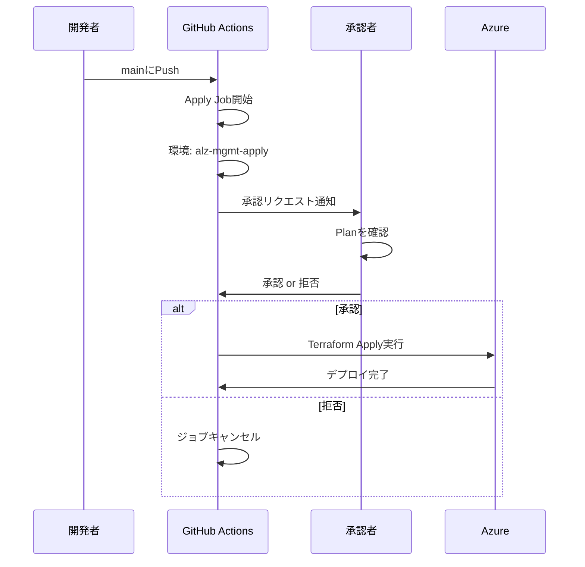
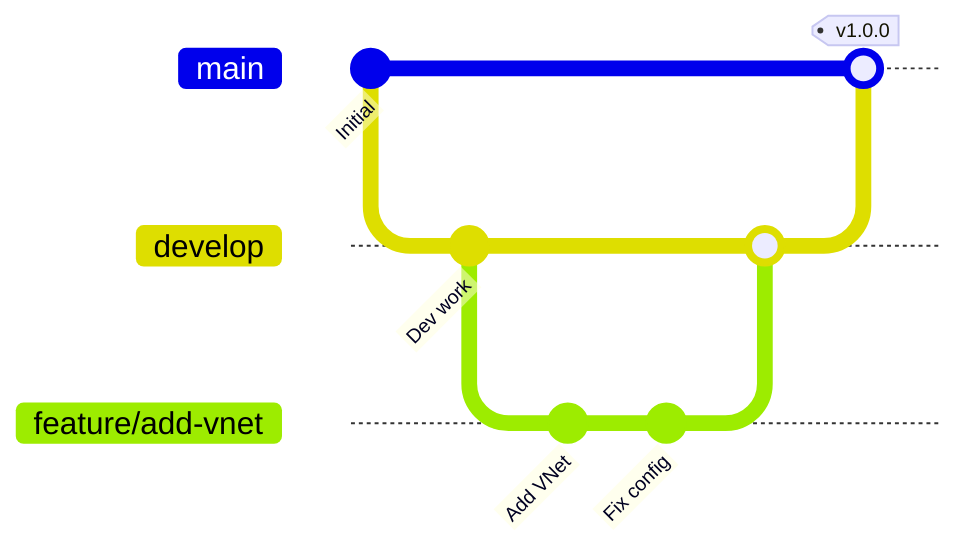
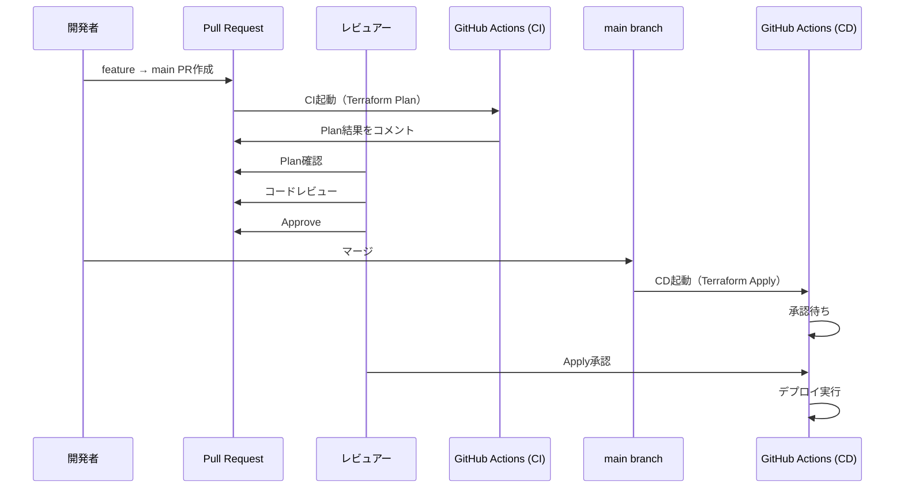

# 13. CI/CDパイプライン構築 - 実践的な自動化

!!! info "この章で学ぶこと"
    再利用可能ワークフローを使った実践的なCI/CDパイプラインを構築します：

    1. 再利用可能ワークフローの理解
    2. 環境設定とデプロイ戦略
    3. Plan/Apply自動化
    4. 本番運用のワークフロー設計

    この章を読めば、本格的なCI/CDパイプラインが作れます。

---

## Part 1: 再利用可能ワークフローの理解

### 再利用可能ワークフローとは

同じロジックを複数のワークフローで使い回す仕組みです。

=== "通常のワークフロー（重複コード）"

    ```yaml title="ci.yaml"
    jobs:
      plan:
        steps:
          - uses: actions/checkout@v4
          - uses: hashicorp/setup-terraform@v3
          - uses: azure/login@v2
          - run: terraform init
          - run: terraform plan
    ```
    
    ```yaml title="cd.yaml"
    jobs:
      apply:
        steps:
          - uses: actions/checkout@v4
          - uses: hashicorp/setup-terraform@v3
          - uses: azure/login@v2
          - run: terraform init
          - run: terraform apply
    ```
    
    同じコードが2箇所に！

=== "再利用可能ワークフロー"

    ```yaml title="terraform-template.yaml（テンプレート）"
    on:
      workflow_call:
        inputs:
          command:
            required: true
            type: string
    
    jobs:
      terraform:
        steps:
          - uses: actions/checkout@v4
          - uses: hashicorp/setup-terraform@v3
          - uses: azure/login@v2
          - run: terraform init
          - run: terraform ${{ inputs.command }}
    ```
    
    ```yaml title="ci.yaml（呼び出し側）"
    jobs:
      plan:
        uses: org/repo/.github/workflows/terraform-template.yaml@main
        with:
          command: plan
    ```
    
    ```yaml title="cd.yaml（呼び出し側）"
    jobs:
      apply:
        uses: org/repo/.github/workflows/terraform-template.yaml@main
        with:
          command: apply
    ```

!!! success "再利用可能ワークフローのメリット"
    - コードの重複がなくなる
    - メンテナンスが楽
    - 一箇所直せば全体に反映
    - ベストプラクティスを標準化

### テンプレートリポジトリの設計

再利用可能ワークフローは、専用のテンプレートリポジトリに配置します。

```text title="リポジトリ構成"
alz-mgmt-templates/
├── .github/
│   └── workflows/
│       ├── ci-template.yaml    ← Plan用テンプレート
│       └── cd-template.yaml    ← Apply用テンプレート
└── README.md

alz-mgmt/
├── .github/
│   └── workflows/
│       ├── ci.yaml             ← テンプレートを呼び出す
│       └── cd.yaml             ← テンプレートを呼び出す
├── main.tf
└── variables.tf
```

**構成の理由**:

- **alz-mgmt-templates**: ワークフローのロジックを集約
- **alz-mgmt**: 実際のTerraformコード + テンプレート呼び出し

!!! tip "なぜ分けるの？"
    - 1つのテンプレートを複数プロジェクトで使い回せる
    - ワークフロー変更時、テンプレートだけ修正すればOK
    - プロジェクトコードとワークフローロジックを分離

### inputs/secrets の定義

テンプレートに渡すパラメータを定義します。

=== "inputs（入力値）"

    ```yaml title="テンプレート側で定義"
    on:
      workflow_call:
        inputs:
          terraform_version:
            description: 'Terraform version to use'
            required: false
            type: string
            default: '1.9.0'
          
          working_directory:
            description: 'Working directory'
            required: false
            type: string
            default: '.'
          
          environment_name:
            description: 'Environment name'
            required: true
            type: string
    ```
    
    ```yaml title="呼び出し側で指定"
    jobs:
      plan:
        uses: org/templates/.github/workflows/ci-template.yaml@main
        with:
          terraform_version: '1.9.0'
          working_directory: '.'
          environment_name: 'alz-mgmt-plan'
    ```

=== "secrets（機密情報）"

    ```yaml title="テンプレート側で定義"
    on:
      workflow_call:
        secrets:
          AZURE_CLIENT_ID:
            required: true
          AZURE_TENANT_ID:
            required: true
          AZURE_SUBSCRIPTION_ID:
            required: true
    ```
    
    ```yaml title="呼び出し側で指定"
    jobs:
      plan:
        uses: org/templates/.github/workflows/ci-template.yaml@main
        secrets:
          AZURE_CLIENT_ID: ${{ secrets.AZURE_CLIENT_ID }}
          AZURE_TENANT_ID: ${{ secrets.AZURE_TENANT_ID }}
          AZURE_SUBSCRIPTION_ID: ${{ secrets.AZURE_SUBSCRIPTION_ID }}
    ```

!!! warning "inherit は使えない"
    ```yaml
    # ❌ NG: secretsをinheritで渡せない（OIDC環境）
    jobs:
      plan:
        uses: org/templates/.github/workflows/ci-template.yaml@main
        secrets: inherit  # これはOIDCではNG
    ```
    
    OIDCの場合、明示的にsecretsを渡す必要があります。

### outputs の活用

テンプレートから値を返すことができます。

```yaml title="ci-template.yaml（テンプレート側）"
on:
  workflow_call:
    outputs:
      plan_exitcode:
        description: 'Terraform plan exit code'
        value: ${{ jobs.plan.outputs.exitcode }}

jobs:
  plan:
    outputs:
      exitcode: ${{ steps.plan.outputs.exitcode }}
    steps:
      - id: plan
        run: |
          terraform plan -detailed-exitcode
          echo "exitcode=$?" >> $GITHUB_OUTPUT
```

```yaml title="ci.yaml（呼び出し側）"
jobs:
  terraform_plan:
    uses: org/templates/.github/workflows/ci-template.yaml@main
  
  notify:
    needs: terraform_plan
    if: needs.terraform_plan.outputs.plan_exitcode == '2'
    steps:
      - run: echo "Changes detected!"
```

**terraform plan の exit code**:

- `0`: 変更なし
- `1`: エラー
- `2`: 変更あり

### 実際のテンプレート例

Azure Landing Zonesプロジェクトでの実際のテンプレートを見てみましょう。

```yaml title="ci-template.yaml（Plan用テンプレート）"
name: Terraform Plan Template

on:
  workflow_call:
    inputs:
      terraform_version:
        required: false
        type: string
        default: '1.9.0'
      environment_name:
        required: true
        type: string

jobs:
  validate_and_plan:
    name: Validate and Plan
    runs-on: ubuntu-latest
    environment: ${{ inputs.environment_name }}
    
    permissions:
      id-token: write
      contents: read
      pull-requests: write
    
    steps:
      - name: Checkout
        uses: actions/checkout@v4
      
      - name: Setup Terraform
        uses: hashicorp/setup-terraform@v3
        with:
          terraform_version: ${{ inputs.terraform_version }}
      
      - name: Azure Login (OIDC)
        uses: azure/login@v2
        with:
          client-id: ${{ vars.AZURE_CLIENT_ID }}
          tenant-id: ${{ vars.AZURE_TENANT_ID }}
          subscription-id: ${{ vars.AZURE_SUBSCRIPTION_ID }}
      
      - name: Terraform Init
        run: |
          terraform init \
            -backend-config="resource_group_name=${{ vars.BACKEND_AZURE_RESOURCE_GROUP_NAME }}" \
            -backend-config="storage_account_name=${{ vars.BACKEND_AZURE_STORAGE_ACCOUNT_NAME }}" \
            -backend-config="container_name=${{ vars.BACKEND_AZURE_STORAGE_ACCOUNT_CONTAINER_NAME }}"
      
      - name: Terraform Format Check
        run: terraform fmt -check
      
      - name: Terraform Validate
        run: terraform validate
      
      - name: Terraform Plan
        id: plan
        run: terraform plan -no-color
      
      - name: Comment PR
        if: github.event_name == 'pull_request'
        uses: actions/github-script@v7
        with:
          script: |
            github.rest.issues.createComment({
              issue_number: context.issue.number,
              owner: context.repo.owner,
              repo: context.repo.repo,
              body: '## Terraform Plan\n\n```\n${{ steps.plan.outputs.stdout }}\n```'
            })
```

わかりますか？このテンプレートがあれば、呼び出し側は数行で済みます。

---

## Part 2: 環境設定とデプロイ戦略

### Environments の作成

GitHub EnvironmentsでPlan環境とApply環境を分けます。

=== "Plan環境"

    **場所**: Settings → Environments → New environment
    
    **名前**: `alz-mgmt-plan`
    
    **Protection rules**:
    
    - Required reviewers: なし（自動実行）
    - Deployment branches: `Selected branches` → `main`
    
    **Variables**:
    
    ```
    AZURE_CLIENT_ID: <plan-identity-client-id>
    AZURE_TENANT_ID: <tenant-id>
    AZURE_SUBSCRIPTION_ID: <subscription-id>
    BACKEND_AZURE_RESOURCE_GROUP_NAME: alz-state-rg
    BACKEND_AZURE_STORAGE_ACCOUNT_NAME: stoalzmgmt001
    BACKEND_AZURE_STORAGE_ACCOUNT_CONTAINER_NAME: tfstate
    ```

=== "Apply環境"

    **場所**: Settings → Environments → New environment
    
    **名前**: `alz-mgmt-apply`
    
    **Protection rules**:
    
    - Required reviewers: ✅ 承認者を指定
      - `user1@example.com`
      - `user2@example.com`
    - Wait timer: 0 minutes
    - Deployment branches: `Selected branches` → `main`
    
    **Variables**:
    
    ```
    AZURE_CLIENT_ID: <apply-identity-client-id>
    AZURE_TENANT_ID: <tenant-id>
    AZURE_SUBSCRIPTION_ID: <subscription-id>
    BACKEND_AZURE_RESOURCE_GROUP_NAME: alz-state-rg
    BACKEND_AZURE_STORAGE_ACCOUNT_NAME: stoalzmgmt001
    BACKEND_AZURE_STORAGE_ACCOUNT_CONTAINER_NAME: tfstate
    ```

!!! success "環境分離のメリット"
    - Plan用とApply用でManaged Identityを分ける（最小権限）
    - Apply環境は承認必須（誤デプロイ防止）
    - 環境ごとに異なる設定が可能

### Protection rules の設定

Apply環境には必ず承認ルールを設定しましょう。

```yaml title="Settings → Environments → alz-mgmt-apply → Protection rules"
✅ Required reviewers
   Number of reviewers: 1
   Reviewers:
     👤 user1@example.com
     👤 user2@example.com
   
   ※ いずれか1人の承認で実行可能

⏱ Wait timer
   Minutes to wait before allowing deployments to proceed: 0

🌿 Deployment branches
   Selected branches:
     ✓ main
```

**ワークフローでの動作**:

```yaml title="cd.yaml"
jobs:
  apply:
    environment: alz-mgmt-apply  # 承認必要
    steps:
      - name: Terraform Apply
        run: terraform apply -auto-approve
```

このジョブ実行時、指定された承認者にGitHubから通知が来て、承認するまで待機します。

### Plan環境とApply環境

2つの環境の違いを理解しましょう。

=== "Plan環境（検証用）"

    **目的**: PRレビュー時の検証
    
    **権限**: 読み取り専用（Reader）
    
    **承認**: 不要（自動実行）
    
    **トリガー**: PR作成・更新時
    
    ```yaml title="使用例"
    on:
      pull_request:
        branches: [main]
    
    jobs:
      plan:
        environment: alz-mgmt-plan
        steps:
          - run: terraform plan
    ```

=== "Apply環境（本番適用）"

    **目的**: mainマージ後のデプロイ
    
    **権限**: 書き込み可能（Contributor）
    
    **承認**: 必要（承認者の承認後実行）
    
    **トリガー**: mainへのPush
    
    ```yaml title="使用例"
    on:
      push:
        branches: [main]
    
    jobs:
      apply:
        environment: alz-mgmt-apply
        steps:
          - run: terraform apply -auto-approve
    ```

!!! warning "絶対に守るルール"
    - Plan環境に書き込み権限を与えない
    - Apply環境には必ず承認ルールを設定
    - mainブランチ保護ルールも併用

### Approval設定

承認フローの詳細を見てみましょう。



**承認画面**:

GitHub Actions実行画面で、承認待ちの表示が出ます：

```text
⏸ Waiting for approval
   
   This workflow is waiting for approval from:
   - user1@example.com
   - user2@example.com
   
   [Review deployments]
```

承認者は「Review deployments」をクリックして承認・拒否を選択します。

### デプロイ戦略の選択

プロジェクトに応じたデプロイ戦略を選びましょう。

=== "戦略1: 完全自動化"

    **特徴**: mainマージ後、自動でデプロイ
    
    **適用**: 開発初期、検証環境
    
    ```yaml title="cd.yaml"
    on:
      push:
        branches: [main]
    
    jobs:
      apply:
        environment: alz-mgmt-apply
        # Protection rulesなし
        steps:
          - run: terraform apply -auto-approve
    ```

=== "戦略2: 承認後自動デプロイ"

    **特徴**: 承認後、自動でデプロイ
    
    **適用**: 本番環境（推奨）
    
    ```yaml title="cd.yaml"
    on:
      push:
        branches: [main]
    
    jobs:
      apply:
        environment: alz-mgmt-apply
        # Protection rules: Required reviewers
        steps:
          - run: terraform apply -auto-approve
    ```

=== "戦略3: 手動トリガー"

    **特徴**: 手動実行のみ
    
    **適用**: 重要な変更時のみデプロイ
    
    ```yaml title="cd.yaml"
    on:
      workflow_dispatch:
        inputs:
          confirm:
            description: 'Type "DEPLOY" to confirm'
            required: true
    
    jobs:
      apply:
        if: inputs.confirm == 'DEPLOY'
        environment: alz-mgmt-apply
        steps:
          - run: terraform apply -auto-approve
    ```

!!! tip "推奨: 戦略2（承認後自動デプロイ）"
    - 誤デプロイを防げる
    - Planを確認してから承認
    - 承認後は自動化（手間なし）

---

## Part 3: Plan/Apply自動化

### Terraform Plan ワークフロー

PR作成時に自動でPlanを実行します。

```yaml title=".github/workflows/ci.yaml"
name: Continuous Integration

on:
  pull_request:
    branches: [main]

jobs:
  terraform_plan:
    name: Terraform Plan
    uses: shuhei0720org01/alz-mgmt-templates/.github/workflows/ci-template.yaml@main
    with:
      terraform_version: '1.9.0'
      environment_name: 'alz-mgmt-plan'
```

**動作**:

1. PR作成
2. GitHub Actions起動
3. ci-template.yaml呼び出し
4. Terraform Plan実行
5. 結果をPRにコメント

### Terraform Apply ワークフロー

mainマージ後に自動でApplyを実行します。

```yaml title=".github/workflows/cd.yaml"
name: Continuous Delivery

on:
  push:
    branches: [main]

jobs:
  terraform_apply:
    name: Terraform Apply
    uses: shuhei0720org01/alz-mgmt-templates/.github/workflows/cd-template.yaml@main
    with:
      terraform_version: '1.9.0'
      environment_name: 'alz-mgmt-apply'
```

**動作**:

1. mainにPush
2. GitHub Actions起動
3. 承認待ち
4. 承認後、cd-template.yaml呼び出し
5. Terraform Apply実行

### PR時の自動Plan

PRにPlan結果をコメントする実装です。

```yaml title="ci-template.yaml"
jobs:
  validate_and_plan:
    steps:
      - name: Terraform Plan
        id: plan
        run: |
          terraform plan -no-color | tee plan.txt
        continue-on-error: true
      
      - name: Comment PR
        if: github.event_name == 'pull_request'
        uses: actions/github-script@v7
        with:
          script: |
            const fs = require('fs');
            const plan = fs.readFileSync('plan.txt', 'utf8');
            
            const output = `## Terraform Plan 📋
            
            <details>
            <summary>Show Plan</summary>
            
            \`\`\`terraform
            ${plan}
            \`\`\`
            
            </details>
            
            *Pushed by: @${{ github.actor }}*`;
            
            github.rest.issues.createComment({
              issue_number: context.issue.number,
              owner: context.repo.owner,
              repo: context.repo.repo,
              body: output
            });
```

**PRでの表示**:

```markdown
## Terraform Plan 📋

<details>
<summary>Show Plan</summary>

```terraform
Terraform will perform the following actions:

  # azurerm_resource_group.example will be created
  + resource "azurerm_resource_group" "example" {
      + id       = (known after apply)
      + location = "japaneast"
      + name     = "my-rg"
    }

Plan: 1 to add, 0 to change, 0 to destroy.
```

</details>

*Pushed by: @user1*
```

レビュアーはこのコメントでPlanを確認できます。

### mainマージ後の自動Apply

mainマージ後の自動Applyの流れです。

```yaml title="cd-template.yaml"
name: Terraform Apply Template

on:
  workflow_call:
    inputs:
      terraform_version:
        required: false
        type: string
        default: '1.9.0'
      environment_name:
        required: true
        type: string

jobs:
  terraform_apply:
    name: Terraform Apply
    runs-on: ubuntu-latest
    environment: ${{ inputs.environment_name }}
    
    permissions:
      id-token: write
      contents: read
    
    steps:
      - name: Checkout
        uses: actions/checkout@v4
      
      - name: Setup Terraform
        uses: hashicorp/setup-terraform@v3
        with:
          terraform_version: ${{ inputs.terraform_version }}
      
      - name: Azure Login (OIDC)
        uses: azure/login@v2
        with:
          client-id: ${{ vars.AZURE_CLIENT_ID }}
          tenant-id: ${{ vars.AZURE_TENANT_ID }}
          subscription-id: ${{ vars.AZURE_SUBSCRIPTION_ID }}
      
      - name: Terraform Init
        run: |
          terraform init \
            -backend-config="resource_group_name=${{ vars.BACKEND_AZURE_RESOURCE_GROUP_NAME }}" \
            -backend-config="storage_account_name=${{ vars.BACKEND_AZURE_STORAGE_ACCOUNT_NAME }}" \
            -backend-config="container_name=${{ vars.BACKEND_AZURE_STORAGE_ACCOUNT_CONTAINER_NAME }}"
      
      - name: Terraform Apply
        run: terraform apply -auto-approve
```

!!! warning "auto-approveの注意"
    `terraform apply -auto-approve` は承認プロンプトをスキップします。
    
    - 承認はGitHub Environmentsで行う
    - Terraformでは自動実行

### エラーハンドリング

エラー発生時の通知を実装します。

```yaml title="エラー通知の実装"
jobs:
  terraform_apply:
    steps:
      - name: Terraform Apply
        id: apply
        run: terraform apply -auto-approve
        continue-on-error: true
      
      - name: Notify on failure
        if: steps.apply.outcome == 'failure'
        uses: actions/github-script@v7
        with:
          script: |
            github.rest.repos.createCommitStatus({
              owner: context.repo.owner,
              repo: context.repo.repo,
              sha: context.sha,
              state: 'failure',
              context: 'Terraform Apply',
              description: 'Apply failed! Check logs.'
            });
      
      - name: Fail job if apply failed
        if: steps.apply.outcome == 'failure'
        run: exit 1
```

!!! tip "Slack通知も追加可能"
    ```yaml
    - name: Notify Slack
      if: failure()
      uses: slackapi/slack-github-action@v1
      with:
        webhook-url: ${{ secrets.SLACK_WEBHOOK_URL }}
        payload: |
          {
            "text": "Terraform Apply failed in ${{ github.repository }}"
          }
    ```

---

## Part 4: 本番運用のワークフロー設計

### ブランチ戦略

Git Flowベースのブランチ戦略を採用します。



**ブランチ構成**:

- **main**: 本番環境（保護ブランチ）
- **develop**: 開発環境
- **feature/***: 機能開発ブランチ

**ワークフロートリガー**:

```yaml title="ブランチ別トリガー"
# CI: すべてのブランチのPR
on:
  pull_request:
    branches:
      - main
      - develop

# CD: mainのみ
on:
  push:
    branches:
      - main
```

### レビュー承認フロー

PRレビュー → 承認 → マージ → 自動デプロイの流れです。



**各ステップの詳細**:

1. **PR作成**: feature → main
2. **CI実行**: Terraform Plan
3. **Plan確認**: レビュアーがPlanを確認
4. **コードレビュー**: 変更内容を確認
5. **Approve**: レビュー承認
6. **マージ**: mainブランチへ統合
7. **CD実行**: Terraform Apply
8. **Apply承認**: デプロイを承認
9. **デプロイ実行**: リソース作成

### mainブランチ保護ルール

mainブランチには必ず保護ルールを設定します。

```yaml title="Settings → Branches → Branch protection rules"
Branch name pattern: main

✅ Require a pull request before merging
   ✅ Require approvals: 1
   ✅ Dismiss stale pull request approvals when new commits are pushed

✅ Require status checks to pass before merging
   ✅ Require branches to be up to date before merging
   Status checks:
     ✓ Terraform Plan

✅ Require conversation resolution before merging

✅ Do not allow bypassing the above settings
   Include administrators: ✅

❌ Allow force pushes
❌ Allow deletions
```

!!! danger "絶対に設定すべきルール"
    - PR必須（直接Pushを禁止）
    - 承認必須（最低1人）
    - Status check必須（Plan成功が条件）
    - 管理者も例外なし

### エラーハンドリング

本番運用で必要なエラーハンドリングです。

=== "リトライ機能"

    ```yaml title="一時的なエラーのリトライ"
    steps:
      - name: Terraform Init with retry
        uses: nick-fields/retry@v2
        with:
          timeout_minutes: 10
          max_attempts: 3
          retry_wait_seconds: 30
          command: terraform init
    ```

=== "タイムアウト設定"

    ```yaml title="長時間実行の防止"
    jobs:
      terraform_apply:
        timeout-minutes: 60  # 1時間でタイムアウト
        steps:
          - run: terraform apply -auto-approve
    ```

=== "ロールバック準備"

    ```yaml title="前の状態を保存"
    steps:
      - name: Backup state
        run: |
          terraform state pull > state-backup-$(date +%Y%m%d-%H%M%S).json
      
      - name: Upload backup
        uses: actions/upload-artifact@v4
        with:
          name: state-backup
          path: state-backup-*.json
    ```

### ロールバック戦略

デプロイ失敗時のロールバック方法です。

=== "方法1: Git Revert"

    ```bash title="前のコミットに戻す"
    # 最新のコミットを取り消す
    git revert HEAD
    git push origin main
    
    # CDワークフローが自動実行され、前の状態にロールバック
    ```

=== "方法2: State Rollback"

    ```yaml title="手動ロールバックワークフロー"
    name: Rollback
    
    on:
      workflow_dispatch:
        inputs:
          state_backup:
            description: 'State backup artifact name'
            required: true
    
    jobs:
      rollback:
        steps:
          - uses: actions/download-artifact@v4
            with:
              name: ${{ inputs.state_backup }}
          
          - name: Restore state
            run: |
              terraform state push state-backup-*.json
              terraform apply -auto-approve
    ```

=== "方法3: タグベースデプロイ"

    ```yaml title="特定バージョンをデプロイ"
    on:
      push:
        tags:
          - 'v*'
    
    jobs:
      deploy:
        steps:
          - uses: actions/checkout@v4
            with:
              ref: ${{ github.ref }}
          
          - name: Deploy specific version
            run: terraform apply -auto-approve
    ```

!!! tip "推奨: 方法1（Git Revert）"
    - 一番シンプル
    - 履歴が残る
    - 再現可能

### 通知設定

デプロイ成功・失敗の通知を設定します。

=== "Slack通知"

    ```yaml title="Slack通知の実装"
    steps:
      - name: Notify Success
        if: success()
        uses: slackapi/slack-github-action@v1
        with:
          webhook-url: ${{ secrets.SLACK_WEBHOOK_URL }}
          payload: |
            {
              "text": "✅ Deployment succeeded",
              "blocks": [
                {
                  "type": "section",
                  "text": {
                    "type": "mrkdwn",
                    "text": "*Deployment Successful* ✅\n\nRepository: ${{ github.repository }}\nBranch: ${{ github.ref }}\nCommit: ${{ github.sha }}"
                  }
                }
              ]
            }
      
      - name: Notify Failure
        if: failure()
        uses: slackapi/slack-github-action@v1
        with:
          webhook-url: ${{ secrets.SLACK_WEBHOOK_URL }}
          payload: |
            {
              "text": "❌ Deployment failed",
              "blocks": [
                {
                  "type": "section",
                  "text": {
                    "type": "mrkdwn",
                    "text": "*Deployment Failed* ❌\n\nRepository: ${{ github.repository }}\nBranch: ${{ github.ref }}\nCommit: ${{ github.sha }}\n\n<${{ github.server_url }}/${{ github.repository }}/actions/runs/${{ github.run_id }}|View Logs>"
                  }
                }
              ]
            }
    ```

=== "Email通知"

    ```yaml title="GitHub標準のEmail通知"
    # Settings → Notifications → Actions
    # ワークフロー実行結果のメール通知を有効化
    ```

=== "Teams通知"

    ```yaml title="Microsoft Teams通知"
    - name: Notify Teams
      if: always()
      uses: aliencube/microsoft-teams-actions@v0.8.0
      with:
        webhook_uri: ${{ secrets.TEAMS_WEBHOOK_URL }}
        title: Deployment Result
        summary: ${{ job.status }}
        text: |
          Repository: ${{ github.repository }}
          Status: ${{ job.status }}
    ```

### モニタリングとロギング

デプロイの監視とログ保存です。

```yaml title="ログ保存とメトリクス"
jobs:
  terraform_apply:
    steps:
      - name: Terraform Apply
        id: apply
        run: |
          terraform apply -auto-approve | tee apply.log
      
      - name: Upload logs
        if: always()
        uses: actions/upload-artifact@v4
        with:
          name: terraform-logs-${{ github.run_number }}
          path: |
            apply.log
            terraform.tfstate
          retention-days: 90
      
      - name: Record metrics
        if: always()
        run: |
          echo "Deploy duration: ${{ steps.apply.outputs.duration }}"
          echo "Resources created: $(grep 'created' apply.log | wc -l)"
          echo "Resources updated: $(grep 'updated' apply.log | wc -l)"
```

### 完全なワークフロー例

最終的な本番運用ワークフローです。

```yaml title=".github/workflows/ci.yaml（完全版）"
name: Continuous Integration

on:
  pull_request:
    branches: [main]

jobs:
  terraform_plan:
    name: Terraform Plan
    uses: shuhei0720org01/alz-mgmt-templates/.github/workflows/ci-template.yaml@main
    with:
      terraform_version: '1.9.0'
      environment_name: 'alz-mgmt-plan'
```

```yaml title=".github/workflows/cd.yaml（完全版）"
name: Continuous Delivery

on:
  push:
    branches: [main]

jobs:
  terraform_apply:
    name: Terraform Apply
    uses: shuhei0720org01/alz-mgmt-templates/.github/workflows/cd-template.yaml@main
    with:
      terraform_version: '1.9.0'
      environment_name: 'alz-mgmt-apply'
  
  notify:
    needs: terraform_apply
    if: always()
    runs-on: ubuntu-latest
    steps:
      - name: Notify Slack
        uses: slackapi/slack-github-action@v1
        with:
          webhook-url: ${{ secrets.SLACK_WEBHOOK_URL }}
          payload: |
            {
              "text": "Deployment ${{ needs.terraform_apply.result }}"
            }
```

わかりますか？実際の運用ワークフローは意外とシンプルです。複雑なロジックはテンプレート側に集約しています。

---

## まとめ

この章で学んだこと：

### ✅ Part 1: 再利用可能ワークフローの理解

- 再利用可能ワークフローとは
- テンプレートリポジトリの設計
- inputs/secrets/outputsの定義
- 実際のテンプレート例

### ✅ Part 2: 環境設定とデプロイ戦略

- Environmentsの作成
- Protection rulesの設定
- Plan環境とApply環境の分離
- 承認フローの設計

### ✅ Part 3: Plan/Apply自動化

- Terraform Planワークフロー
- Terraform Applyワークフロー
- PR時の自動Plan
- エラーハンドリング

### ✅ Part 4: 本番運用のワークフロー設計

- ブランチ戦略
- レビュー承認フロー
- mainブランチ保護ルール
- ロールバック戦略
- 通知設定

次の章では、Azure公式Bootstrap手順に従って実際にLanding Zonesをデプロイします。

!!! tip "次の章へ"
    [Chapter 14: Bootstrap Phase 1](14_Bootstrap_Phase_1.md)で、前提条件の準備からBootstrap環境のセットアップまでを学びます。
