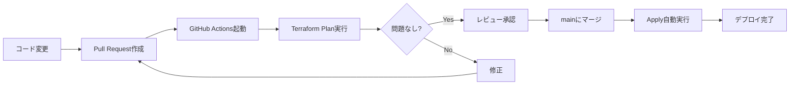
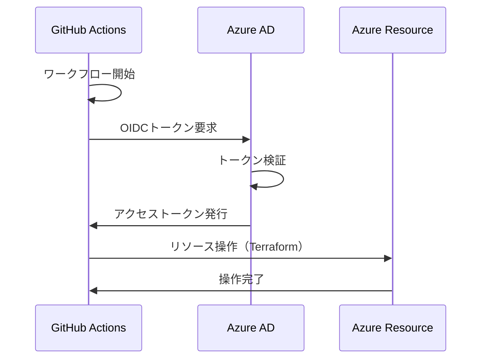
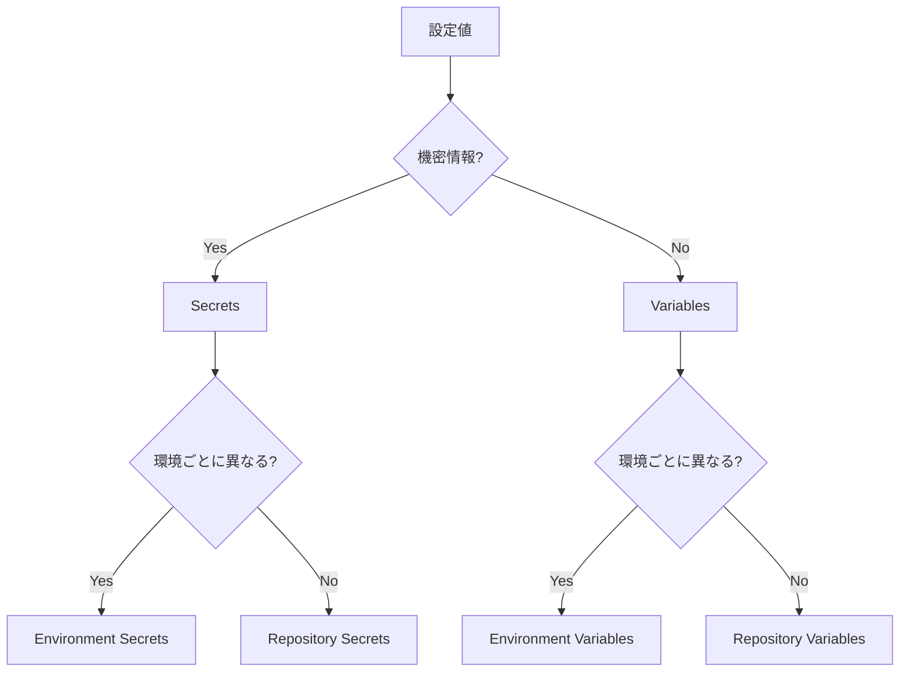

# 14. GitHub Actions基礎 - CI/CDを理解しよう

!!! info "この章で学ぶこと"
    GitHub Actionsを使ったCI/CDの基礎を学びます：

    1. GitHub Actionsって何？
    2. ワークフロー構文の理解
    3. OIDC認証の仕組み
    4. Secrets・Variables管理

    この章を読めば、自動デプロイの仕組みが理解できます。

---

## Part 1: GitHub Actionsとは

### CI/CDって何？

まず、CI/CDの概念から理解しましょう。

=== "CI (Continuous Integration)"

    ```text title="継続的インテグレーション"
    開発者がコードをプッシュ
      ↓
    自動でテスト・検証
      ↓
    問題があれば即座に通知
    ```

    **目的**: コードの品質を保つ

=== "CD (Continuous Delivery)"

    ```text title="継続的デリバリー"
    mainブランチにマージ
      ↓
    自動でデプロイ
      ↓
    本番環境に反映
    ```

    **目的**: リリースを自動化

!!! tip "例えるなら"
    - **手動デプロイ**: 料理を全部自分で作る
    - **CI/CD**: オートメーションキッチン（自動で調理）

### GitHub Actionsって何？

GitHub上で動くCI/CDサービスです。

```yaml title=".github/workflows/ci.yaml"
name: CI

on:
  push:
    branches: [main]

jobs:
  test:
    runs-on: ubuntu-latest
    steps:
      - uses: actions/checkout@v4
      - name: Run tests
        run: npm test
```

このファイルをリポジトリに置くだけで、CI/CDが動き始めます。

!!! success "GitHub Actionsの特徴"
    - GitHubに統合されている
    - 無料枠がある（Public: 無制限、Private: 2000分/月）
    - マーケットプレイスに豊富なActionがある
    - YAMLで設定できる

### GitHub Actionsの開発フロー

実際の開発フローを見てみましょう：



**開発の流れ**:

1. **コード変更**: feature ブランチで作業
2. **Pull Request作成**: feature → main への PR
3. **自動検証**: terraform plan が自動実行
4. **レビュー**: チームメンバーが確認
5. **マージ**: mainブランチに統合
6. **自動デプロイ**: terraform apply が自動実行

### ワークフロー・ジョブ・ステップの関係

GitHub Actionsは3階層の構造になっています：

```yaml title="構造の理解"
# ワークフロー（Workflow）
name: CI/CD Pipeline

on: [push]

# ジョブ（Job）
jobs:
  build:
    runs-on: ubuntu-latest
    
    # ステップ（Steps）
    steps:
      - name: Checkout code
        uses: actions/checkout@v4
      
      - name: Run tests
        run: npm test
```

=== "ワークフロー（Workflow）"

    - 最上位の概念
    - `.github/workflows/*.yaml` ファイル
    - 複数のジョブをまとめたもの

=== "ジョブ（Job）"

    - ワークフローの中の作業単位
    - 並列実行可能
    - 別々のランナーで実行

=== "ステップ（Step）"

    - ジョブの中の個別タスク
    - 順番に実行される
    - コマンド or Action

!!! example "実例：ビルド・テスト・デプロイ"
    ```yaml title="3つのジョブ"
    jobs:
      build:
        steps:
          - name: Build
            run: npm run build
      
      test:
        needs: build
        steps:
          - name: Test
            run: npm test
      
      deploy:
        needs: test
        steps:
          - name: Deploy
            run: npm run deploy
    ```

### 実例で理解するワークフロー

実際のAzure Landing Zonesプロジェクトでのワークフローを見てみましょう：

```yaml title=".github/workflows/ci.yaml"
name: Continuous Integration

on:
  pull_request:
    branches: [main]

jobs:
  validate_and_plan:
    name: Validate and Plan
    runs-on: ubuntu-latest
    
    permissions:
      id-token: write
      contents: read
    
    steps:
      - name: Checkout
        uses: actions/checkout@v4
      
      - name: Setup Terraform
        uses: hashicorp/setup-terraform@v3
        with:
          terraform_version: 1.9.0
      
      - name: Azure Login (OIDC)
        uses: azure/login@v2
        with:
          client-id: ${{ secrets.AZURE_CLIENT_ID }}
          tenant-id: ${{ secrets.AZURE_TENANT_ID }}
          subscription-id: ${{ secrets.AZURE_SUBSCRIPTION_ID }}
      
      - name: Terraform Init
        run: terraform init
      
      - name: Terraform Validate
        run: terraform validate
      
      - name: Terraform Plan
        run: terraform plan
```

**何が起こるか**:

1. PR作成時にトリガー
2. Terraformをセットアップ
3. Azure OIDC認証
4. Terraform初期化
5. 構文チェック
6. 実行計画の作成

わかりますか？このワークフローがあれば、PRを作るだけで自動的に検証が走ります。

---

## Part 2: ワークフロー構文の理解

### YAMLの基本

GitHub ActionsはYAML形式で書きます。まずYAMLの基本を押さえましょう。

=== "基本構文"

    ```yaml title="YAML基本"
    # コメント
    key: value
    
    # リスト
    items:
      - item1
      - item2
      - item3
    
    # ネスト
    parent:
      child: value
      grandchild:
        key: value
    ```

=== "注意点"

    ```yaml title="YAMLの罠"
    # ❌ NG: インデント不統一（スペース2個とタブ混在）
    jobs:
      build:
        steps:
    	  - run: test  # タブ使用（NG）
    
    # ✅ OK: スペース2個で統一
    jobs:
      build:
        steps:
          - run: test
    ```

!!! warning "YAMLでよくあるミス"
    - インデントミス（スペース2個で統一）
    - コロン`:` の後にスペースがない
    - クォート `"` の閉じ忘れ

### on（トリガー）の設定

ワークフローをいつ実行するか指定します。

=== "Pushトリガー"

    ```yaml title="mainブランチへのPush"
    on:
      push:
        branches:
          - main
    ```

=== "Pull Requestトリガー"

    ```yaml title="PR作成時"
    on:
      pull_request:
        branches:
          - main
    ```

=== "複数トリガー"

    ```yaml title="PushとPR両方"
    on:
      push:
        branches: [main]
      pull_request:
        branches: [main]
    ```

=== "Scheduleトリガー"

    ```yaml title="毎日午前2時"
    on:
      schedule:
        - cron: '0 2 * * *'
    ```

=== "手動トリガー"

    ```yaml title="GitHub UIから手動実行"
    on:
      workflow_dispatch:
    ```

!!! tip "トリガーの使い分け"
    - **push**: デプロイ用（mainマージ後）
    - **pull_request**: テスト用（PR作成時）
    - **schedule**: 定期実行（バックアップ等）
    - **workflow_dispatch**: 手動実行（緊急対応）

### jobs の定義

ジョブは実際の作業を定義します。

```yaml title="ジョブの基本構成"
jobs:
  job-name:
    runs-on: ubuntu-latest
    
    steps:
      - name: Step 1
        run: echo "Hello"
```

**必須項目**:

- `runs-on`: 実行環境（ubuntu-latest, windows-latest, macos-latest）
- `steps`: 実行するステップのリスト

**オプション項目**:

```yaml title="よく使うオプション"
jobs:
  build:
    runs-on: ubuntu-latest
    
    # タイムアウト（デフォルト360分）
    timeout-minutes: 30
    
    # 環境変数
    env:
      NODE_ENV: production
    
    # 依存関係
    needs: [test]
    
    # 条件付き実行
    if: github.ref == 'refs/heads/main'
    
    steps:
      - run: npm run build
```

### 並列実行と直列実行

ジョブは並列実行できます。

=== "並列実行（デフォルト）"

    ```yaml title="同時に実行"
    jobs:
      job-a:
        runs-on: ubuntu-latest
        steps:
          - run: echo "Job A"
      
      job-b:
        runs-on: ubuntu-latest
        steps:
          - run: echo "Job B"
    ```

    Job AとJob Bが同時に実行されます。

=== "直列実行（needs使用）"

    ```yaml title="順番に実行"
    jobs:
      build:
        runs-on: ubuntu-latest
        steps:
          - run: npm run build
      
      test:
        needs: build
        runs-on: ubuntu-latest
        steps:
          - run: npm test
      
      deploy:
        needs: test
        runs-on: ubuntu-latest
        steps:
          - run: npm run deploy
    ```

    build → test → deploy の順に実行されます。

### steps の実装

ステップは2種類の書き方があります。

=== "コマンド実行（run）"

    ```yaml title="シェルコマンド"
    steps:
      - name: Print message
        run: echo "Hello World"
      
      - name: Multi-line script
        run: |
          echo "Line 1"
          echo "Line 2"
          npm install
          npm test
    ```

=== "Action使用（uses）"

    ```yaml title="既存のActionを利用"
    steps:
      - name: Checkout code
        uses: actions/checkout@v4
      
      - name: Setup Node.js
        uses: actions/setup-node@v4
        with:
          node-version: '20'
      
      - name: Setup Terraform
        uses: hashicorp/setup-terraform@v3
        with:
          terraform_version: 1.9.0
    ```

!!! tip "Actionとは"
    GitHub Marketplaceで公開されている再利用可能なコード。
    
    - `actions/checkout`: コードのチェックアウト
    - `actions/setup-node`: Node.jsのセットアップ
    - `hashicorp/setup-terraform`: Terraformのインストール

### 環境変数とSecrets

環境変数には3種類あります。

=== "ワークフローレベル"

    ```yaml title="全ジョブで利用可能"
    name: CI
    
    env:
      NODE_ENV: production
      LOG_LEVEL: info
    
    jobs:
      build:
        steps:
          - run: echo $NODE_ENV
    ```

=== "ジョブレベル"

    ```yaml title="特定ジョブのみ"
    jobs:
      build:
        env:
          BUILD_ENV: staging
        steps:
          - run: echo $BUILD_ENV
    ```

=== "ステップレベル"

    ```yaml title="特定ステップのみ"
    steps:
      - name: Deploy
        env:
          DEPLOY_TARGET: production
        run: npm run deploy
    ```

### Secretsの使い方

機密情報はSecretsに保存します。

```yaml title="Secretsの参照"
steps:
  - name: Azure Login
    uses: azure/login@v2
    with:
      client-id: ${{ secrets.AZURE_CLIENT_ID }}
      tenant-id: ${{ secrets.AZURE_TENANT_ID }}
      subscription-id: ${{ secrets.AZURE_SUBSCRIPTION_ID }}
```

!!! warning "Secretsの注意点"
    - ログに出力されない（マスクされる）
    - PRのforkから参照できない（セキュリティ）
    - 変更履歴は残らない

### 条件分岐

ステップやジョブを条件付きで実行できます。

```yaml title="if条件の例"
jobs:
  deploy:
    if: github.ref == 'refs/heads/main'
    steps:
      - run: npm run deploy
  
  test:
    steps:
      - name: Run tests
        if: success()
        run: npm test
      
      - name: Notify on failure
        if: failure()
        run: echo "Tests failed!"
```

**よく使う条件**:

- `success()`: 前のステップが成功
- `failure()`: 前のステップが失敗
- `always()`: 常に実行
- `github.ref == 'refs/heads/main'`: mainブランチのみ

---

## Part 3: OIDC認証の仕組み

### 従来のSecret認証の問題点

以前は、Azure認証にService Principalのパスワードを使っていました。

=== "従来の方法（Secret方式）"

    ```yaml title="Secret認証（非推奨）"
    steps:
      - name: Azure Login
        uses: azure/login@v2
        with:
          creds: ${{ secrets.AZURE_CREDENTIALS }}
          # {
          #   "clientId": "xxx",
          #   "clientSecret": "yyy",  ← パスワード
          #   "subscriptionId": "zzz",
          #   "tenantId": "aaa"
          # }
    ```

=== "問題点"

    !!! danger "Secretの問題"
        - **漏洩リスク**: Secretが流出すると悪用される
        - **ローテーション**: 定期的なパスワード変更が必要
        - **管理コスト**: 複数環境で管理が大変
        - **有効期限**: 期限切れで突然エラー

### OIDCとは何か

OIDC（OpenID Connect）は、パスワードなしで認証する仕組みです。

```text title="OIDC認証の流れ"
GitHub Actions
  ↓
  「私はGitHub Actionsです」（トークン発行）
  ↓
Azure
  ↓
  「あなたのトークンを確認しました。OK!」
  ↓
認証成功（パスワード不要）
```

!!! success "OIDCのメリット"
    - パスワード不要
    - 自動でトークン発行
    - 短時間で期限切れ（安全）
    - ローテーション不要

### Azure OIDC認証の流れ

実際の認証フローを見てみましょう。



**ステップ説明**:

1. **GitHub Actions起動**: ワークフロー開始
2. **OIDCトークン要求**: GitHub → Azure ADに認証要求
3. **トークン検証**: Azure ADが発行元を確認
4. **アクセストークン発行**: 一時的なトークンを発行
5. **リソース操作**: Terraformでリソース作成
6. **完了**: トークンは自動で無効化

### Federated Identity Credentialの理解

Azure側でGitHub Actionsを信頼する設定をします。

```bash title="Federated Credentialの作成"
az identity federated-credential create \
  --name "github-actions-plan" \
  --identity-name "alz-plan-identity" \
  --resource-group "alz-identity-rg" \
  --issuer "https://token.actions.githubusercontent.com" \
  --subject "repo:shuhei0720org01/alz-mgmt:environment:alz-mgmt-plan" \
  --audiences "api://AzureADTokenExchange"
```

**重要なパラメータ**:

- `issuer`: GitHubのトークン発行元
- `subject`: どのリポジトリ・環境を信頼するか
- `audiences`: トークンの受信者

!!! example "subject（サブジェクト）の構造"
    ```
    repo:組織名/リポジトリ名:environment:環境名
    
    例: repo:shuhei0720org01/alz-mgmt:environment:alz-mgmt-plan
    ```
    
    この設定により、alz-mgmt-plan環境からのみ認証を許可します。

### permissions設定

GitHub Actions側で、OIDCトークンを取得する権限を設定します。

```yaml title="permissions設定"
jobs:
  plan:
    runs-on: ubuntu-latest
    
    permissions:
      id-token: write     # OIDCトークン取得に必要
      contents: read      # コード読み取り
    
    steps:
      - uses: actions/checkout@v4
      
      - name: Azure Login (OIDC)
        uses: azure/login@v2
        with:
          client-id: ${{ vars.AZURE_CLIENT_ID }}
          tenant-id: ${{ vars.AZURE_TENANT_ID }}
          subscription-id: ${{ vars.AZURE_SUBSCRIPTION_ID }}
```

**必須permissions**:

- `id-token: write`: OIDCトークンの書き込み権限
- `contents: read`: リポジトリの読み取り権限

!!! warning "permissionsを忘れると"
    ```
    Error: Unable to get ACTIONS_ID_TOKEN_REQUEST_URL env variable
    ```
    
    このエラーが出たら、permissions設定を確認してください。

### OIDC設定の全体像

Azure側とGitHub側の設定をまとめます。

=== "Azure側設定"

    ```bash title="1. Managed Identityの作成"
    az identity create \
      --name "alz-plan-identity" \
      --resource-group "alz-identity-rg"
    ```
    
    ```bash title="2. Federated Credentialの作成"
    az identity federated-credential create \
      --name "github-actions-plan" \
      --identity-name "alz-plan-identity" \
      --resource-group "alz-identity-rg" \
      --issuer "https://token.actions.githubusercontent.com" \
      --subject "repo:org/repo:environment:env-name"
    ```
    
    ```bash title="3. 権限の付与"
    az role assignment create \
      --assignee <identity-client-id> \
      --role "Contributor" \
      --scope /subscriptions/<subscription-id>
    ```

=== "GitHub側設定"

    ```yaml title="ワークフロー設定"
    jobs:
      plan:
        runs-on: ubuntu-latest
        environment: alz-mgmt-plan  # 環境名
        
        permissions:
          id-token: write
          contents: read
        
        steps:
          - uses: azure/login@v2
            with:
              client-id: ${{ vars.AZURE_CLIENT_ID }}
              tenant-id: ${{ vars.AZURE_TENANT_ID }}
              subscription-id: ${{ vars.AZURE_SUBSCRIPTION_ID }}
    ```

わかりますか？Azure側で「このGitHub環境を信頼する」と設定し、GitHub側で「この環境からOIDCで認証する」と設定します。

---

## Part 4: Secrets・Variables管理

### Secretsとは

機密情報を安全に保存する仕組みです。

```yaml title="Secretsの使用例"
steps:
  - name: Use secret
    run: |
      echo "Secret value: ${{ secrets.MY_SECRET }}"
      # ログには「***」と表示される
```

**Secretsの特徴**:

- ログに出力されない（自動マスク）
- UIから値を確認できない（一度保存したら見れない）
- 暗号化して保存
- PRのforkからアクセスできない

!!! tip "Secretsを使うべき情報"
    - パスワード
    - APIキー
    - トークン
    - 証明書
    - その他の機密情報

### Variablesとは

機密でない設定値を保存します。

```yaml title="Variablesの使用例"
steps:
  - name: Use variable
    run: |
      echo "Client ID: ${{ vars.AZURE_CLIENT_ID }}"
      # ログに平文で表示される
```

**Variablesの特徴**:

- ログに表示される
- UIから値を確認できる
- 暗号化されない
- PRのforkからアクセス可能

!!! tip "Variablesを使うべき情報"
    - Client ID
    - Tenant ID
    - Subscription ID
    - リージョン名
    - 環境名

### Secretsの設定方法

GitHub UIで設定します。

=== "Repository Secrets"

    **場所**: Settings → Secrets and variables → Actions → Repository secrets
    
    ```yaml title="使用例"
    steps:
      - run: echo ${{ secrets.REPO_SECRET }}
    ```
    
    全ブランチ・全環境から参照可能。

=== "Environment Secrets"

    **場所**: Settings → Environments → [環境名] → Environment secrets
    
    ```yaml title="使用例"
    jobs:
      deploy:
        environment: production  # 環境指定
        steps:
          - run: echo ${{ secrets.ENV_SECRET }}
    ```
    
    特定環境でのみ参照可能。

!!! success "Environment Secretsを使うメリット"
    - 環境ごとに異なる値を設定できる
    - Protection rulesで承認制にできる
    - より細かいアクセス制御

### Variablesの設定方法

SecretsとVariablesは同じ場所にあります。

=== "Repository Variables"

    **場所**: Settings → Secrets and variables → Actions → Variables
    
    ```yaml title="使用例"
    steps:
      - run: echo ${{ vars.AZURE_REGION }}
    ```

=== "Environment Variables"

    **場所**: Settings → Environments → [環境名] → Environment variables
    
    ```yaml title="使用例"
    jobs:
      deploy:
        environment: production
        steps:
          - run: echo ${{ vars.DEPLOYMENT_TARGET }}
    ```

### Azure Landing Zonesでの設定例

実際のプロジェクトでの設定を見てみましょう。

=== "Plan環境"

    **Environment**: `alz-mgmt-plan`
    
    **Variables**:

    ```
    AZURE_CLIENT_ID: <plan-identity-client-id>
    AZURE_TENANT_ID: <tenant-id>
    AZURE_SUBSCRIPTION_ID: <subscription-id>
    BACKEND_AZURE_RESOURCE_GROUP_NAME: alz-state-rg
    BACKEND_AZURE_STORAGE_ACCOUNT_NAME: stoalzmgmt001
    BACKEND_AZURE_STORAGE_ACCOUNT_CONTAINER_NAME: tfstate
    ```
    
    **Secrets**: なし（OIDC使用）

=== "Apply環境"

    **Environment**: `alz-mgmt-apply`
    
    **Variables**:

    ```
    AZURE_CLIENT_ID: <apply-identity-client-id>
    AZURE_TENANT_ID: <tenant-id>
    AZURE_SUBSCRIPTION_ID: <subscription-id>
    BACKEND_AZURE_RESOURCE_GROUP_NAME: alz-state-rg
    BACKEND_AZURE_STORAGE_ACCOUNT_NAME: stoalzmgmt001
    BACKEND_AZURE_STORAGE_ACCOUNT_CONTAINER_NAME: tfstate
    ```
    
    **Secrets**: なし（OIDC使用）

### Environment Protection Rules

環境に保護ルールを設定できます。

```yaml title="Settings → Environments → [環境名] → Protection rules"
Required reviewers: 承認者を指定
  ✓ user1@example.com
  ✓ user2@example.com

Wait timer: デプロイ前の待機時間
  ⏱ 5 minutes

Deployment branches: デプロイ可能なブランチ
  🌿 Selected branches
     ✓ main
```

**ワークフローでの使用**:

```yaml title=".github/workflows/cd.yaml"
jobs:
  apply:
    environment: alz-mgmt-apply  # 承認必要
    steps:
      - name: Terraform Apply
        run: terraform apply -auto-approve
```

このジョブは、承認者の承認がないと実行されません。

### Secrets vs Variables の使い分け

どちらを使うべきか判断フローです。



!!! example "具体例"

    | 項目 | 種類 | 理由 |
    |------|------|------|
    | パスワード | Environment Secrets | 機密、環境別 |
    | Client ID | Environment Variables | 非機密、環境別 |
    | リージョン名 | Repository Variables | 非機密、共通 |
    | APIキー | Repository Secrets | 機密、共通 |

### セキュリティベストプラクティス

Secrets・Variablesを安全に使うためのポイントです。

!!! success "やるべきこと"
    ✅ **最小権限の原則**
    
    - 必要最小限の権限だけ付与
    - Apply環境は承認必須に
    
    ✅ **環境の分離**
    
    - Plan環境とApply環境を分ける
    - Managed Identityも別々に
    
    ✅ **定期レビュー**
    
    - 使われていないSecretsを削除
    - 権限の見直し

!!! danger "やってはいけないこと"
    ❌ **Secretsをログに出力**
    
    ```yaml
    # NG例
    - run: echo "Secret is ${{ secrets.MY_SECRET }}"
    ```
    
    ❌ **環境変数に直接設定**
    
    ```yaml
    # NG例
    env:
      PASSWORD: my-password-123
    ```
    
    ❌ **PRのforkに権限付与**
    
    - 外部からのPRにSecretsアクセスを許可しない

### Secretsのローテーション

定期的にSecretsを更新する場合の手順です。

=== "OIDC使用時"

    OIDCを使っていれば、Secretsのローテーションは不要です。
    
    ```text
    トークンは自動発行 & 短期間で無効化
      ↓
    ローテーション不要 🎉
    ```

=== "Secret認証使用時"

    Service Principalのパスワードを定期的に変更します。
    
    ```bash title="1. 新しいパスワード生成"
    az ad sp credential reset \
      --id <client-id> \
      --query password -o tsv
    ```
    
    ```yaml title="2. GitHub Secretsを更新"
    Settings → Secrets → AZURE_CREDENTIALS
      ↓
    新しい値を入力
    ```

!!! tip "OIDC推奨"
    新規プロジェクトでは必ずOIDC認証を使いましょう。ローテーション不要で管理が楽になります。

---

## まとめ

この章で学んだこと：

### ✅ Part 1: GitHub Actionsとは

- CI/CDの概念
- ワークフロー・ジョブ・ステップの関係
- 開発フローの理解

### ✅ Part 2: ワークフロー構文の理解

- YAMLの基本
- トリガー（on）の設定
- jobs と steps の定義
- 環境変数の使い方

### ✅ Part 3: OIDC認証の仕組み

- 従来のSecret認証の問題点
- OIDCの仕組み
- Federated Identity Credential
- permissions設定

### ✅ Part 4: Secrets・Variables管理

- Secretsの特徴と使い方
- Variablesの特徴と使い方
- Environment Protection Rules
- セキュリティベストプラクティス

次の章では、これらの知識を使って実際のCI/CDパイプラインを構築します。

## 練習問題

理解度チェックです。休憩中に考えてみましょう。

### 問題1
GitHub ActionsでTerraformを実行する際、  
OIDC認証を使う理由は何ですか？

### 問題2
次のワークフロー定義で、ジョブが実行されるタイミングはいつですか？

```yaml
on:
  pull_request:
    branches:
      - main
```

### 問題3
SecretsとVariablesの違いは何ですか？

---

## 練習問題の答え

### 答え1
Secretsに認証情報を保存しなくて済むからです。

従来の方法:
```yaml
# ❌ Service PrincipalのパスワードをSecretに保存
env:
  ARM_CLIENT_ID: ${{ secrets.ARM_CLIENT_ID }}
  ARM_CLIENT_SECRET: ${{ secrets.ARM_CLIENT_SECRET }}  # ← パスワード
```

OIDC認証:
```yaml
# ✅ パスワード不要
permissions:
  id-token: write
steps:
  - uses: azure/login@v2
    with:
      client-id: ${{ secrets.ARM_CLIENT_ID }}
      tenant-id: ${{ secrets.ARM_TENANT_ID }}
      subscription-id: ${{ secrets.ARM_SUBSCRIPTION_ID }}
      # パスワード不要！
```

OIDCでは一時的なトークンを使うため、**長期的な認証情報を保存する必要がありません**。

### 答え2
`main`ブランチへのPull Request作成時に実行されます。

```yaml
on:
  pull_request:        # PRイベント
    branches:
      - main           # mainブランチへのPR
```

つまり：

- 他のブランチから`main`へPRを作成 → 実行
- `main`ブランチへ直接プッシュ → 実行されない
- `develop`ブランチへのPR → 実行されない

### 答え3

| 項目 | Secrets | Variables |
|------|---------|----------|
| 暗号化 | ✅ 暗号化される | ❌ 平文 |
| ログ表示 | ✅ マスクされる | ❌ そのまま表示 |
| 用途 | パスワード、APIキー | 環境設定値 |
| 例 | `ARM_CLIENT_ID` | `ENVIRONMENT`, `REGION` |

**使い分け：**

- **Secrets**: 秘密情報（パスワード、トークン等）
- **Variables**: 非機密な設定値（リージョン名、環境名等）

!!! tip "次の章へ"
    [Chapter 15: CI/CDパイプライン構築](15_CI_CD_パイプライン構築.md)で、再利用可能ワークフローを使った実践的なパイプラインを学びます。
