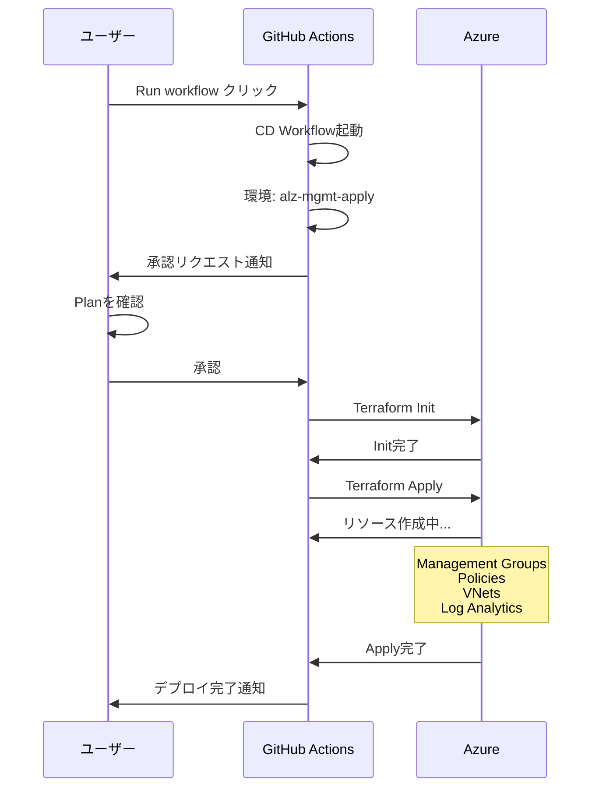
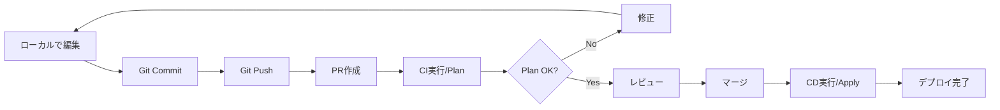

# 15. Bootstrap Phase 2 - Landing Zonesのデプロイと検証

## やってみよう

14章で準備は整ったので、この章でAzureにランディングゾーンを実際にデプロイしていきましょう！

---

## Part 1: Landing Zonesのデプロイ

### Phase 3 - Runの実行

いよいよLanding Zonesをデプロイします。

=== "GitHub Actionsでのデプロイ"

    **手順**:
    
    1. GitHubリポジトリにアクセス
    2. Actionsタブをクリック
    3. 「02 Azure Landing Zone Continuous Delivery」を選択
    4. 「Run workflow」をクリック
    5. ブランチを選択（通常はmain）
    6. 「Run workflow」を実行

=== "手動実行（ローカル）"

    ```bash title="ローカルでのデプロイ"
    # リポジトリをクローン
    git clone https://github.com/<org>/alz-mgmt.git
    cd alz-mgmt
    
    # Azure にログイン
    az login
    az account set --subscription <management-subscription-id>
    
    # Terraform初期化
    terraform init \
      -backend-config="resource_group_name=alz-bootstrap-rg" \
      -backend-config="storage_account_name=stoalzmgmt001" \
      -backend-config="container_name=tfstate"
    
    # Plan実行
    terraform plan -out=tfplan
    
    # Apply実行
    terraform apply tfplan
    ```

### GitHub Actionsでのデプロイ

GitHub Actionsを使った自動デプロイの流れです。



**実際の画面**:

```text title="GitHub Actions実行画面"
02 Azure Landing Zone Continuous Delivery

Run #1 - Deploy Landing Zones

Jobs:
  ✓ terraform_apply
    ⏸ Waiting for approval
    
    Review pending deployments
    
    Environment: alz-mgmt-apply
    Reviewers: user1, user2
    
    [Review deployments]
```

「Review deployments」をクリックして承認します。

### Plan確認とApproval

承認前に必ずPlanを確認します。

=== "Plan確認"

    ```text title="Terraform Plan出力"
    Terraform will perform the following actions:
    
    # Management Groups
    + azurerm_management_group.platform
    + azurerm_management_group.landing_zones
    + azurerm_management_group.connectivity
    + azurerm_management_group.identity
    + azurerm_management_group.management
    
    # Policies
    + azurerm_policy_definition.deny_public_ip (x50)
    + azurerm_policy_assignment.root_policies (x30)
    
    # Networking
    + azurerm_virtual_network.hub
    + azurerm_subnet.firewall
    + azurerm_firewall.hub
    
    # Management Resources
    + azurerm_log_analytics_workspace.management
    + azurerm_automation_account.management
    
    Plan: 234 to add, 0 to change, 0 to destroy.
    ```

=== "確認ポイント"

    !!! warning "必ず確認"
        - ✅ 作成されるリソース数は想定通りか
        - ✅ Management Group構造は正しいか
        - ✅ Subscription配置は正しいか
        - ✅ リージョンは正しいか（japaneast等）
        - ✅ 削除されるリソースがないか（初回は0のはず）

=== "承認"

    問題なければ承認します：
    
    ```text
    [✓] Approve and deploy
    [ ] Reject
    
    Comment (optional):
    初回デプロイ - Planを確認しました。問題なし。
    
    [Submit review]
    ```

### Applyの実行

承認後、Terraformが自動実行されます。

```text title="Apply実行ログ"
azurerm_management_group.platform: Creating...
azurerm_management_group.landing_zones: Creating...
azurerm_management_group.connectivity: Creating...
azurerm_management_group.identity: Creating...
azurerm_management_group.management: Creating...

azurerm_management_group.platform: Creation complete after 15s
azurerm_management_group.landing_zones: Creation complete after 16s

azurerm_policy_definition.deny_public_ip[0]: Creating...
azurerm_policy_definition.deny_public_ip[1]: Creating...
...

azurerm_virtual_network.hub: Creating...
azurerm_virtual_network.hub: Still creating... [10s elapsed]
azurerm_virtual_network.hub: Creation complete after 23s

azurerm_subnet.firewall: Creating...
azurerm_firewall.hub: Creating...
azurerm_firewall.hub: Still creating... [10s elapsed]
azurerm_firewall.hub: Still creating... [1m30s elapsed]
azurerm_firewall.hub: Creation complete after 5m12s

Apply complete! Resources: 234 added, 0 changed, 0 destroyed.
```

!!! info "デプロイ時間"
    - 小規模（basic）: 10〜15分
    - 標準（hubnetworking）: 30〜45分
    - 大規模（complete）: 60〜90分
    
    Firewallの作成に時間がかかります（5〜10分）。

### デプロイ状況のモニタリング

デプロイ中の状況をモニタリングします。

=== "GitHub Actions"

    **リアルタイム確認**:
    
    1. GitHub → Actions
    2. 実行中のWorkflowをクリック
    3. terraform_apply ジョブをクリック
    4. ログをリアルタイム表示

=== "Azure Portal"

    **リソース確認**:
    
    ```bash title="Management Groupの確認"
    az account management-group list --output table
    ```
    
    ```bash title="Resource Groupの確認"
    az group list --output table
    ```
    
    ```bash title="VNetの確認"
    az network vnet list --output table
    ```

=== "エラー発生時"

    エラーが出た場合：
    
    1. ログを確認
    2. エラーメッセージをコピー
    3. Part 4のトラブルシューティングを参照
    4. 修正後、再実行

!!! success "デプロイ完了"
    ```text
    Apply complete! Resources: 234 added, 0 changed, 0 destroyed.
    
    Outputs:
    
    management_group_root_id = "alz"
    hub_vnet_id = "/subscriptions/.../virtualNetworks/alz-hub-vnet"
    log_analytics_workspace_id = "/subscriptions/.../workspaces/alz-log"
    ```

---

## Part 2: デプロイ後の検証

### Management Group構造の確認

作成されたManagement Group階層を確認します。

=== "Azure CLI"

    ```bash title="Management Group階層の表示"
    az account management-group show \
      --name alz \
      --expand \
      --recurse
    ```
    
    ```json title="出力例"
    {
      "id": "/providers/Microsoft.Management/managementGroups/alz",
      "name": "alz",
      "displayName": "Azure Landing Zones",
      "children": [
        {
          "displayName": "Platform",
          "id": "/providers/Microsoft.Management/managementGroups/alz-platform",
          "children": [
            {
              "displayName": "Management",
              "id": "/providers/Microsoft.Management/managementGroups/alz-management"
            },
            {
              "displayName": "Connectivity",
              "id": "/providers/Microsoft.Management/managementGroups/alz-connectivity"
            },
            {
              "displayName": "Identity",
              "id": "/providers/Microsoft.Management/managementGroups/alz-identity"
            }
          ]
        },
        {
          "displayName": "Landing Zones",
          "id": "/providers/Microsoft.Management/managementGroups/alz-landingzones"
        }
      ]
    }
    ```

=== "Azure Portal"

    1. Azureポータルにログイン
    2. 「Management Groups」を検索
    3. 階層を確認
    
    ```text title="期待される構造"
    Tenant Root Group
      └── alz (Azure Landing Zones)
          ├── Platform
          │   ├── Management
          │   ├── Connectivity
          │   └── Identity
          ├── Landing Zones
          │   ├── Corp
          │   └── Online
          ├── Sandbox
          └── Decommissioned
    ```

=== "確認ポイント"

    !!! success "正しく作成されているか確認"
        - ✅ Root Management Group（alz）が存在
        - ✅ Platform配下に3つのMG（Management、Connectivity、Identity）
        - ✅ Landing Zones配下に2つのMG（Corp、Online）
        - ✅ SandboxとDecommissionedが存在

### Policy割り当ての確認

ポリシーが正しく割り当てられているか確認します。

=== "割り当て済みポリシー確認"

    ```bash title="Root MGのポリシー確認"
    az policy assignment list \
      --scope "/providers/Microsoft.Management/managementGroups/alz" \
      --output table
    ```
    
    ```text title="出力例"
    Name                                DisplayName
    ----------------------------------  -----------------------------------------
    Deny-PublicIP                       Deny creation of public IP addresses
    Deny-RDP-From-Internet              Deny RDP from internet
    Deploy-Diagnostics                  Deploy diagnostic settings
    Deploy-AzureMonitor-VM              Deploy Azure Monitor for VMs
    ...（合計30〜50個）
    ```

=== "特定ポリシーの詳細確認"

    ```bash title="ポリシーの詳細"
    az policy assignment show \
      --name "Deny-PublicIP" \
      --scope "/providers/Microsoft.Management/managementGroups/alz"
    ```

=== "ポリシー準拠状況の確認"

    ```bash title="準拠状況"
    az policy state summarize \
      --management-group alz
    ```
    
    ```json title="出力例"
    {
      "policyAssignments": [
        {
          "policyAssignmentId": ".../Deny-PublicIP",
          "results": {
            "nonCompliantResources": 0,
            "nonCompliantPolicies": 0
          }
        }
      ]
    }
    ```

!!! tip "ポリシー適用タイミング"
    ポリシーは即座に適用されますが、既存リソースの評価には最大30分かかる場合があります。

### Management Resourcesの確認

管理リソースが作成されているか確認します。

=== "Log Analytics Workspace"

    ```bash title="Log Analytics確認"
    az monitor log-analytics workspace list \
      --resource-group alz-management-rg \
      --output table
    ```
    
    ```text title="出力例"
    Name          Location    ResourceGroup
    ------------  ----------  -----------------
    alz-log-jpe   japaneast   alz-management-rg
    ```
    
    **動作確認**:
    
    ```bash title="Workspaceにクエリ実行"
    az monitor log-analytics query \
      --workspace <workspace-id> \
      --analytics-query "Heartbeat | take 10"
    ```

=== "Automation Account"

    ```bash title="Automation Account確認"
    az automation account list \
      --resource-group alz-management-rg \
      --output table
    ```
    
    ```text title="出力例"
    Name               Location    ResourceGroup
    -----------------  ----------  -----------------
    alz-automation-jpe japaneast   alz-management-rg
    ```

=== "診断設定"

    ```bash title="診断設定の確認"
    az monitor diagnostic-settings list \
      --resource <resource-id>
    ```
    
    Log Analyticsに診断ログが送信されているか確認します。

### Networking（Hub/Spoke or VWAN）の確認

ネットワークリソースを確認します。

=== "Hub VNet（Hub-and-Spoke）"

    ```bash title="VNet確認"
    az network vnet list \
      --resource-group alz-connectivity-rg \
      --output table
    ```
    
    ```text title="出力例"
    Name          Location    ResourceGroup
    ------------  ----------  ---------------------
    alz-hub-jpe   japaneast   alz-connectivity-rg
    ```
    
    **Subnet確認**:
    
    ```bash title="Subnet一覧"
    az network vnet subnet list \
      --resource-group alz-connectivity-rg \
      --vnet-name alz-hub-jpe \
      --output table
    ```
    
    ```text title="出力例"
    Name                    AddressPrefix
    ----------------------  ---------------
    AzureFirewallSubnet     10.0.0.0/26
    GatewaySubnet           10.0.0.64/27
    ```

=== "Azure Firewall"

    ```bash title="Firewall確認"
    az network firewall list \
      --resource-group alz-connectivity-rg \
      --output table
    ```
    
    ```text title="出力例"
    Name           Location    ResourceGroup
    -------------  ----------  ---------------------
    alz-fw-jpe     japaneast   alz-connectivity-rg
    ```
    
    **Firewallルール確認**:
    
    ```bash title="ネットワークルール"
    az network firewall network-rule collection list \
      --firewall-name alz-fw-jpe \
      --resource-group alz-connectivity-rg
    ```

=== "Virtual WAN（VWANの場合）"

    ```bash title="Virtual WAN確認"
    az network vwan list --output table
    ```
    
    ```bash title="Virtual Hub確認"
    az network vhub list --output table
    ```

### ログの確認

各リソースのログが正しく収集されているか確認します。

=== "Activity Log"

    ```bash title="Activity Logの確認"
    az monitor activity-log list \
      --max-events 10 \
      --output table
    ```
    
    デプロイ時の操作ログが記録されています。

=== "Diagnostic Settings"

    ```bash title="診断設定の確認"
    # VNetの診断設定
    az monitor diagnostic-settings show \
      --resource <vnet-id> \
      --name "diag-log"
    
    # Firewallの診断設定
    az monitor diagnostic-settings show \
      --resource <firewall-id> \
      --name "diag-log"
    ```

=== "Log Analyticsクエリ"

    ```bash title="ログクエリ実行"
    az monitor log-analytics query \
      --workspace <workspace-id> \
      --analytics-query "
        AzureActivity
        | where TimeGenerated > ago(1h)
        | where OperationNameValue contains 'Microsoft.Network'
        | summarize count() by OperationNameValue
      "
    ```
    
    ネットワークリソースの操作ログを集計します。

!!! success "検証完了チェックリスト"
    - ✅ Management Group階層が正しい
    - ✅ Policyが割り当て済み
    - ✅ Log Analytics Workspaceが稼働
    - ✅ Hub VNetが作成済み
    - ✅ Azure Firewallが稼働
    - ✅ ログが収集されている

---

## Part 3: カスタマイズの実践

### tfvarsのカスタマイズ

設定をカスタマイズします。

=== "リポジトリをクローン"

    ```bash title="ローカルにクローン"
    git clone https://github.com/<org>/alz-mgmt.git
    cd alz-mgmt
    
    # feature ブランチ作成
    git checkout -b feature/customize-settings
    ```

=== "terraform.tfvarsの編集"

    ```hcl title="terraform.tfvars"
    # リージョン変更
    default_location = "japanwest"  # japaneast → japanwest
    
    # Management Group名のカスタマイズ
    root_id = "contoso"
    root_name = "Contoso Landing Zones"
    
    # Hub VNetのアドレス空間変更
    connectivity_resources_config = {
      hub_networks = {
        japanwest = {
          address_space = ["10.100.0.0/16"]  # デフォルトから変更
          subnets = {
            AzureFirewallSubnet = {
              address_prefix = "10.100.0.0/26"
            }
            GatewaySubnet = {
              address_prefix = "10.100.0.64/27"
            }
          }
        }
      }
    }
    ```

=== "変更をコミット"

    ```bash title="Git操作"
    git add terraform.tfvars
    git commit -m "feat: カスタマイズ - リージョンをjapanwestに変更"
    git push origin feature/customize-settings
    ```

### libフォルダのカスタマイズ

独自のポリシーやManagement Group構造を定義します。

=== "archetype定義のカスタマイズ"

    ```yaml title="lib/archetype_definitions/corp_custom.alz_archetype_override.yaml"
    name: corp_custom
    base_archetype: corp
    
    policy_assignments_to_add:
      - Deny-Storage-http  # HTTPを禁止
      - Require-Tag-Environment  # 環境タグ必須
    
    policy_assignments_to_remove:
      - Deploy-VM-Backup  # バックアップポリシーを削除
    ```

=== "architecture定義のカスタマイズ"

    ```yaml title="lib/architecture_definitions/alz_custom.alz_architecture_definition.yaml"
    name: alz_custom
    base_archetype: alz
    
    management_groups:
      alz:
        display_name: Contoso Landing Zones
        children:
          alz-platform:
            display_name: Platform
          alz-landingzones:
            display_name: Landing Zones
            children:
              alz-corp:
                display_name: Corp
              alz-online:
                display_name: Online
              alz-sap:  # 新規追加
                display_name: SAP
                archetype_name: corp_custom
    ```

=== "変更を適用"

    ```bash title="変更をPR"
    git add lib/
    git commit -m "feat: SAP用Management Groupを追加"
    git push origin feature/customize-settings
    
    # GitHub でPR作成
    # → CIが自動実行（Plan）
    # → レビュー後マージ
    # → CDが自動実行（Apply）
    ```

### 独自ポリシーの追加

カスタムポリシーを追加します。

=== "ポリシー定義ファイル作成"

    ```json title="lib/policy_definitions/Require-Tag-Environment.json"
    {
      "name": "Require-Tag-Environment",
      "type": "Microsoft.Authorization/policyDefinitions",
      "properties": {
        "displayName": "Require Environment tag",
        "policyType": "Custom",
        "mode": "Indexed",
        "description": "Requires Environment tag on all resources",
        "metadata": {
          "category": "Tags"
        },
        "policyRule": {
          "if": {
            "field": "tags['Environment']",
            "exists": "false"
          },
          "then": {
            "effect": "deny"
          }
        }
      }
    }
    ```

=== "ポリシー割り当て追加"

    ```yaml title="lib/archetype_definitions/landingzones_custom.yaml"
    name: landingzones_custom
    base_archetype: default
    
    policy_assignments_to_add:
      - Require-Tag-Environment
    
    policy_assignment_properties:
      Require-Tag-Environment:
        enforcement_mode: Default
        parameters: {}
    ```

=== "デプロイ"

    ```bash
    git add lib/policy_definitions/ lib/archetype_definitions/
    git commit -m "feat: 環境タグ必須ポリシーを追加"
    git push origin feature/add-tag-policy
    
    # PR作成 → マージ → 自動デプロイ
    ```

### ネットワーク設定の調整

ネットワーク設定を変更します。

=== "Spoke VNet追加"

    ```hcl title="terraform.tfvars"
    connectivity_resources_config = {
      hub_networks = {
        japaneast = {
          # ... Hub設定 ...
        }
      }
      spoke_networks = {
        app-spoke = {
          address_space = ["10.1.0.0/16"]
          location = "japaneast"
          hub_network_key = "japaneast"
          subnets = {
            app-subnet = {
              address_prefix = "10.1.0.0/24"
            }
          }
        }
      }
    }
    ```

=== "Firewallルール追加"

    ```hcl title="terraform.tfvars"
    connectivity_resources_config = {
      hub_networks = {
        japaneast = {
          # ... 既存設定 ...
          
          firewall = {
            network_rules = [
              {
                name = "Allow-Outbound-HTTP"
                priority = 100
                action = "Allow"
                rules = [
                  {
                    name = "HTTP"
                    protocols = ["TCP"]
                    source_addresses = ["10.1.0.0/16"]
                    destination_addresses = ["*"]
                    destination_ports = ["80", "443"]
                  }
                ]
              }
            ]
          }
        }
      }
    }
    ```

=== "VPN Gateway追加"

    ```hcl title="terraform.tfvars"
    connectivity_resources_config = {
      hub_networks = {
        japaneast = {
          # ... 既存設定 ...
          
          vpn_gateway = {
            enabled = true
            sku = "VpnGw1"
            connections = [
              {
                name = "OnPrem-Connection"
                type = "IPsec"
                shared_key = var.vpn_shared_key
                remote_gateway_ip = "203.0.113.1"
              }
            ]
          }
        }
      }
    }
    ```

### 変更の適用方法

カスタマイズした設定をデプロイします。



**手順**:

1. **ローカルで編集**: tfvars、libファイルを変更
2. **Commit & Push**: feature ブランチにpush
3. **PR作成**: feature → main のPR
4. **CI実行**: 自動でPlan実行
5. **Plan確認**: 変更内容を確認
6. **マージ**: mainブランチにマージ
7. **CD実行**: 自動でApply実行
8. **承認**: Apply承認者が承認
9. **デプロイ**: 変更が適用される

!!! tip "安全なカスタマイズ"
    - 必ずfeatureブランチで作業
    - PRでPlanを確認
    - 小さい変更から始める
    - レビューを必ず受ける

---

## Part 4: トラブルシューティング

### よくあるデプロイエラー

デプロイ時によくあるエラーと対処法です。

=== "エラー1: OIDC認証失敗"

    **エラーメッセージ**:
    
    ```
    Error: Unable to get ACTIONS_ID_TOKEN_REQUEST_URL env variable
    ```
    
    **原因**: permissions設定がない
    
    **対処法**:
    
    ```yaml title=".github/workflows/cd.yaml"
    jobs:
      apply:
        permissions:
          id-token: write  # これを追加
          contents: read
    ```

=== "エラー2: Subscription権限不足"

    **エラーメッセージ**:
    
    ```
    Error: insufficient privileges to complete the operation
    ```
    
    **原因**: Managed IdentityにOwner権限がない
    
    **対処法**:
    
    ```bash title="権限付与"
    az role assignment create \
      --assignee <identity-client-id> \
      --role "Owner" \
      --scope "/subscriptions/<subscription-id>"
    ```

=== "エラー3: State Lock"

    **エラーメッセージ**:
    
    ```
    Error: Error acquiring the state lock
    Lock Info:
      ID: xxxxx-xxxxx-xxxxx
    ```
    
    **原因**: 前回のデプロイが異常終了
    
    **対処法**:
    
    ```bash title="Lock解除"
    az storage blob lease break \
      --account-name stoalzmgmt001 \
      --container-name tfstate \
      --blob-name terraform.tfstate
    ```

### OIDC認証エラーの対処

OIDC関連のエラー対処です。

=== "Federated Credential不一致"

    **エラーメッセージ**:
    
    ```
    Error: AADSTS70021: No matching federated identity record found
    ```
    
    **原因**: subjectが一致しない
    
    **確認**:
    
    ```bash title="Federated Credential確認"
    az identity federated-credential show \
      --identity-name alz-apply-identity \
      --resource-group alz-identity-rg \
      --name github-actions-apply
    ```
    
    **対処法**:
    
    subjectを修正：
    
    ```bash title="Federated Credential更新"
    az identity federated-credential update \
      --identity-name alz-apply-identity \
      --resource-group alz-identity-rg \
      --name github-actions-apply \
      --subject "repo:org/repo:environment:alz-mgmt-apply"
    ```

=== "Environment名の不一致"

    **エラーメッセージ**:
    
    ```
    Error: The workflow job is not running in the expected environment
    ```
    
    **原因**: ワークフローのenvironment名とFederated Credentialのsubjectが不一致
    
    **対処法**:
    
    ```yaml title=".github/workflows/cd.yaml"
    jobs:
      apply:
        environment: alz-mgmt-apply  # Federated Credentialと一致させる
    ```

### Terraform Stateのトラブル

State関連のトラブル対処です。

=== "State破損"

    **症状**: Stateファイルが壊れている
    
    **対処法**:
    
    ```bash title="バックアップからリストア"
    # バックアップを確認
    az storage blob list \
      --account-name stoalzmgmt001 \
      --container-name tfstate
    
    # バックアップをダウンロード
    az storage blob download \
      --account-name stoalzmgmt001 \
      --container-name tfstate \
      --name terraform.tfstate.backup \
      --file terraform.tfstate
    
    # 現在のStateを置き換え
    terraform state push terraform.tfstate
    ```

=== "State不整合"

    **症状**: Stateと実際のリソースが一致しない
    
    **対処法**:
    
    ```bash title="State更新"
    # 現在のStateを確認
    terraform state list
    
    # 特定リソースをimport
    terraform import \
      azurerm_resource_group.example \
      /subscriptions/.../resourceGroups/my-rg
    
    # Stateをリフレッシュ
    terraform refresh
    ```

### リソース作成エラーの解決

リソース作成時のエラー対処です。

=== "リソース名重複"

    **エラーメッセージ**:
    
    ```
    Error: A resource with the ID already exists
    ```
    
    **対処法**:
    
    ```hcl title="terraform.tfvars"
    # 名前を変更
    resource_prefix = "alz2"  # "alz" → "alz2"
    ```

=== "リージョン制約"

    **エラーメッセージ**:
    
    ```
    Error: The location 'japaneast' is not available for resource type
    ```
    
    **対処法**:
    
    ```bash title="利用可能リージョン確認"
    az provider show \
      --namespace Microsoft.Network \
      --query "resourceTypes[?resourceType=='virtualNetworks'].locations"
    ```
    
    利用可能なリージョンに変更します。

=== "クォータ超過"

    **エラーメッセージ**:
    
    ```
    Error: Quota exceeded for resource
    ```
    
    **対処法**:
    
    ```bash title="クォータ確認"
    az vm list-usage --location japaneast --output table
    ```
    
    Azureサポートにクォータ引き上げを依頼します。

### ロールバック方法

デプロイ失敗時のロールバック手順です。

=== "方法1: Git Revert"

    ```bash title="最新コミットを取り消す"
    git revert HEAD
    git push origin main
    
    # CDワークフローが自動実行され、前の状態に戻る
    ```

=== "方法2: 手動Apply"

    ```bash title="前のバージョンをチェックアウト"
    git checkout <前のコミットHash>
    
    # ローカルでApply
    terraform init
    terraform apply
    
    # 成功したら、mainに戻す
    git checkout main
    git revert HEAD
    git push origin main
    ```

=== "方法3: 特定リソース削除"

    ```bash title="問題のあるリソースのみ削除"
    # Stateから削除（実リソースは削除しない）
    terraform state rm azurerm_resource_group.problem
    
    # 実リソースを手動削除
    az group delete --name problem-rg --yes
    
    # 再デプロイ
    terraform apply
    ```

!!! danger "ロールバック時の注意"
    - データの損失に注意
    - Stateバックアップを必ず取る
    - 本番環境では慎重に

---

## まとめ

この章で学んだこと：

### ✅ Part 1: Landing Zonesのデプロイ

- Phase 3 - Runの実行
- GitHub Actionsでのデプロイ
- Plan確認とApproval
- Applyの実行
- デプロイ状況のモニタリング

### ✅ Part 2: デプロイ後の検証

- Management Group構造の確認
- Policy割り当ての確認
- Management Resourcesの確認
- Networking（Hub/Spoke or VWAN）の確認
- ログの確認

### ✅ Part 3: カスタマイズの実践

- tfvarsのカスタマイズ
- libフォルダのカスタマイズ
- 独自ポリシーの追加
- ネットワーク設定の調整
- 変更の適用方法

### ✅ Part 4: トラブルシューティング

- よくあるデプロイエラー
- OIDC認証エラーの対処
- Terraform Stateのトラブル
- リソース作成エラーの解決
- ロールバック方法

次の章では、Landing Zonesの運用管理の基礎を学びます。

## 練習問題

理解度チェックです。休憩中に考えてみましょう。

### 問題1
Landing Zonesのデプロイに失敗した場合、  
最初に確認すべきログはどこにありますか？

### 問題2
デプロイ後に確認すべきリソースを3つ挙げてください。

### 問題3
`terraform state list`コマンドは何を確認するために使いますか？

---

## 練習問題の答え

### 答え1
**GitHub Actionsのワークフロー実行ログ**です。

GitHub → Actions → 該当のワークフロー実行:
```
Set up job
Run actions/checkout@v4
Run hashicorp/setup-terraform@v3
Terraform Init
Terraform Plan
Terraform Apply  # ← ここでエラー
```

エラーメッセージから原因を特定：
- **OIDC認証エラー**: Federated Credentialの設定ミス
- **権限エラー**: Managed Identityのロール不足
- **Terraformエラー**: 設定ファイルの間違い

### 答え2
1. **管理グループ**：階層構造が正しく作成されているか
2. **ポリシー割り当て**：適切な管理グループに割り当てられているか
3. **リソースグループ**：management、connectivityなどが作成されているか

Azure Portal または Azure CLI で確認:
```bash
# 管理グループ確認
az account management-group list

# リソースグループ確認
az group list --query "[].{name:name, location:location}"

# ポリシー割り当て確認
az policy assignment list --scope /providers/Microsoft.Management/managementGroups/contoso
```

### 答え3
**Terraformで管理しているリソースの一覧を確認**するために使います。

```bash
terraform state list
```

出力例:
```
azurerm_resource_group.management
azurerm_resource_group.connectivity
azurerm_log_analytics_workspace.management
azurerm_virtual_network.hub
azurerm_firewall.connectivity
...
```

これにより：
- どのリソースがTerraformで管理されているか確認
- デプロイ漏れがないかチェック
- Stateファイルの整合性確認

ができます。

!!! tip "次の章へ"
    [Chapter 16: 運用管理の基礎](16_運用管理の基礎.md)で、日常運用タスクとリソース管理を学びます。
