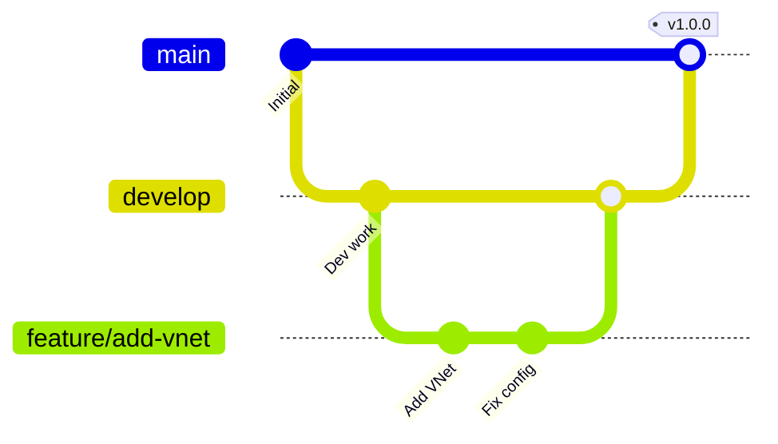

# 15. CI/CDパイプライン構築 - 実践的な自動化 🚀

!!! info "この章で学ぶこと 📚"
    再利用可能ワークフローを使った実践的なCI/CDパイプラインを構築します：

    1. 再利用可能ワークフローの理解
    2. 環境設定とデプロイ戦略
    3. Plan/Apply自動化
    4. 本番運用のワークフロー設計

    この章を読めば、本格的なCI/CDパイプラインが作れます。

---

## CI/CDパイプラインの全体像 🗺️

GitHub ActionsによるTerraform CI/CDパイプラインの流れを視覚化してみましょう。

```mermaid
graph TB
    A[開発者: コード変更] --> B[feature ブランチにプッシュ]
    B --> C[Pull Request作成]
    
    C --> D[GitHub Actions: Plan ワークフロー]
    D --> D1[Checkout コード]
    D1 --> D2[Terraform Init]
    D2 --> D3[Terraform Plan]
    D3 --> D4[Plan結果をPRにコメント]
    
    D4 --> E{レビュー承認?}
    E -->|承認| F[main ブランチにマージ]
    E -->|却下| G[修正して再プッシュ]
    G --> D
    
    F --> H[GitHub Actions: Apply ワークフロー]
    H --> H1[Checkout コード]
    H1 --> H2[Terraform Init]
    H2 --> H3[Terraform Plan 再確認]
    
    H3 --> I{Environment Protection<br/>承認待ち?}
    I -->|本番環境| J[承認者が手動承認]
    I -->|開発環境| K[承認スキップ]
    
    J --> L[Terraform Apply]
    K --> L
    
    L --> M[Azure: リソース作成/更新]
    M --> N[Slack/Teams: 通知]
    
    style A fill:#e1f5ff
    style D fill:#fff4e1
    style H fill:#ffe1e1
    style M fill:#e1ffe1
    style I fill:#ffebe1
```



**パイプラインの特徴**：

1. **PR時**: 自動でPlanを実行、変更内容を確認
2. **レビュー**: コードレビューと承認プロセス
3. **マージ時**: mainブランチへマージ後、自動Apply
4. **承認制御**: 本番環境では手動承認が必要
5. **通知**: デプロイ結果をSlack/Teamsに通知

---

## Part 1: 再利用可能ワークフローの理解 🔄

### 再利用可能ワークフローとは ♻️

同じロジックを複数のワークフローで使い回す仕組みです。

=== "通常のワークフロー（重複コード）"

    ```yaml title="ci.yaml"
    jobs:
      plan:
        steps:
          - uses: actions/checkout@v4
          - uses: hashicorp/setup-terraform@v3
          - uses: azure/login@v2
          - run: terraform init
          - run: terraform plan
    ```
    
    ```yaml title="cd.yaml"
    jobs:
      apply:
        steps:
          - uses: actions/checkout@v4
          - uses: hashicorp/setup-terraform@v3
          - uses: azure/login@v2
          - run: terraform init
          - run: terraform apply
    ```
    
    同じコードが2箇所に！

=== "再利用可能ワークフロー"

    ```yaml title="terraform-template.yaml（テンプレート）"
    on:
      workflow_call:
        inputs:
          command:
            required: true
            type: string
    
    jobs:
      terraform:
        steps:
          - uses: actions/checkout@v4
          - uses: hashicorp/setup-terraform@v3
          - uses: azure/login@v2
          - run: terraform init
          - run: terraform ${{ inputs.command }}
    ```
    
    ```yaml title="ci.yaml（呼び出し側）"
    jobs:
      plan:
        uses: org/repo/.github/workflows/terraform-template.yaml@main
        with:
          command: plan
    ```
    
    ```yaml title="cd.yaml（呼び出し側）"
    jobs:
      apply:
        uses: org/repo/.github/workflows/terraform-template.yaml@main
        with:
          command: apply
    ```

!!! success "再利用可能ワークフローのメリット ✨"
    - コードの重複がなくなる
    - メンテナンスが楽
    - 一箇所直せば全体に反映
    - ベストプラクティスを標準化

---


### inputs/secrets の定義 🗝️

テンプレートに渡すパラメータを定義します。

=== "inputs（入力値）"

    ```yaml title="テンプレート側で定義"
    on:
      workflow_call:
        inputs:
          terraform_version:
            description: 'Terraform version to use'
            required: false
            type: string
            default: '1.9.0'
          
          working_directory:
            description: 'Working directory'
            required: false
            type: string
            default: '.'
          
          environment_name:
            description: 'Environment name'
            required: true
            type: string
    ```
    
    ```yaml title="呼び出し側で指定"
    jobs:
      plan:
        uses: org/templates/.github/workflows/ci-template.yaml@main
        with:
          terraform_version: '1.9.0'
          working_directory: '.'
          environment_name: 'alz-mgmt-plan'
    ```

=== "secrets（機密情報）"

    ```yaml title="テンプレート側で定義"
    on:
      workflow_call:
        secrets:
          AZURE_CLIENT_ID:
            required: true
          AZURE_TENANT_ID:
            required: true
          AZURE_SUBSCRIPTION_ID:
            required: true
    ```
    
    ```yaml title="呼び出し側で指定"
    jobs:
      plan:
        uses: org/templates/.github/workflows/ci-template.yaml@main
        secrets:
          AZURE_CLIENT_ID: ${{ secrets.AZURE_CLIENT_ID }}
          AZURE_TENANT_ID: ${{ secrets.AZURE_TENANT_ID }}
          AZURE_SUBSCRIPTION_ID: ${{ secrets.AZURE_SUBSCRIPTION_ID }}
    ```

!!! warning "inherit は使えない ⚠️"
    ```yaml
    # ❌ NG: secretsをinheritで渡せない（OIDC環境）
    jobs:
      plan:
        uses: org/templates/.github/workflows/ci-template.yaml@main
        secrets: inherit  # これはOIDCではNG
    ```
    
    OIDCの場合、明示的にsecretsを渡す必要があります。

---

### outputs の活用 📤

テンプレートから値を返すことができます。

```yaml title="ci-template.yaml（テンプレート側）"
on:
  workflow_call:
    outputs:
      plan_exitcode:
        description: 'Terraform plan exit code'
        value: ${{ jobs.plan.outputs.exitcode }}

jobs:
  plan:
    outputs:
      exitcode: ${{ steps.plan.outputs.exitcode }}
    steps:
      - id: plan
        run: |
          terraform plan -detailed-exitcode
          echo "exitcode=$?" >> $GITHUB_OUTPUT
```

```yaml title="ci.yaml（呼び出し側）"
jobs:
  terraform_plan:
    uses: org/templates/.github/workflows/ci-template.yaml@main
  
  notify:
    needs: terraform_plan
    if: needs.terraform_plan.outputs.plan_exitcode == '2'
    steps:
      - run: echo "Changes detected!"
```

**terraform plan の exit code**:

- `0`: 変更なし
- `1`: エラー
- `2`: 変更あり

---

### 実際にコードを見てみよう 👀

#### テンプレートリポジトリの設計 🏗️

再利用可能ワークフローは、専用のテンプレートリポジトリに配置されています。
実際に見てみましょう。

- テンプレート：実践編で作成した「alz-mgmt-template」リポジトリ
- 呼び出し側：実践編で作成した「alz-mgmt」リポジトリ

```text title="リポジトリ構成"
alz-mgmt-templates/
├── .github/
│   └── workflows/
│       ├── ci-template.yaml    ← Plan用テンプレート
│       └── cd-template.yaml    ← Apply用テンプレート
└── README.md

alz-mgmt/
├── .github/
│   └── workflows/
│       ├── ci.yaml             ← テンプレートを呼び出す
│       └── cd.yaml             ← テンプレートを呼び出す
├── main.tf
└── variables.tf
```

**構成の理由**:

- **alz-mgmt-templates**: ワークフローのロジックを集約
- **alz-mgmt**: 実際のTerraformコード + テンプレート呼び出し

!!! tip "なぜ分けるの？ 💡"
    - 1つのテンプレートを複数プロジェクトで使い回せる
    - ワークフロー変更時、テンプレートだけ修正すればOK
    - プロジェクトコードとワークフローロジックを分離
---

---

#### コード解説 📝

じゃあ実際のコードはどうなっているのか順番に見ていきましょう。

##### 呼び出し側: CI ワークフロー 🏃‍♂️

まずは、alz-mgmtリポジトリのCIワークフローから。

```yaml title=".github/workflows/ci.yaml"
---
name: 01 Azure Landing Zones Continuous Integration
on:
  pull_request:
    branches:
      - main
  workflow_dispatch:
    inputs:
      terraform_cli_version:
        description: 'Terraform CLI Version'
        required: true
        default: 'latest'
        type: string

jobs:
  validate_and_plan:
    uses: <あなたのリポジトリ>/alz-mgmt-templates/.github/workflows/ci-template.yaml@main
    name: 'CI'
    permissions:
      id-token: write
      contents: read
      pull-requests: write
    with:
      root_module_folder_relative_path: '.'
      terraform_cli_version: ${{ inputs.terraform_cli_version }}
```

**コードの解説**:

#### トリガー設定 ⏰

```yaml
on:
  pull_request:
    branches:
      - main
  workflow_dispatch:
    inputs:
      terraform_cli_version:
        description: 'Terraform CLI Version'
        required: true
        default: 'latest'
        type: string
```

このワークフローは2つのタイミングで動きます：

1. **pull_request**: mainブランチへのPR作成時

   - 誰かがfeatureブランチからPRを出すと自動実行
   - Terraform Planで変更内容を確認
   
2. **workflow_dispatch**: 手動実行

   - GitHub Actionsの画面から手動でトリガー可能
   - Terraformのバージョンを指定できる（デフォルトは`latest`）

!!! tip "workflow_dispatchの使いどころ 💡"
    - PRを作らずにPlanだけ確認したい時
    - 特定のTerraformバージョンでテストしたい時
    - デバッグ目的で手動実行したい時

#### ジョブ定義 🛠️

```yaml
jobs:
  validate_and_plan:
    uses: <あなたのリポジトリ>/alz-mgmt-templates/.github/workflows/ci-template.yaml@main
    name: 'CI'
    permissions:
      id-token: write
      contents: read
      pull-requests: write
    with:
      root_module_folder_relative_path: '.'
      terraform_cli_version: ${{ inputs.terraform_cli_version }}
```

ここがポイント！実際の処理は`alz-mgmt-templates`リポジトリのテンプレートを呼び出しています。

**uses**: テンプレートの場所
```yaml
uses: <あなたのリポジトリ>/alz-mgmt-templates/.github/workflows/ci-template.yaml@main
```

- `shuhei0720org01/alz-mgmt-templates`: リポジトリ名
- `.github/workflows/ci-template.yaml`: テンプレートファイルのパス
- `@main`: ブランチ指定（mainブランチの最新版を使用）

**permissions**: OIDCに必要な権限
```yaml
permissions:
  id-token: write      # OIDCトークンの発行
  contents: read       # コードの読み取り
  pull-requests: write # PRへのコメント書き込み
```

これがないとOIDCでAzureにログインできません。

**with**: テンプレートに渡すパラメータ
```yaml
with:
  root_module_folder_relative_path: '.'
  terraform_cli_version: ${{ inputs.terraform_cli_version }}
```

- `root_module_folder_relative_path`: Terraformコードの場所（ルートディレクトリ）
- `terraform_cli_version`: 使用するTerraformのバージョン

---

### 呼び出し側: CD ワークフロー

次に、CDワークフロー（デプロイ）を見てみましょう。

```yaml title=".github/workflows/cd.yaml"
---
name: 02 Azure Landing Zones Continuous Delivery
on:
  push:
    branches:
      - main
  workflow_dispatch:
    inputs:
      terraform_action:
        description: 'Terraform Action to perform'
        required: true
        default: 'apply'
        type: choice
        options:
          - 'apply'
          - 'destroy'
      terraform_cli_version:
        description: 'Terraform CLI Version'
        required: true
        default: 'latest'
        type: string

jobs:
  plan_and_apply:
    uses: <あなたのリポジトリ>/alz-mgmt-templates/.github/workflows/cd-template.yaml@main
    name: 'CD'
    permissions:
      id-token: write
      contents: read
    with:
      terraform_action: ${{ inputs.terraform_action }}
      root_module_folder_relative_path: '.'
      terraform_cli_version: ${{ inputs.terraform_cli_version }}
```

---

**コードの解説**:

#### トリガー設定

```yaml
on:
  push:
    branches:
      - main
  workflow_dispatch:
    inputs:
      terraform_action:
        description: 'Terraform Action to perform'
        required: true
        default: 'apply'
        type: choice
        options:
          - 'apply'
          - 'destroy'
      terraform_cli_version:
        description: 'Terraform CLI Version'
        required: true
        default: 'latest'
        type: string
```

CDワークフローも2つのタイミングで動きます：

1. **push**: mainブランチへのプッシュ時

   - PRがマージされたら自動実行
   - Terraform Applyでリソースをデプロイ
   
2. **workflow_dispatch**: 手動実行

   - **terraform_action**: `apply`か`destroy`を選択
   - **terraform_cli_version**: Terraformバージョンを指定

!!! warning "destroyオプションについて ⚠️"
    `destroy`を選ぶと全リソースを削除します。本番環境では非常に危険なので、手動実行時のみ使えるようにしています。

#### ジョブ定義 🛠️

```yaml
jobs:
  plan_and_apply:
    uses: <あなたのリポジトリ>/alz-mgmt-templates/.github/workflows/cd-template.yaml@main
    name: 'CD'
    permissions:
      id-token: write
      contents: read
    with:
      terraform_action: ${{ inputs.terraform_action }}
      root_module_folder_relative_path: '.'
      terraform_cli_version: ${{ inputs.terraform_cli_version }}
```

**permissions**: CDではPRへのコメントが不要
```yaml
permissions:
  id-token: write      # OIDCトークンの発行
  contents: read       # コードの読み取り
  # pull-requests: write は不要
```

**with**: テンプレートに渡すパラメータ
```yaml
with:
  terraform_action: ${{ inputs.terraform_action }}  # apply or destroy
  root_module_folder_relative_path: '.'
  terraform_cli_version: ${{ inputs.terraform_cli_version }}
```

---

### テンプレート側: CI テンプレート 🏗️

さて、ここからが本番です。実際の処理が書かれているテンプレート側のコードを見てみましょう。

```yaml title="alz-mgmt-templates/.github/workflows/ci-template.yaml"
name: CI Template

on:
  workflow_call:
    inputs:
      root_module_folder_relative_path:
        description: 'Root module folder relative path'
        required: false
        type: string
        default: '.'
      terraform_cli_version:
        description: 'Terraform CLI version'
        required: false
        type: string
        default: 'latest'

jobs:
  validate_and_plan:
    name: Validate and Plan
    runs-on: ubuntu-latest
    environment: alz-mgmt-plan
    
    permissions:
      id-token: write
      contents: read
      pull-requests: write
    
    env:
      TERRAFORM_CLI_VERSION: ${{ inputs.terraform_cli_version }}
      ROOT_MODULE_PATH: ${{ inputs.root_module_folder_relative_path }}
    
    steps:
      - name: Checkout
        uses: actions/checkout@v4
      
      - name: Setup Terraform
        uses: hashicorp/setup-terraform@v3
        with:
          terraform_version: ${{ env.TERRAFORM_CLI_VERSION }}
          terraform_wrapper: true
      
      - name: Azure Login via OIDC
        uses: azure/login@v2
        with:
          client-id: ${{ vars.AZURE_CLIENT_ID }}
          tenant-id: ${{ vars.AZURE_TENANT_ID }}
          subscription-id: ${{ vars.AZURE_SUBSCRIPTION_ID }}
      
      - name: Terraform Init
        id: init
        working-directory: ${{ env.ROOT_MODULE_PATH }}
        run: |
          terraform init \
            -backend-config="resource_group_name=${{ vars.BACKEND_AZURE_RESOURCE_GROUP_NAME }}" \
            -backend-config="storage_account_name=${{ vars.BACKEND_AZURE_STORAGE_ACCOUNT_NAME }}" \
            -backend-config="container_name=${{ vars.BACKEND_AZURE_STORAGE_ACCOUNT_CONTAINER_NAME }}"
      
      - name: Terraform Format Check
        id: fmt
        working-directory: ${{ env.ROOT_MODULE_PATH }}
        run: terraform fmt -check -recursive
        continue-on-error: true
      
      - name: Terraform Validate
        id: validate
        working-directory: ${{ env.ROOT_MODULE_PATH }}
        run: terraform validate -no-color
      
      - name: Terraform Plan
        id: plan
        working-directory: ${{ env.ROOT_MODULE_PATH }}
        run: |
          terraform plan -no-color -out=tfplan
          terraform show -no-color tfplan > plan-output.txt
        continue-on-error: true
      
      - name: Comment PR with Plan
        if: github.event_name == 'pull_request'
        uses: actions/github-script@v7
        env:
          PLAN_OUTPUT: ${{ steps.plan.outputs.stdout }}
        with:
          script: |
            const fs = require('fs');
            const planOutput = fs.readFileSync('${{ env.ROOT_MODULE_PATH }}/plan-output.txt', 'utf8');
            
            const output = `## Terraform Plan 📋
            
            #### Terraform Format and Style 🖌: \`${{ steps.fmt.outcome }}\`
            #### Terraform Initialization ⚙️: \`${{ steps.init.outcome }}\`
            #### Terraform Validation 🤖: \`${{ steps.validate.outcome }}\`
            #### Terraform Plan 📖: \`${{ steps.plan.outcome }}\`
            
            <details>
            <summary>Show Plan</summary>
            
            \`\`\`terraform
            ${planOutput}
            \`\`\`
            
            </details>
            
            *Pusher: @${{ github.actor }}, Action: \`${{ github.event_name }}\`, Workflow: \`${{ github.workflow }}\`*`;
            
            github.rest.issues.createComment({
              issue_number: context.issue.number,
              owner: context.repo.owner,
              repo: context.repo.repo,
              body: output
            });
      
      - name: Fail if Plan Failed
        if: steps.plan.outcome == 'failure'
        run: exit 1
```

**コードの詳細解説**:

#### workflow_call定義 🏷️

```yaml
on:
  workflow_call:
    inputs:
      root_module_folder_relative_path:
        description: 'Root module folder relative path'
        required: false
        type: string
        default: '.'
      terraform_cli_version:
        description: 'Terraform CLI version'
        required: false
        type: string
        default: 'latest'
```

これが「再利用可能ワークフロー」の印です。`workflow_call`を使うと、他のワークフローから呼び出せます。

#### 環境とPermissions 🔐

```yaml
environment: alz-mgmt-plan

permissions:
  id-token: write
  contents: read
  pull-requests: write
```

- **environment**: GitHub Environmentsの`alz-mgmt-plan`を使用

  - ここに環境変数（AZURE_CLIENT_IDなど）が定義されている
  - 読み取り専用のManaged Identityを使用

- **permissions**: OIDC + PRコメントに必要な権限

#### Step 1: Checkout 📦

```yaml
- name: Checkout
  uses: actions/checkout@v4
```

GitHubリポジトリのコードをチェックアウト。これがないと何もできません。

#### Step 2: Setup Terraform 🛠️

```yaml
- name: Setup Terraform
  uses: hashicorp/setup-terraform@v3
  with:
    terraform_version: ${{ env.TERRAFORM_CLI_VERSION }}
    terraform_wrapper: true
```

指定されたバージョンのTerraformをインストール。`terraform_wrapper: true`でTerraformの出力をキャプチャできるようにします。

#### Step 3: Azure Login ☁️

```yaml
- name: Azure Login via OIDC
  uses: azure/login@v2
  with:
    client-id: ${{ vars.AZURE_CLIENT_ID }}
    tenant-id: ${{ vars.AZURE_TENANT_ID }}
    subscription-id: ${{ vars.AZURE_SUBSCRIPTION_ID }}
```

OIDCでAzureにログイン。`vars.*`は環境変数（alz-mgmt-plan環境で定義済み）。

#### Step 4: Terraform Init ⚙️

```yaml
- name: Terraform Init
  id: init
  working-directory: ${{ env.ROOT_MODULE_PATH }}
  run: |
    terraform init \
      -backend-config="resource_group_name=${{ vars.BACKEND_AZURE_RESOURCE_GROUP_NAME }}" \
      -backend-config="storage_account_name=${{ vars.BACKEND_AZURE_STORAGE_ACCOUNT_NAME }}" \
      -backend-config="container_name=${{ vars.BACKEND_AZURE_STORAGE_ACCOUNT_CONTAINER_NAME }}"
```

Terraformを初期化。バックエンド（Azure Storage）の情報を環境変数から取得して設定します。

#### Step 5: Terraform Format Check 🖌

```yaml
- name: Terraform Format Check
  id: fmt
  working-directory: ${{ env.ROOT_MODULE_PATH }}
  run: terraform fmt -check -recursive
  continue-on-error: true
```

コードのフォーマットチェック。`continue-on-error: true`なので、失敗してもワークフローは継続します。

#### Step 6: Terraform Validate ✅

```yaml
- name: Terraform Validate
  id: validate
  working-directory: ${{ env.ROOT_MODULE_PATH }}
  run: terraform validate -no-color
```

Terraformコードの文法チェック。

#### Step 7: Terraform Plan 📖

```yaml
- name: Terraform Plan
  id: plan
  working-directory: ${{ env.ROOT_MODULE_PATH }}
  run: |
    terraform plan -no-color -out=tfplan
    terraform show -no-color tfplan > plan-output.txt
  continue-on-error: true
```

Plan実行。結果を`plan-output.txt`に保存します。

#### Step 8: PRへのコメント 💬

```yaml
- name: Comment PR with Plan
  if: github.event_name == 'pull_request'
  uses: actions/github-script@v7
  env:
    PLAN_OUTPUT: ${{ steps.plan.outputs.stdout }}
  with:
    script: |
      const fs = require('fs');
      const planOutput = fs.readFileSync('${{ env.ROOT_MODULE_PATH }}/plan-output.txt', 'utf8');
      
      const output = `## Terraform Plan 📋
      
      #### Terraform Format and Style 🖌: \`${{ steps.fmt.outcome }}\`
      #### Terraform Initialization ⚙️: \`${{ steps.init.outcome }}\`
      #### Terraform Validation 🤖: \`${{ steps.validate.outcome }}\`
      #### Terraform Plan 📖: \`${{ steps.plan.outcome }}\`
      
      <details>
      <summary>Show Plan</summary>
      
      \`\`\`terraform
      ${planOutput}
      \`\`\`
      
      </details>
      
      *Pusher: @${{ github.actor }}, Action: \`${{ github.event_name }}\`, Workflow: \`${{ github.workflow }}\`*`;
      
      github.rest.issues.createComment({
        issue_number: context.issue.number,
        owner: context.repo.owner,
        repo: context.repo.repo,
        body: output
      });
```

これがPlanをPRにコメントする部分！`github-script`を使ってGitHub APIを呼び出しています。

#### Step 9: 失敗チェック ❌

```yaml
- name: Fail if Plan Failed
  if: steps.plan.outcome == 'failure'
  run: exit 1
```

Planが失敗していたら、ワークフロー全体を失敗させます。

---

### テンプレート側: CD テンプレート 🏗️

最後に、CDテンプレート（Apply）を見てみましょう。

```yaml title="alz-mgmt-templates/.github/workflows/cd-template.yaml"
name: CD Template

on:
  workflow_call:
    inputs:
      terraform_action:
        description: 'Terraform action (apply or destroy)'
        required: false
        type: string
        default: 'apply'
      root_module_folder_relative_path:
        description: 'Root module folder relative path'
        required: false
        type: string
        default: '.'
      terraform_cli_version:
        description: 'Terraform CLI version'
        required: false
        type: string
        default: 'latest'

jobs:
  plan_and_apply:
    name: Plan and Apply
    runs-on: ubuntu-latest
    environment: alz-mgmt-apply
    
    permissions:
      id-token: write
      contents: read
    
    env:
      TERRAFORM_CLI_VERSION: ${{ inputs.terraform_cli_version }}
      ROOT_MODULE_PATH: ${{ inputs.root_module_folder_relative_path }}
      TERRAFORM_ACTION: ${{ inputs.terraform_action }}
    
    steps:
      - name: Checkout
        uses: actions/checkout@v4
      
      - name: Setup Terraform
        uses: hashicorp/setup-terraform@v3
        with:
          terraform_version: ${{ env.TERRAFORM_CLI_VERSION }}
          terraform_wrapper: false
      
      - name: Azure Login via OIDC
        uses: azure/login@v2
        with:
          client-id: ${{ vars.AZURE_CLIENT_ID }}
          tenant-id: ${{ vars.AZURE_TENANT_ID }}
          subscription-id: ${{ vars.AZURE_SUBSCRIPTION_ID }}
      
      - name: Terraform Init
        id: init
        working-directory: ${{ env.ROOT_MODULE_PATH }}
        run: |
          terraform init \
            -backend-config="resource_group_name=${{ vars.BACKEND_AZURE_RESOURCE_GROUP_NAME }}" \
            -backend-config="storage_account_name=${{ vars.BACKEND_AZURE_STORAGE_ACCOUNT_NAME }}" \
            -backend-config="container_name=${{ vars.BACKEND_AZURE_STORAGE_ACCOUNT_CONTAINER_NAME }}"
      
      - name: Terraform Plan (Apply)
        if: env.TERRAFORM_ACTION == 'apply'
        working-directory: ${{ env.ROOT_MODULE_PATH }}
        run: terraform plan -out=tfplan
      
      - name: Terraform Apply
        if: env.TERRAFORM_ACTION == 'apply'
        working-directory: ${{ env.ROOT_MODULE_PATH }}
        run: terraform apply -auto-approve tfplan
      
      - name: Terraform Plan (Destroy)
        if: env.TERRAFORM_ACTION == 'destroy'
        working-directory: ${{ env.ROOT_MODULE_PATH }}
        run: terraform plan -destroy -out=tfplan
      
      - name: Terraform Destroy
        if: env.TERRAFORM_ACTION == 'destroy'
        working-directory: ${{ env.ROOT_MODULE_PATH }}
        run: terraform apply -auto-approve tfplan
```

**コードの詳細解説**:

#### workflow_call定義 🏷️

```yaml
on:
  workflow_call:
    inputs:
      terraform_action:
        description: 'Terraform action (apply or destroy)'
        required: false
        type: string
        default: 'apply'
```

CI テンプレートとの違いは`terraform_action`パラメータ。`apply`か`destroy`を選べます。

#### 環境とPermissions 🔐

```yaml
environment: alz-mgmt-apply

permissions:
  id-token: write
  contents: read
```

- **environment**: `alz-mgmt-apply`環境を使用

  - 書き込み可能なManaged Identity
  - 承認ルールが設定されている（Required reviewers）

- **permissions**: PRコメント不要なので`pull-requests: write`なし

#### Apply用のステップ 🚀

```yaml
- name: Terraform Plan (Apply)
  if: env.TERRAFORM_ACTION == 'apply'
  working-directory: ${{ env.ROOT_MODULE_PATH }}
  run: terraform plan -out=tfplan

- name: Terraform Apply
  if: env.TERRAFORM_ACTION == 'apply'
  working-directory: ${{ env.ROOT_MODULE_PATH }}
  run: terraform apply -auto-approve tfplan
```

`terraform_action`が`apply`の場合：

1. Plan実行（変更内容を再確認）
2. Apply実行（`-auto-approve`で確認プロンプトスキップ）

!!! tip "なぜ2回Planを実行？ 💡"
    - 1回目（CI）: PRレビュー時
    - 2回目（CD）: Apply直前の最終確認
    
    マージ後に他の変更が入っている可能性があるため、Apply前にもう一度Planします。

#### Destroy用のステップ 💣

```yaml
- name: Terraform Plan (Destroy)
  if: env.TERRAFORM_ACTION == 'destroy'
  working-directory: ${{ env.ROOT_MODULE_PATH }}
  run: terraform plan -destroy -out=tfplan

- name: Terraform Destroy
  if: env.TERRAFORM_ACTION == 'destroy'
  working-directory: ${{ env.ROOT_MODULE_PATH }}
  run: terraform apply -auto-approve tfplan
```

`terraform_action`が`destroy`の場合：

1. Destroy Plan実行（削除内容を確認）
2. Apply実行（Planに従ってリソース削除）

!!! danger "Destroy は慎重に ❗"
    手動実行（workflow_dispatch）でのみ使用できるようにしています。本番環境では絶対に使わないでください。

---

### コード全体の流れ 🔄

これで全体像がわかりましたね。最後に流れを整理しましょう。

```mermaid
graph LR
    A[開発者] -->|1. PR作成| B[ci.yaml]
    B -->|2. 呼び出し| C[ci-template.yaml]
    C -->|3. Plan実行| D[PRにコメント]
    
    E[レビュアー] -->|4. 承認| F[mainにマージ]
    F -->|5. 自動実行| G[cd.yaml]
    G -->|6. 呼び出し| H[cd-template.yaml]
    H -->|7. 承認待ち| I[承認者]
    I -->|8. 承認| J[Apply実行]
    
    style C fill:#fff4e1
    style H fill:#ffe1e1
```



**各ファイルの役割**:

| ファイル | 役割 | 配置場所 |
|---------|------|---------|
| `ci.yaml` | PR時のトリガー | alz-mgmt |
| `cd.yaml` | mainマージ時のトリガー | alz-mgmt |
| `ci-template.yaml` | Plan処理のロジック | alz-mgmt-templates |
| `cd-template.yaml` | Apply処理のロジック | alz-mgmt-templates |

**再利用可能ワークフローのメリットが実感できましたか？**

- alz-mgmtのワークフローはシンプル（20行程度）
- 複雑なロジックはテンプレート側に集約（100行以上）
- 他のプロジェクトでもテンプレートを再利用可能
- テンプレート修正で全プロジェクトに反映

これが「DRY（Don't Repeat Yourself）」原則ってやつです！

---

## Part 2: 環境設定とデプロイ戦略 🏞️

### Environments の作成 🏗️

GitHub EnvironmentsでPlan環境とApply環境を分けます。

=== "Plan環境"

    **場所**: Settings → Environments → New environment
    
    **名前**: `alz-mgmt-plan`
    
    **Protection rules**:
    
    - Required reviewers: なし（自動実行）
    - Deployment branches: `Selected branches` → `main`
    
    **Variables**:
    
    ```
    AZURE_CLIENT_ID: <plan-identity-client-id>
    AZURE_TENANT_ID: <tenant-id>
    AZURE_SUBSCRIPTION_ID: <subscription-id>
    BACKEND_AZURE_RESOURCE_GROUP_NAME: alz-state-rg
    BACKEND_AZURE_STORAGE_ACCOUNT_NAME: stoalzmgmt001
    BACKEND_AZURE_STORAGE_ACCOUNT_CONTAINER_NAME: tfstate
    ```

=== "Apply環境"

    **場所**: Settings → Environments → New environment
    
    **名前**: `alz-mgmt-apply`
    
    **Protection rules**:
    
    - Required reviewers: ✅ 承認者を指定
      - `user1@example.com`
      - `user2@example.com`
    - Wait timer: 0 minutes
    - Deployment branches: `Selected branches` → `main`
    
    **Variables**:
    
    ```
    AZURE_CLIENT_ID: <apply-identity-client-id>
    AZURE_TENANT_ID: <tenant-id>
    AZURE_SUBSCRIPTION_ID: <subscription-id>
    BACKEND_AZURE_RESOURCE_GROUP_NAME: alz-state-rg
    BACKEND_AZURE_STORAGE_ACCOUNT_NAME: stoalzmgmt001
    BACKEND_AZURE_STORAGE_ACCOUNT_CONTAINER_NAME: tfstate
    ```

!!! success "環境分離のメリット ✨"
    - Plan用とApply用でManaged Identityを分ける（最小権限）
    - Apply環境は承認必須（誤デプロイ防止）
    - 環境ごとに異なる設定が可能

---

### Protection rules の設定 🛡️

Apply環境には必ず承認ルールを設定しましょう。

```yaml title="Settings → Environments → alz-mgmt-apply → Protection rules"
✅ Required reviewers
   Number of reviewers: 1
   Reviewers:
     👤 user1@example.com
     👤 user2@example.com
   
   ※ いずれか1人の承認で実行可能

⏱ Wait timer
   Minutes to wait before allowing deployments to proceed: 0

🌿 Deployment branches
   Selected branches:
     ✓ main
```

**ワークフローでの動作**:

```yaml title="cd.yaml"
jobs:
  apply:
    environment: alz-mgmt-apply  # 承認必要
    steps:
      - name: Terraform Apply
        run: terraform apply -auto-approve
```

このジョブ実行時、指定された承認者にGitHubから通知が来て、承認するまで待機します。

---

### Plan環境とApply環境 ⚖️

2つの環境の違いを理解しましょう。

=== "Plan環境（検証用）"

    **目的**: PRレビュー時の検証
    
    **権限**: 読み取り専用（Reader）
    
    **承認**: 不要（自動実行）
    
    **トリガー**: PR作成・更新時
    
    ```yaml title="使用例"
    on:
      pull_request:
        branches: [main]
    
    jobs:
      plan:
        environment: alz-mgmt-plan
        steps:
          - run: terraform plan
    ```

=== "Apply環境（本番適用）"

    **目的**: mainマージ後のデプロイ
    
    **権限**: 書き込み可能（Contributor）
    
    **承認**: 必要（承認者の承認後実行）
    
    **トリガー**: mainへのPush
    
    ```yaml title="使用例"
    on:
      push:
        branches: [main]
    
    jobs:
      apply:
        environment: alz-mgmt-apply
        steps:
          - run: terraform apply -auto-approve
    ```

!!! warning "絶対に守るルール ⚠️"
    - Plan環境に書き込み権限を与えない
    - Apply環境には必ず承認ルールを設定
    - mainブランチ保護ルールも併用

---

### Approval設定 ✅

承認フローの詳細を見てみましょう。

```mermaid
sequenceDiagram
    participant Dev as 開発者
    participant GH as GitHub Actions
    participant Approver as 承認者
    participant Azure as Azure
    
    Dev->>GH: mainにPush
    GH->>GH: Apply Job開始
    GH->>GH: 環境: alz-mgmt-apply
    GH->>Approver: 承認リクエスト通知
    Approver->>Approver: Planを確認
    Approver->>GH: 承認 or 拒否
    alt 承認
        GH->>Azure: Terraform Apply実行
        Azure->>GH: デプロイ完了
    else 拒否
        GH->>GH: ジョブキャンセル
    end
```



**承認画面**:

GitHub Actions実行画面で、承認待ちの表示が出ます：

```text
⏸ Waiting for approval
   
   This workflow is waiting for approval from:
   - user1@example.com
   - user2@example.com
   
   [Review deployments]
```

承認者は「Review deployments」をクリックして承認・拒否を選択します。

---

### デプロイ戦略の選択 🎯

プロジェクトに応じたデプロイ戦略を選びましょう。

=== "戦略1: 完全自動化"

    **特徴**: mainマージ後、自動でデプロイ
    
    **適用**: 開発初期、検証環境
    
    ```yaml title="cd.yaml"
    on:
      push:
        branches: [main]
    
    jobs:
      apply:
        environment: alz-mgmt-apply
        # Protection rulesなし
        steps:
          - run: terraform apply -auto-approve
    ```

=== "戦略2: 承認後自動デプロイ"

    **特徴**: 承認後、自動でデプロイ
    
    **適用**: 本番環境（推奨）
    
    ```yaml title="cd.yaml"
    on:
      push:
        branches: [main]
    
    jobs:
      apply:
        environment: alz-mgmt-apply
        # Protection rules: Required reviewers
        steps:
          - run: terraform apply -auto-approve
    ```

=== "戦略3: 手動トリガー"

    **特徴**: 手動実行のみ
    
    **適用**: 重要な変更時のみデプロイ
    
    ```yaml title="cd.yaml"
    on:
      workflow_dispatch:
        inputs:
          confirm:
            description: 'Type "DEPLOY" to confirm'
            required: true
    
    jobs:
      apply:
        if: inputs.confirm == 'DEPLOY'
        environment: alz-mgmt-apply
        steps:
          - run: terraform apply -auto-approve
    ```

!!! tip "推奨: 戦略2（承認後自動デプロイ） 💡"
    - 誤デプロイを防げる
    - Planを確認してから承認
    - 承認後は自動化（手間なし）

---

## Part 3: Plan/Apply自動化 🤖

### Terraform Plan ワークフロー 📝

PR作成時に自動でPlanを実行します。

```yaml title=".github/workflows/ci.yaml"
name: Continuous Integration

on:
  pull_request:
    branches: [main]

jobs:
  terraform_plan:
    name: Terraform Plan
    uses: shuhei0720org01/alz-mgmt-templates/.github/workflows/ci-template.yaml@main
    with:
      terraform_version: '1.9.0'
      environment_name: 'alz-mgmt-plan'
```

**動作**:

1. PR作成
2. GitHub Actions起動
3. ci-template.yaml呼び出し
4. Terraform Plan実行
5. 結果をPRにコメント

---

### Terraform Apply ワークフロー 🚀

mainマージ後に自動でApplyを実行します。

```yaml title=".github/workflows/cd.yaml"
name: Continuous Delivery

on:
  push:
    branches: [main]

jobs:
  terraform_apply:
    name: Terraform Apply
    uses: shuhei0720org01/alz-mgmt-templates/.github/workflows/cd-template.yaml@main
    with:
      terraform_version: '1.9.0'
      environment_name: 'alz-mgmt-apply'
```

**動作**:

1. mainにPush
2. GitHub Actions起動
3. 承認待ち
4. 承認後、cd-template.yaml呼び出し
5. Terraform Apply実行

---

### PR時の自動Plan 💬

PRにPlan結果をコメントする実装です。

```yaml title="ci-template.yaml"
jobs:
  validate_and_plan:
    steps:
      - name: Terraform Plan
        id: plan
        run: |
          terraform plan -no-color | tee plan.txt
        continue-on-error: true
      
      - name: Comment PR
        if: github.event_name == 'pull_request'
        uses: actions/github-script@v7
        with:
          script: |
            const fs = require('fs');
            const plan = fs.readFileSync('plan.txt', 'utf8');
            
            const output = `## Terraform Plan 📋
            
            <details>
            <summary>Show Plan</summary>
            
            \`\`\`terraform
            ${plan}
            \`\`\`
            
            </details>
            
            *Pushed by: @${{ github.actor }}*`;
            
            github.rest.issues.createComment({
              issue_number: context.issue.number,
              owner: context.repo.owner,
              repo: context.repo.repo,
              body: output
            });
```


!!! warning "auto-approveの注意 ⚠️"
    `terraform apply -auto-approve` は承認プロンプトをスキップします。
    
    - 承認はGitHub Environmentsで行う
    - Terraformでは自動実行

---

### エラーハンドリング 🚨

エラー発生時の通知を実装します。

```yaml title="エラー通知の実装"
jobs:
  terraform_apply:
    steps:
      - name: Terraform Apply
        id: apply
        run: terraform apply -auto-approve
        continue-on-error: true
      
      - name: Notify on failure
        if: steps.apply.outcome == 'failure'
        uses: actions/github-script@v7
        with:
          script: |
            github.rest.repos.createCommitStatus({
              owner: context.repo.owner,
              repo: context.repo.repo,
              sha: context.sha,
              state: 'failure',
              context: 'Terraform Apply',
              description: 'Apply failed! Check logs.'
            });
      
      - name: Fail job if apply failed
        if: steps.apply.outcome == 'failure'
        run: exit 1
```

!!! tip "Slack通知も追加可能 💡"
    ```yaml
    - name: Notify Slack
      if: failure()
      uses: slackapi/slack-github-action@v1
      with:
        webhook-url: ${{ secrets.SLACK_WEBHOOK_URL }}
        payload: |
          {
            "text": "Terraform Apply failed in ${{ github.repository }}"
          }
    ```

---

## Part 4: 本番運用のワークフロー設計 🏢

### ブランチ戦略 🌳

Git Flowベースのブランチ戦略を採用します。



**ブランチ構成**:

- **main**: 本番環境（保護ブランチ）
- **develop**: 開発環境
- **feature/***: 機能開発ブランチ

**ワークフロートリガー**:

```yaml title="ブランチ別トリガー"
# CI: すべてのブランチのPR
on:
  pull_request:
    branches:
      - main
      - develop

# CD: mainのみ
on:
  push:
    branches:
      - main
```

---

### レビュー承認フロー ✅

PRレビュー → 承認 → マージ → 自動デプロイの流れです。

```mermaid
sequenceDiagram
    participant Dev as 開発者
    participant PR as Pull Request
    participant Reviewer as レビュアー
    participant CI as GitHub Actions (CI)
    participant Main as main branch
    participant CD as GitHub Actions (CD)
    
    Dev->>PR: feature → main PR作成
    PR->>CI: CI起動（Terraform Plan）
    CI->>PR: Plan結果をコメント
    Reviewer->>PR: Plan確認
    Reviewer->>PR: コードレビュー
    Reviewer->>PR: Approve
    Dev->>Main: マージ
    Main->>CD: CD起動（Terraform Apply）
    CD->>CD: 承認待ち
    Reviewer->>CD: Apply承認
    CD->>CD: デプロイ実行
```



**各ステップの詳細**:

1. **PR作成**: feature → main
2. **CI実行**: Terraform Plan
3. **Plan確認**: レビュアーがPlanを確認
4. **コードレビュー**: 変更内容を確認
5. **Approve**: レビュー承認
6. **マージ**: mainブランチへ統合
7. **CD実行**: Terraform Apply
8. **Apply承認**: デプロイを承認
9. **デプロイ実行**: リソース作成

---

### mainブランチ保護ルール 🛡️

mainブランチには必ず保護ルールを設定します。

```yaml title="Settings → Branches → Branch protection rules"
Branch name pattern: main

✅ Require a pull request before merging
   ✅ Require approvals: 1
   ✅ Dismiss stale pull request approvals when new commits are pushed

✅ Require status checks to pass before merging
   ✅ Require branches to be up to date before merging
   Status checks:
     ✓ Terraform Plan

✅ Require conversation resolution before merging

✅ Do not allow bypassing the above settings
   Include administrators: ✅

❌ Allow force pushes
❌ Allow deletions
```

!!! danger "絶対に設定すべきルール ❗"
    - PR必須（直接Pushを禁止）
    - 承認必須（最低1人）
    - Status check必須（Plan成功が条件）
    - 管理者も例外なし

---

### エラーハンドリング 🚨

本番運用で必要なエラーハンドリングです。

=== "リトライ機能"

    ```yaml title="一時的なエラーのリトライ"
    steps:
      - name: Terraform Init with retry
        uses: nick-fields/retry@v2
        with:
          timeout_minutes: 10
          max_attempts: 3
          retry_wait_seconds: 30
          command: terraform init
    ```

=== "タイムアウト設定"

    ```yaml title="長時間実行の防止"
    jobs:
      terraform_apply:
        timeout-minutes: 60  # 1時間でタイムアウト
        steps:
          - run: terraform apply -auto-approve
    ```

=== "ロールバック準備"

    ```yaml title="前の状態を保存"
    steps:
      - name: Backup state
        run: |
          terraform state pull > state-backup-$(date +%Y%m%d-%H%M%S).json
      
      - name: Upload backup
        uses: actions/upload-artifact@v4
        with:
          name: state-backup
          path: state-backup-*.json
    ```

---

### ロールバック戦略 🔙

デプロイ失敗時のロールバック方法です。

=== "方法1: Git Revert"

    ```bash title="前のコミットに戻す"
    # 最新のコミットを取り消す
    git revert HEAD
    git push origin main
    
    # CDワークフローが自動実行され、前の状態にロールバック
    ```

=== "方法2: State Rollback"

    ```yaml title="手動ロールバックワークフロー"
    name: Rollback
    
    on:
      workflow_dispatch:
        inputs:
          state_backup:
            description: 'State backup artifact name'
            required: true
    
    jobs:
      rollback:
        steps:
          - uses: actions/download-artifact@v4
            with:
              name: ${{ inputs.state_backup }}
          
          - name: Restore state
            run: |
              terraform state push state-backup-*.json
              terraform apply -auto-approve
    ```

=== "方法3: タグベースデプロイ"

    ```yaml title="特定バージョンをデプロイ"
    on:
      push:
        tags:
          - 'v*'
    
    jobs:
      deploy:
        steps:
          - uses: actions/checkout@v4
            with:
              ref: ${{ github.ref }}
          
          - name: Deploy specific version
            run: terraform apply -auto-approve
    ```

!!! tip "推奨: 方法1（Git Revert） 💡"
    - 一番シンプル
    - 履歴が残る
    - 再現可能

---

### 通知設定 🔔

デプロイ成功・失敗の通知を設定します。

=== "Slack通知"

    ```yaml title="Slack通知の実装"
    steps:
      - name: Notify Success
        if: success()
        uses: slackapi/slack-github-action@v1
        with:
          webhook-url: ${{ secrets.SLACK_WEBHOOK_URL }}
          payload: |
            {
              "text": "✅ Deployment succeeded",
              "blocks": [
                {
                  "type": "section",
                  "text": {
                    "type": "mrkdwn",
                    "text": "*Deployment Successful* ✅\n\nRepository: ${{ github.repository }}\nBranch: ${{ github.ref }}\nCommit: ${{ github.sha }}"
                  }
                }
              ]
            }
      
      - name: Notify Failure
        if: failure()
        uses: slackapi/slack-github-action@v1
        with:
          webhook-url: ${{ secrets.SLACK_WEBHOOK_URL }}
          payload: |
            {
              "text": "❌ Deployment failed",
              "blocks": [
                {
                  "type": "section",
                  "text": {
                    "type": "mrkdwn",
                    "text": "*Deployment Failed* ❌\n\nRepository: ${{ github.repository }}\nBranch: ${{ github.ref }}\nCommit: ${{ github.sha }}\n\n<${{ github.server_url }}/${{ github.repository }}/actions/runs/${{ github.run_id }}|View Logs>"
                  }
                }
              ]
            }
    ```

=== "Email通知"

    ```yaml title="GitHub標準のEmail通知"
    # Settings → Notifications → Actions
    # ワークフロー実行結果のメール通知を有効化
    ```

=== "Teams通知"

    ```yaml title="Microsoft Teams通知"
    - name: Notify Teams
      if: always()
      uses: aliencube/microsoft-teams-actions@v0.8.0
      with:
        webhook_uri: ${{ secrets.TEAMS_WEBHOOK_URL }}
        title: Deployment Result
        summary: ${{ job.status }}
        text: |
          Repository: ${{ github.repository }}
          Status: ${{ job.status }}
    ```

---

### モニタリングとロギング 📊

デプロイの監視とログ保存です。

```yaml title="ログ保存とメトリクス"
jobs:
  terraform_apply:
    steps:
      - name: Terraform Apply
        id: apply
        run: |
          terraform apply -auto-approve | tee apply.log
      
      - name: Upload logs
        if: always()
        uses: actions/upload-artifact@v4
        with:
          name: terraform-logs-${{ github.run_number }}
          path: |
            apply.log
            terraform.tfstate
          retention-days: 90
      
      - name: Record metrics
        if: always()
        run: |
          echo "Deploy duration: ${{ steps.apply.outputs.duration }}"
          echo "Resources created: $(grep 'created' apply.log | wc -l)"
          echo "Resources updated: $(grep 'updated' apply.log | wc -l)"
```

---

### 完全なワークフロー例 🏁

最終的な本番運用ワークフローです。

```yaml title=".github/workflows/ci.yaml（完全版）"
name: Continuous Integration

on:
  pull_request:
    branches: [main]

jobs:
  terraform_plan:
    name: Terraform Plan
    uses: shuhei0720org01/alz-mgmt-templates/.github/workflows/ci-template.yaml@main
    with:
      terraform_version: '1.9.0'
      environment_name: 'alz-mgmt-plan'
```

```yaml title=".github/workflows/cd.yaml（完全版）"
name: Continuous Delivery

on:
  push:
    branches: [main]

jobs:
  terraform_apply:
    name: Terraform Apply
    uses: shuhei0720org01/alz-mgmt-templates/.github/workflows/cd-template.yaml@main
    with:
      terraform_version: '1.9.0'
      environment_name: 'alz-mgmt-apply'
  
  notify:
    needs: terraform_apply
    if: always()
    runs-on: ubuntu-latest
    steps:
      - name: Notify Slack
        uses: slackapi/slack-github-action@v1
        with:
          webhook-url: ${{ secrets.SLACK_WEBHOOK_URL }}
          payload: |
            {
              "text": "Deployment ${{ needs.terraform_apply.result }}"
            }
```

わかりますか？実際の運用ワークフローは意外とシンプルです。複雑なロジックはテンプレート側に集約しています。

---

## まとめ 📝

この章で学んだこと：

### ✅ Part 1: 再利用可能ワークフローの理解 ♻️

- 再利用可能ワークフローとは
- テンプレートリポジトリの設計
- inputs/secrets/outputsの定義
- 実際のテンプレート例

### ✅ Part 2: 環境設定とデプロイ戦略 🏞️

- Environmentsの作成
- Protection rulesの設定
- Plan環境とApply環境の分離
- 承認フローの設計

### ✅ Part 3: Plan/Apply自動化 🤖

- Terraform Planワークフロー
- Terraform Applyワークフロー
- PR時の自動Plan
- エラーハンドリング

### ✅ Part 4: 本番運用のワークフロー設計 🏢

- ブランチ戦略
- レビュー承認フロー
- mainブランチ保護ルール
- ロールバック戦略
- 通知設定

次の章では、Azure公式Bootstrap手順に従って実際にLanding Zonesをデプロイします。

---

## 練習問題 🏋️‍♂️

理解度チェックです。休憩中に考えてみましょう。

### 問題1 ❓
再利用可能ワークフローを使う理由は何ですか？

### 問題2 ❓
`terraform plan`を実行するタイミングはいつですか？

### 問題3 ❓
本番環境（`main`ブランチ）へのデプロイに承認を必要とするには、  
どの機能を使いますか？

---

## 練習問題の答え 📝

### 答え1 💡
同じワークフローを複数の環境で使い回せるからです。

```yaml
# 再利用可能ワークフロー（.github/workflows/terraform.yml）
name: Terraform Workflow
on:
  workflow_call:
    inputs:
      environment:
        required: true
        type: string

jobs:
  terraform:
    runs-on: ubuntu-latest
    steps:
      - run: terraform plan
      - run: terraform apply
```

```yaml
# 開発環境用（.github/workflows/dev.yml）
on: push
jobs:
  deploy:
    uses: ./.github/workflows/terraform.yml
    with:
      environment: dev

# 本番環境用（.github/workflows/prod.yml）
on: push
jobs:
  deploy:
    uses: ./.github/workflows/terraform.yml
    with:
      environment: prod
```

コードの重複を避けられます。

### 答え2 💡
Pull Request作成時とmainブランチへのプッシュ前です。

```yaml
# PRでplan実行
on:
  pull_request:
    branches:
      - main

jobs:
  plan:
    steps:
      - run: terraform plan  # 変更内容を確認
```

```yaml
# mainブランチへのプッシュ時はapply前にplan
on:
  push:
    branches:
      - main

jobs:
  plan:
    steps:
      - run: terraform plan
  
  apply:
    needs: plan  # plan成功後にapply
    steps:
      - run: terraform apply
```

### 答え3 💡
Environment Protection Rulesを使います。

```yaml
# ワークフロー定義
jobs:
  deploy:
    environment: production  # ← 環境を指定
    steps:
      - run: terraform apply
```

GitHub Settings → Environments → production:

- ✅ **Required reviewers**: 承認者を指定
- ✅ **Wait timer**: デプロイ前の待機時間
- ✅ **Deployment branches**: `main`ブランチのみ許可

承認者がApproveするまでデプロイが実行されません。

---

## おつかれさまでした！🎉

ここまで読んでくれて本当にありがとうございます！

ランディングゾーンの実際の作り方、実践的な運用方法、かなり深いところまで一緒に歩んできました。

この教科書には最新の技術がつめこまれているので、今のあなたは読む前より数段レベルアップしてるはずです✨

この教科書が、あなたのクラウドエンジニア人生の助けになれば嬉しいです。

