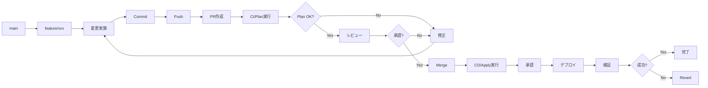

# 16. 運用管理の基礎

!!! info "この章で学ぶこと"
    Landing Zonesの日常運用と管理方法を学びます：

    1. 日常運用タスク
    2. 変更管理フロー
    3. リソースの追加・削除
    4. ポリシーの更新管理

    この章で、安定した運用ができるようになります。

---

## Part 1: 日常運用タスク

### Management Groupのモニタリング

Management Groupの状態を日常的に確認します。

=== "構造確認"

    ```bash title="Management Group階層の確認"
    az account management-group show \
      --name alz \
      --expand \
      --recurse
    ```
    
    **確認ポイント**:
    
    - ✅ Management Group構造が正しいか
    - ✅ Subscriptionが適切なMGに配置されているか
    - ✅ 想定外のMGが作成されていないか

=== "Subscription配置確認"

    ```bash title="Subscription一覧"
    az account list --output table
    ```
    
    ```bash title="特定MGのSubscription確認"
    az account management-group subscription show-sub-under-mg \
      --name alz-landingzones \
      --output table
    ```
    
    **チェック項目**:
    
    - Subscriptionが正しいMGに所属しているか
    - 新規Subscriptionが適切に配置されているか

=== "異常検知"

    ```bash title="最近の変更確認"
    az monitor activity-log list \
      --resource-group alz-management-rg \
      --start-time 2026-01-19T00:00:00Z \
      --query "[?contains(operationName.value, 'Microsoft.Management')]" \
      --output table
    ```
    
    Management Group関連の変更を確認します。

### Policy準拠状況のチェック

ポリシーの準拠状況を定期的に確認します。

=== "全体サマリー"

    ```bash title="準拠状況サマリー"
    az policy state summarize \
      --management-group alz
    ```
    
    ```json title="出力例"
    {
      "policyAssignments": [
        {
          "policyAssignmentId": ".../Deny-PublicIP",
          "results": {
            "nonCompliantResources": 3,
            "nonCompliantPolicies": 1
          }
        }
      ]
    }
    ```

=== "非準拠リソースの特定"

    ```bash title="非準拠リソース一覧"
    az policy state list \
      --management-group alz \
      --filter "complianceState eq 'NonCompliant'" \
      --output table
    ```
    
    ```bash title="特定ポリシーの非準拠リソース"
    az policy state list \
      --policy-assignment "Deny-PublicIP" \
      --filter "complianceState eq 'NonCompliant'"
    ```

=== "対応アクション"

    **非準拠の場合の対応**:
    
    1. **リソースを修正**: ポリシーに準拠するよう変更
    2. **除外設定**: 正当な理由がある場合は除外
    3. **ポリシー見直し**: ポリシー自体が不適切な場合は修正
    
    ```bash title="除外設定の例"
    az policy exemption create \
      --name "legacy-system-exemption" \
      --policy-assignment "/providers/Microsoft.Management/managementGroups/alz/providers/Microsoft.Authorization/policyAssignments/Deny-PublicIP" \
      --scope "/subscriptions/<sub-id>/resourceGroups/legacy-rg" \
      --exemption-category "Waiver" \
      --expires-on "2026-12-31T23:59:59Z"
    ```

### ログの定期確認

ログを定期的に確認します。

=== "Activity Log"

    ```bash title="過去24時間の操作"
    az monitor activity-log list \
      --start-time $(date -u -d '24 hours ago' '+%Y-%m-%dT%H:%M:%SZ') \
      --query "[?level=='Error' || level=='Warning']" \
      --output table
    ```
    
    エラーや警告を確認します。

=== "Log Analyticsクエリ"

    ```bash title="ネットワークエラーの確認"
    az monitor log-analytics query \
      --workspace <workspace-id> \
      --analytics-query "
        AzureDiagnostics
        | where TimeGenerated > ago(24h)
        | where Category == 'AzureFirewallApplicationRule' or Category == 'AzureFirewallNetworkRule'
        | where msg_s contains 'Deny'
        | summarize count() by msg_s
        | order by count_ desc
      "
    ```

=== "Firewallログ"

    ```bash title="Firewall拒否ログ"
    az monitor log-analytics query \
      --workspace <workspace-id> \
      --analytics-query "
        AzureMetrics
        | where ResourceProvider == 'MICROSOFT.NETWORK'
        | where ResourceId contains 'azurefirewalls'
        | where TimeGenerated > ago(1h)
        | summarize count() by bin(TimeGenerated, 5m)
      "
    ```

### アラート対応

アラートが発生した際の対応手順です。

=== "アラート確認"

    ```bash title="発火中のアラート"
    az monitor alert list \
      --query "[?properties.enabled=='true' && properties.condition.allOf[0].threshold]" \
      --output table
    ```

=== "対応フロー"

    ```mermaid
    graph TD
        A[アラート受信] --> B{重大度は?}
        B -->|Critical| C[即座に対応]
        B -->|Warning| D[営業時間内に対応]
        B -->|Info| E[定期メンテで対応]
        
        C --> F[原因調査]
        D --> F
        E --> F
        
        F --> G{解決可能?}
        G -->|Yes| H[対処実施]
        G -->|No| I[エスカレーション]
        
        H --> J[動作確認]
        J --> K[記録]
        I --> K
    ```

=== "記録テンプレート"

    ```markdown title="インシデント記録"
    ## インシデント: #001
    
    **発生日時**: 2026-01-20 10:30 JST
    **検知方法**: Azure Monitor Alert
    **重大度**: Warning
    **対応者**: 山田太郎
    
    ### 症状
    - Firewallのトラフィック拒否が急増
    - 影響範囲: App Spoke VNet
    
    ### 原因
    - 新規デプロイしたアプリケーションがインターネットアクセスを試行
    - Firewallルールに該当ルールなし
    
    ### 対処
    - Firewallルールを追加（PR #123）
    - 10:45に適用完了
    
    ### 再発防止
    - デプロイ前のネットワーク要件確認を徹底
    - チェックリストに追加
    ```

### 定期メンテナンス

定期的に実施するメンテナンスタスクです。

=== "週次タスク"

    **毎週月曜 9:00**:
    
    - [ ] Policy準拠状況の確認
    - [ ] 非準拠リソースの棚卸し
    - [ ] Firewallログの確認
    - [ ] コスト異常の確認
    
    ```bash title="週次チェックスクリプト"
    #!/bin/bash
    # weekly-check.sh
    
    echo "=== Policy準拠状況 ==="
    az policy state summarize --management-group alz
    
    echo "=== 非準拠リソース ==="
    az policy state list \
      --management-group alz \
      --filter "complianceState eq 'NonCompliant'" \
      --output table
    
    echo "=== コスト確認 ==="
    az consumption usage list \
      --start-date $(date -d '7 days ago' '+%Y-%m-%d') \
      --end-date $(date '+%Y-%m-%d')
    ```

=== "月次タスク"

    **毎月1日 9:00**:
    
    - [ ] Subscription配置の確認
    - [ ] リソースタグの棚卸し
    - [ ] 未使用リソースの確認
    - [ ] バックアップ状況の確認
    - [ ] セキュリティ設定の見直し
    - [ ] コストレポートの作成
    
    ```bash title="月次チェックスクリプト"
    #!/bin/bash
    # monthly-check.sh
    
    echo "=== タグなしリソース ==="
    az resource list \
      --query "[?tags==null].{Name:name, Type:type, RG:resourceGroup}" \
      --output table
    
    echo "=== 未使用Public IP ==="
    az network public-ip list \
      --query "[?ipConfiguration==null].{Name:name, RG:resourceGroup}" \
      --output table
    ```

=== "四半期タスク"

    **3ヶ月ごと**:
    
    - [ ] Management Group構造の見直し
    - [ ] ポリシーの有効性評価
    - [ ] ネットワーク設計の見直し
    - [ ] 運用ドキュメントの更新
    - [ ] DR訓練の実施

!!! tip "自動化のススメ"
    これらのタスクはGitHub Actionsで自動化できます。Chapter 17で詳しく説明します。

---

## Part 2: 変更管理フロー

### 変更リクエストの受付

変更リクエストを受け付ける際のプロセスです。

=== "変更リクエストテンプレート"

    ```markdown title=".github/ISSUE_TEMPLATE/change-request.md"
    ---
    name: 変更リクエスト
    about: Landing Zonesへの変更を申請
    title: '[変更] '
    labels: change-request
    assignees: ''
    ---
    
    ## 変更概要
    
    <!-- 何を変更するか簡潔に記載 -->
    
    ## 変更理由
    
    <!-- なぜこの変更が必要か -->
    
    ## 影響範囲
    
    - [ ] Management Group
    - [ ] Policy
    - [ ] Networking
    - [ ] Management Resources
    - [ ] その他: ___________
    
    ## 変更対象
    
    - Subscription: 
    - Resource Group: 
    - リソース: 
    
    ## 緊急度
    
    - [ ] 緊急（即日対応）
    - [ ] 高（1週間以内）
    - [ ] 中（2週間以内）
    - [ ] 低（1ヶ月以内）
    
    ## 変更予定日時
    
    YYYY-MM-DD HH:MM JST
    
    ## ロールバック計画
    
    <!-- 問題発生時の戻し方 -->
    ```

=== "レビュー基準"

    **承認条件**:
    
    - ✅ 変更理由が明確
    - ✅ 影響範囲が特定されている
    - ✅ ロールバック計画がある
    - ✅ テスト計画がある
    - ✅ セキュリティレビュー完了
    - ✅ 承認者の承認を得ている
    
    **却下理由**:
    
    - ❌ 影響範囲が不明
    - ❌ ロールバック計画なし
    - ❌ セキュリティリスクあり
    - ❌ ポリシー違反

### Branch→PR→Reviewフロー

GitHubでの変更フローです。



=== "Feature Branch作成"

    ```bash title="ブランチ作成"
    git checkout main
    git pull origin main
    git checkout -b feature/add-spoke-vnet
    ```

=== "変更実施"

    ```bash title="変更とコミット"
    # terraform.tfvarsを編集
    vim terraform.tfvars
    
    # 変更を確認
    git diff
    
    # コミット
    git add terraform.tfvars
    git commit -m "feat: App用Spoke VNetを追加"
    
    # Push
    git push origin feature/add-spoke-vnet
    ```

=== "PR作成"

    ```markdown title="PRテンプレート"
    ## 変更内容
    
    App用Spoke VNetを追加
    
    ## 変更理由
    
    新規アプリケーションのデプロイに必要
    
    ## 影響範囲
    
    - Networking: Spoke VNet追加
    - Peering: Hub VNetとのPeering追加
    
    ## テスト計画
    
    - [ ] CI/Planの確認
    - [ ] 疎通テスト
    
    ## チェックリスト
    
    - [x] tfvarsファイルを変更
    - [x] ローカルでPlan実行
    - [x] ドキュメント更新
    - [ ] レビュー完了
    - [ ] 承認完了
    
    ## 関連Issue
    
    Closes #123
    ```

### Terraform Plan確認

PRで実行されるPlanを確認します。

=== "Plan出力の確認"

    GitHub ActionsのCI実行結果を確認：
    
    ```text title="Plan Summary"
    Plan: 5 to add, 0 to change, 0 to destroy.
    
    + azurerm_virtual_network.app_spoke
    + azurerm_subnet.app_subnet
    + azurerm_virtual_network_peering.hub_to_app
    + azurerm_virtual_network_peering.app_to_hub
    + azurerm_route_table.app_routes
    ```

=== "確認ポイント"

    **必ず確認すること**:
    
    - ✅ 意図したリソースが追加されるか
    - ✅ 想定外の変更がないか
    - ✅ 削除されるリソースがないか
    - ✅ 依存関係が正しいか
    - ✅ 名前やタグが正しいか
    
    **警告サイン**:
    
    - ⚠️ `destroy` が含まれている
    - ⚠️ `to change` の数が多い
    - ⚠️ 意図しないリソースが含まれる

=== "コメントでの承認"

    ```markdown title="PR承認コメント"
    ## レビュー結果
    
    ✅ Plan確認完了
    
    ### 確認事項
    - [x] Spoke VNet: 10.1.0.0/16
    - [x] Subnet: app-subnet (10.1.0.0/24)
    - [x] Peering: 双方向
    - [x] Route Table: Hub Firewall経由
    
    ### 懸念事項
    なし
    
    承認します。マージしてください。
    ```

### Approval Process

本番適用の承認プロセスです。

=== "承認フロー"

    ```mermaid
    graph TD
        A[PR Merge] --> B[CD Workflow起動]
        B --> C[Plan実行]
        C --> D[承認待ち]
        D --> E{承認者確認}
        E -->|承認| F[Apply実行]
        E -->|却下| G[中止]
        F --> H[デプロイ完了]
        H --> I[通知]
    ```

=== "承認者の確認事項"

    **承認前チェックリスト**:
    
    - [ ] PRのレビューが完了しているか
    - [ ] Plan出力を確認したか
    - [ ] 影響範囲を理解しているか
    - [ ] ロールバック計画があるか
    - [ ] 変更時間帯は適切か
    - [ ] 関係者に通知済みか
    
    **承認コメント例**:
    
    ```text
    Plan確認しました。
    - 追加: 5リソース
    - 変更: 0リソース
    - 削除: 0リソース
    
    影響範囲: Networkingのみ
    ロールバック: Revert可能
    
    承認します。
    ```

=== "却下理由例"

    ```text
    以下の理由により却下します：
    
    ❌ 想定外のリソース削除が含まれている
    ❌ 変更時間帯が営業時間内（業務影響あり）
    ❌ ロールバック計画が不明瞭
    
    修正後、再度レビュー依頼してください。
    ```

### 変更履歴の管理

変更履歴を記録します。

=== "Gitログ"

    ```bash title="変更履歴確認"
    git log --oneline --graph --decorate --all
    ```
    
    ```text title="出力例"
    * a1b2c3d (HEAD -> main) feat: App用Spoke VNetを追加
    * d4e5f6g feat: SAP用Management Groupを追加
    * g7h8i9j fix: Firewallルールを修正
    * j0k1l2m feat: 環境タグ必須ポリシーを追加
    ```

=== "CHANGELOG.md"

    ```markdown title="CHANGELOG.md"
    # Changelog
    
    ## [1.2.0] - 2026-01-20
    
    ### Added
    - App用Spoke VNetを追加 (#123)
    - SAP用Management Groupを追加 (#120)
    
    ### Fixed
    - Firewallルールの誤設定を修正 (#121)
    
    ### Changed
    - Hub VNetのアドレス空間を拡張 (#122)
    
    ## [1.1.0] - 2026-01-15
    
    ### Added
    - 環境タグ必須ポリシーを追加 (#115)
    ```

=== "Release作成"

    ```bash title="Gitタグ作成"
    git tag -a v1.2.0 -m "Release v1.2.0: Spoke VNet追加"
    git push origin v1.2.0
    ```
    
    GitHubでReleaseを作成します。

!!! tip "変更管理のベストプラクティス"
    - 小さい変更から始める
    - 1つのPRで1つの変更
    - テスト環境で事前検証
    - ピーク時間を避ける
    - ロールバック計画を必ず用意

---

## Part 3: リソースの追加・削除

### 新規Subscriptionの追加

新しいSubscriptionをLanding Zonesに追加します。

=== "追加手順"

    **1. Subscriptionの準備**:
    
    ```bash title="Subscription作成"
    # Subscriptionが既に存在する前提
    az account show --subscription <new-subscription-id>
    ```
    
    **2. terraform.tfvarsに追加**:
    
    ```hcl title="terraform.tfvars"
    subscription_id_connectivity = "xxx"
    subscription_id_identity = "xxx"
    subscription_id_management = "xxx"
    
    # 新規追加
    landing_zone_subscriptions = {
      app-prod = {
        subscription_id = "<new-subscription-id>"
        management_group_id = "alz-landingzones-corp"
      }
    }
    ```

=== "Management Groupへの配置"

    ```bash title="featureブランチで作業"
    git checkout -b feature/add-app-prod-subscription
    
    # terraform.tfvars編集
    vim terraform.tfvars
    
    git add terraform.tfvars
    git commit -m "feat: App本番環境のSubscriptionを追加"
    git push origin feature/add-app-prod-subscription
    
    # PR作成 → レビュー → マージ
    ```

=== "デプロイ後の確認"

    ```bash title="配置確認"
    az account management-group subscription show \
      --name alz-landingzones-corp \
      --subscription <new-subscription-id>
    ```
    
    **確認項目**:
    
    - ✅ 正しいManagement Groupに配置
    - ✅ ポリシーが継承されている
    - ✅ タグが設定されている

### Spoke VNetの追加

新しいSpoke VNetを追加します。

=== "設計"

    **決定事項**:
    
    - VNet名: `app-prod-vnet`
    - アドレス空間: `10.10.0.0/16`
    - リージョン: `japaneast`
    - Subnet:
      - `app-subnet`: `10.10.0.0/24`
      - `data-subnet`: `10.10.1.0/24`

=== "terraform.tfvars編集"

    ```hcl title="terraform.tfvars"
    connectivity_resources_config = {
      hub_networks = {
        # ... 既存設定 ...
      }
      spoke_networks = {
        # 既存Spoke
        existing-spoke = {
          # ...
        }
        
        # 新規追加
        app-prod = {
          name = "app-prod-vnet"
          address_space = ["10.10.0.0/16"]
          location = "japaneast"
          resource_group_name = "app-prod-network-rg"
          hub_network_key = "japaneast"
          
          subnets = {
            app-subnet = {
              address_prefix = "10.10.0.0/24"
            }
            data-subnet = {
              address_prefix = "10.10.1.0/24"
            }
          }
          
          tags = {
            Environment = "Production"
            Application = "App"
          }
        }
      }
    }
    ```

=== "デプロイと確認"

    ```bash title="デプロイ後の確認"
    # VNet確認
    az network vnet show \
      --name app-prod-vnet \
      --resource-group app-prod-network-rg
    
    # Peering確認
    az network vnet peering list \
      --vnet-name app-prod-vnet \
      --resource-group app-prod-network-rg \
      --output table
    
    # 疎通テスト
    # Spoke内のVMからインターネット疎通を確認
    ```

### Management Groupの追加

新しいManagement Groupを追加します。

=== "lib/architecture_definitions編集"

    ```yaml title="lib/architecture_definitions/alz_custom.yaml"
    name: alz_custom
    base_archetype: alz
    
    management_groups:
      alz:
        display_name: Azure Landing Zones
        children:
          alz-platform:
            # ... 既存設定 ...
          
          alz-landingzones:
            display_name: Landing Zones
            children:
              alz-corp:
                display_name: Corp
              alz-online:
                display_name: Online
              
              # 新規追加
              alz-sap:
                display_name: SAP
                archetype_name: corp_custom
    ```

=== "archetype定義作成"

    ```yaml title="lib/archetype_definitions/sap_custom.yaml"
    name: sap_custom
    base_archetype: corp
    
    policy_assignments_to_add:
      - Deny-PublicIP
      - Require-Tag-Environment
      - Deploy-VM-Monitoring
    ```

=== "デプロイと確認"

    ```bash title="Management Group確認"
    az account management-group show \
      --name alz-sap \
      --expand \
      --recurse
    ```

### リソースの削除手順

リソースを安全に削除します。

=== "削除前の確認"

    **チェックリスト**:
    
    - [ ] 削除対象リソースの特定
    - [ ] 依存リソースの確認
    - [ ] 影響範囲の評価
    - [ ] バックアップの取得
    - [ ] ロールバック計画の作成
    - [ ] 関係者への通知

=== "削除手順（Spoke VNet例）"

    ```bash title="1. 依存関係確認"
    # VNet内のリソース確認
    az resource list \
      --resource-group app-prod-network-rg \
      --output table
    
    # Peeringの確認
    az network vnet peering list \
      --vnet-name app-prod-vnet \
      --resource-group app-prod-network-rg
    ```
    
    ```hcl title="2. terraform.tfvarsから削除"
    connectivity_resources_config = {
      spoke_networks = {
        # app-prod を削除（コメントアウト）
        # app-prod = {
        #   ...
        # }
      }
    }
    ```
    
    ```bash title="3. PR作成とデプロイ"
    git checkout -b feature/remove-app-prod-vnet
    git add terraform.tfvars
    git commit -m "feat: app-prod-vnetを削除"
    git push origin feature/remove-app-prod-vnet
    
    # PR作成 → Plan確認 → マージ → Apply
    ```

=== "削除後の確認"

    ```bash title="削除確認"
    # VNetが存在しないことを確認
    az network vnet show \
      --name app-prod-vnet \
      --resource-group app-prod-network-rg
    # → ResourceNotFound
    
    # Resource Groupも削除されたか確認
    az group show --name app-prod-network-rg
    # → ResourceNotFound
    ```

### 依存関係の考慮

リソース削除時の依存関係に注意します。

=== "依存関係マップ"

    ```mermaid
    graph TD
        A[Subscription] --> B[Management Group]
        B --> C[Policy割り当て]
        
        D[Hub VNet] --> E[Spoke VNet]
        E --> F[Peering]
        E --> G[VM]
        E --> H[AKS]
        
        I[Route Table] --> E
        J[NSG] --> E
    ```

=== "削除順序"

    **正しい削除順序**:
    
    1. 最下層のリソースから削除
       - VM、AKS等のコンピュートリソース
    2. ネットワークリソース
       - Peering
       - Spoke VNet
    3. 管理リソース
       - Route Table、NSG
    4. Management Group
       - Subscriptionを移動後に削除
    5. Policy割り当て
       - Management Group削除の最後
    
    **間違った削除順序**:
    
    ❌ Spoke VNetを削除する前にPeeringを削除
    ❌ Management Groupを削除する前にSubscriptionを移動していない

=== "強制削除（最終手段）"

    ```bash title="Terraform Stateから削除"
    # Terraformの管理から外す（実リソースは残る）
    terraform state rm azurerm_virtual_network.app_prod
    
    # 手動でリソース削除
    az network vnet delete \
      --name app-prod-vnet \
      --resource-group app-prod-network-rg
    ```
    
    !!! danger "注意"
        強制削除はState不整合の原因になります。最終手段としてのみ使用してください。

---

## Part 4: ポリシーの更新管理

### ポリシー定義の追加

新しいポリシーを追加します。

=== "ポリシー定義ファイル作成"

    ```json title="lib/policy_definitions/Require-Backup-Tag.json"
    {
      "name": "Require-Backup-Tag",
      "type": "Microsoft.Authorization/policyDefinitions",
      "properties": {
        "displayName": "Require Backup tag on VMs",
        "policyType": "Custom",
        "mode": "Indexed",
        "description": "Requires Backup tag on all Virtual Machines",
        "metadata": {
          "category": "Compute",
          "version": "1.0.0"
        },
        "parameters": {
          "effect": {
            "type": "String",
            "defaultValue": "Audit",
            "allowedValues": [
              "Audit",
              "Deny",
              "Disabled"
            ],
            "metadata": {
              "displayName": "Effect",
              "description": "The effect determines what happens when the policy rule is evaluated to match"
            }
          }
        },
        "policyRule": {
          "if": {
            "allOf": [
              {
                "field": "type",
                "equals": "Microsoft.Compute/virtualMachines"
              },
              {
                "field": "tags['Backup']",
                "exists": "false"
              }
            ]
          },
          "then": {
            "effect": "[parameters('effect')]"
          }
        }
      }
    }
    ```

=== "libフォルダに配置"

    ```bash title="ファイル配置"
    # ポリシー定義を配置
    cp Require-Backup-Tag.json \
      lib/policy_definitions/
    
    # Git管理下に追加
    git add lib/policy_definitions/Require-Backup-Tag.json
    git commit -m "feat: Backupタグ必須ポリシーを追加"
    ```

=== "デプロイ"

    ```bash title="PR作成"
    git push origin feature/add-backup-policy
    
    # PR作成 → レビュー → マージ → デプロイ
    ```

### ポリシー割り当ての変更

ポリシーの割り当てを変更します。

=== "archetype定義に追加"

    ```yaml title="lib/archetype_definitions/landingzones_custom.yaml"
    name: landingzones_custom
    base_archetype: default
    
    policy_assignments_to_add:
      - Require-Backup-Tag  # 新規追加
      - Require-Tag-Environment
    
    policy_assignment_properties:
      Require-Backup-Tag:
        enforcement_mode: DoNotEnforce  # 最初は監視のみ
        parameters:
          effect:
            value: "Audit"
    ```

=== "段階的な適用"

    **フェーズ1: 監視モード（1ヶ月）**:
    
    ```yaml
    enforcement_mode: DoNotEnforce
    parameters:
      effect:
        value: "Audit"
    ```
    
    非準拠リソースを洗い出し。
    
    **フェーズ2: 警告モード（1ヶ月）**:
    
    ```yaml
    enforcement_mode: Default
    parameters:
      effect:
        value: "Audit"
    ```
    
    準拠を促進。
    
    **フェーズ3: 強制モード**:
    
    ```yaml
    enforcement_mode: Default
    parameters:
      effect:
        value: "Deny"
    ```
    
    新規リソースは必須化。

=== "影響確認"

    ```bash title="準拠状況確認"
    az policy state list \
      --policy-assignment "Require-Backup-Tag" \
      --filter "complianceState eq 'NonCompliant'" \
      --output table
    ```

### Exclusion（除外）管理

ポリシーの除外を管理します。

=== "除外設定の追加"

    ```bash title="特定リソースを除外"
    az policy exemption create \
      --name "test-vm-exemption" \
      --policy-assignment "/providers/Microsoft.Management/managementGroups/alz/providers/Microsoft.Authorization/policyAssignments/Require-Backup-Tag" \
      --scope "/subscriptions/<sub-id>/resourceGroups/test-rg/providers/Microsoft.Compute/virtualMachines/test-vm" \
      --exemption-category "Waiver" \
      --description "テスト環境のため除外" \
      --expires-on "2026-12-31T23:59:59Z"
    ```

=== "除外理由のカテゴリ"

    | カテゴリ | 用途 |
    |---------|------|
    | **Waiver** | 正当な理由による除外（ビジネス要件） |
    | **Mitigated** | 別の方法で対応済み |
    
    **Waiver例**:
    - レガシーシステム（移行計画あり）
    - 外部ベンダー管理リソース
    
    **Mitigated例**:
    - オンプレでバックアップ取得済み
    - 別のバックアップソリューション使用

=== "除外の定期レビュー"

    ```bash title="除外一覧確認"
    az policy exemption list \
      --query "[].{Name:name, Expires:expiresOn, Category:exemptionCategory}" \
      --output table
    ```
    
    **レビュー項目**:
    
    - 有効期限切れの除外を削除
    - 理由が依然有効か確認
    - 除外が不要になっていないか確認

### ポリシーの無効化・削除

ポリシーを無効化または削除します。

=== "一時無効化"

    ```yaml title="archetype定義で無効化"
    policy_assignment_properties:
      Require-Backup-Tag:
        enforcement_mode: DoNotEnforce  # 無効化
    ```
    
    または：
    
    ```bash title="Azure CLIで無効化"
    az policy assignment update \
      --name "Require-Backup-Tag" \
      --enforcement-mode DoNotEnforce
    ```

=== "割り当て削除"

    ```yaml title="archetype定義から削除"
    policy_assignments_to_remove:
      - Require-Backup-Tag  # 削除対象に追加
    ```
    
    ```bash
    git add lib/archetype_definitions/
    git commit -m "feat: Backupタグポリシーの割り当てを削除"
    # PR → マージ → デプロイ
    ```

=== "定義自体を削除"

    ```bash title="定義ファイル削除"
    git rm lib/policy_definitions/Require-Backup-Tag.json
    git commit -m "feat: Backupタグポリシー定義を削除"
    # PR → マージ → デプロイ
    ```
    
    !!! warning "注意"
        - 割り当てを先に削除
        - 定義削除は最後

### カスタムポリシーの作成

独自のポリシーを作成します。

=== "要件定義"

    **例: 特定リージョン限定ポリシー**
    
    - 目的: コストとコンプライアンスのため、japaneastとjapanwestのみ許可
    - 対象: すべてのリソース
    - 効果: Deny

=== "ポリシー定義作成"

    ```json title="lib/policy_definitions/Allowed-Locations.json"
    {
      "name": "Allowed-Locations",
      "type": "Microsoft.Authorization/policyDefinitions",
      "properties": {
        "displayName": "Allowed locations for resources",
        "policyType": "Custom",
        "mode": "Indexed",
        "description": "This policy restricts locations where resources can be deployed",
        "metadata": {
          "category": "General"
        },
        "parameters": {
          "listOfAllowedLocations": {
            "type": "Array",
            "metadata": {
              "displayName": "Allowed locations",
              "description": "The list of locations that resources can be deployed to",
              "strongType": "location"
            }
          }
        },
        "policyRule": {
          "if": {
            "not": {
              "field": "location",
              "in": "[parameters('listOfAllowedLocations')]"
            }
          },
          "then": {
            "effect": "deny"
          }
        }
      }
    }
    ```

=== "割り当て設定"

    ```yaml title="lib/archetype_definitions/root_custom.yaml"
    name: root_custom
    base_archetype: root
    
    policy_assignments_to_add:
      - Allowed-Locations
    
    policy_assignment_properties:
      Allowed-Locations:
        enforcement_mode: Default
        parameters:
          listOfAllowedLocations:
            value:
              - "japaneast"
              - "japanwest"
    ```

=== "テストとデプロイ"

    ```bash title="デプロイ"
    git add lib/policy_definitions/Allowed-Locations.json
    git add lib/archetype_definitions/root_custom.yaml
    git commit -m "feat: 許可リージョン制限ポリシーを追加"
    git push origin feature/add-location-policy
    
    # PR → レビュー → マージ → デプロイ
    ```
    
    ```bash title="動作確認"
    # 許可されていないリージョンでリソース作成を試みる
    az vm create \
      --name test-vm \
      --resource-group test-rg \
      --location koreacentral  # 許可されていないリージョン
    # → Error: Policy violation
    ```

---

## まとめ

この章で学んだこと：

### ✅ Part 1: 日常運用タスク

- Management Groupのモニタリング
- Policy準拠状況のチェック
- ログの定期確認
- アラート対応
- 定期メンテナンス

### ✅ Part 2: 変更管理フロー

- 変更リクエストの受付
- Branch→PR→Reviewフロー
- Terraform Plan確認
- Approval Process
- 変更履歴の管理

### ✅ Part 3: リソースの追加・削除

- 新規Subscriptionの追加
- Spoke VNetの追加
- Management Groupの追加
- リソースの削除手順
- 依存関係の考慮

### ✅ Part 4: ポリシーの更新管理

- ポリシー定義の追加
- ポリシー割り当ての変更
- Exclusion（除外）管理
- ポリシーの無効化・削除
- カスタムポリシーの作成

次の章では、運用の自動化と効率化について学びます。

## 練習問題

理解度チェックです。休憩中に考えてみましょう。

### 問題1
新しいリソースグループを追加する際の正しい手順は何ですか？

### 問題2
`terraform plan`と`terraform apply`の違いは何ですか？

### 問題3
ポリシー定義を更新する際に注意すべきことは何ですか？

---

## 練習問題の答え

### 答え1
正しい手順:

1. **ブランチ作成**
   ```bash
   git checkout -b feature/add-resource-group
   ```

2. **tfvarsファイル編集**
   ```hcl
   resource_group_config = {
     # 既存のRG
     "rg-management-jp" = { ... }
     
     # 新しいRG
     "rg-app-jp" = {
       location = "japaneast"
       tags = {
         environment = "prod"
         application = "myapp"
       }
     }
   }
   ```

3. **ローカルでplan確認**
   ```bash
   terraform plan
   ```

4. **Pull Request作成**
   ```bash
   git add .
   git commit -m "feat: Add app resource group"
   git push origin feature/add-resource-group
   ```

5. **レビュー承認後、マージ**

6. **GitHub Actionsで自動デプロイ**

### 答え2

| コマンド | 動作 | 実行結果 |
|----------|------|----------|
| `terraform plan` | **変更内容のプレビュー** | リソースは変更されない |
| `terraform apply` | **実際に変更を適用** | リソースが作成・変更・削除される |

**planの出力例:**
```
Terraform will perform the following actions:

  # azurerm_resource_group.app will be created
  + resource "azurerm_resource_group" "app" {
      + name     = "rg-app-jp"
      + location = "japaneast"
    }

Plan: 1 to add, 0 to change, 0 to destroy.
```

**必ずplanで確認してからapply**しましょう。

### 答え3

1. **既存リソースへの影響を確認**
   ```bash
   terraform plan
   ```
   ポリシー更新が既存リソースに影響する場合、Non-compliantになる可能性があります。

2. **段階的なロールアウト**
   ```
   1. まず監査モード（audit）で実施
   2. Non-compliant リソースを確認
   3. 修正後、強制モード（deny）に変更
   ```

3. **除外設定の確認**
   ```hcl
   not_scopes = [
     "/subscriptions/xxx/resourceGroups/rg-exception"
   ]
   ```
   特定のリソースをポリシーから除外できます。

4. **ドキュメント更新**
   - ポリシー変更の理由
   - 影響範囲
   - ロールバック手順

!!! tip "次の章へ"
    [Chapter 17: 運用の自動化と効率化](17_運用の自動化と効率化.md)で、自動化やモニタリングを学びます。
